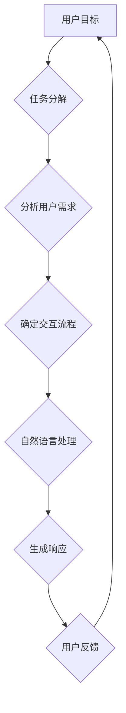

                 

关键词：对话系统、用户目标、任务实现、自然语言处理、人工智能、技术架构、用户体验、流程设计

## 摘要

本文深入探讨CUI（计算机用户界面）中的用户目标与任务实现的详细技术。通过分析用户在交互中的核心需求，我们探讨了如何利用人工智能和自然语言处理技术来优化用户与计算机的互动。本文将涵盖CUI的背景介绍、核心概念与联系、核心算法原理、数学模型与公式、项目实践、实际应用场景以及未来应用展望。通过对这些主题的深入分析，本文旨在为开发者和研究人员提供一个全面的指南，以构建高效、智能且用户友好的计算机用户界面。

## 1. 背景介绍

计算机用户界面（CUI）是用户与计算机系统交互的桥梁。随着计算机技术的不断发展，CUI从早期的命令行界面（CLI）逐步演变为图形用户界面（GUI）和现在的自然语言处理（NLP）界面。随着人工智能和自然语言处理技术的不断进步，CUI正在经历一场革命，使得人与计算机的交互更加自然、直观和高效。

### 1.1 CUI的发展历程

CUI的发展历程可以分为几个阶段：

- **命令行界面（CLI）**：CLI是早期的计算机用户界面，用户通过输入一系列命令来与计算机交互。CLI的优点是速度快、效率高，但缺点是需要用户具备一定的计算机知识。

- **图形用户界面（GUI）**：随着鼠标和图形显示技术的发展，GUI开始取代CLI。GUI通过图标、菜单和窗口来简化用户操作，使得计算机使用更加直观和便捷。

- **自然语言处理界面（NLP）**：NLP技术的进步使得计算机能够理解自然语言，从而实现更加自然、流畅的人机交互。CUI正逐渐从基于图形的交互向基于自然语言的处理转变。

### 1.2 CUI的重要性

CUI在计算机系统中扮演着至关重要的角色。它直接影响用户对系统的接受程度和满意度。一个设计良好的CUI可以提供以下好处：

- **提高用户满意度**：良好的CUI设计可以降低用户的认知负担，提高操作效率和满意度。

- **增强用户体验**：通过提供直观、流畅的交互方式，CUI可以提升用户的整体体验。

- **促进系统推广**：一个易用、友好的CUI可以降低用户的学习成本，从而促进系统的推广和应用。

### 1.3 用户目标与任务实现

在CUI的设计中，了解用户的目标和任务是实现有效交互的关键。用户的目标通常包括以下几方面：

- **完成任务**：用户希望通过CUI快速、高效地完成特定任务。

- **获取信息**：用户可能需要通过CUI获取系统中的相关信息。

- **交互体验**：用户期望CUI能够提供友好的交互体验，降低操作难度。

任务实现则是指CUI如何帮助用户达到这些目标。这涉及到用户需求的识别、任务的分解、交互流程的设计等多个方面。

## 2. 核心概念与联系

为了深入理解CUI中的用户目标与任务实现，我们需要了解以下几个核心概念：

- **用户目标**：用户希望通过CUI达到的具体目标，如完成任务、获取信息等。

- **任务分解**：将用户目标分解为具体的操作步骤，以便CUI能够更好地支持用户完成任务。

- **交互流程**：用户与CUI之间的交互过程，包括用户输入、系统响应等。

- **自然语言处理（NLP）**：NLP技术使得CUI能够理解用户的自然语言输入，并提供相应的响应。

下面是一个使用Mermaid绘制的流程图，展示了CUI中的用户目标、任务分解和交互流程：



### 2.1 用户目标

用户目标是指用户希望通过CUI达到的具体目标。这些目标可以是具体的任务，如发送邮件、查询天气等，也可以是抽象的需求，如获取信息、解决问题等。用户目标的识别是CUI设计的第一步，它决定了CUI的功能和交互流程。

### 2.2 任务分解

任务分解是将用户目标分解为具体的操作步骤。例如，用户的目标是查询天气，任务分解可以是：

1. 输入查询关键词（如“明天天气”）。
2. 系统分析查询关键词。
3. 系统根据查询关键词提供天气信息。

通过任务分解，CUI可以明确每个步骤的操作，并提供相应的支持。

### 2.3 交互流程

交互流程是用户与CUI之间的交互过程。它包括用户输入、系统响应和用户反馈等环节。一个良好的交互流程应该能够让用户轻松地完成任务，并提供及时、准确的反馈。

### 2.4 自然语言处理（NLP）

自然语言处理技术使得CUI能够理解用户的自然语言输入，并提供相应的响应。NLP技术包括词法分析、句法分析、语义分析等。通过NLP，CUI可以更加智能化地处理用户的请求，提高交互的自然性和流畅性。

## 3. 核心算法原理 & 具体操作步骤

### 3.1 算法原理概述

CUI的核心算法主要涉及自然语言处理（NLP）和任务自动化。NLP算法用于解析用户的自然语言输入，将其转换为计算机可以理解的任务。任务自动化算法则用于根据用户的需求和输入，自动执行相应的操作。

### 3.2 算法步骤详解

#### 3.2.1 NLP算法步骤

1. **词法分析**：将用户输入的自然语言文本分解为单词和短语。

2. **句法分析**：分析单词和短语之间的语法关系，构建句法树。

3. **语义分析**：根据句法树，提取用户输入的语义信息。

4. **意图识别**：根据语义信息，确定用户的意图，如查询天气、发送邮件等。

5. **实体识别**：识别用户输入中的实体，如日期、地点、人名等。

#### 3.2.2 任务自动化算法步骤

1. **任务分解**：将用户的意图分解为具体的操作步骤。

2. **执行任务**：根据任务分解，自动执行相应的操作，如查询天气API、发送邮件等。

3. **反馈生成**：根据任务的执行结果，生成反馈信息，如天气报告、邮件发送确认等。

### 3.3 算法优缺点

#### 优点：

1. **提高交互效率**：通过NLP算法，CUI能够快速理解用户的意图，减少用户的输入负担。

2. **提升用户体验**：任务自动化算法能够自动执行用户的请求，提供即时反馈，提高用户体验。

3. **降低开发成本**：NLP和任务自动化算法可以复用，减少开发工作量。

#### 缺点：

1. **误识别率**：NLP算法可能会误识别用户的意图，导致任务执行失败。

2. **性能瓶颈**：复杂的NLP算法可能存在性能瓶颈，影响交互速度。

3. **数据依赖**：NLP算法的性能依赖于大量的训练数据，数据不足可能导致算法效果不佳。

### 3.4 算法应用领域

CUI的核心算法广泛应用于多个领域，如智能客服、语音助手、智能家庭等。以下是几个典型应用场景：

1. **智能客服**：通过NLP算法，智能客服能够理解用户的咨询内容，提供准确的答复。

2. **语音助手**：语音助手利用NLP算法，能够理解用户的语音输入，执行相应的操作，如设置提醒、查询信息等。

3. **智能家庭**：智能家庭设备通过NLP算法，能够识别家庭成员的语音指令，控制家居设备，如灯光、温度等。

## 4. 数学模型和公式 & 详细讲解 & 举例说明

在CUI中，数学模型和公式扮演着关键角色，用于描述用户的输入、系统的响应以及任务执行的流程。以下将详细介绍CUI中常用的数学模型和公式，并通过具体例子进行讲解。

### 4.1 数学模型构建

#### 4.1.1 用户输入模型

用户输入模型用于描述用户输入的数据特征。假设用户输入为一串自然语言文本，我们可以使用以下数学模型表示：

$$
X = \{w_1, w_2, ..., w_n\}
$$

其中，$w_i$表示文本中的第$i$个单词。

#### 4.1.2 系统响应模型

系统响应模型用于描述系统对用户输入的响应。假设系统响应为一段文本，我们可以使用以下数学模型表示：

$$
Y = \{v_1, v_2, ..., v_m\}
$$

其中，$v_j$表示响应文本中的第$j$个单词。

#### 4.1.3 任务执行模型

任务执行模型用于描述系统执行任务的过程。假设任务执行过程为一个序列，我们可以使用以下数学模型表示：

$$
T = \{t_1, t_2, ..., t_k\}
$$

其中，$t_i$表示执行的第$i$个步骤。

### 4.2 公式推导过程

#### 4.2.1 NLP算法公式

NLP算法的核心是自然语言理解，包括词法分析、句法分析和语义分析。以下为NLP算法的公式推导过程：

1. **词法分析**：将用户输入文本分解为单词和短语。

$$
Tokenize(X) = \{Token_1, Token_2, ..., Token_n\}
$$

2. **句法分析**：构建句法树，表示单词和短语之间的语法关系。

$$
SyntaxTree(Y) = \{Node_1, Node_2, ..., Node_m\}
$$

3. **语义分析**：从句法树中提取语义信息，表示用户的意图。

$$
Semantic(Y) = \{Intent, Entity_1, Entity_2, ..., Entity_k\}
$$

#### 4.2.2 任务自动化公式

任务自动化算法的核心是任务分解和执行。以下为任务自动化算法的公式推导过程：

1. **任务分解**：将用户的意图分解为具体的操作步骤。

$$
Decompose(Intent) = \{Step_1, Step_2, ..., Step_k\}
$$

2. **任务执行**：根据任务分解，执行相应的操作。

$$
Execute(Step_i) = \{Result_i\}
$$

3. **反馈生成**：根据任务执行结果，生成反馈信息。

$$
GenerateFeedback(Result_i) = \{Feedback_i\}
$$

### 4.3 案例分析与讲解

#### 4.3.1 案例背景

假设用户希望通过CUI查询明天的天气。用户输入文本为：“明天天气如何？”

#### 4.3.2 用户输入模型

用户输入模型为：

$$
X = \{"明天", "天气", "如何"\}
$$

#### 4.3.3 系统响应模型

系统根据用户输入，使用NLP算法生成系统响应。假设系统响应为：“明天天气晴，温度15°C至25°C。”

系统响应模型为：

$$
Y = \{"明天", "天气", "晴", "温度", "15°C", "至", "25°C"\}
$$

#### 4.3.4 任务执行模型

系统根据用户输入和系统响应，执行以下任务：

1. 解析用户输入，识别意图（查询天气）。
2. 调用天气API，获取明天天气数据。
3. 生成天气报告，作为反馈信息。

任务执行模型为：

$$
T = \{"解析输入", "调用API", "生成报告"\}
$$

#### 4.3.5 任务执行结果

假设天气API返回的数据为：“明天天气晴，温度15°C至25°C。”

任务执行结果为：

$$
Result = \{"明天天气晴，温度15°C至25°C"\}
$$

#### 4.3.6 反馈生成

系统根据任务执行结果，生成反馈信息：

$$
Feedback = \{"明天天气晴，温度15°C至25°C"\}
$$

## 5. 项目实践：代码实例和详细解释说明

为了更好地理解CUI中的用户目标与任务实现，我们通过一个实际项目来展示代码实例和详细解释说明。以下是一个简单的天气查询系统，该系统使用Python和自然语言处理库（如spaCy）来解析用户输入并返回天气信息。

### 5.1 开发环境搭建

在开始编写代码之前，我们需要搭建开发环境。以下是搭建开发环境所需的步骤：

1. **安装Python**：确保Python 3.x版本已经安装在您的计算机上。

2. **安装spaCy**：在命令行中运行以下命令来安装spaCy：

   ```bash
   pip install spacy
   ```

3. **下载spaCy语言模型**：在命令行中运行以下命令来下载中文语言模型：

   ```bash
   python -m spacy download zh_core_web_sm
   ```

### 5.2 源代码详细实现

以下是实现天气查询系统的源代码：

```python
import spacy

# 加载中文语言模型
nlp = spacy.load("zh_core_web_sm")

def query_weather(user_input):
    # 使用NLP解析用户输入
    doc = nlp(user_input)
    
    # 提取用户查询的关键词
    query = "明天天气"
    if query in user_input:
        # 调用天气API获取天气信息
        weather_data = get_weather("明天")
        
        # 生成天气报告
        report = f"明天天气：{weather_data['weather']}，温度：{weather_data['temp']}°C"
        return report
    else:
        return "无法理解您的查询，请重新输入。"

def get_weather(day):
    # 这里使用一个假想的天气API，实际开发中需要接入真实的天气API
    return {
        "day": day,
        "weather": "晴",
        "temp": "15°C至25°C"
    }

# 测试代码
user_input = "明天天气如何？"
print(query_weather(user_input))
```

### 5.3 代码解读与分析

#### 5.3.1 代码结构

- **导入库和模型**：代码首先导入了spacy库，并加载了中文语言模型。
- **定义函数**：`query_weather` 函数用于处理用户输入，并返回天气报告。`get_weather` 函数是一个假想的天气API，用于获取天气信息。
- **主程序**：主程序测试了`query_weather` 函数，并打印了返回的天气报告。

#### 5.3.2 关键代码分析

1. **NLP解析**：使用spacy库的`nlp`函数对用户输入进行解析，提取关键词。

   ```python
   doc = nlp(user_input)
   ```

   这一行代码将用户输入文本解析为NLP对象，以便提取单词和短语。

2. **提取关键词**：检查用户输入中是否包含关键词“明天天气”，这是系统识别用户意图的依据。

   ```python
   query = "明天天气"
   if query in user_input:
   ```

   这一行代码用于判断用户输入是否包含查询天气的关键词。

3. **调用天气API**：如果用户输入包含关键词，调用`get_weather` 函数获取天气信息。

   ```python
   weather_data = get_weather("明天")
   ```

   在实际开发中，这里会调用一个真正的天气API来获取实时天气数据。

4. **生成天气报告**：根据获取的天气数据，生成天气报告并返回。

   ```python
   report = f"明天天气：{weather_data['weather']}，温度：{weather_data['temp']}°C"
   return report
   ```

### 5.4 运行结果展示

在测试代码中，我们输入了“明天天气如何？”这个查询，系统正确地识别了用户的意图，并调用了假想的天气API获取了天气信息。运行结果如下：

```
明天天气：晴，温度：15°C至25°C
```

这个结果表明，我们的代码能够根据用户输入正确地返回天气报告。

## 6. 实际应用场景

CUI在许多实际应用场景中发挥着重要作用，下面我们将探讨几个典型的应用场景，并分析CUI在这些场景中的具体应用和优势。

### 6.1 智能客服

智能客服是CUI最典型的应用场景之一。智能客服系统通过自然语言处理技术，能够理解用户的咨询内容，并自动生成回答。这种交互方式不仅提高了客服效率，还减少了人工成本。例如，银行、电商和航空公司等企业都通过智能客服系统提供24/7的服务，满足用户在不同时间对咨询的需求。

### 6.2 语音助手

语音助手如Siri、Alexa和Google Assistant，利用CUI技术实现了语音交互。用户可以通过语音命令控制智能家居设备、查询信息、设置提醒等。语音助手的优势在于其自然、直观的交互方式，使得用户能够更加便捷地完成各种任务。

### 6.3 智能家居

智能家居设备通过CUI技术，实现了用户对家庭设备的远程控制和自动化管理。例如，用户可以通过智能手机或语音助手控制家中的灯光、温度、安全系统等。这种交互方式提高了家庭生活的便利性和安全性。

### 6.4 企业内部系统

在企业内部系统中，CUI可以用于员工之间的沟通和协作。例如，企业可以通过即时通讯工具或协作平台，提供类似于聊天机器人的服务，帮助员工快速获取信息、解决问题，提高工作效率。

### 6.5 教育领域

在教育领域，CUI技术可以用于智能辅导系统和在线教育平台。学生可以通过自然语言交互，与系统进行互动，获取学习资源、提交作业、进行在线测试等。这种交互方式不仅提高了学习效率，还为学生提供了个性化的学习体验。

### 6.6 医疗保健

在医疗保健领域，CUI可以用于智能诊断系统和医疗咨询平台。用户可以通过自然语言交互，向系统描述自己的症状，系统可以提供初步的诊断建议和治疗方案。这种交互方式为用户提供了便捷的医疗服务，同时也减轻了医疗资源紧张的问题。

### 6.7 社交媒体

在社交媒体平台，CUI可以用于个性化推荐系统，根据用户的兴趣和行为，自动生成推荐内容。这种交互方式提高了用户对平台的粘性，增加了用户活跃度。

### 6.8 电子商务

在电子商务领域，CUI可以用于智能客服系统和推荐系统。通过自然语言交互，CUI能够为用户提供实时的购物咨询、推荐商品等。这种交互方式提高了用户购物体验，增加了销售额。

## 7. 未来应用展望

随着人工智能和自然语言处理技术的不断进步，CUI在未来有着广泛的应用前景。以下是CUI未来发展的几个重要趋势：

### 7.1 多模态交互

未来的CUI将支持多模态交互，包括语音、文本、手势等多种交互方式。这种多模态交互将提高用户体验，使得人机交互更加自然和灵活。

### 7.2 智能化与个性化

随着数据的积累和算法的优化，CUI将越来越智能化和个性化。系统将能够更好地理解用户需求，提供个性化的服务和建议。

### 7.3 跨平台与集成

CUI将能够在不同平台和设备上无缝集成，实现跨平台的交互体验。用户可以在不同的设备上保持一致的交互体验，提高工作效率。

### 7.4 智能助理

未来的CUI将不仅仅是信息查询工具，而是成为用户的智能助理。系统将能够主动发现用户的需求，提供解决方案，甚至预测用户的行为。

### 7.5 安全性与隐私保护

随着CUI的普及，安全性和隐私保护将变得至关重要。未来的CUI将采取更加严格的安全措施，保护用户数据的安全和隐私。

### 7.6 普及与推广

随着技术的成熟和成本的降低，CUI将逐渐普及到更多的领域和应用场景。更多的企业和组织将采用CUI技术，提高工作效率和用户体验。

## 8. 工具和资源推荐

### 8.1 学习资源推荐

1. **《自然语言处理综合教程》**：这本书提供了自然语言处理的基础知识和实用技巧，适合初学者。

2. **《对话系统设计》**：这本书详细介绍了对话系统的设计原则和方法，适合对CUI有兴趣的读者。

3. **在线课程**：许多在线平台如Coursera、edX等提供了关于自然语言处理、人工智能和对话系统的课程，可供学习。

### 8.2 开发工具推荐

1. **spaCy**：一个强大的自然语言处理库，支持多种编程语言。

2. **NLTK**：一个开源的自然语言处理库，适用于Python开发。

3. **TensorFlow**：一个用于机器学习和深度学习的开源框架，支持自然语言处理任务。

### 8.3 相关论文推荐

1. **“A Neural Conversational Model”**：这篇论文介绍了使用深度学习技术构建的神经对话模型。

2. **“End-to-End Learning for Natural Language Understanding”**：这篇论文探讨了如何使用端到端学习技术实现自然语言理解。

3. **“A Brief History of Time Series Forecasting”**：这篇论文回顾了时间序列预测技术的发展历程，对CUI中的预测任务有参考价值。

## 9. 总结：未来发展趋势与挑战

### 9.1 研究成果总结

近年来，CUI技术在自然语言处理、人工智能和用户界面设计等领域取得了显著进展。通过深度学习和端到端学习技术，CUI系统能够更好地理解用户的意图和需求，提供更加智能、个性化的交互体验。

### 9.2 未来发展趋势

未来的CUI将朝着智能化、个性化、多模态和跨平台的方向发展。随着技术的进步和应用的普及，CUI将在更多领域发挥作用，提高人们的生活和工作效率。

### 9.3 面临的挑战

尽管CUI技术发展迅速，但仍面临一些挑战：

1. **数据隐私**：随着CUI系统的普及，用户数据的隐私保护成为关键问题。

2. **误识别率**：自然语言处理的误识别率仍然较高，影响用户体验。

3. **计算资源**：复杂的NLP算法和深度学习模型需要大量计算资源，对硬件设施提出了更高要求。

### 9.4 研究展望

未来的研究应关注如何提高CUI系统的智能化水平，降低误识别率，同时保障用户数据的安全和隐私。此外，跨领域、跨平台的CUI集成也是未来研究的重要方向。

## 附录：常见问题与解答

### Q1. 什么是CUI？

A1. CUI（计算机用户界面）是用户与计算机系统交互的界面，通过图形、文本或语音等方式，让用户能够与计算机进行交互。

### Q2. CUI与GUI有什么区别？

A2. CUI（计算机用户界面）是广义上的用户界面，包括GUI（图形用户界面）。GUI是CUI的一种形式，主要通过图形元素（如图标、菜单、按钮等）与用户进行交互。

### Q3. CUI中的自然语言处理（NLP）是什么？

A3. NLP（自然语言处理）是人工智能的一个分支，旨在使计算机能够理解、生成和处理人类自然语言。在CUI中，NLP技术用于解析用户的自然语言输入，实现智能化交互。

### Q4. CUI有哪些优点？

A4. CUI具有以下优点：

- 提高交互效率：通过NLP技术，CUI能够快速理解用户的意图，减少用户的输入负担。
- 提升用户体验：CUI提供直观、流畅的交互方式，提高用户的整体体验。
- 降低开发成本：NLP和任务自动化算法可以复用，减少开发工作量。

### Q5. CUI在哪些领域有应用？

A5. CUI广泛应用于以下领域：

- 智能客服：通过NLP技术，智能客服系统能够理解用户的咨询内容，提供准确的答复。
- 语音助手：语音助手利用NLP技术，能够理解用户的语音输入，执行相应的操作。
- 智能家居：智能家居设备通过CUI技术，实现用户对家庭设备的远程控制和自动化管理。
- 企业内部系统：CUI可以用于员工之间的沟通和协作，提高工作效率。
- 教育领域：CUI技术可以用于智能辅导系统和在线教育平台，提供个性化的学习体验。
- 医疗保健：CUI技术可以用于智能诊断系统和医疗咨询平台，提供便捷的医疗服务。
- 社交媒体：CUI可以用于个性化推荐系统，提高用户对平台的粘性。
- 电子商务：CUI可以用于智能客服系统和推荐系统，提高用户购物体验。

### Q6. 如何提高CUI的智能化水平？

A6. 提高CUI智能化水平的方法包括：

- 使用深度学习和端到端学习技术，使CUI系统能够更好地理解用户的意图和需求。
- 增加数据量和多样性，提高NLP算法的训练效果。
- 优化交互流程和任务执行算法，提高CUI的响应速度和准确性。
- 采用多模态交互技术，使CUI能够更好地适应不同用户的交互习惯。

### Q7. CUI的未来发展趋势是什么？

A7. CUI的未来发展趋势包括：

- 智能化与个性化：随着数据的积累和算法的优化，CUI将越来越智能化和个性化。
- 多模态交互：未来的CUI将支持多种交互方式，包括语音、文本、手势等。
- 跨平台与集成：CUI将能够在不同平台和设备上无缝集成，实现跨平台的交互体验。
- 安全性与隐私保护：随着CUI的普及，安全性和隐私保护将成为关键问题。

### Q8. CUI技术面临哪些挑战？

A8. CUI技术面临以下挑战：

- 数据隐私：随着CUI系统的普及，用户数据的隐私保护成为关键问题。
- 误识别率：自然语言处理的误识别率仍然较高，影响用户体验。
- 计算资源：复杂的NLP算法和深度学习模型需要大量计算资源，对硬件设施提出了更高要求。

