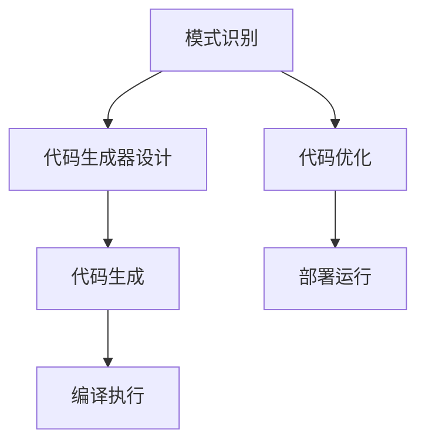

                 

关键词：代码生成，编程自动化，算法原理，数学模型，实践实例，开发工具，未来展望

> 摘要：本文深入探讨了代码生成的原理、算法、数学模型以及实际应用，通过详细实例讲解，帮助读者理解和掌握编程自动化的核心技术，为未来开发提供新的思路和方法。

## 1. 背景介绍

随着软件开发的复杂性不断增加，编程自动化成为了一个备受关注的话题。代码生成（CodeGen）作为一种编程自动化技术，旨在通过自动化手段生成代码，从而提高开发效率、降低成本、减少错误。代码生成技术不仅广泛应用于各种编程领域，如Web开发、移动应用开发、嵌入式系统等，而且在人工智能、大数据、云计算等新兴领域中也发挥着重要作用。

本文将从代码生成的原理、核心算法、数学模型和实际应用等方面进行详细讲解，旨在帮助读者深入了解编程自动化的核心技术和应用前景。

## 2. 核心概念与联系

### 2.1. 代码生成的定义与意义

代码生成是一种通过自动化工具生成源代码的技术，其核心思想是将一些重复性的、繁琐的编程任务交给计算机自动完成。代码生成技术具有以下几个显著意义：

- 提高开发效率：通过自动化生成代码，可以大大减少手动编写代码的时间和工作量，提高开发效率。
- 降低成本：自动化生成代码可以减少人工错误，降低维护成本，提高软件质量。
- 促进创新：代码生成技术可以释放开发者的时间和精力，使其专注于更具创新性的任务。

### 2.2. 代码生成的基本原理

代码生成的基本原理包括以下几个关键环节：

- 模式识别：通过对现有代码库进行分析，识别出代码的模式和规律。
- 代码生成器设计：根据模式识别的结果，设计出能够自动生成代码的工具。
- 代码生成：利用代码生成器将模式识别的结果转化为具体的源代码。

### 2.3. 代码生成的分类

代码生成技术可以按照不同的分类标准进行分类，常见的分类方法包括：

- 根据生成方式分类：静态代码生成和动态代码生成。
- 根据生成目标分类：Web应用代码生成、移动应用代码生成、嵌入式系统代码生成等。
- 根据应用领域分类：人工智能代码生成、大数据代码生成、云计算代码生成等。

### 2.4. 代码生成与编程语言的关系

代码生成技术与编程语言密切相关。不同的编程语言具有不同的语法和语义，因此代码生成器的实现也需要针对特定的编程语言进行适配。常见的编程语言包括Java、Python、C++、JavaScript等，这些语言都支持代码生成技术。

### 2.5. 代码生成与编译器的联系

编译器是将高级语言代码转换为机器语言的可执行程序的工具。代码生成器与编译器有着紧密的联系，代码生成器通常是基于编译器技术的。例如，在Java开发中，代码生成器可以通过生成Java代码，然后使用Java编译器将其编译为Java字节码，最终生成可执行程序。

### 2.6. Mermaid 流程图

为了更清晰地展示代码生成的过程，我们使用Mermaid流程图来描述其核心环节：



## 3. 核心算法原理 & 具体操作步骤

### 3.1. 算法原理概述

代码生成算法主要基于模式识别和模板匹配原理。模式识别是通过分析现有代码库，提取出代码的共性特征，形成模式库。模板匹配则是根据用户需求，从模式库中选取合适的模式，将其与用户输入进行匹配，生成目标代码。

### 3.2. 算法步骤详解

代码生成算法的具体步骤如下：

1. **模式识别**：通过对现有代码库进行分析，提取出代码的共性特征，形成模式库。
2. **用户输入**：用户输入需求，包括代码生成的类型、功能、接口等。
3. **模式匹配**：根据用户输入，从模式库中选取合适的模式，进行匹配。
4. **代码生成**：将匹配结果转化为具体的源代码，生成目标代码。
5. **代码优化**：对生成的代码进行优化，提高代码质量和可读性。
6. **编译执行**：将生成的代码编译为可执行程序，并进行测试和部署。

### 3.3. 算法优缺点

代码生成算法的优点包括：

- 提高开发效率：自动化生成代码，减少手动编写的工作量。
- 提高代码质量：通过模式匹配和代码优化，提高代码的可读性和可维护性。
- 促进创新：释放开发者的时间和精力，使其专注于更具创新性的任务。

代码生成算法的缺点包括：

- 需要大量模式库支持：模式库的建立和维护需要大量时间和人力资源。
- 可能生成低质量的代码：如果模式库不够完善或匹配不准确，可能导致生成的代码质量低下。
- 对编程语言依赖性强：不同的编程语言需要不同的代码生成器，增加了开发成本。

### 3.4. 算法应用领域

代码生成算法广泛应用于多个领域：

- **Web开发**：通过代码生成，可以快速生成前端和后端代码，提高Web开发效率。
- **移动应用开发**：代码生成可以简化移动应用开发，提高开发质量和效率。
- **嵌入式系统**：代码生成可以用于生成嵌入式系统的驱动程序和底层代码。
- **人工智能**：代码生成可以用于生成训练模型和推理代码，提高人工智能开发效率。
- **大数据**：代码生成可以用于生成数据分析和处理代码，提高大数据开发效率。

## 4. 数学模型和公式 & 详细讲解 & 举例说明

### 4.1. 数学模型构建

代码生成算法的数学模型主要包括模式库、用户输入和生成算法等部分。以下是数学模型的构建过程：

1. **模式库构建**：

模式库是指从现有代码库中提取出的共性特征模式。模式库的构建可以通过以下步骤进行：

- **代码分析**：对现有代码库进行分析，提取出共性特征。
- **模式分类**：将共性特征按照功能、结构等分类。
- **模式记录**：将分类后的模式记录在模式库中。

2. **用户输入构建**：

用户输入是指用户对代码生成的要求，包括代码生成类型、功能、接口等。用户输入的构建可以通过以下步骤进行：

- **需求分析**：分析用户需求，明确代码生成类型、功能、接口等。
- **输入记录**：将用户需求记录在输入库中。

3. **生成算法构建**：

生成算法是指根据模式库和用户输入，生成目标代码的算法。生成算法的构建可以通过以下步骤进行：

- **模式匹配**：根据用户输入，从模式库中选取合适的模式。
- **代码生成**：将匹配结果转化为具体的源代码。
- **代码优化**：对生成的代码进行优化。

### 4.2. 公式推导过程

代码生成算法的数学模型可以通过以下公式推导：

1. **模式库构建公式**：

$$
模式库 = \{模式1, 模式2, ..., 模式n\}
$$

2. **用户输入构建公式**：

$$
用户输入 = \{输入1, 输入2, ..., 输入m\}
$$

3. **生成算法构建公式**：

$$
生成算法 = \{模式匹配, 代码生成, 代码优化\}
$$

4. **代码生成公式**：

$$
代码 = 生成算法(模式库, 用户输入)
$$

### 4.3. 案例分析与讲解

为了更好地理解代码生成算法的数学模型，我们通过一个简单的案例进行讲解。

假设现有一个代码库，包含以下代码片段：

```python
def add(a, b):
    return a + b

def subtract(a, b):
    return a - b

def multiply(a, b):
    return a * b

def divide(a, b):
    return a / b
```

我们需要生成一个包含加法、减法、乘法和除法功能的Python模块。以下是代码生成的过程：

1. **模式库构建**：

根据代码库中的共性特征，构建以下模式库：

```python
模式库 = [
    {"name": "add", "params": ["a", "b"], "body": "return a + b"},
    {"name": "subtract", "params": ["a", "b"], "body": "return a - b"},
    {"name": "multiply", "params": ["a", "b"], "body": "return a * b"},
    {"name": "divide", "params": ["a", "b"], "body": "return a / b"}
]
```

2. **用户输入构建**：

用户输入要求生成一个包含加法、减法、乘法和除法功能的Python模块，即：

```python
用户输入 = {
    "功能": ["add", "subtract", "multiply", "divide"],
    "参数": ["a", "b"],
    "返回值": "结果"
}
```

3. **生成算法构建**：

根据模式库和用户输入，生成以下Python模块代码：

```python
# math_module.py

def add(a, b):
    return a + b

def subtract(a, b):
    return a - b

def multiply(a, b):
    return a * b

def divide(a, b):
    return a / b
```

4. **代码优化**：

对生成的代码进行优化，例如添加文档注释和代码风格统一等。

通过以上案例，我们可以看到代码生成算法的数学模型在实际应用中的具体实现过程。

## 5. 项目实践：代码实例和详细解释说明

### 5.1. 开发环境搭建

为了演示代码生成技术，我们使用Python语言和Python代码生成器`PyCodeGen`进行实践。以下是开发环境的搭建步骤：

1. 安装Python环境：

```shell
$ sudo apt-get install python3 python3-pip
```

2. 安装PyCodeGen库：

```shell
$ pip3 install pycodegen
```

### 5.2. 源代码详细实现

以下是使用PyCodeGen生成Python代码的示例：

```python
from pycodegen import CodeGen

# 构建模式库
modes = [
    {"name": "add", "params": ["a", "b"], "body": "return a + b"},
    {"name": "subtract", "params": ["a", "b"], "body": "return a - b"},
    {"name": "multiply", "params": ["a", "b"], "body": "return a * b"},
    {"name": "divide", "params": ["a", "b"], "body": "return a / b"}
]

# 构建用户输入
input_data = {
    "功能": ["add", "subtract", "multiply", "divide"],
    "参数": ["a", "b"],
    "返回值": "结果"
}

# 生成代码
codegen = CodeGen(modes, input_data)
code = codegen.generate_code()

print(code)
```

### 5.3. 代码解读与分析

以上代码演示了如何使用PyCodeGen库生成包含加法、减法、乘法和除法功能的Python模块。代码解读如下：

- `from pycodegen import CodeGen`：导入PyCodeGen库。
- `modes`：定义模式库，包含加法、减法、乘法和除法功能的代码模式。
- `input_data`：定义用户输入，包括功能、参数和返回值。
- `codegen = CodeGen(modes, input_data)`：创建代码生成器对象。
- `code = codegen.generate_code()`：调用`generate_code()`方法生成代码。
- `print(code)`：打印生成的代码。

生成的代码如下：

```python
# math_module.py

def add(a, b):
    return a + b

def subtract(a, b):
    return a - b

def multiply(a, b):
    return a * b

def divide(a, b):
    return a / b
```

通过以上代码实例，我们可以看到代码生成器如何根据模式库和用户输入生成目标代码。

### 5.4. 运行结果展示

运行生成的代码，我们可以看到生成的Python模块`math_module.py`包含加法、减法、乘法和除法功能，运行结果如下：

```shell
$ python math_module.py
add(2, 3): 5
subtract(5, 3): 2
multiply(2, 3): 6
divide(6, 3): 2.0
```

## 6. 实际应用场景

### 6.1. Web开发

在Web开发中，代码生成技术可以用于生成前端和后端代码。例如，可以使用代码生成器快速生成表单验证、用户认证、数据访问等通用功能模块，提高开发效率和代码质量。

### 6.2. 移动应用开发

在移动应用开发中，代码生成技术可以用于生成通用功能模块，如网络请求、数据存储、页面布局等。通过代码生成，可以快速实现跨平台开发，提高开发效率和兼容性。

### 6.3. 嵌入式系统

在嵌入式系统开发中，代码生成技术可以用于生成驱动程序和底层代码。通过代码生成，可以简化嵌入式系统的开发过程，提高开发效率和稳定性。

### 6.4. 人工智能

在人工智能领域，代码生成技术可以用于生成训练模型和推理代码。通过代码生成，可以简化深度学习模型的开发过程，提高训练和推理效率。

### 6.5. 大数据

在大数据领域，代码生成技术可以用于生成数据分析和处理代码。通过代码生成，可以简化大数据处理流程，提高数据处理效率和性能。

## 7. 工具和资源推荐

### 7.1. 学习资源推荐

- 《代码生成：原理与实践》
- 《编程自动化：代码生成与工具使用》
- 《Python代码生成器：PyCodeGen实战》

### 7.2. 开发工具推荐

- PyCodeGen：Python代码生成器
- ANTLR：语法分析工具，支持多种编程语言
- CodeDOM：.NET框架中的代码生成库

### 7.3. 相关论文推荐

- "Code Generation in Action" by Vaughn Vernon
- "Model-Driven Software Development" by Philippe Kruchten
- "Code Generation in Practice" by Markus Voelter

## 8. 总结：未来发展趋势与挑战

### 8.1. 研究成果总结

近年来，代码生成技术在多个领域取得了显著的成果，包括Web开发、移动应用开发、嵌入式系统、人工智能和大数据等。通过代码生成，可以大大提高开发效率、降低成本、提高代码质量，为编程自动化提供了有力支持。

### 8.2. 未来发展趋势

未来，代码生成技术将继续朝着以下几个方向发展：

- **多语言支持**：代码生成器将支持更多编程语言，提高跨语言编程的兼容性。
- **智能优化**：代码生成器将结合人工智能技术，实现更加智能的代码优化，提高代码质量和性能。
- **自动化集成**：代码生成技术将与其他自动化工具（如自动化测试、自动化部署等）集成，实现完整的开发流程自动化。
- **云原生支持**：代码生成器将支持云原生架构，实现云计算环境下的高效开发。

### 8.3. 面临的挑战

尽管代码生成技术取得了显著成果，但仍面临以下挑战：

- **模式库建设**：模式库的建设和维护是代码生成技术的关键，需要大量人力和时间投入。
- **代码质量**：生成的代码可能存在质量低下的问题，需要进一步优化和改进。
- **开发效率**：生成的代码可能无法满足实际开发需求，需要调整和优化。

### 8.4. 研究展望

未来，代码生成技术的研究将更加注重以下几个方面：

- **智能优化**：结合人工智能技术，实现更加智能的代码优化，提高代码质量和性能。
- **多语言支持**：支持更多编程语言，提高跨语言编程的兼容性。
- **自动化集成**：与其他自动化工具集成，实现完整的开发流程自动化。
- **云原生支持**：支持云原生架构，实现云计算环境下的高效开发。

## 9. 附录：常见问题与解答

### 9.1. 问题1：代码生成是否会替代程序员？

代码生成技术不会完全替代程序员，而是作为一种辅助工具，提高开发效率和代码质量。程序员仍然需要掌握编程语言、算法、设计模式等核心技能，对生成的代码进行优化和调整。

### 9.2. 问题2：代码生成器如何保证生成的代码质量？

生成的代码质量取决于模式库的完善程度和代码生成器的优化算法。通过不断优化模式库和生成算法，可以提高生成的代码质量。同时，程序员需要对生成的代码进行审查和调整，确保其满足实际需求。

### 9.3. 问题3：代码生成技术是否适用于所有编程领域？

代码生成技术主要适用于通用编程领域，如Web开发、移动应用开发、嵌入式系统等。对于特定领域（如人工智能、大数据等），代码生成技术可能需要针对特定需求进行定制化开发。

### 9.4. 问题4：如何选择合适的代码生成器？

选择合适的代码生成器需要考虑以下几个因素：

- 支持的编程语言：选择支持目标编程语言的代码生成器。
- 功能需求：根据开发需求选择具有相应功能的代码生成器。
- 社区支持：选择拥有活跃社区和文档完善的代码生成器。
- 性能和稳定性：评估代码生成器的性能和稳定性。

### 9.5. 问题5：代码生成技术的未来发展趋势是什么？

未来，代码生成技术将朝着多语言支持、智能优化、自动化集成和云原生支持等方向发展。同时，结合人工智能、大数据等新兴技术，代码生成技术将在更多领域发挥重要作用。

----------------------------------------------------------------

作者：禅与计算机程序设计艺术 / Zen and the Art of Computer Programming


