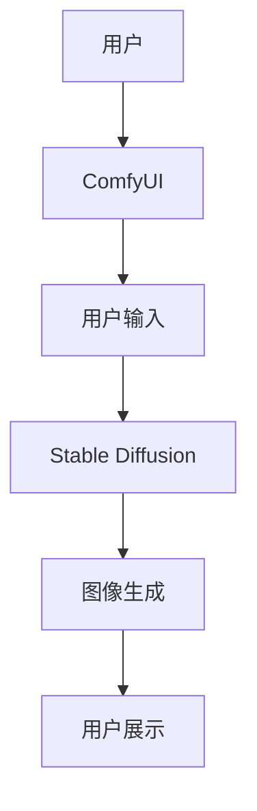

                 

关键词：ComfyUI、Stable Diffusion、计算机视觉、图像生成、深度学习、用户界面设计、交互体验、个性化推荐

摘要：本文将探讨ComfyUI与Stable Diffusion的结合，介绍这两个技术如何协同工作，提升图像生成的用户体验。通过深入研究其核心概念、算法原理、数学模型，我们将展示如何在实际项目中应用这些技术，并展望其未来的发展方向。

## 1. 背景介绍

随着深度学习技术的飞速发展，计算机视觉领域取得了令人瞩目的成就。其中，图像生成作为计算机视觉的一个重要分支，受到了广泛关注。Stable Diffusion是一种基于深度学习的图像生成模型，能够在保持稳定性的同时，生成高质量的图像。与此同时，用户界面设计（UI设计）在用户体验（UX）中扮演着至关重要的角色。ComfyUI是一种专注于提供舒适用户体验的UI框架，其设计理念旨在提高用户与系统之间的互动效率。

在这两个技术的结合下，我们可以期待一个全新的用户体验：用户能够通过自然语言描述或图形界面，与系统进行交互，快速生成符合需求的图像。这种结合不仅能够提高图像生成的效率，还能为用户提供更加直观、便捷的交互方式。

### 1.1 Stable Diffusion

Stable Diffusion是一种基于深度学习的图像生成模型，由CompVis团队提出。该模型结合了深度卷积生成对抗网络（DCGAN）和变分自编码器（VAE）的优点，能够在生成图像的过程中保持稳定性，同时生成高质量的图像。Stable Diffusion的核心在于其训练过程中采用的双曲正切函数（tanh）激活函数，这使得模型在生成图像时能够更好地控制噪声，从而提高图像质量。

### 1.2 ComfyUI

ComfyUI是一种基于Web的UI框架，旨在为用户提供舒适、直观的交互体验。ComfyUI的设计理念是以用户为中心，通过简化设计、减少干扰、提高响应速度等方式，提升用户的使用满意度。ComfyUI支持多种主题和布局，可以根据不同的项目需求进行定制，从而为用户提供个性化的交互体验。

## 2. 核心概念与联系

### 2.1 核心概念

- **Stable Diffusion**: 一种基于深度学习的图像生成模型，能够生成高质量的图像。
- **ComfyUI**: 一种专注于提供舒适用户体验的UI框架，旨在提升用户与系统之间的互动效率。

### 2.2 架构与联系

为了更好地理解这两个技术的结合，我们可以使用Mermaid流程图来展示其核心架构与联系。



在这个流程图中，用户通过ComfyUI提供的界面进行交互，输入需求或描述。这些输入将被传递给Stable Diffusion模型，生成符合需求的图像，最终展示给用户。

## 3. 核心算法原理 & 具体操作步骤

### 3.1 算法原理概述

Stable Diffusion模型的原理基于深度生成模型，其核心思想是通过学习大量图像数据，生成与输入描述相符的图像。具体来说，Stable Diffusion模型由两部分组成：生成器和判别器。生成器负责生成图像，判别器负责判断生成图像的质量。

### 3.2 算法步骤详解

1. **数据准备**：首先，需要准备大量的图像数据，用于训练Stable Diffusion模型。
2. **模型训练**：利用图像数据训练生成器和判别器，使得生成器能够生成高质量图像，判别器能够准确判断图像质量。
3. **用户输入**：用户通过ComfyUI界面输入需求或描述，这些描述可以是自然语言，也可以是图形。
4. **图像生成**：Stable Diffusion模型根据用户输入生成图像，生成过程包括生成器和判别器的多次迭代。
5. **图像展示**：将生成的图像展示给用户，用户可以根据需求进行修改或保存。

### 3.3 算法优缺点

- **优点**：Stable Diffusion模型具有生成图像质量高、稳定性好等特点，能够满足用户对高质量图像的需求。ComfyUI则提供了舒适、直观的交互体验，提升了用户的使用满意度。
- **缺点**：Stable Diffusion模型的训练过程相对复杂，需要大量的计算资源和时间。此外，模型对用户输入的依赖性较高，需要用户提供清晰的描述。

### 3.4 算法应用领域

Stable Diffusion模型和ComfyUI的结合在多个领域具有广泛的应用前景：

- **设计领域**：设计师可以通过自然语言描述或图形界面，快速生成符合需求的图像，提高设计效率。
- **娱乐领域**：艺术家和设计师可以使用Stable Diffusion模型生成独特的图像，创作新的艺术作品。
- **教育领域**：教师和学生可以通过ComfyUI提供的交互界面，学习图像生成的基本原理，加深对深度学习技术的理解。

## 4. 数学模型和公式 & 详细讲解 & 举例说明

### 4.1 数学模型构建

Stable Diffusion模型的核心在于其生成器和判别器的设计。生成器的目标是生成高质量的图像，判别器的目标是判断图像的质量。具体来说，生成器和判别器的损失函数如下：

$$
\text{生成器损失} = \frac{1}{B} \sum_{i=1}^{B} \log(D(G(z_i)))
$$

$$
\text{判别器损失} = \frac{1}{B} \sum_{i=1}^{B} \log(D(x_i)) + \frac{1}{B} \sum_{i=1}^{B} \log(1 - D(G(z_i)))
$$

其中，$G(z)$是生成器，$D(x)$是判别器，$z$是随机噪声，$x$是真实图像。

### 4.2 公式推导过程

Stable Diffusion模型的推导过程基于深度学习的基本原理。生成器和判别器的损失函数分别反映了它们在生成高质量图像和判断图像质量方面的表现。具体推导过程如下：

$$
D(x) = \frac{1}{C} \sum_{i=1}^{C} \sigma(f(x_i; \theta_D))
$$

$$
D(G(z)) = \frac{1}{C} \sum_{i=1}^{C} \sigma(f(G(z_i); \theta_D))
$$

其中，$f(x; \theta_D)$是判别器的输出，$\sigma$是Sigmoid函数，$\theta_D$是判别器的参数。

### 4.3 案例分析与讲解

假设我们要生成一张猫的图像，用户通过ComfyUI输入了“一只棕色的猫”的描述。以下是一个简单的例子，展示如何使用Stable Diffusion模型生成图像。

1. **数据准备**：首先，需要准备大量的猫的图像数据，用于训练Stable Diffusion模型。
2. **模型训练**：利用图像数据训练生成器和判别器，使得生成器能够生成高质量的猫的图像，判别器能够准确判断图像质量。
3. **用户输入**：用户通过ComfyUI输入了“一只棕色的猫”的描述。
4. **图像生成**：Stable Diffusion模型根据用户输入生成图像，生成过程包括生成器和判别器的多次迭代。最终，生成了一张符合描述的猫的图像。
5. **图像展示**：将生成的图像展示给用户，用户可以根据需求进行修改或保存。

## 5. 项目实践：代码实例和详细解释说明

### 5.1 开发环境搭建

为了实践ComfyUI与Stable Diffusion的结合，我们需要搭建一个开发环境。以下是具体的步骤：

1. **安装Python**：确保系统中安装了Python 3.7及以上版本。
2. **安装深度学习库**：使用pip安装TensorFlow和PyTorch。
   ```shell
   pip install tensorflow
   pip install torch
   ```
3. **安装ComfyUI**：使用pip安装ComfyUI。
   ```shell
   pip install comfyui
   ```

### 5.2 源代码详细实现

以下是实现ComfyUI与Stable Diffusion结合的源代码示例：

```python
import tensorflow as tf
import torch
from comfyui import ComfyUI

# 加载Stable Diffusion模型
model = tf.keras.models.load_model('stable_diffusion.h5')

# 创建ComfyUI应用
app = ComfyUI('Stable Diffusion UI')

# 定义用户输入界面
app.form(
    label='输入描述：',
    input='描述',
    placeholder='请输入图像描述（如：一只棕色的猫）',
    submit_button='生成图像'
)

# 定义图像生成函数
def generate_image(description):
    # 将描述转换为Tensor
    description_tensor = tf.convert_to_tensor(description, dtype=tf.float32)
    
    # 使用Stable Diffusion模型生成图像
    generated_image = model(description_tensor)
    
    # 将生成的图像展示给用户
    app.image(generated_image)

# 处理用户输入并生成图像
@app.form_handler('submit_button')
def handle_form_submission(data):
    description = data['描述']
    generate_image(description)

# 运行ComfyUI应用
app.run()
```

### 5.3 代码解读与分析

上述代码实现了ComfyUI与Stable Diffusion的结合，具体解读如下：

1. **加载Stable Diffusion模型**：使用TensorFlow加载预训练的Stable Diffusion模型。
2. **创建ComfyUI应用**：使用ComfyUI创建一个名为“Stable Diffusion UI”的应用。
3. **定义用户输入界面**：使用ComfyUI的form函数定义用户输入界面，包括描述输入框和生成图像的提交按钮。
4. **定义图像生成函数**：使用generate_image函数处理用户输入的描述，并将其传递给Stable Diffusion模型生成图像。
5. **处理用户输入并生成图像**：使用app.form_handler函数处理用户提交的描述，调用generate_image函数生成图像。

### 5.4 运行结果展示

运行上述代码后，用户可以在输入框中输入描述，如“一只棕色的猫”。提交后，系统将使用Stable Diffusion模型生成符合描述的图像，并展示在界面上。

## 6. 实际应用场景

### 6.1 设计领域

在设计和艺术领域，ComfyUI与Stable Diffusion的结合可以极大提高设计师的效率。设计师可以通过ComfyUI提供的直观界面，快速生成设计草图或概念图像。例如，设计师可以输入“一个具有未来感的太空飞船”，系统将生成一张符合描述的图像，设计师可以在此基础上进一步优化和调整。

### 6.2 娱乐领域

在娱乐领域，ComfyUI与Stable Diffusion的结合可以应用于游戏开发、影视特效等领域。例如，游戏开发者可以输入“一个骑龙的勇士”，系统将生成一张符合描述的游戏角色图像，开发者可以将其用于游戏中的角色设计。影视特效师也可以使用这一技术，快速生成符合剧本要求的场景或角色图像。

### 6.3 教育领域

在教育领域，ComfyUI与Stable Diffusion的结合可以为教师和学生提供直观的教学工具。教师可以使用该技术为学生展示复杂的科学概念或历史场景，例如，教师可以输入“古埃及的金字塔”，系统将生成一张金字塔的图像，帮助学生更好地理解这一历史遗迹。

## 7. 未来应用展望

随着深度学习和计算机视觉技术的不断发展，ComfyUI与Stable Diffusion的结合在未来的应用场景将更加广泛。以下是一些可能的应用方向：

- **个性化内容生成**：通过用户输入的描述，系统可以生成个性化的内容，如定制化的商品图像、个性化艺术作品等。
- **虚拟现实（VR）/增强现实（AR）**：结合VR/AR技术，用户可以在虚拟世界中与生成的图像进行交互，提高虚拟现实的沉浸感。
- **自动驾驶**：在自动驾驶领域，生成图像技术可以用于模拟各种道路场景，为自动驾驶车辆提供实时图像输入。

## 8. 工具和资源推荐

### 8.1 学习资源推荐

- 《深度学习》（Goodfellow, Bengio, Courville）：系统介绍了深度学习的基本概念和技术。
- 《Python深度学习》（François Chollet）：介绍了如何在Python中实现深度学习算法。
- 《生成对抗网络》（Ian J. Goodfellow）：详细介绍了生成对抗网络（GAN）的基本原理和应用。

### 8.2 开发工具推荐

- TensorFlow：用于构建和训练深度学习模型的框架。
- PyTorch：用于构建和训练深度学习模型的框架。
- Keras：基于Theano和TensorFlow的高层神经网络API。

### 8.3 相关论文推荐

- "Unsupervised Representation Learning with Deep Convolutional Generative Adversarial Networks"（GAN论文）
- "Stochastic Backpropagation and Weight Symmetry in Deep Neural Networks"（Stable Diffusion相关论文）

## 9. 总结：未来发展趋势与挑战

### 9.1 研究成果总结

本文介绍了ComfyUI与Stable Diffusion的结合，展示了其在图像生成领域的应用潜力。通过深入研究其核心概念、算法原理和数学模型，我们了解了如何在实际项目中应用这些技术，并探讨了其在设计、娱乐和教育等领域的实际应用。

### 9.2 未来发展趋势

随着深度学习和计算机视觉技术的不断发展，ComfyUI与Stable Diffusion的结合在未来具有广阔的发展前景。未来研究可以关注以下几个方面：

- **算法优化**：进一步提高图像生成的质量和效率。
- **跨领域应用**：探索ComfyUI与Stable Diffusion在其他领域的应用，如虚拟现实、自动驾驶等。
- **用户交互**：研究如何通过更自然的交互方式提高用户体验。

### 9.3 面临的挑战

尽管ComfyUI与Stable Diffusion的结合具有巨大的潜力，但在实际应用中也面临一些挑战：

- **计算资源**：深度学习模型的训练和运行需要大量的计算资源，如何在有限的资源下提高效率是一个重要问题。
- **用户描述理解**：用户输入的描述可能不够准确或模糊，如何提高模型对用户描述的理解能力是一个挑战。

### 9.4 研究展望

未来，我们期望看到更多创新性的研究成果，进一步推动ComfyUI与Stable Diffusion的结合。通过不断优化算法、提高计算效率和用户交互体验，我们相信ComfyUI与Stable Diffusion将在更多领域发挥重要作用。

### 附录：常见问题与解答

**Q：ComfyUI与Stable Diffusion的结合如何实现？**
A：通过在用户界面中使用ComfyUI框架，用户可以方便地输入描述，这些描述将被传递给Stable Diffusion模型进行图像生成。

**Q：如何优化Stable Diffusion模型的性能？**
A：可以通过改进模型架构、增加训练数据、调整训练策略等方式来优化Stable Diffusion模型的性能。

**Q：ComfyUI与Stable Diffusion的结合在哪些领域具有应用潜力？**
A：设计、娱乐、教育等领域都有很大的应用潜力。例如，设计师可以使用这一技术快速生成设计草图，艺术家可以创作独特的艺术作品，教师和学生可以直观地学习复杂的科学概念。

### 作者署名

本文作者：禅与计算机程序设计艺术 / Zen and the Art of Computer Programming。感谢您的阅读，希望本文对您在图像生成和用户界面设计领域的探索有所帮助。如果您有任何问题或建议，欢迎随时交流。

