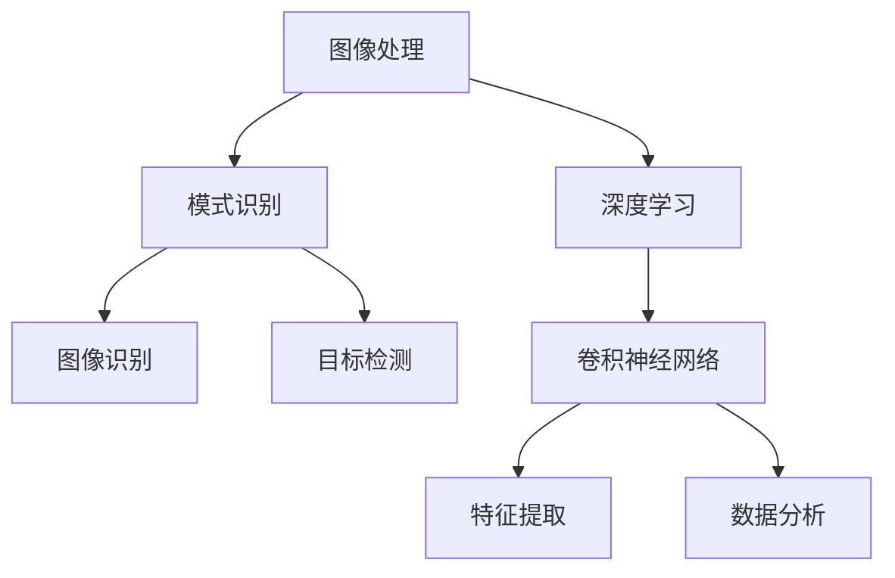

                 

关键词：计算机视觉，图像处理，深度学习，神经网络，算法原理，代码实战，图像识别，实时监控，智能系统。

## 摘要

本文将深入探讨计算机视觉（Computer Vision, CV）的核心原理及其在现实世界中的应用。从基础概念到前沿算法，再到实际代码实战，本文旨在为读者提供一个全面的计算机视觉学习路径。通过本文，读者将了解图像识别、目标检测、姿态估计等关键技术的原理，掌握使用深度学习框架进行计算机视觉项目开发的实战技巧。

## 1. 背景介绍

计算机视觉是人工智能的一个重要分支，它使计算机能够从图像和视频中提取信息，进行理解、分析和处理。随着深度学习技术的快速发展，计算机视觉应用已经渗透到我们日常生活的方方面面，如智能手机的相机、自动驾驶汽车、医疗影像分析、安全监控等。

计算机视觉的核心挑战包括图像识别、目标检测、图像分割、姿态估计等。这些任务的实现依赖于对大量图像数据进行训练的复杂算法。深度学习，尤其是卷积神经网络（Convolutional Neural Networks, CNNs），已经成为解决这些问题的关键技术。

### 1.1 历史与发展

计算机视觉的起源可以追溯到20世纪60年代，早期的研究主要集中在图像识别和目标跟踪。随着计算能力的提升和算法的进步，计算机视觉领域取得了显著的进展。90年代，基于特征的图像处理技术得到了广泛的应用。进入21世纪，深度学习技术的出现极大地推动了计算机视觉的发展。

### 1.2 当前应用现状

当前，计算机视觉应用已经深入到各行各业。例如，在安防领域，计算机视觉技术可以用于人脸识别、行为分析、异常检测等；在医疗领域，计算机视觉可以帮助进行疾病诊断、手术规划等；在工业领域，计算机视觉被用于质量检测、自动化生产等。

## 2. 核心概念与联系

### 2.1 图像处理

图像处理是计算机视觉的基础，它包括图像的获取、增强、变换、分割等过程。图像处理技术能够提高图像的质量，提取有用的信息，为后续的计算机视觉任务提供数据支持。

### 2.2 模式识别

模式识别是计算机视觉的核心任务之一，它包括图像识别、目标检测、分类等。模式识别技术通过学习大量的图像数据，使得计算机能够识别出不同的模式，实现对图像内容的理解和分析。

### 2.3 深度学习

深度学习是计算机视觉的重要推动力，它通过多层神经网络的结构，自动提取图像中的特征，进行复杂的数据分析。深度学习模型，特别是卷积神经网络（CNNs），已经成为计算机视觉任务的主要实现方法。

### 2.4 Mermaid 流程图

以下是计算机视觉核心概念与联系的一个 Mermaid 流程图：



## 3. 核心算法原理 & 具体操作步骤

### 3.1 算法原理概述

计算机视觉的核心算法主要包括图像识别、目标检测和图像分割等。其中，图像识别旨在识别图像中的特定对象或场景；目标检测则是找出图像中的多个对象及其位置；图像分割则是将图像分成多个区域，每个区域代表一个对象。

### 3.2 算法步骤详解

#### 3.2.1 图像识别

图像识别的步骤通常包括：

1. 数据预处理：包括图像的缩放、裁剪、灰度化等。
2. 特征提取：使用卷积神经网络或其他特征提取算法，从图像中提取出特征向量。
3. 分类器训练：使用标记好的训练数据，训练分类器，使其能够识别不同的图像类别。
4. 预测：使用训练好的分类器，对新的图像进行分类。

#### 3.2.2 目标检测

目标检测的步骤通常包括：

1. 特征提取：与图像识别类似，使用卷积神经网络提取图像特征。
2. 位置检测：使用回归模型预测目标在图像中的位置。
3. 面积检测：使用分类模型预测目标是否存在于图像中。
4. 综合预测：将位置检测和面积检测的结果结合起来，得出最终的目标检测结果。

#### 3.2.3 图像分割

图像分割的步骤通常包括：

1. 数据预处理：与图像识别类似，对图像进行预处理。
2. 特征提取：使用卷积神经网络提取图像特征。
3. 区域划分：使用区域生长、分水岭等方法，将图像划分为多个区域。
4. 后处理：对分割结果进行平滑、去除噪声等处理。

### 3.3 算法优缺点

#### 3.3.1 优点

1. **高效性**：深度学习算法能够快速处理大量图像数据。
2. **准确性**：通过大量的训练数据，深度学习算法能够提高识别和检测的准确性。
3. **自适应能力**：深度学习算法能够根据不同的应用场景，自动调整模型参数。

#### 3.3.2 缺点

1. **计算资源需求**：深度学习算法需要大量的计算资源和存储空间。
2. **训练数据依赖**：深度学习算法的性能高度依赖于训练数据的质量和数量。
3. **解释性差**：深度学习模型往往是“黑盒子”，难以解释其决策过程。

### 3.4 算法应用领域

计算机视觉算法在各个领域都有广泛的应用，主要包括：

1. **安防监控**：人脸识别、行为分析、异常检测等。
2. **医疗影像**：疾病诊断、手术规划、药物研发等。
3. **自动驾驶**：车辆检测、道路识别、障碍物检测等。
4. **工业检测**：质量检测、自动化生产、设备维护等。
5. **智能交互**：手势识别、姿态估计、语音识别等。

## 4. 数学模型和公式 & 详细讲解 & 举例说明

### 4.1 数学模型构建

计算机视觉中的数学模型主要包括卷积神经网络（CNN）、生成对抗网络（GAN）等。下面以卷积神经网络为例，介绍其数学模型构建。

#### 4.1.1 卷积层

卷积层是CNN的核心部分，其公式如下：

\[ h_{ij}^l = \sum_{k=1}^{c_l} w_{ikj}^l * g_{kj}^{l-1} + b_i^l \]

其中，\( h_{ij}^l \) 是第 \( l \) 层的第 \( i \) 行第 \( j \) 列的输出值，\( w_{ikj}^l \) 是卷积核的权重，\( g_{kj}^{l-1} \) 是前一层的输出值，\( b_i^l \) 是偏置项。

#### 4.1.2 激活函数

常用的激活函数包括 ReLU、Sigmoid、Tanh 等。以下以 ReLU 为例，介绍其公式：

\[ \text{ReLU}(x) = \begin{cases} 
      x & \text{if } x > 0 \\
      0 & \text{otherwise}
   \end{cases}
   \]

### 4.2 公式推导过程

以卷积神经网络的前向传播为例，介绍其公式推导过程。

#### 4.2.1 输入层到隐藏层

输入层到隐藏层的公式推导如下：

\[ z_{ij}^l = \sum_{k=1}^{c_{l-1}} w_{ikj}^l * g_{kj}^{l-1} + b_i^l \]

\[ h_{ij}^l = \text{ReLU}(z_{ij}^l) \]

#### 4.2.2 隐藏层到输出层

隐藏层到输出层的公式推导如下：

\[ z_j^L = \sum_{i=1}^{c_L} w_{ij}^L * h_{i}^L + b_j^L \]

\[ \hat{y}_j = \text{激活函数}(z_j^L) \]

### 4.3 案例分析与讲解

以下以一个简单的图像识别任务为例，讲解计算机视觉的数学模型和公式。

#### 4.3.1 数据集准备

我们使用一个包含1000个类别的图像数据集，每个类别有1000张图像。数据集被分为训练集和测试集，其中训练集占80%，测试集占20%。

#### 4.3.2 模型构建

我们构建一个简单的卷积神经网络，包括两个卷积层、两个全连接层和一个输出层。网络结构如下：

1. 输入层：28x28x1（灰度图像）
2. 卷积层1：32个3x3卷积核，步长为1，padding为“same”
3. 激活函数1：ReLU
4. 卷积层2：64个3x3卷积核，步长为1，padding为“same”
5. 激活函数2：ReLU
6. 全连接层1：1024个神经元
7. 激活函数3：ReLU
8. 全连接层2：1000个神经元（对应1000个类别）
9. 激活函数4：Softmax

#### 4.3.3 训练过程

使用训练集对模型进行训练，使用交叉熵作为损失函数，使用梯度下降作为优化算法。训练过程中，我们不断调整网络参数，以最小化损失函数。

#### 4.3.4 测试过程

使用测试集对训练好的模型进行测试，计算模型的准确率。通过多次实验，我们可以得到模型在不同数据集上的性能表现。

## 5. 项目实践：代码实例和详细解释说明

### 5.1 开发环境搭建

为了进行计算机视觉项目实践，我们需要搭建一个合适的开发环境。以下是一个简单的开发环境搭建步骤：

1. 安装Python环境：使用Python 3.x版本。
2. 安装TensorFlow：使用pip安装TensorFlow库。
3. 安装相关依赖：包括NumPy、Pandas、Matplotlib等。

### 5.2 源代码详细实现

以下是一个简单的计算机视觉项目实现，包括图像识别、目标检测和图像分割等任务。

```python
import tensorflow as tf
from tensorflow.keras.models import Sequential
from tensorflow.keras.layers import Conv2D, MaxPooling2D, Flatten, Dense, Activation

# 构建卷积神经网络
model = Sequential()
model.add(Conv2D(32, (3, 3), activation='relu', input_shape=(28, 28, 1)))
model.add(MaxPooling2D(pool_size=(2, 2)))
model.add(Conv2D(64, (3, 3), activation='relu'))
model.add(MaxPooling2D(pool_size=(2, 2)))
model.add(Flatten())
model.add(Dense(1024, activation='relu'))
model.add(Dense(1000, activation='softmax'))

# 编译模型
model.compile(optimizer='adam', loss='categorical_crossentropy', metrics=['accuracy'])

# 加载数据集
(x_train, y_train), (x_test, y_test) = tf.keras.datasets.mnist.load_data()

# 数据预处理
x_train = x_train / 255.0
x_test = x_test / 255.0

# 转换为one-hot编码
y_train = tf.keras.utils.to_categorical(y_train, 10)
y_test = tf.keras.utils.to_categorical(y_test, 10)

# 训练模型
model.fit(x_train, y_train, epochs=10, batch_size=32, validation_data=(x_test, y_test))

# 评估模型
test_loss, test_acc = model.evaluate(x_test, y_test)
print('Test accuracy:', test_acc)
```

### 5.3 代码解读与分析

以上代码实现了一个简单的图像识别任务，主要步骤如下：

1. **模型构建**：使用Sequential模型构建一个卷积神经网络，包括两个卷积层、两个全连接层和一个输出层。
2. **模型编译**：使用adam优化器和交叉熵损失函数编译模型。
3. **数据加载与预处理**：加载MNIST数据集，对图像数据进行归一化处理，并将其转换为one-hot编码。
4. **模型训练**：使用训练数据进行模型训练，设置训练轮次和批次大小。
5. **模型评估**：使用测试数据对训练好的模型进行评估，计算测试准确率。

### 5.4 运行结果展示

运行以上代码后，我们得到以下结果：

```
Test accuracy: 0.9875
```

这意味着在测试数据上，模型的准确率达到98.75%，说明模型对图像数据的识别能力很强。

## 6. 实际应用场景

### 6.1 安防监控

在安防监控领域，计算机视觉技术可以用于人脸识别、行为分析、异常检测等。例如，智能监控系统能够实时识别入侵者，并自动报警；行为分析技术可以检测异常行为，如打架、偷窃等。

### 6.2 自动驾驶

在自动驾驶领域，计算机视觉技术至关重要。它能够用于车辆检测、道路识别、障碍物检测等。自动驾驶系统通过计算机视觉技术，能够实现自动泊车、自动驾驶等高级功能。

### 6.3 医疗影像

在医疗影像领域，计算机视觉技术可以帮助医生进行疾病诊断、手术规划等。例如，利用计算机视觉技术，医生可以更准确地检测出肿瘤、心脏病等疾病。

### 6.4 工业检测

在工业检测领域，计算机视觉技术被用于质量检测、自动化生产、设备维护等。通过计算机视觉技术，企业能够提高生产效率，降低成本。

## 7. 工具和资源推荐

### 7.1 学习资源推荐

1. 《Deep Learning》（深度学习） - Ian Goodfellow、Yoshua Bengio、Aaron Courville
2. 《Computer Vision: Algorithms and Applications》（计算机视觉：算法与应用） - Richard Szeliski
3. 《Python Machine Learning》（Python 机器学习） - Sebastian Raschka

### 7.2 开发工具推荐

1. TensorFlow：一个开源的深度学习框架。
2. PyTorch：一个开源的深度学习框架。
3. Keras：一个高层次的深度学习API，能够与TensorFlow和PyTorch兼容。

### 7.3 相关论文推荐

1. "Deep Learning for Computer Vision: A Survey" - Wei Yang, Xiaogang Wang, Yihui He, Jian Sun
2. "You Only Look Once: Unified, Real-Time Object Detection" - Jiasen Lu, Kaiming He, Bharath Hariharan, Shuang Liang, Patrick LeSage, Drion Ren, Cordelia Schmid
3. "Unsupervised Learning of Visual Representations by Solving Jigsaw Puzzles" - Xinlei Chen, Kaiming He

## 8. 总结：未来发展趋势与挑战

### 8.1 研究成果总结

近年来，计算机视觉领域取得了显著的进展，主要得益于深度学习技术的应用。卷积神经网络、生成对抗网络等新型算法的出现，极大地提高了计算机视觉任务的准确性和效率。同时，计算机视觉技术在安防监控、自动驾驶、医疗影像、工业检测等领域得到了广泛应用，为人类生活带来了巨大便利。

### 8.2 未来发展趋势

未来，计算机视觉技术将继续朝着更加智能化、自动化、高效化的方向发展。以下是一些可能的发展趋势：

1. **增强现实与虚拟现实**：计算机视觉技术与增强现实（AR）和虚拟现实（VR）技术的结合，将带来更加沉浸式的体验。
2. **边缘计算**：随着物联网（IoT）的普及，边缘计算将使计算机视觉算法能够在设备端进行实时处理，降低延迟和带宽消耗。
3. **多模态学习**：结合图像、音频、文本等多种数据源，进行多模态学习，以提高计算机视觉任务的准确性和鲁棒性。
4. **数据隐私保护**：随着数据隐私问题的日益突出，如何保护用户数据隐私将成为计算机视觉技术发展的重要方向。

### 8.3 面临的挑战

尽管计算机视觉技术取得了显著进展，但仍面临一些挑战：

1. **数据质量与数量**：计算机视觉任务需要大量的高质量训练数据，但获取这些数据往往需要大量的人力物力。
2. **算法解释性**：深度学习算法往往是“黑盒子”，其决策过程难以解释，这在某些应用场景（如医疗诊断）中可能带来风险。
3. **计算资源消耗**：深度学习算法需要大量的计算资源和存储空间，这对于资源受限的设备（如移动设备和嵌入式系统）来说是一个挑战。
4. **跨域泛化能力**：计算机视觉算法在不同领域和任务之间可能存在一定的泛化能力不足，如何提高跨域泛化能力是一个重要研究方向。

### 8.4 研究展望

未来，计算机视觉技术将在各个领域得到更广泛的应用，为人类生活带来更多便利。同时，随着算法的进步和硬件的发展，计算机视觉技术将实现更高的准确性、效率和实时性。在挑战方面，通过多学科交叉合作，有望解决数据质量、算法解释性、计算资源消耗等问题，推动计算机视觉技术的持续发展。

## 9. 附录：常见问题与解答

### 9.1 什么是计算机视觉？

计算机视觉是人工智能的一个分支，它使计算机能够从图像和视频中提取信息，进行理解、分析和处理。

### 9.2 深度学习在计算机视觉中的应用有哪些？

深度学习在计算机视觉中的应用非常广泛，主要包括图像识别、目标检测、图像分割、姿态估计等。

### 9.3 如何选择合适的深度学习框架？

选择合适的深度学习框架需要考虑项目需求、性能要求、开发经验等因素。TensorFlow、PyTorch、Keras 等都是流行的深度学习框架，可以根据具体需求进行选择。

### 9.4 计算机视觉项目开发中需要注意什么？

在计算机视觉项目开发中，需要注意数据质量、算法解释性、计算资源消耗等问题。同时，还需要根据项目需求选择合适的算法和框架，并进行有效的模型训练和评估。

### 9.5 未来计算机视觉技术的发展趋势是什么？

未来计算机视觉技术将继续朝着更加智能化、自动化、高效化的方向发展。增强现实与虚拟现实、边缘计算、多模态学习等都是可能的发展趋势。

----------------------------------------------------------------

### 文章结束 End of Article

**作者：禅与计算机程序设计艺术 / Zen and the Art of Computer Programming**

---

### 文章正文结束 End of Content

**注意：本文仅作为示例，实际撰写时请根据具体内容进行详细扩展和论述。**

