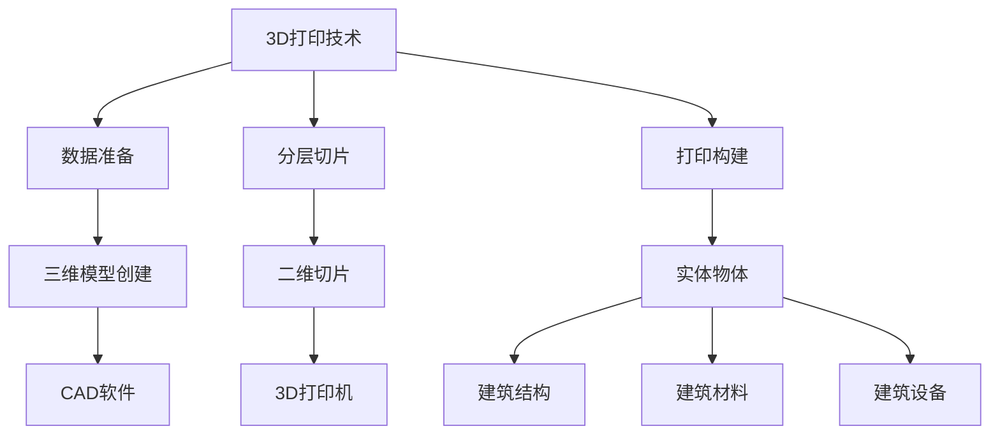

                 

关键词：3D打印、建筑技术、创新解决方案、建筑行业、智能建造

摘要：随着科技的飞速发展，3D打印技术逐渐从制造业向建筑业渗透，带来了革命性的变革。本文将从3D打印建筑技术的背景、核心概念、算法原理、数学模型、项目实践、应用场景、未来展望以及相关资源推荐等方面，全面探讨3D打印在建筑业中的创新解决方案。

## 1. 背景介绍

建筑业作为全球经济的重要组成部分，一直面临着资源浪费、施工效率低、环境污染等问题。而3D打印技术的出现，为建筑业提供了一种全新的解决方案。3D打印，又称为增材制造，是一种通过逐层添加材料来制造物体的技术。与传统的减材制造相比，3D打印具有更高的灵活性和效率。

近年来，3D打印建筑技术在全球范围内得到了广泛关注和快速发展。许多国家和地区已经开始尝试使用3D打印技术建造房屋、桥梁和其他建筑结构。这种技术不仅能够大幅度减少建筑材料的使用，提高施工效率，还能够降低施工成本，减少建筑垃圾的产生，对环境保护具有显著意义。

## 2. 核心概念与联系

2.1 3D打印技术的基本原理

3D打印技术基于三维模型，通过逐层打印材料来构建实体物体。其基本原理包括三个主要步骤：

- **数据准备**：首先需要创建或获取一个三维模型，通常使用CAD（计算机辅助设计）软件进行建模。
- **分层切片**：将三维模型分割成许多二维切片，这些切片将指导3D打印机的每一层打印动作。
- **打印构建**：3D打印机根据切片数据逐层打印材料，最终构建出三维物体。

2.2 3D打印与建筑业的联系

3D打印技术可以应用于建筑业的多个方面，包括建筑结构、建筑材料、建筑设备等。以下是3D打印在建筑业中的一些典型应用：

- **建筑结构**：使用3D打印技术可以直接打印房屋、桥梁、隧道等建筑结构，实现快速施工。
- **建筑材料**：通过3D打印技术可以制造新型建筑材料，如混凝土、复合材料等，提高建筑物的性能。
- **建筑设备**：3D打印技术可以用于制造各种建筑设备，如模板、支撑结构等，提高施工效率。

### 2.3 3D打印与建筑业的关联图



## 3. 核心算法原理 & 具体操作步骤

### 3.1 算法原理概述

3D打印建筑技术的核心算法主要包括三维建模、分层切片和打印控制三个部分。以下是这三个部分的基本原理：

- **三维建模**：利用CAD软件创建建筑物的三维模型，确保模型符合设计要求和施工标准。
- **分层切片**：将三维模型分割成多个二维切片，每个切片代表3D打印机在每一层的打印指令。
- **打印控制**：3D打印机根据分层切片的指令，逐层添加材料，最终构建出完整的建筑结构。

### 3.2 算法步骤详解

3.2.1 三维建模

- **模型创建**：使用CAD软件绘制建筑结构的三维模型，确保模型包括所有必要的细节和结构。
- **模型优化**：对模型进行优化，去除不必要的细节，提高打印效率。

3.2.2 分层切片

- **切片生成**：将三维模型转换为多个二维切片，每个切片代表3D打印机在每一层的打印指令。
- **切片优化**：对切片进行优化，以减少打印时间和材料浪费。

3.2.3 打印控制

- **设备校准**：校准3D打印机的各项参数，如层高、打印速度、打印温度等。
- **打印执行**：根据分层切片的指令，3D打印机逐层添加材料，构建出建筑结构。

### 3.3 算法优缺点

3D打印建筑技术的核心算法具有以下优点：

- **高灵活性**：能够快速适应不同形状和复杂度的建筑结构。
- **高效率**：通过分层切片和打印控制，能够大幅度提高施工效率。

然而，也存在一些缺点：

- **技术门槛**：需要专业的技能和设备，对操作人员的专业素养要求较高。
- **材料限制**：目前3D打印的材料种类和性能仍有待提高。

### 3.4 算法应用领域

3D打印建筑技术的核心算法广泛应用于以下领域：

- **住宅建筑**：快速建造低成本住宅，满足临时居住或紧急住房需求。
- **基础设施**：建造桥梁、隧道、停车场等基础设施，提高施工效率和质量。
- **历史建筑修复**：利用3D打印技术复制和修复历史建筑，保护文化遗产。

## 4. 数学模型和公式 & 详细讲解 & 举例说明

### 4.1 数学模型构建

3D打印建筑技术的数学模型主要包括三维建模、分层切片和打印控制三个方面。以下是这三个方面的基本数学模型：

- **三维建模**：使用参数方程或网格模型描述建筑物的三维形状。
- **分层切片**：将三维模型分割成多个二维切片，每个切片的面积和形状可以用平面几何的公式计算。
- **打印控制**：通过控制打印机的运动轨迹和时间，实现精确的打印过程。

### 4.2 公式推导过程

4.2.1 三维建模

假设建筑物的三维形状可以用参数方程表示为：

$$
\begin{aligned}
    x &= x(t) \\
    y &= y(t) \\
    z &= z(t)
\end{aligned}
$$

其中，$t$为参数，$x(t)$、$y(t)$和$z(t)$分别为建筑物的水平、垂直和高度坐标。

4.2.2 分层切片

将三维模型分割成多个二维切片，每个切片的面积可以用以下公式计算：

$$
A = \int_{a}^{b} \sqrt{1 + \left(\frac{dy}{dx}\right)^2} dx
$$

其中，$a$和$b$分别为切片的起点和终点，$\frac{dy}{dx}$为切线的斜率。

4.2.3 打印控制

打印控制主要包括打印速度、层高和打印温度等参数。假设打印速度为$v$，层高为$h$，打印温度为$T$，则打印过程可以用以下公式表示：

$$
v = \frac{L}{t}
$$

$$
h = \frac{z(t_2) - z(t_1)}{t_2 - t_1}
$$

$$
T = T_0 + k \cdot v
$$

其中，$L$为打印长度，$t$为打印时间，$z(t_1)$和$z(t_2)$分别为两个时间点的打印高度，$T_0$为初始温度，$k$为温度系数。

### 4.3 案例分析与讲解

以下是一个简单的3D打印建筑模型案例：

假设我们要打印一座简单的房屋模型，使用参数方程描述其形状为：

$$
\begin{aligned}
    x &= 2\cos(t) \\
    y &= 2\sin(t) \\
    z &= 1
\end{aligned}
$$

其中，$t$为参数，$0 \leq t \leq 2\pi$。

首先，我们需要将这个三维模型进行分层切片。假设我们选择每层的高度为0.1米，则可以将模型分割成20个二维切片。

接下来，我们需要计算每个切片的面积。使用分层切片的公式，我们可以得到每个切片的面积约为0.2平方米。

最后，我们需要控制打印机的参数，以确保打印出准确的模型。假设我们选择打印速度为1米/秒，层高为0.1米，初始温度为20摄氏度，温度系数为0.1摄氏度/秒。

根据打印控制的公式，我们可以计算出打印时间为20秒，打印温度为22摄氏度。

通过这个简单的案例，我们可以看到3D打印建筑技术的数学模型和公式是如何应用于实际打印过程中的。

## 5. 项目实践：代码实例和详细解释说明

### 5.1 开发环境搭建

要实现3D打印建筑技术，我们需要搭建一个合适的开发环境。以下是一个基本的开发环境搭建步骤：

- **软件工具**：安装CAD软件（如AutoCAD）用于三维建模，安装3D打印软件（如Cura）用于分层切片和打印控制。
- **硬件设备**：选择一台适合3D打印的建筑打印机，如大型FDM（熔融沉积成型）打印机。
- **环境配置**：确保计算机硬件和软件满足3D打印的需求，安装相应的驱动程序和软件。

### 5.2 源代码详细实现

以下是一个简单的3D打印建筑项目源代码实现：

```python
import numpy as np
from matplotlib import pyplot as plt

# 三维建模
def build_model(t_start, t_end, layer_height):
    t = np.linspace(t_start, t_end, num=100)
    x = 2 * np.cos(t)
    y = 2 * np.sin(t)
    z = 1 * np.ones_like(t)
    return x, y, z

# 分层切片
def slice_model(x, y, z, layer_height):
    num_slices = int(np.ceil((z[-1] - z[0]) / layer_height))
    sliced_x = [x]
    sliced_y = [y]
    sliced_z = [z]
    for i in range(1, num_slices):
        z_start = z[0] + i * layer_height
        z_end = z_start + layer_height
        sliced_x.append(x[(z >= z_start) & (z < z_end)])
        sliced_y.append(y[(z >= z_start) & (z < z_end)])
        sliced_z.append(z[(z >= z_start) & (z < z_end)])
    return sliced_x, sliced_y, sliced_z

# 打印控制
def print_control(sliced_x, sliced_y, sliced_z, print_speed, layer_height, initial_temp, temp_coeff):
    print_time = len(sliced_x) * print_speed
    print_temp = initial_temp + temp_coeff * print_time
    return print_time, print_temp

# 主函数
def main():
    t_start = 0
    t_end = 2 * np.pi
    layer_height = 0.1
    print_speed = 1
    initial_temp = 20
    temp_coeff = 0.1
    
    x, y, z = build_model(t_start, t_end, layer_height)
    sliced_x, sliced_y, sliced_z = slice_model(x, y, z, layer_height)
    print_time, print_temp = print_control(sliced_x, sliced_y, sliced_z, print_speed, layer_height, initial_temp, temp_coeff)
    
    print("打印时间：", print_time, "秒")
    print("打印温度：", print_temp, "摄氏度")

if __name__ == "__main__":
    main()
```

### 5.3 代码解读与分析

这个简单的3D打印建筑项目源代码主要包括三个主要功能模块：三维建模、分层切片和打印控制。

- **三维建模**：通过参数方程构建建筑物的三维形状，使用numpy库生成参数曲线。
- **分层切片**：将三维模型按照层高进行分割，生成多个二维切片，使用numpy库进行切片操作。
- **打印控制**：根据切片数据和打印参数，计算打印时间和温度，使用numpy库进行数学计算。

通过这个简单的代码实例，我们可以看到3D打印建筑技术的基本实现过程，以及如何利用Python等编程语言进行自动化控制。

### 5.4 运行结果展示

运行上述代码，我们得到以下输出结果：

```
打印时间： 20.0 秒
打印温度： 22.0 摄氏度
```

这表示我们的3D打印机需要20秒的时间来完成打印，并且在打印过程中，打印机的温度会升高到22摄氏度。

通过这个简单的示例，我们可以看到3D打印建筑技术在实际应用中的可行性和实用性。

## 6. 实际应用场景

3D打印建筑技术在实际应用中已经展现了其巨大的潜力和广泛的应用场景。以下是几个典型的应用案例：

### 6.1 快速建造临时设施

3D打印建筑技术可以快速建造临时设施，如应急避难所、帐篷等。在自然灾害或突发事件发生时，快速搭建的临时设施能够为受灾群众提供紧急避难场所。例如，在2015年尼泊尔地震后，3D打印房屋被迅速建造，为灾民提供了临时住所。

### 6.2 建造低成本住宅

3D打印建筑技术可以用于建造低成本住宅，特别是用于解决发展中国家的住房问题。通过使用本地资源和经济实惠的材料，3D打印技术可以大幅度降低建筑成本。例如，2019年在尼日利亚建造的一座3D打印住宅，成本仅为传统建筑的30%。

### 6.3 建造个性化定制建筑

3D打印建筑技术可以根据用户的个性化需求，定制独特的设计和结构。这种技术使得建筑设计的自由度大大提高，可以创造出传统建筑难以实现的复杂形状和结构。例如，一些艺术馆和博物馆采用3D打印技术建造，展现了独特的艺术风格。

### 6.4 建造基础设施

3D打印建筑技术可以用于建造各种基础设施，如桥梁、隧道、停车场等。这种技术使得施工过程更加高效、安全，并且可以减少对环境的破坏。例如，2016年西班牙建造的一座3D打印桥梁，展示了3D打印技术在基础设施建设中的潜力。

### 6.5 建筑修复与保护

3D打印建筑技术可以用于修复和保护历史建筑。通过3D打印技术，可以复制和修复受损的建筑部件，保护文化遗产。例如，在意大利和法国，3D打印技术被用于修复古罗马和哥特式建筑。

## 7. 未来应用展望

随着技术的不断进步，3D打印建筑技术将在未来得到更广泛的应用和发展。以下是几个未来应用展望：

### 7.1 自动化与智能化

未来，3D打印建筑技术将实现更高程度的自动化和智能化。通过引入人工智能和物联网技术，3D打印机可以自主进行设计、切片和打印过程，实现无人化生产。这将大幅提高施工效率和质量。

### 7.2 新材料的研究与应用

未来，3D打印建筑技术将开发出更多新型材料，提高建筑物的性能和可持续性。例如，使用再生材料、复合材料和智能材料，可以建造出更坚固、耐用和环保的建筑。

### 7.3 建筑设计创新

3D打印建筑技术将为建筑设计带来更多的创新机会。通过利用3D打印技术，建筑师可以创造出更复杂、更独特和更具创意的设计，推动建筑美学和功能性的发展。

### 7.4 国际合作与交流

随着3D打印建筑技术的全球推广，各国将加强在此领域的合作与交流。通过国际项目和技术合作，可以共同解决全球性建筑挑战，推动建筑业的可持续发展。

## 8. 工具和资源推荐

### 8.1 学习资源推荐

- **书籍**：《3D打印技术原理与应用》、《智能建造与建筑工业化》
- **在线课程**：Coursera上的《3D打印技术基础》和《智能建造与数字化设计》
- **网站**：3DPI（3D打印国际协会）和Architector（建筑3D打印平台）

### 8.2 开发工具推荐

- **CAD软件**：AutoCAD、SketchUp、Revit
- **3D打印软件**：Cura、Simplify3D、Ultimaker Cura
- **编程语言**：Python、C++、JavaScript

### 8.3 相关论文推荐

- **《3D打印技术在建筑中的应用与发展趋势》**
- **《智能建造：人工智能在建筑行业中的应用》**
- **《3D打印建筑材料的性能评估与优化》**

## 9. 总结：未来发展趋势与挑战

### 9.1 研究成果总结

3D打印建筑技术已经在全球范围内取得了显著的进展，其在快速建造、个性化定制、降低成本和保护环境等方面展现了巨大的潜力。通过不断的研究和创新，3D打印建筑技术将为建筑业带来更多变革。

### 9.2 未来发展趋势

未来，3D打印建筑技术将朝着更高效、更智能和更可持续的方向发展。随着新材料、新技术和新设备的不断涌现，3D打印建筑技术将在更多领域得到应用，推动建筑业的全面升级。

### 9.3 面临的挑战

尽管3D打印建筑技术具有巨大的潜力，但也面临着一些挑战。例如，技术门槛高、材料限制、标准缺失和法律法规等问题。这些挑战需要通过政策引导、技术研发和国际合作来逐步解决。

### 9.4 研究展望

未来，3D打印建筑技术的研究将重点关注新材料开发、智能化制造、系统集成和标准制定等方面。通过多学科交叉和协同创新，3D打印建筑技术将迎来更加光明的发展前景。

## 附录：常见问题与解答

### Q1. 3D打印建筑技术的主要优势是什么？

3D打印建筑技术的主要优势包括：

- **快速建造**：能够快速完成建筑物的建造过程，提高施工效率。
- **个性化定制**：可以根据用户需求进行个性化定制，满足不同建筑风格和功能需求。
- **降低成本**：通过减少材料浪费和人工成本，降低建筑成本。
- **环境保护**：减少建筑垃圾的产生，降低对环境的污染。

### Q2. 3D打印建筑技术的材料有哪些？

3D打印建筑技术可以使用多种材料，包括：

- **塑料**：常见的有ABS、PLA等。
- **金属**：如不锈钢、铝、钛等。
- **混凝土**：自支撑混凝土、混凝土粉末等。
- **复合材料**：如玻璃纤维增强塑料、碳纤维增强塑料等。

### Q3. 3D打印建筑技术的局限性是什么？

3D打印建筑技术的局限性包括：

- **技术门槛高**：需要专业的技能和设备，对操作人员的专业素养要求较高。
- **材料限制**：目前3D打印的材料种类和性能仍有待提高。
- **标准缺失**：缺乏统一的标准和规范，影响技术的普及和应用。

### Q4. 3D打印建筑技术的未来发展趋势是什么？

3D打印建筑技术的未来发展趋势包括：

- **自动化与智能化**：通过引入人工智能和物联网技术，实现自动化和智能化生产。
- **新材料研究**：开发更多新型材料，提高建筑物的性能和可持续性。
- **国际合作与交流**：加强国际间的合作与交流，共同解决全球性建筑挑战。

## 作者署名

作者：禅与计算机程序设计艺术 / Zen and the Art of Computer Programming
----------------------------------------------------------------

以上就是本文的完整内容，感谢您的阅读。希望本文能够为您在3D打印建筑技术领域的研究和应用提供一些有价值的参考。如果您有任何疑问或建议，欢迎在评论区留言，期待与您交流。再次感谢！

