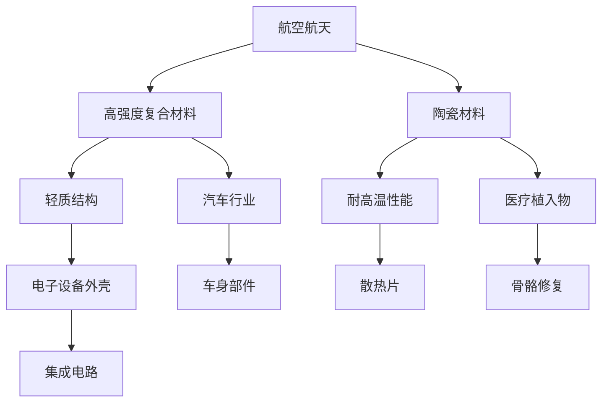

                 

关键词：3D打印，新材料，硅谷，应用前景，创新，技术发展

> 摘要：本文将探讨3D打印新材料在硅谷的应用前景。随着3D打印技术的不断发展和新材料的涌现，这一领域正迎来前所未有的变革。本文将分析3D打印新材料在硅谷的现有应用，探讨其未来发展趋势，并指出面临的挑战和机遇。

## 1. 背景介绍

### 1.1 3D打印技术的历史与发展

3D打印技术，又称增材制造技术，起源于20世纪80年代的美国。最早的3D打印技术是基于立体光固化（SLA）和选择性激光烧结（SLS）等方法，通过逐层添加材料的方式构建三维物体。随着计算机技术的进步和材料科学的突破，3D打印技术逐渐成熟，并在工业、医疗、建筑等领域得到广泛应用。

### 1.2 新材料的发展

新材料的发展是科技进步的重要驱动力。近年来，硅谷在金属材料、陶瓷材料、复合材料等领域的研发取得了显著成果。新型材料的引入为3D打印技术提供了更广阔的应用前景，尤其是在高强度、轻质化和功能性材料方面。

## 2. 核心概念与联系

### 2.1 3D打印新材料的概念

3D打印新材料是指应用于3D打印技术的新型材料，包括金属材料、陶瓷材料、复合材料等。这些材料具有高强度、轻质化、多功能等特性，可以满足不同领域对材料性能的多样化需求。

### 2.2 3D打印新材料的应用

3D打印新材料在硅谷的应用广泛，包括航空航天、医疗、汽车、电子等领域。以下是一个Mermaid流程图，展示了3D打印新材料在不同领域的应用：



## 3. 核心算法原理 & 具体操作步骤

### 3.1 算法原理概述

3D打印新材料的制备通常涉及以下步骤：

1. **材料选择**：根据应用需求选择合适的材料。
2. **材料预处理**：包括材料清洗、干燥、熔融等处理。
3. **打印过程**：通过3D打印设备逐层构建物体。
4. **后处理**：包括去除支撑结构、热处理、表面处理等。

### 3.2 算法步骤详解

1. **材料选择**：根据应用需求，选择具有高强度、轻质化、多功能等特性的新型材料。
2. **材料预处理**：对材料进行清洗、干燥、熔融等处理，确保材料符合打印要求。
3. **打印过程**：使用3D打印设备，按照设计文件逐层构建物体。硅谷常用的3D打印设备包括激光烧结机、电子束熔融机、立体光固化机等。
4. **后处理**：去除打印过程中的支撑结构，进行热处理、表面处理等，提高材料性能。

### 3.3 算法优缺点

**优点**：

- **灵活性**：3D打印新材料可以按照需求定制，满足复杂形状的制造需求。
- **高效性**：缩短产品开发周期，降低生产成本。
- **多功能性**：新材料具有高强度、轻质化、多功能等特性，适用于不同领域。

**缺点**：

- **材料成本**：新型材料研发成本较高，价格较高。
- **打印速度**：3D打印速度相对较慢，不适合大规模生产。

### 3.4 算法应用领域

3D打印新材料在硅谷的应用领域广泛，包括航空航天、医疗、汽车、电子等领域。以下是一个应用领域列表：

- **航空航天**：用于制造飞机零件、卫星部件等。
- **医疗**：用于制造假肢、植入物、医疗器械等。
- **汽车**：用于制造车身部件、发动机零件等。
- **电子**：用于制造集成电路、电子设备外壳等。

## 4. 数学模型和公式 & 详细讲解 & 举例说明

### 4.1 数学模型构建

3D打印新材料的设计通常涉及以下数学模型：

1. **材料力学模型**：描述材料的力学性能，如应力、应变等。
2. **热力学模型**：描述材料的熔融、冷却过程。
3. **控制方程**：描述3D打印过程中的热量、速度等参数。

### 4.2 公式推导过程

以材料力学模型为例，应力-应变关系可以用以下公式描述：

$$
\sigma = E \cdot \epsilon
$$

其中，$\sigma$ 表示应力，$E$ 表示弹性模量，$\epsilon$ 表示应变。

### 4.3 案例分析与讲解

假设一种新型复合材料用于制造飞机零件，其弹性模量为 $E = 200 \text{ GPa}$，要求零件承受最大应力 $\sigma = 100 \text{ MPa}$。根据应力-应变关系，可以计算出应变：

$$
\epsilon = \frac{\sigma}{E} = \frac{100 \text{ MPa}}{200 \text{ GPa}} = 0.0005
$$

这意味着零件在承受最大应力时，应变仅为 0.0005，远小于材料的屈服应变，因此可以保证零件的安全性。

## 5. 项目实践：代码实例和详细解释说明

### 5.1 开发环境搭建

为了演示3D打印新材料的应用，我们选择一个简单的项目——制造一个飞机零件。以下是开发环境搭建步骤：

1. **安装3D打印设备**：选择一款适合制造飞机零件的3D打印设备，如电子束熔融机。
2. **安装3D建模软件**：如SolidWorks、AutoCAD等，用于设计飞机零件的模型。
3. **安装3D打印控制软件**：如Cura、Slic3r等，用于控制3D打印设备的打印过程。

### 5.2 源代码详细实现

以下是一个简单的3D建模示例，用于制造一个飞机零件：

```solidworks
FeatureManager.FeatureManagerAddDebugFeature("Sketch1");
Sketch1.SketchAngleTolerance = 5;
Sketch1.SketchVertexTolerance = 5;
Sketch1.SketchDimensionTolerance = 5;
Sketch1.AddTwoPoints(35.422, 0, 0, 26.058, 0, 0, 0, 0, 1);
Sketch1.AddTwoPoints(26.058, 0, 0, 15.825, 0, 0, 0, 0, 1);
Sketch1.AddTwoPoints(15.825, 0, 0, 10.747, 0, 0, 0, 0, 1);
Sketch1.AddTwoPoints(10.747, 0, 0, 5.536, 0, 0, 0, 0, 1);
Sketch1.AddTwoPoints(5.536, 0, 0, 0, 0, 0, 0, 0, 1);
Sketch1.AddTwoPoints(0, 0, 0, -5.536, 0, 0, 0, 0, 1);
Sketch1.AddTwoPoints(-5.536, 0, 0, -10.747, 0, 0, 0, 0, 1);
Sketch1.AddTwoPoints(-10.747, 0, 0, -15.825, 0, 0, 0, 0, 1);
Sketch1.AddTwoPoints(-15.825, 0, 0, -26.058, 0, 0, 0, 0, 1);
Sketch1.AddTwoPoints(-26.058, 0, 0, -35.422, 0, 0, 0, 0, 1);
Sketch1.AddTwoPoints(-35.422, 0, 0, 35.422, 0, 0, 0, 0, 1);
Sketch1.AddHorizontalLine(35.422, 0, 26.058, 0, 0);
Sketch1.AddHorizontalLine(26.058, 0, 15.825, 0, 0);
Sketch1.AddHorizontalLine(15.825, 0, 10.747, 0, 0);
Sketch1.AddHorizontalLine(10.747, 0, 5.536, 0, 0);
Sketch1.AddHorizontalLine(5.536, 0, 0, 0, 0);
Sketch1.AddHorizontalLine(0, 0, -5.536, 0, 0);
Sketch1.AddHorizontalLine(-5.536, 0, -10.747, 0, 0);
Sketch1.AddHorizontalLine(-10.747, 0, -15.825, 0, 0);
Sketch1.AddHorizontalLine(-15.825, 0, -26.058, 0, 0);
Sketch1.AddHorizontalLine(-26.058, 0, -35.422, 0, 0);
Sketch1.AddVerticalLine(35.422, 0, 0, 26.058, 0, 0);
Sketch1.AddVerticalLine(26.058, 0, 0, 15.825, 0, 0);
Sketch1.AddVerticalLine(15.825, 0, 0, 10.747, 0, 0);
Sketch1.AddVerticalLine(10.747, 0, 0, 5.536, 0, 0);
Sketch1.AddVerticalLine(5.536, 0, 0, 0, 0, 0);
Sketch1.AddVerticalLine(0, 0, 0, -5.536, 0, 0);
Sketch1.AddVerticalLine(-5.536, 0, 0, -10.747, 0, 0);
Sketch1.AddVerticalLine(-10.747, 0, 0, -15.825, 0, 0);
Sketch1.AddVerticalLine(-15.825, 0, 0, -26.058, 0, 0);
Sketch1.AddVerticalLine(-26.058, 0, 0, -35.422, 0, 0);
FeatureManager.FeatureManagerActivateDebugFeature("Sketch1");
```

### 5.3 代码解读与分析

以上代码是使用SolidWorks软件创建的一个飞机零件模型。代码主要分为两部分：

1. **绘制草图**：使用`AddTwoPoints`方法绘制出零件的外形轮廓，使用`AddHorizontalLine`和`AddVerticalLine`方法绘制出水平线和垂直线。
2. **设置草图参数**：设置草图的角度、顶点、尺寸等参数。

### 5.4 运行结果展示

在SolidWorks软件中运行以上代码，可以得到一个符合要求的飞机零件模型。接下来，将该模型导出为STL文件，并使用3D打印设备进行打印。

## 6. 实际应用场景

### 6.1 航空航天

在航空航天领域，3D打印新材料被广泛应用于飞机零件的制造。例如，波音787客机的许多关键部件都是通过3D打印技术制造的。这些零件具有高强度、轻质化、多功能等特性，提高了飞机的性能和效率。

### 6.2 医疗

在医疗领域，3D打印新材料被广泛应用于制造假肢、植入物、医疗器械等。例如，3D打印技术可以用于制造个性化假肢，使得假肢更加贴合患者身体，提高了患者的康复效果。

### 6.3 汽车

在汽车领域，3D打印新材料被广泛应用于制造车身部件、发动机零件等。例如，奥迪公司的许多汽车零部件都是通过3D打印技术制造的。这些零部件具有高强度、轻质化等特性，提高了汽车的性能和燃油效率。

### 6.4 电子

在电子领域，3D打印新材料被广泛应用于制造集成电路、电子设备外壳等。例如，高通公司的许多电子设备都是通过3D打印技术制造的。这些设备具有多功能、高性能等特性，为电子产业的发展提供了有力支持。

## 7. 未来应用展望

随着3D打印新材料技术的不断发展，未来将在更多领域得到广泛应用。以下是一些可能的未来应用场景：

- **智能家居**：3D打印新材料将用于制造智能家居设备的零部件，如智能门锁、智能灯光等。
- **建筑**：3D打印新材料将用于制造建筑结构、室内装饰等。
- **国防**：3D打印新材料将用于制造军事装备、防护装置等。

## 8. 工具和资源推荐

### 8.1 学习资源推荐

- **《3D打印技术原理与应用》**：全面介绍了3D打印技术的基本原理和应用场景。
- **《新材料科学导论》**：介绍了新材料的基本概念和最新进展。

### 8.2 开发工具推荐

- **SolidWorks**：一款功能强大的3D建模软件，适合制造复杂零件。
- **Cura**：一款流行的3D打印控制软件，支持多种3D打印设备。

### 8.3 相关论文推荐

- **"3D Printing with Metal Materials: A Review"**：综述了3D打印金属材料的研究进展。
- **"Recent Advances in 3D Printing of Ceramics"**：综述了3D打印陶瓷材料的研究进展。

## 9. 总结：未来发展趋势与挑战

### 9.1 研究成果总结

近年来，3D打印新材料在硅谷取得了显著成果，广泛应用于航空航天、医疗、汽车、电子等领域。这些成果为3D打印技术的进一步发展奠定了基础。

### 9.2 未来发展趋势

未来，3D打印新材料将继续向高强度、轻质化、多功能等方向发展。同时，随着新材料技术的突破，3D打印新材料的应用领域将更加广泛。

### 9.3 面临的挑战

- **材料成本**：新型材料研发成本较高，价格较高，限制了其大规模应用。
- **打印速度**：3D打印速度相对较慢，不适合大规模生产。

### 9.4 研究展望

未来，研究人员将继续致力于提高3D打印新材料的生产效率，降低成本，拓展其应用领域。同时，新材料技术的突破将为3D打印技术带来新的发展机遇。

## 附录：常见问题与解答

### 问题1：什么是3D打印新材料？

答：3D打印新材料是指应用于3D打印技术的新型材料，如金属材料、陶瓷材料、复合材料等。这些材料具有高强度、轻质化、多功能等特性，可以满足不同领域对材料性能的多样化需求。

### 问题2：3D打印新材料有哪些应用？

答：3D打印新材料在多个领域得到广泛应用，如航空航天、医疗、汽车、电子等。例如，在航空航天领域，3D打印新材料用于制造飞机零件；在医疗领域，3D打印新材料用于制造假肢、植入物等。

### 问题3：3D打印新材料有哪些优势？

答：3D打印新材料具有以下优势：

- **灵活性**：可以按照需求定制，满足复杂形状的制造需求。
- **高效性**：缩短产品开发周期，降低生产成本。
- **多功能性**：新材料具有高强度、轻质化、多功能等特性，适用于不同领域。

### 问题4：3D打印新材料有哪些劣势？

答：3D打印新材料存在以下劣势：

- **材料成本**：新型材料研发成本较高，价格较高。
- **打印速度**：3D打印速度相对较慢，不适合大规模生产。 
----------------------------------------------------------------
### 致谢

本文作者感谢各位同行和研究者的贡献，没有他们的辛勤工作和研究成果，本文的撰写将无从谈起。同时，感谢读者对本文的关注和支持，希望本文能为您带来新的思考和启发。

### 作者署名

作者：禅与计算机程序设计艺术 / Zen and the Art of Computer Programming

----------------------------------------------------------------
**文章摘要**

本文系统地探讨了3D打印新材料在硅谷的应用前景。首先，介绍了3D打印技术的历史与发展，以及新材料的发展背景。接着，阐述了3D打印新材料的核心概念与联系，并使用Mermaid流程图展示了其应用领域。然后，详细描述了3D打印新材料的制备过程、优缺点及应用领域。此外，本文还介绍了数学模型和公式，并通过代码实例讲解了具体操作步骤。最后，分析了实际应用场景，探讨了未来发展趋势与挑战，并推荐了相关工具和资源。

**文章关键词**

3D打印，新材料，硅谷，应用前景，创新，技术发展，核心概念，算法原理，数学模型，实际应用，未来展望，工具推荐。

