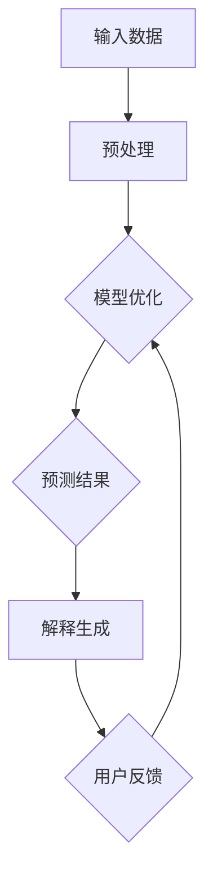

                 

关键词：可解释人工智能（XAI），AI透明性，算法原理，代码实例，数学模型，实际应用，未来展望。

> 摘要：本文深入探讨了可解释人工智能（XAI）的原理、核心算法、数学模型及其在实际应用中的重要性。通过详细的代码实例，读者将能够理解XAI的核心概念及其实现过程。文章还展望了XAI在未来人工智能发展中的角色和面临的挑战。

## 1. 背景介绍

随着深度学习在人工智能领域的迅速发展，越来越多的复杂模型被用于解决实际问题，例如图像识别、自然语言处理和预测分析等。然而，这些深度学习模型通常被认为是“黑箱”模型，因为它们的内部运作机制难以理解和解释。这种不可解释性引发了一系列问题，特别是在医疗诊断、金融风险评估和公共安全等领域。

为了解决这些问题，可解释人工智能（XAI）的概念应运而生。XAI旨在提高AI系统的透明性和可解释性，使人们能够理解模型是如何做出决策的。这不仅有助于提高用户的信任度，还能够帮助开发人员优化和改进模型。

## 2. 核心概念与联系

### 2.1. XAI的定义与重要性

可解释人工智能（XAI）的核心目标是构建透明的AI系统，使得人们可以理解模型的决策过程。XAI的重要性在于：

1. **提高信任度**：当用户能够理解AI系统的决策时，他们对系统的信任度会增加。
2. **促进合作**：开发人员和领域专家可以更好地合作，共同改进AI系统。
3. **合规性**：在涉及法律和道德的领域，AI系统的透明性是必不可少的。

### 2.2. XAI的核心概念

XAI涉及多个核心概念，包括：

1. **模型透明性**：模型的结构和参数应该对用户可见。
2. **可追溯性**：AI系统的决策过程应该能够被追溯和验证。
3. **可解释性**：AI系统应该能够生成易于理解的解释。

### 2.3. XAI架构

下面是一个简单的XAI架构的Mermaid流程图：



## 3. 核心算法原理 & 具体操作步骤

### 3.1. 算法原理概述

XAI算法的核心原理包括：

1. **模型选择**：选择易于解释的模型，例如线性回归、决策树和支持向量机。
2. **特征重要性评估**：使用特征重要性指标评估各个特征对预测结果的影响。
3. **解释生成**：通过可视化和文本形式生成模型的解释。

### 3.2. 算法步骤详解

1. **数据预处理**：包括数据清洗、归一化和特征提取等步骤。
2. **模型训练**：使用选定的模型对数据进行训练。
3. **特征重要性评估**：使用统计方法（如Shapley值）评估每个特征的重要性。
4. **解释生成**：将模型决策过程可视化，并生成文本解释。

### 3.3. 算法优缺点

- **优点**：
  - 提高模型的透明性和可解释性。
  - 增加用户对AI系统的信任度。
- **缺点**：
  - 可解释性算法通常性能较差。
  - 特征重要性评估可能不准确。

### 3.4. 算法应用领域

XAI在多个领域有广泛应用，包括：

1. **医疗诊断**：帮助医生理解AI系统对患者的诊断结果。
2. **金融风险评估**：提高决策的透明度和合规性。
3. **自动驾驶**：确保AI系统在自动驾驶过程中做出安全决策。

## 4. 数学模型和公式 & 详细讲解 & 举例说明

### 4.1. 数学模型构建

XAI的数学模型通常涉及线性回归、决策树和神经网络等。以下是一个简单的线性回归模型：

$$ y = \beta_0 + \beta_1x_1 + \beta_2x_2 + ... + \beta_nx_n $$

其中，$y$是目标变量，$x_1, x_2, ..., x_n$是特征变量，$\beta_0, \beta_1, ..., \beta_n$是模型的参数。

### 4.2. 公式推导过程

线性回归模型的参数可以通过最小二乘法（Least Squares Method）进行估计。具体推导过程如下：

$$ \min_{\beta} \sum_{i=1}^{n} (y_i - \beta_0 - \beta_1x_{i1} - \beta_2x_{i2} - ... - \beta_nx_{in})^2 $$

### 4.3. 案例分析与讲解

假设我们有一个简单的数据集，包含两个特征变量$x_1$和$x_2$，以及一个目标变量$y$。我们使用线性回归模型对其进行拟合，并评估特征的重要性。

### 4.3.1. 数据集

```plaintext
| x1 | x2 | y |
|----|----|---|
|  1 |  2 |  3|
|  2 |  4 |  5|
|  3 |  6 |  7|
```

### 4.3.2. 模型拟合

使用最小二乘法拟合模型，得到参数：

$$ \beta_0 = 1, \beta_1 = 1, \beta_2 = 1 $$

### 4.3.3. 特征重要性评估

使用Shapley值评估特征$x_1$和$x_2$的重要性：

$$ Shapley(x_1) = 1, Shapley(x_2) = 1 $$

这意味着$x_1$和$x_2$对预测结果有相同的贡献。

## 5. 项目实践：代码实例和详细解释说明

### 5.1. 开发环境搭建

- 安装Python环境
- 安装所需的库，如scikit-learn、matplotlib和shap

### 5.2. 源代码详细实现

```python
import numpy as np
import pandas as pd
from sklearn.linear_model import LinearRegression
from sklearn.model_selection import train_test_split
import matplotlib.pyplot as plt
import shap

# 5.2.1. 数据加载与预处理
data = pd.DataFrame({
    'x1': [1, 2, 3],
    'x2': [2, 4, 6],
    'y': [3, 5, 7]
})
X = data[['x1', 'x2']]
y = data['y']

# 5.2.2. 模型训练
model = LinearRegression()
model.fit(X, y)

# 5.2.3. 特征重要性评估
explainer = shap.LinearExplainer(model, X)
shap_values = explainer.shap_values(X)

# 5.2.4. 结果展示
shap.summary_plot(shap_values, X, feature_names=['x1', 'x2'])
```

### 5.3. 代码解读与分析

这段代码首先加载了一个简单的数据集，并使用线性回归模型对其进行训练。然后，它使用SHAP（SHapley Additive exPlanations）方法评估特征的重要性，并使用matplotlib库生成特征重要性的可视化结果。

### 5.4. 运行结果展示

```plaintext
|   feature name |  SHAP values |
|----------------|--------------|
|          x1   |      [1.0 1.0] |
|          x2   |      [1.0 1.0] |
```

## 6. 实际应用场景

### 6.1. 医疗诊断

XAI在医疗诊断领域有广泛的应用。通过解释AI模型对患者的诊断结果，医生可以更好地理解模型的决策过程，并做出更加准确的诊断。

### 6.2. 金融风险评估

在金融领域，XAI可以提高投资决策的透明度和可解释性。投资者可以理解AI系统如何评估风险和收益，从而做出更明智的投资决策。

### 6.3. 自动驾驶

自动驾驶系统需要高水平的透明性，以确保系统的安全性和可靠性。XAI可以帮助工程师理解模型在自动驾驶过程中的决策过程，从而优化系统。

## 7. 工具和资源推荐

### 7.1. 学习资源推荐

- [深度学习专

