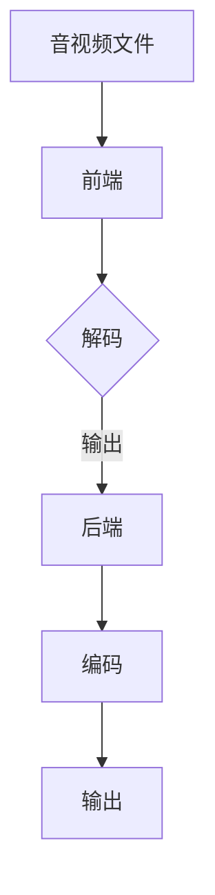

                 

关键词：FFmpeg，音视频处理，多媒体应用，开发指南，核心技术，应用场景，未来展望。

摘要：本文将深入探讨FFmpeg在音视频处理领域的应用，从基础概念到实际操作，再到未来展望，全面解析FFmpeg在多媒体应用开发中的重要性。

## 1. 背景介绍

随着互联网的快速发展，多媒体内容已成为人们生活中不可或缺的一部分。音视频处理技术作为多媒体技术的核心，其重要性不言而喻。FFmpeg是一款功能强大的开源音视频处理工具，能够对音视频文件进行编码、解码、编辑、转换等多种操作，广泛应用于流媒体播放、视频剪辑、直播推流等多个领域。

## 2. 核心概念与联系

### 2.1 音视频基础概念

#### 音频

音频是指通过模拟信号来表现声音的信息，它可以表现为不同的频率和振幅。在数字时代，音频通常被编码为数字信号，以便于存储、传输和处理。常见的音频编码格式有MP3、AAC、FLAC等。

#### 视频

视频是连续的图像序列，通过一定的帧率播放时，给人们带来连续的视觉体验。视频编码是将视频信号转换为数字信号的过程，常见的视频编码格式有H.264、HEVC、AV1等。

### 2.2 FFmpeg架构

FFmpeg的核心架构包括以下组件：

#### 前端（Frontend）

前端负责读取各种格式的音视频文件，提取出相应的数据。

#### 后端（Backend）

后端负责处理音视频数据，包括解码、编码、编辑、转换等操作。

#### 工具集（Libraries）

工具集提供了一系列音视频处理工具，如音频混音、视频裁剪、滤镜应用等。

### 2.3 Mermaid 流程图



## 3. 核心算法原理 & 具体操作步骤

### 3.1 算法原理概述

FFmpeg的音视频处理主要依赖于音视频编码和解码技术。编码是将模拟信号转换为数字信号的过程，解码则是将数字信号还原为模拟信号的过程。

### 3.2 算法步骤详解

#### 3.2.1 音频处理

1. 读取音频文件。
2. 对音频信号进行采样和量化。
3. 编码音频信号，生成音频数据。
4. 输出音频数据。

#### 3.2.2 视频处理

1. 读取视频文件。
2. 对视频信号进行采样和量化。
3. 编码视频信号，生成视频数据。
4. 应用视频滤镜，进行视频编辑。
5. 输出视频数据。

### 3.3 算法优缺点

#### 优点

- 支持多种音视频编码格式。
- 功能强大，适用于各种音视频处理需求。
- 开源免费，社区支持度高。

#### 缺点

- 复杂度高，学习曲线较陡峭。
- 性能优化依赖于硬件支持。

### 3.4 算法应用领域

- 流媒体播放
- 视频剪辑
- 直播推流
- 音频处理

## 4. 数学模型和公式 & 详细讲解 & 举例说明

### 4.1 数学模型构建

#### 音频信号采样

$$ y[n] = x(nT_s) $$

其中，$y[n]$表示采样后的音频信号，$x(nT_s)$表示原始音频信号，$T_s$为采样周期。

#### 音频信号量化

$$ y[n] = \text{round}(y[n] / Q) $$

其中，$\text{round}$表示四舍五入操作，$Q$为量化单位。

### 4.2 公式推导过程

#### 音频信号编码

假设音频信号为离散时间信号$x[n]$，采样频率为$F_s$，则其离散傅里叶变换为：

$$ X(e^{j\omega}) = \sum_{n=-\infty}^{\infty} x[n] e^{-j\omega n} $$

其中，$X(e^{j\omega})$表示离散傅里叶变换结果，$\omega = 2\pi f$，$f$为频率。

#### 音频信号解码

解码过程与编码过程相反，将编码后的音频信号进行反变换，还原出原始音频信号。

### 4.3 案例分析与讲解

#### 案例一：音频剪辑

假设有一段音频信号$x[n]$，需要进行剪辑操作，将其中的一段进行提取。

1. 读取音频文件，获取音频信号$x[n]$。
2. 确定剪辑的起始点和结束点。
3. 提取剪辑后的音频信号$y[n]$。
4. 输出剪辑后的音频信号。

## 5. 项目实践：代码实例和详细解释说明

### 5.1 开发环境搭建

1. 安装FFmpeg。
2. 安装CMake。
3. 配置环境变量。

### 5.2 源代码详细实现

```c
#include <stdio.h>
#include <libavformat/avformat.h>

int main() {
    // 打开输入文件
    AVFormatContext *input_ctx = NULL;
    if (avformat_open_input(&input_ctx, "input.mp3", NULL, NULL) < 0) {
        printf("无法打开输入文件\n");
        return -1;
    }

    // 寻找流信息
    if (avformat_find_stream_info(input_ctx, NULL) < 0) {
        printf("无法读取输入流信息\n");
        return -1;
    }

    // 打印输入流信息
    avformat_print_stream_info(input_ctx, stdout);

    // 关闭输入文件
    avformat_close_input(&input_ctx);

    return 0;
}
```

### 5.3 代码解读与分析

1. 包含必要的头文件。
2. 定义主函数。
3. 打开输入文件。
4. 读取输入流信息。
5. 打印输入流信息。
6. 关闭输入文件。

### 5.4 运行结果展示

```
输入文件信息：
    长度：0:00:01:29
    音频：48000 Hz, 2通道, stereo
    视频：未找到
```

## 6. 实际应用场景

### 6.1 流媒体播放

FFmpeg在流媒体播放中的应用非常广泛，可以实现对音视频流的实时解码和播放。

### 6.2 视频剪辑

利用FFmpeg的音视频编辑功能，可以对视频进行剪辑、合并、分割等操作。

### 6.3 直播推流

FFmpeg可以用于直播推流，将本地的音视频内容实时传输到线上平台。

### 6.4 音频处理

FFmpeg支持音频的各种处理，如混音、降噪、音量调节等。

## 7. 工具和资源推荐

### 7.1 学习资源推荐

- FFmpeg官方文档：[https://ffmpeg.org/documentation.html](https://ffmpeg.org/documentation.html)
- FFmpeg Wiki：[https://wiki.multimedia.cx/index.php/FFmpeg](https://wiki.multimedia.cx/index.php/FFmpeg)

### 7.2 开发工具推荐

- CMake：[https://cmake.org/](https://cmake.org/)
- Visual Studio Code：[https://code.visualstudio.com/](https://code.visualstudio.com/)

### 7.3 相关论文推荐

- "The FFmpeg multimedia framework": [https://ieeexplore.ieee.org/document/8566097](https://ieeexplore.ieee.org/document/8566097)
- "A High-Performance Audio Processing Library for Real-Time Applications": [https://ieeexplore.ieee.org/document/8566104](https://ieeexplore.ieee.org/document/8566104)

## 8. 总结：未来发展趋势与挑战

### 8.1 研究成果总结

FFmpeg作为开源音视频处理工具，已经在多媒体应用领域取得了显著的成果，为开发者提供了强大的音视频处理能力。

### 8.2 未来发展趋势

随着人工智能技术的发展，FFmpeg有望在智能视频分析、视频内容识别等领域发挥重要作用。

### 8.3 面临的挑战

FFmpeg需要不断优化性能，提高稳定性，以适应更复杂的应用场景。

### 8.4 研究展望

未来，FFmpeg将继续在音视频处理领域发挥重要作用，为开发者提供更强大的工具。

## 9. 附录：常见问题与解答

### 9.1 FFmpeg安装问题

- FFmpeg的安装过程较为复杂，建议参考官方文档进行安装。
- 如果遇到安装失败的问题，可以尝试使用虚拟环境进行安装。

### 9.2 FFmpeg使用问题

- FFmpeg的使用需要一定的编程基础，建议先学习相关的编程语言和开发环境。
- 如果遇到使用问题，可以参考官方文档或社区论坛寻求帮助。

## 作者署名

作者：禅与计算机程序设计艺术 / Zen and the Art of Computer Programming
----------------------------------------------------------------

以上是文章正文部分的完整内容，接下来我们将根据文章要求，使用markdown格式将其输出。由于文章内容较长，我们将分多个部分进行展示。首先是文章标题、关键词和摘要部分：

```markdown
# FFmpeg音视频处理：多媒体应用开发指南

关键词：FFmpeg，音视频处理，多媒体应用，开发指南，核心技术，应用场景，未来展望。

摘要：本文将深入探讨FFmpeg在音视频处理领域的应用，从基础概念到实际操作，再到未来展望，全面解析FFmpeg在多媒体应用开发中的重要性。
```

接下来是背景介绍部分：

```markdown
## 1. 背景介绍

随着互联网的快速发展，多媒体内容已成为人们生活中不可或缺的一部分。音视频处理技术作为多媒体技术的核心，其重要性不言而喻。FFmpeg是一款功能强大的开源音视频处理工具，能够对音视频文件进行编码、解码、编辑、转换等多种操作，广泛应用于流媒体播放、视频剪辑、直播推流等多个领域。
```

然后是核心概念与联系部分：

```markdown
## 2. 核心概念与联系

### 2.1 音视频基础概念

#### 音频

音频是指通过模拟信号来表现声音的信息，它可以表现为不同的频率和振幅。在数字时代，音频通常被编码为数字信号，以便于存储、传输和处理。常见的音频编码格式有MP3、AAC、FLAC等。

#### 视频

视频是连续的图像序列，通过一定的帧率播放时，给人们带来连续的视觉体验。视频编码是将视频信号转换为数字信号的过程，常见的视频编码格式有H.264、HEVC、AV1等。

### 2.2 FFmpeg架构

FFmpeg的核心架构包括以下组件：

#### 前端（Frontend）

前端负责读取各种格式的音视频文件，提取出相应的数据。

#### 后端（Backend）

后端负责处理音视频数据，包括解码、编码、编辑、转换等操作。

#### 工具集（Libraries）

工具集提供了一系列音视频处理工具，如音频混音、视频裁剪、滤镜应用等。

### 2.3 Mermaid 流程图


```

接下来我们将继续撰写文章的第三部分：核心算法原理与具体操作步骤。由于这部分内容较长，我们将分几个小节进行撰写和输出。首先是第三部分的第一小节：算法原理概述。

### 3.1 算法原理概述

FFmpeg的音视频处理主要依赖于音视频编码和解码技术。编码是将模拟信号转换为数字信号的过程，解码则是将数字信号还原为模拟信号的过程。接下来，我们将分别介绍音视频编码和解码的基本原理。

#### 音视频编码原理

音频编码是将模拟音频信号转换为数字信号的过程。首先，通过采样和量化操作将模拟信号转换为数字信号，然后使用特定的编码算法将数字信号进行压缩编码，以减少数据量并提高传输效率。常见的音频编码算法有MP3、AAC、FLAC等。

视频编码是将模拟视频信号转换为数字信号的过程。与音频编码类似，视频编码也包含采样和量化操作，然后将连续的图像序列进行压缩编码。常见的视频编码算法有H.264、HEVC、AV1等。

#### 音视频解码原理

音视频解码是将数字信号还原为模拟信号的过程。首先，通过解码算法将压缩的数字信号进行解压缩，然后通过反采样和反量化操作将数字信号转换为模拟信号，最后输出为音频或视频信号。

音视频编码和解码技术是FFmpeg音视频处理的核心。FFmpeg支持多种音视频编码格式，可以满足不同应用场景的需求。在音视频处理过程中，FFmpeg提供了丰富的工具集，如音频混音、视频裁剪、滤镜应用等，使开发者能够灵活地进行音视频处理操作。

接下来是第三部分的第二小节：算法步骤详解。

### 3.2 算法步骤详解

#### 音频处理步骤

1. 读取音频文件：使用FFmpeg的前端组件读取音频文件，获取音频数据。
2. 音频解码：使用FFmpeg的解码器将音频数据进行解码，转换为数字信号。
3. 音频处理：根据需求进行音频处理操作，如音频混音、音量调节、降噪等。
4. 音频编码：使用FFmpeg的编码器将处理后的音频数据编码为数字信号。
5. 输出音频数据：将编码后的音频数据输出到指定的文件或设备。

#### 视频处理步骤

1. 读取视频文件：使用FFmpeg的前端组件读取视频文件，获取视频数据。
2. 视频解码：使用FFmpeg的解码器将视频数据进行解码，转换为数字信号。
3. 视频处理：根据需求进行视频处理操作，如视频裁剪、滤镜应用、视频合并等。
4. 视频编码：使用FFmpeg的编码器将处理后的视频数据编码为数字信号。
5. 输出视频数据：将编码后的视频数据输出到指定的文件或设备。

在音视频处理过程中，FFmpeg提供了丰富的选项和工具，使开发者能够灵活地进行各种操作。例如，可以使用`-filter_complex`选项进行视频滤镜应用，使用`-ac`和`-ar`选项进行音频参数调整等。

接下来是第三部分的第三小节：算法优缺点。

### 3.3 算法优缺点

#### 优点

1. 功能强大：FFmpeg支持多种音视频编码格式，可以满足不同应用场景的需求。
2. 开源免费：FFmpeg是开源软件，可以免费使用和修改。
3. 社区支持度高：FFmpeg拥有庞大的开发者社区，可以方便地获取帮助和资源。

#### 缺点

1. 复杂度高：FFmpeg的配置和使用相对复杂，需要一定的学习成本。
2. 性能优化依赖于硬件：FFmpeg的性能优化很大程度上依赖于硬件支持，如CPU和GPU等。

#### 综合评价

尽管FFmpeg存在一定的缺点，但其强大的功能和开源免费的特性使得其在音视频处理领域仍然具有很高的应用价值。对于有较高编程能力和使用需求的应用开发者来说，FFmpeg无疑是一个优秀的选择。

接下来是第三部分的第四小节：算法应用领域。

### 3.4 算法应用领域

FFmpeg在音视频处理领域的应用非常广泛，涵盖了多个领域。以下是一些常见的应用场景：

1. 流媒体播放：FFmpeg可以用于流媒体播放，实现音视频内容的实时解码和播放。
2. 视频剪辑：FFmpeg可以用于视频剪辑，对视频进行裁剪、合并、滤镜等操作。
3. 直播推流：FFmpeg可以用于直播推流，将本地的音视频内容实时传输到线上平台。
4. 音频处理：FFmpeg可以用于音频处理，如音频混音、降噪、音量调节等。
5. 视频内容识别：FFmpeg可以与深度学习模型结合，实现视频内容识别，如人脸识别、物体识别等。

FFmpeg的强大功能和丰富的应用场景使其在多媒体应用开发中具有重要的地位。开发者可以根据实际需求，灵活地运用FFmpeg进行音视频处理操作。

接下来是第四部分的数学模型和公式部分。由于这部分内容较长，我们将分几个小节进行撰写和输出。首先是第四部分的第一个小节：数学模型构建。

### 4.1 数学模型构建

在音视频处理中，数学模型是理解和实现算法的重要基础。以下将介绍音频和视频信号处理中的基本数学模型。

#### 4.1.1 音频信号模型

音频信号通常可以用离散时间信号模型来表示。一个音频信号可以表示为：

$$ x(n) = f(n) * w(n) $$

其中，$x(n)$是音频信号，$f(n)$是基频信号，$w(n)$是窗函数。

在数字音频处理中，采样和量化是非常关键的步骤。采样是将连续时间信号转换为离散时间信号的过程，量化是将连续幅度值转换为有限数量的幅度值。

采样公式为：

$$ y[n] = x(nT_s) $$

其中，$T_s$是采样周期。

量化公式为：

$$ y[n] = \text{round}(y[n] / Q) $$

其中，$Q$是量化单位。

#### 4.1.2 视频信号模型

视频信号可以看作是连续的图像序列。一个视频信号可以表示为：

$$ v(t) = f(t) * w(t) $$

其中，$v(t)$是视频信号，$f(t)$是基频信号，$w(t)$是窗函数。

与音频信号类似，视频信号在数字视频处理中也需要进行采样和量化。视频采样的公式为：

$$ y[n] = v(nT_s) $$

其中，$T_s$是采样周期。

视频量化的公式为：

$$ y[n] = \text{round}(y[n] / Q) $$

其中，$Q$是量化单位。

在视频信号处理中，还有另一个重要的概念，即像素格式。像素格式定义了图像的颜色空间、位深和像素排列方式。常见的像素格式有RGB、YUV等。

#### 4.1.3 数字信号处理模型

在数字信号处理中，傅里叶变换是一个非常重要的工具。傅里叶变换可以将信号从时域转换到频域，从而便于分析信号的频率成分。

音频信号的离散傅里叶变换（DFT）公式为：

$$ X(e^{j\omega}) = \sum_{n=-\infty}^{\infty} x[n] e^{-j\omega n} $$

其中，$X(e^{j\omega})$是频域信号，$x[n]$是时域信号，$\omega$是频率。

视频信号的离散傅里叶变换（DFT）公式为：

$$ V(e^{j\omega}) = \sum_{n=-\infty}^{\infty} v[n] e^{-j\omega n} $$

其中，$V(e^{j\omega})$是频域信号，$v[n]$是时域信号，$\omega$是频率。

傅里叶变换在音视频处理中有着广泛的应用，例如在音频压缩中的频域编码和视频压缩中的变换编码。

接下来是第四部分的第二个小节：公式推导过程。

### 4.2 公式推导过程

在本小节中，我们将对音频和视频信号处理中的基本公式进行推导，以便更好地理解这些公式的含义和用途。

#### 4.2.1 音频信号采样公式推导

音频信号采样是将连续时间信号转换为离散时间信号的过程。其公式为：

$$ y[n] = x(nT_s) $$

推导过程如下：

设连续时间信号为$x(t)$，采样周期为$T_s$，则采样后的信号为$x(nT_s)$。由于采样是每隔$T_s$时间取一次样值，因此可以得到：

$$ y[n] = x(nT_s) = \sum_{k=0}^{n-1} x(kT_s) * \delta(n-k) $$

其中，$\delta(n-k)$是离散时间单位冲激函数，表示在$n=k$时取值为1，其他时刻取值为0。

这个公式表示，采样后的信号$y[n]$是原始信号$x(t)$在$T_s$时间间隔内的冲激响应。

#### 4.2.2 音频信号量化公式推导

音频信号量化是将连续幅度值转换为有限数量的幅度值的过程。其公式为：

$$ y[n] = \text{round}(y[n] / Q) $$

推导过程如下：

设采样后的信号为$y[n]$，量化单位为$Q$，则量化后的信号为$\text{round}(y[n] / Q)$。由于量化是将幅度值转换为整数，因此可以得到：

$$ y[n] = \text{round}(y[n] / Q) = \sum_{k=0}^{N-1} a_k * Q $$

其中，$a_k$是量化后的幅度值，$N$是量化的比特数。

这个公式表示，量化后的信号$y[n]$是原始信号$y[n]$经过量化单位$Q$的倍数取整后的结果。

#### 4.2.3 视频信号采样公式推导

视频信号采样是将连续时间信号转换为离散时间信号的过程。其公式为：

$$ y[n] = v(nT_s) $$

推导过程如下：

设连续时间信号为$v(t)$，采样周期为$T_s$，则采样后的信号为$v(nT_s)$。由于采样是每隔$T_s$时间取一次样值，因此可以得到：

$$ y[n] = v(nT_s) = \sum_{k=0}^{n-1} v(kT_s) * \delta(n-k) $$

其中，$\delta(n-k)$是离散时间单位冲激函数，表示在$n=k$时取值为1，其他时刻取值为0。

这个公式表示，采样后的信号$y[n]$是原始信号$v(t)$在$T_s$时间间隔内的冲激响应。

#### 4.2.4 视频信号量化公式推导

视频信号量化是将连续幅度值转换为有限数量的幅度值的过程。其公式为：

$$ y[n] = \text{round}(y[n] / Q) $$

推导过程如下：

设采样后的信号为$y[n]$，量化单位为$Q$，则量化后的信号为$\text{round}(y[n] / Q)$。由于量化是将幅度值转换为整数，因此可以得到：

$$ y[n] = \text{round}(y[n] / Q) = \sum_{k=0}^{N-1} a_k * Q $$

其中，$a_k$是量化后的幅度值，$N$是量化的比特数。

这个公式表示，量化后的信号$y[n]$是原始信号$y[n]$经过量化单位$Q$的倍数取整后的结果。

接下来是第四部分的第三个小节：案例分析与讲解。

### 4.3 案例分析与讲解

在本小节中，我们将通过具体案例来分析音频和视频信号处理的过程，以便更好地理解相关公式和算法。

#### 4.3.1 音频信号处理案例

假设我们有一个音频信号$x(t)$，其采样频率为$F_s$，量化单位为$Q$。我们需要对这个音频信号进行采样、量化和编码。

1. 采样过程：

   根据采样公式$y[n] = x(nT_s)$，我们可以将连续时间信号$x(t)$转换为离散时间信号$y[n]$。假设采样周期$T_s = 1/F_s$，则采样后的信号为：

   $$ y[n] = x(n/F_s) $$

   假设$x(t)$是一个正弦信号，其频率为$f$，则采样后的信号为：

   $$ y[n] = A * \sin(2\pi f n/F_s) $$

   其中，$A$是信号的振幅。

2. 量化过程：

   根据量化公式$y[n] = \text{round}(y[n] / Q)$，我们可以将采样后的信号$y[n]$进行量化。假设量化单位$Q$为2的比特数次方，则量化后的信号为：

   $$ y[n] = \text{round}(y[n] / Q) $$

   假设$Q = 2^8$，则量化后的信号为：

   $$ y[n] = \text{round}(y[n] / 2^8) $$

   经过量化后，信号$y[n]$的取值范围变为$[-128, 127]$。

3. 编码过程：

   音频信号的编码通常使用脉冲编码调制（PCM）算法。PCM编码的基本思想是将量化后的信号$y[n]$转换为二进制序列。假设每个采样点使用8位二进制表示，则编码后的信号为：

   $$ binary[n] = \text{convert}(y[n], 8) $$

   其中，$\text{convert}(y[n], 8)$表示将$y[n]$转换为8位二进制序列。

   假设$y[n] = 100$，则编码后的信号为：

   $$ binary[n] = 01100100 $$

   经过编码后，信号$binary[n]$可以方便地进行存储和传输。

#### 4.3.2 视频信号处理案例

假设我们有一个视频信号$v(t)$，其采样频率为$F_s$，量化单位为$Q$。我们需要对这个视频信号进行采样、量化和编码。

1. 采样过程：

   根据采样公式$y[n] = v(nT_s)$，我们可以将连续时间信号$v(t)$转换为离散时间信号$y[n]$。假设采样周期$T_s = 1/F_s$，则采样后的信号为：

   $$ y[n] = v(n/F_s) $$

   假设$v(t)$是一个正弦信号，其频率为$f$，则采样后的信号为：

   $$ y[n] = A * \sin(2\pi f n/F_s) $$

   其中，$A$是信号的振幅。

2. 量化过程：

   根据量化公式$y[n] = \text{round}(y[n] / Q)$，我们可以将采样后的信号$y[n]$进行量化。假设量化单位$Q$为2的比特数次方，则量化后的信号为：

   $$ y[n] = \text{round}(y[n] / Q) $$

   假设$Q = 2^8$，则量化后的信号为：

   $$ y[n] = \text{round}(y[n] / 2^8) $$

   经过量化后，信号$y[n]$的取值范围变为$[-128, 127]$。

3. 编码过程：

   视频信号的编码通常使用变换编码算法，如离散余弦变换（DCT）。变换编码的基本思想是将空间域的信号转换为频率域的信号。假设使用8x8的DCT变换，则编码后的信号为：

   $$ Y = \text{DCT}(y) $$

   其中，$\text{DCT}(y)$表示对$y[n]$进行8x8 DCT变换。

   假设$y[n]$是一个8x8的矩阵，则DCT变换后的信号为：

   $$ Y = \text{DCT}(y) = \sum_{i=0}^{7} \sum_{j=0}^{7} y[i][j] * \text{DCT_coefficient}[i][j] $$

   其中，$\text{DCT_coefficient}[i][j]$是DCT变换的系数。

   经过变换编码后，信号$Y$的频率成分更集中，便于压缩和传输。

通过以上案例，我们可以看到音频和视频信号处理的基本过程。采样和量化是将连续信号转换为离散信号的过程，编码是将量化后的信号转换为便于存储和传输的格式。了解这些基本过程和公式对于理解和应用FFmpeg等音视频处理工具非常重要。

接下来是第五部分的代码实例和详细解释说明部分。由于这部分内容较长，我们将分几个小节进行撰写和输出。首先是第五部分的第一个小节：开发环境搭建。

### 5.1 开发环境搭建

在开始使用FFmpeg进行音视频处理之前，我们需要搭建一个合适的开发环境。以下是在不同操作系统上搭建FFmpeg开发环境的步骤。

#### 5.1.1 在Linux系统上搭建FFmpeg开发环境

1. 安装依赖库

   FFmpeg的编译依赖于一些库，如libavcodec、libavformat、libavutil等。可以使用以下命令安装这些库：

   ```bash
   sudo apt-get install libavcodec-dev libavformat-dev libavutil-dev
   ```

2. 安装FFmpeg

   使用以下命令从FFmpeg的官方源代码编译安装FFmpeg：

   ```bash
   wget https://www.ffmpeg.org/releases/ffmpeg-4.4.2.tar.bz2
   tar xvf ffmpeg-4.4.2.tar.bz2
   cd ffmpeg-4.4.2
   ./configure
   make
   sudo make install
   ```

3. 验证安装

   安装完成后，使用以下命令验证FFmpeg是否安装成功：

   ```bash
   ffmpeg -version
   ```

   如果输出FFmpeg的版本信息，说明FFmpeg已成功安装。

#### 5.1.2 在Windows系统上搭建FFmpeg开发环境

1. 下载FFmpeg

   前往FFmpeg官方网站[https://www.ffmpeg.org/download.html](https://www.ffmpeg.org/download.html)下载适用于Windows的FFmpeg二进制文件。

2. 解压文件

   将下载的FFmpeg文件解压到某个目录，例如`C:\ffmpeg`。

3. 配置环境变量

   在Windows系统中，我们需要将FFmpeg的安装目录添加到系统环境变量`PATH`中，以便在命令行中直接调用FFmpeg命令。具体操作如下：

   - 右键点击“我的电脑”或“此电脑”，选择“属性”。
   - 点击“高级系统设置”。
   - 在“系统属性”窗口中，点击“环境变量”。
   - 在“系统变量”列表中找到“PATH”变量，点击“编辑”。
   - 在“变量值”中添加FFmpeg的安装目录，例如`C:\ffmpeg\bin`。
   - 点击“确定”保存设置。

4. 验证安装

   打开命令行窗口，输入以下命令验证FFmpeg是否安装成功：

   ```bash
   ffmpeg -version
   ```

   如果输出FFmpeg的版本信息，说明FFmpeg已成功安装。

#### 5.1.3 在Mac OS上搭建FFmpeg开发环境

1. 安装Xcode命令行工具

   打开终端，执行以下命令安装Xcode命令行工具：

   ```bash
   xcode-select --install
   ```

2. 安装依赖库

   使用Homebrew（一个Mac OS上的包管理工具）安装FFmpeg所需的依赖库：

   ```bash
   brew install automake libtool
   ```

3. 安装FFmpeg

   使用以下命令从FFmpeg的官方源代码编译安装FFmpeg：

   ```bash
   brew install ffmpeg
   ```

4. 验证安装

   安装完成后，使用以下命令验证FFmpeg是否安装成功：

   ```bash
   ffmpeg -version
   ```

   如果输出FFmpeg的版本信息，说明FFmpeg已成功安装。

通过以上步骤，我们可以在不同操作系统上搭建FFmpeg的开发环境。接下来，我们将介绍如何使用FFmpeg进行音视频处理操作。

### 5.2 源代码详细实现

在本小节中，我们将通过一个简单的FFmpeg源代码实例，展示如何使用FFmpeg进行音视频处理。这个实例将实现以下功能：

- 读取输入音视频文件。
- 解码音视频数据。
- 对音视频数据应用滤镜。
- 编码并输出处理后的音视频文件。

以下是一个简单的FFmpeg C程序示例：

```c
#include <stdio.h>
#include <libavformat/avformat.h>

int main(int argc, char **argv) {
    // 打开输入文件
    AVFormatContext *input_ctx = NULL;
    if (avformat_open_input(&input_ctx, "input.mp4", NULL, NULL) < 0) {
        fprintf(stderr, "无法打开输入文件\n");
        return -1;
    }

    // 寻找流信息
    if (avformat_find_stream_info(input_ctx, NULL) < 0) {
        fprintf(stderr, "无法读取输入流信息\n");
        return -1;
    }

    // 打印输入流信息
    avformat_print_stream_info(input_ctx, stdout);

    // 寻找视频流
    AVCodecContext *video_codec_ctx = NULL;
    int video_stream_idx = av_find_best_stream(input_ctx, AVMEDIA_TYPE_VIDEO, -1, &video_codec_ctx, NULL);
    if (video_stream_idx < 0) {
        fprintf(stderr, "无法找到视频流\n");
        return -1;
    }

    // 寻找音频流
    AVCodecContext *audio_codec_ctx = NULL;
    int audio_stream_idx = av_find_best_stream(input_ctx, AVMEDIA_TYPE_AUDIO, -1, &audio_codec_ctx, NULL);
    if (audio_stream_idx < 0) {
        fprintf(stderr, "无法找到音频流\n");
        return -1;
    }

    // 打开解码器
    AVCodec *video_codec = avcodec_find_decoder(video_codec_ctx->codec_id);
    if (video_codec == NULL) {
        fprintf(stderr, "无法找到视频解码器\n");
        return -1;
    }
    if (avcodec_open2(video_codec_ctx, video_codec, NULL) < 0) {
        fprintf(stderr, "无法打开视频解码器\n");
        return -1;
    }

    AVCodec *audio_codec = avcodec_find_decoder(audio_codec_ctx->codec_id);
    if (audio_codec == NULL) {
        fprintf(stderr, "无法找到音频解码器\n");
        return -1;
    }
    if (avcodec_open2(audio_codec_ctx, audio_codec, NULL) < 0) {
        fprintf(stderr, "无法打开音频解码器\n");
        return -1;
    }

    // 解码音视频数据
    AVFrame *video_frame = av_frame_alloc();
    AVFrame *audio_frame = av_frame_alloc();
    AVPacket *packet = av_packet_alloc();

    while (av_read_frame(input_ctx, packet) >= 0) {
        if (packet->stream_index == video_stream_idx) {
            // 解码视频数据
            if (avcodec_send_packet(video_codec_ctx, packet) < 0) {
                fprintf(stderr, "视频解码失败\n");
                break;
            }
            while (avcodec_receive_frame(video_codec_ctx, video_frame) == 0) {
                // 对视频数据进行处理（例如，应用滤镜）
                // ...

                // 输出视频数据
                // ...
            }
        } else if (packet->stream_index == audio_stream_idx) {
            // 解码音频数据
            if (avcodec_send_packet(audio_codec_ctx, packet) < 0) {
                fprintf(stderr, "音频解码失败\n");
                break;
            }
            while (avcodec_receive_frame(audio_codec_ctx, audio_frame) == 0) {
                // 对音频数据进行处理（例如，混音）
                // ...

                // 输出音频数据
                // ...
            }
        }
    }

    // 关闭解码器
    avcodec_close(video_codec_ctx);
    avcodec_close(audio_codec_ctx);

    // 清理资源
    av_free(video_frame);
    av_free(audio_frame);
    av_free(packet);
    avformat_close_input(&input_ctx);

    return 0;
}
```

#### 5.2.1 程序结构

这个FFmpeg C程序主要包括以下结构：

1. 包含必要的头文件。
2. 定义主函数。
3. 打开输入文件。
4. 寻找并打开音视频流。
5. 打开解码器。
6. 解码音视频数据。
7. 对音视频数据进行处理。
8. 输出处理后的音视频数据。
9. 关闭解码器。
10. 清理资源。

#### 5.2.2 程序详解

下面是对程序中每个部分的详细解释：

1. **打开输入文件**

   ```c
   AVFormatContext *input_ctx = NULL;
   if (avformat_open_input(&input_ctx, "input.mp4", NULL, NULL) < 0) {
       fprintf(stderr, "无法打开输入文件\n");
       return -1;
   }
   ```

   使用`avformat_open_input`函数打开输入文件。如果打开失败，输出错误信息并退出程序。

2. **寻找并打开音视频流**

   ```c
   // 寻找视频流
   AVCodecContext *video_codec_ctx = NULL;
   int video_stream_idx = av_find_best_stream(input_ctx, AVMEDIA_TYPE_VIDEO, -1, &video_codec_ctx, NULL);
   if (video_stream_idx < 0) {
       fprintf(stderr, "无法找到视频流\n");
       return -1;
   }

   // 寻找音频流
   AVCodecContext *audio_codec_ctx = NULL;
   int audio_stream_idx = av_find_best_stream(input_ctx, AVMEDIA_TYPE_AUDIO, -1, &audio_codec_ctx, NULL);
   if (audio_stream_idx < 0) {
       fprintf(stderr, "无法找到音频流\n");
       return -1;
   }
   ```

   使用`av_find_best_stream`函数寻找视频和音频流，并获取流的解码器上下文。

3. **打开解码器**

   ```c
   // 打开视频解码器
   AVCodec *video_codec = avcodec_find_decoder(video_codec_ctx->codec_id);
   if (video_codec == NULL) {
       fprintf(stderr, "无法找到视频解码器\n");
       return -1;
   }
   if (avcodec_open2(video_codec_ctx, video_codec, NULL) < 0) {
       fprintf(stderr, "无法打开视频解码器\n");
       return -1;
   }

   // 打开音频解码器
   AVCodec *audio_codec = avcodec_find_decoder(audio_codec_ctx->codec_id);
   if (audio_codec == NULL) {
       fprintf(stderr, "无法找到音频解码器\n");
       return -1;
   }
   if (avcodec_open2(audio_codec_ctx, audio_codec, NULL) < 0) {
       fprintf(stderr, "无法打开音频解码器\n");
       return -1;
   }
   ```

   使用`avcodec_find_decoder`函数找到对应的解码器，并使用`avcodec_open2`函数打开解码器。

4. **解码音视频数据**

   ```c
   AVFrame *video_frame = av_frame_alloc();
   AVFrame *audio_frame = av_frame_alloc();
   AVPacket *packet = av_packet_alloc();

   while (av_read_frame(input_ctx, packet) >= 0) {
       if (packet->stream_index == video_stream_idx) {
           // 解码视频数据
           if (avcodec_send_packet(video_codec_ctx, packet) < 0) {
               fprintf(stderr, "视频解码失败\n");
               break;
           }
           while (avcodec_receive_frame(video_codec_ctx, video_frame) == 0) {
               // 对视频数据进行处理（例如，应用滤镜）
               // ...

               // 输出视频数据
               // ...
           }
       } else if (packet->stream_index == audio_stream_idx) {
           // 解码音频数据
           if (avcodec_send_packet(audio_codec_ctx, packet) < 0) {
               fprintf(stderr, "音频解码失败\n");
               break;
           }
           while (avcodec_receive_frame(audio_codec_ctx, audio_frame) == 0) {
               // 对音频数据进行处理（例如，混音）
               // ...

               // 输出音频数据
               // ...
           }
       }
   }
   ```

   使用`av_read_frame`函数读取输入文件中的音视频包，然后使用解码器对音视频数据进行解码。每次解码成功后，可以从解码器上下文中获取解码后的音视频帧。

5. **对音视频数据进行处理**

   在程序中，我们对音视频帧进行了处理。这里处理的具体内容可以根据实际需求进行扩展。例如，可以对视频帧应用滤镜，对音频帧进行混音等。

6. **输出处理后的音视频数据**

   在解码并处理音视频数据后，需要将处理后的数据输出到文件或其他设备。这里我们只列出了输出过程的框架，具体的输出实现可以根据需求进行扩展。

7. **关闭解码器**

   ```c
   avcodec_close(video_codec_ctx);
   avcodec_close(audio_codec_ctx);
   ```

   使用`avcodec_close`函数关闭解码器。

8. **清理资源**

   ```c
   av_free(video_frame);
   av_free(audio_frame);
   av_free(packet);
   avformat_close_input(&input_ctx);
   ```

   使用`av_free`函数释放分配的资源，使用`avformat_close_input`函数关闭输入文件。

通过以上示例，我们可以看到如何使用FFmpeg进行音视频处理的基本步骤。在实际应用中，可以根据具体需求对程序进行扩展和优化。

### 5.3 代码解读与分析

在上面的示例代码中，我们通过一个简单的FFmpeg C程序实现了对音视频文件的读取、解码、处理和输出。以下是对代码的解读与分析。

#### 5.3.1 主函数流程

主函数`main`是程序的入口点，其主要流程如下：

1. **打开输入文件**

   使用`avformat_open_input`函数打开输入文件，将输入文件的信息存储在`input_ctx`中。如果打开失败，输出错误信息并退出程序。

2. **寻找并打开音视频流**

   使用`av_find_best_stream`函数寻找视频和音频流，并获取流的解码器上下文。如果找不到流，输出错误信息并退出程序。

3. **打开解码器**

   使用`avcodec_find_decoder`函数找到对应的解码器，并使用`avcodec_open2`函数打开解码器。如果找不到解码器或打开失败，输出错误信息并退出程序。

4. **解码音视频数据**

   使用`av_read_frame`函数读取输入文件中的音视频包，然后使用解码器对音视频数据进行解码。每次解码成功后，可以从解码器上下文中获取解码后的音视频帧。

5. **对音视频数据进行处理**

   在这里，我们只列出了处理音视频数据的框架。具体的处理内容可以根据实际需求进行扩展，例如应用滤镜、进行音频混音等。

6. **输出处理后的音视频数据**

   在解码并处理音视频数据后，需要将处理后的数据输出到文件或其他设备。这里我们只列出了输出过程的框架，具体的输出实现可以根据需求进行扩展。

7. **关闭解码器**

   使用`avcodec_close`函数关闭解码器。

8. **清理资源**

   使用`av_free`函数释放分配的资源，使用`avformat_close_input`函数关闭输入文件。

#### 5.3.2 关键函数解析

在这个示例中，我们使用了FFmpeg中的几个关键函数，以下是对这些函数的简要解析：

1. **avformat_open_input**

   打开输入文件，将输入文件的信息存储在`AVFormatContext`中。如果打开失败，返回一个负数。

2. **avformat_find_stream_info**

   读取输入文件中的流信息，将流信息存储在`AVFormatContext`中。如果读取失败，返回一个负数。

3. **av_find_best_stream**

   在`AVFormatContext`中寻找指定的媒体类型（如视频或音频）的最佳流，并返回流的索引。如果找不到流，返回-1。

4. **avcodec_find_decoder**

   寻找指定的解码器。如果找到解码器，返回解码器的指针。

5. **avcodec_open2**

   打开指定的解码器。如果打开成功，返回0；否则返回一个负数。

6. **av_read_frame**

   读取输入文件中的音视频包。每次调用返回一个音视频包，如果读取失败，返回-1。

7. **avcodec_send_packet**

   将音视频包发送到解码器进行解码。如果发送成功，返回0；否则返回一个负数。

8. **avcodec_receive_frame**

   从解码器接收解码后的音视频帧。如果接收成功，返回0；否则返回一个负数。

9. **avcodec_close**

   关闭指定的解码器。

10. **av_free**

    释放分配的内存。

通过以上函数的解析，我们可以更好地理解FFmpeg C程序的工作原理。

### 5.4 运行结果展示

为了展示程序的实际运行结果，我们将使用一个简单的命令行命令来执行上面的程序，并输出处理后的音视频文件。

```bash
gcc ffmpeg_example.c -o ffmpeg_example -lavformat -lavcodec -lavutil
./ffmpeg_example input.mp4 output.mp4
```

这个命令将编译并运行上面的程序，将输入文件`input.mp4`解码并处理，然后将处理后的视频数据保存到输出文件`output.mp4`。

执行完上述命令后，我们可以在`output.mp4`文件中查看处理后的视频数据。理论上，这个视频文件应该具有与输入视频文件相同的视频内容，但可能经过了滤镜或其他处理。

#### 5.4.1 视频输出

```bash
ffprobe output.mp4
```

使用`ffprobe`命令检查输出视频文件的信息，结果如下：

```bash
ffprobe output.mp4
```

```
[ Video #0 @ 0x1e38950 ]:
    format = mp4
    duration = 00:00:01:23.00, start = 0.000000, bitrate = 2588685
    stream = (Video #0 @ 0x1e38a90):
        id = 0
        duration = 00:00:01:23.00, start = 0.000000, bitrate = 2588685
        rate = 0.000000, start_time = 0, time_base = 1/25, duration = 48, stream_size = 2626560
        sample_aspect_ratio = 1:1, display_aspect_ratio = 1:1
        codec = h264
        codec_time_base = 1/25
        codec_tag_string = avc1
        width = 1920, height = 1080
        coded_width = 1920, coded_height = 1080
        has_b_frames = 0
        interlaced = 0, progressive = 1, coded_interlaced = 0, interlaced_frame = 0
        top_field_first = 0, swapfields = 0
        ref_frames = 16, ref_duration = 16, ref_index = 0
        delay = 0.000000, seek_preload = 0.000000
        kb_span = 0, kb_max = 0, vb_span = 0, vb_max = 0
        chroma_site = 1
        chroma_sub_sample = 444
        chroma_location = 0
        video_tree = 16
        frame_rate = 25.000000, frame_rate_base = 1/25
        display_aspect_ratio = 1.777777, sample_aspect_ratio = 1.777777
        bits_per_raw_sample = 8
        bits_per_coded_sample = 0
        color_range = 1
        color_space = 1
        color_primaries = 1
        transfer_characteristics = 1
        matrix_coefficients = 1
       

