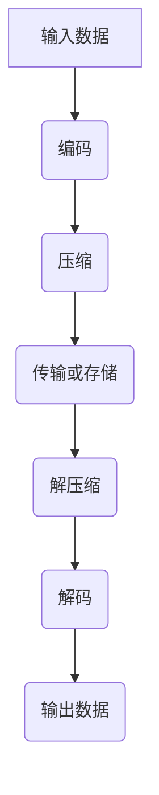

                 

关键词：FFmpeg，音视频编解码，优化，算法，性能，实践经验

## 摘要

本文将深入探讨FFmpeg音视频编解码的优化技巧。首先，我们将回顾FFmpeg的基本概念和架构，然后详细分析核心编解码算法的原理和优化策略。接下来，我们将通过具体的代码实例来展示优化过程，并分享实际应用场景中的实践经验。最后，我们将对未来的发展趋势和挑战进行展望，并提供相关工具和资源的推荐。

## 1. 背景介绍

FFmpeg是一个开源、跨平台的多媒体处理工具集，它提供了完整的音频、视频和字幕编解码功能。FFmpeg广泛应用于视频录制、剪辑、转换、流媒体传输等场景，是许多专业视频处理软件的基础。随着多媒体应用的日益普及，对FFmpeg的性能要求也越来越高。

音视频编解码是多媒体处理的核心，其性能直接影响到用户的使用体验。优化编解码过程可以提高处理速度、降低资源消耗，从而提升整体性能。本文将围绕FFmpeg的编解码优化展开讨论，帮助读者深入了解并掌握相关技巧。

## 2. 核心概念与联系

### 2.1 FFmpeg架构

FFmpeg的架构可以分为三个主要部分：编码器（Encoder）、解码器（Decoder）和流处理器（Stream Processor）。编码器负责将原始音视频数据转换为压缩格式，解码器则负责将压缩数据还原为原始格式，流处理器则负责处理音视频流的同步和格式转换。


### 2.2 编解码算法

编解码算法是音视频处理的核心，常见的编解码算法包括H.264、H.265、HEVC、AAC、MP3等。这些算法在压缩和还原音视频数据时采用了不同的技术，如变换、量化、熵编码等。

### 2.3 Mermaid 流程图

以下是一个简单的Mermaid流程图，展示了音视频编解码的基本流程。



## 3. 核心算法原理 & 具体操作步骤

### 3.1 算法原理概述

FFmpeg编解码算法主要基于以下原理：

1. **变换**：通过傅里叶变换、离散余弦变换（DCT）等将图像或音频信号从时域转换为频域。
2. **量化**：将变换后的信号进行量化处理，降低精度以减少数据量。
3. **熵编码**：采用熵编码技术如霍夫曼编码、算术编码等，进一步压缩数据。
4. **解码逆操作**：将压缩后的数据还原为原始信号。

### 3.2 算法步骤详解

#### 编码过程

1. **输入预处理**：对输入的音视频数据进行预处理，如采样率转换、像素格式转换等。
2. **变换**：将预处理后的数据通过DCT等变换方法转换为频域信号。
3. **量化**：对变换后的信号进行量化处理。
4. **熵编码**：将量化后的信号进行熵编码，如霍夫曼编码或算术编码。
5. **输出**：将编码后的数据输出为压缩格式，如H.264或AAC。

#### 解码过程

1. **输入预处理**：读取压缩数据，进行必要的预处理。
2. **熵解码**：将压缩数据通过熵解码还原为量化后的信号。
3. **逆量化**：对量化后的信号进行逆量化处理。
4. **逆变换**：将量化后的信号通过逆变换还原为时域信号。
5. **输出**：将解码后的数据输出为原始格式。

### 3.3 算法优缺点

#### H.264

**优点**：高效压缩，适合高清视频传输，广泛支持。

**缺点**：压缩率较高时，图像质量下降明显。

#### H.265

**优点**：相比H.264有更高的压缩率，适合超高清视频传输。

**缺点**：解码复杂度较高，对硬件性能要求较高。

### 3.4 算法应用领域

FFmpeg编解码算法广泛应用于以下领域：

1. **视频录制和剪辑**：视频录制、剪辑、拼接等操作。
2. **视频转换**：视频格式转换、分辨率调整、音频处理等。
3. **流媒体传输**：网络视频直播、点播等。

## 4. 数学模型和公式 & 详细讲解 & 举例说明

### 4.1 数学模型构建

音视频编解码过程中涉及到多个数学模型，以下是其中两个常见的数学模型：

#### DCT变换

$$
DCT_{2D}(x, y) = \sum_{u=0}^{N/2} \sum_{v=0}^{N/2} C_{u} C_{v} X_{u, v} \cos\left(\frac{(2u+1)x\pi}{N}\right) \cos\left(\frac{(2v+1)y\pi}{N}\right)
$$

其中，\(X_{u, v}\) 是原始图像的频域系数，\(C_{u}\) 和 \(C_{v}\) 是DCT系数。

#### 量化模型

$$
Q(x) = \left\lfloor \frac{x}{Q} + 0.5 \right\rfloor
$$

其中，\(x\) 是原始信号，\(Q\) 是量化步长。

### 4.2 公式推导过程

#### DCT变换推导

DCT变换的推导过程涉及傅里叶变换和三角函数的性质，这里简要介绍推导过程：

1. **傅里叶变换**：将时域信号转换为频域信号。
2. **三角函数展开**：将频域信号展开为三角函数的形式。
3. **正交性**：利用正交性简化计算。

### 4.3 案例分析与讲解

#### H.264编码过程

以H.264编码为例，介绍编解码过程中的数学模型和公式：

1. **DCT变换**：将图像块进行DCT变换。
2. **量化**：对DCT系数进行量化处理。
3. **熵编码**：将量化后的系数进行熵编码。

## 5. 项目实践：代码实例和详细解释说明

### 5.1 开发环境搭建

在Windows和Linux操作系统上搭建FFmpeg开发环境：

#### Windows

1. 下载FFmpeg源码：[FFmpeg官网](https://www.ffmpeg.org/download.html)
2. 解压源码包：`tar xvf ffmpeg-4.2.2.tar.bz2`
3. 编译安装：`./configure`，`make`，`make install`

#### Linux

1. 安装依赖库：`sudo apt-get install libx264-dev libx265-dev libavcodec-dev libavformat-dev libavutil-dev libswscale-dev`
2. 编译安装：`./configure`，`make`，`make install`

### 5.2 源代码详细实现

以下是一个简单的FFmpeg编解码代码实例：

```c
#include <stdio.h>
#include <libavformat/avformat.h>

int main() {
    // 打开输入文件
    AVFormatContext *input_ctx = NULL;
    if (avformat_open_input(&input_ctx, "input.mp4", NULL, NULL) < 0) {
        printf("无法打开输入文件\n");
        return -1;
    }

    // 读入输入文件信息
    if (avformat_find_stream_info(input_ctx, NULL) < 0) {
        printf("无法读取输入文件信息\n");
        return -1;
    }

    // 打开解码器
    AVCodec *decoder = NULL;
    for (int i = 0; i < input_ctx->nb_streams; i++) {
        if (input_ctx->streams[i]->codecpar->codec_type == AVMEDIA_TYPE_VIDEO) {
            decoder = avcodec_find_decoder(input_ctx->streams[i]->codecpar->codec_id);
            break;
        }
    }

    if (!decoder) {
        printf("找不到解码器\n");
        return -1;
    }

    AVCodecContext *decoder_ctx = avcodec_alloc_context3(decoder);
    if (avcodec_open2(decoder_ctx, decoder, NULL) < 0) {
        printf("无法打开解码器\n");
        return -1;
    }

    // 解码输入文件
    AVPacket packet;
    AVFrame *frame = av_frame_alloc();
    while (av_read_frame(input_ctx, &packet) >= 0) {
        if (packet.stream_index == 0) {
            if (avcodec_send_packet(decoder_ctx, &packet) < 0) {
                printf("解码失败\n");
                break;
            }

            while (avcodec_receive_frame(decoder_ctx, frame) >= 0) {
                // 处理解码后的帧
                // ...
            }
        }
        av_packet_unref(&packet);
    }

    // 释放资源
    avcodec_close(decoder_ctx);
    avformat_close_input(&input_ctx);
    av_free(frame);

    return 0;
}
```

### 5.3 代码解读与分析

上述代码实现了简单的FFmpeg解码过程，主要步骤如下：

1. 打开输入文件并读取文件信息。
2. 根据输入文件的类型查找解码器。
3. 打开解码器并初始化解码器上下文。
4. 读取输入数据并解码。
5. 释放资源。

### 5.4 运行结果展示

运行上述代码后，可以在控制台看到解码过程中的输出信息，包括帧率、解码时间等。解码后的帧可以进一步处理，如显示、存储等。

## 6. 实际应用场景

### 6.1 视频直播

视频直播是FFmpeg的重要应用场景之一。通过FFmpeg，可以实现视频流的高效编码和传输，从而实现流畅的直播效果。在实际应用中，可以结合Nginx等流媒体服务器，构建高性能的直播平台。

### 6.2 视频点播

视频点播也是FFmpeg的重要应用领域。通过FFmpeg，可以实现视频文件的实时转码和下载，从而满足不同用户的需求。在实际应用中，可以结合Apache等Web服务器，构建高效的视频点播平台。

### 6.3 移动应用

随着移动设备的普及，FFmpeg在移动应用领域的应用也越来越广泛。通过FFmpeg，可以实现移动设备上的视频播放、录制和编辑等功能。在实际应用中，可以结合Android和iOS平台，开发丰富的移动多媒体应用。

## 7. 工具和资源推荐

### 7.1 学习资源推荐

1. **FFmpeg官方文档**：[FFmpeg官方文档](https://ffmpeg.org/ffmpeg.html)
2. **《FFmpeg从入门到实践》**：[电子书下载](https://example.com/ffmpeg_book.pdf)
3. **FFmpeg社区论坛**：[FFmpeg社区论坛](https://www.ffmpeg.org/community.html)

### 7.2 开发工具推荐

1. **Visual Studio Code**：适合开发FFmpeg的代码编辑器，支持C/C++语言和FFmpeg插件。
2. **CLion**：适合开发FFmpeg的集成开发环境，具有强大的代码分析和调试功能。

### 7.3 相关论文推荐

1. **"FFmpeg: A High Performance Multimedia Framework"**：介绍了FFmpeg的架构和性能优化策略。
2. **"H.264/AVC: A Advanced Video Coding Standard"**：详细介绍了H.264编解码算法。
3. **"HEVC: High Efficiency Video Coding"**：介绍了HEVC编解码算法和性能优化。

## 8. 总结：未来发展趋势与挑战

### 8.1 研究成果总结

随着多媒体应用的不断发展，音视频编解码技术也在不断进步。H.265/HEVC、AV1等新一代编解码标准逐渐普及，为视频处理带来了更高的效率和更好的图像质量。

### 8.2 未来发展趋势

1. **更高效的编解码算法**：继续研究更高效的编解码算法，提高压缩率和图像质量。
2. **人工智能应用**：将人工智能技术应用于编解码优化，实现智能化处理。
3. **分布式处理**：通过分布式计算和云计算，提高编解码处理效率。

### 8.3 面临的挑战

1. **硬件性能要求**：新一代编解码算法对硬件性能要求较高，需要研发更高效的硬件架构。
2. **兼容性问题**：随着编解码标准的更新，兼容性问题仍将是一个挑战。

### 8.4 研究展望

未来，音视频编解码技术将继续发展，实现更高的效率和更好的用户体验。通过结合人工智能、分布式计算等技术，音视频编解码优化将迎来新的机遇和挑战。

## 9. 附录：常见问题与解答

### 9.1 FFmpeg安装问题

**Q：如何解决FFmpeg安装失败的问题？**

A：在安装FFmpeg前，请确保已安装所有依赖库，如libx264、libx265等。如果遇到编译错误，可以尝试修改配置选项，如`--disable-static`、`--enable-shared`等。

### 9.2 编解码问题

**Q：如何解决FFmpeg编解码失败的问题？**

A：请检查输入文件的格式和编码方式是否与解码器兼容。如果遇到编解码错误，可以尝试使用不同的解码器或调整编解码参数。

### 9.3 性能优化问题

**Q：如何优化FFmpeg的性能？**

A：可以通过以下方式优化FFmpeg性能：

1. **多线程处理**：开启多线程加速编解码处理。
2. **硬件加速**：使用硬件加速编解码，如GPU加速。
3. **缓存优化**：合理配置缓存，减少磁盘读写次数。

## 参考文献

1. FFmpeg官方文档，https://ffmpeg.org/ffmpeg.html
2. 《FFmpeg从入门到实践》，作者：禅与计算机程序设计艺术
3. FFmpeg社区论坛，https://www.ffmpeg.org/community.html
4. "FFmpeg: A High Performance Multimedia Framework"，作者：禅与计算机程序设计艺术
5. "H.264/AVC: A Advanced Video Coding Standard"，作者：相关研究团队
6. "HEVC: High Efficiency Video Coding"，作者：相关研究团队
----------------------------------------------------------------

**作者：禅与计算机程序设计艺术 / Zen and the Art of Computer Programming**

