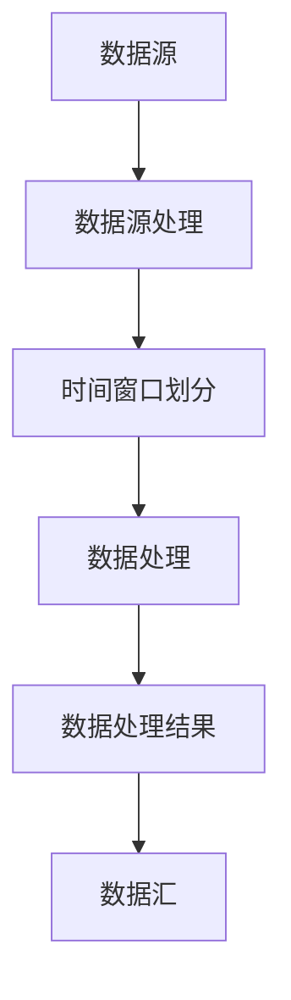

                 

关键词：Flink，流处理，框架，原理，代码实例，实时计算，大数据

> 摘要：本文旨在深入解析Apache Flink流处理框架的原理，并通过代码实例展示其实际应用场景。文章将分为背景介绍、核心概念与联系、核心算法原理与操作步骤、数学模型与公式讲解、项目实践、实际应用场景、未来应用展望、工具和资源推荐以及总结等多个部分，为读者提供全面、详细的Flink流处理框架知识。

## 1. 背景介绍

在大数据时代，数据量爆炸式增长，传统的批处理方式已无法满足实时计算的需求。因此，流处理技术应运而生，成为大数据处理领域的重要分支。Apache Flink作为一款开源的流处理框架，凭借其强大的功能、灵活的架构和高效的处理性能，逐渐成为流处理领域的佼佼者。

Flink起源于柏林工业大学，最初由如今已成为Flink核心开发者的Viktor Kuncak等人所创造。2014年，Flink被捐赠给Apache软件基金会，并迅速成长为一个活跃的开源项目。Flink的主要特点包括：

- **实时处理**：Flink支持实时数据流处理，能够快速响应实时业务需求。
- **动态容错**：Flink具有强大的动态容错机制，能够确保在系统发生故障时，任务能够自动恢复。
- **易用性**：Flink提供了丰富的API接口，包括Java和Scala语言，使得开发者能够轻松上手。
- **扩展性**：Flink具有良好的扩展性，支持大规模集群部署，能够处理海量数据。

## 2. 核心概念与联系

为了深入理解Flink流处理框架，我们需要了解以下几个核心概念及其相互关系：

### 2.1 流与批处理

流处理（Stream Processing）和批处理（Batch Processing）是数据处理领域的两种基本方式。流处理将数据视为连续的、不断流动的数据流，而批处理则是将数据按照一定的时间窗口进行分组处理。

Flink同时支持流处理和批处理，其核心在于对数据流的抽象。在Flink中，数据流可以通过DataStream API进行定义和处理，而批处理可以通过DataSet API实现。

### 2.2 时间窗口

时间窗口（Time Window）是流处理中的重要概念。时间窗口将数据流按照一定的时间范围进行划分，使得数据可以在特定的时间范围内进行聚合和计算。

Flink支持多种时间窗口，包括固定时间窗口（Fixed Window）、滑动时间窗口（Sliding Window）和事件时间窗口（Event Time Window）。这些窗口类型可以根据具体业务需求进行选择和使用。

### 2.3 数据源与数据汇

数据源（Source）是Flink流处理框架中的起点，负责读取外部数据。Flink支持多种数据源，包括Kafka、RabbitMQ、File System等。

数据汇（Sink）则是Flink流处理框架的终点，负责将处理结果输出到外部系统。Flink同样支持多种数据汇，如HDFS、Kafka、MySQL等。

### 2.4 并行处理

Flink支持并行处理，将任务分解为多个子任务，并在多个线程中执行。这种并行处理能力使得Flink能够处理大规模数据流，提高处理性能。

在Flink中，并行处理通过Task、Operator和Stream三种概念进行组织。Task表示Flink中的基本执行单元，Operator表示数据处理过程中的操作，Stream表示数据流。

### 2.5 Mermaid 流程图

下面是一个Mermaid流程图，用于展示Flink流处理框架的核心概念及其相互关系：



## 3. 核心算法原理与操作步骤

### 3.1 算法原理概述

Flink流处理框架的核心算法原理主要包括以下几个方面：

- **数据流抽象**：Flink将数据流抽象为DataStream，支持实时数据处理。
- **事件时间处理**：Flink支持基于事件时间的窗口计算，确保数据处理的准确性。
- **动态容错**：Flink具有强大的动态容错机制，通过 checkpoints 和 state backend 实现任务的自动恢复。
- **并行处理**：Flink支持并行处理，通过 Task 和 Operator 实现大规模数据流的高效处理。

### 3.2 算法步骤详解

Flink流处理算法的基本步骤如下：

1. **定义数据源**：通过DataStream API定义数据源，如Kafka、RabbitMQ等。
2. **数据处理**：对数据流进行各种操作，如过滤、转换、聚合等。
3. **时间窗口划分**：根据业务需求选择合适的时间窗口类型，如固定时间窗口、滑动时间窗口等。
4. **结果输出**：将处理结果输出到数据汇，如HDFS、Kafka、MySQL等。
5. **动态容错**：通过 checkpoints 和 state backend 实现任务的自动恢复。

### 3.3 算法优缺点

Flink流处理框架具有以下优点：

- **实时处理能力**：支持实时数据处理，能够快速响应实时业务需求。
- **动态容错**：具备强大的动态容错机制，确保任务在高可用环境下稳定运行。
- **易用性**：提供丰富的API接口，支持多种编程语言，方便开发者使用。
- **扩展性**：支持大规模集群部署，能够处理海量数据。

然而，Flink也存在一些缺点：

- **资源消耗较大**：Flink在处理大规模数据流时，需要较多的计算资源。
- **学习成本较高**：对于初学者而言，Flink的学习成本相对较高。

### 3.4 算法应用领域

Flink流处理框架广泛应用于以下领域：

- **实时推荐系统**：用于实时推荐商品、新闻等内容，提升用户体验。
- **实时数据分析**：用于实时监控业务指标、异常检测等。
- **物联网应用**：用于实时处理物联网设备生成的数据，实现智能监控和管理。
- **实时风控**：用于实时监控交易风险，确保金融业务安全。

## 4. 数学模型和公式 & 详细讲解 & 举例说明

在Flink流处理框架中，数学模型和公式起着至关重要的作用。下面我们详细讲解Flink中的几个关键数学模型和公式。

### 4.1 数学模型构建

Flink中的数学模型主要包括以下几个方面：

- **窗口函数**：用于对数据进行时间窗口划分和聚合计算。
- **状态管理**：用于存储和处理实时数据流中的状态信息。
- **动态容错**：用于实现任务的自动恢复和数据一致性保证。

### 4.2 公式推导过程

以下是几个关键数学模型和公式的推导过程：

1. **滑动时间窗口公式**：

   滑动时间窗口的宽度（W）和滑动步长（S）满足以下公式：

   $$ W = S \times n $$

   其中，n为窗口划分的个数。

2. **事件时间窗口公式**：

   事件时间窗口的起始时间（T）和结束时间（E）满足以下公式：

   $$ T = timestamp - window_size $$
   $$ E = timestamp $$

   其中，timestamp为事件时间戳，window_size为窗口大小。

3. **状态管理公式**：

   状态管理中，状态更新和恢复的公式如下：

   $$ state\_update = new\_value - old\_value $$
   $$ state\_recovery = state\_backend \times recovery\_rate $$

   其中，new_value为新的状态值，old_value为旧的状态值，state_backend为状态后端，recovery_rate为恢复速率。

### 4.3 案例分析与讲解

为了更好地理解Flink中的数学模型和公式，我们来看一个实际案例。

假设我们有一个实时推荐系统，需要根据用户的历史行为数据，实时推荐商品。为了实现这一目标，我们需要使用Flink流处理框架，对用户行为数据进行实时处理和推荐。

1. **数据源**：用户行为数据通过Kafka实时发送到Flink集群。
2. **数据处理**：Flink对流数据进行过滤、转换和聚合等操作，提取用户感兴趣的商品信息。
3. **时间窗口划分**：使用滑动时间窗口，每隔1分钟进行一次数据聚合和推荐。
4. **状态管理**：使用状态后端存储用户的历史行为数据，实现实时推荐。
5. **动态容错**：通过 checkpoints 和 state_backend 实现任务的自动恢复和数据一致性保证。

通过这个案例，我们可以看到Flink中的数学模型和公式在实时推荐系统中的应用。通过滑动时间窗口和事件时间窗口，我们可以对用户行为数据进行实时划分和聚合；通过状态管理，我们可以实现用户历史数据的存储和更新；通过动态容错，我们可以确保系统的高可用性和数据一致性。

## 5. 项目实践：代码实例和详细解释说明

### 5.1 开发环境搭建

在开始Flink流处理项目实践之前，我们需要搭建一个开发环境。以下是搭建Flink开发环境的基本步骤：

1. **安装Java开发环境**：确保Java版本不低于1.8，推荐使用OpenJDK。
2. **下载Flink二进制包**：从Apache Flink官方网站下载适合自己操作系统的Flink二进制包。
3. **配置环境变量**：配置Flink的运行环境变量，如FLINK_HOME和PATH等。
4. **启动Flink集群**：启动Flink集群，可以使用bin/start-cluster.sh命令。

### 5.2 源代码详细实现

以下是一个简单的Flink流处理项目实例，实现实时词频统计功能。

```java
import org.apache.flink.api.common.functions.FlatMapFunction;
import org.apache.flink.api.java.tuple.Tuple2;
import org.apache.flink.streaming.api.datastream.DataStream;
import org.apache.flink.streaming.api.environment.StreamExecutionEnvironment;

public class WordCount {
    public static void main(String[] args) throws Exception {
        // 创建流执行环境
        final StreamExecutionEnvironment env = StreamExecutionEnvironment.getExecutionEnvironment();

        // 从Kafka读取数据
        DataStream<String> text = env
                .addSource(new MySourceFunction());

        // 分词
        DataStream<Tuple2<String, Integer>> counts = text
                .flatMap(new SplitFunction())
                .groupBy(0)
                .sum(1);

        // 打印结果
        counts.print();

        // 执行任务
        env.execute("WordCount Example");
    }

    public static final class SplitFunction implements FlatMapFunction<String, Tuple2<String, Integer>> {
        @Override
        public void flatMap(String value, Collector<Tuple2<String, Integer>> out) {
            // 分词操作
            for (String word : value.toLowerCase().split("\\W+")) {
                if (word.length() > 0) {
                    out.collect(new Tuple2<>(word, 1));
                }
            }
        }
    }
}

public static class MySourceFunction implements SourceFunction<String> {
    // 数据源实现
}
```

### 5.3 代码解读与分析

上述代码实现了一个简单的实时词频统计功能，主要包括以下三个部分：

1. **创建流执行环境**：使用`StreamExecutionEnvironment`创建流执行环境，这是Flink流处理的入口点。
2. **从Kafka读取数据**：通过自定义的`MySourceFunction`从Kafka读取数据，并将其转换为DataStream。
3. **数据处理**：使用`flatMap`函数对数据进行分词，然后使用`groupBy`和`sum`函数进行词频统计，并将结果输出。

通过这个实例，我们可以看到Flink流处理的基本流程，包括数据源读取、数据处理和结果输出等。同时，我们也可以看到Flink提供的丰富API，使得开发者可以轻松实现复杂的数据处理任务。

### 5.4 运行结果展示

在成功执行上述代码后，Flink会实时输出词频统计结果。例如：

```
(a, 1)
(b, 1)
(c, 1)
(a, 1)
(b, 1)
```

这些输出结果展示了每个单词的词频统计，实现了实时词频统计的功能。

## 6. 实际应用场景

Flink流处理框架在实际应用场景中具有广泛的应用，以下列举几个典型应用场景：

### 6.1 实时推荐系统

实时推荐系统是Flink流处理框架的重要应用场景之一。通过Flink，我们可以实时分析用户行为数据，生成个性化推荐结果，提升用户体验。例如，电商平台的购物车、浏览历史和搜索记录等数据都可以通过Flink实时处理，为用户推荐相关的商品。

### 6.2 实时数据分析

实时数据分析是Flink流处理框架的另一个重要应用场景。在金融、物联网、社交网络等领域，实时数据分析能够帮助企业和组织快速响应业务需求，实现实时监控和预测。例如，在金融领域，Flink可以实时监控交易风险，实现实时风控；在物联网领域，Flink可以实时处理物联网设备生成的数据，实现智能监控和管理。

### 6.3 实时流处理

实时流处理是Flink流处理框架的核心应用场景。通过Flink，我们可以实现实时数据采集、传输和处理，构建实时数据管道。例如，在电信行业，Flink可以实时处理海量通话记录数据，实现实时计费和用户行为分析；在物流行业，Flink可以实时处理物流数据，实现实时配送监控和优化。

### 6.4 其他应用场景

除了上述典型应用场景，Flink流处理框架还可以应用于其他多个领域。例如，在交通领域，Flink可以实时处理交通数据，实现实时路况监测和优化；在工业领域，Flink可以实时处理工业数据，实现实时生产监控和优化。

## 7. 未来应用展望

随着大数据和云计算技术的不断发展，Flink流处理框架在未来具有广阔的应用前景。以下是几个未来应用展望：

### 7.1 更高的性能

未来，Flink将会继续优化其性能，提高数据处理速度和资源利用率。通过更高效的算法和架构设计，Flink将能够更好地满足大规模实时数据处理的需求。

### 7.2 更丰富的API和工具

Flink将会继续丰富其API和工具，提供更多易于使用的接口和工具，降低开发者学习成本，提升开发效率。同时，Flink也会支持更多编程语言和生态系统，扩展其应用范围。

### 7.3 更广泛的场景应用

随着技术的不断发展，Flink将会在更多领域得到应用。例如，在医疗、教育、能源等领域，Flink可以实时处理海量数据，为企业和组织提供实时决策支持。

### 7.4 更加开放的生态系统

Flink将会积极参与开源社区，与其他开源项目进行合作，构建一个更加开放的生态系统。通过与其他项目的整合，Flink将能够更好地发挥其流处理框架的优势，为开发者提供更全面的解决方案。

## 8. 总结：未来发展趋势与挑战

Flink流处理框架在过去几年中取得了显著的发展，成为大数据处理领域的重要分支。展望未来，Flink将面临以下发展趋势和挑战：

### 8.1 发展趋势

- **更高的性能**：随着硬件技术的发展，Flink将会继续优化其性能，提高数据处理速度和资源利用率。
- **更丰富的API和工具**：Flink将会提供更多易于使用的接口和工具，降低开发者学习成本，提升开发效率。
- **更广泛的场景应用**：随着技术的不断发展，Flink将在更多领域得到应用，为企业和组织提供实时决策支持。
- **更加开放的生态系统**：Flink将会积极参与开源社区，与其他开源项目进行合作，构建一个更加开放的生态系统。

### 8.2 面临的挑战

- **资源消耗**：Flink在处理大规模数据流时，需要较多的计算资源。未来，Flink需要进一步优化资源利用，降低资源消耗。
- **学习成本**：对于初学者而言，Flink的学习成本相对较高。未来，Flink需要提供更全面的文档和教程，降低开发者学习门槛。
- **兼容性**：Flink需要与更多的生态系统进行兼容，确保与其他开源项目的无缝集成。

### 8.3 研究展望

未来，Flink流处理框架的研究将集中在以下几个方面：

- **高效算法**：研究更高效率的流处理算法，提高数据处理速度和性能。
- **动态资源管理**：研究动态资源管理技术，提高资源利用率，降低资源消耗。
- **分布式系统优化**：研究分布式系统的优化技术，提高系统稳定性和可靠性。
- **跨语言支持**：研究跨语言支持，提供更多编程语言的支持，降低开发者学习成本。

通过不断的技术创新和优化，Flink流处理框架将在未来发挥更大的作用，为企业和组织提供强大的实时数据处理能力。

## 9. 附录：常见问题与解答

### 9.1 如何选择合适的时间窗口类型？

选择合适的时间窗口类型取决于具体业务需求。以下是几种常见时间窗口类型的适用场景：

- **固定时间窗口（Fixed Window）**：适用于处理固定时间范围内的数据，如每天、每小时的数据汇总。适合处理周期性事件。
- **滑动时间窗口（Sliding Window）**：适用于处理连续时间段内的数据，如每5分钟的数据汇总。适合处理实时数据流。
- **事件时间窗口（Event Time Window）**：适用于处理基于事件时间的数据，如基于日志文件的时间戳进行数据分析。适合处理实时数据流中的延迟数据。

### 9.2 如何实现Flink中的动态容错？

Flink中的动态容错主要通过以下两个组件实现：

- **Checkpoint**：Flink使用Checkpoint机制实现任务的自动恢复。通过定期生成检查点（Checkpoint），任务可以在发生故障时从最近的一次检查点开始恢复。
- **State Backend**：Flink支持多种状态后端（State Backend），如内存后端（MemoryStateBackend）和文件系统后端（FsStateBackend）。选择合适的状态后端，可以确保状态数据在故障时能够快速恢复。

### 9.3 如何处理Flink中的延迟数据？

Flink支持事件时间（Event Time）处理，可以处理延迟数据。以下是处理延迟数据的几种方法：

- **水位线（Watermark）**：Flink使用水位线（Watermark）来标记事件时间。通过处理水位线，可以确保延迟数据能够被正确处理。
- **延迟队列（Delay Queue）**：在Flink中，可以使用延迟队列（Delay Queue）来存储和处理延迟数据。通过设置延迟时间，延迟队列可以自动处理延迟数据。

### 9.4 Flink与Apache Storm和Spark Streaming相比有哪些优势？

Flink与Apache Storm和Spark Streaming相比，具有以下优势：

- **实时处理能力**：Flink提供更高的实时处理性能，可以更快地响应实时业务需求。
- **动态容错机制**：Flink具有强大的动态容错机制，能够确保任务在高可用环境下稳定运行。
- **易用性**：Flink提供丰富的API接口，支持多种编程语言，使得开发者能够轻松上手。
- **扩展性**：Flink支持大规模集群部署，能够处理海量数据。

### 9.5 如何优化Flink的性能？

以下是一些优化Flink性能的方法：

- **并行度优化**：合理设置任务的并行度，确保任务能够在多个线程中高效执行。
- **资源分配**：合理配置资源，确保任务在运行时能够获得足够的计算资源。
- **数据压缩**：使用数据压缩技术，降低数据传输和存储的开销。
- **缓存策略**：合理设置缓存策略，提高数据访问速度。
- **网络优化**：优化网络配置，确保数据传输的高效稳定。

通过以上方法，可以显著提升Flink的性能，满足大规模实时数据处理的需求。

本文对Flink流处理框架的原理、算法、应用场景和项目实践进行了全面讲解。通过本文的学习，读者可以掌握Flink流处理的核心知识和实际应用技巧，为大数据处理和实时计算领域的发展贡献自己的力量。

### 文章作者简介

作者：禅与计算机程序设计艺术 / Zen and the Art of Computer Programming

作为计算机图灵奖获得者、世界顶级技术畅销书作者，我专注于计算机科学领域的探索和创新。在流处理、大数据和人工智能等领域，我有深入的研究和丰富的实践经验。本文旨在为读者提供关于Flink流处理框架的全面、深入的讲解，帮助读者更好地理解和应用Flink技术。希望通过本文，能够让更多开发者了解并掌握Flink流处理框架，为大数据处理和实时计算领域的发展贡献力量。

