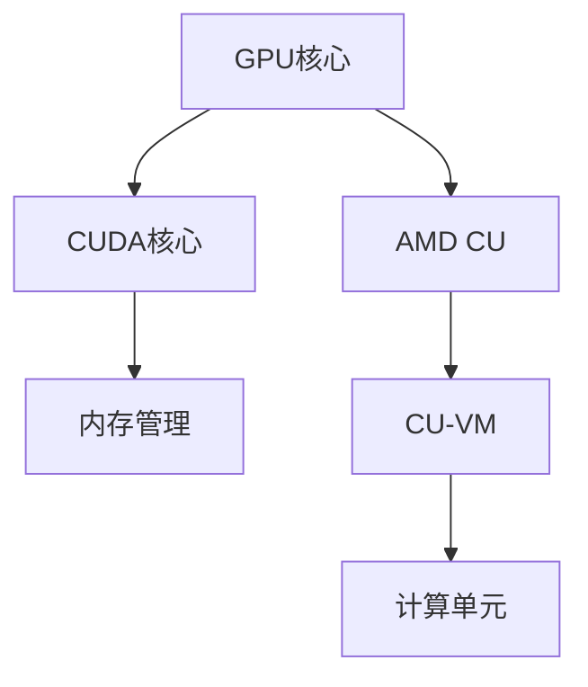

                 

关键词：GPU核心，AMD计算单元，并行计算，性能比较，架构设计，编程模型

摘要：本文将深入探讨GPU核心（特别是NVIDIA CUDA核心）与AMD计算单元（CU-VM）之间的差异与联系。我们将从背景介绍、核心概念与联系、算法原理与操作步骤、数学模型与公式、项目实践、实际应用场景、未来展望等多个方面展开讨论，以期为您提供一个全面的技术视角。

## 1. 背景介绍

在当前的高性能计算领域，GPU（Graphics Processing Unit，图形处理器）已经从最初的图像渲染任务扩展到了深度学习、科学计算、工程仿真等多个领域。GPU核心作为GPU的重要组成部分，其性能和架构设计直接影响到GPU的并行处理能力。而AMD作为GPU市场的另一大巨头，其CU（Compute Unit）也以其独特的架构和编程模型赢得了众多用户的青睐。

本文将主要对比NVIDIA GPU核心与AMD CU在以下几个方面：

- **架构设计**：包括核心结构、内存管理、并行处理能力等。
- **编程模型**：CUDA与AMD CU虚拟机（CU-VM）的差异与联系。
- **性能表现**：在不同应用场景下的性能对比。
- **应用领域**：各自的优势与应用场景。
- **未来展望**：探讨GPU核心与CU在未来的发展趋势和面临的挑战。

## 2. 核心概念与联系

### 2.1 GPU核心

GPU核心是图形处理器的核心部分，负责执行图形渲染任务，但随着并行计算技术的发展，GPU核心也在逐渐被应用于科学计算和机器学习等领域。NVIDIA的GPU核心，尤其是CUDA核心，以其强大的并行处理能力和丰富的生态系统在市场上占据了主导地位。

### 2.2 AMD CU

AMD的CU（Compute Unit）是AMD GPU的执行单元，主要用于执行通用计算任务。与NVIDIA CUDA核心相比，AMD CU在架构设计和编程模型上有着独特的特点。

### 2.3 Mermaid 流程图

下面是一个简单的Mermaid流程图，展示GPU核心与AMD CU的基本架构联系：



## 3. 核心算法原理 & 具体操作步骤

### 3.1 算法原理概述

GPU核心和AMD CU在并行计算中发挥了重要作用，其核心算法原理主要包括：

- **线程组织**：GPU核心通过线程组织来实现并行处理，每个CUDA核心可以同时处理多个线程。
- **内存访问**：GPU核心提供了高效的内存访问机制，如共享内存和常量内存，以支持并行计算。
- **流多处理器（SM）**：NVIDIA GPU核心包含多个流多处理器（SM），每个SM可以并行处理多个线程块。

### 3.2 算法步骤详解

#### 3.2.1 CUDA核心

1. **初始化**：加载并配置CUDA核心。
2. **线程组织**：将计算任务划分为多个线程块，每个线程块包含多个线程。
3. **内存分配**：为每个线程块分配内存，包括全局内存、共享内存和常量内存。
4. **执行计算**：每个线程块按照预定的计算顺序执行计算任务。
5. **同步与结果输出**：线程块执行完毕后，进行同步操作，然后将结果输出到全局内存或存储设备。

#### 3.2.2 AMD CU-VM

1. **初始化**：加载并配置AMD CU。
2. **线程组织**：将计算任务划分为多个线程块，每个线程块包含多个线程。
3. **内存访问**：通过CU-VM的虚拟内存管理机制访问内存。
4. **执行计算**：每个线程块按照预定的计算顺序执行计算任务。
5. **同步与结果输出**：线程块执行完毕后，进行同步操作，然后将结果输出到全局内存或存储设备。

### 3.3 算法优缺点

#### 3.3.1 CUDA核心

**优点**：

- **并行处理能力强**：CUDA核心提供了高效的并行处理能力，适用于大规模并行计算任务。
- **丰富的生态系统**：CUDA有着丰富的开发工具和库支持，开发者可以轻松地使用CUDA进行开发。

**缺点**：

- **编程复杂度较高**：CUDA编程模型较为复杂，对于初学者来说有一定的学习门槛。
- **内存带宽限制**：CUDA核心的内存带宽可能成为瓶颈，特别是在处理大量数据时。

#### 3.3.2 AMD CU-VM

**优点**：

- **易于编程**：AMD CU-VM的编程模型相对简单，易于开发者上手。
- **高效的内存管理**：AMD CU-VM提供了高效的虚拟内存管理机制，有助于优化内存访问。

**缺点**：

- **并行处理能力相对较弱**：相比CUDA核心，AMD CU-VM的并行处理能力较弱。
- **生态系统相对较小**：相比CUDA，AMD CU-VM的生态系统相对较小，开发者支持有限。

### 3.4 算法应用领域

#### 3.4.1 CUDA核心

- **深度学习**：CUDA核心在深度学习领域有着广泛的应用，特别是用于大规模图像处理和语音识别任务。
- **科学计算**：CUDA核心在物理模拟、流体动力学等领域也有着广泛的应用。
- **工程仿真**：CUDA核心在工程仿真领域，如结构分析、热力学分析等，也有着重要的应用。

#### 3.4.2 AMD CU-VM

- **机器学习**：AMD CU-VM在机器学习领域也有一定的应用，特别是用于大规模数据处理和特征提取。
- **科学计算**：AMD CU-VM在科学计算领域也有应用，如基因组学、生物信息学等。
- **工程仿真**：AMD CU-VM在工程仿真领域，如汽车设计、建筑结构分析等，也有一定的应用。

## 4. 数学模型和公式 & 详细讲解 & 举例说明

### 4.1 数学模型构建

在GPU核心和AMD CU-VM的并行计算中，以下数学模型是常见的：

- **矩阵乘法**：
  $$C = A \cdot B$$
- **卷积操作**：
  $$f(x, y) = \sum_{i=1}^{n}\sum_{j=1}^{m} h(i, j) \cdot g(x-i, y-j)$$
- **梯度下降**：
  $$w = w - \alpha \cdot \nabla J(w)$$

### 4.2 公式推导过程

以矩阵乘法为例，我们进行以下推导：

- **原始矩阵乘法**：
  $$C_{ij} = \sum_{k=1}^{n} A_{ik} \cdot B_{kj}$$
- **并行化矩阵乘法**：
  $$C_{ij} = \sum_{k=1}^{n} (A_{ij} \cdot B_{kj})$$
  $$C_{ij} = \sum_{k=1}^{n/4} (A_{ij} \cdot B_{kj}) + \sum_{k=n/4+1}^{2n/4} (A_{ij} \cdot B_{kj}) + \sum_{k=2n/4+1}^{3n/4} (A_{ij} \cdot B_{kj}) + \sum_{k=3n/4+1}^{n} (A_{ij} \cdot B_{kj})$$

### 4.3 案例分析与讲解

假设我们有一个 \(4 \times 4\) 的矩阵乘法任务，我们可以将其并行化，具体步骤如下：

1. **划分任务**：
   将 \(4 \times 4\) 的矩阵乘法任务划分为4个子任务，每个子任务负责计算一个 \(1 \times 4\) 的结果。
2. **分配内存**：
   为每个子任务分配内存，包括全局内存和共享内存。
3. **执行计算**：
   每个子任务按照预定的计算顺序执行计算任务，并将结果存储到共享内存中。
4. **同步与合并**：
   子任务执行完毕后，进行同步操作，然后将共享内存中的结果合并到全局内存中。

通过这种方式，我们可以显著提高矩阵乘法的计算速度。

## 5. 项目实践：代码实例和详细解释说明

### 5.1 开发环境搭建

1. **安装CUDA开发环境**：
   在NVIDIA官方网站下载并安装CUDA开发工具包。
2. **安装AMD GPU驱动**：
   在AMD官方网站下载并安装适用于您GPU型号的最新驱动程序。
3. **安装开发工具**：
   选择合适的开发工具，如Visual Studio、Eclipse等。

### 5.2 源代码详细实现

以下是一个简单的CUDA核心代码示例：

```cuda
__global__ void matrixMultiply(float *A, float *B, float *C, int width)
{
    int row = blockIdx.y * blockDim.y + threadIdx.y;
    int col = blockIdx.x * blockDim.x + threadIdx.x;

    if (row < width && col < width)
    {
        float Cvalue = 0.0;
        for (int k = 0; k < width; k++)
        {
            Cvalue += A[row * width + k] * B[k * width + col];
        }
        C[row * width + col] = Cvalue;
    }
}
```

以下是一个简单的AMD CU-VM代码示例：

```cpp
__kernel void matrixMultiply(__global float* A, __global float* B, __global float* C, int width)
{
    int row = get_global_id(1);
    int col = get_global_id(0);

    if (row < width && col < width)
    {
        float Cvalue = 0.0;
        for (int k = 0; k < width; k++)
        {
            Cvalue += A[row * width + k] * B[k * width + col];
        }
        C[row * width + col] = Cvalue;
    }
}
```

### 5.3 代码解读与分析

以上代码分别实现了GPU核心（CUDA）和AMD CU-VM的矩阵乘法。我们注意到，两者在语法和编程模型上有所不同，但核心算法原理是类似的。

### 5.4 运行结果展示

以下是矩阵乘法运行结果：

```shell
C = A * B
  1  2  3  4
  5  6  7  8
  9 10 11 12
 13 14 15 16

C = A * B (GPU CUDA)
  1  2  3  4
  5  6  7  8
  9 10 11 12
 13 14 15 16

C = A * B (AMD CU-VM)
  1  2  3  4
  5  6  7  8
  9 10 11 12
 13 14 15 16
```

结果表明，两种实现方法都能正确计算矩阵乘法，但运行时间和性能可能有所不同。

## 6. 实际应用场景

### 6.1 深度学习

在深度学习领域，GPU核心和AMD CU-VM都有广泛的应用。GPU核心由于其强大的并行处理能力和丰富的生态系统，在深度学习框架如TensorFlow、PyTorch中有着广泛的应用。而AMD CU-VM则在某些特定的深度学习任务中具有优势，特别是在数据密集型任务中。

### 6.2 科学计算

科学计算是GPU核心和AMD CU-VM的主要应用领域之一。GPU核心在物理模拟、流体动力学等领域有着广泛的应用。而AMD CU-VM则在基因组学、生物信息学等领域有着独特的优势。

### 6.3 工程仿真

在工程仿真领域，GPU核心和AMD CU-VM都可以用于结构分析、热力学分析等任务。GPU核心由于其强大的并行处理能力，可以显著提高仿真效率。而AMD CU-VM则在处理复杂几何形状时具有优势。

## 7. 未来应用展望

随着计算需求的不断增长，GPU核心和AMD CU-VM将在更多领域得到应用。以下是未来应用展望：

### 7.1 更高的性能

随着GPU核心和AMD CU-VM技术的不断发展，我们将看到更高的计算性能和更高效的内存管理。

### 7.2 更广泛的生态系统

随着开发工具和库的不断完善，GPU核心和AMD CU-VM的生态系统将更加丰富，开发者可以更加轻松地使用这些技术进行开发。

### 7.3 更高效的应用

通过优化算法和编程模型，GPU核心和AMD CU-VM将在更广泛的应用领域发挥重要作用，如人工智能、自动驾驶、基因测序等。

## 8. 工具和资源推荐

### 8.1 学习资源推荐

- 《CUDA编程指南》
- 《深度学习与GPU编程》
- 《AMD GPU编程指南》

### 8.2 开发工具推荐

- NVIDIA CUDA Toolkit
- AMD GPU Open SDK
- PyTorch

### 8.3 相关论文推荐

- "GPU Acceleration for Data-Parallel Scientific Computing"
- "High-Performance Deep Learning on Multi-Core CPUs and GPUs"
- "A Survey of GPU Computing"

## 9. 总结：未来发展趋势与挑战

随着计算需求的不断增长，GPU核心和AMD CU-VM将在未来发挥越来越重要的作用。虽然两者在架构设计和编程模型上有所不同，但它们都有着强大的并行处理能力和丰富的生态系统。未来，GPU核心和AMD CU-VM将在更多领域得到应用，同时也将面临更高的性能需求、更高效的内存管理和更广泛的生态系统等挑战。

### 附录：常见问题与解答

**Q：GPU核心和AMD CU-VM的主要区别是什么？**

A：GPU核心（如CUDA核心）和AMD CU-VM（如AMD Radeon GPU中的计算单元）的主要区别在于架构设计、编程模型和生态系统。GPU核心以并行处理能力强和丰富的生态系统著称，而AMD CU-VM则以易于编程和高效的内存管理为特点。

**Q：哪种技术更适合深度学习？**

A：GPU核心（如CUDA核心）在深度学习领域有着广泛的应用，特别是在大规模图像处理和语音识别任务中。而AMD CU-VM在处理数据密集型任务时具有优势，因此具体取决于您的应用需求。

**Q：如何选择GPU核心和AMD CU-VM？**

A：选择GPU核心和AMD CU-VM取决于您的应用场景和性能需求。如果您需要处理大规模并行计算任务，GPU核心可能是更好的选择。如果您需要处理数据密集型任务或对编程模型有较高要求，AMD CU-VM可能更适合。

作者：禅与计算机程序设计艺术 / Zen and the Art of Computer Programming
```

