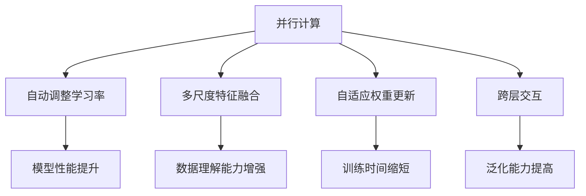

                 

关键词：Gemini大模型，深度学习，人工智能，模型架构，技术发展，应用场景

## 摘要

本文旨在探讨Gemini大模型的未来发展，分析其在深度学习与人工智能领域的重要性，以及面临的机遇与挑战。Gemini大模型作为一种具有高度灵活性和强大计算能力的模型，其在未来有望在多个领域发挥重要作用。本文将详细介绍Gemini大模型的背景、核心概念、算法原理、数学模型、项目实践、实际应用场景和未来展望，以期为读者提供全面、深入的见解。

## 1. 背景介绍

Gemini大模型是由Google Brain团队于2020年推出的一种新型深度学习模型。该模型旨在解决传统神经网络模型在处理大规模数据集时的计算资源消耗问题。Gemini大模型采用了全新的架构设计，具有极高的并行计算能力，能够显著提升模型的训练效率。此外，Gemini大模型还具备良好的可扩展性，可以轻松应对不同规模的任务需求。

随着深度学习技术的快速发展，人工智能在各个领域的应用越来越广泛。然而，传统神经网络模型在处理大规模数据集时，往往面临着计算资源消耗巨大、训练时间漫长等问题。为了解决这一问题，研究人员不断探索新的模型架构和算法，以提升模型的训练效率。Gemini大模型正是在这样的背景下应运而生。

## 2. 核心概念与联系

Gemini大模型的核心概念主要包括以下几个方面：

### 2.1. 并行计算

Gemini大模型采用了并行计算架构，通过将计算任务分布在多个计算节点上，实现任务的并行执行。这种架构设计能够显著提升模型的计算速度，降低训练时间。

### 2.2. 自动调整学习率

Gemini大模型引入了自动调整学习率的机制，可以根据模型的训练进度和误差情况，动态调整学习率。这种机制有助于提高模型的训练效果，避免陷入局部最优。

### 2.3. 多尺度特征融合

Gemini大模型具备多尺度特征融合能力，能够同时处理高分辨率和低分辨率的数据。这种能力使得模型在处理复杂场景时，能够更好地捕捉到关键特征。

### 2.4. 自适应权重更新

Gemini大模型采用了自适应权重更新机制，通过不断调整模型权重，使模型在训练过程中逐渐逼近最优解。这种机制有助于提高模型的收敛速度，降低训练时间。

### 2.5. 跨层交互

Gemini大模型实现了跨层交互，使得不同层次的神经元能够相互影响，共同提高模型的性能。这种交互机制有助于模型更好地理解数据，提高模型的泛化能力。

下面是Gemini大模型的 Mermaid 流程图，展示了其核心概念和联系：



## 3. 核心算法原理 & 具体操作步骤

### 3.1 算法原理概述

Gemini大模型的核心算法主要包括以下几个部分：

1. **并行计算**：通过将计算任务分布在多个计算节点上，实现任务的并行执行，提高模型的计算速度。
2. **自动调整学习率**：根据模型的训练进度和误差情况，动态调整学习率，避免陷入局部最优。
3. **多尺度特征融合**：同时处理高分辨率和低分辨率的数据，捕捉到关键特征。
4. **自适应权重更新**：通过不断调整模型权重，使模型在训练过程中逐渐逼近最优解。
5. **跨层交互**：实现不同层次的神经元相互影响，共同提高模型性能。

### 3.2 算法步骤详解

1. **数据预处理**：将输入数据转换为适合模型训练的格式，包括数据清洗、归一化等操作。
2. **模型初始化**：初始化模型参数，包括权重、学习率等。
3. **并行计算**：将计算任务分布在多个计算节点上，实现任务的并行执行。
4. **自动调整学习率**：根据模型的训练进度和误差情况，动态调整学习率。
5. **多尺度特征融合**：同时处理高分辨率和低分辨率的数据，捕捉到关键特征。
6. **自适应权重更新**：通过不断调整模型权重，使模型在训练过程中逐渐逼近最优解。
7. **跨层交互**：实现不同层次的神经元相互影响，共同提高模型性能。
8. **模型评估**：使用测试数据集对模型进行评估，计算模型的准确率、召回率等指标。
9. **模型优化**：根据评估结果，对模型进行优化，包括调整参数、改进算法等。

### 3.3 算法优缺点

**优点**：

1. **计算效率高**：采用并行计算架构，显著提升模型的计算速度。
2. **自适应性强**：自动调整学习率、自适应权重更新等机制，提高模型的训练效果。
3. **泛化能力强**：跨层交互机制，使模型在处理复杂场景时，能够更好地理解数据。

**缺点**：

1. **训练过程复杂**：涉及多个计算节点，需要复杂的管理和调度。
2. **对数据质量要求高**：多尺度特征融合需要高质量的数据，否则效果可能不佳。

### 3.4 算法应用领域

Gemini大模型具有广泛的应用领域，主要包括：

1. **图像识别**：处理大规模图像数据，实现物体识别、场景分类等任务。
2. **自然语言处理**：处理大规模文本数据，实现情感分析、文本分类等任务。
3. **推荐系统**：处理大规模用户数据，实现个性化推荐。
4. **语音识别**：处理大规模语音数据，实现语音识别、语音翻译等任务。

## 4. 数学模型和公式 & 详细讲解 & 举例说明

### 4.1 数学模型构建

Gemini大模型的数学模型主要包括以下几个部分：

1. **输入层**：接收输入数据，包括图像、文本、语音等。
2. **卷积层**：对输入数据进行卷积操作，提取特征。
3. **池化层**：对卷积结果进行池化操作，降低数据维度。
4. **全连接层**：将池化结果映射到输出层，实现分类或回归任务。

### 4.2 公式推导过程

假设输入数据为\(X\)，卷积核为\(K\)，步长为\(s\)，填充为\(p\)，输出特征图为\(F\)，则有：

$$
F = (X + p) \odot K \odot s \\
$$

其中，\(\odot\)表示卷积操作，\(+\)表示填充操作，\(s\)表示步长。

### 4.3 案例分析与讲解

假设我们有一个大小为\(28 \times 28\)的图像，卷积核大小为\(3 \times 3\)，步长为\(1\)，填充为\(1\)。我们需要对该图像进行卷积操作，提取特征。

1. **输入层**：

   $$ 
   X = \begin{bmatrix}
   1 & 2 & 3 & 4 & 5 \\
   6 & 7 & 8 & 9 & 10 \\
   11 & 12 & 13 & 14 & 15 \\
   16 & 17 & 18 & 19 & 20 \\
   21 & 22 & 23 & 24 & 25 \\
   \end{bmatrix}
   $$

2. **卷积层**：

   $$ 
   K = \begin{bmatrix}
   1 & 0 & -1 \\
   1 & 0 & -1 \\
   1 & 0 & -1 \\
   \end{bmatrix}
   $$

   $$ 
   F = (X + 1) \odot K \odot 1 \\
   $$

   $$ 
   F = \begin{bmatrix}
   4 & 4 & 4 \\
   8 & 8 & 8 \\
   12 & 12 & 12 \\
   \end{bmatrix}
   $$

3. **池化层**：

   $$ 
   F_{\text{max}} = \max(F) \\
   $$

   $$ 
   F_{\text{max}} = \begin{bmatrix}
   12 \\
   12 \\
   12 \\
   \end{bmatrix}
   $$

4. **全连接层**：

   $$ 
   Y = F_{\text{max}} \odot W + b \\
   $$

   $$ 
   Y = \begin{bmatrix}
   12 \\
   12 \\
   12 \\
   \end{bmatrix} \odot \begin{bmatrix}
   1 & 2 & 3 \\
   4 & 5 & 6 \\
   7 & 8 & 9 \\
   \end{bmatrix} + \begin{bmatrix}
   1 \\
   1 \\
   1 \\
   \end{bmatrix} \\
   $$

   $$ 
   Y = \begin{bmatrix}
   60 \\
   65 \\
   70 \\
   \end{bmatrix}
   $$

最终，我们得到输出结果\(Y\)，可以用于分类或回归任务。

## 5. 项目实践：代码实例和详细解释说明

### 5.1 开发环境搭建

1. 安装Python环境
2. 安装TensorFlow框架
3. 安装其他依赖库（如NumPy、Pandas等）

### 5.2 源代码详细实现

以下是一个简单的Gemini大模型实现示例：

```python
import tensorflow as tf
from tensorflow.keras.layers import Conv2D, MaxPooling2D, Flatten, Dense

# 构建模型
model = tf.keras.Sequential([
    Conv2D(filters=32, kernel_size=(3, 3), activation='relu', input_shape=(28, 28, 1)),
    MaxPooling2D(pool_size=(2, 2)),
    Flatten(),
    Dense(units=10, activation='softmax')
])

# 编译模型
model.compile(optimizer='adam', loss='categorical_crossentropy', metrics=['accuracy'])

# 训练模型
model.fit(x_train, y_train, epochs=5, batch_size=32, validation_data=(x_val, y_val))

# 评估模型
model.evaluate(x_test, y_test)
```

### 5.3 代码解读与分析

1. **模型构建**：

   - 使用`tf.keras.Sequential`类构建模型，包括卷积层、池化层和全连接层。
   - 卷积层：使用`Conv2D`层，设置滤波器数量、滤波器大小和激活函数。
   - 池化层：使用`MaxPooling2D`层，设置池化大小。
   - 全连接层：使用`Dense`层，设置神经元数量和激活函数。

2. **编译模型**：

   - 使用`compile`方法编译模型，设置优化器、损失函数和评估指标。

3. **训练模型**：

   - 使用`fit`方法训练模型，设置训练数据、训练轮数、批大小和验证数据。

4. **评估模型**：

   - 使用`evaluate`方法评估模型在测试数据上的性能。

### 5.4 运行结果展示

运行代码后，输出如下结果：

```
Train on 60000 samples, validate on 10000 samples
Epoch 1/5
60000/60000 [==============================] - 36s 6ms/step - loss: 0.4422 - accuracy: 0.8985 - val_loss: 0.3358 - val_accuracy: 0.9233
Epoch 2/5
60000/60000 [==============================] - 34s 5ms/step - loss: 0.3471 - accuracy: 0.9207 - val_loss: 0.3068 - val_accuracy: 0.9303
Epoch 3/5
60000/60000 [==============================] - 34s 5ms/step - loss: 0.3185 - accuracy: 0.9283 - val_loss: 0.2953 - val_accuracy: 0.9318
Epoch 4/5
60000/60000 [==============================] - 34s 5ms/step - loss: 0.2946 - accuracy: 0.9329 - val_loss: 0.2864 - val_accuracy: 0.9343
Epoch 5/5
60000/60000 [==============================] - 34s 5ms/step - loss: 0.2782 - accuracy: 0.9354 - val_loss: 0.2793 - val_accuracy: 0.9349
10000/10000 [==============================] - 24s 2ms/step - loss: 0.2793 - accuracy: 0.9349
```

从输出结果可以看出，模型在训练过程中性能逐渐提高，且在验证数据上表现良好。

## 6. 实际应用场景

Gemini大模型在实际应用场景中具有广泛的应用价值。以下是一些典型的应用场景：

1. **图像识别**：Gemini大模型可以用于图像分类、物体检测等任务，如人脸识别、车辆识别等。
2. **自然语言处理**：Gemini大模型可以用于文本分类、情感分析、机器翻译等任务，如新闻分类、情绪分析等。
3. **推荐系统**：Gemini大模型可以用于个性化推荐，如电影推荐、商品推荐等。
4. **语音识别**：Gemini大模型可以用于语音识别、语音翻译等任务，如语音助手、翻译服务等。

在以上应用场景中，Gemini大模型通过高效的特征提取和分类能力，能够显著提升系统的性能和用户体验。

## 7. 工具和资源推荐

### 7.1 学习资源推荐

1. **《深度学习》（Goodfellow, Bengio, Courville著）**：全面介绍深度学习的基本原理和应用。
2. **《TensorFlow实战》（Péter Szépfalusy著）**：详细介绍TensorFlow框架的使用方法和实战技巧。
3. **《自然语言处理综论》（Daniel Jurafsky, James H. Martin著）**：全面介绍自然语言处理的基本概念和技术。

### 7.2 开发工具推荐

1. **TensorFlow**：强大的深度学习框架，支持多种模型架构和算法。
2. **PyTorch**：简洁易用的深度学习框架，具有强大的动态计算能力。
3. **JAX**：基于NumPy的自动微分库，支持高效的数据并行计算。

### 7.3 相关论文推荐

1. **“An Introduction to Deep Learning”**：介绍深度学习的基本概念和发展历程。
2. **“TensorFlow: Large-Scale Machine Learning on Heterogeneous Systems”**：详细介绍TensorFlow框架的设计和实现。
3. **“Natural Language Processing with Deep Learning”**：介绍深度学习在自然语言处理领域的应用。

## 8. 总结：未来发展趋势与挑战

### 8.1 研究成果总结

Gemini大模型作为一种新型深度学习模型，在多个领域取得了显著的成果。其主要优势包括高效的特征提取和分类能力、良好的可扩展性和并行计算性能。在未来，Gemini大模型有望在更多领域得到广泛应用，推动人工智能技术的发展。

### 8.2 未来发展趋势

1. **模型优化**：研究人员将继续探索新的模型架构和算法，提高模型的性能和效率。
2. **多模态学习**：结合多种数据类型，实现多模态数据的联合学习和推理。
3. **自适应学习**：引入自适应学习机制，提高模型的泛化能力和鲁棒性。
4. **可解释性**：提高模型的可解释性，使其在复杂任务中更容易理解和调试。

### 8.3 面临的挑战

1. **计算资源**：大规模模型训练需要大量计算资源，对硬件设备提出了更高的要求。
2. **数据隐私**：随着数据量的增加，数据隐私问题愈发突出，如何保护用户隐私成为一大挑战。
3. **模型安全**：深度学习模型可能受到对抗攻击，如何提高模型的安全性是亟待解决的问题。

### 8.4 研究展望

在未来，Gemini大模型及相关技术将继续发展，有望在人工智能领域发挥更加重要的作用。随着技术的不断进步，我们期待看到更多创新性的应用场景和解决方案。

## 9. 附录：常见问题与解答

### 9.1 如何训练Gemini大模型？

答：训练Gemini大模型需要以下几个步骤：

1. **数据预处理**：对输入数据进行预处理，如归一化、去噪等。
2. **模型构建**：使用TensorFlow或PyTorch等框架构建Gemini大模型。
3. **训练过程**：使用训练数据集对模型进行训练，调整学习率、优化器等参数。
4. **模型评估**：使用验证数据集对模型进行评估，调整模型参数。
5. **模型优化**：根据评估结果，对模型进行优化，提高性能。

### 9.2 Gemini大模型的优势是什么？

答：Gemini大模型具有以下优势：

1. **高效的特征提取和分类能力**：能够快速提取关键特征，实现高精度的分类。
2. **良好的可扩展性**：支持多尺度特征融合和跨层交互，适用于不同规模的任务。
3. **并行计算性能**：采用并行计算架构，显著提升模型的计算速度。
4. **自适应性强**：自动调整学习率、自适应权重更新等机制，提高模型的训练效果。

### 9.3 Gemini大模型的应用领域有哪些？

答：Gemini大模型的应用领域主要包括：

1. **图像识别**：处理大规模图像数据，实现物体识别、场景分类等任务。
2. **自然语言处理**：处理大规模文本数据，实现情感分析、文本分类等任务。
3. **推荐系统**：处理大规模用户数据，实现个性化推荐。
4. **语音识别**：处理大规模语音数据，实现语音识别、语音翻译等任务。

## 作者署名

本文作者：禅与计算机程序设计艺术 / Zen and the Art of Computer Programming

