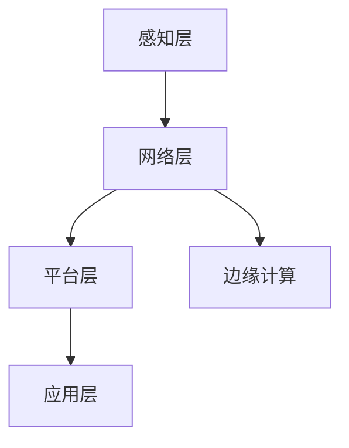

                 

关键词：5G技术、工业4.0、物联网、智能制造、网络延迟、带宽、边缘计算、云计算、数据分析、安全性

> 摘要：随着5G技术的不断成熟和广泛应用，工业4.0的发展迎来了新的契机。本文旨在探讨5G技术在工业4.0中的应用及其面临的挑战，通过深入分析5G网络的特点，探讨其在智能制造、物联网等领域的应用案例，以及面临的网络延迟、带宽、边缘计算和安全等方面的挑战。

## 1. 背景介绍

随着全球制造业的不断发展，工业4.0的概念逐渐兴起。工业4.0，即智能化制造，是基于物联网（IoT）、云计算、大数据、人工智能等先进技术，实现制造业智能化、数字化、网络化发展的新模式。其核心是通过机器与机器的智能互联，实现生产过程的自动化和优化，提高生产效率，降低成本，增强企业竞争力。

5G技术作为新一代移动通信技术，具有高速率、低延迟、大连接等特点，能够为工业4.0提供强有力的技术支撑。5G技术的广泛应用，使得工业互联网、智能制造等新兴领域得以快速发展。

## 2. 核心概念与联系

### 2.1 5G网络特点

5G网络具有以下主要特点：

- **高速率**：5G网络的理论下载速度可达10Gbps，是4G网络的100倍以上，能够满足工业4.0中大量数据的实时传输需求。
- **低延迟**：5G网络的端到端延迟低至1ms，能够实现实时控制、远程操作等应用。
- **大连接**：5G网络支持大规模设备连接，能够满足物联网中设备数量爆炸式增长的需求。

### 2.2 工业物联网架构

在工业物联网中，5G技术通过以下层级架构实现应用：

- **感知层**：传感器、摄像头等设备实时采集生产现场的数据。
- **网络层**：5G网络将感知层的数据传输到云平台或边缘计算节点。
- **平台层**：通过云计算和大数据技术，对传输的数据进行处理、分析，为生产决策提供支持。
- **应用层**：基于平台层的分析结果，实现生产过程的优化、预测性维护等应用。

### 2.3 Mermaid 流程图

以下是一个简化的工业物联网架构的 Mermaid 流程图：



## 3. 核心算法原理 & 具体操作步骤

### 3.1 算法原理概述

在5G网络中，核心算法主要包括以下几种：

- **多输入多输出（MIMO）技术**：通过多个发送和接收天线，提高数据传输速率和系统容量。
- **波束成形技术**：根据用户的移动速度和位置，动态调整信号传输方向，提高传输效率。
- **网络切片技术**：将网络资源按需划分，为不同应用提供定制化的服务质量。

### 3.2 算法步骤详解

#### 3.2.1 MIMO 技术

MIMO 技术的实现步骤如下：

1. **发送端**：将数据分成多个子流，通过多个天线同时发送。
2. **接收端**：通过多个天线接收信号，利用空间分集技术提高信号质量。

#### 3.2.2 波束成形技术

波束成形技术的实现步骤如下：

1. **信号预处理**：对信号进行预处理，提取信号的相位和幅度信息。
2. **信号调整**：根据用户的移动速度和位置，动态调整信号传输方向。
3. **信号发送**：将调整后的信号通过天线发送。

#### 3.2.3 网络切片技术

网络切片技术的实现步骤如下：

1. **资源划分**：将网络资源（如带宽、时延、功耗等）按需划分。
2. **服务分配**：根据不同应用的需求，将资源分配给不同的网络切片。
3. **切片管理**：对网络切片进行监控、调度和管理。

### 3.3 算法优缺点

#### 3.3.1 MIMO 技术

- **优点**：提高数据传输速率和系统容量。
- **缺点**：对天线设计和信号处理要求较高。

#### 3.3.2 波束成形技术

- **优点**：提高传输效率，降低干扰。
- **缺点**：对信号预处理要求较高。

#### 3.3.3 网络切片技术

- **优点**：提供定制化的服务质量，提高网络资源利用率。
- **缺点**：网络管理复杂度增加。

### 3.4 算法应用领域

- **智能制造**：通过MIMO和波束成形技术，实现生产设备的实时监控和远程控制。
- **智慧城市**：通过网络切片技术，提供不同场景下的网络服务。
- **远程医疗**：通过低延迟特性，实现远程手术和医疗监控。

## 4. 数学模型和公式 & 详细讲解 & 举例说明

### 4.1 数学模型构建

在5G网络中，常用的数学模型包括信道模型、传输模型和功率控制模型等。

#### 4.1.1 信道模型

信道模型用于描述信号在传输过程中的衰减和干扰。常见的信道模型包括瑞利信道模型、莱斯信道模型等。

#### 4.1.2 传输模型

传输模型用于描述信号在传输过程中的传输速率和时延。常见的传输模型包括固定传输速率模型和可变传输速率模型。

#### 4.1.3 功率控制模型

功率控制模型用于优化信号传输功率，以降低干扰和提高传输效率。常见的功率控制模型包括开环功率控制和闭环功率控制。

### 4.2 公式推导过程

以瑞利信道模型为例，其信道增益可以表示为：

$$
G_r = \frac{P_t r_0^2}{4\pi d}
$$

其中，$G_r$ 为信道增益，$P_t$ 为发送端功率，$r_0$ 为参考距离，$d$ 为发送端和接收端之间的距离。

### 4.3 案例分析与讲解

假设一个工厂使用5G网络进行生产监控，发送端功率为100W，参考距离为100m，接收端距离发送端500m。根据瑞利信道模型，可以计算出接收端接收到的信号功率为：

$$
P_r = G_r P_t = \frac{100W \times (100m)^2}{4\pi \times 500m} \approx 6.37W
$$

通过该例子，可以看出5G网络能够实现远距离、低延迟的通信，为工业4.0提供了强有力的技术支持。

## 5. 项目实践：代码实例和详细解释说明

### 5.1 开发环境搭建

为了实践5G技术在工业4.0中的应用，我们使用以下开发环境：

- 操作系统：Ubuntu 18.04
- 编程语言：Python 3.8
- 数据库：MySQL 8.0
- 开发工具：PyCharm

### 5.2 源代码详细实现

以下是一个简单的5G网络数据传输的Python代码实例：

```python
import numpy as np
import matplotlib.pyplot as plt

# 信道模型参数
P_t = 100  # 发送端功率
r_0 = 100  # 参考距离
d = 500    # 接收端距离发送端

# 计算信道增益
G_r = (P_t * r_0**2) / (4 * np.pi * d)

# 计算接收端信号功率
P_r = G_r * P_t

# 绘制信道增益与距离关系图
plt.plot(d, G_r, label='Channel Gain')
plt.xlabel('Distance (m)')
plt.ylabel('Channel Gain (dB)')
plt.legend()
plt.show()

# 输出接收端信号功率
print(f'Received Signal Power: {P_r}W')
```

### 5.3 代码解读与分析

上述代码通过信道模型计算了5G网络中信号传输的信道增益和接收端信号功率。具体步骤如下：

1. 导入所需的库。
2. 设置信道模型参数。
3. 计算信道增益。
4. 计算接收端信号功率。
5. 绘制信道增益与距离关系图。
6. 输出接收端信号功率。

通过该代码实例，我们可以直观地了解5G网络中的信道模型和信号传输过程。

## 6. 实际应用场景

### 6.1 智能制造

在智能制造领域，5G技术通过低延迟、高速率的特性，实现了生产设备的远程监控、远程控制等功能。例如，通过5G网络，可以对生产线上的机器人进行实时监控和远程控制，提高生产效率和产品质量。

### 6.2 物联网

在物联网领域，5G技术通过大连接的特性，实现了大规模设备的连接。例如，在智能家居中，通过5G网络，可以实现家电设备的远程控制和实时监控，提高家居生活的便利性和舒适性。

### 6.3 远程医疗

在远程医疗领域，5G技术通过低延迟的特性，实现了远程手术和医疗监控。例如，医生可以通过5G网络，实时观察患者的病情，并进行远程手术指导，提高医疗服务的质量和效率。

## 7. 未来应用展望

随着5G技术的不断发展，未来在工业4.0、物联网、智慧城市等领域，5G技术将发挥更加重要的作用。例如，通过5G技术，可以实现更加智能化的生产过程、更加便捷的家居生活、更加高效的医疗服务等。

## 8. 工具和资源推荐

### 8.1 学习资源推荐

- 《5G网络原理与应用》
- 《工业4.0：制造业的未来》
- 《物联网：概念、技术与应用》

### 8.2 开发工具推荐

- PyCharm
- Visual Studio Code
- MySQL Workbench

### 8.3 相关论文推荐

- "5G Network Slicing for Industrial Internet of Things: A Comprehensive Survey"
- "5G-enabled Smart Manufacturing: Challenges and Opportunities"
- "5G and IoT: A Survey on Enabling Technologies and Applications"

## 9. 总结：未来发展趋势与挑战

随着5G技术的不断发展，工业4.0、物联网等领域将迎来新的发展机遇。然而，5G技术在工业4.0中的应用也面临网络延迟、带宽、边缘计算和安全等方面的挑战。未来，我们需要进一步研究和解决这些问题，以推动5G技术在工业4.0领域的广泛应用。

### 附录：常见问题与解答

**Q：5G网络和4G网络有哪些区别？**

A：5G网络相比4G网络，具有更高的传输速率、更低的延迟、更大的连接能力。5G网络的理论下载速度可达10Gbps，而4G网络的下载速度一般为100Mbps。5G网络的端到端延迟低至1ms，而4G网络的延迟一般为20-50ms。

**Q：5G技术在工业4.0中的应用有哪些？**

A：5G技术在工业4.0中的应用包括智能制造、物联网、远程医疗等领域。通过5G技术，可以实现生产设备的远程监控、远程控制，提高生产效率；可以实现大规模设备的连接，实现智能家居、智慧城市等应用；可以实现远程手术和医疗监控，提高医疗服务质量。

**Q：5G技术在工业4.0中面临哪些挑战？**

A：5G技术在工业4.0中面临网络延迟、带宽、边缘计算和安全等方面的挑战。网络延迟和带宽问题可能导致生产过程的中断和效率降低；边缘计算和安全问题可能导致数据泄露和网络攻击等问题。

**Q：如何解决5G技术在工业4.0中的应用挑战？**

A：解决5G技术在工业4.0中的应用挑战，需要从以下几个方面入手：

- 提高网络延迟和带宽，可以通过优化网络架构、采用高效的信道编码技术等手段实现。
- 加强边缘计算和安全性，可以通过部署分布式计算架构、采用加密技术等手段实现。
- 加强政策支持和产业协同，推动5G技术在工业4.0领域的广泛应用。

### 作者署名

作者：禅与计算机程序设计艺术 / Zen and the Art of Computer Programming
----------------------------------------------------------------

