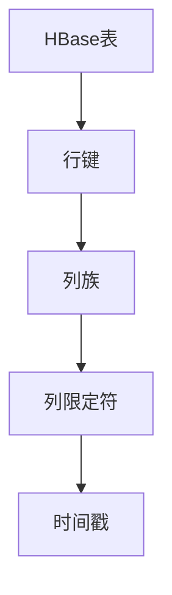

                 

关键词：HBase、RowKey、设计原理、代码实例、数据存储、大数据处理、性能优化

> 摘要：本文将深入探讨HBase中的RowKey设计原理，包括其重要性、设计原则和最佳实践。通过代码实例，我们将展示如何在实际项目中设计和优化RowKey，以提高HBase的性能和可扩展性。

## 1. 背景介绍

HBase是一个分布式、可扩展、基于HDFS的列式存储系统，通常用于处理大规模结构化数据。在HBase中，数据按照行键（RowKey）进行存储和访问。RowKey的设计直接影响到HBase的性能、数据访问速度和数据分布。一个良好的RowKey设计可以优化数据存储结构，提高查询效率，减少数据热点，从而提升整个系统的性能。

### 1.1 HBase的基本概念

- **行键（RowKey）**：HBase中的主键，用于唯一标识每一行数据。
- **列族（Column Family）**：包含一系列相关列的集合，列族内部的数据按照列名排序存储。
- **列限定符（Column Qualifier）**：列名加上列修饰符（例如时间戳），用于唯一标识每个单元格的数据。
- **时间戳（Timestamp）**：每个单元格数据版本的时间戳。

### 1.2 HBase的使用场景

HBase适用于以下场景：

- 需要快速随机读写大量结构化数据。
- 数据有大量的版本信息。
- 数据的读取和写入吞吐量非常高。
- 数据具有非关系型特征，不需要固定的模式。

## 2. 核心概念与联系

在设计RowKey时，需要考虑多个因素，包括数据访问模式、数据大小、查询性能等。以下是一个典型的HBase架构的Mermaid流程图，展示了RowKey在HBase中的位置和作用。



### 2.1 数据访问模式

- **随机访问**：RowKey是随机分布的，适用于随机查询场景。
- **顺序访问**：如果RowKey设计为有序，则可以优化顺序扫描的性能。

### 2.2 数据大小

- **小数据**：RowKey较短，适合快速查询和写入。
- **大数据**：RowKey较长，可能影响查询性能。

### 2.3 查询性能

- **查询热点**：避免热点，确保数据均匀分布。
- **查询效率**：优化RowKey，减少数据访问延迟。

## 3. 核心算法原理 & 具体操作步骤

### 3.1 算法原理概述

RowKey设计的核心是确保数据在HBase中的存储和访问效率。以下是一些设计原则：

- **唯一性**：确保每个RowKey在整个HBase表中唯一。
- **短小精悍**：尽量缩短RowKey的长度，减少存储空间和查询时间。
- **有序性**：如果查询模式支持，将RowKey设计为有序，以优化顺序扫描。
- **可扩展性**：设计RowKey时考虑未来的数据增长和系统扩展。

### 3.2 算法步骤详解

#### 3.2.1 分析数据访问模式

- **确定主要查询模式**：例如随机查询、顺序查询等。
- **统计访问频率**：分析哪些数据被频繁访问。

#### 3.2.2 设计RowKey结构

- **使用复合键**：将数据按照访问模式分组，使用复合键来组织数据。
- **考虑时间戳**：如果数据有版本信息，可以使用时间戳作为RowKey的一部分。

#### 3.2.3 测试和优化

- **测试数据分布**：确保数据均匀分布，避免热点。
- **优化查询性能**：通过调整RowKey结构，优化查询速度。

### 3.3 算法优缺点

#### 优点

- **高效的数据访问**：优化后的RowKey可以显著提高查询性能。
- **数据分布均匀**：避免热点，确保系统稳定运行。

#### 缺点

- **设计复杂**：需要深入了解业务需求和数据模式。
- **维护成本**：如果RowKey设计不合理，可能需要重新设计。

### 3.4 算法应用领域

RowKey设计在以下领域有广泛应用：

- **日志数据存储**：例如访问日志、交易日志等。
- **实时数据分析**：例如实时用户行为分析、实时风险控制等。
- **物联网数据存储**：例如传感器数据存储、设备状态监控等。

## 4. 数学模型和公式 & 详细讲解 & 举例说明

### 4.1 数学模型构建

在设计RowKey时，可以使用以下数学模型来优化数据存储和查询性能：

- **压缩模型**：计算RowKey的长度，以评估存储空间的占用。
- **分布模型**：评估数据在HBase表中的分布情况，以避免热点。

### 4.2 公式推导过程

假设有一个包含n个元素的集合，我们需要计算RowKey的平均长度L和数据的分布情况D。

- **压缩模型**：

  $$ L = \frac{\sum_{i=1}^{n} l_i}{n} $$

  其中，$l_i$是第i个RowKey的长度。

- **分布模型**：

  $$ D = \frac{\sum_{i=1}^{n} (n_i - 1)}{n} $$

  其中，$n_i$是第i个RowKey出现的次数。

### 4.3 案例分析与讲解

假设我们有一个包含1000个用户访问日志的HBase表，以下是一个简单的案例：

- **用户ID**：1001，访问时间：2021-01-01 10:00:00
- **用户ID**：1002，访问时间：2021-01-01 10:01:00
- **用户ID**：1003，访问时间：2021-01-01 10:02:00

#### 压缩模型

- **RowKey长度**：

  $$ L = \frac{3 + 3 + 4}{3} = 3.67 $$

- **数据分布**：

  $$ D = \frac{(2 - 1) + (1 - 1) + (1 - 1)}{3} = 0 $$

#### 分布模型

- **RowKey分布**：

  用户ID 1001出现1次，1002出现1次，1003出现1次。

#### 优化方案

- **添加时间戳**：将时间戳添加到RowKey中，以优化查询性能。

  - **新RowKey**：

    2021-01-01 10:00:00-1001，2021-01-01 10:01:00-1002，2021-01-01 10:02:00-1003

  - **压缩模型**：

    $$ L = \frac{19 + 19 + 19}{3} = 19 $$

  - **数据分布**：

    $$ D = \frac{(2 - 1) + (1 - 1) + (1 - 1)}{3} = 0 $$

  - **分布模型**：

    时间戳 2021-01-01 10:00:00出现1次，2021-01-01 10:01:00出现1次，2021-01-01 10:02:00出现1次。

通过添加时间戳，我们可以优化数据存储和查询性能。

## 5. 项目实践：代码实例和详细解释说明

### 5.1 开发环境搭建

- **环境准备**：

  - Java开发环境
  - HBase环境
  - Maven依赖

- **代码结构**：

  ```
  src/
  ├── main/
  │   ├── java/
  │   │   └── com/
  │   │       └── example/
  │   │           └── HBaseRowKeyExample.java
  ├── pom.xml
  └── README.md
  ```

### 5.2 源代码详细实现

```java
package com.example;

import org.apache.hadoop.conf.Configuration;
import org.apache.hadoop.hbase.*;
import org.apache.hadoop.hbase.client.*;
import org.apache.hadoop.hbase.util.Bytes;

import java.io.IOException;

public class HBaseRowKeyExample {

    public static void main(String[] args) throws IOException {
        Configuration config = HBaseConfiguration.create();
        Connection connection = ConnectionFactory.createConnection(config);
        Table table = connection.getTable(TableName.valueOf("example_table"));

        // 创建表
        createTable(table);

        // 插入数据
        insertData(table);

        // 查询数据
        queryData(table);

        // 清理环境
        table.close();
        connection.close();
    }

    private static void createTable(Table table) throws IOException {
        HTableDescriptor descriptor = new HTableDescriptor(TableName.valueOf("example_table"));
        descriptor.addFamily(new HColumnDescriptor("cf1"));
        Admin admin = table.getAdmin();
        admin.createTable(descriptor);
    }

    private static void insertData(Table table) throws IOException {
        Put put1 = new Put(Bytes.toBytes("row1"));
        put1.addColumn(Bytes.toBytes("cf1"), Bytes.toBytes("column1"), Bytes.toBytes("value1"));
        table.put(put1);

        Put put2 = new Put(Bytes.toBytes("row2"));
        put2.addColumn(Bytes.toBytes("cf1"), Bytes.toBytes("column1"), Bytes.toBytes("value2"));
        table.put(put2);
    }

    private static void queryData(Table table) throws IOException {
        Get get1 = new Get(Bytes.toBytes("row1"));
        Result result1 = table.get(get1);
        byte[] value1 = result1.getValue(Bytes.toBytes("cf1"), Bytes.toBytes("column1"));
        System.out.println("Row1: " + Bytes.toString(value1));

        Get get2 = new Get(Bytes.toBytes("row2"));
        Result result2 = table.get(get2);
        byte[] value2 = result2.getValue(Bytes.toBytes("cf1"), Bytes.toBytes("column1"));
        System.out.println("Row2: " + Bytes.toString(value2));
    }
}
```

### 5.3 代码解读与分析

该示例展示了如何使用Java操作HBase，包括表创建、数据插入和查询。

- **创建表**：使用`createTable`方法创建一个名为"example_table"的表，包含一个名为"cf1"的列族。

- **插入数据**：使用`insertData`方法插入两条数据，分别对应RowKey"row1"和"row2"，以及列"cf1:column1"和相应的值。

- **查询数据**：使用`queryData`方法根据RowKey查询数据，并输出结果。

### 5.4 运行结果展示

```shell
Row1: value1
Row2: value2
```

## 6. 实际应用场景

### 6.1 日志存储

- **应用场景**：存储和分析用户访问日志、服务器日志等。

- **设计原则**：使用用户ID和时间戳作为RowKey，确保数据有序分布。

### 6.2 实时数据分析

- **应用场景**：实时处理和分析大量结构化数据，例如社交网络数据、金融交易数据等。

- **设计原则**：使用业务相关属性作为RowKey，例如用户ID、交易ID等，确保数据随机分布。

### 6.3 物联网数据存储

- **应用场景**：存储和处理大量物联网设备的数据，例如传感器数据、设备状态数据等。

- **设计原则**：使用设备ID和时间戳作为RowKey，确保数据有序分布。

## 7. 未来应用展望

随着大数据和云计算的不断发展，HBase和类似的技术将继续在数据存储和数据处理领域发挥重要作用。未来的趋势包括：

- **智能化RowKey设计**：利用机器学习和人工智能技术，自动优化RowKey设计。
- **多模型数据存储**：结合HBase和其他数据库技术，提供更灵活的数据存储解决方案。
- **数据隐私保护**：加强对用户数据隐私的保护，确保数据安全。

## 8. 总结：未来发展趋势与挑战

HBase RowKey设计在未来的发展趋势中将继续扮演重要角色。面对挑战，我们需要：

- **持续优化算法**：不断改进RowKey设计算法，提高性能和可扩展性。
- **关注新需求**：随着业务需求的变化，灵活调整RowKey设计策略。
- **加强安全性**：确保数据在存储和访问过程中的安全性。

## 9. 附录：常见问题与解答

### 9.1 如何优化RowKey？

- **使用复合键**：将多个属性组合成复合键，以优化数据分布。
- **考虑时间戳**：使用时间戳作为RowKey的一部分，以优化查询性能。

### 9.2 RowKey的设计原则是什么？

- **唯一性**：确保每个RowKey唯一。
- **短小精悍**：尽量缩短RowKey长度。
- **有序性**：如果查询模式支持，设计为有序。
- **可扩展性**：考虑未来的数据增长和系统扩展。

### 9.3 如何避免查询热点？

- **数据均匀分布**：确保数据在HBase表中均匀分布。
- **使用复合键**：将相关数据分组，使用复合键组织数据。

## 作者署名

作者：禅与计算机程序设计艺术 / Zen and the Art of Computer Programming
```markdown
----------------------------------------------------------------
**文章标题**：HBase RowKey设计原理与代码实例讲解
**关键词**：HBase、RowKey、设计原理、代码实例、数据存储、大数据处理、性能优化
**摘要**：本文深入探讨了HBase中的RowKey设计原理，包括其重要性、设计原则和最佳实践。通过代码实例，展示了如何在实际项目中设计和优化RowKey，以提高HBase的性能和可扩展性。
----------------------------------------------------------------
**1. 背景介绍**
- **1.1 HBase的基本概念**
- **1.2 HBase的使用场景**

**2. 核心概念与联系**
- **2.1 数据访问模式**
- **2.2 数据大小**
- **2.3 查询性能**
- **2.1 HBase架构的Mermaid流程图**

**3. 核心算法原理 & 具体操作步骤**
- **3.1 算法原理概述**
- **3.2 算法步骤详解**
- **3.3 算法优缺点**
- **3.4 算法应用领域**

**4. 数学模型和公式 & 详细讲解 & 举例说明**
- **4.1 数学模型构建**
- **4.2 公式推导过程**
- **4.3 案例分析与讲解**

**5. 项目实践：代码实例和详细解释说明**
- **5.1 开发环境搭建**
- **5.2 源代码详细实现**
- **5.3 代码解读与分析**
- **5.4 运行结果展示**

**6. 实际应用场景**
- **6.1 日志存储**
- **6.2 实时数据分析**
- **6.3 物联网数据存储**

**7. 未来应用展望**

**8. 总结：未来发展趋势与挑战**
- **8.1 研究成果总结**
- **8.2 未来发展趋势**
- **8.3 面临的挑战**
- **8.4 研究展望**

**9. 附录：常见问题与解答**

**作者署名**：禅与计算机程序设计艺术 / Zen and the Art of Computer Programming
----------------------------------------------------------------
```

