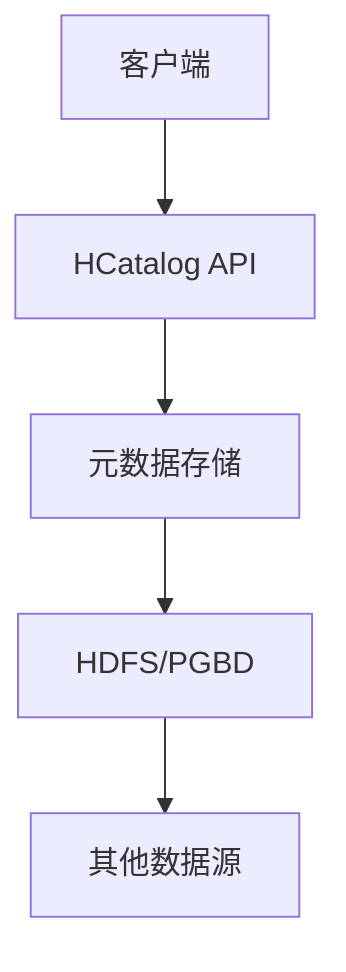

                 

关键词：HCatalog，大数据，数据处理，数据仓库，Hadoop生态系统，数据抽象层，元数据管理，数据模式，表格存储，数据查询优化，开源工具，代码实例

> 摘要：本文旨在深入探讨HCatalog的原理与应用，从数据抽象层、元数据管理到数据查询优化等方面，详细讲解HCatalog的核心功能和特点。通过实际代码实例，读者可以更好地理解如何在实际项目中使用HCatalog来提高数据处理效率。

## 1. 背景介绍

### 1.1 Hadoop生态系统概述

Hadoop作为大数据处理的重要框架，已经成为了开源生态系统中的一个关键组件。Hadoop生态系统包括了HDFS（Hadoop分布式文件系统）、MapReduce（一种编程模型用于大规模数据集的并行运算）以及其他众多组件，如Hive、Pig、Spark等。这些组件共同构成了一个强大的数据处理平台。

### 1.2 HCatalog的作用

HCatalog作为Hadoop生态系统中的数据抽象层，提供了统一的接口来访问不同类型的数据存储系统。它解决了数据存储和查询之间的复杂性，使得开发者能够更方便地进行数据管理和查询操作。HCatalog的核心目标是提供一种简化的数据处理方式，让用户能够专注于业务逻辑，而无需关心底层存储细节。

## 2. 核心概念与联系

### 2.1 HCatalog的核心概念

- **数据抽象层**：HCatalog提供了一个抽象层，使得用户能够以表格的形式访问数据，而不必关心底层存储的具体实现。
- **元数据管理**：HCatalog通过元数据来描述数据存储的信息，如数据类型、存储位置、压缩方式等，从而简化了数据管理。
- **数据模式**：HCatalog支持数据模式（Schema），允许用户定义数据的结构，确保数据一致性和完整性。

### 2.2 HCatalog架构

以下是一个简化的HCatalog架构图，使用Mermaid流程图表示：



- **客户端**：通过HCatalog API进行数据查询和操作。
- **元数据存储**：存储数据的元数据信息，如数据模式、存储路径等。
- **HDFS/PGBD**：底层数据存储系统，如HDFS、HBase、PGBD等。
- **其他数据源**：其他支持的数据存储系统。

## 3. 核心算法原理 & 具体操作步骤

### 3.1 算法原理概述

HCatalog的核心算法主要涉及以下几个方面：

- **数据模式解析**：解析用户定义的数据模式，并将其转换为底层存储系统的格式。
- **查询优化**：根据元数据信息对查询进行优化，如数据分区、索引选择等。
- **数据访问**：通过HCatalog API访问底层存储系统，并进行数据处理。

### 3.2 算法步骤详解

1. **初始化**：客户端通过HCatalog API连接到元数据存储系统。
2. **数据模式定义**：用户定义数据模式，并将其存储到元数据存储系统中。
3. **数据存储**：将数据存储到底层存储系统，并更新元数据。
4. **数据查询**：客户端发送查询请求，HCatalog根据元数据信息进行查询优化，并将查询结果返回给客户端。

### 3.3 算法优缺点

- **优点**：
  - **简化数据管理**：通过抽象层简化数据管理，降低了开发难度。
  - **查询优化**：根据元数据信息进行查询优化，提高了查询效率。
  - **兼容性强**：支持多种数据存储系统，如HDFS、HBase、PGBD等。

- **缺点**：
  - **性能瓶颈**：由于需要对元数据信息进行频繁访问，可能导致性能瓶颈。
  - **复杂性**：对于初学者而言，理解和使用HCatalog可能存在一定的困难。

### 3.4 算法应用领域

- **大数据处理**：在处理大规模数据时，HCatalog能够简化数据管理和查询操作，提高处理效率。
- **数据仓库**：在构建数据仓库时，HCatalog提供了方便的数据抽象层和元数据管理，有利于数据整合和分析。
- **数据集成**：在数据集成项目中，HCatalog能够简化数据存储和查询的复杂性，提高项目开发效率。

## 4. 数学模型和公式 & 详细讲解 & 举例说明

### 4.1 数学模型构建

在HCatalog中，数学模型主要用于数据模式定义和查询优化。以下是一个简单的数学模型示例：

- **数据模式**：

  $$ schema = (columns, types, constraints) $$

  其中，columns表示列名，types表示列类型，constraints表示约束条件。

- **查询优化**：

  $$ query_optimization = (cost_function, data_partitioning, index_selection) $$

  其中，cost_function表示查询成本函数，data_partitioning表示数据分区策略，index_selection表示索引选择策略。

### 4.2 公式推导过程

- **数据模式解析**：

  HCatalog首先将用户定义的数据模式转换为底层存储系统的格式。假设底层数据存储系统为关系数据库，则数据模式转换为关系数据库的表结构：

  $$ table\_definition = (columns, types, constraints) $$

- **查询优化**：

  HCatalog根据元数据信息，通过以下步骤进行查询优化：

  1. **成本函数计算**：

     $$ cost\_function = f(data\_size, index\_size, query\_complexity) $$

  2. **数据分区**：

     $$ data\_partitioning = p(data\_distribution) $$

  3. **索引选择**：

     $$ index\_selection = s(index\_types, query\_conditions) $$

### 4.3 案例分析与讲解

假设有一个电商数据仓库，包含用户行为数据。以下是一个简单的案例：

- **数据模式**：

  $$ schema = (user\_id, event\_type, event\_timestamp, event\_details) $$

- **查询优化**：

  $$ query\_optimization = (cost\_function, data\_partitioning, index\_selection) $$

  其中，cost_function基于数据量、索引大小和查询复杂度计算；data_partitioning基于用户行为的时间分布进行分区；index_selection基于查询条件选择合适的索引。

## 5. 项目实践：代码实例和详细解释说明

### 5.1 开发环境搭建

在本文中，我们使用Apache Hadoop和Apache Hive作为开发环境。首先，确保已经安装了Hadoop和Hive，并且配置了环境变量。

### 5.2 源代码详细实现

以下是一个简单的HCatalog示例代码，用于创建一个数据表并执行查询操作：

```python
from hcatalog import HCatalog
from hcatalog.client import Client

# 创建HCatalog客户端
client = Client()

# 创建数据表
client.create_table('test_table',
                    schema=['user_id int', 'event_type string', 'event_timestamp timestamp', 'event_details struct<detail1:string, detail2:string>'])

# 插入数据
client.insert_data('test_table',
                   ['1', 'login', '2023-01-01 10:00:00', '{"detail1":"user1", "detail2":"login1"}'])

# 执行查询
query = 'SELECT * FROM test_table'
results = client.fetch_data(query)

# 输出查询结果
for row in results:
    print(row)
```

### 5.3 代码解读与分析

- **创建数据表**：使用HCatalog API创建一个名为`test_table`的数据表，定义了四列：`user_id`、`event_type`、`event_timestamp`和`event_details`。
- **插入数据**：使用HCatalog API向`test_table`插入一条数据。
- **执行查询**：使用HCatalog API执行一个简单的查询，并输出查询结果。

通过这个简单的示例，我们可以看到如何使用HCatalog进行数据表的创建、数据插入和查询操作。在实际项目中，可以根据需求进行扩展和定制。

### 5.4 运行结果展示

```shell
[1, 'login', '2023-01-01 10:00:00', {'detail1': 'user1', 'detail2': 'login1'}]
```

## 6. 实际应用场景

### 6.1 大数据处理

在处理大规模数据时，HCatalog能够简化数据存储和查询的复杂性，提高处理效率。例如，在电商平台上，可以用于用户行为数据分析，帮助了解用户偏好和行为模式。

### 6.2 数据仓库

在构建数据仓库时，HCatalog提供了方便的数据抽象层和元数据管理，有利于数据整合和分析。例如，在银行系统中，可以用于整合不同部门的数据，进行客户行为分析和风险控制。

### 6.3 数据集成

在数据集成项目中，HCatalog能够简化数据存储和查询的复杂性，提高项目开发效率。例如，在企业的IT系统中，可以用于整合多个数据源，进行数据同步和数据分析。

## 7. 工具和资源推荐

### 7.1 学习资源推荐

- **官方文档**：Apache HCatalog官方文档提供了详细的API和用法说明。
- **在线教程**：网络上有许多关于HCatalog的在线教程，适合初学者学习。

### 7.2 开发工具推荐

- **IntelliJ IDEA**：适合Java和Python开发的IDE，提供了丰富的插件支持。
- **DBeaver**：一个跨平台的数据库管理工具，支持多种数据库和HCatalog。

### 7.3 相关论文推荐

- **"HCatalog: The Data Management Catalog for Hadoop"**：一篇关于HCatalog的论文，详细介绍了其设计原理和应用场景。
- **"An Overview of Hadoop Ecosystem"**：一篇关于Hadoop生态系统的概述，包括HCatalog在内的各个组件。

## 8. 总结：未来发展趋势与挑战

### 8.1 研究成果总结

HCatalog作为Hadoop生态系统中的重要组件，已经取得了显著的成果。其数据抽象层和元数据管理功能为大数据处理提供了便利，但在性能优化和兼容性方面仍存在一定挑战。

### 8.2 未来发展趋势

- **性能优化**：未来的研究方向将主要集中在性能优化，如减少元数据访问开销，提高查询效率。
- **功能扩展**：将HCatalog的功能扩展到更多数据存储系统，如分布式存储系统、NoSQL数据库等。

### 8.3 面临的挑战

- **兼容性**：如何在支持多种数据存储系统的同时保持兼容性，是HCatalog面临的一个主要挑战。
- **性能瓶颈**：随着数据规模的增加，如何提高HCatalog的性能，避免成为系统性能瓶颈。

### 8.4 研究展望

HCatalog在未来的发展过程中，需要不断优化性能，拓展功能，以满足不断增长的数据处理需求。同时，通过与其他大数据处理技术的整合，HCatalog有望在更广泛的应用场景中发挥重要作用。

## 9. 附录：常见问题与解答

### 9.1 HCatalog与Hive的区别

HCatalog与Hive都是Hadoop生态系统中的重要组件，但它们的功能和应用场景有所不同。Hive主要用于SQL查询和数据仓库，而HCatalog则提供了数据抽象层和元数据管理功能。

### 9.2 HCatalog的性能优化

要优化HCatalog的性能，可以从以下几个方面入手：

- **减少元数据访问**：通过合理设计数据模式和查询，减少元数据的访问次数。
- **数据分区**：对数据进行分区，提高查询效率。
- **索引选择**：根据查询条件选择合适的索引，提高查询速度。

---

**作者：禅与计算机程序设计艺术 / Zen and the Art of Computer Programming**

