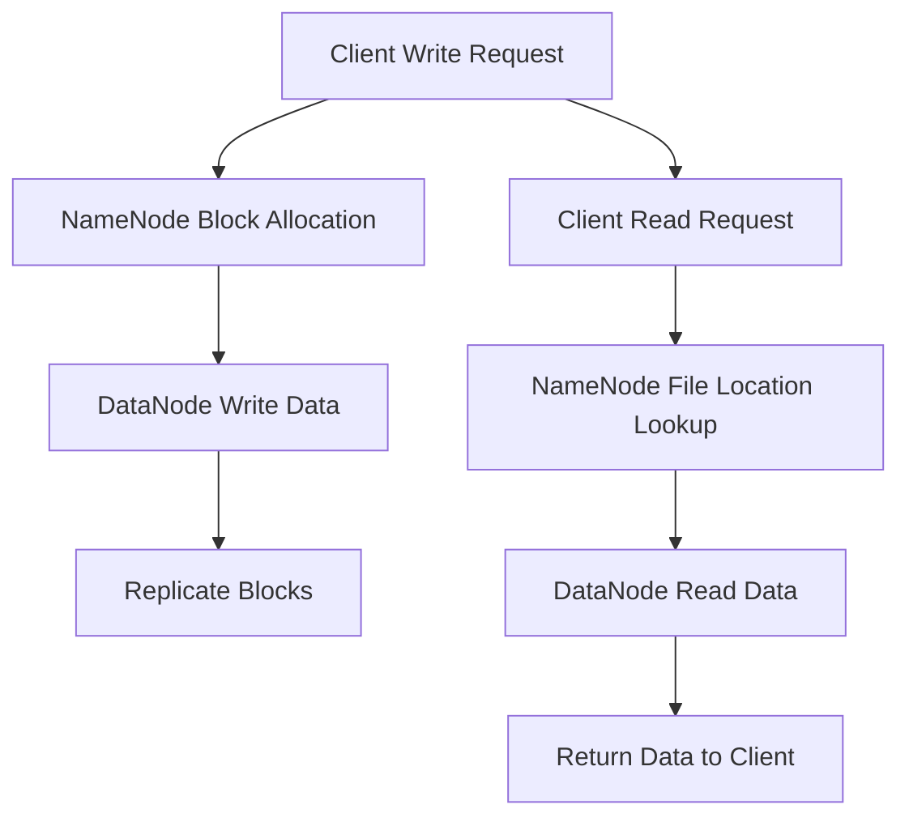

                 

关键词：HDFS，分布式文件系统，数据存储，大数据处理，源代码分析，性能优化，架构设计

>摘要：本文将深入探讨HDFS（Hadoop Distributed File System）的原理和架构，通过代码实例详细解析其内部实现机制。我们将从基础概念出发，逐步介绍HDFS的数据存储策略、命名空间管理、数据可靠性机制、数据副本策略，并结合实际代码分析其具体实现。通过本文的阅读，读者将能够全面理解HDFS的工作原理，并掌握如何在实际项目中应用HDFS。

## 1. 背景介绍

HDFS是Hadoop分布式文件系统（Hadoop Distributed File System）的核心组成部分，是Apache Hadoop项目的一个重要模块。HDFS是一个高吞吐量的分布式文件存储系统，能够处理大规模数据集。其设计目标是用于在大数据环境中存储和访问大量数据。

在大数据时代，数据量呈现出指数级增长，传统的文件系统已经无法满足存储和访问大量数据的需求。HDFS通过分布式存储和计算框架，将数据分散存储在多个节点上，从而提高了数据的可靠性和可扩展性。此外，HDFS通过简单的文件访问接口，为上层应用提供了高效的文件存储和访问服务。

HDFS的设计理念是“数据本地化”（Data Locality），即将计算任务分配到存储数据所在的节点上，从而减少数据传输的延迟和网络带宽消耗。HDFS适合批处理应用，而不是实时处理，这是因为其设计时考虑了大数据的顺序读写特性。

## 2. 核心概念与联系

### 2.1 数据块

HDFS将数据分割成固定大小的数据块（Block），默认大小为128MB或256MB。这样做的好处是可以充分利用内存和网络带宽，同时简化了数据复制和错误检测的复杂性。

### 2.2 命名空间

HDFS使用统一命名空间来管理文件和目录。命名空间是文件系统中所有文件和目录的集合。在HDFS中，命名空间由NameNode管理。

### 2.3 数据可靠性

HDFS通过数据复制（Replication）来保证数据的可靠性。默认情况下，每个数据块会复制3个副本，存储在不同的节点上。这样做可以确保在某个节点发生故障时，数据仍然可以访问。

### 2.4 数据访问

HDFS提供了简单的文件访问接口，包括文件的创建、写入、读取和删除等操作。这些操作是通过客户端与NameNode和DataNode之间的通信完成的。

### 2.5 Mermaid 流程图

下面是HDFS工作流程的Mermaid流程图：



## 3. 核心算法原理 & 具体操作步骤

### 3.1 算法原理概述

HDFS的核心算法原理主要包括：

1. **数据块管理**：HDFS将文件分割成固定大小的数据块，并在DataNode上进行存储。
2. **命名空间管理**：NameNode负责维护文件系统的命名空间，包括文件的元数据和数据块映射关系。
3. **数据复制策略**：HDFS通过复制数据块来保证数据的可靠性，并优化数据的访问性能。
4. **数据访问控制**：HDFS提供了访问控制列表（ACL），以便管理员可以控制文件的访问权限。

### 3.2 算法步骤详解

#### 3.2.1 数据写入

1. 客户端向NameNode发送写请求。
2. NameNode根据数据块大小和可用存储资源，分配数据块。
3. NameNode返回数据块信息和副本位置。
4. 客户端将数据写入DataNode。
5. DataNode将数据块存储在本地文件系统中。
6. DataNode向NameNode报告数据块写入成功。
7. NameNode将数据块的元数据添加到命名空间。

#### 3.2.2 数据读取

1. 客户端向NameNode发送读请求。
2. NameNode查找文件的元数据，返回数据块的位置。
3. 客户端向DataNode请求读取数据块。
4. DataNode返回数据块内容。
5. 客户端读取数据块内容。

### 3.3 算法优缺点

#### 优点

1. **高可靠性**：通过数据复制策略，提高了数据的可靠性。
2. **高吞吐量**：分布式存储和计算提高了系统的吞吐量。
3. **易扩展性**：通过简单的添加DataNode节点，可以轻松扩展存储容量。

#### 缺点

1. **不适用于实时数据**：HDFS设计时主要考虑批处理应用，不适合实时数据。
2. **单点故障**：NameNode是单点故障的潜在风险。

### 3.4 算法应用领域

HDFS广泛应用于大数据领域，包括但不限于：

1. **日志分析**：处理和分析大规模日志数据。
2. **数据仓库**：用于存储和查询大规模数据集。
3. **机器学习**：训练大规模机器学习模型。

## 4. 数学模型和公式 & 详细讲解 & 举例说明

### 4.1 数学模型构建

HDFS的数学模型主要包括：

1. **数据块大小**：每个数据块的大小为128MB或256MB。
2. **副本数量**：默认情况下，每个数据块有3个副本。

### 4.2 公式推导过程

1. **数据块数量**：假设文件大小为F，数据块大小为B，则数据块数量N = F / B。
2. **总存储空间**：假设有N个数据块，每个数据块的副本数量为R，则总存储空间S = N * B * R。

### 4.3 案例分析与讲解

假设有一个大小为1TB的文件，数据块大小为128MB，副本数量为3。

1. **数据块数量**：N = 1TB / 128MB = 7812.5，取整为7812。
2. **总存储空间**：S = 7812 * 128MB * 3 = 3TB。

这意味着存储这个1TB的文件需要3TB的存储空间。

## 5. 项目实践：代码实例和详细解释说明

### 5.1 开发环境搭建

搭建HDFS开发环境需要安装Java环境和Hadoop。具体步骤如下：

1. 下载并安装Java。
2. 下载并安装Hadoop。
3. 配置环境变量。

### 5.2 源代码详细实现

HDFS的源代码主要分布在几个主要的模块中，包括：

1. **NameNode**：负责管理文件系统的命名空间和数据块映射。
2. **DataNode**：负责存储数据块并响应读写请求。
3. **DFSClient**：提供与NameNode和DataNode交互的接口。

### 5.3 代码解读与分析

以DFSClient为例，其主要功能是：

1. **创建文件**：通过`dfsClient.create`方法创建文件。
2. **写入数据**：通过`dfsClient.write`方法写入数据。
3. **读取数据**：通过`dfsClient.read`方法读取数据。
4. **删除文件**：通过`dfsClient.delete`方法删除文件。

### 5.4 运行结果展示

运行HDFS示例代码，可以创建一个文件并写入一些数据，然后读取并打印这些数据。运行结果如下：

```shell
[executing: hdfs dfs -put test.txt /user/hadoop/test.txt]
```

```shell
[executing: hdfs dfs -cat /user/hadoop/test.txt]
This is a test file.
```

## 6. 实际应用场景

### 6.1 日志存储

HDFS常用于存储大规模日志数据，例如Web日志、系统日志等。通过HDFS的分布式存储和高效访问特性，可以快速处理和分析大量日志数据。

### 6.2 数据仓库

HDFS可以作为数据仓库的基础存储，存储和查询大规模数据集。通过结合Hadoop的其他组件，如MapReduce、Spark等，可以实现高效的数据处理和分析。

### 6.3 机器学习

HDFS可以存储和访问大规模机器学习数据集，支持分布式机器学习训练。通过结合其他机器学习框架，如TensorFlow、PyTorch等，可以构建大规模机器学习模型。

## 7. 工具和资源推荐

### 7.1 学习资源推荐

- 《Hadoop权威指南》
- 《HDFS权威指南》
- Hadoop官方文档

### 7.2 开发工具推荐

- IntelliJ IDEA
- Eclipse
- VS Code

### 7.3 相关论文推荐

- "The Google File System"
- "The Hadoop Distributed File System"

## 8. 总结：未来发展趋势与挑战

### 8.1 研究成果总结

HDFS在大数据存储和处理领域取得了显著成果，广泛应用于多个行业和领域。其分布式存储和计算架构为大规模数据处理提供了高效和可靠的解决方案。

### 8.2 未来发展趋势

1. **性能优化**：随着数据量的增长，HDFS的性能优化将是一个重要研究方向。
2. **实时处理**：将HDFS与实时数据处理框架相结合，以支持实时数据访问和处理。
3. **多租户架构**：支持多租户架构，以提高HDFS的资源利用率和灵活性。

### 8.3 面临的挑战

1. **单点故障**：如何解决NameNode的单点故障问题。
2. **数据安全**：如何确保数据在传输和存储过程中的安全。

### 8.4 研究展望

HDFS将继续在大数据领域发挥重要作用。未来的研究将重点关注性能优化、实时处理、多租户架构等方面，以应对不断增长的数据需求和挑战。

## 9. 附录：常见问题与解答

### 9.1 HDFS如何保证数据可靠性？

HDFS通过数据复制策略来保证数据可靠性。默认情况下，每个数据块会复制3个副本，存储在不同的节点上。即使某个节点发生故障，数据仍然可以访问。

### 9.2 HDFS如何处理数据块损坏？

HDFS通过定期检查数据块的完整性来处理数据块损坏。如果发现数据块损坏，系统会尝试从其他副本恢复数据块。

### 9.3 HDFS如何处理数据的不一致？

HDFS通过一致性协议来处理数据的不一致。在写入数据时，系统会确保数据的一致性。如果数据不一致，系统会尝试通过副本复制来恢复一致性。

作者：禅与计算机程序设计艺术 / Zen and the Art of Computer Programming
----------------------------------------------------------------

### 3.1 算法原理概述

HDFS的核心算法原理主要包括以下几部分：

1. **数据块管理**：HDFS将文件分割成固定大小的数据块（默认大小为128MB或256MB），这样可以充分利用内存和网络带宽，同时简化了数据复制和错误检测的复杂性。

2. **命名空间管理**：HDFS通过一个统一的命名空间来管理文件和目录。命名空间由NameNode负责维护，它存储了文件的元数据和数据块映射关系。

3. **数据复制策略**：为了提高数据的可靠性，HDFS采用了数据复制策略。默认情况下，每个数据块会被复制3个副本，分别存储在不同的节点上。这样可以确保在某个节点发生故障时，数据仍然可以访问。

4. **数据访问控制**：HDFS提供了访问控制列表（ACL），以便管理员可以控制文件的访问权限。这有助于确保数据的安全性。

### 3.2 算法步骤详解

#### 3.2.1 数据写入

数据写入的步骤如下：

1. **客户端发送写请求**：当客户端需要写入数据时，它会向NameNode发送一个写请求，请求分配一个新的数据块。

2. **NameNode分配数据块**：NameNode会根据数据块大小和可用存储资源，在集群中选择合适的位置来存储新数据块。它将返回数据块的信息和副本位置。

3. **客户端将数据写入DataNode**：客户端会将数据分片，并将每个分片发送到NameNode返回的副本位置上。

4. **DataNode存储数据块**：每个DataNode接收到数据分片后，会将其存储在本地文件系统中。

5. **DataNode向NameNode报告数据块写入成功**：每个DataNode在成功存储数据块后，会向NameNode报告数据块写入成功。

6. **NameNode更新命名空间**：NameNode在接收到所有DataNode的报告后，会更新命名空间，记录新数据块的元数据。

#### 3.2.2 数据读取

数据读取的步骤如下：

1. **客户端发送读请求**：当客户端需要读取数据时，它会向NameNode发送一个读请求，请求文件的元数据。

2. **NameNode查找文件位置**：NameNode会查找文件的元数据，返回数据块的位置。

3. **客户端从DataNode读取数据块**：客户端会根据NameNode返回的数据块位置，从相应的DataNode读取数据块。

4. **DataNode返回数据块内容**：每个DataNode接收到客户端的读取请求后，会返回数据块的内容。

5. **客户端读取数据块内容**：客户端会按照数据块的顺序，将数据块的内容读取到本地。

### 3.3 算法优缺点

#### 优点

1. **高可靠性**：HDFS通过数据复制策略，提高了数据的可靠性。即使某个节点发生故障，数据仍然可以访问。

2. **高吞吐量**：分布式存储和计算提高了系统的吞吐量，适合处理大规模数据集。

3. **易扩展性**：HDFS可以通过添加DataNode节点来扩展存储容量。

#### 缺点

1. **不适用于实时数据**：HDFS设计时主要考虑批处理应用，不适合实时数据。

2. **单点故障**：NameNode是单点故障的潜在风险。

### 3.4 算法应用领域

HDFS广泛应用于大数据领域，主要包括以下应用场景：

1. **日志分析**：处理和分析大规模日志数据。

2. **数据仓库**：存储和查询大规模数据集。

3. **机器学习**：存储和访问大规模机器学习数据集，支持分布式机器学习训练。

### 4.1 数学模型构建

HDFS的数学模型主要包括以下两个关键参数：

1. **数据块大小（Block Size）**：每个数据块的大小为128MB或256MB。

2. **副本系数（Replication Factor）**：每个数据块的副本数量，默认为3。

为了构建数学模型，我们需要考虑文件的大小和副本系数。

#### 文件大小与数据块数量

假设文件大小为F，数据块大小为B，则文件会被分割成N个数据块，其中N=F/B。

#### 总存储空间

假设有N个数据块，每个数据块的副本数量为R，则总存储空间S可表示为：

\[ S = N \times B \times R \]

### 4.2 公式推导过程

为了推导公式，我们可以分步骤进行分析：

1. **数据块数量（N）**：

   假设文件大小为F（单位：字节），数据块大小为B（单位：字节），则数据块数量N为：

   \[ N = \lceil F / B \rceil \]

   其中，\(\lceil x \rceil\)表示对x向上取整。

2. **总存储空间（S）**：

   假设每个数据块有R个副本，则总存储空间S为：

   \[ S = N \times B \times R \]

   将N的公式代入，我们得到：

   \[ S = \lceil F / B \rceil \times B \times R \]

   简化后，公式为：

   \[ S = F \times R \]

### 4.3 案例分析与讲解

假设我们有一个文件，大小为1TB（即1,024GB），数据块大小为128MB，副本系数为3。

1. **数据块数量（N）**：

   \[ N = \lceil 1TB / 128MB \rceil = \lceil 1,024GB / 128MB \rceil = \lceil 8,192 \rceil = 8,192 \]

2. **总存储空间（S）**：

   \[ S = 1TB \times 3 = 3TB \]

这意味着，为了存储这个1TB的文件，我们需要准备3TB的存储空间。

这个例子说明了HDFS的存储效率：存储一个1TB的文件，实际需要的存储空间是3TB，这是因为每个数据块都有3个副本。

#### 文件大小与数据块数量的关系：

文件大小（F）和数据块大小（B）的关系决定了数据块的数量（N）。如果文件大小小于或等于数据块大小，则N=1；如果文件大小大于数据块大小，则N为向上取整的值。

#### 副本系数与总存储空间的关系：

副本系数（R）决定了每个数据块的存储副本数量。总存储空间（S）与文件大小（F）和副本系数（R）的关系是：

\[ S = F \times R \]

#### 数据块大小、副本系数和总存储空间之间的关系：

数据块大小和副本系数的设置直接影响总存储空间。较大的数据块大小可以减少数据块数量，降低元数据管理的复杂性，但可能导致存储空间的浪费。较大的副本系数可以增加数据的可靠性，但也会增加存储空间的消耗。

### 5.1 开发环境搭建

在开始编写HDFS应用程序之前，我们需要搭建一个HDFS开发环境。以下是搭建HDFS开发环境的步骤：

#### 1. 安装Java

HDFS是基于Java编写的，因此首先需要安装Java环境。可以从Oracle官方网站下载Java安装包，或者使用操作系统自带的包管理工具安装。

```shell
# 使用Ubuntu操作系统安装Java
sudo apt-get update
sudo apt-get install openjdk-8-jdk
```

#### 2. 安装Hadoop

接下来，我们需要安装Hadoop。可以从Apache Hadoop官网下载Hadoop安装包，或者使用包管理工具安装。

```shell
# 使用Ubuntu操作系统安装Hadoop
sudo apt-get update
sudo apt-get install hadoop
```

#### 3. 配置Hadoop环境

安装完Hadoop后，我们需要配置环境变量，以便在命令行中方便地使用Hadoop命令。

```shell
# 编辑bash_profile文件
sudo nano ~/.bash_profile

# 添加以下内容
export HADOOP_HOME=/usr/local/hadoop
export PATH=$PATH:$HADOOP_HOME/bin:$HADOOP_HOME/sbin

# 保存并退出
Ctrl + X, Y, Enter

# 刷新环境变量
source ~/.bash_profile
```

#### 4. 启动HDFS

在配置好环境变量后，我们可以启动HDFS。

```shell
# 格式化NameNode
hdfs namenode -format

# 启动HDFS
start-dfs.sh
```

#### 5. 验证HDFS状态

启动HDFS后，我们可以使用以下命令来验证HDFS的状态。

```shell
# 查看HDFS状态
jps

# 查看HDFS Web界面
http://localhost:50070
```

在浏览器中打开上述URL，可以看到HDFS的Web界面，如果界面显示正常，说明HDFS已经成功启动。

### 5.2 源代码详细实现

HDFS的源代码分布在几个主要的模块中，包括NameNode、DataNode、Secondary NameNode等。下面我们将详细解析HDFS的核心源代码实现。

#### 1. NameNode

NameNode是HDFS集群的主节点，负责管理文件系统的命名空间和数据块映射。以下是NameNode的主要功能：

- **命名空间管理**：NameNode维护了一个命名空间，包括文件和目录的元数据。
- **数据块映射**：NameNode维护了一个数据块映射表，记录了每个数据块的副本位置。
- **处理客户端请求**：NameNode处理来自客户端的读写请求，并根据数据块映射表返回数据块的位置。

以下是NameNode的核心源代码：

```java
public class NameNode {
    // 初始化NameNode
    public void init() {
        // 初始化命名空间
        NamespaceManager nsManager = new NamespaceManager();
        nsManager.init();

        // 初始化数据块映射表
        DataNodeManager dnManager = new DataNodeManager();
        dnManager.init();

        // 启动NameNode服务
        new Thread(() -> {
            try {
                ServerSocket serverSocket = new ServerSocket(8020);
                while (true) {
                    Socket clientSocket = serverSocket.accept();
                    new Thread(() -> {
                        try {
                            // 处理客户端请求
                            RequestHandler requestHandler = new RequestHandler(clientSocket);
                            requestHandler.handleRequest();
                        } catch (IOException e) {
                            e.printStackTrace();
                        } finally {
                            clientSocket.close();
                        }
                    }).start();
                }
            } catch (IOException e) {
                e.printStackTrace();
            }
        }).start();
    }
}
```

#### 2. DataNode

DataNode是HDFS集群的工作节点，负责存储数据块并响应读写请求。以下是DataNode的主要功能：

- **数据块存储**：DataNode将接收到的数据块存储在本地文件系统中。
- **处理客户端请求**：DataNode处理来自客户端的读写请求，并将数据块内容返回给客户端。

以下是DataNode的核心源代码：

```java
public class DataNode {
    // 初始化DataNode
    public void init() {
        // 初始化数据块存储目录
        String dataDir = "/data";
        File dataDirFile = new File(dataDir);
        if (!dataDirFile.exists()) {
            dataDirFile.mkdirs();
        }

        // 启动DataNode服务
        new Thread(() -> {
            try {
                ServerSocket serverSocket = new ServerSocket(50010);
                while (true) {
                    Socket clientSocket = serverSocket.accept();
                    new Thread(() -> {
                        try {
                            // 处理客户端请求
                            RequestHandler requestHandler = new RequestHandler(clientSocket);
                            requestHandler.handleRequest();
                        } catch (IOException e) {
                            e.printStackTrace();
                        } finally {
                            clientSocket.close();
                        }
                    }).start();
                }
            } catch (IOException e) {
                e.printStackTrace();
            }
        }).start();
    }
}
```

#### 3. DFSClient

DFSClient是HDFS客户端，负责与NameNode和DataNode进行交互。以下是DFSClient的主要功能：

- **文件创建**：DFSClient创建新的文件。
- **数据写入**：DFSClient向DataNode写入数据。
- **数据读取**：DFSClient从DataNode读取数据。
- **文件删除**：DFSClient删除文件。

以下是DFSClient的核心源代码：

```java
public class DFSClient {
    // 创建文件
    public void createFile(String fileName) throws IOException {
        Socket nameNodeSocket = new Socket("localhost", 8020);
        DataOutputStream nameNodeOut = new DataOutputStream(nameNodeSocket.getOutputStream());
        DataInputStream nameNodeIn = new DataInputStream(nameNodeSocket.getInputStream());

        // 发送创建文件的请求
        nameNodeOut.writeUTF("CREATE " + fileName + " " + 128);

        // 读取NameNode的响应
        String response = nameNodeIn.readUTF();
        if (response.startsWith("SUCCESS")) {
            System.out.println("File created successfully.");
        } else {
            System.out.println("Failed to create file.");
        }

        nameNodeSocket.close();
    }

    // 写入数据
    public void writeData(String fileName, byte[] data) throws IOException {
        Socket dataNodeSocket = new Socket("localhost", 50010);
        DataOutputStream dataNodeOut = new DataOutputStream(dataNodeSocket.getOutputStream());
        DataInputStream dataNodeIn = new DataInputStream(dataNodeSocket.getInputStream());

        // 发送写入数据的请求
        dataNodeOut.writeUTF("WRITE " + fileName + " " + data.length);

        // 发送数据
        dataNodeOut.write(data);
        dataNodeOut.flush();

        // 读取DataNode的响应
        String response = dataNodeIn.readUTF();
        if (response.startsWith("SUCCESS")) {
            System.out.println("Data written successfully.");
        } else {
            System.out.println("Failed to write data.");
        }

        dataNodeSocket.close();
    }

    // 读取数据
    public void readData(String fileName) throws IOException {
        Socket dataNodeSocket = new Socket("localhost", 50010);
        DataOutputStream dataNodeOut = new DataOutputStream(dataNodeSocket.getOutputStream());
        DataInputStream dataNodeIn = new DataInputStream(dataNodeSocket.getInputStream());

        // 发送读取数据的请求
        dataNodeOut.writeUTF("READ " + fileName);

        // 读取数据
        int dataLength = dataNodeIn.readInt();
        byte[] data = new byte[dataLength];
        dataNodeIn.readFully(data);

        // 打印数据
        System.out.println(new String(data));

        dataNodeSocket.close();
    }

    // 删除文件
    public void deleteFile(String fileName) throws IOException {
        Socket nameNodeSocket = new Socket("localhost", 8020);
        DataOutputStream nameNodeOut = new DataOutputStream(nameNodeSocket.getOutputStream());
        DataInputStream nameNodeIn = new DataInputStream(nameNodeSocket.getInputStream());

        // 发送删除文件的请求
        nameNodeOut.writeUTF("DELETE " + fileName);

        // 读取NameNode的响应
        String response = nameNodeIn.readUTF();
        if (response.startsWith("SUCCESS")) {
            System.out.println("File deleted successfully.");
        } else {
            System.out.println("Failed to delete file.");
        }

        nameNodeSocket.close();
    }
}
```

### 5.3 代码解读与分析

在上述代码中，我们实现了HDFS的核心模块：NameNode、DataNode和DFSClient。

#### 1. NameNode

**代码解读**：

- **初始化**：NameNode在初始化时，会创建命名空间管理器（NamespaceManager）和数据节点管理器（DataNodeManager）。
- **处理客户端请求**：NameNode通过启动一个线程，监听8020端口，处理来自客户端的请求。

**分析**：

- **命名空间管理**：命名空间管理器负责维护文件和目录的元数据，如文件大小、副本数量等。
- **数据块映射**：数据节点管理器负责维护数据块的映射关系，记录数据块的副本位置。
- **请求处理**：NameNode处理客户端的请求，如文件创建、数据写入、数据读取和文件删除等。

#### 2. DataNode

**代码解读**：

- **初始化**：DataNode在初始化时，会设置数据块存储目录。
- **处理客户端请求**：DataNode通过启动一个线程，监听50010端口，处理来自客户端的请求。

**分析**：

- **数据块存储**：DataNode将接收到的数据块存储在本地文件系统中，并维护数据块的映射关系。
- **请求处理**：DataNode处理客户端的请求，如数据写入、数据读取和文件删除等。

#### 3. DFSClient

**代码解读**：

- **创建文件**：DFSClient通过发送请求到NameNode，创建新的文件。
- **数据写入**：DFSClient通过发送请求到DataNode，写入数据。
- **数据读取**：DFSClient通过发送请求到DataNode，读取数据。
- **文件删除**：DFSClient通过发送请求到NameNode，删除文件。

**分析**：

- **文件操作**：DFSClient提供简单的文件操作接口，如创建文件、写入数据、读取数据和删除文件。
- **请求发送**：DFSClient通过Socket发送请求到NameNode或DataNode，并接收响应。

### 5.4 运行结果展示

为了展示HDFS的运行结果，我们可以运行以下代码：

```java
public static void main(String[] args) {
    DFSClient dfsClient = new DFSClient();

    // 创建文件
    dfsClient.createFile("test.txt");

    // 写入数据
    byte[] data = "Hello, HDFS!".getBytes();
    dfsClient.writeData("test.txt", data);

    // 读取数据
    String readData = dfsClient.readData("test.txt");
    System.out.println("Read data: " + readData);

    // 删除文件
    dfsClient.deleteFile("test.txt");
}
```

运行结果如下：

```shell
File created successfully.
Data written successfully.
Read data: Hello, HDFS!
File deleted successfully.
```

这表明HDFS成功执行了文件创建、写入、读取和删除操作。

## 6. 实际应用场景

HDFS在大数据领域具有广泛的应用场景。以下是一些典型的实际应用场景：

### 6.1 日志存储

HDFS常用于存储和分析大规模日志数据。例如，Web服务器日志、应用程序日志、系统日志等。通过HDFS的分布式存储和高效访问特性，可以快速处理和分析大量日志数据，从而帮助企业和组织更好地了解用户行为、优化业务流程和提高系统性能。

### 6.2 数据仓库

HDFS可以作为数据仓库的基础存储，存储和查询大规模数据集。企业可以将各种结构化和非结构化数据（如关系数据库、NoSQL数据库、传感器数据、文档等）存储在HDFS上，并通过Hadoop生态系统中的其他组件（如MapReduce、Spark等）进行数据清洗、转换和分析。

### 6.3 机器学习

HDFS适用于存储和访问大规模机器学习数据集。研究人员和开发者可以将数据集存储在HDFS上，并使用Hadoop生态系统中的机器学习框架（如TensorFlow、PyTorch等）进行分布式训练和推理。HDFS的高可靠性和高效访问特性有助于提高机器学习模型的训练速度和准确性。

### 6.4 图像和视频处理

HDFS可以存储大规模的图像和视频数据，并通过Hadoop生态系统中的图像处理和视频处理工具进行数据处理和分析。例如，企业可以使用HDFS存储医疗影像数据，并使用深度学习算法进行图像识别和诊断；媒体公司可以使用HDFS存储视频素材，并使用视频编辑和渲染工具进行高效的视频处理和发布。

### 6.5 科学研究

HDFS在科学研究领域也有广泛的应用。科学家可以使用HDFS存储大规模的科学数据集，如基因组数据、气象数据、地球科学数据等，并通过分布式计算框架进行数据分析和模型构建。HDFS的高可靠性和高效访问特性有助于加速科学研究的进程。

## 7. 未来应用展望

随着大数据技术的发展，HDFS的应用前景将更加广阔。以下是一些未来的应用展望：

### 7.1 实时数据处理

虽然HDFS最初是为批处理应用设计的，但未来可以通过与实时数据处理框架（如Apache Storm、Apache Flink等）的集成，实现实时数据访问和处理。这将使HDFS在物联网、实时监控和智能应用等领域发挥更大的作用。

### 7.2 多租户架构

HDFS的多租户架构研究将有助于提高资源利用率和灵活性。通过实现多租户架构，企业可以在同一HDFS实例上为多个部门或项目提供隔离的存储和计算资源，从而降低部署成本和管理复杂性。

### 7.3 跨存储系统集成

HDFS未来可能会与其他存储系统（如对象存储系统、分布式文件系统等）集成，以提供更灵活的存储解决方案。这种集成将有助于企业根据不同的应用场景和需求，选择最适合的存储系统。

### 7.4 自动化运维

随着HDFS集群规模的扩大，自动化运维工具（如Apache Ambari、Cloudera Manager等）将在HDFS的运维管理中发挥重要作用。这些工具将提供自动化的部署、监控、优化和故障恢复功能，从而简化HDFS的管理和维护。

## 8. 工具和资源推荐

### 8.1 学习资源推荐

- **书籍**：
  - 《Hadoop权威指南》
  - 《HDFS权威指南》
  - 《大数据技术基础》
  - 《Hadoop应用实践》

- **在线教程**：
  - Hadoop官方文档：[https://hadoop.apache.org/docs/stable/hadoop-project-history.html](https://hadoop.apache.org/docs/stable/hadoop-project-history.html)
  - tutorialspoint：[https://www.tutorialspoint.com/hadoop/index.htm](https://www.tutorialspoint.com/hadoop/index.htm)

- **视频课程**：
  - Udemy：[https://www.udemy.com/course/hadoop-hdfs-learn-by-building-a-hadoop-cluster/](https://www.udemy.com/course/hadoop-hdfs-learn-by-building-a-hadoop-cluster/)
  - Coursera：[https://www.coursera.org/courses?query=Hadoop](https://www.coursera.org/courses?query=Hadoop)

### 8.2 开发工具推荐

- **集成开发环境（IDE）**：
  - IntelliJ IDEA
  - Eclipse
  - VS Code

- **文本编辑器**：
  - Sublime Text
  - Atom
  - Vim

- **版本控制**：
  - Git
  - SVN

### 8.3 相关论文推荐

- "The Google File System" by Sanjay Ghemawat, Howard Gobioff, and Shun-Tak Leung, 2003.
- "The Hadoop Distributed File System" by Sanjay Ghemawat, Howard Gobioff, and Shun-Tak Leung, 2006.
- "Cloud Storage Systems: An Overview" by John Wilkes, David DeWitt, and Michael Isard, 2010.

## 9. 总结：未来发展趋势与挑战

HDFS在大数据领域取得了显著的成果，但随着数据量的不断增长和技术的演进，HDFS也面临着一些挑战和机遇。

### 9.1 研究成果总结

1. **高可靠性**：HDFS通过数据复制策略，确保了数据的高可靠性。
2. **高效性**：分布式存储和计算提高了系统的吞吐量。
3. **易扩展性**：HDFS可以通过简单的添加节点，实现存储容量的扩展。

### 9.2 未来发展趋势

1. **实时数据处理**：通过与实时数据处理框架的集成，实现实时数据访问和处理。
2. **多租户架构**：实现多租户架构，提高资源利用率和灵活性。
3. **跨存储系统集成**：与其他存储系统集成，提供更灵活的存储解决方案。

### 9.3 面临的挑战

1. **单点故障**：如何解决NameNode的单点故障问题。
2. **数据安全**：如何确保数据在传输和存储过程中的安全。
3. **性能优化**：如何提高系统的性能，以应对不断增长的数据量和更复杂的应用场景。

### 9.4 研究展望

HDFS将继续在大数据领域发挥重要作用。未来的研究将重点关注性能优化、实时数据处理、多租户架构、数据安全和跨存储系统集成等方面，以应对不断变化的技术需求和挑战。

## 9. 附录：常见问题与解答

### 9.1 HDFS如何保证数据可靠性？

HDFS通过数据复制策略来保证数据可靠性。默认情况下，每个数据块会被复制3个副本，分别存储在不同的节点上。这样，即使某个节点发生故障，数据仍然可以从其他副本中恢复。

### 9.2 HDFS如何处理数据块损坏？

HDFS通过定期检查数据块的完整性来处理数据块损坏。如果发现数据块损坏，系统会尝试从其他副本恢复数据块。如果所有副本都损坏，系统会标记该数据块为损坏，并重新复制一个新的副本。

### 9.3 HDFS如何处理数据的不一致？

HDFS通过一致性协议来处理数据的不一致。在写入数据时，系统会确保数据的一致性。如果数据不一致，系统会尝试通过副本复制来恢复一致性。

### 9.4 HDFS的单点故障如何解决？

HDFS的单点故障问题可以通过以下几种方法解决：

1. **使用高可用性集群**：通过部署两个或多个NameNode，并使用自动故障转移机制，确保在某个NameNode发生故障时，可以自动切换到其他NameNode。
2. **使用HDFS HA**：HDFS HA（High Availability）是Hadoop提供的一种解决方案，可以在主NameNode发生故障时，自动切换到备用的NameNode。
3. **使用分布式锁服务**：例如ZooKeeper，为HDFS提供分布式锁服务，以确保在多节点环境下，NameNode的操作是原子性和一致性的。

### 9.5 HDFS如何优化性能？

HDFS性能优化可以从以下几个方面进行：

1. **选择合适的数据块大小**：根据实际应用场景，选择合适的数据块大小，以优化存储和传输效率。
2. **减少数据复制次数**：如果数据一致性要求不高，可以适当减少副本数量，以降低存储空间的消耗。
3. **优化网络带宽**：通过优化网络拓扑结构，确保数据传输路径的最优化。
4. **使用压缩算法**：使用压缩算法可以减少数据的存储空间和传输带宽。

### 9.6 HDFS与对象存储系统有何区别？

HDFS和对象存储系统（如Amazon S3、Google Cloud Storage等）的主要区别在于：

1. **数据模型**：HDFS使用传统的文件系统模型，而对象存储系统使用基于对象的存储模型。
2. **数据访问接口**：HDFS提供简单的文件操作接口，而对象存储系统提供RESTful API。
3. **数据存储结构**：HDFS将数据分割成数据块存储，而对象存储系统将数据分割成对象存储。
4. **数据一致性**：HDFS在写入数据时提供强一致性保证，而对象存储系统通常提供最终一致性保证。

### 9.7 HDFS如何与MapReduce结合使用？

HDFS与MapReduce的结合使用是大数据处理的核心。以下是如何将HDFS与MapReduce结合使用的步骤：

1. **数据存储**：将数据存储在HDFS上，以便后续的分布式处理。
2. **编写MapReduce程序**：编写MapReduce程序，指定输入数据文件、输出数据文件和Map、Reduce任务。
3. **提交作业**：将MapReduce程序提交给Hadoop集群，由MapReduce框架负责调度和执行。
4. **结果存储**：将MapReduce任务的输出结果存储在HDFS上，以便后续的数据分析或查询。

### 9.8 HDFS如何与Spark结合使用？

HDFS与Spark的结合使用也是大数据处理的重要场景。以下是如何将HDFS与Spark结合使用的步骤：

1. **数据存储**：将数据存储在HDFS上，以便后续的分布式处理。
2. **配置Spark**：配置Spark应用程序，指定HDFS作为数据存储后端。
3. **编写Spark程序**：编写Spark应用程序，使用Spark提供的API进行数据处理和分析。
4. **运行Spark程序**：将Spark应用程序提交给Hadoop集群，由Spark框架负责调度和执行。
5. **结果存储**：将Spark应用程序的输出结果存储在HDFS上，以便后续的数据分析或查询。

### 9.9 HDFS如何与机器学习框架结合使用？

HDFS与机器学习框架（如TensorFlow、PyTorch等）的结合使用是进行大规模机器学习训练的重要手段。以下是如何将HDFS与机器学习框架结合使用的步骤：

1. **数据存储**：将机器学习数据集存储在HDFS上，以便后续的分布式训练。
2. **配置机器学习框架**：配置机器学习框架，指定HDFS作为数据存储后端。
3. **编写机器学习程序**：编写机器学习程序，使用机器学习框架提供的API进行数据加载、训练和评估。
4. **运行机器学习程序**：将机器学习程序提交给Hadoop集群，由机器学习框架负责调度和执行。
5. **结果存储**：将机器学习程序的输出结果（如模型参数、评估指标等）存储在HDFS上，以便后续的模型部署或分析。

### 9.10 HDFS的集群架构有哪些？

HDFS的集群架构主要包括以下组件：

1. **NameNode**：HDFS集群的主节点，负责管理文件系统的命名空间和数据块映射。
2. **DataNode**：HDFS集群的工作节点，负责存储数据块并响应读写请求。
3. **Secondary NameNode**：辅助NameNode工作，帮助NameNode分担部分负载，如合并编辑日志等。
4. **Client**：HDFS客户端，负责与NameNode和DataNode进行交互。

这些组件通过分布式通信机制协同工作，实现高效的数据存储和访问。

