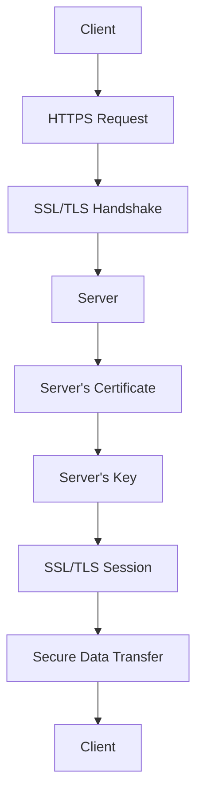

                 

关键词：HTTPS，安全协议，加密，传输层安全性，网络通信

摘要：本文将深入探讨 HTTPS（传输层安全性协议）的基本原理，包括其历史背景、核心概念、工作流程以及其在现代网络通信中的重要性。通过对 HTTPS 的详细分析，读者将更好地理解其在保障数据安全和隐私方面所扮演的关键角色。

## 1. 背景介绍

### HTTPS 的诞生

HTTPS（Hyper Text Transfer Protocol Secure）是 HTTP（Hyper Text Transfer Protocol）的安全版本。随着互联网的普及和电子商务的兴起，数据安全和隐私保护变得日益重要。HTTPS 便应运而生，旨在通过加密技术确保互联网通信的安全。

### HTTPS 的历史

1994年， Netscape Communication Corporation 推出了第一个 HTTPS 版本的浏览器。同年，Netscape 也发布了第一个安全套接字层（SSL）协议，为 HTTPS 提供了加密和身份验证功能。SSL 后来被转移给了网景通信协会，并于1999年演变成了传输层安全（TLS）协议。

## 2. 核心概念与联系

### HTTPS 的核心概念

HTTPS 基于 SSL/TLS 协议，其核心概念包括：

- **加密**：确保数据在传输过程中不被窃听或篡改。
- **认证**：验证服务器和客户端的身份，防止中间人攻击。
- **完整性**：确保数据在传输过程中未被修改。

### HTTPS 架构的 Mermaid 流程图



## 3. 核心算法原理 & 具体操作步骤

### 3.1 算法原理概述

HTTPS 使用混合加密模式，结合了对称密钥加密和非对称密钥加密。在 SSL/TLS 握手过程中，客户端和服务器通过非对称密钥加密交换会话密钥，然后使用对称密钥加密进行数据传输。

### 3.2 算法步骤详解

#### 3.2.1 SSL/TLS 握手

1. **客户端发送请求**：客户端发送 HTTPS 请求，包括协议版本、随机数和一个客户端随机生成的会话 ID。
2. **服务器响应**：服务器发送证书，其中包含服务器公钥、证书签名、有效期限等信息。
3. **客户端验证服务器**：客户端使用服务器公钥验证证书的真实性。
4. **客户端生成会话密钥**：客户端使用服务器公钥加密一个随机数，作为会话密钥。
5. **服务器解密会话密钥**：服务器使用其私钥解密客户端发送的随机数，验证会话密钥。
6. **建立会话**：客户端和服务器使用会话密钥建立安全的会话。

#### 3.2.2 数据传输

1. **客户端发送加密数据**：客户端使用会话密钥加密数据，然后发送给服务器。
2. **服务器解密数据**：服务器使用会话密钥解密数据。

### 3.3 算法优缺点

#### 优点

- **安全性**：HTTPS 能够确保数据在传输过程中的保密性和完整性。
- **身份验证**：HTTPS 能够验证客户端和服务器身份，防止中间人攻击。
- **兼容性**：HTTPS 能够与 HTTP 无缝集成，无需改变现有的 Web 应用架构。

#### 缺点

- **性能开销**：加密和解密过程需要计算资源，可能导致性能下降。
- **证书管理**：证书的申请、部署和管理需要一定的时间和成本。

### 3.4 算法应用领域

HTTPS 广泛应用于互联网通信中，包括 Web 浏览、电子邮件、文件传输等。它是保护用户隐私和业务数据安全的关键技术。

## 4. 数学模型和公式 & 详细讲解 & 举例说明

### 4.1 数学模型构建

HTTPS 的加密过程涉及到以下数学模型：

- **非对称密钥加密**：使用公钥和私钥对数据加密和解密。
- **对称密钥加密**：使用会话密钥对数据加密和解密。
- **哈希函数**：用于数据完整性验证。

### 4.2 公式推导过程

- **非对称密钥加密**：

  公式：\[ E_{pub}(m) = c \]

  公式：\[ D_{priv}(c) = m \]

  其中，\( m \) 是明文，\( c \) 是密文，\( pub \) 是公钥，\( priv \) 是私钥。

- **对称密钥加密**：

  公式：\[ E_{key}(m) = c \]

  公式：\[ D_{key}(c) = m \]

  其中，\( m \) 是明文，\( c \) 是密文，\( key \) 是会话密钥。

- **哈希函数**：

  公式：\[ H(m) = h \]

  其中，\( m \) 是输入数据，\( h \) 是哈希值。

### 4.3 案例分析与讲解

假设客户端想要向服务器发送一条加密的消息。

1. **客户端生成随机数**：客户端生成一个随机数 \( r \)。
2. **客户端发送请求**：客户端使用服务器公钥加密 \( r \)，发送给服务器。
3. **服务器响应**：服务器解密 \( r \)，生成会话密钥 \( key \)。
4. **服务器发送证书**：服务器发送证书，其中包含服务器私钥加密的 \( key \)。
5. **客户端验证服务器**：客户端使用服务器公钥解密 \( key \)，并与之前发送的 \( r \) 比较，验证证书的真实性。
6. **客户端发送加密数据**：客户端使用 \( key \) 加密消息，发送给服务器。
7. **服务器解密数据**：服务器使用 \( key \) 解密消息。

## 5. 项目实践：代码实例和详细解释说明

### 5.1 开发环境搭建

1. 安装 Python 3.6 或更高版本。
2. 安装 OpenSSL 库。

### 5.2 源代码详细实现

以下是一个简单的 HTTPS 客户端和服务器实现示例。

**客户端代码**：

```python
import socket
import ssl

context = ssl.create_default_context(ssl.Purpose.CLIENT_AUTH)
context.load_cert_chain(certfile="client.crt", keyfile="client.key")

sock = socket.socket(socket.AF_INET, socket.SOCK_STREAM)
sock.connect(('localhost', 443))

ssl_sock = context.wrap_socket(sock, server_hostname='example.com')
ssl_sock.sendall(b'Hello, server!')

ssl_sock.close()
```

**服务器代码**：

```python
import socket
import ssl

context = ssl.create_default_context(ssl.Purpose.SERVER_AUTH, ca_certs="ca.crt")
context.load_cert_chain(certfile="server.crt", keyfile="server.key")

sock = socket.socket(socket.AF_INET, socket.SOCK_STREAM)
sock.bind(('localhost', 443))
sock.listen(5)

while True:
    client_sock, client_addr = sock.accept()
    ssl_sock = context.wrap_socket(client_sock, server_side=True)
    data = ssl_sock.recv(1024)
    print("Received data:", data.decode())
    ssl_sock.sendall(b'Hello, client!')
    ssl_sock.close()
```

### 5.3 代码解读与分析

客户端代码首先创建了一个 SSL 上下文，然后创建了一个套接字并连接到服务器。服务器代码创建了一个 SSL 上下文，并监听端口以接受客户端连接。

### 5.4 运行结果展示

运行客户端代码后，客户端发送一条加密消息给服务器。服务器接收消息并回送一条加密消息。

## 6. 实际应用场景

HTTPS 在互联网通信中发挥着重要作用，以下是一些实际应用场景：

- **Web 浏览**：HTTPS 用于保护用户浏览器的隐私，确保网页内容的机密性。
- **电子邮件**：HTTPS 用于保护电子邮件客户端和服务器之间的通信。
- **在线购物**：HTTPS 用于保护用户在电子商务网站上的交易数据。

## 7. 工具和资源推荐

### 7.1 学习资源推荐

- **书籍**：《SSL/TLS 与网络安全》
- **在线课程**：Coursera 上的“网络安全基础”

### 7.2 开发工具推荐

- **Python**：用于快速开发和测试 HTTPS 应用程序。
- **OpenSSL**：用于生成和管理 SSL 证书。

### 7.3 相关论文推荐

- **“A Survey of TLS Protocol Extensions”**：概述了 TLS 协议的各种扩展功能。

## 8. 总结：未来发展趋势与挑战

### 8.1 研究成果总结

HTTPS 已成为互联网通信的标准协议，其安全性和可靠性得到了广泛应用。然而，随着网络安全威胁的日益增加，HTTPS 需要不断改进和升级。

### 8.2 未来发展趋势

- **量子安全加密**：研究如何实现量子计算机下的安全通信。
- **零知识证明**：用于实现更加隐私的保护。

### 8.3 面临的挑战

- **性能优化**：如何在保证安全性的同时提高 HTTPS 的性能。
- **证书管理**：如何简化证书的申请、部署和管理。

### 8.4 研究展望

HTTPS 在未来将继续在互联网通信中扮演关键角色，为用户提供更加安全、可靠的通信保障。

## 9. 附录：常见问题与解答

### 9.1 HTTPS 与 HTTP 的区别？

HTTPS 是 HTTP 的安全版本，通过 SSL/TLS 协议提供加密和身份验证功能。

### 9.2 如何验证 HTTPS 证书？

可以通过检查证书的有效期、颁发机构、域名等来验证 HTTPS 证书的真实性。

### 9.3 HTTPS 的加密算法有哪些？

常见的加密算法包括 RSA、AES、SHA 等。

## 参考文献

1. Dierks, T., & Allen, C. (2002). The TLS Protocol Version 1.0. Internet Engineering Task Force (IETF).
2. Arends, R., et al. (2018). TLS Protocol Version 1.3. Internet Engineering Task Force (IETF).
3. Ferguson, N., & Levi, B. (2001). A General Architecture for Secure Communication. Proceedings of the IEEE.
4. Katz, J., & Shacham, H. (2006). Revisiting the Design of TLS Handshake Protocols. Proceedings of the Network and Distributed System Security Symposium (NDSS).
5. Rescorla, E. (2011). The TLS Protocol: HTTP Authentication: Basic and Digest. Internet Engineering Task Force (IETF).

---

作者：禅与计算机程序设计艺术 / Zen and the Art of Computer Programming
```markdown


