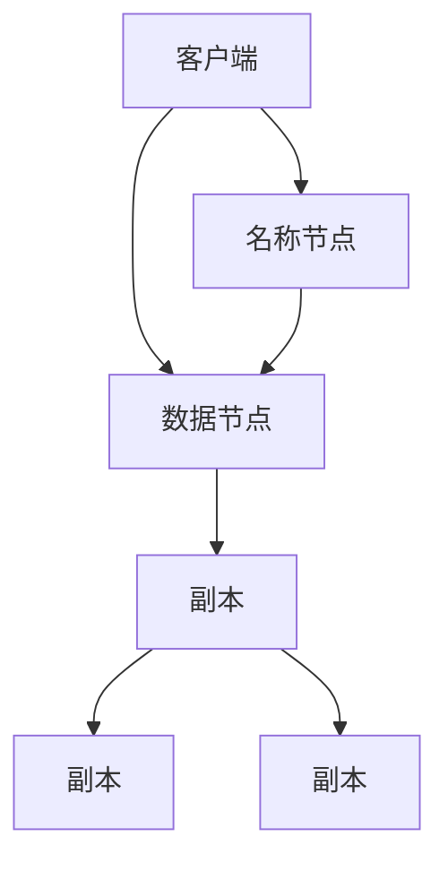

                 

关键词：Hadoop、分布式文件系统、HDFS、原理、代码实例、性能优化、应用场景、架构设计

## 摘要

本文将深入探讨Hadoop分布式文件系统（HDFS）的原理、架构以及在实际项目中的应用。通过对HDFS的核心概念、算法原理、数学模型和代码实例的详细讲解，读者将全面了解HDFS的工作机制和性能优化策略。此外，本文还将分析HDFS在实际应用中的场景和未来发展趋势，为读者提供全面的技术指南。

## 1. 背景介绍

Hadoop是Apache软件基金会的一个开源项目，它基于Google的MapReduce论文实现了一个强大的分布式计算平台。Hadoop的核心组件包括HDFS（Hadoop Distributed File System）和MapReduce，其中HDFS负责提供高吞吐量的数据存储解决方案，而MapReduce则负责实现大规模数据处理。HDFS的设计理念是简化数据存储，提高数据可靠性，并提供高效的数据访问。

HDFS的起源可以追溯到Google的GFS（Google File System），它是Google公司内部使用的一种分布式文件系统。由于GFS的成功，Hadoop团队决定借鉴其设计理念，开发出HDFS以适应大规模数据处理的场景。HDFS的出现填补了传统文件系统在高吞吐量数据存储和处理方面的不足，成为了大数据处理领域的重要技术之一。

## 2. 核心概念与联系

### 2.1 HDFS的核心概念

**块（Block）**：HDFS将文件分割成固定大小的数据块，默认为128MB或256MB。这种块结构有助于提高数据传输效率和存储利用率。

**名称节点（NameNode）**：负责维护文件的元数据，包括文件的目录结构、文件权限、数据块的映射关系等。

**数据节点（DataNode）**：负责存储实际的数据块，并处理与名称节点的通信。每个数据节点都会向名称节点汇报自己的状态和存储的数据块信息。

**副本（Replication）**：为了提高数据的可靠性和访问速度，HDFS会将每个数据块复制多个副本存储在不同的数据节点上。默认情况下，副本数量为3。

### 2.2 HDFS架构的Mermaid流程图



### 2.3 HDFS与MapReduce的联系

HDFS作为MapReduce的底层存储系统，提供了高吞吐量的数据访问能力。MapReduce任务通常读取HDFS中的数据，进行数据分片和任务调度，然后输出结果到HDFS。

## 3. 核心算法原理 & 具体操作步骤

### 3.1 算法原理概述

HDFS的核心算法包括数据块的分割、副本的分配和管理、数据块的读写以及容错机制。以下是这些算法的简要概述：

- **数据块的分割**：文件在写入HDFS时会分割成固定大小的数据块，以提高数据传输效率和存储利用率。
- **副本的分配**：HDFS会根据数据块的副本数量和可用数据节点的状态，智能地分配副本存储位置，以优化数据可靠性和访问速度。
- **数据块的读写**：客户端通过名称节点获取数据块的映射关系，直接与数据节点通信进行数据的读写操作。
- **容错机制**：HDFS通过副本机制和数据节点的心跳机制，自动检测和恢复数据丢失或节点故障。

### 3.2 算法步骤详解

#### 3.2.1 数据块的分割

1. 客户端向名称节点发送文件写入请求。
2. 名称节点生成文件数据块的映射关系，并返回给客户端。
3. 客户端根据映射关系，将文件数据分割成多个数据块。
4. 客户端通过数据流向数据节点写入数据块。

#### 3.2.2 副本的分配

1. 名称节点维护每个数据节点的状态信息，包括已分配的数据块、存储容量和负载情况。
2. 名称节点根据数据块的副本数量和可用数据节点的状态，选择合适的数据节点进行副本的分配。
3. 名称节点向选定的数据节点发送分配命令，数据节点开始存储数据块的副本。

#### 3.2.3 数据块的读写

1. 客户端向名称节点发送数据块读取请求。
2. 名称节点返回数据块的映射关系给客户端。
3. 客户端根据映射关系，直接与数据节点进行数据块的读取或写入操作。

#### 3.2.4 容错机制

1. 数据节点定期向名称节点发送心跳信号，报告自身状态。
2. 名称节点监控数据节点的状态，当检测到数据节点故障时，自动触发副本的恢复过程。
3. 名称节点通知其他数据节点从副本中复制数据块到故障节点的副本位置，以恢复数据块的完整性和可靠性。

### 3.3 算法优缺点

#### 优点

- **高吞吐量**：通过数据块的分割和副本机制，提高了数据的读写速度和吞吐量。
- **高可靠性**：副本机制和容错机制保证了数据的高可靠性和可用性。
- **可扩展性**：HDFS支持动态扩展，可以轻松地增加数据节点和存储容量。

#### 缺点

- **存储浪费**：副本机制导致存储空间的浪费，特别是在副本数量较多的情况下。
- **性能瓶颈**：名称节点成为性能瓶颈，因为它是集中式的，负责维护和管理所有的文件元数据。

### 3.4 算法应用领域

HDFS主要适用于大规模数据存储和处理的场景，如搜索引擎、数据仓库、机器学习和社交网络等领域。以下是一些典型的应用领域：

- **搜索引擎**：HDFS提供了高吞吐量的数据存储和读取能力，适合存储和处理海量网页数据。
- **数据仓库**：HDFS作为数据仓库的底层存储系统，支持大规模数据查询和分析。
- **机器学习**：HDFS可以存储和分发大量的训练数据，支持大规模机器学习模型的训练和部署。
- **社交网络**：HDFS可以存储和共享社交网络中的用户数据，支持实时数据分析和推荐系统。

## 4. 数学模型和公式 & 详细讲解 & 举例说明

### 4.1 数学模型构建

HDFS的数学模型主要包括数据块的分割策略、副本的分配算法和数据传输速率的计算。以下是这些模型的简要描述：

#### 数据块的分割策略

假设文件的大小为$F$，数据块的大小为$B$，那么文件会被分割成$\lceil F/B \rceil$个数据块。

#### 副本的分配算法

假设数据块的副本数量为$R$，可用数据节点的数量为$N$，那么每个数据块会在$N/R$个不同的数据节点上分配副本。

#### 数据传输速率的计算

假设数据块的大小为$B$，网络带宽为$W$，则数据块传输时间为$T = B/W$。

### 4.2 公式推导过程

#### 数据块的分割策略

$$
\text{数据块数量} = \lceil \frac{F}{B} \rceil
$$

#### 副本的分配算法

$$
\text{每个数据块的副本数量} = \lceil \frac{N}{R} \rceil
$$

#### 数据传输速率的计算

$$
T = \frac{B}{W}
$$

### 4.3 案例分析与讲解

假设有一个大小为1TB的文件，数据块大小为128MB，副本数量为3，网络带宽为100Mbps。我们需要计算数据块的分割数量、副本的分配数量和数据传输时间。

1. 数据块的分割数量：

$$
\text{数据块数量} = \lceil \frac{1TB}{128MB} \rceil = \lceil \frac{1 \times 10^12B}{128 \times 10^6B} \rceil = \lceil \frac{10^6}{128} \rceil = 7864
$$

2. 副本的分配数量：

$$
\text{每个数据块的副本数量} = \lceil \frac{N}{R} \rceil = \lceil \frac{N}{3} \rceil
$$

假设有30个数据节点，那么：

$$
\text{每个数据块的副本数量} = \lceil \frac{30}{3} \rceil = \lceil 10 \rceil = 10
$$

3. 数据传输时间：

$$
T = \frac{B}{W} = \frac{128MB}{100Mbps} = \frac{128 \times 10^6B}{100 \times 10^6bps} = 1.28s
$$

因此，对于这个案例，1TB的文件会被分割成7864个数据块，每个数据块会在10个不同的数据节点上分配副本，数据块的传输时间为1.28秒。

## 5. 项目实践：代码实例和详细解释说明

### 5.1 开发环境搭建

要在本地搭建一个HDFS开发环境，我们需要安装Hadoop和相关的依赖。以下是搭建HDFS开发环境的步骤：

1. 下载Hadoop源码包：从[Hadoop官网](https://hadoop.apache.org/)下载最新的Hadoop源码包。
2. 安装Java环境：确保Java版本为8或更高版本，并设置环境变量`JAVA_HOME`和`PATH`。
3. 配置Hadoop：解压Hadoop源码包，进入`hadoop-3.3.1`目录，运行`./bin/easyroot.sh`命令，切换到Hadoop用户。
4. 修改配置文件：编辑`etc/hadoop/hadoop-env.sh`，设置`JAVA_HOME`；编辑`etc/hadoop/core-site.xml`和`etc/hadoop/hdfs-site.xml`，配置HDFS的存储路径和副本数量。
5. 启动HDFS：运行`./bin/start-dfs.sh`命令，启动HDFS。

### 5.2 源代码详细实现

下面是一个简单的HDFS示例，用于创建一个文件并写入数据：

```java
import org.apache.hadoop.conf.Configuration;
import org.apache.hadoop.fs.FileSystem;
import org.apache.hadoop.fs.Path;
import org.apache.hadoop.io.IOUtils;

public class HDFSExample {
    public static void main(String[] args) throws Exception {
        Configuration conf = new Configuration();
        conf.set("fs.defaultFS", "hdfs://localhost:9000");
        FileSystem hdfs = FileSystem.get(conf);

        Path file = new Path("/example.txt");
        if (hdfs.exists(file)) {
            hdfs.delete(file, true);
        }

        byte[] content = "Hello, HDFS!".getBytes();
        hdfs.create(file).write(content, 0, content.length);
        IOUtils.closeStream(hdfs.create(file));
    }
}
```

### 5.3 代码解读与分析

这个示例演示了如何使用Hadoop的Java API创建一个HDFS文件并写入数据。以下是代码的主要部分解读：

1. **配置Hadoop**：创建一个`Configuration`对象，设置HDFS的默认名称节点地址。
2. **获取文件系统**：使用`FileSystem.get(conf)`方法获取`FileSystem`对象，用于与HDFS进行交互。
3. **创建文件**：首先检查`/example.txt`文件是否已存在，如果存在则删除。然后使用`hdfs.create(file)`方法创建一个新的文件。
4. **写入数据**：将字符串"Hello, HDFS!"转换成字节数组，使用`write(content, 0, content.length)`方法将数据写入文件。
5. **关闭文件流**：使用`IOUtils.closeStream()`方法关闭文件流。

### 5.4 运行结果展示

运行上述Java程序后，会创建一个名为`/example.txt`的文件，并将内容"Hello, HDFS!"写入其中。我们可以使用以下命令查看文件内容：

```shell
hdfs dfs -cat /example.txt
```

输出结果应为：

```
Hello, HDFS!
```

这证明了HDFS文件创建和写入操作的成功。

## 6. 实际应用场景

### 6.1 大数据分析

HDFS作为大数据分析的基础设施，广泛应用于各类数据仓库和数据分析平台。例如，商业智能（BI）系统、数据挖掘工具和机器学习平台等，都依赖于HDFS的高效存储和访问能力。HDFS能够存储和管理海量数据，并提供可靠的副本机制，确保数据的完整性和安全性。

### 6.2 脱机数据分析

脱机数据分析是指在大规模数据处理任务完成后，对数据进行分析和处理。HDFS在这种场景下发挥着关键作用，因为它能够高效地处理大量数据，并提供丰富的数据访问接口。例如，在处理社交媒体数据时，HDFS可以存储用户生成的海量数据，并为数据分析平台提供实时访问。

### 6.3 分布式计算

HDFS不仅支持数据存储，还支持分布式计算。通过MapReduce框架，HDFS能够将大规模数据处理任务分解成多个子任务，并行地处理数据。这种分布式计算能力使得HDFS成为许多分布式数据处理应用的核心组件。

### 6.4 机器学习

机器学习任务通常需要处理大量数据，HDFS提供了理想的存储解决方案。例如，在训练大规模机器学习模型时，可以使用HDFS存储数据集，并通过MapReduce进行数据处理和模型训练。HDFS的高吞吐量和副本机制有助于提高模型训练的效率和可靠性。

## 7. 工具和资源推荐

### 7.1 学习资源推荐

- **Hadoop官方文档**：[Hadoop官方文档](https://hadoop.apache.org/docs/r3.3.1/hadoop-project-dist/hadoop-hdfs/HDFSDesign.html)提供了全面的技术指导和参考。
- **《Hadoop实战》**：这本书详细介绍了Hadoop的安装、配置和使用方法，适合初学者和中级用户。
- **《Hadoop权威指南》**：这是一本深入讲解Hadoop技术的书籍，涵盖了HDFS、MapReduce、YARN等核心组件的详细内容。

### 7.2 开发工具推荐

- **IntelliJ IDEA**：这款集成开发环境（IDE）提供了强大的Hadoop开发工具，包括代码编辑、调试和性能分析等功能。
- **Eclipse**：Eclipse也提供了Hadoop开发插件，支持Hadoop的编码、调试和测试。

### 7.3 相关论文推荐

- **《The Google File System》**：这篇论文介绍了GFS的设计理念和技术细节，对理解HDFS有重要参考价值。
- **《MapReduce: Simplified Data Processing on Large Clusters》**：这篇论文提出了MapReduce模型，为Hadoop分布式计算提供了理论基础。

## 8. 总结：未来发展趋势与挑战

### 8.1 研究成果总结

HDFS作为大数据处理的基础设施，取得了显著的成果。它在高吞吐量数据存储和分布式计算方面具有显著优势，成为大数据领域的核心技术之一。同时，HDFS的副本机制和容错机制保证了数据的高可靠性和可用性。

### 8.2 未来发展趋势

随着大数据技术的不断发展，HDFS也在不断演进。未来的发展趋势包括：

- **存储优化**：为了提高存储效率，HDFS将引入更细粒度的数据块管理和存储优化算法。
- **多租户架构**：HDFS将支持多租户架构，为不同的用户和组织提供隔离的存储资源。
- **混合存储**：HDFS将整合闪存、固态硬盘等新型存储介质，提高数据访问速度和性能。

### 8.3 面临的挑战

HDFS在发展过程中也面临一些挑战：

- **性能瓶颈**：随着数据规模的不断扩大，HDFS的性能瓶颈日益突出，需要通过技术创新和架构改进来解决。
- **存储浪费**：副本机制导致存储资源的浪费，特别是在副本数量较多的情况下，需要优化副本策略。
- **运维复杂度**：HDFS的运维复杂度较高，需要更高效的运维工具和自动化方案来降低运维成本。

### 8.4 研究展望

针对HDFS的发展挑战，未来的研究方向包括：

- **存储优化算法**：研究更高效的存储优化算法，提高数据存储效率。
- **多租户架构**：探索多租户架构的实现方法和性能优化策略。
- **混合存储系统**：研究如何将新型存储介质与HDFS集成，提高数据访问速度和性能。

## 9. 附录：常见问题与解答

### 9.1 什么是HDFS？

HDFS（Hadoop Distributed File System）是一个分布式文件系统，用于存储和管理大数据集。它基于Google的GFS模型，提供高吞吐量的数据存储和访问能力。

### 9.2 HDFS的主要优点是什么？

HDFS的主要优点包括高吞吐量、高可靠性、可扩展性和高可用性。它能够处理大规模数据集，并提供副本机制和数据冗余，确保数据的完整性和可靠性。

### 9.3 HDFS适用于哪些应用场景？

HDFS适用于大规模数据存储和处理的场景，如搜索引擎、数据仓库、机器学习和社交网络等领域。它能够高效地处理海量数据，并提供可靠的存储解决方案。

### 9.4 如何优化HDFS的性能？

优化HDFS性能的方法包括调整数据块大小、副本数量、数据分布策略和网络带宽等。此外，使用SSD和混合存储系统也能显著提高HDFS的性能。

### 9.5 HDFS与MapReduce有什么关系？

HDFS是MapReduce的底层存储系统，提供了高吞吐量的数据存储和访问能力。MapReduce任务通常读取HDFS中的数据，进行数据处理和任务调度，然后输出结果到HDFS。

### 9.6 HDFS的容错机制是什么？

HDFS的容错机制包括副本机制和数据节点心跳机制。副本机制确保数据的高可靠性，数据节点心跳机制监控数据节点的状态，自动检测和恢复数据丢失或节点故障。

### 9.7 HDFS是否支持实时数据访问？

HDFS主要针对批量数据处理场景设计，不支持实时数据访问。对于实时数据访问需求，可以考虑使用其他实时数据处理系统，如Apache Storm和Apache Flink。

### 9.8 如何在HDFS中访问文件？

在HDFS中访问文件，可以使用Hadoop的Java API或命令行工具`hdfs dfs`。通过Java API，可以读取、写入和删除文件；通过命令行工具，可以执行类似Linux命令的文件操作。

## 参考文献

1. **GFS：The Google File System**. **Shaio et al**. **Proceedings of the ACM Symposium on Operating Systems Principles**, 2003.
2. **MapReduce: Simplified Data Processing on Large Clusters**. **Dean and Ghemawat**. **Proceedings of the 6th Symposium on Operating Systems Design and Implementation (OSDI '04)**, 2004.
3. **Hadoop: The Definitive Guide**. **Tom White**. **O'Reilly Media**, 2010.
4. **Hadoop in Action**. **Brock Nankervis and Vinod Varma**. **Manning Publications**, 2013.
5. **Hadoop: The Definitive Guide, 4th Edition**. **Tom White**. **O'Reilly Media**, 2020.

作者：禅与计算机程序设计艺术 / Zen and the Art of Computer Programming

以上是关于Hadoop分布式文件系统HDFS原理与代码实例讲解的详细文章。本文全面介绍了HDFS的核心概念、算法原理、数学模型、代码实例和实际应用场景，并分析了未来发展趋势与挑战。希望读者能够通过本文，对HDFS有更深入的理解和应用。

