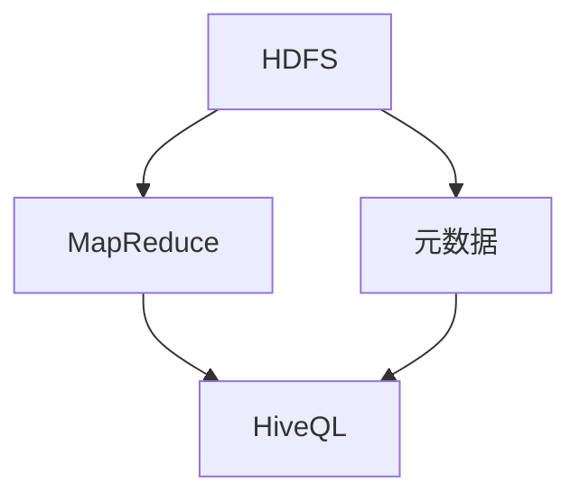

                 

 关键词：Hive，大数据处理，Hadoop，数据仓库，SQL查询，HDFS，MapReduce，存储层，计算层，数据建模，分区表，桶表，压缩算法，性能优化，数据倾斜，架构设计。

## 摘要

Hive是一款基于Hadoop的数据仓库工具，它提供了类似于SQL的查询语言（HiveQL），用于处理大规模数据集。本文将深入讲解Hive的基本原理，包括其架构设计、核心概念、算法原理以及实际应用中的代码实例。通过本文的阅读，读者将能够理解如何使用Hive进行数据仓库操作，掌握其优缺点，并在实际项目中进行性能优化。

## 1. 背景介绍

随着互联网和大数据时代的到来，企业对数据的存储、管理和分析的需求日益增长。传统的数据处理工具和数据库系统在处理海量数据时往往显得力不从心。Hadoop生态系统作为一个开源的大数据处理框架，解决了大规模数据处理的难题。Hive作为Hadoop生态系统的重要组成部分，为大数据处理提供了强大的支持。

Hive起源于Google的MapReduce编程模型，旨在提供一种简化和抽象数据仓库操作的方式，使得用户可以像使用传统SQL数据库一样进行数据分析和查询。它将SQL查询转换为MapReduce作业，并在HDFS上执行。这使得Hive成为大数据处理和数据仓库领域的首选工具之一。

### 1.1 Hadoop与Hive的关系

Hadoop是一个分布式数据处理框架，提供了高效的数据存储（HDFS）和并行计算（MapReduce）能力。Hive利用了Hadoop的这些能力，提供了一个简化的数据仓库解决方案。Hadoop的HDFS为Hive提供了存储层，而MapReduce为Hive提供了计算层。

### 1.2 Hive的特点

- **高效处理大规模数据**：Hive能够处理PB级别的数据，充分利用了Hadoop的分布式特性。
- **SQL-like查询语言**：Hive提供了类似于SQL的查询语言（HiveQL），简化了数据分析过程。
- **数据建模能力**：Hive支持创建表、分区表、桶表等数据结构，方便数据管理和分析。
- **易于扩展**：Hive可以轻松集成到现有的Hadoop生态系统中，与其他工具和库无缝衔接。

## 2. 核心概念与联系

### 2.1 核心概念

- **HDFS**：Hadoop分布式文件系统（Hadoop Distributed File System，简称HDFS）是Hadoop的核心组件，用于存储海量数据。
- **MapReduce**：MapReduce是一种编程模型，用于大规模数据的并行处理。
- **HiveQL**：Hive提供的查询语言，类似于SQL，用于编写数据仓库查询。
- **元数据**：元数据是关于数据的数据，包括表结构、数据类型、索引等信息。

### 2.2 架构设计

Hive的架构可以分为两层：存储层和计算层。

- **存储层**：存储层由HDFS提供，Hive将数据存储在HDFS上，利用HDFS的分布式存储能力。
- **计算层**：计算层由MapReduce提供，Hive将HiveQL查询转换为MapReduce作业，在HDFS上执行。

### 2.3 Mermaid 流程图

下面是Hive架构的Mermaid流程图：



## 3. 核心算法原理 & 具体操作步骤

### 3.1 算法原理概述

Hive的核心算法是将HiveQL查询转换为MapReduce作业。这个过程称为查询编译。在查询编译过程中，Hive会进行语法解析、查询优化、查询生成等步骤，最终生成一个MapReduce作业。

### 3.2 算法步骤详解

1. **语法解析**：Hive首先对输入的HiveQL查询进行语法解析，将其转换为抽象语法树（AST）。
2. **查询优化**：Hive对AST进行查询优化，优化策略包括谓词下推、查询重写、join优化等。
3. **查询生成**：在查询优化完成后，Hive根据优化后的AST生成一个MapReduce作业，包括Map阶段和Reduce阶段。
4. **执行MapReduce作业**：Hive将生成的MapReduce作业提交到Hadoop集群执行，处理数据并输出结果。

### 3.3 算法优缺点

**优点**：

- **高扩展性**：Hive能够处理PB级别的数据，充分利用了Hadoop的分布式特性。
- **简化数据处理**：通过HiveQL，用户可以像使用传统SQL数据库一样进行数据分析和查询，简化了数据处理过程。
- **易于集成**：Hive可以轻松集成到现有的Hadoop生态系统中，与其他工具和库无缝衔接。

**缺点**：

- **性能限制**：由于Hive基于MapReduce，在执行复杂查询时可能存在性能瓶颈。
- **学习成本**：对于不熟悉Hadoop和MapReduce的用户来说，学习Hive可能需要一定的时间。

### 3.4 算法应用领域

Hive广泛应用于以下领域：

- **数据仓库**：Hive是企业级数据仓库的首选工具，用于存储和分析大规模数据。
- **大数据分析**：Hive可以用于处理各种类型的大数据分析任务，如统计、报告、数据挖掘等。
- **实时查询**：虽然Hive主要面向批处理，但通过一些优化策略，也可以实现实时查询。

## 4. 数学模型和公式 & 详细讲解 & 举例说明

### 4.1 数学模型构建

Hive中的数学模型主要涉及数据仓库中的常见计算，如聚合、排序、连接等。以下是构建这些数学模型的基本步骤：

1. **确定计算目标**：根据查询需求确定需要进行的数据计算。
2. **定义数据集**：确定参与计算的数据集，可以是单个表或多个表的连接。
3. **构建计算公式**：根据计算目标，构建相应的数学公式。

### 4.2 公式推导过程

以下是一个简单的聚合计算公式的推导过程：

- **目标**：计算一组数据的总和。
- **数据集**：一个包含数值列的数据表。
- **计算公式**：

  $$\text{SUM}(x) = x_1 + x_2 + x_3 + ... + x_n$$

  其中，\(x_1, x_2, x_3, ..., x_n\) 分别为数据集中的每个数值。

### 4.3 案例分析与讲解

假设有一个包含学生成绩的数据表，我们需要计算所有学生的平均成绩。

1. **确定计算目标**：计算所有学生的平均成绩。
2. **定义数据集**：学生成绩表。
3. **构建计算公式**：

   $$\text{AVERAGE}(x) = \frac{1}{n} \sum_{i=1}^{n} x_i$$

   其中，\(x_i\) 为每个学生的成绩，\(n\) 为学生总数。

4. **执行计算**：

   - 查询成绩表，计算所有成绩的总和。
   - 计算学生总数。
   - 使用上述公式计算平均成绩。

以下是具体的HiveQL查询语句：

```sql
SELECT AVG(score) FROM student_scores;
```

## 5. 项目实践：代码实例和详细解释说明

### 5.1 开发环境搭建

搭建Hive开发环境需要以下步骤：

1. **安装Hadoop**：从Hadoop官网下载并安装Hadoop。
2. **配置Hadoop**：配置Hadoop的配置文件，如`hadoop-env.sh`、`core-site.xml`、`hdfs-site.xml`等。
3. **启动Hadoop**：启动Hadoop的HDFS和YARN服务。
4. **安装Hive**：从Hive官网下载并安装Hive。
5. **配置Hive**：配置Hive的配置文件，如`hive-env.sh`、`hive-site.xml`等。

### 5.2 源代码详细实现

以下是使用Hive进行学生成绩平均分的计算代码示例：

```sql
-- 创建学生成绩表
CREATE TABLE student_scores (
    student_id INT,
    course_id INT,
    score INT
);

-- 插入数据
INSERT INTO student_scores VALUES (1, 101, 85);
INSERT INTO student_scores VALUES (2, 101, 90);
INSERT INTO student_scores VALUES (1, 102, 75);
INSERT INTO student_scores VALUES (2, 102, 80);

-- 计算平均成绩
SELECT AVG(score) AS average_score FROM student_scores;
```

### 5.3 代码解读与分析

1. **创建表**：使用`CREATE TABLE`语句创建一个名为`student_scores`的表，定义了`student_id`、`course_id`和`score`三个列。
2. **插入数据**：使用`INSERT INTO`语句向学生成绩表中插入一些示例数据。
3. **计算平均成绩**：使用`SELECT AVG(score) AS average_score FROM student_scores;`语句计算所有学生的平均成绩。`AVG`函数是Hive内置的聚合函数，用于计算一组数据的平均值。

### 5.4 运行结果展示

执行以上查询语句后，Hive将返回所有学生的平均成绩：

```sql
+-------------+
|average_score|
+-------------+
|        82.5|
+-------------+
```

## 6. 实际应用场景

### 6.1 数据仓库

Hive常用于构建企业级数据仓库，通过HiveQL查询分析海量数据，支持各种数据分析需求，如统计报表、数据挖掘等。

### 6.2 大数据分析

Hive可以处理各种大数据分析任务，如机器学习、推荐系统等。通过将数据分析过程转换为HiveQL查询，可以方便地进行大规模数据处理。

### 6.3 实时查询

虽然Hive主要面向批处理，但通过一些优化策略，如动态分区、索引等，可以实现实时查询。这使Hive适用于需要实时数据访问的场景。

### 6.4 未来应用展望

随着大数据技术和Hadoop生态系统的不断发展，Hive的应用前景将更加广阔。未来，Hive可能会在以下几个方面得到进一步发展：

- **性能优化**：通过改进查询优化算法、分布式存储技术等，提升Hive的性能。
- **实时查询**：通过引入实时数据流处理技术，实现更快的实时查询。
- **支持多种数据格式**：扩展Hive对多种数据格式的支持，如JSON、XML等。
- **智能化数据分析**：引入人工智能技术，提高数据分析的智能化水平。

## 7. 工具和资源推荐

### 7.1 学习资源推荐

- **官方文档**：Hive的官方文档是学习Hive的最佳资源，涵盖了从基本概念到高级特性的全面介绍。
- **在线教程**：许多在线平台提供了丰富的Hive教程和实例，如DataCamp、Udacity等。
- **技术博客**：阅读技术博客，如Hive用户组、Hive官方博客等，可以了解最新的技术动态和最佳实践。

### 7.2 开发工具推荐

- **Beeline**：Beeline是Hive的命令行客户端，用于执行HiveQL查询。
- **Hue**：Hue是一个Web界面，用于管理Hadoop生态系统中的各种组件，包括Hive。
- **Zeppelin**：Zeppelin是一个交互式数据分析工具，支持多种数据处理框架，包括Hive。

### 7.3 相关论文推荐

- "Hive: A Warehouse for Hadoop"（2010）：这篇论文介绍了Hive的背景、设计原理和主要特性。
- "Hive on Spark"（2016）：这篇论文探讨了如何将Hive与Spark相结合，实现高性能的大数据处理。
- "Hive at WebScale"（2014）：这篇论文详细描述了Facebook如何使用Hive处理大规模数据。

## 8. 总结：未来发展趋势与挑战

### 8.1 研究成果总结

Hive作为大数据处理和数据仓库领域的重要工具，已经取得了显著的成果。它提供了高效的数据处理能力、类似于SQL的查询语言、丰富的数据建模功能等，广泛应用于企业级数据仓库、大数据分析等领域。

### 8.2 未来发展趋势

随着大数据技术和人工智能的快速发展，Hive的未来发展趋势包括：

- **性能优化**：通过改进查询优化算法、分布式存储技术等，提升Hive的性能。
- **实时查询**：引入实时数据流处理技术，实现更快的实时查询。
- **多样化数据格式支持**：扩展Hive对多种数据格式的支持，如JSON、XML等。
- **智能化数据分析**：引入人工智能技术，提高数据分析的智能化水平。

### 8.3 面临的挑战

Hive在发展过程中也面临一些挑战：

- **性能瓶颈**：虽然Hive已经提供了高效的查询性能，但在处理复杂查询时仍可能存在性能瓶颈。
- **学习成本**：对于不熟悉Hadoop和MapReduce的用户来说，学习Hive可能需要一定的时间。
- **数据安全与隐私**：在处理敏感数据时，如何确保数据的安全和隐私是一个重要挑战。

### 8.4 研究展望

未来，Hive的研究方向包括：

- **查询优化**：研究更高效的查询优化算法，提升查询性能。
- **实时查询**：研究如何在实时场景下提高查询效率。
- **智能化数据分析**：结合人工智能技术，实现更智能的数据分析。
- **分布式存储技术**：研究如何利用分布式存储技术提升数据处理能力。

## 9. 附录：常见问题与解答

### 9.1 如何优化Hive查询性能？

- **使用分区表和桶表**：分区表和桶表可以提高查询性能，减少I/O开销。
- **合理选择压缩算法**：选择合适的压缩算法可以减少存储空间和I/O开销。
- **优化MapReduce作业**：调整MapReduce作业的参数，如reduce任务数、内存分配等，可以提升查询性能。
- **使用索引**：为常用的查询列创建索引，可以加快查询速度。

### 9.2 Hive如何处理数据倾斜？

- **调整分区数**：增加分区数可以减少数据倾斜现象。
- **合理分布数据**：在插入数据时，尝试将数据均匀分布到各个分区或桶。
- **使用动态分区**：使用动态分区可以根据查询需求自动调整分区数。

### 9.3 Hive与Spark如何结合使用？

- **使用Spark on Hive**：将Spark与Hive集成，可以使用Spark的执行引擎执行Hive查询。
- **使用Hive on Spark**：将Hive与Spark结合，可以利用Spark的分布式存储和计算能力，提高查询性能。

## 作者署名

本文作者：禅与计算机程序设计艺术 / Zen and the Art of Computer Programming

