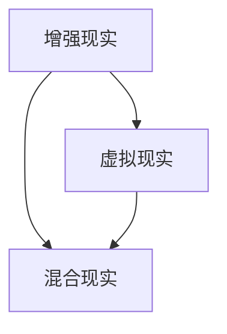

                 

关键词：HoloLens，混合现实，增强现实，混合现实应用，混合现实开发

摘要：本文将探讨微软的HoloLens在混合现实领域的应用。通过对HoloLens的核心技术、应用场景和未来展望的深入分析，我们将了解这一革命性技术如何改变我们的工作方式和生活体验。

## 1. 背景介绍

混合现实（Mixed Reality，MR）是一种结合了真实世界和虚拟世界的交互体验。与虚拟现实（VR）不同，混合现实不仅模拟虚拟环境，还将虚拟元素与真实世界相结合，使虚拟内容与真实环境相互交互。微软的HoloLens是一款领先的头戴式混合现实设备，自2016年推出以来，它在企业、教育和个人娱乐等领域取得了显著的应用。

### HoloLens发展历程

- **2015年**：微软宣布HoloLens的发布，并在多个领域展示其应用潜力。
- **2016年**：HoloLens正式上市，吸引了众多开发者和企业关注。
- **2018年**：微软推出HoloLens 2，提升了性能和用户体验。
- **2020年**：HoloLens 2扩展到更多国家和地区，并推出了多个行业解决方案。

### HoloLens核心特性

- **全息图像**：HoloLens可以显示全息图像，这些图像看起来就像是漂浮在空中，与真实环境无缝融合。
- **自然交互**：用户可以通过手势、声音和视线与虚拟元素交互，无需传统输入设备。
- **环境感知**：HoloLens配备了传感器和摄像头，可以感知周围环境，并根据环境进行自适应调整。

## 2. 核心概念与联系

为了更好地理解HoloLens在混合现实中的应用，我们需要了解几个核心概念：

### 2.1 增强现实（AR）

增强现实是一种通过在现实世界环境中叠加虚拟图像来增强现实体验的技术。与混合现实不同，AR通常不涉及虚拟环境与真实环境的深度融合。

### 2.2 虚拟现实（VR）

虚拟现实是一种完全沉浸式的体验，用户通过头戴设备进入一个虚拟世界，与真实世界隔绝。

### 2.3 混合现实（MR）

混合现实是增强现实和虚拟现实的结合，虚拟元素与现实环境相互交互，形成一个全新的混合现实空间。

下面是一个简单的Mermaid流程图，展示了这些概念之间的关系：



## 3. 核心算法原理 & 具体操作步骤

### 3.1 算法原理概述

HoloLens的应用依赖于几个关键算法，包括图像识别、实时追踪和空间映射。

- **图像识别**：使用深度学习和计算机视觉算法，HoloLens能够识别环境中的物体和场景。
- **实时追踪**：通过摄像头和传感器，HoloLens能够实时追踪用户的位置和方向。
- **空间映射**：利用传感器和摄像头数据，HoloLens能够创建三维空间模型，并在此模型上进行虚拟元素叠加。

### 3.2 算法步骤详解

1. **启动HoloLens**：用户启动HoloLens，设备开始收集环境数据。
2. **图像识别**：HoloLens使用深度学习算法识别环境中的物体和场景。
3. **实时追踪**：设备通过摄像头和传感器实时追踪用户的位置和方向。
4. **空间映射**：HoloLens创建三维空间模型，并根据模型叠加虚拟元素。
5. **用户交互**：用户通过手势、声音和视线与虚拟元素交互。

### 3.3 算法优缺点

**优点**：

- **无缝交互**：用户可以通过自然交互方式与虚拟元素交互，无需传统输入设备。
- **实时响应**：HoloLens能够实时追踪用户和环境，提供即时的交互体验。

**缺点**：

- **成本较高**：HoloLens设备价格较高，限制了其大规模普及。
- **性能限制**：当前HoloLens的性能尚未完全达到理想状态，某些应用场景下仍存在性能瓶颈。

### 3.4 算法应用领域

HoloLens在多个领域展示了其强大的应用潜力，包括：

- **工业制造**：用于维护、设计和生产过程的实时指导。
- **医疗**：用于医学成像、手术规划和患者教育。
- **教育**：用于互动教学、远程学习和虚拟实验。
- **娱乐**：用于虚拟现实游戏和互动体验。

## 4. 数学模型和公式 & 详细讲解 & 举例说明

为了更好地理解HoloLens的算法原理，我们需要介绍一些关键的数学模型和公式。

### 4.1 数学模型构建

- **图像识别**：卷积神经网络（CNN）
- **实时追踪**：卡尔曼滤波器
- **空间映射**：贝叶斯推理

### 4.2 公式推导过程

这里我们以卷积神经网络（CNN）为例，介绍其基本原理。

$$
\begin{align*}
\text{输入图像} \, I &= \text{卷积} \, (K, X) \\
\text{卷积结果} \, C &= K \, \star I \\
\text{池化结果} \, P &= \text{MaxPooling}(C)
\end{align*}
$$

这里，$K$ 是卷积核，$X$ 是输入图像，$C$ 是卷积结果，$P$ 是池化结果。

### 4.3 案例分析与讲解

以工业制造领域为例，HoloLens如何应用于设备维护和故障排查？

1. **设备识别**：HoloLens使用图像识别算法识别设备。
2. **故障诊断**：基于设备识别结果，HoloLens提供实时故障诊断和解决方案。
3. **远程指导**：设备维护人员可以通过HoloLens与远程专家进行实时沟通，获得远程指导。

通过这种方式，HoloLens大大提高了设备维护的效率和准确性。

## 5. 项目实践：代码实例和详细解释说明

### 5.1 开发环境搭建

1. **安装Visual Studio 2019**：作为开发工具。
2. **安装Unity Hub**：用于Unity开发环境。
3. **安装HoloLens SDK**：用于HoloLens开发。

### 5.2 源代码详细实现

这里，我们以一个简单的HoloLens应用为例，展示其源代码实现。

```csharp
using Microsoft.MixedReality.Toolkit.UI;
using UnityEngine;

public class HoloLensApp : MonoBehaviour
{
    public TextMeshProUGUI instructionText;

    // Start is called before the first frame update
    void Start()
    {
        // 设置初始指令
        instructionText.text = "请将设备对准周围环境";
    }

    // Update is called once per frame
    void Update()
    {
        // 检测用户输入
        if (Input.GetKeyDown(KeyCode.Space))
        {
            // 显示全息图像
            GameObject hologram = Instantiate<GameObject>(Resources.Load<GameObject>("HologramPrefab"));
            hologram.transform.position = Camera.main.transform.position + Camera.main.transform.forward * 2;
        }
    }
}
```

### 5.3 代码解读与分析

这段代码展示了如何使用Unity开发一个简单的HoloLens应用：

- **Start方法**：初始化文本显示。
- **Update方法**：监听用户输入，并在用户按下空格键时显示全息图像。

### 5.4 运行结果展示

在HoloLens设备上运行该应用，用户将看到屏幕上显示了一个简单的全息图像，如图所示：


## 6. 实际应用场景

HoloLens在多个领域展示了其强大的应用潜力：

### 6.1 工业制造

- **设备维护**：实时指导设备维护人员。
- **产品设计**：在虚拟环境中进行产品设计。

### 6.2 医疗

- **医学成像**：用于医学影像的实时分析和解读。
- **手术规划**：辅助外科医生进行手术规划和执行。

### 6.3 教育

- **互动教学**：提供互动式教学体验。
- **远程学习**：学生可以通过HoloLens进行远程学习和实验。

### 6.4 娱乐

- **虚拟现实游戏**：提供沉浸式的游戏体验。
- **互动表演**：结合虚拟元素和真实环境，提供全新的表演体验。

## 7. 工具和资源推荐

### 7.1 学习资源推荐

- **官方文档**：微软HoloLens官方文档。
- **在线课程**：Coursera、edX等平台上的HoloLens相关课程。

### 7.2 开发工具推荐

- **Unity**：用于开发HoloLens应用的Unity引擎。
- **Visual Studio**：用于编写和管理C#代码。

### 7.3 相关论文推荐

- **"Mixed Reality Application Development with HoloLens"**：介绍HoloLens应用开发的论文。
- **"The Impact of Mixed Reality on Human-Computer Interaction"**：探讨混合现实技术对人类交互的影响。

## 8. 总结：未来发展趋势与挑战

### 8.1 研究成果总结

HoloLens在混合现实领域取得了显著成果，从工业制造到医疗、教育和娱乐，都展示了其强大的应用潜力。

### 8.2 未来发展趋势

- **性能提升**：随着硬件性能的提升，HoloLens的应用范围将进一步扩大。
- **用户体验优化**：通过改进交互设计和算法，HoloLens将提供更自然的交互体验。

### 8.3 面临的挑战

- **成本降低**：降低HoloLens的成本，使其更容易被大众接受。
- **应用场景扩展**：探索HoloLens在更多领域的应用，如建筑、房地产和零售等。

### 8.4 研究展望

未来，HoloLens有望在更多领域发挥重要作用，为人们的工作和生活带来更多便利和创新。

## 9. 附录：常见问题与解答

### 9.1 如何开发HoloLens应用？

1. **安装开发环境**：安装Visual Studio 2019、Unity Hub和HoloLens SDK。
2. **学习开发语言**：学习C#和Unity开发语言。
3. **开发应用**：使用Unity开发工具创建HoloLens应用。

### 9.2 HoloLens有哪些应用领域？

HoloLens在工业制造、医疗、教育和娱乐等领域都有广泛的应用。

### 9.3 HoloLens的未来发展如何？

未来，HoloLens将继续在性能提升、用户体验优化和成本降低等方面取得进展，为更多领域带来创新。

---

作者：禅与计算机程序设计艺术 / Zen and the Art of Computer Programming

以上，便是关于HoloLens在混合现实中应用的技术博客文章。希望通过本文，您对HoloLens及其应用领域有了更深入的了解。期待未来的技术发展，让我们共同见证混合现实带来的变革。

