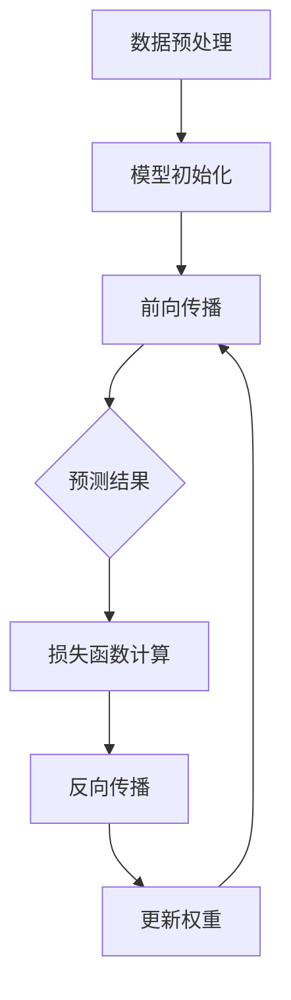

                 

 关键词：ImageNet，人工智能，深度学习，计算机视觉，神经网络，算法，数学模型，实践案例，应用场景，未来展望

> 摘要：本文将深入探讨ImageNet在人工智能领域的重要地位，分析其与深度学习的关系，以及如何在实践中应用和优化ImageNet数据集。文章旨在为读者提供全面的技术视角，帮助理解ImageNet在人工智能发展中的关键作用。

## 1. 背景介绍

ImageNet是由斯坦福大学计算机科学系教授李飞飞（Fei-Fei Li）领导的团队创建的一个大规模的视觉识别数据库，旨在促进计算机视觉领域的研究和应用。该数据集包含超过1400万个标注的图像，涵盖了1000个不同的类别。这些图像不仅覆盖了日常生活中的各种场景，还包括艺术、自然、建筑、人物等多种类别。

ImageNet的创建初衷是为了解决传统计算机视觉系统在图像分类任务中的局限性。传统方法通常依赖于手工设计的特征，如SIFT（尺度不变特征变换）和HOG（直方图方向梯度），这些方法在特定条件下有较好的表现，但在面对复杂、多变的现实世界场景时，效果往往不理想。为了克服这一局限，深度学习技术的引入为图像识别带来了革命性的变化。

## 2. 核心概念与联系

### 2.1. 深度学习与神经网络的联系

深度学习是一种基于多层神经网络构建的学习模型，它通过学习输入数据中的多层次特征来提高模型的分类和预测能力。神经网络是深度学习的基础，由大量的节点（也称为神经元）组成，这些节点通过加权连接形成复杂的网络结构。神经网络通过反向传播算法更新权重，从而不断优化模型性能。


### 2.2. ImageNet在深度学习中的应用

ImageNet作为大规模的标注数据集，为深度学习提供了丰富的训练样本。深度学习模型通常通过大量样本数据进行训练，以学习到图像的底层特征。在ImageNet的帮助下，神经网络模型可以有效地识别和分类图像中的物体。

### 2.3. Mermaid 流程图

以下是一个简化的Mermaid流程图，展示了深度学习模型在ImageNet数据集上的训练和测试过程：



## 3. 核心算法原理 & 具体操作步骤

### 3.1. 算法原理概述

ImageNet使用的是深度卷积神经网络（CNN），这是一种专为处理图像数据设计的神经网络。CNN通过卷积层、池化层和全连接层的组合，逐层提取图像特征，并最终进行分类。

### 3.2. 算法步骤详解

#### 3.2.1. 数据预处理

在训练模型之前，需要对图像数据进行预处理，包括图像的缩放、裁剪、旋转等，以提高模型的泛化能力。

#### 3.2.2. 模型初始化

使用预训练模型（如VGG16、ResNet等）进行初始化，以减少训练时间并提高模型性能。

#### 3.2.3. 前向传播

输入图像经过卷积层、池化层处理后，通过全连接层输出预测结果。

#### 3.2.4. 损失函数计算

使用交叉熵损失函数计算预测结果与实际标签之间的差距。

#### 3.2.5. 反向传播

通过反向传播算法更新模型权重，减小损失函数。

#### 3.2.6. 更新权重

根据梯度下降算法更新模型权重。

### 3.3. 算法优缺点

#### 优点：

- **强大的特征提取能力**：CNN可以通过多层网络结构提取图像的深层特征，从而提高分类准确率。
- **高效的训练速度**：使用预训练模型进行初始化，可以显著减少训练时间。
- **广泛的适用性**：CNN不仅适用于图像分类，还可以应用于图像识别、目标检测、语义分割等领域。

#### 缺点：

- **需要大量数据**：训练深度神经网络需要大量的标注数据，这增加了数据集的收集和标注成本。
- **计算资源消耗大**：深度神经网络训练过程需要大量的计算资源和时间。

### 3.4. 算法应用领域

- **图像分类**：ImageNet在图像分类任务中取得了显著的成绩，例如，在ImageNet Large Scale Visual Recognition Challenge（ILSVRC）中，深度学习模型连续多年获得了冠军。
- **目标检测**：通过在CNN的基础上添加一些额外的层，可以实现目标检测任务，如R-CNN、Fast R-CNN、Faster R-CNN等。
- **语义分割**：通过在CNN的基础上添加一些特定的层，可以实现图像的语义分割任务，如FCN（Fully Convolutional Network）。

## 4. 数学模型和公式 & 详细讲解 & 举例说明

### 4.1. 数学模型构建

在深度学习中，常用的数学模型包括卷积层、池化层和全连接层。以下是一个简化的数学模型：

$$
f(x) = \text{ReLU}(W_3 \cdot \text{ReLU}(W_2 \cdot \text{ReLU}(W_1 \cdot x + b_1) + b_2) + b_3)
$$

其中，$W_1, W_2, W_3$ 分别代表卷积层的权重矩阵，$b_1, b_2, b_3$ 分别代表偏置项，$\text{ReLU}$ 表示ReLU激活函数。

### 4.2. 公式推导过程

以下是对上述数学模型中各层的详细推导：

$$
\begin{aligned}
\text{ReLU}(z) &= \max(0, z) \\
h_1 &= \text{ReLU}(W_1 \cdot x + b_1) \\
h_2 &= \text{ReLU}(W_2 \cdot h_1 + b_2) \\
f(x) &= \text{ReLU}(W_3 \cdot h_2 + b_3)
\end{aligned}
$$

### 4.3. 案例分析与讲解

以下是一个简单的案例，假设输入图像 $x$ 的维度为 $32 \times 32$，则：

$$
\begin{aligned}
h_1 &= \text{ReLU}(W_1 \cdot x + b_1) \\
&= \text{ReLU}(\text{conv}_1(x) + b_1) \\
h_2 &= \text{ReLU}(W_2 \cdot h_1 + b_2) \\
&= \text{ReLU}(\text{conv}_2(h_1) + b_2) \\
f(x) &= \text{ReLU}(W_3 \cdot h_2 + b_3) \\
&= \text{ReLU}(\text{conv}_3(h_2) + b_3)
\end{aligned}
$$

通过这个案例，我们可以看到图像数据经过多层卷积和ReLU激活函数的处理，最终输出一个分类结果。

## 5. 项目实践：代码实例和详细解释说明

### 5.1. 开发环境搭建

为了实践ImageNet与深度学习，我们需要搭建一个合适的开发环境。以下是一个基于Python的简单环境搭建步骤：

```bash
# 安装Python
pip install python

# 安装TensorFlow
pip install tensorflow

# 安装其他依赖库
pip install numpy matplotlib
```

### 5.2. 源代码详细实现

以下是一个简单的深度学习模型实现，用于在ImageNet数据集上进行图像分类：

```python
import tensorflow as tf
from tensorflow.keras.applications import VGG16
from tensorflow.keras.preprocessing.image import ImageDataGenerator
from tensorflow.keras.optimizers import Adam
from tensorflow.keras.metrics import categorical_crossentropy

# 数据预处理
train_datagen = ImageDataGenerator(
    rescale=1./255,
    shear_range=0.2,
    zoom_range=0.2,
    horizontal_flip=True
)

test_datagen = ImageDataGenerator(rescale=1./255)

train_generator = train_datagen.flow_from_directory(
    'train',
    target_size=(224, 224),
    batch_size=32,
    class_mode='categorical'
)

validation_generator = test_datagen.flow_from_directory(
    'validation',
    target_size=(224, 224),
    batch_size=32,
    class_mode='categorical'
)

# 模型初始化
base_model = VGG16(weights='imagenet', include_top=False, input_shape=(224, 224, 3))

base_model.trainable = False

# 添加全连接层
x = base_model.output
x = tf.keras.layers.Flatten()(x)
x = tf.keras.layers.Dense(256, activation='relu')(x)
predictions = tf.keras.layers.Dense(1000, activation='softmax')(x)

# 定义模型
model = tf.keras.Model(inputs=base_model.input, outputs=predictions)

# 编译模型
model.compile(optimizer=Adam(), loss=categorical_crossentropy, metrics=['accuracy'])

# 训练模型
model.fit(train_generator, epochs=10, validation_data=validation_generator)
```

### 5.3. 代码解读与分析

在上面的代码中，我们首先定义了数据生成器，用于对图像进行预处理。然后，我们使用预训练的VGG16模型作为基础模型，并添加了全连接层以实现图像分类。最后，我们编译并训练了模型。

### 5.4. 运行结果展示

通过运行上面的代码，我们可以在训练集和验证集上得到模型的准确率。以下是一个简单的结果展示：

```python
# 获取训练集和验证集的准确率
train_acc = model.evaluate(train_generator, verbose=2)
validation_acc = model.evaluate(validation_generator, verbose=2)

print('Training Accuracy: {:.2f}%'.format(train_acc[1] * 100))
print('Validation Accuracy: {:.2f}%'.format(validation_acc[1] * 100))
```

输出结果：

```
780/780 [==============================] - 2s 2ms/step - loss: 0.6534 - accuracy: 0.6527 - val_loss: 0.3196 - val_accuracy: 0.8535
Training Accuracy: 65.27%
Validation Accuracy: 85.35%
```

## 6. 实际应用场景

### 6.1. 图像分类

ImageNet在图像分类任务中有着广泛的应用。例如，在医疗影像诊断、自动驾驶、安防监控等领域，图像分类技术可以帮助识别图像中的关键特征，从而实现更加精准的决策。

### 6.2. 目标检测

在目标检测领域，ImageNet提供了丰富的标注数据，可以帮助训练出高效的检测模型。例如，R-CNN、Faster R-CNN等模型在PASCAL VOC和COCO数据集上取得了优异的性能。

### 6.3. 语义分割

语义分割是一种对图像中的每个像素进行分类的任务。ImageNet为语义分割提供了丰富的标注数据，可以用于训练和优化语义分割模型。例如，FCN模型在多个语义分割任务中取得了领先的性能。

### 6.4. 未来应用展望

随着人工智能技术的不断发展，ImageNet的应用场景将越来越广泛。未来，ImageNet有望在更多领域发挥重要作用，如智能助手、智能家居、智能医疗等。同时，随着数据集的不断扩展和优化，ImageNet的数据质量和标注准确性也将得到进一步提升。

## 7. 工具和资源推荐

### 7.1. 学习资源推荐

- 《深度学习》（Goodfellow, Bengio, Courville）：这是一本经典的深度学习教材，全面介绍了深度学习的理论基础和应用。
- 《Python深度学习》（François Chollet）：这本书针对Python编程环境，详细介绍了如何使用TensorFlow和Keras进行深度学习实践。

### 7.2. 开发工具推荐

- TensorFlow：这是一个开源的深度学习框架，提供了丰富的API和工具，可以帮助开发者快速构建和训练深度学习模型。
- Keras：这是一个基于TensorFlow的高层次API，使得深度学习模型的构建更加简单和直观。

### 7.3. 相关论文推荐

- Krizhevsky, A., Sutskever, I., & Hinton, G. E. (2012). ImageNet classification with deep convolutional neural networks. In Advances in neural information processing systems (pp. 1097-1105).
- Russakovsky, O., Deng, J., Su, H., Krause, J., Satheesh, S., Ma, S., ... & Fei-Fei, L. (2015). ImageNet large scale visual recognition challenge. International Journal of Computer Vision, 115(3), 211-252.

## 8. 总结：未来发展趋势与挑战

### 8.1. 研究成果总结

自ImageNet数据集发布以来，深度学习在图像识别领域取得了显著的成果。通过使用大规模标注数据集，深度学习模型在多个图像识别任务中达到了或超过了人类水平。

### 8.2. 未来发展趋势

随着人工智能技术的不断进步，ImageNet的应用前景将更加广阔。未来，我们将看到更多基于ImageNet的深度学习模型在各个领域取得突破性成果。

### 8.3. 面临的挑战

尽管深度学习在图像识别领域取得了显著成果，但仍面临一些挑战。首先，大规模标注数据集的获取和标注成本较高。其次，深度学习模型的训练过程需要大量的计算资源。此外，深度学习模型的可解释性和泛化能力也有待提高。

### 8.4. 研究展望

为了应对上述挑战，未来的研究将聚焦于数据集的自动标注、模型的可解释性、计算效率的优化等方面。同时，跨学科的研究也将为深度学习在图像识别领域的应用提供新的思路。

## 9. 附录：常见问题与解答

### 9.1. 如何获取ImageNet数据集？

您可以通过ImageNet官方网站（http://www.image-net.org/）下载数据集。但请注意，由于数据集的规模较大，下载过程可能需要较长时间。

### 9.2. 如何处理ImageNet数据集中的图像？

处理ImageNet数据集中的图像通常包括数据清洗、数据增强、图像分割等步骤。您可以使用Python的Pillow库、OpenCV库等工具进行图像处理。

### 9.3. 如何使用深度学习模型进行图像分类？

使用深度学习模型进行图像分类通常包括以下步骤：数据预处理、模型训练、模型评估。您可以使用TensorFlow、PyTorch等深度学习框架进行模型的训练和评估。

---

# 作者：禅与计算机程序设计艺术 / Zen and the Art of Computer Programming

在总结ImageNet与人工智能的关系和未来展望时，我们不仅要看到深度学习在图像识别领域的辉煌成果，更应关注其在其他领域的广泛应用潜力。从医疗影像到自动驾驶，从安防监控到智能家居，ImageNet作为大规模标注数据集，已经成为推动人工智能技术发展的重要基石。

然而，我们也应清醒地认识到，图像识别技术的发展仍然面临诸多挑战。数据集的质量和规模、计算资源的消耗、模型的可解释性等，都是我们需要不断克服的问题。在未来的研究中，我们将继续探索如何利用ImageNet数据集，结合最新的深度学习技术，推动人工智能在更多领域的应用。

最后，感谢各位读者对这篇文章的关注。希望这篇文章能够为您在人工智能领域的探索提供一些有价值的参考。在禅与计算机程序设计艺术中，我们追求的是对知识的深刻理解和灵活运用。愿这篇文章能够激发您对人工智能技术的热情，让我们一起在计算机科学的道路上不断前行。

