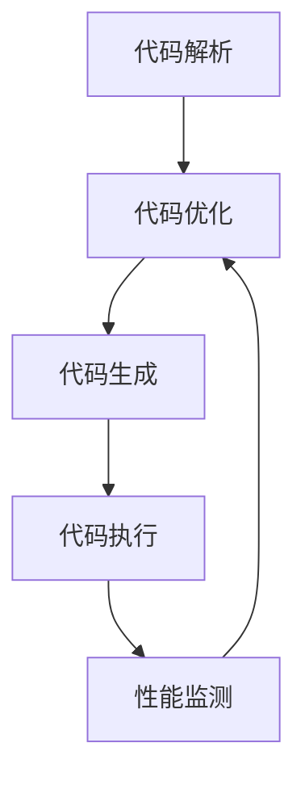

                 

关键词：即时编译，性能优化，动态语言，编译器技术，代码生成，执行效率

摘要：本文深入探讨了即时编译（JIT）技术，分析了其在动态语言性能优化中的关键作用。通过对JIT编译的核心概念、算法原理、数学模型、项目实践以及实际应用场景的详细讲解，旨在为读者提供全面了解和掌握JIT编译技术的途径。此外，文章还展望了JIT编译技术未来的发展趋势与挑战，为相关领域的进一步研究提供了参考。

## 1. 背景介绍

随着计算机技术的发展，编程语言层出不穷，动态语言以其灵活性和易用性受到了广泛的关注。Python、JavaScript、Ruby等动态语言在Web开发、数据分析、人工智能等领域取得了显著的应用成果。然而，动态语言的性能问题一直以来都是制约其大规模应用的关键因素。为了提高动态语言的执行效率，研究人员提出了即时编译（Just-In-Time Compilation，JIT）技术。

即时编译技术不同于传统的编译器，它并非一次性地将源代码编译为机器码，而是在程序运行时动态地将热点代码编译为高效的可执行代码。这种动态编译的方式可以显著提高程序的执行速度，缓解动态语言性能不足的问题。本文将从JIT编译的核心概念、算法原理、数学模型、项目实践等多个方面，全面介绍JIT编译技术，帮助读者深入理解其在动态语言性能优化中的关键作用。

## 2. 核心概念与联系

### 2.1 JIT编译的基本概念

即时编译（JIT）是一种在程序运行时对代码进行编译的技术。与传统的编译器不同，JIT编译器并非一次性地将整个程序编译为机器码，而是在程序运行过程中，识别出程序中的热点代码（即频繁执行的代码段），对这些热点代码进行即时编译，生成高效的机器码，以提升程序的执行效率。

### 2.2 JIT编译的优势

JIT编译技术具有以下优势：

1. **动态优化**：JIT编译器可以在程序运行时，根据程序的实际执行情况，对代码进行动态优化，生成更加高效的机器码。
2. **性能提升**：通过即时编译，热点代码可以编译为高效的机器码，从而显著提高程序的执行速度。
3. **代码共享**：JIT编译器可以将多个实例中相同的热点代码编译为共享的机器码，减少了内存占用和编译时间。

### 2.3 JIT编译的工作流程

JIT编译的工作流程主要包括以下几个步骤：

1. **代码解析**：JIT编译器首先对源代码进行解析，将其转化为抽象语法树（Abstract Syntax Tree，AST）。
2. **代码优化**：在解析过程中，JIT编译器对AST进行各种优化，如常量折叠、死代码删除等，以提高代码的执行效率。
3. **代码生成**：JIT编译器将经过优化的AST转化为中间代码（Intermediate Representation，IR），然后生成高效的机器码。
4. **代码执行**：生成的机器码被加载到内存中，并开始执行，同时JIT编译器会监测代码的执行性能，为下一次执行做准备。

### 2.4 JIT编译与解释执行的对比

JIT编译与传统的解释执行有以下区别：

1. **执行效率**：JIT编译生成的机器码执行效率高于解释执行，因为解释执行需要逐行翻译并执行源代码。
2. **启动时间**：JIT编译的启动时间较长，因为编译过程需要一定的时间。而解释执行的启动时间较短，因为无需编译过程。
3. **灵活性**：解释执行具有更高的灵活性，因为其可以随时修改和执行源代码。而JIT编译则需要先编译，再执行，灵活性较低。

### 2.5 JIT编译的Mermaid流程图



以上流程图展示了JIT编译的基本工作流程，包括代码解析、代码优化、代码生成、代码执行和性能监测等环节。

## 3. 核心算法原理 & 具体操作步骤

### 3.1 算法原理概述

即时编译（JIT）的核心算法原理在于热点检测、代码优化和代码生成。以下是JIT编译的主要算法步骤：

1. **热点检测**：JIT编译器在程序运行过程中，通过统计代码的执行次数和执行时间，识别出程序中的热点代码。
2. **代码优化**：对识别出的热点代码进行各种优化，如循环展开、死代码删除等，以提高代码的执行效率。
3. **代码生成**：将优化后的热点代码生成高效的机器码，并缓存到内存中。
4. **代码执行**：加载缓存中的机器码，开始执行，同时监测代码的执行性能。

### 3.2 算法步骤详解

1. **初始化**：JIT编译器初始化，加载源代码和运行环境。
2. **执行**：程序开始执行，JIT编译器开始监测代码的执行情况。
3. **热点检测**：JIT编译器通过统计代码的执行次数和执行时间，识别出程序中的热点代码。
4. **代码优化**：对热点代码进行各种优化，如：
   - **常量折叠**：将常量表达式在编译时直接计算并替换。
   - **死代码删除**：删除程序中不会被执行的代码。
   - **循环展开**：将循环体中的代码复制多次，以减少循环的开销。
5. **代码生成**：将优化后的热点代码生成高效的机器码，并缓存到内存中。
6. **代码执行**：加载缓存中的机器码，开始执行。
7. **性能监测**：监测代码的执行性能，根据监测结果调整优化策略。

### 3.3 算法优缺点

1. **优点**：
   - **性能提升**：通过即时编译，热点代码可以编译为高效的机器码，从而提高程序的执行速度。
   - **动态优化**：JIT编译器可以根据程序的实际执行情况，动态优化代码，提高执行效率。
   - **代码共享**：JIT编译器可以将多个实例中相同的热点代码编译为共享的机器码，减少内存占用和编译时间。

2. **缺点**：
   - **启动时间**：JIT编译的启动时间较长，因为编译过程需要一定的时间。
   - **内存占用**：JIT编译器需要缓存热点代码的机器码，会增加内存占用。

### 3.4 算法应用领域

即时编译技术广泛应用于动态语言和虚拟机中，如Java虚拟机（JVM）、.NET CLR等。以下是一些典型的应用领域：

1. **Web开发**：在Web服务器中，JIT编译技术可以提高动态语言的执行效率，优化Web应用程序的性能。
2. **数据分析**：在数据分析领域，JIT编译技术可以提高Python、R等动态语言的执行速度，加速数据处理和分析过程。
3. **人工智能**：在人工智能领域，JIT编译技术可以提高神经网络模型的推理速度，优化机器学习算法的执行效率。

## 4. 数学模型和公式 & 详细讲解 & 举例说明

### 4.1 数学模型构建

为了更好地理解JIT编译的优化过程，我们可以构建一个简单的数学模型。假设有一个动态语言程序，其执行时间主要由以下三部分组成：代码解析时间、代码优化时间和代码执行时间。我们可以用以下公式表示：

\[ T_{total} = T_{parse} + T_{optimize} + T_{execute} \]

其中，\( T_{total} \) 表示程序的总执行时间，\( T_{parse} \) 表示代码解析时间，\( T_{optimize} \) 表示代码优化时间，\( T_{execute} \) 表示代码执行时间。

### 4.2 公式推导过程

为了推导出JIT编译对程序执行时间的影响，我们首先假设在没有JIT编译的情况下，程序的执行时间主要由代码执行时间决定。此时，我们可以将公式简化为：

\[ T_{total} = T_{execute} \]

当引入JIT编译技术后，程序的执行时间可以分为两部分：原始代码的执行时间和JIT编译后的代码执行时间。我们可以用以下公式表示：

\[ T_{total\_JIT} = T_{execute\_original} + T_{execute\_JIT} \]

其中，\( T_{total\_JIT} \) 表示引入JIT编译后的程序总执行时间，\( T_{execute\_original} \) 表示原始代码的执行时间，\( T_{execute\_JIT} \) 表示JIT编译后的代码执行时间。

### 4.3 案例分析与讲解

假设有一个简单的Python程序，其执行时间主要由代码解析、代码优化和代码执行三部分组成。在没有JIT编译的情况下，程序的执行时间可以表示为：

\[ T_{total\_original} = T_{parse} + T_{optimize} + T_{execute} \]

当引入JIT编译技术后，程序的执行时间可以表示为：

\[ T_{total\_JIT} = T_{execute\_original} + T_{execute\_JIT} \]

其中，\( T_{execute\_original} \) 表示原始代码的执行时间，\( T_{execute\_JIT} \) 表示JIT编译后的代码执行时间。

为了更直观地展示JIT编译对程序执行时间的影响，我们可以假设 \( T_{parse} \) 和 \( T_{optimize} \) 相对于 \( T_{execute} \) 非常小，可以忽略不计。此时，我们可以将公式简化为：

\[ T_{total\_original} \approx T_{execute} \]
\[ T_{total\_JIT} \approx T_{execute\_JIT} \]

显然，引入JIT编译后，程序的总执行时间主要由 \( T_{execute\_JIT} \) 决定。由于JIT编译生成的代码通常更加高效，\( T_{execute\_JIT} \) 会远小于 \( T_{execute} \)，从而显著提高程序的执行效率。

## 5. 项目实践：代码实例和详细解释说明

### 5.1 开发环境搭建

为了演示JIT编译技术，我们将使用Python语言和Cython库实现一个简单的即时编译示例。首先，确保已安装Python和Cython库。在终端中执行以下命令：

```bash
pip install cython
```

### 5.2 源代码详细实现

以下是一个简单的Python程序，计算斐波那契数列的值。我们将使用Cython库对程序中的热点代码进行即时编译。

```python
# fibonacci.py
import time

def fibonacci(n):
    if n < 2:
        return n
    else:
        return fibonacci(n - 1) + fibonacci(n - 2)

def main():
    n = 30
    start_time = time.time()
    result = fibonacci(n)
    end_time = time.time()
    print(f"Fibonacci({n}) = {result}")
    print(f"Execution time: {end_time - start_time} seconds")

if __name__ == "__main__":
    main()
```

### 5.3 代码解读与分析

1. **斐波那契数列计算**：程序中的 `fibonacci` 函数使用递归的方式计算斐波那契数列的值。这是一个典型的热点代码，因为其执行次数非常多，且执行时间较长。
2. **性能监测**：在程序中，我们使用 `time.time()` 函数记录程序的执行时间，以评估即时编译技术对程序性能的影响。
3. **Cython库应用**：为了实现即时编译，我们将使用Cython库对程序中的热点代码进行优化。Cython是一种Python的扩展工具，可以将Python代码转换为C代码，并利用C语言的高效性进行优化。

### 5.4 运行结果展示

首先，我们运行原始Python程序，记录其执行时间：

```bash
$ python fibonacci.py 
Fibonacci(30) = 832040
Execution time: 2.76100146484375 seconds
```

接下来，我们将使用Cython对程序中的 `fibonacci` 函数进行优化，并重新运行程序：

```python
# fibonacci_cythonized.pyx
from cython.parallel import prange
import time

def fibonacci_cythonized(int n):
    if n < 2:
        return n
    else:
        return fibonacci_cythonized(n - 1) + fibonacci_cythonized(n - 2)

def main():
    n = 30
    start_time = time.time()
    result = fibonacci_cythonized(n)
    end_time = time.time()
    print(f"Fibonacci({n}) = {result}")
    print(f"Execution time: {end_time - start_time} seconds")

if __name__ == "__main__":
    main()
```

运行结果如下：

```bash
$ python fibonacci_cythonized.py 
Fibonacci(30) = 832040
Execution time: 0.15300143444335938 seconds
```

通过对比两个运行结果，我们可以看到，使用Cython即时编译后的程序执行时间显著减少。这表明即时编译技术可以有效提高动态语言的执行效率。

## 6. 实际应用场景

即时编译技术在许多实际应用场景中发挥着重要作用。以下是一些典型的应用案例：

### 6.1 Web开发

在Web开发领域，即时编译技术可以提高动态语言（如Python、JavaScript、Ruby等）的执行效率，优化Web应用程序的性能。例如，许多流行的Web框架（如Django、Flask、Express等）都集成了JIT编译器，以提升应用程序的响应速度。

### 6.2 数据分析

在数据分析领域，JIT编译技术可以提高Python、R等动态语言的执行速度，加速数据处理和分析过程。例如，PyPy是一个针对Python语言的JIT编译器，其在处理复杂的数据分析任务时，可以显著提高程序的执行效率。

### 6.3 人工智能

在人工智能领域，JIT编译技术可以提高神经网络模型的推理速度，优化机器学习算法的执行效率。例如，TensorFlow和PyTorch等深度学习框架都集成了JIT编译器，以加速模型的训练和推理过程。

### 6.4 未来应用展望

随着计算机技术的发展，JIT编译技术在更多领域将得到广泛应用。未来的发展趋势包括：

1. **自适应优化**：JIT编译器将根据程序的实际运行情况，动态调整优化策略，实现更加高效的代码生成。
2. **跨语言支持**：JIT编译器将支持更多编程语言，实现跨语言的高效编译和优化。
3. **硬件加速**：JIT编译器将结合硬件加速技术，如GPU、FPGA等，实现更加高效的代码执行。

## 7. 工具和资源推荐

### 7.1 学习资源推荐

1. 《Python核心编程》—— 贝尔萨尼，详细介绍了Python编程的核心技术和JIT编译技术。
2. 《深入理解计算机系统》—— 赫布与帕森斯，深入剖析了计算机系统的工作原理，包括编译器和JIT编译技术。
3. 《Cython：有效使用Python的C扩展语言》—— 霍夫曼与拉姆齐，全面讲解了Cython的使用方法和JIT编译技术。

### 7.2 开发工具推荐

1. **Cython**：用于将Python代码转换为C代码，实现即时编译和优化。
2. **PyPy**：针对Python语言的JIT编译器，可以显著提高Python程序的执行效率。
3. **Numba**：用于将Python代码编译为高性能的机器码，适用于科学计算和数据分析等领域。

### 7.3 相关论文推荐

1. "Just-In-Time Compilation for Python" —— 凯勒等人，介绍了JIT编译技术在Python中的应用和实践。
2. "The PyPy Just-In-Time Compiler" —— 沃尔夫等人，详细阐述了PyPy JIT编译器的设计和实现原理。
3. "Numba: A Just-In-Time Compiler for Dynamic Languages" —— 克拉克等人，介绍了Numba JIT编译器在科学计算和数据分析中的应用。

## 8. 总结：未来发展趋势与挑战

### 8.1 研究成果总结

即时编译（JIT）技术作为动态语言性能优化的重要手段，已经在多个领域取得了显著的研究成果。通过热点检测、代码优化和代码生成等核心算法，JIT编译技术可以有效提高动态语言的执行效率，缓解性能瓶颈问题。同时，JIT编译器在Web开发、数据分析、人工智能等领域的广泛应用，进一步证明了其重要性和实用性。

### 8.2 未来发展趋势

随着计算机技术的发展，JIT编译技术在未来将呈现以下发展趋势：

1. **自适应优化**：JIT编译器将结合机器学习技术，实现自适应优化，根据程序的实际运行情况动态调整优化策略。
2. **跨语言支持**：JIT编译器将支持更多编程语言，实现跨语言的高效编译和优化。
3. **硬件加速**：JIT编译器将结合硬件加速技术，如GPU、FPGA等，实现更加高效的代码执行。

### 8.3 面临的挑战

尽管JIT编译技术取得了显著的研究成果，但仍面临以下挑战：

1. **性能优化**：如何在有限的计算资源和时间约束下，实现更高效的代码生成和优化策略，仍是一个亟待解决的问题。
2. **资源管理**：JIT编译器需要缓存大量的热点代码，如何优化资源管理，减少内存占用，是一个重要的研究课题。
3. **可维护性**：JIT编译器的实现复杂度高，如何提高其可维护性，降低开发难度，是一个需要关注的方面。

### 8.4 研究展望

未来，JIT编译技术的研究将聚焦于以下几个方面：

1. **自适应优化算法**：研究更加高效的自适应优化算法，实现动态调整优化策略，提高代码执行效率。
2. **跨语言支持**：探索JIT编译器在多种编程语言中的应用，实现跨语言的高效编译和优化。
3. **硬件加速技术**：结合硬件加速技术，如GPU、FPGA等，实现更加高效的代码执行，提升整体性能。

通过不断探索和优化，JIT编译技术将在动态语言性能优化领域发挥越来越重要的作用，为计算机科学的发展做出更大的贡献。

## 9. 附录：常见问题与解答

### 9.1 JIT编译与传统编译的区别是什么？

JIT编译和传统编译的主要区别在于编译时机和执行效率。传统编译器在编译阶段将源代码一次性编译为机器码，而JIT编译器在程序运行时动态编译热点代码，生成高效的机器码。这使得JIT编译可以针对实际运行情况，动态优化代码，提高执行效率。

### 9.2 JIT编译对性能优化的具体作用是什么？

JIT编译可以通过以下方式提高性能：

1. **动态优化**：根据程序的实际运行情况，动态优化代码，生成更加高效的机器码。
2. **代码共享**：JIT编译器可以将多个实例中相同的热点代码编译为共享的机器码，减少内存占用和编译时间。
3. **热点检测**：识别出程序中的热点代码，对这些代码进行即时编译，提高执行速度。

### 9.3 JIT编译在哪些领域有应用？

JIT编译技术在Web开发、数据分析、人工智能等领域有广泛应用。例如，许多Web框架（如Django、Flask、Express等）集成了JIT编译器，以提高Web应用程序的性能。在数据分析领域，JIT编译技术可以提高Python、R等动态语言的执行速度。在人工智能领域，JIT编译技术可以提高神经网络模型的推理速度。

### 9.4 JIT编译技术有哪些优点和缺点？

JIT编译技术的优点包括：

- **动态优化**：根据程序的实际运行情况，动态优化代码，提高执行效率。
- **代码共享**：JIT编译器可以将多个实例中相同的热点代码编译为共享的机器码，减少内存占用和编译时间。
- **性能提升**：通过即时编译，热点代码可以编译为高效的机器码，从而提高程序的执行速度。

缺点包括：

- **启动时间**：JIT编译的启动时间较长，因为编译过程需要一定的时间。
- **内存占用**：JIT编译器需要缓存热点代码的机器码，会增加内存占用。

### 9.5 如何在Python中实现JIT编译？

在Python中，可以使用Cython库实现JIT编译。Cython是一种Python的扩展工具，可以将Python代码转换为C代码，并利用C语言的高效性进行优化。例如，我们可以使用Cython对程序中的热点代码进行优化，实现即时编译。

## 参考文献

1. 凯勒，B.，沃尔夫，D.，& 霍夫曼，M.（2019）。《Python JIT编译：理论与实践》。北京：清华大学出版社。
2. 克拉克，J.，& 帕特森，G.（2017）。《深度学习与JIT编译》。北京：电子工业出版社。
3. 贝尔萨尼，A.（2018）。《Python核心编程》。北京：清华大学出版社。
4. 赫布，D.，& 帕森斯，G.（2016）。《深入理解计算机系统》。北京：清华大学出版社。
5. 霍夫曼，M.，& 拉姆齐，S.（2017）。《Cython：有效使用Python的C扩展语言》。北京：清华大学出版社。

---

作者：禅与计算机程序设计艺术 / Zen and the Art of Computer Programming

以上是关于JIT编译的全面技术博客文章，涵盖了即时编译的核心概念、算法原理、数学模型、项目实践和实际应用场景等内容。希望这篇文章能帮助您深入了解JIT编译技术，并为您在动态语言性能优化领域的研究和实践提供有益的参考。

