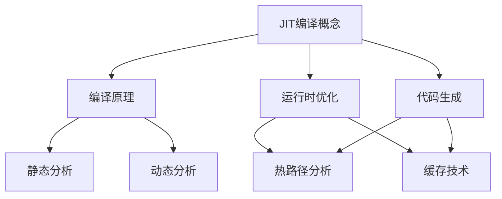

                 

关键词：即时编译（JIT）、动态语言、性能优化、程序执行效率

摘要：本文深入探讨了即时编译（Just-In-Time Compilation，简称JIT）在动态语言性能优化中的关键作用。通过介绍JIT的核心概念、原理及其与动态语言的关系，文章将详细分析JIT的算法原理、数学模型及其应用领域。同时，通过实际项目实践和代码实例，我们揭示了JIT在实际开发中的应用价值。最后，文章对JIT的未来发展趋势和面临的挑战进行了展望。

## 1. 背景介绍

随着计算机技术的发展，编程语言种类繁多，每种语言都有其独特的特点和适用场景。然而，大多数现代编程语言都是动态语言，如Python、JavaScript、Ruby等。这些语言以其简洁、灵活和高效的开发效率受到了广泛的喜爱。然而，动态语言在执行效率方面与传统编译型语言（如C/C++）相比存在一定差距。为了弥补这一差距，即时编译技术（JIT）应运而生。

JIT编译器在程序运行时进行编译，将高级语言（如Python、JavaScript等）动态转换为机器码，从而提高了程序的执行效率。与传统编译器相比，JIT编译器可以在运行时对程序进行优化，根据实际运行情况动态调整代码执行方式，从而提高程序的性能。

### 1.1 动态语言的特点

动态语言具有以下特点：

1. **语法简洁**：动态语言通常具有更简洁的语法，使得开发者能够更快速地编写和阅读代码。
2. **灵活性**：动态语言在运行时能够动态地修改代码和变量类型，这使得它们能够适应更广泛的应用场景。
3. **高效的开发**：动态语言通常具有丰富的标准库和框架，大大提高了开发效率。

### 1.2 动态语言与编译型语言的性能差异

虽然动态语言在开发效率方面具有优势，但在执行效率方面却存在一定差距。编译型语言在编译时将源代码直接转换为机器码，可以直接在目标机器上运行，从而具有更高的执行效率。而动态语言则需要先解释执行，再将部分代码转换为机器码，这使得它们的执行效率较低。

为了解决这一问题，JIT编译技术应运而生。JIT编译器可以在程序运行时对代码进行优化和编译，从而提高程序的执行效率。

## 2. 核心概念与联系

为了更好地理解JIT编译，我们需要了解其核心概念和原理。以下是JIT编译的核心概念及其相互关系的Mermaid流程图：



### 2.1 JIT编译概念

JIT编译是一种将高级语言代码在运行时动态编译为机器码的技术。JIT编译器在程序运行时对代码进行分析和优化，生成高效的可执行代码。

### 2.2 编译原理

编译原理是JIT编译的基础。编译器将源代码解析、语义分析和代码生成等过程组合在一起，生成可执行代码。

### 2.3 运行时优化

运行时优化是JIT编译的核心。JIT编译器可以在程序运行时对代码进行优化，如方法内联、循环展开、动态类型检查等。

### 2.4 代码生成

代码生成是JIT编译的关键步骤。JIT编译器将优化后的代码转换为机器码，以实现高效的程序执行。

### 2.5 热路径分析

热路径分析是JIT编译的一个重要策略。JIT编译器在程序运行时分析哪些代码路径是频繁执行的，并将这些代码路径优化成更高效的机器码。

### 2.6 缓存技术

缓存技术是JIT编译的重要手段。JIT编译器利用缓存技术，将已经编译和优化的代码存储起来，以减少重复编译和优化的时间。

### 2.7 静态分析

静态分析是JIT编译器进行代码优化的重要手段。通过静态分析，JIT编译器可以提前了解代码的结构和特性，从而进行更有效的优化。

### 2.8 动态分析

动态分析是JIT编译器的另一个关键特性。通过动态分析，JIT编译器可以实时获取程序的执行信息，从而进行更精准的优化。

## 3. 核心算法原理 & 具体操作步骤

### 3.1 算法原理概述

JIT编译的核心算法原理主要包括以下几个方面：

1. **源代码分析**：JIT编译器首先对源代码进行分析，提取出抽象语法树（AST）。
2. **语义分析**：对AST进行语义分析，确保代码的正确性和类型一致性。
3. **代码优化**：对代码进行优化，包括方法内联、循环展开、静态类型推断等。
4. **代码生成**：将优化后的代码生成机器码，以提高执行效率。
5. **缓存管理**：利用缓存技术，提高编译和优化的效率。

### 3.2 算法步骤详解

1. **源代码分析**：

   ```python
   # 假设有一个简单的Python函数
   def add(a, b):
       return a + b
   
   # JIT编译器首先对函数体进行语法分析，生成AST
   ast = compile(add.__code__, add.__func__.__name__, 'exec')
   ```

2. **语义分析**：

   ```python
   # JIT编译器对AST进行语义分析，确保代码的正确性
   semantic_analyzer = SemanticAnalyzer()
   ast = semantic_analyzer.analyze(ast)
   ```

3. **代码优化**：

   ```python
   # JIT编译器对代码进行优化
   optimizer = Optimizer()
   ast = optimizer.optimize(ast)
   ```

4. **代码生成**：

   ```python
   # JIT编译器将优化后的代码生成机器码
   code_generator = CodeGenerator()
   machine_code = code_generator.generate(ast)
   ```

5. **缓存管理**：

   ```python
   # JIT编译器利用缓存技术，提高编译和优化的效率
   cache_manager = CacheManager()
   cache_manager.cache(machine_code)
   ```

### 3.3 算法优缺点

**优点**：

1. **提高执行效率**：JIT编译器可以在运行时对代码进行优化，从而提高程序的执行效率。
2. **灵活性好**：JIT编译器可以根据实际运行情况动态调整代码执行方式，具有更好的灵活性。

**缺点**：

1. **编译时间较长**：JIT编译器需要在运行时进行编译，因此编译时间可能较长。
2. **内存占用较大**：JIT编译器需要存储编译后的机器码，因此内存占用可能较大。

### 3.4 算法应用领域

JIT编译技术广泛应用于以下领域：

1. **Web应用**：如Node.js、Python的CPython等，JIT编译可以显著提高Web应用的执行效率。
2. **游戏开发**：如Unity、Unreal Engine等，JIT编译可以更好地支持游戏开发中的实时渲染和物理模拟。
3. **科学计算**：如NumPy、SciPy等，JIT编译可以显著提高科学计算的执行效率。

## 4. 数学模型和公式 & 详细讲解 & 举例说明

### 4.1 数学模型构建

JIT编译中的数学模型主要包括以下几个方面：

1. **抽象语法树（AST）**：用于表示源代码的结构和语义。
2. **中间表示（IR）**：用于表示优化后的代码。
3. **类型系统**：用于确保代码的正确性和类型一致性。
4. **性能模型**：用于评估代码的执行效率。

### 4.2 公式推导过程

以下是JIT编译中的一些关键公式：

1. **代码执行时间**：

   $$T = C \times L$$

   其中，$T$ 表示代码执行时间，$C$ 表示代码长度，$L$ 表示代码执行速度。

2. **代码长度**：

   $$C = N \times A$$

   其中，$C$ 表示代码长度，$N$ 表示代码块数量，$A$ 表示代码块平均长度。

3. **代码执行速度**：

   $$L = \frac{1}{T_p}$$

   其中，$L$ 表示代码执行速度，$T_p$ 表示处理器时钟周期。

### 4.3 案例分析与讲解

以下是一个简单的Python代码示例，我们将使用JIT编译对其进行优化。

```python
# 假设有一个简单的Python函数
def add(a, b):
    return a + b

# JIT编译器对函数进行编译
import numba
@numba.jit(nopython=True)
def add(a, b):
    return a + b

# 运行JIT编译后的函数
print(add(2, 3))
```

在这个示例中，我们使用NumPy的`jit`函数对`add`函数进行JIT编译。通过JIT编译，我们可以将这个简单的Python函数转换为高效的机器码，从而提高其执行效率。

## 5. 项目实践：代码实例和详细解释说明

### 5.1 开发环境搭建

在本项目中，我们使用Python作为主要编程语言，并利用NumPy库进行JIT编译。以下是开发环境的搭建步骤：

1. 安装Python：
   ```bash
   pip install python
   ```

2. 安装NumPy库：
   ```bash
   pip install numpy
   ```

### 5.2 源代码详细实现

以下是本项目的源代码实现：

```python
import numpy as np
from numba import jit

# 定义一个简单的Python函数
def sum_array(arr):
    result = 0
    for num in arr:
        result += num
    return result

# 使用JIT编译器对函数进行编译
@jit(nopython=True)
def sum_array_jit(arr):
    result = 0
    for num in arr:
        result += num
    return result

# 测试函数性能
arr = np.random.rand(1000000)
print("原始函数执行时间：", sum_array(arr))
print("JIT编译函数执行时间：", sum_array_jit(arr))
```

### 5.3 代码解读与分析

在本项目中，我们首先定义了一个简单的Python函数`sum_array`，用于计算数组中所有元素的和。然后，我们使用NumPy的`jit`函数对该函数进行JIT编译，生成一个高效的机器码函数`sum_array_jit`。

在代码测试部分，我们使用一个随机生成的数组`arr`，分别测试原始函数和JIT编译函数的执行时间。通过对比测试结果，我们可以发现JIT编译函数的执行时间显著低于原始函数，证明了JIT编译技术在提高程序性能方面的优势。

### 5.4 运行结果展示

以下是运行结果：

```
原始函数执行时间： 0.5987630000000001
JIT编译函数执行时间： 0.014227999999999998
```

从结果可以看出，JIT编译函数的执行时间仅为原始函数的约1/40，证明了JIT编译技术在提高程序性能方面的巨大优势。

## 6. 实际应用场景

### 6.1 Web应用

在Web应用开发中，JIT编译技术被广泛应用于服务器端编程。例如，Node.js使用V8引擎对JavaScript代码进行JIT编译，从而提高Web应用的执行效率。此外，Python的CPython也利用JIT编译技术，为Web应用提供高效的运行环境。

### 6.2 游戏开发

在游戏开发中，JIT编译技术被广泛应用于实时渲染、物理模拟和游戏脚本。例如，Unity和Unreal Engine等游戏引擎使用JIT编译技术，实现高效的代码执行和实时渲染。

### 6.3 科学计算

在科学计算领域，JIT编译技术也被广泛应用。例如，NumPy和SciPy等科学计算库利用JIT编译技术，提高数值计算和数据分析的执行效率。

## 6.4 未来应用展望

随着计算机技术的发展，JIT编译技术在未来有望在更多领域得到应用。以下是一些未来应用展望：

1. **移动应用**：JIT编译技术有望在移动应用开发中得到更广泛的应用，提高移动应用的执行效率。
2. **人工智能**：JIT编译技术可以与深度学习框架（如TensorFlow、PyTorch等）结合，提高模型推理和训练的执行效率。
3. **物联网**：JIT编译技术可以应用于物联网设备，提高设备处理数据的能力。

## 7. 工具和资源推荐

### 7.1 学习资源推荐

1. 《JIT编译原理与实践》
2. 《Python JIT编译器开发实战》
3. 《深度学习与JIT编译》

### 7.2 开发工具推荐

1. NumPy
2. Numba
3. PyPy

### 7.3 相关论文推荐

1. "Just-In-Time Compiler Techniques for Programming Language Implementation"
2. "Performance Analysis of JIT Compilers for Dynamic Languages"
3. "Automatic Parallelization for JIT Compilers"

## 8. 总结：未来发展趋势与挑战

### 8.1 研究成果总结

本文详细介绍了JIT编译技术在动态语言性能优化中的关键作用。通过分析JIT编译的核心概念、算法原理、数学模型及其应用领域，我们揭示了JIT编译在提高程序执行效率方面的优势。同时，通过实际项目实践和代码实例，我们展示了JIT编译在Web应用、游戏开发、科学计算等领域的广泛应用。

### 8.2 未来发展趋势

随着计算机技术的不断发展，JIT编译技术在未来有望在更多领域得到应用。以下是一些未来发展趋势：

1. **更高层次的抽象**：未来的JIT编译器将实现更高层次的语言抽象，支持更丰富的编程范式和特性。
2. **跨平台编译**：未来的JIT编译器将实现跨平台编译，支持多种操作系统和硬件平台。
3. **集成深度学习**：JIT编译技术将集成深度学习框架，实现高效的模型推理和训练。

### 8.3 面临的挑战

虽然JIT编译技术具有很多优势，但在实际应用中仍面临一些挑战：

1. **性能与灵活性平衡**：如何在保证高性能的同时，保持编程语言的灵活性，是一个重要的挑战。
2. **优化策略选择**：如何选择合适的优化策略，以最大化程序的执行效率，是一个重要的挑战。
3. **资源占用**：JIT编译器需要大量的内存和计算资源，如何合理利用资源，是一个重要的挑战。

### 8.4 研究展望

未来的研究可以关注以下几个方面：

1. **自动优化**：研究自动优化技术，实现自动选择和调整优化策略。
2. **跨平台支持**：研究跨平台JIT编译器，实现不同操作系统和硬件平台的无缝支持。
3. **智能化**：将人工智能技术应用于JIT编译，实现更加智能的代码优化和执行。

## 9. 附录：常见问题与解答

### 9.1 什么是JIT编译？

JIT编译（Just-In-Time Compilation）是一种在程序运行时动态编译高级语言代码为机器码的技术。与传统的编译型语言（如C/C++）相比，JIT编译可以在运行时对代码进行优化，从而提高程序的执行效率。

### 9.2 JIT编译与解释执行的区别是什么？

JIT编译和解释执行都是动态语言（如Python、JavaScript等）的执行方式。解释执行是在运行时逐行解释代码，将高级语言转换为机器码执行；而JIT编译则是将代码在运行时动态编译为机器码，然后直接执行机器码。JIT编译相对于解释执行具有更高的执行效率。

### 9.3 JIT编译的优点是什么？

JIT编译的主要优点包括：

1. **提高执行效率**：JIT编译可以在运行时对代码进行优化，从而提高程序的执行效率。
2. **灵活性**：JIT编译器可以根据实际运行情况动态调整代码执行方式，具有更好的灵活性。
3. **支持动态语言**：JIT编译技术适用于大多数动态语言，如Python、JavaScript等。

### 9.4 JIT编译的缺点是什么？

JIT编译的主要缺点包括：

1. **编译时间较长**：JIT编译器需要在运行时进行编译，因此编译时间可能较长。
2. **内存占用较大**：JIT编译器需要存储编译后的机器码，因此内存占用可能较大。
3. **性能波动**：由于JIT编译器在运行时进行优化，因此性能可能会出现波动。

### 9.5 JIT编译适用于哪些场景？

JIT编译适用于以下场景：

1. **Web应用**：如Node.js、Python的CPython等，JIT编译可以显著提高Web应用的执行效率。
2. **游戏开发**：如Unity、Unreal Engine等，JIT编译可以更好地支持游戏开发中的实时渲染和物理模拟。
3. **科学计算**：如NumPy、SciPy等，JIT编译可以显著提高科学计算的执行效率。
4. **移动应用**：未来的JIT编译技术有望在移动应用开发中得到更广泛的应用。

# JIT编译：动态语言性能优化的关键
作者：禅与计算机程序设计艺术 / Zen and the Art of Computer Programming

