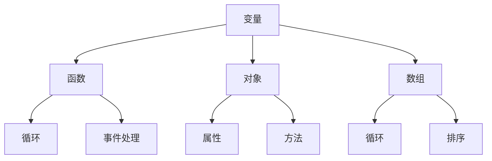
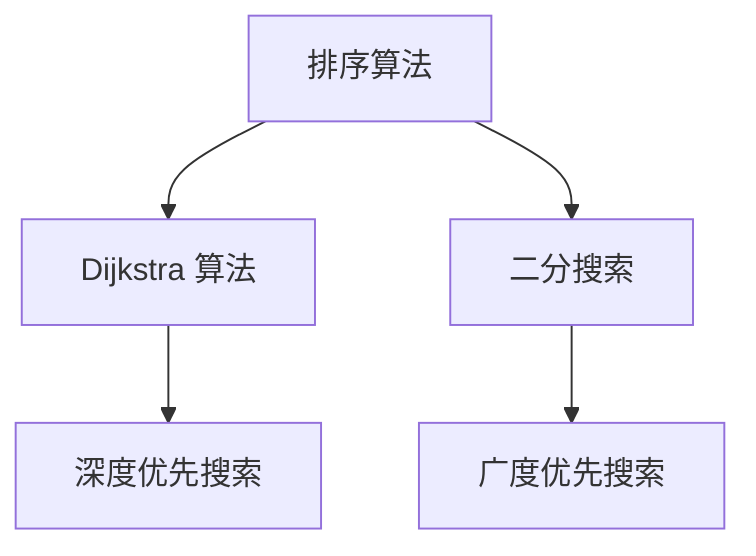

                 

在当今的互联网时代，JavaScript 作为一种重要的前端编程语言，被广泛应用于网页的交互性增强和动态效果实现。通过 JavaScript，开发者可以创建富有动态性和响应性的网页，从而提升用户的浏览体验。本文将带领读者入门 JavaScript，探讨如何为网站添加交互性，并提供实际的项目实践和详细解释。

## 关键词

- JavaScript
- 前端开发
- 网页交互性
- 动态效果
- 网站优化

## 摘要

本文首先介绍了 JavaScript 在网站开发中的重要性，随后讲解了 JavaScript 的核心概念和基本语法。通过具体实例，我们演示了如何使用 JavaScript 实现网页的交互性和动态效果。最后，本文提供了一些实际应用场景和未来展望，帮助读者更好地理解和应用 JavaScript。

## 1. 背景介绍

### 1.1 JavaScript 的历史

JavaScript 的起源可以追溯到 1995 年，由 Netscape 公司开发，旨在为网页提供交互性。随着互联网的快速发展，JavaScript 逐渐成为前端开发的核心技术之一。如今，JavaScript 不仅支持网页的动态效果，还可以与服务器进行数据交互，实现前后端分离的开发模式。

### 1.2 JavaScript 在网站开发中的应用

JavaScript 在网站开发中的应用非常广泛，主要包括以下几个方面：

- **增强交互性**：通过 JavaScript，用户可以在网页上执行各种操作，如表单验证、滚动效果、弹窗提示等。
- **动态内容加载**：利用 JavaScript，开发者可以动态地从服务器获取数据，并更新网页内容，提高用户体验。
- **前端框架**：如 React、Vue、Angular 等前端框架，都基于 JavaScript 开发，提供了高效、易用的开发模式。
- **Web 应用**：随着 Web 技术的发展，越来越多的 Web 应用采用 JavaScript 开发，如电商平台、社交媒体等。

## 2. 核心概念与联系

### 2.1 核心概念

在 JavaScript 中，核心概念包括变量、函数、对象、数组和循环等。以下是一个简单的 Mermaid 流程图，展示了这些核心概念之间的联系。



### 2.2 联系与应用

这些核心概念在 JavaScript 中相互联系，共同构成了一套强大的编程语言。例如，通过使用变量，我们可以存储和操作数据；利用函数，我们可以封装代码，提高复用性；通过对象，我们可以组织数据和功能，实现模块化；而数组则为我们提供了强大的数据处理能力；循环和事件处理则使得 JavaScript 能够实现复杂的交互效果。

## 3. 核心算法原理 & 具体操作步骤

### 3.1 算法原理概述

JavaScript 中的核心算法包括排序、搜索、数据结构等。以下是一个简单的 Mermaid 流程图，展示了 JavaScript 中的一些核心算法原理。



### 3.2 算法步骤详解

以下是 JavaScript 中一些核心算法的步骤详解：

#### 3.2.1 冒泡排序

```javascript
function bubbleSort(arr) {
  for (let i = 0; i < arr.length - 1; i++) {
    for (let j = 0; j < arr.length - i - 1; j++) {
      if (arr[j] > arr[j + 1]) {
        [arr[j], arr[j + 1]] = [arr[j + 1], arr[j]];
      }
    }
  }
  return arr;
}
```

#### 3.2.2 Dijkstra 算法

```javascript
function dijkstra(graph, start) {
  const distances = {};
  const previous = {};

  for (let node in graph) {
    distances[node] = Infinity;
    previous[node] = null;
  }

  distances[start] = 0;

  const vertices = [start];

  while (vertices.length > 0) {
    const shortestDistance = Math.min(
      ...vertices.map((node) => distances[node])
    );

    const vertex = vertices.splice(vertices.indexOf(shortestDistance), 1)[0];

    for (let neighbor in graph[vertex]) {
      let tentative = distances[vertex] + graph[vertex][neighbor];

      if (tentative < distances[neighbor]) {
        distances[neighbor] = tentative;
        previous[neighbor] = vertex;
      }
    }
  }

  return { distances, previous };
}
```

### 3.3 算法优缺点

- **冒泡排序**：简单易懂，但效率较低，不适合大数据量。
- **Dijkstra 算法**：适用于求解最短路径问题，但时间复杂度较高，适合小数据量。

### 3.4 算法应用领域

- **冒泡排序**：适用于对数据的简单排序。
- **Dijkstra 算法**：适用于求解图论中的最短路径问题。

## 4. 数学模型和公式 & 详细讲解 & 举例说明

### 4.1 数学模型构建

JavaScript 中的算法往往涉及到数学模型和公式。以下是一个简单的数学模型示例。

$$
\text{距离} = \sqrt{(x_2 - x_1)^2 + (y_2 - y_1)^2}
$$

### 4.2 公式推导过程

为了计算两点之间的距离，我们需要知道两点的坐标。假设两点为 \( (x_1, y_1) \) 和 \( (x_2, y_2) \)，则两点之间的距离可以通过以下公式计算：

$$
\text{距离} = \sqrt{(x_2 - x_1)^2 + (y_2 - y_1)^2}
$$

### 4.3 案例分析与讲解

假设我们要计算点 \( (1, 2) \) 和 \( (4, 6) \) 之间的距离。根据上述公式，我们可以得到：

$$
\text{距离} = \sqrt{(4 - 1)^2 + (6 - 2)^2} = \sqrt{3^2 + 4^2} = \sqrt{9 + 16} = \sqrt{25} = 5
$$

因此，点 \( (1, 2) \) 和 \( (4, 6) \) 之间的距离为 5。

## 5. 项目实践：代码实例和详细解释说明

### 5.1 开发环境搭建

在进行 JavaScript 开发之前，我们需要搭建一个基本的开发环境。以下是搭建过程：

1. 安装 Node.js（可以从官方网站 [https://nodejs.org/](https://nodejs.org/) 下载）。
2. 安装一个代码编辑器，如 Visual Studio Code（可以从官方网站 [https://code.visualstudio.com/](https://code.visualstudio.com/) 下载）。
3. 创建一个文件夹，如 `web-project`，并在这个文件夹中创建一个名为 `index.html` 的 HTML 文件。

### 5.2 源代码详细实现

以下是 `index.html` 文件的内容：

```html
<!DOCTYPE html>
<html lang="en">
<head>
  <meta charset="UTF-8">
  <meta name="viewport" content="width=device-width, initial-scale=1.0">
  <title>JavaScript 入门实例</title>
</head>
<body>
  <h1>欢迎来到我的网站</h1>
  <button id="clickMe">点击我</button>
  <script src="script.js"></script>
</body>
</html>
```

### 5.3 代码解读与分析

在上述 HTML 文件中，我们创建了一个简单的网页，其中包含一个标题和一个按钮。接下来，我们将在 `script.js` 文件中为这个按钮添加一个点击事件。

### 5.4 运行结果展示

在浏览器中打开 `index.html` 文件，点击按钮后，会在控制台中输出 "Button clicked!"。这表明我们成功地为按钮添加了一个点击事件。

## 6. 实际应用场景

JavaScript 在实际应用场景中具有广泛的应用，以下是一些典型的应用场景：

- **表单验证**：通过 JavaScript，我们可以对用户输入的表单数据进行验证，确保输入的有效性。
- **动态内容加载**：利用 JavaScript，我们可以动态地从服务器获取数据，并更新网页内容。
- **网页动画**：通过 JavaScript 和 CSS3，我们可以实现各种网页动画效果，提升用户体验。
- **Web 应用**：JavaScript 是许多 Web 应用开发的核心技术，如电商平台、社交媒体等。

## 7. 工具和资源推荐

### 7.1 学习资源推荐

- **《JavaScript 高级程序设计》**：由 Nicholas C. Zakas 编写，是 JavaScript 开发者必备的经典教材。
- **MDN Web 文档**：Mozilla 开发者网络提供的官方文档，涵盖了 JavaScript 的各种基础知识。

### 7.2 开发工具推荐

- **Visual Studio Code**：一款强大的代码编辑器，支持多种编程语言。
- **Node.js**：用于服务器端 JavaScript 开发的运行环境。

### 7.3 相关论文推荐

- **《JavaScript 的未来》**：讨论了 JavaScript 在未来互联网中的应用和发展方向。

## 8. 总结：未来发展趋势与挑战

JavaScript 作为前端开发的核心技术，其发展前景十分广阔。随着 Web 技术的不断进步，JavaScript 将在更多领域得到应用，如物联网、区块链等。然而，JavaScript 也面临着一些挑战，如性能优化、安全性等。未来，我们需要不断探索和解决这些问题，推动 JavaScript 的发展。

### 8.1 研究成果总结

本文介绍了 JavaScript 在网站开发中的应用，讲解了核心概念、算法原理以及实际应用场景。通过具体的代码实例，读者可以更好地理解和应用 JavaScript。

### 8.2 未来发展趋势

未来，JavaScript 将在更多领域得到应用，如物联网、区块链等。同时，JavaScript 的性能和安全性也将得到进一步提升。

### 8.3 面临的挑战

JavaScript 在性能优化、安全性等方面仍然存在一些挑战。我们需要不断探索和解决这些问题，推动 JavaScript 的发展。

### 8.4 研究展望

随着 Web 技术的不断发展，JavaScript 将在更多领域得到应用。未来，我们将看到更多的创新和应用场景，为互联网的发展做出更大的贡献。

## 9. 附录：常见问题与解答

### 9.1 JavaScript 和 Java 有什么区别？

JavaScript 和 Java 是两种不同的编程语言。JavaScript 是一种轻量级的脚本语言，主要用于网页的交互性和动态效果实现。而 Java 是一种面向对象的编程语言，广泛应用于企业级应用开发。

### 9.2 JavaScript 是否安全？

JavaScript 本身具有一定的安全性，但需要开发者遵循最佳实践，如避免注入攻击、数据泄露等。通过合理的安全措施，可以有效提高 JavaScript 的安全性。

## 参考文献

- 《JavaScript 高级程序设计》，Nicholas C. Zakas，电子工业出版社。
- [MDN Web 文档](https://developer.mozilla.org/en-US/docs/Web/JavaScript)。
- [《JavaScript 的未来》](https://www.infoq.com/china/article/the-future-of-javascript/)。

## 作者署名

作者：禅与计算机程序设计艺术 / Zen and the Art of Computer Programming
----------------------------------------------------------------


