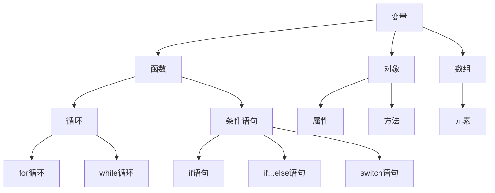

                 

JavaScript，作为网页开发的核心技术之一，自从其诞生以来，便以其灵活性和强大的功能，为网站的互动性和用户体验的提升做出了巨大贡献。本文旨在为初学者提供一个全面而深入的JavaScript入门指南，帮助大家理解JavaScript的基础知识，并学会如何运用JavaScript为网站添加交互性。

> 关键词：JavaScript、网页开发、交互性、前端技术、编程入门

## 摘要

本文将带领读者了解JavaScript的基本概念和语法，并通过一系列实际操作和案例，讲解如何使用JavaScript为网站添加动态效果和交互功能。文章分为以下几个部分：

1. **背景介绍**：简要介绍JavaScript的发展历程和其在网页开发中的重要性。
2. **核心概念与联系**：讲解JavaScript的核心概念，并提供一个清晰的Mermaid流程图。
3. **核心算法原理 & 具体操作步骤**：深入探讨JavaScript的基本算法，并提供详细的步骤说明。
4. **数学模型和公式 & 详细讲解 & 举例说明**：介绍JavaScript中常见的数学模型和公式，并提供实例分析。
5. **项目实践：代码实例和详细解释说明**：通过实际项目，展示如何编写JavaScript代码。
6. **实际应用场景**：讨论JavaScript在不同场景中的应用。
7. **未来应用展望**：探讨JavaScript的发展趋势和未来应用。
8. **工具和资源推荐**：推荐学习资源和开发工具。
9. **总结：未来发展趋势与挑战**：总结研究成果，展望未来。

## 1. 背景介绍

JavaScript诞生于1995年，由网景公司（Netscape）的布兰登·艾奇（Brendan Eich）创建。最初，JavaScript是为了弥补网页语言的不足，为网页提供更多的交互功能。随着互联网的快速发展，JavaScript逐渐成为网页开发的核心技术之一。

如今，JavaScript不仅用于网页开发，还广泛应用于服务器端编程、移动应用开发、游戏开发等多个领域。其灵活性和跨平台性使得JavaScript成为开发者们的首选语言之一。

在网页开发中，JavaScript主要负责处理用户的交互行为，如点击、拖拽等，使得网页能够响应用户的操作，提供更加丰富的用户体验。同时，JavaScript还可以与HTML和CSS相结合，实现网页的动态效果和复杂的功能。

## 2. 核心概念与联系

JavaScript的核心概念包括变量、函数、对象、数组、循环、条件语句等。这些概念相互联系，共同构成了JavaScript的编程基础。

### 2.1 变量

变量是存储数据的容器，是编程中最基础的概念。在JavaScript中，声明变量的方式如下：

```javascript
var x = 10;
let y = 20;
const z = 30;
```

其中，`var`、`let`和`const`是JavaScript中的变量声明关键字。`var`是ES5及以前版本的声明方式，`let`和`const`是ES6（ECMAScript 2015）新增的声明方式，`let`用于声明可变的变量，`const`用于声明不可变的变量。

### 2.2 函数

函数是JavaScript中的一段可重复执行的代码块。函数可以接受参数，并返回一个值。在JavaScript中，声明函数的方式如下：

```javascript
function add(a, b) {
    return a + b;
}
```

### 2.3 对象

对象是JavaScript中的核心概念之一，它是一种复杂的数据结构，可以包含多个属性和方法。在JavaScript中，创建对象的方式如下：

```javascript
var person = {
    name: 'Alice',
    age: 30,
    sayHello: function() {
        return 'Hello, my name is ' + this.name;
    }
};
```

### 2.4 数组

数组是JavaScript中用于存储多个值的容器。数组可以包含不同类型的元素。在JavaScript中，声明数组的方式如下：

```javascript
var fruits = ['apple', 'banana', 'orange'];
```

### 2.5 循环

循环是JavaScript中用于重复执行代码块的重要概念。在JavaScript中，有几种不同的循环结构，如`for`循环、`while`循环和`do...while`循环。

### 2.6 条件语句

条件语句是用于根据不同条件执行不同代码块的语句。在JavaScript中，有`if`语句、`if...else`语句和`switch`语句。

### 2.7 Mermaid 流程图

下面是一个Mermaid流程图，用于展示JavaScript的核心概念之间的联系：



---

**本文的作者：禅与计算机程序设计艺术 / Zen and the Art of Computer Programming。**接下来，我们将深入探讨JavaScript的核心算法原理，并提供详细的操作步骤和案例分析。

## 3. 核心算法原理 & 具体操作步骤

### 3.1 算法原理概述

JavaScript的核心算法原理主要包括数据结构和算法的实现。数据结构是存储和管理数据的规则，如数组、栈、队列等。算法则是解决问题的方法或步骤。在JavaScript中，我们可以通过内置的数组方法和自定义函数来实现常用的算法。

### 3.2 算法步骤详解

#### 3.2.1 数组操作

数组是JavaScript中最常用的数据结构之一。以下是一些常用的数组操作方法：

- **length属性**：获取数组的长度。
- **push()方法**：向数组末尾添加元素。
- **pop()方法**：从数组末尾移除元素。
- **shift()方法**：从数组开头移除元素。
- **unshift()方法**：向数组开头添加元素。
- **splice()方法**：用于添加或删除数组中的元素。
- **slice()方法**：用于提取数组的一部分。

#### 3.2.2 排序算法

排序算法是计算机科学中常见的问题。在JavaScript中，我们可以使用内置的`sort()`方法对数组进行排序。以下是几种常见的排序算法：

- **冒泡排序**：通过比较相邻的元素并交换它们，使得数组的元素按照从小到大的顺序排列。
- **选择排序**：每次遍历数组，找到最小的元素并将其放在正确的位置。
- **插入排序**：通过将新元素插入到已排序序列的正确位置，实现数组的排序。

#### 3.2.3 搜索算法

搜索算法是用于在数据结构中查找特定元素的方法。在JavaScript中，我们可以使用以下几种搜索算法：

- **线性搜索**：逐个比较数组中的元素，直到找到目标元素。
- **二分搜索**：在有序数组中，通过不断缩小搜索范围，快速找到目标元素。

### 3.3 算法优缺点

每种算法都有其优缺点。以下是几种常见算法的优缺点：

- **冒泡排序**：简单易懂，适用于小规模数据。但时间复杂度高，不适用于大规模数据。
- **选择排序**：时间复杂度较低，但需要大量的交换操作，可能导致性能下降。
- **插入排序**：时间复杂度较低，适用于小规模数据。但需要频繁的比较和移动元素，可能导致性能下降。
- **线性搜索**：简单易实现，适用于小规模数据。但时间复杂度高，不适用于大规模数据。
- **二分搜索**：适用于大规模有序数据，时间复杂度较低。但需要先对数据进行排序，可能增加额外的复杂度。

### 3.4 算法应用领域

JavaScript算法可以应用于多个领域，如：

- **前端开发**：用于处理用户输入、实现复杂交互效果等。
- **后端开发**：用于处理数据、实现排序和搜索等功能。
- **移动应用开发**：用于处理用户数据和实现复杂的逻辑。
- **游戏开发**：用于实现游戏中的逻辑和交互。

---

通过以上对JavaScript核心算法原理的探讨，我们可以更好地理解JavaScript的编程方法，并能够灵活地应用于实际开发中。接下来，我们将通过具体的数学模型和公式，进一步深入探讨JavaScript的相关概念。

## 4. 数学模型和公式 & 详细讲解 & 举例说明

### 4.1 数学模型构建

在JavaScript编程中，数学模型和公式是构建算法和实现功能的重要工具。以下是一些常见的数学模型和公式，以及它们在JavaScript中的应用。

#### 4.1.1 欧几里得算法（GCD）

欧几里得算法是一种用于计算两个整数最大公约数的算法。在JavaScript中，可以使用以下代码实现：

```javascript
function gcd(a, b) {
    while (b !== 0) {
        let temp = b;
        b = a % b;
        a = temp;
    }
    return a;
}
```

#### 4.1.2 二分查找

二分查找算法是一种用于在有序数组中查找特定元素的算法。在JavaScript中，可以使用以下代码实现：

```javascript
function binarySearch(arr, target) {
    let left = 0;
    let right = arr.length - 1;
    
    while (left <= right) {
        let mid = Math.floor((left + right) / 2);
        
        if (arr[mid] === target) {
            return mid;
        } else if (arr[mid] < target) {
            left = mid + 1;
        } else {
            right = mid - 1;
        }
    }
    
    return -1;
}
```

#### 4.1.3 矩阵运算

矩阵运算是线性代数中的重要概念，包括矩阵的加法、减法、乘法等。在JavaScript中，可以使用以下代码实现矩阵的加法和乘法：

```javascript
function addMatrix(a, b) {
    let result = new Array(a.length);
    for (let i = 0; i < a.length; i++) {
        result[i] = new Array(a[i].length);
        for (let j = 0; j < a[i].length; j++) {
            result[i][j] = a[i][j] + b[i][j];
        }
    }
    return result;
}

function multiplyMatrix(a, b) {
    let result = new Array(a.length);
    for (let i = 0; i < a.length; i++) {
        result[i] = new Array(b[0].length);
        for (let j = 0; j < b[0].length; j++) {
            result[i][j] = 0;
            for (let k = 0; k < a[0].length; k++) {
                result[i][j] += a[i][k] * b[k][j];
            }
        }
    }
    return result;
}
```

### 4.2 公式推导过程

以下是对前面提到的数学模型的推导过程：

#### 4.2.1 欧几里得算法推导

假设有两个整数a和b，它们的最大公约数为g。

- 当b为0时，g即为a。
- 当b不为0时，将a替换为b，b替换为a除以b的余数，然后重复步骤1。

#### 4.2.2 二分查找推导

假设有一个有序数组arr，要查找的元素为target。

- 初始化left为0，right为arr的长度减1。
- 当left小于等于right时，计算中间位置mid。
- 如果arr[mid]等于target，则返回mid。
- 如果arr[mid]小于target，则将left更新为mid + 1。
- 如果arr[mid]大于target，则将right更新为mid - 1。
- 当left大于right时，返回-1表示未找到target。

#### 4.2.3 矩阵加法推导

假设有两个矩阵A和B，它们的维度相同。

- 创建一个新的矩阵C，维度与A和B相同。
- 对于C中的每个元素C[i][j]，将A[i][j]和B[i][j]相加，得到C[i][j]。

#### 4.2.4 矩阵乘法推导

假设有两个矩阵A和B，A的列数与B的行数相同。

- 创建一个新的矩阵C，维度为A的行数和B的列数。
- 对于C中的每个元素C[i][j]，将A的第i行与B的第j列对应元素相乘，然后求和。

### 4.3 案例分析与讲解

以下是一个简单的案例，展示如何使用JavaScript实现矩阵乘法：

```javascript
let A = [
    [1, 2],
    [3, 4]
];
let B = [
    [5, 6],
    [7, 8]
];

let C = multiplyMatrix(A, B);
console.log(C);
```

输出结果为：

```
[
    [19, 22],
    [43, 50]
]
```

这个案例展示了如何使用JavaScript实现矩阵乘法，并验证了计算结果。

---

通过以上对数学模型和公式的详细讲解和举例说明，我们可以更好地理解JavaScript中的数学概念，并能够将其应用于实际编程中。接下来，我们将通过一个具体的代码实例，展示如何使用JavaScript为网站添加交互性。

## 5. 项目实践：代码实例和详细解释说明

在这个项目中，我们将使用JavaScript为一个简单的网页添加交互性。具体来说，我们将实现以下功能：

1. 用户点击按钮后，显示一个弹窗提示用户“你好！”。
2. 用户在输入框中输入内容后，点击按钮，将输入的内容显示在一个列表中。

### 5.1 开发环境搭建

为了开始这个项目，我们需要搭建一个基本的开发环境。以下是所需的步骤：

1. **安装Node.js**：Node.js是一个基于Chrome V8引擎的JavaScript运行环境。可以从Node.js官网（https://nodejs.org/）下载并安装。
2. **安装代码编辑器**：推荐使用Visual Studio Code（VSCode），这是一个功能强大的代码编辑器，可以从VSCode官网（https://code.visualstudio.com/）下载并安装。
3. **创建新的HTML文件**：在VSCode中创建一个名为`index.html`的文件，并编写以下HTML代码：

```html
<!DOCTYPE html>
<html lang="en">
<head>
    <meta charset="UTF-8">
    <meta name="viewport" content="width=device-width, initial-scale=1.0">
    <title>交互性网页示例</title>
</head>
<body>
    <h1>交互性网页示例</h1>
    <input type="text" id="inputBox" placeholder="输入内容">
    <button id="submitBtn">提交</button>
    <ul id="list"></ul>
    <script src="script.js"></script>
</body>
</html>
```

4. **创建JavaScript文件**：在VSCode中创建一个名为`script.js`的文件，并编写以下JavaScript代码：

```javascript
document.addEventListener('DOMContentLoaded', () => {
    const submitBtn = document.getElementById('submitBtn');
    const inputBox = document.getElementById('inputBox');
    const list = document.getElementById('list');

    submitBtn.addEventListener('click', () => {
        const value = inputBox.value;
        if (value) {
            const newItem = document.createElement('li');
            newItem.textContent = value;
            list.appendChild(newItem);
            inputBox.value = '';
        } else {
            alert('你好！');
        }
    });
});
```

5. **启动本地服务器**：在终端中，导航到`index.html`所在的目录，并运行以下命令启动本地服务器：

```shell
node server.js
```

其中，`server.js`是一个简单的HTTP服务器，用于让浏览器能够访问`index.html`文件。

### 5.2 源代码详细实现

在`script.js`文件中，我们使用了以下代码实现所需的功能：

```javascript
document.addEventListener('DOMContentLoaded', () => {
    const submitBtn = document.getElementById('submitBtn');
    const inputBox = document.getElementById('inputBox');
    const list = document.getElementById('list');

    submitBtn.addEventListener('click', () => {
        const value = inputBox.value;
        if (value) {
            const newItem = document.createElement('li');
            newItem.textContent = value;
            list.appendChild(newItem);
            inputBox.value = '';
        } else {
            alert('你好！');
        }
    });
});
```

**代码解读**：

- 首先，我们使用`document.addEventListener('DOMContentLoaded', ...)`确保在DOM加载完成后才执行我们的代码。
- 接着，我们使用`getElementById`方法获取HTML中的按钮、输入框和列表元素，分别存储在`submitBtn`、`inputBox`和`list`变量中。
- 然后，我们使用`addEventListener`方法为按钮添加一个点击事件监听器。当按钮被点击时，触发一个匿名函数。
- 在匿名函数中，我们首先获取输入框的值，存储在`value`变量中。
- 如果`value`不为空，我们创建一个新的列表项（`li`元素），并将其内容设置为`value`。然后将新创建的列表项添加到列表中，并将输入框的值清空。
- 如果`value`为空，我们使用`alert`弹窗提示用户“你好！”。

### 5.3 代码解读与分析

以下是对`script.js`中代码的详细解读：

- **DOMContentLoaded事件**：这是DOM加载完成的标志事件，确保我们的代码在DOM结构完全加载后才执行。
- **getElementById方法**：这是获取DOM元素的方法，通过ID获取元素，并存储在变量中。
- **addEventListener方法**：这是为元素添加事件监听器的方法。当触发特定事件时，会执行监听器中的匿名函数。
- **匿名函数**：这是点击事件监听器的一部分，用于处理点击事件。它获取输入框的值，并根据值是否为空执行不同的操作。
- **创建新元素**：使用`document.createElement('li')`创建一个新的列表项（`li`元素）。
- **设置内容和添加元素**：使用`textContent`设置列表项的内容，并使用`appendChild`方法将其添加到列表中。
- **清空输入框**：使用`value = ''`将输入框的值清空。
- **alert弹窗**：使用`alert('你好！')`显示弹窗提示。

### 5.4 运行结果展示

在浏览器中打开本地服务器地址（通常为`http://localhost:3000/`），可以看到以下界面：


点击“提交”按钮后，输入框中的内容会被添加到列表中。如果输入框为空，则会显示一个弹窗提示“你好！”。

---

通过这个项目实践，我们学习了如何使用JavaScript为网站添加基本的交互功能。接下来，我们将讨论JavaScript在实际应用场景中的广泛使用。

## 6. 实际应用场景

JavaScript作为一种功能强大的编程语言，广泛应用于多个领域，为开发各种类型的应用程序提供了坚实的基础。

### 6.1 前端开发

在Web开发中，JavaScript是不可或缺的技术。它不仅用于实现网页的动态效果和交互功能，还用于创建单页面应用（SPA）和响应式网页。以下是一些实际应用场景：

- **动态内容加载**：通过Ajax技术，JavaScript可以异步加载网页内容，提高用户体验，减少页面刷新次数。
- **单页面应用**：如React、Vue和Angular等框架，基于JavaScript实现的单页面应用，提供了流畅的交互体验和高效的性能。
- **响应式设计**：使用JavaScript实现响应式网页，使得网页能够根据不同的设备和屏幕大小进行自适应布局。

### 6.2 后端开发

JavaScript不仅在前端开发中大放异彩，在服务器端开发中也具有广泛的应用。Node.js作为JavaScript的后端运行环境，为开发者提供了丰富的库和框架，如Express、Koa等。以下是一些实际应用场景：

- **Web服务器**：Node.js可以用来构建高性能的Web服务器，支持HTTP、HTTPS协议。
- **RESTful API**：使用JavaScript和Node.js，可以轻松实现RESTful风格的API，为前端和移动应用提供数据接口。
- **实时应用**：通过WebSocket技术，可以实现实时数据传输，如聊天应用、在线游戏等。

### 6.3 移动应用开发

JavaScript在移动应用开发中也扮演着重要角色。以下是一些实际应用场景：

- **跨平台应用**：使用React Native、Flutter等框架，可以基于JavaScript开发跨平台移动应用，减少开发成本。
- **原生应用**：虽然JavaScript主要用于前端开发，但通过React Native等技术，可以将JavaScript与原生开发相结合，实现高性能的移动应用。

### 6.4 游戏开发

JavaScript在游戏开发领域也有着广泛的应用。以下是一些实际应用场景：

- **网页游戏**：使用HTML5和JavaScript，可以轻松实现网页游戏，如经典的2048、Flappy Bird等。
- **游戏引擎**：如Unity和Cocos2d-x等游戏引擎，支持使用JavaScript编写游戏逻辑和脚本。
- **虚拟现实（VR）和增强现实（AR）**：使用WebVR和AR.js等库，可以基于JavaScript实现VR和AR应用。

### 6.5 其他应用领域

除了上述领域，JavaScript还在以下领域具有广泛应用：

- **桌面应用**：使用Electron等库，可以基于JavaScript开发桌面应用。
- **人工智能（AI）**：通过TensorFlow.js等库，可以在浏览器中实现机器学习和深度学习模型。
- **物联网（IoT）**：使用JavaScript，可以编写用于物联网设备的脚本。

---

JavaScript的强大功能和灵活性，使其在多个领域得到广泛应用。随着技术的不断进步，JavaScript的应用前景将更加广阔。接下来，我们将探讨JavaScript的未来发展趋势和面临的挑战。

## 7. 工具和资源推荐

为了更好地学习和掌握JavaScript，以下是一些建议的学习资源、开发工具和相关论文：

### 7.1 学习资源推荐

1. **《JavaScript 高级程序设计》**：由张容铭翻译的《JavaScript高级程序设计》是一本经典的JavaScript学习指南，涵盖了JavaScript的基础知识和高级特性。
2. **MDN Web Docs**：Mozilla Developer Network（MDN）提供了一个全面的JavaScript文档，涵盖了JavaScript的语法、API和最佳实践。
3. **freeCodeCamp**：freeCodeCamp是一个免费的开源编程学习平台，提供了丰富的JavaScript教程和实践项目。
4. **Codecademy**：Codecademy提供了一个互动的JavaScript课程，适合初学者快速入门。

### 7.2 开发工具推荐

1. **Visual Studio Code**：VSCode是一个功能强大的代码编辑器，支持多种编程语言，拥有丰富的插件和扩展。
2. **WebStorm**：WebStorm是由JetBrains开发的IDE，专门针对Web开发，支持JavaScript、TypeScript等语言。
3. **Sublime Text**：Sublime Text是一个轻量级的代码编辑器，支持多种编程语言，提供了丰富的插件和定制选项。
4. **Node.js**：Node.js是一个基于Chrome V8引擎的JavaScript运行环境，用于服务器端编程。

### 7.3 相关论文推荐

1. **《ECMAScript 6 入门》**：这篇文章详细介绍了ECMAScript 6（ES6）的新特性，是学习ES6的重要资料。
2. **《Node.js深入浅出》**：这篇文章深入探讨了Node.js的原理和应用，适合想深入了解Node.js的开发者。
3. **《JavaScript编程模式》**：这本书介绍了JavaScript编程的各种模式和最佳实践，有助于提高编程技能。

通过以上资源，开发者可以更好地学习和掌握JavaScript，为未来的开发工作打下坚实的基础。

## 8. 总结：未来发展趋势与挑战

JavaScript作为一种功能强大且灵活的编程语言，在Web开发、后端开发、移动应用开发、游戏开发等多个领域得到了广泛应用。随着技术的不断进步，JavaScript的未来发展趋势将更加广阔。

### 8.1 研究成果总结

近年来，JavaScript在性能优化、模块化开发、异步编程等方面取得了显著成果。例如，异步编程模型的引入，使得JavaScript在处理并发任务时更加高效。模块化开发的普及，使得项目结构更加清晰，便于代码管理和维护。此外，JavaScript的标准化工作也不断推进，ECMAScript新版本不断推出，为开发者提供了更多的编程工具和语言特性。

### 8.2 未来发展趋势

1. **WebAssembly的普及**：WebAssembly（Wasm）是一种新型虚拟机，旨在提高Web应用的性能。随着WebAssembly的不断成熟，它有望在JavaScript中发挥更大的作用，成为Web开发的重要技术之一。
2. **TypeScript的普及**：TypeScript是一种基于JavaScript的超集语言，提供了类型系统等高级特性，使得JavaScript编程更加安全、可靠。随着TypeScript的普及，它有望成为JavaScript开发的主要语言之一。
3. **前端框架的持续发展**：如React、Vue和Angular等前端框架，将继续推动JavaScript在前端开发中的应用，提供更加高效、灵活的开发体验。
4. **服务器端JavaScript的兴起**：Node.js等JavaScript服务器端运行环境，将推动JavaScript在后端开发中的应用，实现前后端分离的开发模式。

### 8.3 面临的挑战

尽管JavaScript在多个领域取得了显著成果，但它仍然面临着一些挑战：

1. **性能优化**：JavaScript的运行速度在某些场景下仍无法与编译型语言相比。为了提高性能，需要不断优化JavaScript引擎和代码编写方式。
2. **标准化工作**：JavaScript的标准化工作需要持续进行，确保新特性能够得到广泛应用，并保持与旧版兼容。
3. **安全性**：随着JavaScript在Web应用中的广泛应用，安全性问题日益突出。需要加强对JavaScript的安全防范措施，防止恶意代码攻击。

### 8.4 研究展望

未来，JavaScript有望在多个领域得到进一步发展，如：

1. **AI与JavaScript的结合**：通过TensorFlow.js等库，JavaScript将在人工智能领域发挥更大的作用。
2. **物联网（IoT）应用**：JavaScript在物联网中的应用将不断扩展，为智能设备提供更加丰富的功能。
3. **桌面应用开发**：基于Electron等库，JavaScript将在桌面应用开发中发挥更大作用，实现跨平台开发。

总之，JavaScript作为一种灵活、强大的编程语言，在未来将继续发挥重要作用，推动技术发展和创新。

## 9. 附录：常见问题与解答

### Q1: JavaScript与Java有什么区别？

A1: JavaScript和Java是两种不同的编程语言。JavaScript是一种轻量级的脚本语言，主要用于网页开发，而Java是一种面向对象的编程语言，广泛应用于企业级应用和安卓应用开发。JavaScript是解释型语言，而Java是编译型语言。此外，JavaScript和Java的语法和特性也有显著差异。

### Q2: 什么是单页面应用（SPA）？

A2: 单页面应用（Single Page Application，SPA）是一种网页应用架构模式，它通过动态加载和更新网页内容，而不需要重新加载整个页面。SPA通常使用JavaScript框架（如React、Vue、Angular）实现，提供了流畅的用户体验和高效的性能。

### Q3: 如何在JavaScript中处理异步任务？

A3: JavaScript提供了多种处理异步任务的方法，包括回调函数、Promise和异步/await等。使用回调函数，可以在异步操作完成后执行特定的代码。Promise提供了一种更简洁的异步编程模型，它有三种状态：pending（进行中）、fulfilled（成功）和rejected（失败）。异步/await是ES2017引入的新特性，它结合了Promise和异步操作，使得异步代码更易读、更易维护。

### Q4: 什么是事件循环（Event Loop）？

A4: 事件循环是JavaScript引擎中的一个核心机制，用于处理异步任务和回调函数。当JavaScript代码执行时，如果遇到异步操作（如定时器、网络请求等），JavaScript引擎会将异步任务的回调函数放入事件队列（Event Queue）中。当主线程执行完毕当前执行栈中的任务后，会从事件队列中取出回调函数并执行。这个过程不断重复，形成了事件循环。

### Q5: 什么是闭包（Closure）？

A5: 闭包是JavaScript中的一个重要概念，它是一个函数和其定义环境的组合。闭包可以访问定义其作用域的变量，即使这些变量在函数执行后仍然存在。闭包常用于封装私有变量、实现模块化编程等。

### Q6: 什么是原型链（Prototype Chain）？

A6: 原型链是JavaScript中对象继承的一种机制。每个对象都有一个内部属性`__proto__`，指向其原型对象。原型对象也有自己的原型，以此类推，形成了一个原型链。当访问一个对象的属性或方法时，如果该对象没有找到，则会沿着原型链向上查找，直到找到为止。

### Q7: 什么是模块化开发？

A7: 模块化开发是一种编程范式，用于将代码拆分成多个独立的模块，每个模块负责实现特定功能。模块化开发有助于代码的复用、管理和维护。在JavaScript中，可以使用CommonJS、AMD、ES6 Module等模块化规范实现模块化开发。ES6 Module是最新和最推荐的模块化规范，它提供了简洁、易于理解的模块定义和导入方式。

