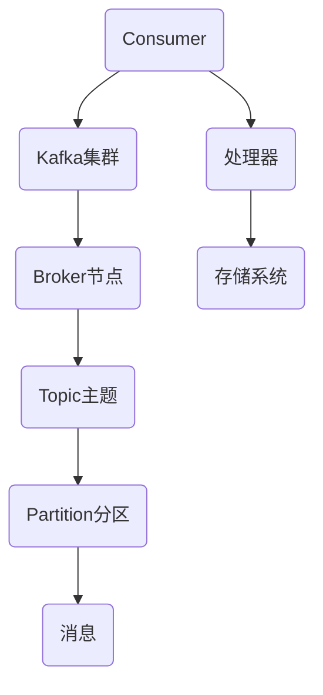

                 

 **关键词：** Kafka, Consumer, 消息队列，分布式系统，数据处理，性能优化，代码实例，Java，Python

**摘要：** 本文章将深入讲解Kafka Consumer的工作原理，包括核心概念、架构设计、算法原理和具体操作步骤。通过实例代码，我们将展示如何使用Kafka Consumer进行消息消费和数据处理，帮助读者全面理解Kafka Consumer在实际分布式系统中的应用和优化策略。

## 1. 背景介绍

Kafka是一个高性能、可扩展、分布式消息队列系统，广泛用于构建实时数据流应用程序。在分布式系统中，消息队列扮演着重要的角色，它可以有效地解耦生产者和消费者，确保系统的高可用性和容错能力。Kafka Consumer是Kafka系统中的关键组件，负责从Kafka集群中消费消息，并进行后续的数据处理。

### 1.1 Kafka的基本概念

Kafka由多个核心组件组成，包括：

- **Producer：** 负责将消息发送到Kafka集群。
- **Broker：** Kafka集群中的代理节点，负责存储和管理消息。
- **Topic：** 消息的分类和标签，类似于数据库中的表。
- **Partition：** Topic的分区，用于实现并行处理和提高系统性能。
- **Offset：** 消息在分区中的唯一标识，用于确定消费进度。

### 1.2 Consumer的作用

Kafka Consumer从Kafka集群中读取消息，并进行后续处理。其主要作用包括：

- **实时数据处理：** Consumer可以实时消费Kafka中的消息，实现实时数据处理和分析。
- **分布式处理：** Consumer可以分布在不同的节点上，实现负载均衡和并行处理。
- **数据持久化：** Consumer消费的消息可以存储在本地或外部系统中，确保数据不会丢失。

## 2. 核心概念与联系

### 2.1 Kafka Consumer架构

以下是一个简化的Kafka Consumer架构图：



### 2.2 核心概念

- **Consumer Group：** 一组共享相同Kafka Topic的多个Consumer实例，实现负载均衡和容错能力。
- **Offset：** 消息在分区中的唯一标识，用于确定消费进度。
- **Consumer Offset Commit：** Consumer将消费进度（Offset）提交到Kafka，确保数据不会丢失。
- **Consumer Rebalance：** Consumer Group中的实例发生变化时，进行成员重新分配的过程。

## 3. 核心算法原理 & 具体操作步骤

### 3.1 算法原理概述

Kafka Consumer的核心算法主要包括以下几个方面：

- **Offset管理：** Consumer使用Offset来跟踪消费进度。
- **消息拉取：** Consumer从Kafka Broker拉取消息。
- **负载均衡：** Consumer Group中的实例实现负载均衡。
- **容错处理：** Consumer在发生错误时，进行自动恢复和重新分配。

### 3.2 算法步骤详解

1. **初始化Consumer：**
   - 创建Consumer实例，设置相关配置，如分组ID、Kafka地址等。
   - 注册到Kafka集群，加入Consumer Group。

2. **拉取消息：**
   - Consumer向Kafka Broker发送拉取请求，获取指定Topic和分区的消息。
   - Broker返回消息数据，Consumer进行消费。

3. **处理消息：**
   - Consumer对消息进行业务处理，如存储、计算等。
   - 将处理结果存储到本地或外部系统。

4. **提交Offset：**
   - Consumer将消费进度（Offset）提交到Kafka，确保数据不会丢失。
   - Kafka Broker记录Offset，用于后续消费。

5. **容错处理：**
   - Consumer在发生错误时，进行自动恢复和重新分配。
   - 重新加入Consumer Group，继续消费消息。

### 3.3 算法优缺点

- **优点：**
  - **高性能：** Kafka Consumer采用拉取模式，减少网络延迟。
  - **可扩展：** Consumer可以分布式部署，实现负载均衡。
  - **高可用：** Consumer在发生错误时，可以进行自动恢复和重新分配。

- **缺点：**
  - **需要手动处理Offset：** Consumer需要手动提交Offset，确保数据不会丢失。
  - **可能存在重复消费：** 在发生错误时，Consumer可能需要重新消费已处理的消息。

### 3.4 算法应用领域

Kafka Consumer广泛应用于以下领域：

- **实时数据处理：** 实时消费Kafka中的消息，进行实时分析和处理。
- **日志收集：** 收集分布式系统中产生的日志，进行集中处理和分析。
- **消息驱动架构：** 使用Kafka Consumer实现消息驱动架构，解耦系统组件。
- **分布式系统监控：** 监控分布式系统的性能指标，进行实时监控和分析。

## 4. 数学模型和公式 & 详细讲解 & 举例说明

### 4.1 数学模型构建

Kafka Consumer的性能指标主要包括：

- **消息拉取速度：** 每秒拉取的消息数量。
- **消费速度：** 每秒消费的消息数量。
- **吞吐量：** 消费速度和消息拉取速度的比值。

### 4.2 公式推导过程

- **消息拉取速度：** 消息拉取速度 = 消息大小 * 拉取频率
- **消费速度：** 消费速度 = 处理能力 * 消费频率
- **吞吐量：** 吞吐量 = 消费速度 / 消息拉取速度

### 4.3 案例分析与讲解

假设Kafka Consumer的配置如下：

- 消息大小：1KB
- 拉取频率：10次/秒
- 处理能力：1000条/秒

则：

- 消息拉取速度 = 1KB * 10次/秒 = 10KB/秒
- 消费速度 = 1000条/秒 * 1KB/条 = 100KB/秒
- 吞吐量 = 100KB/秒 / 10KB/秒 = 10

通过调整配置，可以优化Kafka Consumer的性能。

## 5. 项目实践：代码实例和详细解释说明

### 5.1 开发环境搭建

1. 安装Kafka：参考Kafka官方文档，安装Kafka集群。
2. 创建Topic：使用Kafka命令创建一个Topic，如`test-topic`。
3. 配置Maven：添加Kafka依赖，如`kafka-clients`。

### 5.2 源代码详细实现

以下是一个简单的Kafka Consumer示例：

```java
import org.apache.kafka.clients.consumer.*;
import org.apache.kafka.common.serialization.StringDeserializer;

import java.time.Duration;
import java.util.Collections;
import java.util.Properties;

public class KafkaConsumerExample {
    public static void main(String[] args) {
        Properties props = new Properties();
        props.put(ConsumerConfig.BOOTSTRAP_SERVERS_CONFIG, "localhost:9092");
        props.put(ConsumerConfig.GROUP_ID_CONFIG, "test-group");
        props.put(ConsumerConfig.KEY_DESERIALIZER_CLASS_CONFIG, StringDeserializer.class.getName());
        props.put(ConsumerConfig.VALUE_DESERIALIZER_CLASS_CONFIG, StringDeserializer.class.getName());

        KafkaConsumer<String, String> consumer = new KafkaConsumer<>(props);
        consumer.subscribe(Collections.singletonList("test-topic"));

        while (true) {
            ConsumerRecords<String, String> records = consumer.poll(Duration.ofMillis(100));
            for (ConsumerRecord<String, String> record : records) {
                System.out.printf("Received message: key=%s, value=%s, partition=%d, offset=%d\n",
                        record.key(), record.value(), record.partition(), record.offset());
            }
        }
    }
}
```

### 5.3 代码解读与分析

1. **配置Consumer：** 设置Kafka地址、分组ID和序列化器。
2. **订阅Topic：** 订阅指定的Topic。
3. **拉取消息：** 使用`poll`方法拉取消息。
4. **处理消息：** 打印消息内容。
5. **循环消费：** 使用无限循环持续消费消息。

### 5.4 运行结果展示

运行代码后，Consumer将从`test-topic`中不断拉取消息，并在控制台输出消息内容。

## 6. 实际应用场景

Kafka Consumer广泛应用于以下场景：

- **实时数据处理：** 消费Kafka中的实时消息，进行实时分析和处理。
- **日志收集：** 收集分布式系统产生的日志，进行集中处理和分析。
- **消息驱动架构：** 使用Kafka Consumer实现消息驱动架构，解耦系统组件。
- **分布式系统监控：** 监控分布式系统的性能指标，进行实时监控和分析。

### 6.4 未来应用展望

未来，Kafka Consumer在以下几个方面有望得到进一步发展：

- **性能优化：** 通过改进算法和优化系统架构，提高Kafka Consumer的性能。
- **跨语言支持：** 推广Kafka Consumer在不同编程语言中的应用，提高开发效率。
- **智能化：** 引入人工智能和机器学习技术，实现自动化消费和优化策略。

## 7. 工具和资源推荐

### 7.1 学习资源推荐

- **官方文档：** [Kafka官方文档](https://kafka.apache.org/documentation/)
- **在线课程：** [Kafka实战教程](https://www.udemy.com/course/kafka-for-beginners/)
- **技术博客：** [Kafka技术博客](https://kafka.apache.org/)

### 7.2 开发工具推荐

- **Kafka Manager：** 用于监控和管理Kafka集群。
- **Kafka Studio：** 用于Kafka消息的生产和消费。
- **IntelliJ IDEA：** 用于Kafka Consumer的开发和调试。

### 7.3 相关论文推荐

- **"Kafka: A Distributed Streaming Platform"：** 详细介绍Kafka的设计和实现。
- **"Kafka: Building a Distributed Streaming Platform"：** 探讨Kafka的性能优化和分布式架构。

## 8. 总结：未来发展趋势与挑战

### 8.1 研究成果总结

Kafka Consumer作为一种高效、可扩展的消息消费组件，已广泛应用于实时数据处理、日志收集和分布式系统监控等领域。通过不断优化算法和架构，Kafka Consumer在性能、可靠性等方面取得了显著成果。

### 8.2 未来发展趋势

未来，Kafka Consumer将在以下几个方面得到进一步发展：

- **性能优化：** 通过改进算法和优化系统架构，提高Kafka Consumer的性能。
- **跨语言支持：** 推广Kafka Consumer在不同编程语言中的应用，提高开发效率。
- **智能化：** 引入人工智能和机器学习技术，实现自动化消费和优化策略。

### 8.3 面临的挑战

Kafka Consumer在发展过程中也面临一些挑战：

- **分布式一致性：** 确保分布式Consumer Group的一致性，避免数据丢失和重复消费。
- **负载均衡：** 优化负载均衡算法，提高系统性能和可扩展性。
- **性能瓶颈：** 改进Kafka Consumer的性能，解决网络、存储等方面的性能瓶颈。

### 8.4 研究展望

未来，Kafka Consumer的研究将围绕以下方向展开：

- **分布式一致性：** 探索分布式一致性协议，确保数据的一致性和可靠性。
- **负载均衡：** 研究自适应负载均衡算法，提高系统性能和可扩展性。
- **智能化：** 引入人工智能和机器学习技术，实现自动化消费和优化策略。

## 9. 附录：常见问题与解答

### 9.1 Kafka Consumer启动失败

- 确认Kafka Broker地址是否正确。
- 检查Consumer配置是否正确。
- 查看日志文件，查找错误信息。

### 9.2 Kafka Consumer无法消费消息

- 确认Topic和分区是否存在。
- 检查Consumer订阅的Topic和分区是否正确。
- 查看Consumer的Offset，确定是否已消费到最新消息。

### 9.3 Kafka Consumer重复消费消息

- 检查Consumer的Offset提交机制，确保提交正确。
- 确认Consumer Group中的实例数量是否过多，可能导致负载不均衡。
- 调整Consumer的拉取频率和消费速度，避免处理不过来。

---

以上，就是Kafka Consumer的原理与代码实例讲解。通过本文的详细讲解，相信读者已经对Kafka Consumer有了全面的理解，并能将其应用于实际分布式系统中。在后续的学习和实践中，不断优化Kafka Consumer的性能和可靠性，为分布式系统的建设贡献力量。

### 9. 附录：常见问题与解答

#### 9.1 Kafka Consumer启动失败

**问题现象**：Kafka Consumer启动时出现异常，无法正常运行。

**可能原因**：
1. Kafka集群未启动或无法连接。
2. Kafka配置不正确，如Kafka地址、分组ID等。
3. Kafka客户端库版本与Kafka集群版本不兼容。

**解决方法**：
1. 确认Kafka集群是否已启动，并且Consumer可以成功连接到Kafka集群。
2. 检查Consumer的配置文件，确保Kafka地址、分组ID、序列化器设置正确。
3. 如果使用的是Kafka客户端库，请确保客户端库版本与Kafka集群版本兼容。

#### 9.2 Kafka Consumer无法消费消息

**问题现象**：Kafka Consumer无法从Kafka集群中拉取消息或消费进度停滞。

**可能原因**：
1. Topic或分区不存在。
2. Consumer订阅的Topic或分区不正确。
3. Kafka集群配置错误，如分区数、副本数等。
4. Kafka Consumer负载过大，处理不过来。

**解决方法**：
1. 确认Kafka集群中是否存在要消费的Topic和分区。
2. 检查Consumer的订阅配置，确保订阅的Topic和分区正确。
3. 如果是Kafka集群配置问题，检查分区数、副本数等配置，确保合理。
4. 调整Consumer的拉取频率和消费速度，确保能够及时处理拉取到的消息。

#### 9.3 Kafka Consumer重复消费消息

**问题现象**：Kafka Consumer在处理消息时出现重复消费的现象。

**可能原因**：
1. Kafka Consumer的Offset提交不正确。
2. Kafka集群出现故障，导致Consumer无法正确提交Offset。
3. Consumer Group内存在多个实例，导致实例间消费进度不一致。

**解决方法**：
1. 检查Kafka Consumer的Offset提交逻辑，确保正确提交消费进度。
2. 如果Kafka集群出现故障，等待集群恢复后重新启动Consumer。
3. 调整Consumer Group的配置，确保实例数和消费进度一致。如果需要，可以关闭多余的Consumer实例。

---

通过以上常见问题的解答，希望能够帮助读者在使用Kafka Consumer过程中遇到问题时快速定位和解决问题。在实际应用中，合理配置和优化Kafka Consumer，可以确保其稳定、高效地运行。在后续的学习和实践中，不断积累经验，提高对Kafka Consumer的掌握程度，为分布式系统建设提供有力支持。

