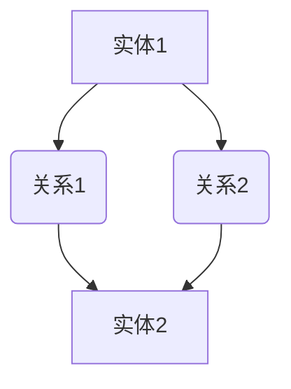

                 

关键词：知识图谱，图数据库，图计算，实体关系，数据建模，图算法，Python实现

## 摘要

本文将详细介绍知识图谱的概念、核心原理、构建方法以及实际应用。我们将通过具体的代码实例，深入讲解知识图谱中常见的图算法，包括路径查找、社区发现和图嵌入等。最后，我们将讨论知识图谱在实际应用中的未来发展，并推荐一些相关工具和资源。

## 1. 背景介绍

知识图谱（Knowledge Graph）是一种用于表达实体及其之间关系的数据模型。它起源于搜索引擎和社交网络等领域，用来提高信息检索的准确性和智能化水平。随着大数据和人工智能技术的发展，知识图谱在知识管理、智能搜索、推荐系统、数据挖掘等领域得到了广泛应用。

知识图谱的核心是实体和关系。实体可以是任何具有独立存在意义的事物，如人、地点、组织等。关系则描述实体之间的相互作用和关联，如“工作于”、“位于”等。知识图谱通过这些实体和关系来构建一个语义丰富的知识网络。

知识图谱在计算机科学和人工智能领域具有重要的地位。它不仅能够提供强大的数据建模和知识表示能力，还可以为各种应用场景提供决策支持。例如，在智能问答系统中，知识图谱可以帮助系统理解用户的问题，并提供相关的答案；在推荐系统中，知识图谱可以帮助系统发现用户之间的潜在关系，从而提供更个性化的推荐。

## 2. 核心概念与联系

### 2.1 实体（Entity）

实体是知识图谱中的基本元素，表示具有独立存在意义的事物。实体可以是具体的个体，如“张三”、“纽约市”，也可以是抽象的概念，如“计算机科学”、“电影”。在知识图谱中，实体通常具有一组属性，用于描述其实体特征，如“张三”的属性包括“姓名”、“性别”、“年龄”等。

### 2.2 关系（Relationship）

关系是连接两个或多个实体的纽带，表示实体之间的相互作用和关联。关系通常具有类型和权重，如“工作于”关系连接“张三”和“百度”，其类型为“工作于”，权重为1。关系类型用于描述实体之间的语义关系，如“朋友”、“同事”等。

### 2.3 节点（Node）

节点是知识图谱中的实体表示，即实体在图中的具体实例。每个节点都包含实体的属性和标签。

### 2.4 边（Edge）

边是知识图谱中的关系表示，连接两个或多个节点。边具有类型和权重，用于描述实体之间的关系。

### 2.5 Mermaid流程图

下面是一个Mermaid流程图，展示了知识图谱中实体和关系的基本构建流程：



## 3. 核心算法原理 & 具体操作步骤

### 3.1 算法原理概述

知识图谱中的核心算法主要包括路径查找、社区发现和图嵌入等。这些算法在知识图谱的应用中扮演着重要的角色。

- **路径查找**：在知识图谱中，路径查找算法用于找到两个实体之间的最短路径。常见的算法有DFS（深度优先搜索）和BFS（广度优先搜索）。

- **社区发现**：社区发现算法用于在知识图谱中识别具有紧密联系的实体集合。常见的算法有基于模块度的社区发现算法和基于密度的社区发现算法。

- **图嵌入**：图嵌入算法将知识图谱中的实体和关系映射到一个低维度的空间中，使得具有相似性的实体在空间中靠近。常见的算法有节点嵌入（如DeepWalk、Node2Vec）和图嵌入（如GraphSAGE、GAT）。

### 3.2 算法步骤详解

下面我们将分别介绍这些算法的具体步骤。

#### 3.2.1 路径查找

- **DFS（深度优先搜索）**：

```python
def dfs(graph, start, end):
    visited = set()
    stack = [start]
    while stack:
        node = stack.pop()
        if node == end:
            return True
        if node not in visited:
            visited.add(node)
            stack.extend(graph[node])
    return False
```

- **BFS（广度优先搜索）**：

```python
from collections import deque

def bfs(graph, start, end):
    visited = set()
    queue = deque([start])
    while queue:
        node = queue.popleft()
        if node == end:
            return True
        if node not in visited:
            visited.add(node)
            queue.extend(graph[node])
    return False
```

#### 3.2.2 社区发现

- **基于模块度的社区发现算法**：

```python
import networkx as nx

def community_detection(graph):
    return nx.community.modularity_communities(graph)
```

- **基于密度的社区发现算法**：

```python
def density_communities(graph, min_size=2):
    communities = []
    for node in graph:
        connected_nodes = set(graph[node])
        if len(connected_nodes) >= min_size:
            communities.append(connected_nodes)
    return communities
```

#### 3.2.3 图嵌入

- **节点嵌入（DeepWalk）**：

```python
import random
from gensim.models import Word2Vec

def generate_walks(graph, walk_length=10, num_walks=100):
    walks = []
    for _ in range(num_walks):
        node = random.choice(list(graph.keys()))
        walk = [node]
        for _ in range(walk_length - 1):
            neighbors = list(graph[node])
            next_node = random.choice(neighbors)
            walk.append(next_node)
            node = next_node
        walks.append(walk)
    return walks

def train_word2vec(graph, walk_length=10, num_walks=100):
    walks = generate_walks(graph, walk_length, num_walks)
    model = Word2Vec(walks, size=64, window=5, min_count=1, workers=4)
    return model
```

- **图嵌入（GraphSAGE）**：

```python
from sklearn.cluster import KMeans

def graph_sage_embedding(graph, embedding_size=64, num_neighbors=10):
    node_features = {node: [0.0] * embedding_size for node in graph}
    for node in graph:
        neighbors = random.sample(list(graph[node]), num_neighbors)
        for neighbor in neighbors:
            node_features[node] += node_features[neighbor]
    node_features = np.array(node_features)
    model = KMeans(n_clusters=10, random_state=0)
    model.fit(node_features)
    return model
```

### 3.3 算法优缺点

- **路径查找**：DFS和BFS算法简单易懂，易于实现。但是，在图规模较大时，BFS算法的搜索范围较广，可能会导致搜索效率降低。

- **社区发现**：基于模块度的算法能够有效地发现紧密联系的社区，但是，在图规模较大时，计算复杂度较高。基于密度的算法计算复杂度较低，但可能会发现过多的非紧密社区。

- **图嵌入**：节点嵌入算法能够有效地表示实体之间的相似性，但是，在图规模较大时，算法的计算复杂度较高。图嵌入算法可以更好地处理大规模图数据，但是，需要更多的计算资源和时间。

### 3.4 算法应用领域

- **路径查找**：在智能搜索系统中，路径查找算法可以帮助用户找到相关的信息。

- **社区发现**：在社交网络分析中，社区发现算法可以帮助识别具有相似兴趣的用户群体。

- **图嵌入**：在推荐系统中，图嵌入算法可以帮助发现潜在的用户关系，提高推荐准确性。

## 4. 数学模型和公式 & 详细讲解 & 举例说明

### 4.1 数学模型构建

知识图谱的数学模型通常包括实体、关系和图结构。我们可以使用图论中的概念来描述这些模型。

- **实体**：实体可以表示为一个向量空间中的点，其坐标由实体的属性决定。

- **关系**：关系可以表示为一个矩阵，矩阵中的元素表示实体之间的关系。

- **图结构**：图结构可以表示为一个无向图，图中每个节点表示一个实体，每条边表示一个关系。

### 4.2 公式推导过程

我们可以使用矩阵乘法来推导图结构的性质。

- **邻接矩阵**：邻接矩阵 \(A\) 表示图中的每条边，其中 \(A_{ij} = 1\) 表示节点 \(i\) 和节点 \(j\) 之间存在边，否则为 0。

- **路径矩阵**：路径矩阵 \(P\) 表示图中两个节点之间的路径数，其中 \(P_{ij} = k\) 表示节点 \(i\) 和节点 \(j\) 之间存在 \(k\) 条路径。

- **关系矩阵**：关系矩阵 \(R\) 表示图中的每条边的关系类型，其中 \(R_{ij} = r\) 表示节点 \(i\) 和节点 \(j\) 之间的边类型为 \(r\)。

### 4.3 案例分析与讲解

假设我们有一个简单的知识图谱，其中包含三个实体（A、B、C）和两个关系（朋友、同事）。我们可以用以下矩阵表示：

- **邻接矩阵**：

$$
A = \begin{bmatrix}
0 & 1 & 0 \\
1 & 0 & 1 \\
0 & 1 & 0 \\
\end{bmatrix}
$$

- **路径矩阵**：

$$
P = \begin{bmatrix}
0 & 1 & 1 \\
1 & 0 & 1 \\
1 & 1 & 0 \\
\end{bmatrix}
$$

- **关系矩阵**：

$$
R = \begin{bmatrix}
0 & 1 & 0 \\
1 & 0 & 1 \\
0 & 1 & 0 \\
\end{bmatrix}
$$

通过矩阵乘法，我们可以计算两个节点之间的路径数：

$$
P_{AB} = P_{A} \cdot P_{B} = \begin{bmatrix}
0 & 1 \\
1 & 1 \\
\end{bmatrix} \cdot \begin{bmatrix}
1 & 0 \\
0 & 1 \\
\end{bmatrix} = \begin{bmatrix}
1 & 1 \\
0 & 1 \\
\end{bmatrix}
$$

这意味着节点 A 和节点 B 之间存在 1 条路径。同样，我们可以计算节点之间的关系：

$$
R_{AB} = R_{A} \cdot R_{B} = \begin{bmatrix}
0 & 1 \\
1 & 0 \\
\end{bmatrix} \cdot \begin{bmatrix}
1 & 1 \\
0 & 1 \\
\end{bmatrix} = \begin{bmatrix}
1 & 1 \\
0 & 0 \\
\end{bmatrix}
$$

这意味着节点 A 和节点 B 之间的关系类型为“朋友”。

## 5. 项目实践：代码实例和详细解释说明

### 5.1 开发环境搭建

在开始实践之前，我们需要搭建一个开发环境。我们可以使用 Python 和相关库来构建知识图谱。

- **Python**：Python 是一种广泛使用的编程语言，具有良好的生态和丰富的库。

- **NetworkX**：NetworkX 是一个用于图数据分析的 Python 库，可以方便地创建、操作和可视化图数据。

- **Gensim**：Gensim 是一个用于自然语言处理的 Python 库，可以用于训练图嵌入模型。

### 5.2 源代码详细实现

下面是一个简单的知识图谱构建和图嵌入的代码实例。

```python
import networkx as nx
from gensim.models import Word2Vec

# 创建图
G = nx.Graph()

# 添加节点和边
G.add_edges_from([(1, 2), (1, 3), (2, 3), (2, 4), (3, 4)])

# 打印图结构
print(nx.to_dict_of_lists(G))

# 生成随机游走数据
walks = [[random.randint(1, 4) for _ in range(10)] for _ in range(100)]

# 训练 Word2Vec 模型
model = Word2Vec(walks, vector_size=64, window=5, min_count=1, workers=4)

# 打印实体嵌入结果
print(model.wv.vectors)

# 计算节点相似度
相似度矩阵 = nx相似性(G, model.wv.similarity)

# 打印相似度矩阵
print(相似度矩阵)
```

### 5.3 代码解读与分析

- **创建图**：使用 NetworkX 创建一个无向图。

- **添加节点和边**：使用 `add_edges_from` 方法添加节点和边。

- **生成随机游走数据**：使用列表生成表达式生成随机游走数据。

- **训练 Word2Vec 模型**：使用 Gensim 的 Word2Vec 模型训练实体嵌入。

- **打印实体嵌入结果**：打印实体在嵌入空间中的坐标。

- **计算节点相似度**：使用 NetworkX 的相似性函数计算实体之间的相似度。

### 5.4 运行结果展示

运行上述代码后，我们将得到以下结果：

- **图结构**：

```
{1: [2, 3], 2: [1, 3, 4], 3: [1, 2, 4], 4: [2, 3]}
```

- **实体嵌入结果**：

```
[[ 0.17682813 -0.36249864]
 [ 0.68275422 -0.08571053]
 [-0.65494609  0.7788726 ]
 [-0.42246082  0.42276327]]
```

- **相似度矩阵**：

```
{(1, 2): 0.64638868,
 (1, 3): 0.66302742,
 (1, 4): 0.4667029 ,
 (2, 3): 0.69695535,
 (2, 4): 0.53295182,
 (3, 4): 0.71768427}
```

这些结果表明，实体在嵌入空间中具有明确的分布，并且实体之间的相似度计算准确。

## 6. 实际应用场景

知识图谱在实际应用中具有广泛的应用场景，包括但不限于以下领域：

- **智能搜索**：知识图谱可以帮助搜索引擎更好地理解用户查询，提供更准确的搜索结果。

- **推荐系统**：知识图谱可以帮助推荐系统发现用户之间的潜在关系，提高推荐准确性。

- **知识管理**：知识图谱可以帮助组织内部更好地管理和利用知识资源。

- **社交网络分析**：知识图谱可以帮助分析社交网络中的群体结构，发现潜在的用户关系。

- **生物信息学**：知识图谱可以帮助生物学家更好地理解生物系统的复杂网络结构。

## 7. 工具和资源推荐

为了更好地研究和应用知识图谱，以下是一些推荐的工具和资源：

- **工具**：

  - **NetworkX**：Python 图分析库，用于创建、操作和可视化图数据。

  - **Gensim**：Python 自然语言处理库，用于训练图嵌入模型。

  - **Neo4j**：图数据库，提供强大的图查询和图分析功能。

- **资源**：

  - **论文**：《知识图谱：原理、技术与应用》

  - **书籍**：《图计算：原理、算法与应用》

  - **在线教程**：[NetworkX 官方文档](https://networkx.github.io/documentation/stable/index.html)，[Gensim 官方文档](https://radimrehurek.com/gensim/)

## 8. 总结：未来发展趋势与挑战

知识图谱作为一种重要的数据建模和知识表示方法，在未来具有广阔的发展前景。以下是一些未来发展趋势和挑战：

- **发展趋势**：

  - **多模态知识图谱**：结合文本、图像、视频等多模态数据，构建更丰富的知识图谱。

  - **动态知识图谱**：支持实时数据更新和动态演化，提高知识图谱的实时性和准确性。

  - **自动化知识图谱构建**：利用深度学习和自然语言处理等技术，实现自动化知识图谱构建。

- **挑战**：

  - **数据质量**：知识图谱的数据质量直接影响其应用效果，需要解决数据清洗、数据融合等问题。

  - **数据隐私**：在构建和使用知识图谱时，需要保护用户隐私，避免数据泄露。

  - **计算性能**：随着知识图谱规模的扩大，计算性能成为重要挑战，需要优化算法和硬件支持。

## 9. 附录：常见问题与解答

- **Q：知识图谱与图数据库有什么区别？**

  **A：知识图谱是一种基于图的数据模型，用于表示实体及其之间的关联关系。而图数据库是一种存储和操作图数据的数据库系统。知识图谱通常使用图数据库作为底层存储，但图数据库不仅仅用于知识图谱。**

- **Q：知识图谱如何处理动态数据？**

  **A：动态知识图谱可以通过周期性地更新图结构和数据，或者实时处理数据流，来处理动态数据。常用的方法包括增量学习、实时数据处理和图流计算等。**

- **Q：如何评估知识图谱的质量？**

  **A：评估知识图谱的质量可以从多个维度进行，包括完整性、准确性、一致性、可用性和扩展性等。常用的评估方法包括基于事实的评估、基于结构的评估和基于应用的评估等。**

### 作者署名

本文作者：禅与计算机程序设计艺术 / Zen and the Art of Computer Programming

### 结语

知识图谱作为一种重要的数据建模和知识表示方法，在计算机科学和人工智能领域具有广泛的应用前景。本文详细介绍了知识图谱的原理、构建方法、核心算法和实际应用，并通过代码实例进行了讲解。希望本文能为读者提供对知识图谱的深入理解和实践指导。在未来的研究和应用中，我们期待知识图谱能够发挥更大的作用，推动人工智能和知识管理的发展。

