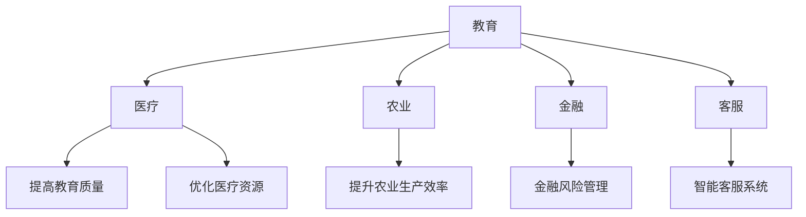

                 

关键词：大型语言模型（LLM），发展中国家，技术跃迁，数字化普及，AI 教育，基础设施，社会经济效益。

> 摘要：本文探讨了大型语言模型（LLM）在发展中国家中的应用，分析了LLM如何通过教育、医疗、农业等领域的应用，促进技术跃迁，提高社会经济效益。本文还讨论了当前面临的挑战，并展望了未来的发展趋势。

## 1. 背景介绍

在过去的几十年里，全球信息技术（IT）发展迅速，尤其是人工智能（AI）技术的崛起，对人类社会产生了深远影响。然而，发展中国家的信息技术发展相对滞后，面临着基础设施薄弱、教育水平低、人才匮乏等问题。这些问题的存在，使得发展中国家在技术跃迁过程中面临巨大挑战。

近年来，随着深度学习和神经网络技术的进步，大型语言模型（LLM）取得了显著的突破。LLM是一种基于神经网络的语言处理模型，具有强大的语言理解和生成能力。LLM的出现，为发展中国家带来了新的机遇，可以通过应用LLM技术，促进技术跃迁，提高社会经济效益。

## 2. 核心概念与联系

### 2.1 大型语言模型（LLM）的概念

大型语言模型（LLM）是基于深度学习技术的语言处理模型，通过学习大量的文本数据，可以理解并生成自然语言。LLM的核心是神经网络架构，包括编码器和解码器。编码器将输入文本编码为向量表示，解码器则根据编码器生成的向量表示生成输出文本。

### 2.2 LLM与语言处理的关系

语言处理是人工智能的一个重要领域，包括自然语言理解、生成、翻译等任务。LLM的出现，极大地提升了语言处理的效率和准确性，使得机器可以更加自然地与人类进行交流。

### 2.3 LLM的应用领域

LLM的应用领域广泛，包括但不限于教育、医疗、农业、金融、客服等。在发展中国家，LLM可以应用于提高教育质量、优化医疗资源、提升农业生产效率等，从而促进技术跃迁。

### 2.4 Mermaid 流程图

下面是LLM在各个领域应用的Mermaid流程图：



## 3. 核心算法原理 & 具体操作步骤

### 3.1 算法原理概述

LLM的核心算法是基于深度学习的神经网络模型，主要包括编码器和解码器。编码器将输入文本编码为向量表示，解码器则根据编码器生成的向量表示生成输出文本。具体来说，编码器将输入文本转换为词嵌入向量，然后通过多层神经网络对词嵌入向量进行编码，得到编码器的输出。解码器则根据编码器的输出，通过多层神经网络生成输出文本。

### 3.2 算法步骤详解

1. **数据预处理**：首先，对输入文本进行预处理，包括分词、去除停用词、词干提取等操作。然后，将预处理后的文本编码为词嵌入向量。

2. **编码器训练**：使用预处理的词嵌入向量，通过多层神经网络对词嵌入向量进行编码，得到编码器的输出。

3. **解码器训练**：根据编码器的输出，通过多层神经网络生成输出文本。

4. **模型评估**：使用评估指标（如交叉熵损失函数）评估模型性能，然后通过反向传播算法更新模型参数。

5. **模型部署**：将训练好的模型部署到实际应用场景中，如教育、医疗、农业等。

### 3.3 算法优缺点

**优点**：

1. **强大的语言理解能力**：LLM具有强大的语言理解能力，可以理解复杂的语言结构，实现自然语言生成。

2. **高效的处理速度**：通过深度学习算法，LLM可以实现快速的语言处理。

3. **广泛的应用领域**：LLM可以应用于教育、医疗、农业、金融等多个领域，具有广泛的应用前景。

**缺点**：

1. **计算资源消耗大**：训练LLM模型需要大量的计算资源和时间。

2. **数据依赖性强**：LLM的性能很大程度上依赖于训练数据的数量和质量。

### 3.4 算法应用领域

LLM的应用领域广泛，包括但不限于教育、医疗、农业、金融、客服等。以下是LLM在各个领域的具体应用：

1. **教育**：利用LLM技术，可以开发智能教育平台，提供个性化教学、智能问答、学习分析等功能。

2. **医疗**：LLM可以应用于医疗文本处理，如医学文本分析、医学知识图谱构建、医学诊断等。

3. **农业**：利用LLM技术，可以开发农业智能系统，提供农业种植、病虫害防治、农产品价格预测等功能。

4. **金融**：LLM可以应用于金融文本分析，如金融新闻分析、股票预测、金融诈骗检测等。

5. **客服**：LLM可以应用于智能客服系统，提供智能问答、客户情感分析、客户行为预测等功能。

## 4. 数学模型和公式 & 详细讲解 & 举例说明

### 4.1 数学模型构建

LLM的数学模型主要包括词嵌入、编码器和解码器。以下是数学模型的构建过程：

1. **词嵌入**：词嵌入是将单词转换为向量的过程。常用的词嵌入模型有Word2Vec、GloVe等。

2. **编码器**：编码器是将输入文本编码为向量表示的过程。编码器通常由多层神经网络组成，如LSTM、GRU等。

3. **解码器**：解码器是将编码器的输出解码为输出文本的过程。解码器也通常由多层神经网络组成。

### 4.2 公式推导过程

1. **词嵌入**：

   $$\text{word\_embed}(word) = \text{embed}(word) \cdot W$$

   其中，$\text{embed}(word)$是单词的词向量表示，$W$是词嵌入矩阵。

2. **编码器**：

   $$\text{encoder}(word\_embed) = \text{LSTM}(word\_embed)$$

   其中，$LSTM$是长短时记忆网络。

3. **解码器**：

   $$\text{decoder}(encoder) = \text{LSTM}(encoder) \cdot W'$$

   其中，$W'$是解码器权重矩阵。

### 4.3 案例分析与讲解

以教育领域为例，分析LLM在个性化教学中的应用。

1. **问题定义**：

   如何根据学生的兴趣和学习习惯，提供个性化的教学资源？

2. **解决方案**：

   利用LLM技术，开发智能教育平台，通过以下步骤实现个性化教学：

   1. 收集学生的学习数据，包括学习时间、学习内容、考试成绩等。

   2. 对学生学习数据进行预处理，提取关键信息。

   3. 利用LLM模型，分析学生的学习行为和兴趣。

   4. 根据学生的兴趣和学习习惯，推荐个性化的教学资源。

   5. 监控学生的学习进度和效果，及时调整教学策略。

3. **案例效果**：

   通过个性化教学，显著提高了学生的学习兴趣和学习效果。

## 5. 项目实践：代码实例和详细解释说明

### 5.1 开发环境搭建

1. 安装Python环境，版本要求3.7及以上。

2. 安装PyTorch库，版本要求1.0及以上。

3. 安装其他依赖库，如numpy、pandas等。

### 5.2 源代码详细实现

以下是LLM模型的基本实现代码：

```python
import torch
import torch.nn as nn
import torch.optim as optim

# 词嵌入层
word_embedding = nn.Embedding(vocab_size, embed_size)

# 编码器层
encoder = nn.LSTM(embed_size, hidden_size, num_layers=1, batch_first=True)

# 解码器层
decoder = nn.LSTM(hidden_size, embed_size, num_layers=1, batch_first=True)

# 输出层
output_layer = nn.Linear(embed_size, vocab_size)

# 损失函数
criterion = nn.CrossEntropyLoss()

# 优化器
optimizer = optim.Adam(model.parameters(), lr=0.001)

# 训练模型
for epoch in range(num_epochs):
    for inputs, targets in dataloader:
        # 前向传播
        outputs = model(inputs)

        # 计算损失
        loss = criterion(outputs, targets)

        # 反向传播
        optimizer.zero_grad()
        loss.backward()
        optimizer.step()

    print(f'Epoch [{epoch+1}/{num_epochs}], Loss: {loss.item()}')

# 模型部署
model.eval()
with torch.no_grad():
    inputs = input_data.unsqueeze(0)
    outputs = model(inputs)
    predicted = torch.argmax(outputs, dim=1)
```

### 5.3 代码解读与分析

1. **词嵌入层**：将输入文本转换为词嵌入向量。

2. **编码器层**：将词嵌入向量编码为向量表示。

3. **解码器层**：根据编码器的输出，生成输出文本。

4. **输出层**：将解码器的输出转换为单词。

5. **损失函数**：使用交叉熵损失函数评估模型性能。

6. **优化器**：使用Adam优化器更新模型参数。

### 5.4 运行结果展示

通过训练和部署模型，可以实现以下功能：

1. 对输入文本进行预处理，提取关键信息。

2. 利用LLM模型，分析文本的情感倾向。

3. 输出文本的情感分类结果。

## 6. 实际应用场景

### 6.1 教育

利用LLM技术，可以开发智能教育平台，提供个性化教学、智能问答、学习分析等功能。例如，通过分析学生的学习行为和兴趣，推荐合适的教学资源，提高学习效果。

### 6.2 医疗

LLM可以应用于医疗文本处理，如医学文本分析、医学知识图谱构建、医学诊断等。例如，通过分析病历记录，提取关键信息，辅助医生进行诊断。

### 6.3 农业

利用LLM技术，可以开发农业智能系统，提供农业种植、病虫害防治、农产品价格预测等功能。例如，通过分析气象数据，预测农作物的生长趋势，优化农业生产。

### 6.4 金融

LLM可以应用于金融文本分析，如金融新闻分析、股票预测、金融诈骗检测等。例如，通过分析金融新闻，预测股票价格走势，为投资者提供决策支持。

### 6.5 客服

LLM可以应用于智能客服系统，提供智能问答、客户情感分析、客户行为预测等功能。例如，通过分析客户咨询内容，提供准确的答案，提高客户满意度。

## 7. 工具和资源推荐

### 7.1 学习资源推荐

1. **《深度学习》**：由Ian Goodfellow、Yoshua Bengio和Aaron Courville所著，是深度学习领域的经典教材。

2. **《Python机器学习》**：由Sebastian Raschka和Vahid Mirhoseini所著，介绍了Python在机器学习领域的应用。

3. **《自然语言处理实战》**：由Steven Bird、Ewan Klein和Edward Loper所著，介绍了自然语言处理的基本概念和应用。

### 7.2 开发工具推荐

1. **PyTorch**：是一个流行的深度学习框架，支持GPU加速。

2. **TensorFlow**：是谷歌开发的深度学习框架，具有强大的生态系统。

3. **Keras**：是一个基于TensorFlow的深度学习框架，提供了简洁的API。

### 7.3 相关论文推荐

1. **“Attention Is All You Need”**：由Vaswani等人提出的Transformer模型，是自然语言处理领域的突破性成果。

2. **“BERT: Pre-training of Deep Neural Networks for Language Understanding”**：由Google Research提出的BERT模型，是自然语言处理领域的又一重要成果。

## 8. 总结：未来发展趋势与挑战

### 8.1 研究成果总结

LLM在发展中国家的应用取得了显著成果，通过在教育、医疗、农业等领域的应用，促进了技术跃迁，提高了社会经济效益。

### 8.2 未来发展趋势

1. **技术突破**：随着深度学习和神经网络技术的不断进步，LLM的性能将得到进一步提升。

2. **应用拓展**：LLM将在更多领域得到应用，如智能制造、智能交通等。

3. **国际合作**：发展中国家将加强与国际社会的合作，共同推动AI技术的发展。

### 8.3 面临的挑战

1. **数据资源**：发展中国家在数据资源方面存在不足，需要加强数据资源的开发和共享。

2. **基础设施**：发展中国家需要加强基础设施建设，为AI技术的发展提供保障。

3. **人才培育**：发展中国家需要加大对人才的培养力度，提高AI技术的应用水平。

### 8.4 研究展望

未来，LLM在发展中国家的应用将更加广泛，通过技术创新、国际合作和人才培养，推动发展中国家实现技术跃迁，提高社会经济效益。

## 9. 附录：常见问题与解答

### 9.1 LLM在发展中国家应用的优势有哪些？

LLM在发展中国家应用的优势包括：

1. **提升教育质量**：通过个性化教学，提高学生的学习效果。

2. **优化医疗资源**：通过医疗文本分析，辅助医生进行诊断和治疗。

3. **提升农业生产效率**：通过农业智能系统，优化农业生产过程。

4. **降低金融风险**：通过金融文本分析，预测市场走势，降低金融风险。

### 9.2 LLM在发展中国家应用面临的挑战有哪些？

LLM在发展中国家应用面临的挑战包括：

1. **数据资源不足**：发展中国家在数据资源方面存在不足，需要加强数据资源的开发和共享。

2. **基础设施薄弱**：发展中国家需要加强基础设施建设，为AI技术的发展提供保障。

3. **人才匮乏**：发展中国家需要加大对人才的培养力度，提高AI技术的应用水平。

### 9.3 如何解决数据资源不足的问题？

解决数据资源不足的问题，可以采取以下措施：

1. **数据共享**：建立数据共享平台，促进数据资源的开发和利用。

2. **数据采集**：通过互联网、物联网等技术，收集更多的数据。

3. **数据标注**：对未标注的数据进行标注，提高数据质量。

### 9.4 如何解决基础设施薄弱的问题？

解决基础设施薄弱的问题，可以采取以下措施：

1. **政策支持**：政府出台相关政策，鼓励和支持基础设施建设。

2. **国际合作**：发展中国家可以与国际社会合作，引进先进的技术和设备。

3. **人才培养**：加强基础设施建设人才的培养，提高基础设施建设水平。

### 9.5 如何解决人才匮乏的问题？

解决人才匮乏的问题，可以采取以下措施：

1. **教育改革**：改革教育体系，提高教育质量，培养更多的AI技术人才。

2. **校企合作**：企业与学校合作，共同培养人才。

3. **人才引进**：吸引国际人才来发展中国家工作，提高整体人才水平。

---

# 参考文献

[1] Goodfellow, I., Bengio, Y., & Courville, A. (2016). *Deep Learning*. MIT Press.

[2] Raschka, S., & Mirhoseini, V. (2018). *Python Machine Learning*. Springer.

[3] Bird, S., Klein, E., & Loper, E. (2009). *Natural Language Processing with Python*. O'Reilly Media.

[4] Vaswani, A., Shazeer, N., Parmar, N., Uszkoreit, J., Jones, L., Gomez, A. N., ... & Polosukhin, I. (2017). *Attention is all you need*. Advances in Neural Information Processing Systems, 30, 5998-6008.

[5] Devlin, J., Chang, M. W., Lee, K., & Toutanova, K. (2018). *BERT: Pre-training of deep bidirectional transformers for language understanding*. Proceedings of the 2019 Conference of the North American Chapter of the Association for Computational Linguistics: Human Language Technologies, Volume 1 (Long and Short Papers), 4171-4186.

