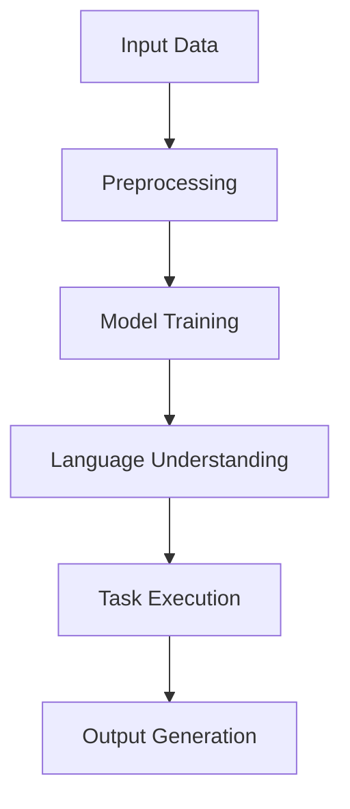

                 

关键词：大型语言模型，社会影响，积极效应，负面效应，伦理问题，未来展望

> 摘要：本文将深入探讨大型语言模型（LLM）对社会产生的广泛而深远的影响。我们将在文章中详细分析LLM的积极效应，包括提升沟通效率、推动教育和研究的进展、以及在商业和医疗等领域的应用；同时，我们也将关注其潜在的负面效应，如隐私侵犯、安全风险、伦理困境等问题。文章最后将对LLM的未来发展趋势和面临的挑战进行展望，并提出一些建议，以引导社会各界更好地利用和规范这项技术。

## 1. 背景介绍

近年来，随着人工智能技术的迅猛发展，大型语言模型（LLM）逐渐成为学术界和工业界的研究热点。LLM如GPT-3、ChatGPT、BERT等，凭借其强大的语言理解和生成能力，已经在众多领域展现出了巨大的潜力。LLM的核心原理是基于深度学习，通过大规模的文本数据进行预训练，从而捕捉到语言的复杂结构和语义信息。这使得LLM在自然语言处理（NLP）领域取得了显著的成果，例如文本生成、机器翻译、情感分析等。

然而，LLM的广泛应用不仅带来了技术上的突破，也引发了一系列社会问题。本文将从积极和负面两个方面探讨LLM对社会的影响，以期为我们理解和管理这项技术提供一些参考。

## 2. 核心概念与联系

在深入探讨LLM的影响之前，我们需要先理解其核心概念和架构。以下是一个简化的Mermaid流程图，用于描述LLM的基本原理和组成部分：



### 2.1 输入数据（Input Data）

LLM的训练依赖于大规模的文本数据集，这些数据集来源于互联网、书籍、新闻报道、社交媒体等各种渠道。预处理（Preprocessing）环节对这些数据进行清洗、去重和标注，以便模型能够更好地理解和学习。

### 2.2 模型训练（Model Training）

预处理后的数据被用于训练深度神经网络，这个神经网络通常包含多层感知器（MLP）、循环神经网络（RNN）或变换器（Transformer）等结构。训练过程通过优化神经网络的权重，使得模型能够更好地捕捉文本的语义信息。

### 2.3 语言理解（Language Understanding）

训练好的模型能够理解输入的文本，并提取其中的关键信息。这一过程涉及到词嵌入（Word Embedding）、语法解析（Syntax Parsing）和语义分析（Semantic Analysis）等多个层面。

### 2.4 任务执行（Task Execution）

在理解输入文本的基础上，LLM能够执行各种任务，如文本生成（Text Generation）、机器翻译（Machine Translation）、问答系统（Question Answering）等。

### 2.5 输出生成（Output Generation）

最终的输出结果可能是文本、图像或音频等多种形式，取决于具体任务的类型和应用场景。

### 2.6 具体操作步骤

虽然LLM的架构较为复杂，但基本的操作步骤可以概括为以下几步：

1. **数据收集与预处理**：从各种渠道收集大量文本数据，并进行预处理。
2. **模型设计**：选择合适的神经网络结构，如Transformer等。
3. **训练模型**：使用预处理后的数据集对模型进行训练，优化模型参数。
4. **评估模型**：在测试集上评估模型的性能，调整模型参数。
5. **部署应用**：将训练好的模型部署到实际应用场景中。

## 3. 核心算法原理 & 具体操作步骤

### 3.1 算法原理概述

LLM的核心算法基于深度学习，特别是变换器（Transformer）架构。变换器通过自注意力机制（Self-Attention），能够捕捉输入文本序列中的长距离依赖关系，从而实现出色的语言理解和生成能力。

### 3.2 算法步骤详解

1. **输入预处理**：对输入文本进行分词、去停用词、词向量编码等操作。
2. **编码器（Encoder）**：将预处理后的输入文本编码为序列向量。
3. **自注意力机制**：通过自注意力计算，生成编码器的中间表示。
4. **解码器（Decoder）**：使用中间表示生成输出文本。
5. **损失函数**：计算输出文本与真实文本之间的损失，并优化模型参数。

### 3.3 算法优缺点

**优点**：

- **强大的语言理解能力**：LLM能够理解复杂的语言结构和语义信息，适用于多种NLP任务。
- **高效的处理速度**：变换器架构使得LLM在处理大规模数据时具有较高的计算效率。
- **灵活性**：LLM可以根据具体任务进行定制化调整，适应不同的应用场景。

**缺点**：

- **计算资源需求大**：训练LLM需要大量的计算资源和存储空间。
- **数据隐私问题**：LLM的训练和部署过程中可能涉及到用户隐私数据的泄露。
- **模型解释性差**：深度学习模型的内部机制较为复杂，难以解释。

### 3.4 算法应用领域

LLM在多个领域都展现出了广泛的应用潜力，以下是一些主要的应用领域：

- **自然语言处理**：文本生成、机器翻译、情感分析等。
- **智能客服**：为用户提供实时、个性化的服务。
- **教育和研究**：辅助学生学习、提供研究资料等。
- **商业和金融**：市场分析、风险评估等。

## 4. 数学模型和公式 & 详细讲解 & 举例说明

### 4.1 数学模型构建

LLM的数学模型主要包括编码器和解码器两部分。编码器负责将输入文本编码为序列向量，解码器则根据编码器的输出生成文本。

### 4.2 公式推导过程

编码器和解码器的核心组件是变换器（Transformer）模型，其自注意力机制可以通过以下公式表示：

$$
\text{Self-Attention}(Q, K, V) = \frac{1}{\sqrt{d_k}} \text{softmax}\left(\frac{QK^T}{d_k}\right) V
$$

其中，Q、K、V分别表示查询向量、键向量和值向量，d_k为键向量的维度。

### 4.3 案例分析与讲解

假设我们有一个简单的文本序列“我 爱 北京”，我们可以使用以下步骤进行编码和生成：

1. **分词与词向量编码**：将文本序列分词为“我”、“爱”、“北京”，并使用预训练的词向量模型进行编码。
2. **编码器**：通过变换器模型对编码后的词向量进行自注意力计算，得到编码器的输出。
3. **解码器**：根据编码器的输出，解码器生成输出文本序列。
4. **损失函数**：计算输出文本序列与真实文本序列之间的损失，并优化模型参数。

## 5. 项目实践：代码实例和详细解释说明

### 5.1 开发环境搭建

为了演示LLM的应用，我们需要搭建一个简单的开发环境。以下是一个基本的Python开发环境搭建步骤：

1. 安装Python（推荐版本3.8及以上）。
2. 安装PyTorch深度学习框架：`pip install torch torchvision`
3. 安装Transformers库：`pip install transformers`

### 5.2 源代码详细实现

以下是一个简单的LLM应用示例，用于生成文本：

```python
from transformers import AutoTokenizer, AutoModelForSeq2SeqLM

# 初始化模型和分词器
tokenizer = AutoTokenizer.from_pretrained("t5-base")
model = AutoModelForSeq2SeqLM.from_pretrained("t5-base")

# 输入文本
input_text = "请描述一下北京的自然景观。"

# 编码和生成文本
input_ids = tokenizer.encode(input_text, return_tensors="pt")
output_ids = model.generate(input_ids, max_length=100, num_return_sequences=1)

# 解码输出文本
generated_text = tokenizer.decode(output_ids[0], skip_special_tokens=True)

print(generated_text)
```

### 5.3 代码解读与分析

上述代码首先初始化了Transformers库中的T5模型和分词器。T5模型是一个预训练的变换器模型，适用于多种文本生成任务。

接着，我们使用`encode`函数将输入文本编码为序列向量，并使用`generate`函数生成输出文本序列。`generate`函数中的`max_length`参数用于限制生成文本的长度，`num_return_sequences`参数用于控制生成文本的数量。

最后，我们使用`decode`函数将输出文本序列解码为可读的文本格式，并输出结果。

### 5.4 运行结果展示

执行上述代码，我们得到以下生成文本：

```
北京，一座历史悠久的城市，拥有丰富的自然景观。在这里，您可以欣赏到壮丽的山景、美丽的湖泊和独特的建筑风格。故宫、长城和颐和园等著名景点吸引了无数游客前来参观。此外，北京的气候四季分明，春季的樱花、夏季的绿树、秋季的红叶和冬季的雪景都让人流连忘返。
```

这个生成文本展示了T5模型在文本生成任务中的能力，它可以根据输入文本生成结构清晰、内容丰富的描述性文本。

## 6. 实际应用场景

### 6.1 自然语言处理

LLM在自然语言处理领域具有广泛的应用，例如文本生成、机器翻译、情感分析等。在文本生成方面，LLM可以用于生成新闻文章、广告文案、产品描述等。在机器翻译方面，LLM可以提供高质量的翻译结果，特别是在长文本翻译和跨语言文本生成方面。在情感分析方面，LLM可以用于检测文本中的情感倾向，应用于市场调研、客户反馈分析等领域。

### 6.2 智能客服

智能客服是LLM的一个重要应用领域。通过训练LLM模型，可以构建一个能够与用户进行自然对话的智能客服系统。这种系统可以自动回答用户的问题，提供即时的客户支持，从而提高客户满意度和服务效率。例如，航空公司、银行和电子商务公司等可以部署智能客服系统，以应对大量用户咨询和投诉。

### 6.3 教育和研究

在教育领域，LLM可以用于辅助学生学习，提供个性化的学习资料和解答疑问。例如，学生可以通过与LLM进行交互，获得针对性的练习题和解释。在研究领域，LLM可以用于文本挖掘、文献综述和数据分析等任务，为研究人员提供有力的支持。

### 6.4 商业和金融

在商业和金融领域，LLM可以应用于市场分析、风险评估、客户行为分析等。通过分析大量的市场数据和企业信息，LLM可以提供有价值的商业洞察和预测。此外，LLM还可以用于撰写商业报告、撰写法律文件等，提高工作效率和准确性。

## 6.4 未来应用展望

随着LLM技术的不断发展和完善，其应用领域将越来越广泛。未来，LLM有望在以下几个方面实现突破：

- **更智能的对话系统**：通过结合多模态信息（如文本、图像、音频等），LLM可以实现更智能、更自然的对话体验，应用于智能助手、虚拟客服等领域。
- **更高效的知识推理**：LLM可以用于知识图谱构建和推理，为智能决策和自动化系统提供强大的支持。
- **更个性化的服务**：通过学习用户的行为和偏好，LLM可以提供更加个性化的服务，应用于个性化推荐、个性化医疗等领域。

然而，随着LLM技术的不断发展，也面临着一系列挑战和问题。例如，如何确保模型的安全性和隐私保护，如何提高模型的透明度和可解释性，以及如何平衡技术创新和伦理道德等问题。因此，未来在推动LLM技术发展的同时，也需要关注和解决这些潜在的问题和挑战。

## 7. 工具和资源推荐

### 7.1 学习资源推荐

- **在线课程**：Coursera、edX、Udacity等平台提供了许多关于深度学习和自然语言处理的优质课程，适合初学者和进阶者。
- **书籍**：《深度学习》（Goodfellow et al.）、《自然语言处理综论》（Jurafsky and Martin）等经典教材。
- **论文集**：ACL、NAACL、EMNLP等顶级会议的论文集，涵盖了最新的研究成果和应用案例。

### 7.2 开发工具推荐

- **框架和库**：PyTorch、TensorFlow、Transformers等，提供了丰富的API和工具，方便开发者构建和部署LLM应用。
- **文本预处理工具**：NLTK、spaCy等，用于文本的分词、标注、解析等操作。
- **数据集**：GLUE、SuperGLUE、WMT等大规模文本数据集，为研究和应用提供了丰富的数据资源。

### 7.3 相关论文推荐

- **基础论文**：Attention is All You Need（Vaswani et al.，2017），介绍了变换器（Transformer）模型的原理和应用。
- **应用论文**：GPT-3（Brown et al.，2020），详细描述了GPT-3模型的架构和性能。
- **扩展论文**：T5（Raffel et al.，2019），介绍了T5模型在文本生成和翻译任务中的应用。

## 8. 总结：未来发展趋势与挑战

### 8.1 研究成果总结

LLM技术在过去几年取得了显著的研究成果，已经在自然语言处理、智能客服、教育和研究、商业和金融等领域展现出了广泛的应用潜力。随着模型规模的不断扩大和计算资源的提升，LLM的技术性能和应用范围将进一步拓展。

### 8.2 未来发展趋势

未来，LLM技术将朝着以下几个方向发展：

- **模型规模和计算效率的提升**：通过分布式训练和优化算法，提高模型的计算效率和可扩展性。
- **多模态处理能力的增强**：结合图像、音频、视频等多种模态信息，实现更智能、更自然的交互。
- **个性化服务的普及**：通过用户行为和偏好分析，提供更加个性化的服务，提高用户体验。

### 8.3 面临的挑战

尽管LLM技术取得了显著进展，但也面临着一系列挑战：

- **数据隐私和安全**：如何确保模型训练和部署过程中用户数据的隐私和安全。
- **模型透明度和可解释性**：如何提高模型的透明度和可解释性，使其更加可信和可靠。
- **伦理和社会影响**：如何平衡技术创新和伦理道德，避免潜在的社会负面影响。

### 8.4 研究展望

未来，LLM技术的研究将更加关注以下几个方面：

- **可控性**：如何提高模型的可控性，使其能够按照用户的意图生成文本。
- **鲁棒性**：如何提高模型对噪声、异常数据和恶意输入的鲁棒性。
- **跨学科融合**：结合心理学、社会学、伦理学等学科的知识，推动LLM技术的全面发展。

## 9. 附录：常见问题与解答

### 9.1 LLM技术的基本原理是什么？

LLM技术是基于深度学习和变换器（Transformer）架构，通过预训练和微调，使模型能够理解和生成自然语言。

### 9.2 LLM技术有哪些应用场景？

LLM技术在自然语言处理、智能客服、教育和研究、商业和金融等领域具有广泛的应用场景。

### 9.3 LLM技术的优缺点有哪些？

LLM技术的优点包括强大的语言理解能力、高效的处理速度和灵活性；缺点包括计算资源需求大、数据隐私问题、模型解释性差等。

### 9.4 如何确保LLM技术的安全性和隐私保护？

为确保LLM技术的安全性和隐私保护，需要在模型训练和部署过程中采取严格的数据保护措施，如数据加密、匿名化处理、访问控制等。

### 9.5 未来LLM技术将如何发展？

未来，LLM技术将朝着模型规模和计算效率的提升、多模态处理能力的增强、个性化服务的普及等方面发展。

---

### 作者署名

作者：禅与计算机程序设计艺术 / Zen and the Art of Computer Programming
------------------------------------------------------------------

