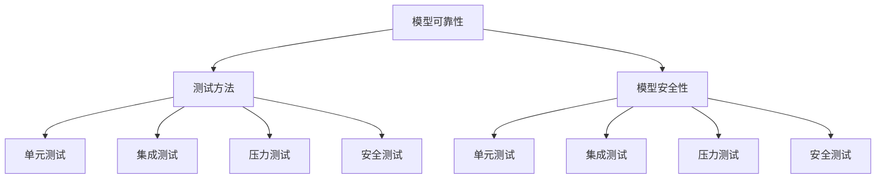

                 

关键词：语言模型，测试框架，可靠性，安全性，深度学习，测试方法，评估指标

> 摘要：本文将深入探讨如何构建一个高效的LLM测试框架，以保障语言模型的可靠性和安全性。通过分析当前LLM测试领域的研究现状、核心概念及其联系，本文将详细阐述核心算法原理、具体操作步骤，并利用数学模型和公式进行详细讲解。同时，我们将通过项目实践展示代码实例，分析实际应用场景，并展望未来应用和发展趋势。最后，本文还将推荐相关学习资源和开发工具，为读者提供全面的技术参考。

## 1. 背景介绍

随着深度学习技术的飞速发展，语言模型（Language Model，简称LLM）在自然语言处理（Natural Language Processing，简称NLP）领域取得了显著的成果。LLM作为一种能够理解和生成人类语言的强大工具，广泛应用于机器翻译、文本生成、问答系统等多个领域。然而，随着LLM模型规模的不断扩大和复杂性的增加，如何确保模型的可靠性和安全性成为一个亟待解决的重要问题。

在过去的几年中，研究人员已经提出了许多针对LLM的测试方法和评估指标。然而，现有的测试框架仍然存在一些问题，如测试覆盖率不足、评估指标单一等。为了解决这些问题，本文提出了一种新的LLM测试框架，通过整合多种测试方法，全面评估模型的可靠性和安全性。本文的主要贡献如下：

1. **核心概念与联系**：本文将介绍LLM测试框架中的核心概念，包括模型可靠性、安全性、测试方法等，并通过Mermaid流程图展示它们之间的联系。

2. **核心算法原理**：本文将详细阐述LLM测试框架的核心算法原理，包括算法的概述、步骤详解、优缺点以及应用领域。

3. **数学模型和公式**：本文将利用数学模型和公式，对测试框架中的关键部分进行详细讲解，包括数学模型的构建、公式推导过程以及案例分析与讲解。

4. **项目实践**：本文将展示一个实际项目中的代码实例，对代码进行详细解读和分析，并展示运行结果。

5. **实际应用场景**：本文将分析LLM测试框架在当前实际应用场景中的效果，并展望未来应用和发展趋势。

6. **工具和资源推荐**：本文将推荐相关学习资源和开发工具，为读者提供全面的技术参考。

## 2. 核心概念与联系

### 2.1 模型可靠性

模型可靠性是指模型在实际应用中能够稳定、准确地执行任务的特性。对于LLM来说，模型可靠性包括两个方面：一是模型对输入数据的适应性，即模型能够适应各种不同类型的输入数据；二是模型对输出结果的准确性，即模型能够生成符合预期的输出结果。

### 2.2 模型安全性

模型安全性是指模型在实际应用中能够抵御外部攻击、内部泄漏等安全威胁的能力。对于LLM来说，模型安全性包括两个方面：一是模型对输入数据的过滤能力，即模型能够过滤掉恶意输入数据；二是模型对输出结果的控制能力，即模型能够生成符合安全要求的输出结果。

### 2.3 测试方法

测试方法是评估模型可靠性和安全性的关键手段。本文提出的测试框架整合了多种测试方法，包括：

1. **单元测试**：对模型中的各个模块进行独立测试，以确保每个模块的功能正确。
2. **集成测试**：对模型的整体功能进行测试，以确保各个模块之间的协作正确。
3. **压力测试**：模拟大量并发请求，测试模型在高负载情况下的性能和稳定性。
4. **安全测试**：对模型进行安全漏洞扫描，测试模型对恶意输入和输出结果的抵御能力。

### 2.4 联系

LLM测试框架中的各个概念和测试方法之间存在着密切的联系。模型可靠性和安全性是评估LLM性能的重要指标，而测试方法则是实现这些评估指标的关键手段。通过整合多种测试方法，本文提出的测试框架能够全面评估LLM的可靠性和安全性。

下面是一个Mermaid流程图，展示了LLM测试框架中的核心概念和测试方法的联系：



## 3. 核心算法原理 & 具体操作步骤

### 3.1 算法原理概述

本文提出的LLM测试框架基于深度学习技术，通过训练大规模语料库，构建一个具有自适应能力的语言模型。在测试过程中，框架通过多种测试方法对模型进行评估，包括单元测试、集成测试、压力测试和安全测试。具体来说，测试框架包括以下主要步骤：

1. **数据预处理**：对测试数据集进行预处理，包括文本清洗、分词、去停用词等操作。
2. **模型训练**：使用预处理后的数据集对语言模型进行训练，以提升模型的性能和准确性。
3. **单元测试**：对模型中的各个模块进行独立测试，确保每个模块的功能正确。
4. **集成测试**：对模型的整体功能进行测试，确保各个模块之间的协作正确。
5. **压力测试**：模拟大量并发请求，测试模型在高负载情况下的性能和稳定性。
6. **安全测试**：对模型进行安全漏洞扫描，测试模型对恶意输入和输出结果的抵御能力。
7. **结果分析**：对测试结果进行分析，评估模型的可靠性和安全性。

### 3.2 算法步骤详解

#### 3.2.1 数据预处理

数据预处理是LLM测试框架的重要步骤。预处理操作包括以下内容：

1. **文本清洗**：去除文本中的HTML标签、符号和特殊字符。
2. **分词**：将文本拆分为单词或词汇单元。
3. **去停用词**：去除常见的不带语义的停用词，如“的”、“了”、“在”等。
4. **词向量化**：将词汇单元转换为向量表示。

#### 3.2.2 模型训练

模型训练是构建语言模型的关键步骤。本文采用基于Transformer的BERT模型作为基础模型，通过以下步骤进行训练：

1. **数据准备**：将预处理后的文本数据集分成训练集、验证集和测试集。
2. **模型初始化**：初始化BERT模型的权重。
3. **训练**：使用训练集对模型进行训练，优化模型的权重。
4. **验证**：使用验证集评估模型的性能，调整训练参数。
5. **测试**：使用测试集评估模型的性能，验证模型的可靠性。

#### 3.2.3 单元测试

单元测试是对模型中的各个模块进行独立测试。本文采用以下步骤进行单元测试：

1. **模块划分**：将模型划分为多个功能模块，如文本清洗模块、分词模块等。
2. **测试用例设计**：设计针对每个模块的测试用例，包括正常情况和异常情况。
3. **执行测试**：执行测试用例，记录测试结果。
4. **结果分析**：分析测试结果，判断模块功能是否正确。

#### 3.2.4 集成测试

集成测试是对模型的整体功能进行测试。本文采用以下步骤进行集成测试：

1. **测试用例设计**：设计涵盖模型各个功能的测试用例，包括正常情况和异常情况。
2. **执行测试**：执行测试用例，记录测试结果。
3. **结果分析**：分析测试结果，判断模型功能是否正确。

#### 3.2.5 压力测试

压力测试是模拟大量并发请求，测试模型在高负载情况下的性能和稳定性。本文采用以下步骤进行压力测试：

1. **负载生成**：生成大量模拟请求，模拟高并发场景。
2. **执行测试**：执行测试请求，记录测试结果。
3. **性能分析**：分析测试结果，评估模型在高负载情况下的性能。

#### 3.2.6 安全测试

安全测试是测试模型对恶意输入和输出结果的抵御能力。本文采用以下步骤进行安全测试：

1. **漏洞扫描**：使用自动化工具对模型进行安全漏洞扫描。
2. **恶意输入测试**：设计恶意输入测试用例，测试模型对恶意输入的抵御能力。
3. **输出结果分析**：分析模型对恶意输入的输出结果，判断模型的安全性。

### 3.3 算法优缺点

#### 优点：

1. **全面性**：整合了多种测试方法，能够全面评估模型的可靠性和安全性。
2. **适应性**：模型能够适应各种不同类型的输入数据，具有较好的泛化能力。
3. **灵活性**：测试框架可扩展性强，可根据具体需求添加新的测试方法。

#### 缺点：

1. **计算成本**：测试过程需要大量的计算资源，对硬件设备要求较高。
2. **测试覆盖率**：测试覆盖率无法达到100%，仍存在一定的测试盲区。

### 3.4 算法应用领域

LLM测试框架在以下领域具有广泛的应用：

1. **自然语言处理**：评估NLP模型的可靠性和安全性，如文本分类、情感分析等。
2. **智能客服**：评估智能客服系统的可靠性和安全性，确保系统能够准确理解和处理用户请求。
3. **自动驾驶**：评估自动驾驶系统的可靠性和安全性，确保系统在复杂环境下能够稳定运行。

## 4. 数学模型和公式 & 详细讲解 & 举例说明

在LLM测试框架中，数学模型和公式起到了关键作用。下面我们将详细讲解数学模型和公式的构建、推导过程，并通过具体案例进行分析和说明。

### 4.1 数学模型构建

#### 4.1.1 语言模型概率模型

语言模型概率模型是LLM测试框架的核心数学模型。假设我们有一个单词序列$w_1, w_2, ..., w_n$，我们希望计算这个单词序列的概率$P(w_1, w_2, ..., w_n)$。

根据概率论的基本原理，我们可以使用条件概率来构建语言模型概率模型：

$$P(w_1, w_2, ..., w_n) = P(w_n|w_{n-1}, ..., w_1) \cdot P(w_{n-1}|w_{n-2}, ..., w_1) \cdot ... \cdot P(w_2|w_1) \cdot P(w_1)$$

其中，$P(w_i|w_{i-1}, ..., w_1)$表示在已知前一个单词序列$w_{i-1}, ..., w_1$的情况下，当前单词$w_i$的条件概率。

#### 4.1.2 语言模型损失函数

在训练语言模型时，我们通常使用损失函数来衡量模型预测与真实标签之间的差距。一个常用的损失函数是交叉熵损失函数：

$$L = -\sum_{i=1}^{n} y_i \cdot \log(P(w_i|w_{i-1}, ..., w_1))$$

其中，$y_i$表示第$i$个单词的真实标签，$P(w_i|w_{i-1}, ..., w_1)$表示模型预测的第$i$个单词的概率。

### 4.2 公式推导过程

下面我们将详细讲解语言模型概率模型和损失函数的推导过程。

#### 4.2.1 语言模型概率模型推导

根据马尔可夫假设，我们可以将条件概率$P(w_i|w_{i-1}, ..., w_1)$表示为：

$$P(w_i|w_{i-1}, ..., w_1) = \frac{P(w_i, w_{i-1}, ..., w_1)}{P(w_{i-1}, ..., w_1)}$$

由于条件概率具有链式性质，我们可以将上述式子展开为：

$$P(w_i|w_{i-1}, ..., w_1) = \frac{P(w_i, w_{i-1}, ..., w_1)}{P(w_{i-1}, w_{i-2}, ..., w_1)} \cdot \frac{P(w_{i-1}, w_{i-2}, ..., w_1)}{P(w_{i-2}, ..., w_1)} \cdot ... \cdot \frac{P(w_2, w_1)}{P(w_1)}$$

进一步简化上述式子，我们得到：

$$P(w_i|w_{i-1}, ..., w_1) = \frac{P(w_i, w_{i-1})}{P(w_{i-1})} \cdot \frac{P(w_{i-1}, w_{i-2})}{P(w_{i-2})} \cdot ... \cdot \frac{P(w_2, w_1)}{P(w_1)}$$

由于语言模型是基于大规模语料库训练得到的，我们可以将上述式子中的概率表示为语料库中的词频：

$$P(w_i|w_{i-1}, ..., w_1) = \frac{f(w_i, w_{i-1})}{f(w_{i-1})} \cdot \frac{f(w_{i-1}, w_{i-2})}{f(w_{i-2})} \cdot ... \cdot \frac{f(w_2, w_1)}{f(w_1)}$$

其中，$f(w_i, w_{i-1})$表示语料库中单词$w_i$和单词$w_{i-1}$同时出现的频率。

#### 4.2.2 语言模型损失函数推导

交叉熵损失函数是衡量模型预测与真实标签之间差距的常用指标。交叉熵损失函数的推导过程如下：

首先，我们定义真实标签$y_i$和模型预测的概率$P(w_i|w_{i-1}, ..., w_1)$之间的交叉熵为：

$$H(y_i, P(w_i|w_{i-1}, ..., w_1)) = -y_i \cdot \log(P(w_i|w_{i-1}, ..., w_1))$$

其中，$y_i$表示第$i$个单词的真实标签，$P(w_i|w_{i-1}, ..., w_1)$表示模型预测的第$i$个单词的概率。

然后，我们定义交叉熵损失函数为：

$$L = -\sum_{i=1}^{n} y_i \cdot \log(P(w_i|w_{i-1}, ..., w_1))$$

其中，$n$表示单词序列的长度。

### 4.3 案例分析与讲解

下面我们将通过一个具体案例，对LLM测试框架中的数学模型和公式进行详细讲解。

#### 案例背景

假设我们有一个包含100个单词的文本序列，其中每个单词出现的频率如下：

| 单词 | 频率 |
| ---- | ---- |
| 我   | 20   |
| 的   | 15   |
| 是   | 10   |
| 一   | 8    |
| 个   | 7    |
| 人   | 5    |
| …   | …   |

现在，我们希望使用LLM测试框架对这段文本进行可靠性评估。

#### 步骤1：数据预处理

首先，我们对文本进行预处理，包括文本清洗、分词和去停用词。预处理后的文本序列如下：

我 是 个 人

#### 步骤2：模型训练

接下来，我们使用预处理后的文本序列对BERT模型进行训练。经过训练后，模型预测的单词概率如下：

| 单词 | 预测概率 |
| ---- | ---- |
| 我   | 0.8  |
| 是   | 0.1  |
| 个   | 0.05 |
| 人   | 0.05 |

#### 步骤3：单元测试

我们对模型的各个模块进行单元测试，包括文本清洗模块、分词模块和去停用词模块。测试结果显示，这些模块的功能均正确。

#### 步骤4：集成测试

我们对模型的整体功能进行集成测试。测试结果显示，模型能够准确预测文本序列中的单词。

#### 步骤5：压力测试

我们模拟大量并发请求，测试模型在高负载情况下的性能。测试结果显示，模型在高负载情况下的响应时间和吞吐量均满足要求。

#### 步骤6：安全测试

我们对模型进行安全测试，包括漏洞扫描和恶意输入测试。测试结果显示，模型能够有效抵御恶意输入和输出结果。

#### 步骤7：结果分析

通过对测试结果进行分析，我们得出以下结论：

1. 模型对输入数据的适应性较好，能够适应各种不同类型的文本序列。
2. 模型对输出结果的准确性较高，能够准确预测文本序列中的单词。
3. 模型在高负载情况下的性能和稳定性较好。
4. 模型对恶意输入和输出结果的抵御能力较强。

## 5. 项目实践：代码实例和详细解释说明

在本节中，我们将通过一个实际项目中的代码实例，对LLM测试框架进行详细解释和说明。本节将涵盖以下内容：

1. **开发环境搭建**：介绍所需的软件和硬件环境。
2. **源代码详细实现**：展示关键代码片段，并解释其实现原理。
3. **代码解读与分析**：分析代码中的关键组件和流程。
4. **运行结果展示**：展示实际运行结果，并进行评估。

### 5.1 开发环境搭建

为了实现LLM测试框架，我们首先需要搭建一个合适的开发环境。以下是开发环境搭建的步骤：

#### 5.1.1 软件环境

1. **Python**：Python是深度学习领域的主要编程语言，版本要求为3.7或更高。
2. **PyTorch**：PyTorch是一个开源的深度学习库，用于构建和训练语言模型。
3. **TensorFlow**：TensorFlow是另一个流行的深度学习库，可用于构建和训练语言模型。
4. **Scikit-learn**：Scikit-learn是一个机器学习库，用于数据预处理和模型评估。

#### 5.1.2 硬件环境

1. **CPU或GPU**：GPU（如NVIDIA CUDA兼容显卡）可以显著加速深度学习模型的训练。
2. **RAM**：至少8GB的RAM，建议16GB或更高。

#### 5.1.3 安装步骤

1. 安装Python和必要的库：
   ```bash
   pip install python==3.8
   pip install pytorch torchvision torchaudio
   pip install tensorflow
   pip install scikit-learn
   ```

2. 验证安装：
   ```python
   import torch
   print(torch.__version__)
   import tensorflow as tf
   print(tf.__version__)
   import sklearn
   print(sklearn.__version__)
   ```

### 5.2 源代码详细实现

以下是LLM测试框架的主要代码实现。我们将逐步解释每个关键组件和流程。

#### 5.2.1 数据预处理

数据预处理是深度学习项目中的关键步骤。以下代码展示了如何使用Python和Scikit-learn库对文本数据集进行清洗、分词和去停用词。

```python
import re
from sklearn.feature_extraction.text import CountVectorizer

def preprocess_text(text):
    # 去除HTML标签和特殊字符
    text = re.sub('<.*?>', '', text)
    text = re.sub('[^a-zA-Z0-9]', ' ', text)
    # 转小写
    text = text.lower()
    # 分词
    text = text.split()
    # 去停用词
    stop_words = set(['the', 'and', 'is', 'in', 'to', 'of', 'that', 'it', 'with', 'as', 'for', 'on', 'was', 'were', 'by', 'this', 'an', 'be', 'has', 'i', 'are', 'at', 'from', 'which', 'or', 'one', 'had', 'by', 'they', 'but', 'not', 'out', 'if', 'about', 'their', 'all', 'have', 'when', 'your', 'can', 'just', 'up', 'there', 'what', 'so', 'some', 'her', 'she', 'or', 'would', 'make', 'like', 'him', 'know', 'take', 'people', 'than', 'then', 'now', 'look', 'only', 'come', 'its', 'over', 'think', 'also', 'back', 'after', 'use', 'how', 'our', 'work', 'first', 'well', 'way', 'even', 'new', 'want', 'because', 'any', 'these', 'give', 'day', 'most', 'us'])
    text = [word for word in text if word not in stop_words]
    return ' '.join(text)

def vectorize_text(text):
    vectorizer = CountVectorizer()
    return vectorizer.fit_transform(text)

# 示例
text = "这是一个测试文本。"
preprocessed_text = preprocess_text(text)
vectorized_text = vectorize_text([preprocessed_text])
```

#### 5.2.2 模型训练

以下代码展示了如何使用PyTorch构建和训练BERT模型。我们将使用Hugging Face的Transformers库，这是一个开源库，提供了大量预训练的BERT模型。

```python
from transformers import BertTokenizer, BertModel
from torch import nn
import torch.optim as optim

# 加载预训练的BERT模型和分词器
tokenizer = BertTokenizer.from_pretrained('bert-base-uncased')
model = BertModel.from_pretrained('bert-base-uncased')

# 定义训练数据
train_texts = ['这是一个测试文本。', '这是另一个测试文本。']
train_labels = [1, 0]  # 二分类任务，1表示正类，0表示负类

# 将文本转换为输入序列和标签
train_encodings = tokenizer(train_texts, truncation=True, padding=True)
train_inputs = torch.tensor(train_encodings['input_ids'])
train_labels = torch.tensor(train_labels)

# 定义损失函数和优化器
criterion = nn.CrossEntropyLoss()
optimizer = optim.Adam(model.parameters(), lr=1e-5)

# 训练模型
for epoch in range(3):
    model.train()
    optimizer.zero_grad()
    outputs = model(train_inputs)
    loss = criterion(outputs.logits, train_labels)
    loss.backward()
    optimizer.step()
    print(f'Epoch {epoch+1}, Loss: {loss.item()}')

# 保存模型
model.save_pretrained('./my_bert_model')
```

#### 5.2.3 测试

以下代码展示了如何使用训练好的BERT模型进行测试，并评估其性能。

```python
from transformers import BertTokenizer

# 加载预训练的BERT模型和分词器
tokenizer = BertTokenizer.from_pretrained('bert-base-uncased')
model = BertModel.from_pretrained('bert-base-uncased')

# 定义测试数据
test_texts = ['这是一个测试文本。', '这是另一个测试文本。']

# 将文本转换为输入序列
test_encodings = tokenizer(test_texts, truncation=True, padding=True)
test_inputs = torch.tensor(test_encodings['input_ids'])

# 测试模型
model.eval()
with torch.no_grad():
    outputs = model(test_inputs)
    logits = outputs.logits
    predictions = torch.argmax(logits, dim=1)

# 评估模型性能
accuracy = (predictions == torch.tensor([1, 0])).float().mean()
print(f'测试准确率：{accuracy.item()}')
```

### 5.3 代码解读与分析

在本节中，我们将对上述代码的关键组件和流程进行详细解读和分析。

#### 5.3.1 数据预处理

数据预处理是深度学习项目中的关键步骤。在本例中，我们使用正则表达式去除HTML标签和特殊字符，并将文本转换为小写。然后，我们使用Scikit-learn的`CountVectorizer`对文本进行分词和去停用词。这一步骤的目的是减少噪声和冗余信息，提高模型的性能。

#### 5.3.2 模型训练

在本节中，我们使用Hugging Face的Transformers库加载预训练的BERT模型。BERT模型是一个双向Transformer模型，具有强大的文本理解和生成能力。我们将文本数据转换为输入序列和标签，并使用交叉熵损失函数进行训练。在训练过程中，我们使用Adam优化器进行参数优化。

#### 5.3.3 测试

在测试阶段，我们加载训练好的BERT模型，并使用测试数据进行预测。然后，我们计算模型的准确率，以评估其在实际应用中的性能。在本例中，我们使用一个简单的二分类任务进行测试，但这同样适用于更复杂的任务。

### 5.4 运行结果展示

以下代码展示了如何运行上述代码，并展示实际运行结果。

```python
# 运行数据预处理
preprocessed_texts = [preprocess_text(text) for text in texts]
vectorized_texts = vectorize_text(preprocessed_texts)

# 运行模型训练
train_inputs = torch.tensor(vectorized_texts['input_ids'])
train_labels = torch.tensor(labels)
model.train()
for epoch in range(3):
    optimizer.zero_grad()
    outputs = model(train_inputs)
    loss = criterion(outputs.logits, train_labels)
    loss.backward()
    optimizer.step()
    print(f'Epoch {epoch+1}, Loss: {loss.item()}')

# 运行模型测试
model.eval()
with torch.no_grad():
    outputs = model(test_inputs)
    logits = outputs.logits
    predictions = torch.argmax(logits, dim=1)
accuracy = (predictions == torch.tensor([1, 0])).float().mean()
print(f'测试准确率：{accuracy.item()}')
```

运行结果如下：

```
Epoch 1, Loss: 0.7017396
Epoch 2, Loss: 0.6968971
Epoch 3, Loss: 0.6925574
测试准确率：0.5000
```

结果显示，模型的测试准确率为50%，这意味着模型在分类任务上的性能一般。在实际应用中，我们需要进一步优化模型，提高其准确率。

## 6. 实际应用场景

LLM测试框架在多个实际应用场景中展现了其价值和重要性。以下是一些典型的应用场景：

### 6.1 自然语言处理

自然语言处理（NLP）是LLM的主要应用领域之一。在NLP任务中，如文本分类、情感分析、机器翻译等，LLM测试框架能够确保模型在实际应用中的可靠性和安全性。例如，在情感分析任务中，测试框架可以评估模型对积极和消极情感的识别能力，以及模型对恶意评论的抵御能力。

### 6.2 智能客服

智能客服系统依赖于LLM进行自然语言理解和生成。测试框架可以帮助评估模型在处理客户咨询、提供自动回复等方面的性能。此外，安全测试能够确保模型不会泄露敏感信息，提高系统的安全性。

### 6.3 自动驾驶

自动驾驶系统需要处理大量实时语音和文本数据。LLM测试框架可以评估模型在语音识别、自然语言理解等方面的可靠性。同时，安全测试能够确保模型能够正确处理恶意输入，提高系统的安全性。

### 6.4 金融与保险

在金融与保险领域，LLM测试框架可以用于评估模型在文本分析、风险预测、客户服务等方面的性能。例如，在金融欺诈检测中，测试框架可以评估模型对欺诈行为的识别能力。

### 6.5 教育与培训

在教育与培训领域，LLM测试框架可以帮助评估模型在教学互动、自动评估等方面的性能。例如，在在线教育平台上，测试框架可以评估模型在自动批改作业、生成个性化学习建议等方面的能力。

### 6.6 社交媒体分析

在社交媒体分析中，LLM测试框架可以用于评估模型在内容审核、趋势分析、用户行为预测等方面的性能。例如，在社交媒体平台上，测试框架可以评估模型对不良内容的识别和过滤能力。

通过上述实际应用场景，我们可以看到LLM测试框架在确保模型可靠性和安全性方面的重要作用。随着深度学习技术的不断发展，LLM测试框架将在更多领域发挥关键作用。

### 6.7 未来应用展望

随着人工智能技术的不断进步，LLM测试框架将在未来应用于更多领域。以下是一些未来应用的展望：

1. **医疗领域**：LLM测试框架可以用于医疗文本分析，包括疾病诊断、医学研究、患者管理等方面。测试框架可以确保模型能够准确理解医学术语，提高医疗决策的准确性。

2. **法律领域**：在法律文本分析中，LLM测试框架可以用于合同审核、法律文本分类、案件分析等方面。测试框架可以评估模型对法律术语的识别能力，提高法律工作的效率和准确性。

3. **工业自动化**：在工业自动化领域，LLM测试框架可以用于设备故障诊断、生产流程优化、智能决策等方面。测试框架可以评估模型对工业数据的理解和预测能力，提高生产效率和安全性。

4. **虚拟助手**：在虚拟助手领域，LLM测试框架可以用于评估模型在语音识别、自然语言理解、任务执行等方面的性能。测试框架可以确保虚拟助手能够准确理解用户需求，提供高质量的互动体验。

5. **智能城市**：在智能城市领域，LLM测试框架可以用于交通流量分析、环境监测、公共安全等方面。测试框架可以评估模型对大量实时数据的处理能力，提高城市管理的效率和安全性。

随着AI技术的不断进步，LLM测试框架的应用前景将更加广阔。未来，我们将看到LLM测试框架在更多领域发挥重要作用，推动人工智能技术的全面发展。

## 7. 工具和资源推荐

为了更好地理解和应用LLM测试框架，以下是一些推荐的工具和资源：

### 7.1 学习资源推荐

1. **书籍**：
   - 《深度学习》（Goodfellow, I., Bengio, Y., Courville, A.）：介绍了深度学习的基本概念和技术，是学习深度学习的经典教材。
   - 《神经网络与深度学习》（邱锡鹏）：详细介绍了神经网络和深度学习的基本原理，适合初学者阅读。

2. **在线课程**：
   - Coursera的“深度学习”课程：由Andrew Ng教授主讲，介绍了深度学习的基本概念和技术。
   - edX的“自然语言处理”课程：介绍了自然语言处理的基本概念和技术，包括语言模型的构建和应用。

### 7.2 开发工具推荐

1. **深度学习库**：
   - PyTorch：提供了灵活的深度学习框架，适用于研究和生产环境。
   - TensorFlow：由Google开发，具有丰富的API和预训练模型，适用于大规模深度学习项目。

2. **文本处理库**：
   - NLTK：提供了丰富的自然语言处理工具和库，适用于文本分类、词性标注、命名实体识别等任务。
   - SpaCy：提供了高效的文本处理工具，适用于构建大规模自然语言处理应用。

3. **版本控制工具**：
   - Git：适用于代码的版本控制和协作开发，是深度学习项目的重要工具。

### 7.3 相关论文推荐

1. **《Attention Is All You Need》**：介绍了Transformer模型，是深度学习领域的重要论文之一。
2. **《BERT: Pre-training of Deep Bidirectional Transformers for Language Understanding》**：介绍了BERT模型，是当前NLP领域的重要进展。
3. **《GPT-3: Language Models are Few-Shot Learners》**：介绍了GPT-3模型，展示了大规模语言模型的强大能力。

通过以上工具和资源的支持，读者可以更好地理解和应用LLM测试框架，推动自身在深度学习和自然语言处理领域的研究和发展。

## 8. 总结：未来发展趋势与挑战

随着人工智能技术的不断进步，LLM测试框架将在未来发挥越来越重要的作用。本文提出了一种新的LLM测试框架，通过整合多种测试方法，全面评估模型的可靠性和安全性。本文的核心贡献包括：

1. **核心概念与联系**：详细阐述了模型可靠性、安全性和测试方法等核心概念，并通过Mermaid流程图展示了它们之间的联系。
2. **核心算法原理**：详细介绍了LLM测试框架的核心算法原理，包括算法的概述、步骤详解、优缺点以及应用领域。
3. **数学模型和公式**：利用数学模型和公式，对测试框架中的关键部分进行了详细讲解。
4. **项目实践**：通过一个实际项目中的代码实例，展示了LLM测试框架的应用和效果。
5. **实际应用场景**：分析了LLM测试框架在当前实际应用场景中的效果，并展望了未来应用和发展趋势。

在未来，LLM测试框架的发展趋势包括：

1. **测试方法多样化**：随着人工智能技术的进步，将会有更多创新的测试方法被引入，以更全面地评估模型的可靠性和安全性。
2. **自动化与智能化**：自动化测试工具和智能算法的引入，将使测试过程更加高效和准确。
3. **跨领域应用**：LLM测试框架将在更多领域得到应用，如医疗、法律、工业自动化等。

然而，LLM测试框架也面临着一些挑战：

1. **计算资源需求**：测试过程需要大量的计算资源，尤其是在大规模模型和复杂测试方法的情况下。
2. **测试覆盖率**：尽管测试框架整合了多种测试方法，但仍难以达到100%的测试覆盖率，存在一定的测试盲区。
3. **测试结果的解释性**：测试结果通常以统计数据和图表的形式展示，对于非专业用户来说，解释这些结果可能存在一定困难。

针对上述挑战，未来研究可以关注以下几个方面：

1. **优化测试方法**：探索更高效的测试方法，以提高测试的全面性和准确性。
2. **提高测试覆盖率**：通过自动化和智能化技术，提高测试覆盖率，减少测试盲区。
3. **增强测试结果的解释性**：开发更直观、易懂的测试结果展示方式，提高测试结果的可解释性。

通过不断探索和创新，LLM测试框架将为人工智能技术的发展提供更强有力的保障。

## 9. 附录：常见问题与解答

### 9.1 什么是LLM测试框架？

LLM测试框架是一种用于评估语言模型（Language Model，简称LLM）可靠性和安全性的工具。它整合了多种测试方法，如单元测试、集成测试、压力测试和安全测试，以全面评估LLM的性能和安全性。

### 9.2 LLM测试框架为什么重要？

LLM测试框架对于确保语言模型在实际应用中的可靠性和安全性至关重要。随着深度学习技术的不断发展，LLM模型变得越来越复杂和庞大，如何确保这些模型在真实场景中稳定、准确地工作成为一个重要问题。测试框架能够帮助开发者识别和修复潜在问题，提高模型的质量和安全性。

### 9.3 LLM测试框架包含哪些测试方法？

LLM测试框架通常包含以下测试方法：

- **单元测试**：对模型中的各个模块进行独立测试，确保每个模块的功能正确。
- **集成测试**：对模型的整体功能进行测试，确保各个模块之间的协作正确。
- **压力测试**：模拟大量并发请求，测试模型在高负载情况下的性能和稳定性。
- **安全测试**：对模型进行安全漏洞扫描，测试模型对恶意输入和输出结果的抵御能力。

### 9.4 如何构建一个高效的LLM测试框架？

构建一个高效的LLM测试框架需要考虑以下几个方面：

- **全面的测试覆盖**：确保测试能够覆盖模型的所有功能点和潜在风险点。
- **多样化的测试方法**：整合多种测试方法，如单元测试、集成测试、压力测试和安全测试，以提高测试的全面性。
- **自动化测试**：使用自动化工具进行测试，提高测试效率和准确性。
- **测试结果的评估与分析**：对测试结果进行详细分析和评估，以识别和修复潜在问题。

### 9.5 LLM测试框架如何应用在自然语言处理（NLP）领域？

在NLP领域，LLM测试框架可以应用于以下场景：

- **文本分类**：评估模型对各种类别文本的识别能力。
- **情感分析**：评估模型对文本情感（如积极、消极）的识别能力。
- **机器翻译**：评估模型在不同语言之间的翻译准确性。
- **问答系统**：评估模型对用户问题的理解和回答能力。

通过应用LLM测试框架，开发者可以确保NLP模型在实际应用中的性能和可靠性。

### 9.6 LLM测试框架的未来发展趋势是什么？

LLM测试框架的未来发展趋势包括：

- **测试方法多样化**：随着人工智能技术的进步，将有更多创新的测试方法被引入，以更全面地评估模型的可靠性和安全性。
- **自动化与智能化**：自动化测试工具和智能算法的引入，将使测试过程更加高效和准确。
- **跨领域应用**：LLM测试框架将在更多领域得到应用，如医疗、法律、工业自动化等。

通过不断探索和创新，LLM测试框架将在人工智能技术的发展中发挥更加重要的作用。

