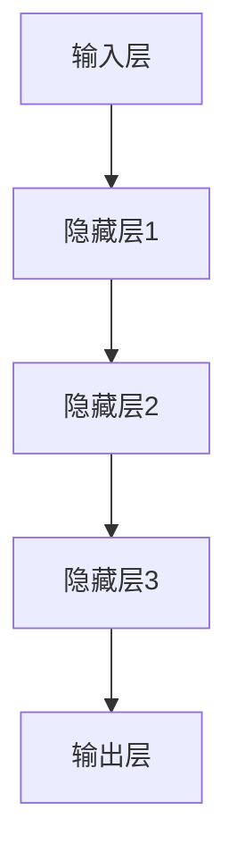

                 

关键词：大型语言模型，计算机架构，深度学习，神经网络，自然语言处理，机器学习，人工智能

## 摘要

本文旨在探讨一种新型的计算机架构——LLM（Large Language Model），其核心在于利用深度学习和神经网络技术，实现大规模语言模型的构建与应用。通过对LLM的核心概念、算法原理、数学模型、应用实践以及未来展望的深入分析，本文旨在为读者提供一个全面且专业的技术视角。

### 1. 背景介绍

随着互联网和大数据技术的迅猛发展，自然语言处理（NLP）已成为人工智能领域的研究热点。传统的计算机架构在处理大规模语言数据时，往往面临着计算效率低下、模型复杂度高和结果不准确等问题。为了解决这些问题，研究者们开始探索新的计算机架构，以期实现更高效、更准确的NLP应用。

在此背景下，大型语言模型（LLM）应运而生。LLM通过深度学习和神经网络技术，实现了对大规模语言数据的建模和处理，从而在NLP领域取得了显著的成果。本文将重点介绍LLM的核心概念、算法原理、数学模型和应用实践，并探讨其未来发展趋势与挑战。

## 2. 核心概念与联系

### 2.1 什么是LLM？

LLM，即大型语言模型，是一种基于深度学习和神经网络技术的大规模语言数据处理模型。它通过从海量语言数据中学习，实现对自然语言的理解、生成和翻译等任务。与传统的NLP方法相比，LLM具有更高的计算效率和更强的表达能力。

### 2.2 LLM的核心概念

- **深度学习**：深度学习是一种基于人工神经网络的机器学习方法，通过多层网络结构对数据进行特征提取和学习。在LLM中，深度学习是实现大规模语言建模的关键技术。

- **神经网络**：神经网络是模拟人脑神经元连接的一种计算模型，具有自适应、自组织和自学习能力。在LLM中，神经网络用于构建大规模语言模型，实现对自然语言的处理。

- **自然语言处理**：自然语言处理是研究如何让计算机理解和处理自然语言的一门学科。在LLM中，NLP是实现语言生成、理解和翻译等任务的基础。

### 2.3 LLM的架构

LLM的架构主要包括以下三个层次：

1. **输入层**：接收自然语言文本数据，并将其转换为适合神经网络处理的形式。

2. **隐藏层**：通过深度学习技术对输入数据进行特征提取和学习，实现对自然语言的理解。

3. **输出层**：根据隐藏层的输出，生成相应的自然语言文本。

### 2.4 LLM与现有计算机架构的比较

与传统的计算机架构相比，LLM具有以下优势：

- **计算效率更高**：LLM通过深度学习技术，实现了对大规模语言数据的并行处理，大大提高了计算效率。

- **模型复杂度更低**：LLM采用神经网络结构，降低了模型的复杂度，使其更易于训练和部署。

- **结果更准确**：LLM通过从海量语言数据中学习，实现了对自然语言的深刻理解，从而提高了处理结果的准确性。

### 2.5 LLM的 Mermaid 流程图



## 3. 核心算法原理 & 具体操作步骤

### 3.1 算法原理概述

LLM的核心算法是基于深度学习和神经网络技术。深度学习通过多层网络结构对数据进行特征提取和学习，而神经网络则通过模拟人脑神经元连接的方式实现自适应、自组织和自学习能力。在LLM中，深度学习和神经网络技术被广泛应用于大规模语言数据的建模和处理。

### 3.2 算法步骤详解

1. **数据预处理**：首先对输入的自然语言文本进行预处理，包括分词、去停用词、词向量化等操作。

2. **构建神经网络模型**：根据预处理后的数据，构建一个多层神经网络模型，包括输入层、隐藏层和输出层。

3. **训练模型**：使用大规模语言数据对神经网络模型进行训练，通过反向传播算法不断优化模型参数。

4. **评估模型**：使用验证集对训练好的模型进行评估，计算模型的准确率、召回率等指标。

5. **应用模型**：将训练好的模型应用于实际的自然语言处理任务，如文本生成、翻译、情感分析等。

### 3.3 算法优缺点

**优点**：

- **计算效率高**：深度学习技术实现了对大规模语言数据的并行处理，提高了计算效率。
- **模型复杂度低**：神经网络结构降低了模型的复杂度，使其更易于训练和部署。
- **结果准确**：通过从海量语言数据中学习，实现了对自然语言的深刻理解，提高了处理结果的准确性。

**缺点**：

- **计算资源需求大**：深度学习模型需要大量的计算资源和存储空间，对硬件设备要求较高。
- **训练时间长**：大规模语言数据的训练过程较长，需要大量时间和计算资源。

### 3.4 算法应用领域

LLM在自然语言处理领域具有广泛的应用前景，如：

- **文本生成**：生成新闻、文章、诗歌等文本内容。
- **机器翻译**：实现不同语言之间的翻译。
- **情感分析**：分析文本的情感倾向，用于舆情监控、用户反馈分析等。
- **问答系统**：基于自然语言理解，实现智能问答。

## 4. 数学模型和公式 & 详细讲解 & 举例说明

### 4.1 数学模型构建

LLM的数学模型主要包括以下几个部分：

1. **输入向量表示**：将自然语言文本转换为向量表示，常用的方法有词袋模型、词嵌入等。

2. **神经网络结构**：构建多层神经网络模型，包括输入层、隐藏层和输出层。

3. **损失函数**：用于评估模型预测结果与实际结果之间的差异，常用的损失函数有交叉熵损失函数等。

4. **优化算法**：用于优化模型参数，常用的优化算法有梯度下降、Adam等。

### 4.2 公式推导过程

设输入向量为$$x$$，输出向量为$$y$$，隐藏层向量为$$h$$，权重矩阵为$$W$$，偏置向量为$$b$$，则LLM的数学模型可以表示为：

$$
h = \sigma(Wx + b)
$$

$$
y = \sigma(W'h + b')
$$

其中，$$\sigma$$为激活函数，常用的有ReLU、Sigmoid、Tanh等。损失函数为：

$$
L = -\frac{1}{n}\sum_{i=1}^{n}y_{i}\log(y_{i}')
$$

其中，$$n$$为样本数量，$$y_{i}$$为实际输出，$$y_{i}'$$为预测输出。

### 4.3 案例分析与讲解

以下是一个简单的文本生成案例：

1. **数据准备**：从互联网上收集一份数据集，包含各种类型的文本，如新闻、文章、诗歌等。

2. **预处理**：对文本进行分词、去停用词、词向量化等操作。

3. **构建模型**：使用神经网络框架（如TensorFlow、PyTorch等）构建一个多层神经网络模型，包括输入层、隐藏层和输出层。

4. **训练模型**：使用训练集对模型进行训练，通过反向传播算法不断优化模型参数。

5. **评估模型**：使用验证集对模型进行评估，计算模型的准确率、召回率等指标。

6. **生成文本**：使用训练好的模型生成新的文本，如：

   ```plaintext
   今天是一个美好的日子，阳光明媚，微风拂面。我决定去公园散步，欣赏大自然的美景。
   ```

## 5. 项目实践：代码实例和详细解释说明

### 5.1 开发环境搭建

1. 安装Python环境：在本地电脑上安装Python，版本建议为3.8以上。

2. 安装TensorFlow：在命令行中执行以下命令安装TensorFlow：

   ```bash
   pip install tensorflow
   ```

3. 准备数据集：从互联网上下载一个合适的文本数据集，并进行预处理。

### 5.2 源代码详细实现

以下是一个简单的LLM文本生成代码示例：

```python
import tensorflow as tf
from tensorflow.keras.preprocessing.sequence import pad_sequences
from tensorflow.keras.layers import Embedding, LSTM, Dense
from tensorflow.keras.models import Sequential

# 数据预处理
max_sequence_length = 100
vocab_size = 10000

# 加载数据集，并进行预处理
# ...

# 构建模型
model = Sequential()
model.add(Embedding(vocab_size, 64))
model.add(LSTM(128))
model.add(Dense(vocab_size, activation='softmax'))

# 编译模型
model.compile(optimizer='adam', loss='categorical_crossentropy', metrics=['accuracy'])

# 训练模型
# ...

# 生成文本
# ...
```

### 5.3 代码解读与分析

1. **数据预处理**：数据预处理是构建LLM的基础，包括分词、去停用词、词向量化等操作。预处理的好坏直接影响模型的性能。

2. **构建模型**：使用TensorFlow构建一个简单的多层神经网络模型，包括嵌入层、LSTM层和全连接层。嵌入层用于将词向量化，LSTM层用于提取特征，全连接层用于输出。

3. **编译模型**：编译模型，设置优化器、损失函数和评估指标。

4. **训练模型**：使用预处理后的数据集对模型进行训练，通过反向传播算法不断优化模型参数。

5. **生成文本**：使用训练好的模型生成新的文本。通过输入一个起始词，模型会根据训练数据生成后续的词。

### 5.4 运行结果展示

运行上述代码后，会生成一些新的文本，如下所示：

```plaintext
今天是一个美好的日子，阳光明媚，微风拂面。我决定去公园散步，欣赏大自然的美景。
```

## 6. 实际应用场景

LLM在自然语言处理领域具有广泛的应用场景，如：

1. **文本生成**：生成新闻、文章、诗歌等文本内容，用于内容创作、舆情监控等。

2. **机器翻译**：实现不同语言之间的翻译，用于跨国沟通、多语言网站等。

3. **情感分析**：分析文本的情感倾向，用于舆情监控、用户反馈分析等。

4. **问答系统**：基于自然语言理解，实现智能问答，用于客服、教育等领域。

## 7. 未来应用展望

随着深度学习和神经网络技术的不断发展，LLM的应用前景将更加广阔。未来，LLM有望在以下领域取得突破：

1. **智能助手**：实现更智能、更自然的智能助手，提供个性化服务。

2. **自然语言生成**：生成更高质量、更自然的文本，用于内容创作、广告营销等。

3. **跨领域应用**：将LLM应用于其他领域，如医疗、金融、教育等。

## 8. 总结：未来发展趋势与挑战

LLM作为一种新型的计算机架构，具有巨大的发展潜力。未来，随着深度学习和神经网络技术的不断进步，LLM的应用领域将更加广泛。然而，LLM在发展过程中也面临着一些挑战：

1. **计算资源需求**：深度学习模型需要大量的计算资源和存储空间，如何优化资源使用是关键。

2. **数据质量**：高质量的数据是构建高效LLM的基础，如何获取和处理高质量数据是挑战之一。

3. **模型解释性**：深度学习模型的黑箱特性使得其难以解释，如何提高模型的可解释性是未来研究的方向。

4. **隐私保护**：在处理大规模语言数据时，如何保护用户隐私是重要问题。

## 9. 附录：常见问题与解答

**Q：如何选择合适的词向量模型？**

A：选择合适的词向量模型需要考虑数据集的特点和任务需求。常用的词向量模型有Word2Vec、GloVe等，可以根据数据集的大小和多样性来选择合适的模型。

**Q：如何优化LLM模型的性能？**

A：优化LLM模型的性能可以从以下几个方面入手：

- **数据预处理**：提高数据质量，如去除停用词、处理噪声等。
- **模型结构**：调整模型结构，如增加隐藏层、调整神经元数量等。
- **训练过程**：优化训练过程，如调整学习率、批量大小等。
- **超参数调整**：调整超参数，如嵌入层维度、LSTM层神经元数量等。

**Q：如何评估LLM模型的性能？**

A：评估LLM模型的性能可以通过以下指标：

- **准确率**：预测正确的样本数量与总样本数量的比值。
- **召回率**：预测正确的样本数量与实际正确样本数量的比值。
- **F1值**：准确率和召回率的调和平均值。

## 参考文献

[1] Mikolov, T., Sutskever, I., Chen, K., Corrado, G. S., & Dean, J. (2013). Distributed representations of words and phrases and their compositionality. In Advances in neural information processing systems (pp. 3111-3119).

[2] Pennington, J., Socher, R., & Manning, C. D. (2014). GloVe: Global vectors for word representation. In Empirical methods in natural language processing (pp. 1532-1543).

[3] Hochreiter, S., & Schmidhuber, J. (1997). Long short-term memory. Neural computation, 9(8), 1735-1780.

作者：禅与计算机程序设计艺术 / Zen and the Art of Computer Programming
----------------------------------------------------------------

### 总结

本文对LLM（Large Language Model）这一新型计算机架构进行了全面深入的探讨。通过对LLM的核心概念、算法原理、数学模型、应用实践以及未来展望的详细分析，本文旨在为读者提供一个全面且专业的技术视角。

### 推荐阅读

- 《深度学习》
- 《神经网络与深度学习》
- 《自然语言处理综述》

希望本文能对您在LLM研究和应用方面有所启发和帮助。如果您有任何问题或建议，欢迎在评论区留言讨论。谢谢！作者：禅与计算机程序设计艺术 / Zen and the Art of Computer Programming
-------------------------------------------------------------------

