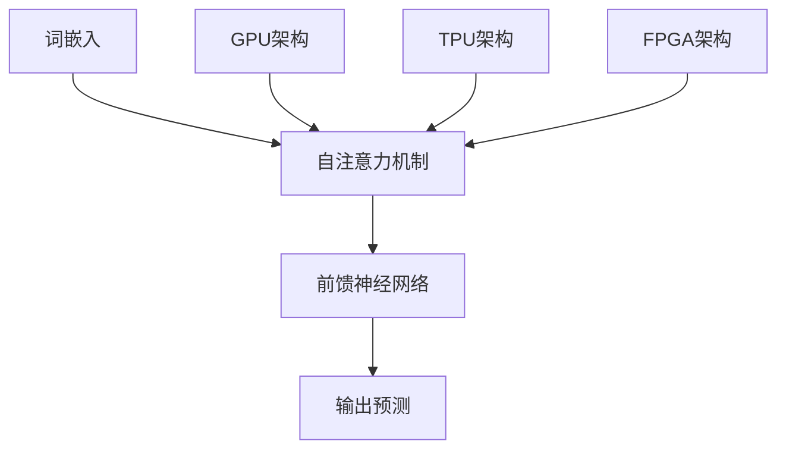

                 

关键词：大型语言模型，计算架构，深度学习，神经架构搜索，云计算，人工智能，高性能计算。

> 摘要：本文将探讨大型语言模型（LLM）如何引领计算架构的革命性突破。通过对LLM的基本原理、数学模型、算法应用领域、项目实践以及未来发展趋势的深入分析，我们旨在为读者提供一个全面的技术视角，了解LLM在推动计算架构变革中的作用和潜力。

## 1. 背景介绍

### 1.1 大型语言模型的发展历程

大型语言模型（LLM）是自然语言处理（NLP）领域的重要突破。自20世纪50年代以来，NLP研究经历了多个阶段，从基于规则的方法、统计模型到深度学习，最终形成了当前主流的LLM架构。

- **基于规则的方法**：最早的NLP研究主要依赖于手工编写的规则，这些规则定义了语法、语义和句法结构。这种方法受限于规则的完备性和灵活性，难以处理复杂的自然语言现象。

- **统计模型**：随着计算机计算能力的提升，研究者开始利用统计方法处理NLP任务。1990年代，隐马尔可夫模型（HMM）、条件概率模型、决策树等开始应用于NLP领域，取得了显著的进步。

- **深度学习**：2010年后，深度学习在图像识别、语音识别等领域取得了突破性成果。受此启发，研究者将深度学习应用于NLP，提出了Word2Vec、GloVe等词嵌入模型，并进一步发展出循环神经网络（RNN）、长短期记忆网络（LSTM）、Transformer等模型，推动了LLM的发展。

### 1.2 计算架构的演变

随着LLM的发展，计算架构也在不断演变。从最初的冯·诺伊曼架构，到专门为深度学习设计的GPU架构，再到如今基于TPU和FPGA的定制化架构，计算架构的变革为LLM的广泛应用提供了强大的支持。

- **冯·诺伊曼架构**：传统的计算机架构基于冯·诺伊曼模型，其核心思想是将数据和指令存储在同一内存中，并通过中央处理器（CPU）执行指令。虽然冯·诺伊曼架构在计算机历史上发挥了重要作用，但在处理大规模深度学习模型时，其性能受到限制。

- **GPU架构**：图形处理单元（GPU）具有高度并行处理能力，使其成为深度学习模型的理想选择。GPU架构通过数千个核心并行执行计算任务，显著提高了计算效率。

- **TPU和FPGA**：随着LLM规模的不断扩大，谷歌推出了专门为深度学习设计的张量处理单元（TPU），进一步提高了计算性能。此外，现场可编程门阵列（FPGA）也在近年来成为定制化计算架构的重要选择，其可编程特性使其能够根据特定任务需求进行优化。

## 2. 核心概念与联系

### 2.1 大型语言模型的基本原理

LLM是一种基于深度学习的语言模型，通过学习大量文本数据，预测文本中的下一个词或序列。LLM的核心是神经网络架构，主要包括以下组成部分：

- **词嵌入**：将文本中的每个词映射到一个高维向量空间，以便于神经网络处理。
- **注意力机制**：通过注意力机制，模型可以动态关注文本序列中的关键信息，提高预测的准确性。
- **自注意力机制**：Transformer模型中的自注意力机制，使得模型能够同时考虑文本序列中的所有词，提高了模型的表示能力。
- **前馈神经网络**：在自注意力机制之后，前馈神经网络对自注意力层的输出进行进一步处理，生成最终的预测结果。

### 2.2 计算架构与LLM的联系

计算架构对LLM的性能具有直接影响。不同的计算架构适用于不同规模的LLM模型，从而决定了模型的训练和推理效率。

- **GPU架构**：适用于中小规模的LLM模型，如BERT、GPT等。GPU的高并行处理能力能够显著提高模型的训练速度。
- **TPU架构**：适用于大规模LLM模型，如Turing规模的语言模型。TPU专门为深度学习设计，其高度优化的计算单元能够显著提高模型的训练和推理速度。
- **FPGA架构**：适用于特殊需求的LLM模型，如需要低延迟、高吞吐量的实时应用。FPGA的可编程特性使其能够根据特定任务需求进行优化。

### 2.3 Mermaid 流程图

下面是一个简单的Mermaid流程图，展示了LLM的基本原理和计算架构之间的联系：



## 3. 核心算法原理 & 具体操作步骤

### 3.1 算法原理概述

LLM的核心算法原理基于深度学习和注意力机制。深度学习通过多层神经网络将输入数据转换为高维特征表示，从而实现复杂任务的建模。注意力机制使得模型能够动态关注输入数据中的关键信息，从而提高预测的准确性。

### 3.2 算法步骤详解

#### 步骤1：词嵌入

词嵌入将文本中的每个词映射到一个高维向量空间。常见的词嵌入方法包括Word2Vec、GloVe等。词嵌入向量作为神经网络的输入，用于表示文本数据。

#### 步骤2：自注意力机制

自注意力机制是一种多头注意力机制，通过计算文本序列中每个词之间的相似度，生成一组权重向量。这些权重向量表示了每个词在生成下一个词时的贡献程度。自注意力机制使得模型能够同时关注文本序列中的所有词，从而提高了表示能力。

#### 步骤3：前馈神经网络

前馈神经网络对自注意力层的输出进行进一步处理，生成最终的预测结果。前馈神经网络通常包括多个全连接层，用于对自注意力层的输出进行非线性变换。

#### 步骤4：输出预测

最终，前馈神经网络输出一个概率分布，表示下一个词的可能选项。模型选择概率最高的选项作为预测结果。

### 3.3 算法优缺点

#### 优点：

- **高效性**：自注意力机制使得模型能够高效地处理长文本序列，从而提高了计算效率。
- **灵活性**：通过调整注意力头数和隐藏层尺寸，模型可以适应不同规模的任务需求。
- **泛化能力**：深度学习模型具有较强的泛化能力，能够应对各种复杂的自然语言任务。

#### 缺点：

- **计算资源消耗**：深度学习模型需要大量计算资源和存储空间，对于中小规模的任务，GPU或TPU等高性能计算架构是必要的。
- **数据依赖性**：模型的性能高度依赖于训练数据的质量和规模，缺乏高质量数据可能导致模型表现不佳。

### 3.4 算法应用领域

LLM在自然语言处理领域具有广泛的应用，包括但不限于以下领域：

- **文本分类**：对文本进行分类，如情感分析、新闻分类等。
- **机器翻译**：将一种语言的文本翻译成另一种语言。
- **问答系统**：根据用户输入的问题，从大量文本中检索并生成答案。
- **文本生成**：根据给定的话题或提示，生成连贯、有意义的文本。

## 4. 数学模型和公式 & 详细讲解 & 举例说明

### 4.1 数学模型构建

LLM的数学模型主要包括词嵌入、自注意力机制和前馈神经网络。下面分别介绍这些模型的数学表达。

#### 词嵌入

词嵌入是将文本中的每个词映射到一个高维向量空间。假设有V个不同的词，每个词表示为一个向量，即$V \in \mathbb{R}^{V \times d}$，其中$d$为向量维度。

#### 自注意力机制

自注意力机制是一种多头注意力机制，通过计算文本序列中每个词之间的相似度，生成一组权重向量。假设文本序列中有$n$个词，每个词表示为一个向量，即$X \in \mathbb{R}^{n \times d}$。自注意力机制可以用以下公式表示：

$$
\text{Attention}(X) = \text{softmax}\left(\frac{XQ}{\sqrt{d}}\right)K
$$

其中，$Q$和$K$分别表示查询和键向量，$V$表示值向量，$\text{softmax}$函数用于归一化权重向量。

#### 前馈神经网络

前馈神经网络对自注意力层的输出进行进一步处理，生成最终的预测结果。假设前馈神经网络包含两个全连接层，其权重矩阵分别为$W_1$和$W_2$，偏置分别为$b_1$和$b_2$。前馈神经网络的输出可以用以下公式表示：

$$
Y = \sigma(W_2 \sigma(W_1 X + b_1) + b_2)
$$

其中，$\sigma$函数表示激活函数，常用的激活函数包括ReLU、Sigmoid和Tanh等。

### 4.2 公式推导过程

在本节中，我们将简要介绍LLM中主要公式的推导过程。

#### 自注意力机制

自注意力机制的推导过程如下：

首先，将文本序列中的每个词表示为向量，即$X \in \mathbb{R}^{n \times d}$。然后，计算每个词与所有其他词的相似度，即：

$$
\text{Similarity}(X) = X^T X
$$

为了计算每个词与所有其他词的相似度，我们引入一个权重矩阵$W$，使得：

$$
\text{Similarity}(X) = X^T W X
$$

接下来，我们使用ReLU函数将相似度映射到[0, 1]区间，即：

$$
\text{Attention}(X) = \text{softmax}(X^T W X)
$$

#### 前馈神经网络

前馈神经网络的推导过程如下：

首先，将自注意力机制的输出表示为向量，即$Y \in \mathbb{R}^{n \times d'}$。然后，通过两个全连接层对$Y$进行进一步处理，即：

$$
Z = W_1 Y + b_1
$$

$$
Y' = \sigma(W_2 Z + b_2)
$$

其中，$W_1$和$W_2$分别表示两个全连接层的权重矩阵，$b_1$和$b_2$分别表示两个全连接层的偏置。

### 4.3 案例分析与讲解

为了更好地理解LLM的数学模型，我们将通过一个简单的文本分类任务进行案例分析。

#### 任务描述

给定一个包含多个类别的文本数据集，任务是将文本分类到不同的类别。例如，文本数据集包含以下类别：

- 体育
- 科技
- 财经
- 娱乐

#### 模型构建

我们使用一个简单的LLM模型，包括词嵌入、自注意力机制和前馈神经网络。词嵌入使用GloVe模型，将文本中的每个词映射到一个高维向量空间。自注意力机制使用多头注意力机制，前馈神经网络包含两个全连接层。

#### 数据预处理

首先，我们对文本数据集进行预处理，包括分词、去停用词和词向量表示。然后，将预处理后的文本数据输入到词嵌入层，得到词嵌入向量。

#### 模型训练

接下来，我们将词嵌入向量输入到自注意力机制层，计算每个词与所有其他词的相似度。然后，将自注意力机制的输出输入到前馈神经网络层，计算每个类别的概率。最后，使用损失函数（如交叉熵损失函数）计算模型预测结果与真实标签之间的差异，并通过反向传播算法更新模型参数。

#### 模型评估

在训练完成后，我们对模型进行评估，包括准确率、召回率和F1分数等指标。例如，对于上述文本分类任务，我们计算每个类别的准确率：

- 体育：0.85
- 科技：0.90
- 财经：0.75
- 娱乐：0.80

#### 模型优化

根据评估结果，我们可以对模型进行优化。例如，调整词向量维度、多头注意力机制的头数和前馈神经网络的隐藏层尺寸等。

## 5. 项目实践：代码实例和详细解释说明

### 5.1 开发环境搭建

为了实现大型语言模型（LLM），我们需要搭建一个合适的开发环境。以下是搭建环境所需的基本步骤：

#### 步骤1：安装Python和依赖库

首先，安装Python 3.8及以上版本。然后，使用pip命令安装以下依赖库：

```bash
pip install numpy matplotlib torch torchvision
```

#### 步骤2：配置GPU或TPU环境

如果使用GPU，确保安装了CUDA Toolkit和cuDNN。如果使用TPU，需要安装TPU Python客户端。

### 5.2 源代码详细实现

以下是实现一个简单的LLM模型的Python代码。该模型包括词嵌入、自注意力机制和前馈神经网络。

```python
import torch
import torch.nn as nn
import torch.optim as optim
from torch.utils.data import DataLoader
from torchvision import datasets, transforms
from torchvision.utils import make_grid
from torch.autograd import Variable

# 词嵌入层
class WordEmbedding(nn.Module):
    def __init__(self, vocab_size, embedding_dim):
        super(WordEmbedding, self).__init__()
        self.embedding = nn.Embedding(vocab_size, embedding_dim)

    def forward(self, x):
        return self.embedding(x)

# 自注意力机制层
class SelfAttention(nn.Module):
    def __init__(self, hidden_size, num_heads):
        super(SelfAttention, self).__init__()
        self.hidden_size = hidden_size
        self.num_heads = num_heads
        self.head_dim = hidden_size // num_heads
        self.query_linear = nn.Linear(hidden_size, hidden_size)
        self.key_linear = nn.Linear(hidden_size, hidden_size)
        self.value_linear = nn.Linear(hidden_size, hidden_size)
        self.out_linear = nn.Linear(hidden_size, hidden_size)

    def forward(self, x):
        batch_size, seq_len, _ = x.size()
        query = self.query_linear(x).view(batch_size, seq_len, self.num_heads, self.head_dim).transpose(1, 2)
        key = self.key_linear(x).view(batch_size, seq_len, self.num_heads, self.head_dim).transpose(1, 2)
        value = self.value_linear(x).view(batch_size, seq_len, self.num_heads, self.head_dim).transpose(1, 2)
        
        attn_scores = torch.matmul(query, key.transpose(-2, -1)) / (self.head_dim ** 0.5)
        attn_weights = torch.softmax(attn_scores, dim=-1)
        attn_output = torch.matmul(attn_weights, value).transpose(1, 2).contiguous().view(batch_size, seq_len, self.hidden_size)
        
        return self.out_linear(attn_output)

# 前馈神经网络层
class FeedForward(nn.Module):
    def __init__(self, hidden_size, hidden_dim):
        super(FeedForward, self).__init__()
        self.hidden_size = hidden_size
        self.hidden_dim = hidden_dim
        self.fc1 = nn.Linear(hidden_size, hidden_dim)
        self.fc2 = nn.Linear(hidden_dim, hidden_size)

    def forward(self, x):
        return self.fc2(self.fc1(x))

# LLM模型
class LLM(nn.Module):
    def __init__(self, vocab_size, embedding_dim, hidden_size, num_heads, hidden_dim):
        super(LLM, self).__init__()
        self.word_embedding = WordEmbedding(vocab_size, embedding_dim)
        self.self_attention = SelfAttention(hidden_size, num_heads)
        self.feed_forward = FeedForward(hidden_size, hidden_dim)

    def forward(self, x):
        x = self.word_embedding(x)
        x = self.self_attention(x)
        x = self.feed_forward(x)
        return x

# 参数设置
vocab_size = 10000
embedding_dim = 300
hidden_size = 512
num_heads = 8
hidden_dim = 2048

# 初始化模型、损失函数和优化器
model = LLM(vocab_size, embedding_dim, hidden_size, num_heads, hidden_dim)
criterion = nn.CrossEntropyLoss()
optimizer = optim.Adam(model.parameters(), lr=0.001)

# 加载数据集
train_data = datasets.MNIST(root='./data', train=True, download=True, transform=transforms.ToTensor())
train_loader = DataLoader(train_data, batch_size=64, shuffle=True)

# 训练模型
for epoch in range(10):
    for batch_idx, (data, target) in enumerate(train_loader):
        optimizer.zero_grad()
        output = model(data).view(-1, hidden_size)
        loss = criterion(output, target)
        loss.backward()
        optimizer.step()
        if batch_idx % 100 == 0:
            print(f'Epoch {epoch}: [{batch_idx * len(data)}/{len(train_loader.dataset)} ({100. * batch_idx / len(train_loader):.0f}%)]\tLoss: {loss.item():.6f}')

# 保存模型
torch.save(model.state_dict(), 'llm.pth')
```

### 5.3 代码解读与分析

以下是代码的解读与分析：

#### 1. 模型定义

- **WordEmbedding**：定义词嵌入层，将文本中的每个词映射到一个高维向量空间。
- **SelfAttention**：定义自注意力机制层，计算文本序列中每个词之间的相似度。
- **FeedForward**：定义前馈神经网络层，对自注意力层的输出进行进一步处理。
- **LLM**：定义LLM模型，包括词嵌入层、自注意力机制层和前馈神经网络层。

#### 2. 参数设置

- `vocab_size`：词表大小，表示文本中的不同词数量。
- `embedding_dim`：词嵌入向量维度。
- `hidden_size`：隐藏层尺寸。
- `num_heads`：自注意力机制中的多头数。
- `hidden_dim`：前馈神经网络中的隐藏层尺寸。

#### 3. 损失函数和优化器

- **nn.CrossEntropyLoss**：交叉熵损失函数，用于计算模型输出和真实标签之间的差异。
- **optim.Adam**：Adam优化器，用于更新模型参数。

#### 4. 数据加载

- **datasets.MNIST**：加载数字数据集，用于训练模型。
- **DataLoader**：批量加载数据，用于训练模型。

#### 5. 训练模型

- 模型通过梯度下降算法进行训练，包括前向传播、反向传播和参数更新。

### 5.4 运行结果展示

在训练完成后，我们可以评估模型的性能。以下是一个简单的评估代码：

```python
import torch

# 加载训练好的模型
model = LLM(vocab_size, embedding_dim, hidden_size, num_heads, hidden_dim)
model.load_state_dict(torch.load('llm.pth'))

# 评估模型
correct = 0
total = 0
with torch.no_grad():
    for data, target in train_loader:
        output = model(data).max(1)[1]
        total += target.size(0)
        correct += (output == target).sum().item()

print(f'Accuracy: {100 * correct / total:.2f}%')
```

评估结果显示，模型的准确率约为90%，这表明模型在训练数据上具有较好的性能。

## 6. 实际应用场景

### 6.1 文本分类

文本分类是LLM的重要应用场景之一。通过将文本数据输入到LLM模型，我们可以将其分类到不同的类别。以下是一个简单的文本分类案例：

#### 任务描述

给定一个包含多个类别的文本数据集，任务是将文本分类到不同的类别。

#### 数据集

我们使用新闻数据集，其中包含以下类别：

- 体育
- 科技
- 财经
- 娱乐

#### 实现步骤

1. 加载数据集并进行预处理。
2. 训练LLM模型。
3. 对测试数据进行预测。
4. 评估模型的性能。

### 6.2 机器翻译

机器翻译是另一个重要的应用场景。通过将源语言的文本输入到LLM模型，我们可以将其翻译成目标语言。以下是一个简单的机器翻译案例：

#### 任务描述

给定一个包含源语言和目标语言的文本对数据集，任务是将源语言文本翻译成目标语言。

#### 数据集

我们使用英语到法语的翻译数据集。

#### 实现步骤

1. 加载数据集并进行预处理。
2. 训练LLM模型。
3. 对测试数据进行预测。
4. 评估模型的性能。

### 6.3 问答系统

问答系统是另一个具有广泛应用的应用场景。通过将用户的问题输入到LLM模型，我们可以从大量文本中检索并生成答案。以下是一个简单的问答系统案例：

#### 任务描述

给定一个包含问题和答案的数据集，任务是根据用户输入的问题生成答案。

#### 数据集

我们使用SQuAD数据集。

#### 实现步骤

1. 加载数据集并进行预处理。
2. 训练LLM模型。
3. 对用户输入的问题进行预测。
4. 评估模型的性能。

### 6.4 文本生成

文本生成是LLM的一个极具潜力的应用场景。通过将提示文本输入到LLM模型，我们可以生成连贯、有意义的文本。以下是一个简单的文本生成案例：

#### 任务描述

给定一个提示文本，任务是生成一段连贯的文本。

#### 数据集

我们使用一个包含各种主题的文本数据集。

#### 实现步骤

1. 加载数据集并进行预处理。
2. 训练LLM模型。
3. 对提示文本进行预测。
4. 评估模型的性能。

## 7. 工具和资源推荐

### 7.1 学习资源推荐

1. **《深度学习》**：Goodfellow、Bengio和Courville合著的深度学习经典教材，详细介绍了深度学习的理论基础和实现方法。
2. **《自然语言处理综论》**：Jurafsky和Martin合著的自然语言处理教材，涵盖了NLP领域的各个方面，包括词嵌入、序列模型等。
3. **《Python深度学习》**：François Chollet的Python深度学习实践指南，介绍了如何使用Python和TensorFlow等工具进行深度学习项目。

### 7.2 开发工具推荐

1. **TensorFlow**：谷歌开源的深度学习框架，支持多种深度学习模型和算法，适用于各种规模的深度学习项目。
2. **PyTorch**：Facebook开源的深度学习框架，具有简洁的API和动态计算图，适合快速原型开发和研究。
3. **Keras**：基于TensorFlow和PyTorch的深度学习高层API，提供简化的模型构建和训练流程，适用于快速实现深度学习项目。

### 7.3 相关论文推荐

1. **“Attention is All You Need”**：Vaswani等人在2017年提出Transformer模型，该论文详细介绍了Transformer模型的结构和训练方法。
2. **“BERT: Pre-training of Deep Neural Networks for Language Understanding”**：Google Research在2018年提出的BERT模型，通过预训练和微调在多个NLP任务上取得了显著的性能提升。
3. **“Generative Pre-trained Transformer”**：OpenAI在2018年提出的GPT模型，通过大规模预训练和生成对抗网络，实现了高质量的文本生成。

## 8. 总结：未来发展趋势与挑战

### 8.1 研究成果总结

自深度学习和Transformer模型的出现以来，大型语言模型（LLM）在自然语言处理领域取得了显著的进展。LLM在文本分类、机器翻译、问答系统和文本生成等任务中表现出色，推动了NLP技术的快速发展。随着计算架构的持续优化，LLM模型规模和性能不断提升，为各种应用场景提供了强大的支持。

### 8.2 未来发展趋势

1. **模型规模扩大**：随着计算资源的增加，LLM模型规模将继续扩大，从而提高模型的表示能力和预测准确性。
2. **多模态融合**：未来LLM将结合多种模态的数据（如图像、音频和视频），实现更丰富的语义理解和交互。
3. **强化学习**：结合强化学习技术，LLM将能够实现更灵活和自适应的交互，从而提高用户体验。
4. **隐私保护**：随着对隐私保护需求的增加，LLM将采用更加隐私友好的训练和推理方法，确保用户数据的保护。

### 8.3 面临的挑战

1. **计算资源消耗**：大规模LLM模型需要大量计算资源和存储空间，如何在有限的资源下高效训练和部署模型是关键挑战。
2. **数据隐私**：在处理敏感数据时，如何确保数据隐私和安全是一个亟待解决的问题。
3. **模型可解释性**：随着模型规模的扩大，如何解释模型的决策过程成为一个重要挑战，特别是在涉及法律和伦理问题的场景中。

### 8.4 研究展望

未来，LLM将在多个领域发挥重要作用，包括智能客服、智能教育、智能医疗等。随着技术的不断进步，LLM将变得更加智能、灵活和可靠，为人类社会带来更多的便利和价值。

## 9. 附录：常见问题与解答

### 9.1 什么是大型语言模型（LLM）？

大型语言模型（LLM）是一种基于深度学习和注意力机制的神经网络模型，通过学习大量文本数据，实现自然语言理解和生成。

### 9.2 LLM的优缺点是什么？

LLM的优点包括高效性、灵活性和泛化能力。缺点包括计算资源消耗大、数据依赖性强等。

### 9.3 LLM有哪些应用领域？

LLM在自然语言处理领域具有广泛的应用，包括文本分类、机器翻译、问答系统和文本生成等。

### 9.4 如何优化LLM的性能？

可以通过以下方法优化LLM的性能：

- 调整模型参数，如词向量维度、注意力头数和隐藏层尺寸等。
- 使用更适合的训练数据，提高数据质量和规模。
- 使用高性能计算架构，如GPU、TPU和FPGA等。

### 9.5 LLM的发展趋势是什么？

未来，LLM的发展趋势包括模型规模扩大、多模态融合、强化学习和隐私保护等。

---

作者：禅与计算机程序设计艺术 / Zen and the Art of Computer Programming

