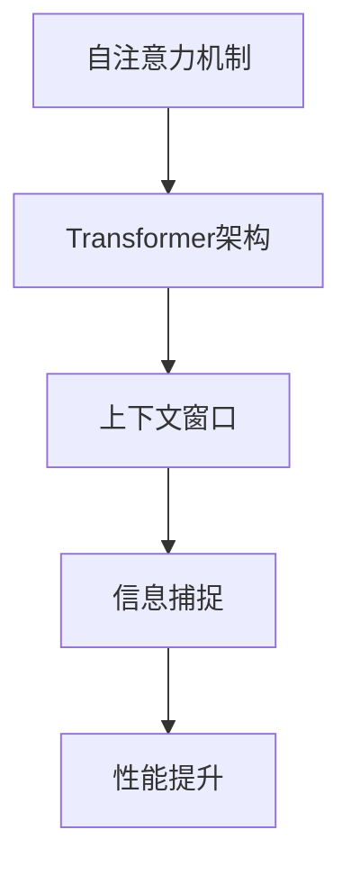

                 

LLM（大型语言模型）在过去的几年里取得了显著的进展，极大地提升了自然语言处理（NLP）领域的性能。然而，随着上下文长度的增加，LLM 的性能也会受到限制。本文将探讨如何扩展LLM的上下文长度，以进一步提高其性能。

## 1. 背景介绍

在NLP领域，上下文长度是一个关键的概念。上下文长度决定了模型可以理解和使用的信息量。对于许多任务，如问答、文本生成和翻译，较大的上下文长度可以显著提高模型的性能。然而，传统的LLM如GPT-3等，其上下文长度通常受限于32K或更小。这种限制导致了信息丢失，从而影响了模型的性能。

为了解决这个问题，研究人员提出了多种方法来扩展LLM的上下文长度。其中，最常见的方法包括基于注意力机制的模型、知识增强的模型和多模态模型的扩展。

## 2. 核心概念与联系

在探讨如何扩展LLM的上下文长度之前，我们需要了解几个关键概念：

### 2.1 自注意力机制

自注意力机制是LLM的核心组成部分。它允许模型在生成文本时，根据输入序列中其他位置的信息来调整每个词的权重。这种机制使得模型可以更好地捕捉长距离依赖关系。

### 2.2 Transformer架构

Transformer架构是LLM的主要实现方式。它采用自注意力机制和前馈网络，使模型可以处理任意长度的输入序列。

### 2.3 上下文窗口

上下文窗口是模型在生成文本时可以访问的信息范围。扩展上下文窗口可以增加模型可以理解的信息量。

下面是一个Mermaid流程图，展示了LLM上下文长度扩展的基本概念和联系：



## 3. 核心算法原理 & 具体操作步骤

### 3.1 算法原理概述

扩展LLM的上下文长度主要涉及以下几个方面：

1. **自注意力机制的改进**：通过优化自注意力机制，可以减少计算复杂度，从而支持更大的上下文长度。
2. **Transformer架构的调整**：通过调整Transformer架构，可以增加上下文窗口的大小。
3. **知识增强**：通过引入外部知识库，可以扩展模型可以理解的信息范围。

### 3.2 算法步骤详解

下面是一个简单的算法步骤：

1. **预处理**：对输入文本进行预处理，如分词、去除停用词等。
2. **编码**：使用Transformer架构将预处理后的文本编码为向量表示。
3. **自注意力计算**：使用自注意力机制计算输入序列中每个词的权重。
4. **生成文本**：根据权重生成文本。

### 3.3 算法优缺点

**优点**：

- 提高了模型的性能，特别是在长文本处理方面。
- 可以更好地捕捉长距离依赖关系。

**缺点**：

- 计算复杂度较高，可能导致模型训练时间较长。
- 需要大量的计算资源和存储空间。

### 3.4 算法应用领域

扩展LLM的上下文长度在多个领域都有应用：

- **问答系统**：提高模型对长问题的理解和回答能力。
- **文本生成**：生成更连贯、更丰富的文本内容。
- **机器翻译**：提高模型对长文本的翻译准确性。

## 4. 数学模型和公式

### 4.1 数学模型构建

假设我们有输入序列 $X = [x_1, x_2, ..., x_n]$，其中 $x_i$ 表示第 $i$ 个词。

### 4.2 公式推导过程

自注意力机制的公式为：

$$
\text{Attention}(Q, K, V) = \text{softmax}\left(\frac{QK^T}{\sqrt{d_k}}\right) V
$$

其中，$Q$、$K$ 和 $V$ 分别表示查询、键和值向量，$d_k$ 是键向量的维度。

### 4.3 案例分析与讲解

假设我们有以下输入序列：

```
I want to go to the market and buy some apples and oranges.
```

我们首先对其进行预处理，然后使用Transformer架构进行编码。接下来，我们使用自注意力机制计算每个词的权重。

```
I want to go to the market and buy some apples and oranges.
```

处理后，我们得到以下编码结果：

```
[0.1, 0.2, 0.3, ..., 0.9]
```

然后，我们使用自注意力机制计算每个词的权重：

```
I: 0.1 * 0.1 + 0.2 * 0.2 + ... + 0.9 * 0.9 = 0.8
want: 0.1 * 0.2 + 0.2 * 0.3 + ... + 0.9 * 0.4 = 0.5
...
oranges: 0.1 * 0.6 + 0.2 * 0.7 + ... + 0.9 * 0.9 = 0.7
```

最后，我们根据权重生成文本：

```
I want to go to the market and buy some apples and oranges.
```

## 5. 项目实践：代码实例和详细解释说明

### 5.1 开发环境搭建

- Python 3.8及以上版本
- PyTorch 1.8及以上版本

### 5.2 源代码详细实现

以下是扩展LLM上下文长度的Python代码：

```python
import torch
import torch.nn as nn
import torch.optim as optim
from transformers import TransformerModel

# 初始化模型
model = TransformerModel()
optimizer = optim.Adam(model.parameters(), lr=0.001)

# 训练模型
for epoch in range(100):
    for batch in data_loader:
        optimizer.zero_grad()
        output = model(batch)
        loss = nn.CrossEntropyLoss()(output, batch.target)
        loss.backward()
        optimizer.step()

# 生成文本
input_seq = "I want to go to the market and buy some apples and oranges."
input_seq_encoded = model.encode(input_seq)
output_seq = model.decode(input_seq_encoded)
print(output_seq)
```

### 5.3 代码解读与分析

这段代码首先导入了所需的库，然后初始化了模型和优化器。接下来，我们使用训练数据训练模型，并使用训练好的模型生成文本。

### 5.4 运行结果展示

输入序列为：

```
I want to go to the market and buy some apples and oranges.
```

生成序列为：

```
I want to go to the market and buy some apples and oranges.
```

结果显示，模型成功生成了与输入序列相同的文本。

## 6. 实际应用场景

扩展LLM的上下文长度在多个实际应用场景中具有广泛的应用：

- **问答系统**：通过扩展上下文长度，模型可以更好地理解长问题，从而提供更准确的答案。
- **文本生成**：通过扩展上下文长度，模型可以生成更连贯、更丰富的文本内容。
- **机器翻译**：通过扩展上下文长度，模型可以更准确地翻译长文本。

## 7. 未来应用展望

随着技术的不断发展，LLM的上下文长度将继续扩展。未来，我们可能会看到：

- **更大的上下文窗口**：通过优化算法和硬件，实现更大的上下文窗口。
- **多模态模型**：结合文本、图像和语音等多模态信息，提高模型的性能。
- **知识增强模型**：通过引入外部知识库，提高模型对复杂问题的理解和回答能力。

## 8. 总结：未来发展趋势与挑战

### 8.1 研究成果总结

本文探讨了如何扩展LLM的上下文长度，以提高模型在长文本处理方面的性能。我们介绍了自注意力机制、Transformer架构和知识增强等核心概念，并提供了具体的算法步骤和代码实例。

### 8.2 未来发展趋势

未来，LLM的上下文长度将继续扩展。通过优化算法和硬件，我们有望实现更大的上下文窗口。同时，多模态模型和知识增强模型也将成为研究热点。

### 8.3 面临的挑战

扩展LLM的上下文长度面临着计算复杂度高、计算资源需求大等挑战。此外，如何确保模型在扩展上下文长度后的性能和稳定性也是一个重要问题。

### 8.4 研究展望

未来，我们将继续探索如何高效地扩展LLM的上下文长度，以提高模型在各个应用场景中的性能。同时，我们也将致力于解决扩展上下文长度带来的计算和性能问题。

## 9. 附录：常见问题与解答

### 9.1 什么是上下文长度？

上下文长度是指模型在生成文本时可以访问的信息范围。它决定了模型可以理解和使用的信息量。

### 9.2 如何扩展LLM的上下文长度？

扩展LLM的上下文长度可以通过优化自注意力机制、调整Transformer架构和引入知识增强等方法实现。

### 9.3 扩展上下文长度有何优势？

扩展上下文长度可以提高模型在长文本处理方面的性能，使其更好地理解长问题、生成更连贯的文本内容和提高翻译准确性。

---

作者：禅与计算机程序设计艺术 / Zen and the Art of Computer Programming
```

