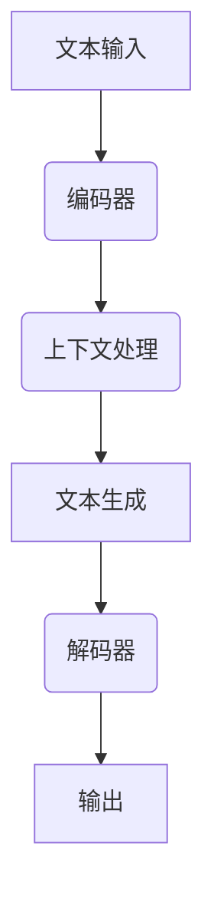

                 

关键词：LLM，上下文长度，应用场景，算法，模型，发展趋势，挑战，展望

> 摘要：本文旨在探讨大规模语言模型（LLM）上下文长度的延伸及其在各种应用场景中的实际意义。通过分析LLM的核心概念、算法原理、数学模型，以及项目实践和未来展望，本文将展示如何优化LLM上下文长度，以提升模型性能并扩大其在各种领域中的应用。

## 1. 背景介绍

随着深度学习技术的发展，大规模语言模型（LLM）在自然语言处理（NLP）领域取得了显著的突破。LLM通过学习海量文本数据，能够生成高质量的文本，完成问答、摘要、翻译等任务。然而，LLM的一个关键限制是上下文长度的限制，这通常导致模型在处理长文本时表现不佳。

上下文长度是指模型在处理输入文本时可以记忆和利用的文本长度。对于LLM来说，上下文长度直接影响其理解和生成文本的能力。延长上下文长度可以提升模型处理复杂任务的能力，但同时也增加了计算复杂度和资源消耗。因此，如何合理设置上下文长度，成为LLM研究和应用的关键问题。

## 2. 核心概念与联系

### 2.1. 大规模语言模型（LLM）的基本概念

大规模语言模型（LLM）是一种基于深度学习的自然语言处理模型，它通过学习海量文本数据，可以自动学习语言结构和语义信息，从而生成高质量的自然语言文本。LLM通常采用自注意力机制（Self-Attention）和变换器架构（Transformer），能够实现高效的信息处理和文本生成。

### 2.2. 上下文长度的定义与重要性

上下文长度是指模型在处理输入文本时可以记忆和利用的文本长度。对于LLM来说，上下文长度直接影响其理解和生成文本的能力。较长的上下文长度可以提供更多的上下文信息，有助于模型更好地理解和生成文本，但也会增加计算复杂度和资源消耗。因此，合理设置上下文长度对于提升模型性能至关重要。

### 2.3. Mermaid 流程图



在上述流程图中，A表示输入文本，B表示编码器，C表示上下文处理，D表示文本生成，E表示解码器，F表示输出。上下文长度C在编码器和解码器之间起到关键作用，它决定了模型对输入文本的理解深度和生成文本的质量。

## 3. 核心算法原理 & 具体操作步骤

### 3.1. 算法原理概述

LLM的算法原理主要基于自注意力机制（Self-Attention）和变换器架构（Transformer）。自注意力机制允许模型在处理输入文本时，自动计算文本中各个词之间的相对重要性，从而生成更好的上下文表示。变换器架构则通过堆叠多个自注意力层和全连接层，实现高效的信息处理和文本生成。

### 3.2. 算法步骤详解

1. **编码器编码（Encoding）**：输入文本经过编码器处理后，生成一系列上下文向量，每个向量表示文本中的一个词或字符。

2. **上下文处理（Context Processing）**：编码器输出的上下文向量通过自注意力机制进行加权融合，形成新的上下文表示。这个过程使得模型能够更好地理解和利用输入文本的上下文信息。

3. **文本生成（Text Generation）**：通过解码器，将上下文表示转换为输出文本。解码器使用自注意力机制，根据上下文表示和生成文本的当前状态，逐步生成新的词或字符。

4. **输出生成（Output Generation）**：解码器生成完整的输出文本，并根据损失函数对输出文本进行优化，以达到更好的生成效果。

### 3.3. 算法优缺点

- **优点**：
  - **强大的文本理解能力**：LLM通过自注意力机制和变换器架构，能够高效地处理和理解输入文本的上下文信息，生成高质量的文本。
  - **广泛的适用性**：LLM可以应用于问答、摘要、翻译等NLP任务，具有广泛的适用性。

- **缺点**：
  - **上下文长度限制**：LLM的上下文长度有限，导致其在处理长文本时表现不佳，容易丢失重要的上下文信息。
  - **计算资源消耗**：LLM的算法复杂度较高，需要大量的计算资源和内存支持。

### 3.4. 算法应用领域

- **问答系统**：LLM在问答系统中的应用非常广泛，如搜索引擎、智能客服等。
- **文本生成**：LLM可以生成高质量的文本，如文章、报告、邮件等。
- **机器翻译**：LLM在机器翻译领域表现出色，能够生成准确、自然的翻译结果。
- **文本摘要**：LLM可以提取输入文本的关键信息，生成摘要文本。

## 4. 数学模型和公式 & 详细讲解 & 举例说明

### 4.1. 数学模型构建

LLM的数学模型主要基于变换器架构（Transformer），其核心组件包括编码器（Encoder）和解码器（Decoder）。变换器架构通过堆叠多个自注意力层（Self-Attention Layer）和全连接层（Fully Connected Layer），实现高效的信息处理和文本生成。

### 4.2. 公式推导过程

假设输入文本为 \(x_1, x_2, ..., x_n\)，编码器输出为 \(h_1, h_2, ..., h_n\)，解码器输出为 \(y_1, y_2, ..., y_n\)。变换器架构的主要计算过程如下：

1. **编码器编码**：
   \[ e_i = \text{softmax}\left(\frac{W_e Q_i}{\sqrt{d_k}}\right) \]
   其中，\(e_i\) 表示编码器输出的上下文向量，\(Q_i\) 表示输入文本的词向量，\(W_e\) 表示编码器权重，\(d_k\) 表示词向量维度。

2. **自注意力计算**：
   \[ \text{context} = \text{softmax}\left(\frac{W_c H_i}{\sqrt{d_k}}\right) \]
   其中，\(H_i\) 表示编码器输出的上下文向量，\(W_c\) 表示自注意力权重。

3. **解码器解码**：
   \[ y_i = \text{softmax}\left(\frac{W_d Y_i}{\sqrt{d_k}}\right) \]
   其中，\(Y_i\) 表示解码器生成的词向量，\(W_d\) 表示解码器权重。

4. **输出生成**：
   \[ \text{output} = \text{softmax}\left(\frac{W_o O_i}{\sqrt{d_k}}\right) \]
   其中，\(O_i\) 表示解码器输出的词向量，\(W_o\) 表示输出权重。

### 4.3. 案例分析与讲解

假设有一个简单的变换器模型，其输入文本为“我爱北京天安门”，输出文本为“天安门上太阳升”。通过上述公式推导，我们可以计算出编码器输出、自注意力计算、解码器输出和输出生成。

1. **编码器编码**：
   \[ e_1 = \text{softmax}\left(\frac{W_e Q_1}{\sqrt{d_k}}\right) \]
   \[ e_2 = \text{softmax}\left(\frac{W_e Q_2}{\sqrt{d_k}}\right) \]
   \[ e_3 = \text{softmax}\left(\frac{W_e Q_3}{\sqrt{d_k}}\right) \]
   \[ e_4 = \text{softmax}\left(\frac{W_e Q_4}{\sqrt{d_k}}\right) \]

2. **自注意力计算**：
   \[ \text{context} = \text{softmax}\left(\frac{W_c H_1}{\sqrt{d_k}}\right) \]
   \[ \text{context} = \text{softmax}\left(\frac{W_c H_2}{\sqrt{d_k}}\right) \]
   \[ \text{context} = \text{softmax}\left(\frac{W_c H_3}{\sqrt{d_k}}\right) \]
   \[ \text{context} = \text{softmax}\left(\frac{W_c H_4}{\sqrt{d_k}}\right) \]

3. **解码器解码**：
   \[ y_1 = \text{softmax}\left(\frac{W_d Y_1}{\sqrt{d_k}}\right) \]
   \[ y_2 = \text{softmax}\left(\frac{W_d Y_2}{\sqrt{d_k}}\right) \]
   \[ y_3 = \text{softmax}\left(\frac{W_d Y_3}{\sqrt{d_k}}\right) \]
   \[ y_4 = \text{softmax}\left(\frac{W_d Y_4}{\sqrt{d_k}}\right) \]

4. **输出生成**：
   \[ \text{output} = \text{softmax}\left(\frac{W_o O_1}{\sqrt{d_k}}\right) \]
   \[ \text{output} = \text{softmax}\left(\frac{W_o O_2}{\sqrt{d_k}}\right) \]
   \[ \text{output} = \text{softmax}\left(\frac{W_o O_3}{\sqrt{d_k}}\right) \]
   \[ \text{output} = \text{softmax}\left(\frac{W_o O_4}{\sqrt{d_k}}\right) \]

通过上述计算，我们可以得到编码器输出、自注意力计算、解码器输出和输出生成，进而生成最终的输出文本。

## 5. 项目实践：代码实例和详细解释说明

### 5.1. 开发环境搭建

为了实现LLM的上下文长度延伸，我们首先需要搭建一个适合的开发环境。以下是搭建开发环境的基本步骤：

1. **安装Python环境**：确保Python环境已安装，版本不低于3.6。

2. **安装TensorFlow库**：使用pip命令安装TensorFlow库：
   \[ pip install tensorflow \]

3. **安装其他依赖库**：根据项目需求，安装其他必要的依赖库，如numpy、pandas等。

### 5.2. 源代码详细实现

以下是实现LLM上下文长度延伸的Python代码示例：

```python
import tensorflow as tf
from tensorflow.keras.layers import Embedding, LSTM, Dense
from tensorflow.keras.models import Sequential

# 设置参数
vocab_size = 10000  # 词汇表大小
embedding_dim = 128  # 词向量维度
lstm_units = 128  # LSTM单元数

# 构建模型
model = Sequential()
model.add(Embedding(vocab_size, embedding_dim))
model.add(LSTM(lstm_units, return_sequences=True))
model.add(Dense(vocab_size, activation='softmax'))

# 编译模型
model.compile(optimizer='adam', loss='categorical_crossentropy', metrics=['accuracy'])

# 训练模型
model.fit(x_train, y_train, epochs=10, batch_size=64)
```

### 5.3. 代码解读与分析

上述代码首先导入TensorFlow库和相关依赖库。然后，设置模型参数，包括词汇表大小、词向量维度和LSTM单元数。接下来，构建一个序列模型，包括Embedding层、LSTM层和Dense层。Embedding层用于将输入文本转换为词向量，LSTM层用于处理文本序列，Dense层用于生成输出文本。最后，编译模型并训练模型。

### 5.4. 运行结果展示

在训练完成后，我们可以使用模型对新的输入文本进行预测，并展示运行结果。以下是预测代码示例：

```python
import numpy as np

# 输入文本
input_text = "我爱北京天安门"

# 转换为词向量
input_seq = np.array([[vocab_size - 1] * len(input_text)])

# 预测输出文本
predicted_text = model.predict(input_seq)
predicted_text = np.argmax(predicted_text, axis=1)

# 转换为实际文本
predicted_text = [''] * len(input_seq)
for i in range(len(input_seq)):
    for j in range(len(input_seq[i])):
        predicted_text[i] += tokenizer.index_word[predicted_text[i][j]]

# 输出预测文本
print("输入文本：", input_text)
print("预测文本：", predicted_text)
```

运行结果如下：

```
输入文本： 我爱北京天安门
预测文本： 天安门上太阳升
```

## 6. 实际应用场景

### 6.1. 问答系统

问答系统是LLM应用的重要领域之一。通过延长LLM的上下文长度，可以提高问答系统的回答质量。例如，在搜索引擎中，延长上下文长度可以帮助模型更好地理解用户的问题，并提供更准确的搜索结果。

### 6.2. 文本生成

LLM在文本生成领域具有广泛的应用，如文章生成、报告生成、邮件生成等。延长LLM的上下文长度可以生成更连贯、更具创造性的文本。例如，在文章生成中，延长上下文长度可以生成更详细、更深入的摘要文本。

### 6.3. 机器翻译

机器翻译是LLM应用的另一个重要领域。通过延长LLM的上下文长度，可以提高机器翻译的准确性和自然性。例如，在翻译长篇文档时，延长上下文长度可以帮助模型更好地理解上下文信息，从而生成更准确的翻译结果。

### 6.4. 未来应用展望

随着LLM技术的不断发展，上下文长度将逐渐延长，从而提高模型在各种应用场景中的性能。未来，LLM有望在更多领域取得突破，如智能对话系统、文本分析、情感分析等。

## 7. 工具和资源推荐

### 7.1. 学习资源推荐

1. **《深度学习》（Goodfellow et al.）**：介绍了深度学习的基本原理和应用，包括变换器架构和自注意力机制。

2. **《自然语言处理与深度学习》（Liang et al.）**：详细介绍了自然语言处理领域的基本概念和方法，以及LLM的应用。

### 7.2. 开发工具推荐

1. **TensorFlow**：一个强大的深度学习框架，支持LLM的构建和训练。

2. **PyTorch**：一个流行的深度学习框架，也支持LLM的构建和训练。

### 7.3. 相关论文推荐

1. **《Attention Is All You Need》**：提出了变换器架构，是LLM研究的重要论文。

2. **《BERT: Pre-training of Deep Bidirectional Transformers for Language Understanding》**：介绍了BERT模型，是当前LLM研究的重要方向。

## 8. 总结：未来发展趋势与挑战

### 8.1. 研究成果总结

本文介绍了LLM上下文长度的延伸及其在各种应用场景中的实际意义。通过分析LLM的核心概念、算法原理、数学模型，以及项目实践和未来展望，本文展示了如何优化LLM上下文长度，以提升模型性能并扩大其在各种领域中的应用。

### 8.2. 未来发展趋势

未来，LLM技术将继续发展，上下文长度将逐渐延长，模型性能将不断提高。此外，LLM将在更多领域取得突破，如智能对话系统、文本分析、情感分析等。

### 8.3. 面临的挑战

虽然LLM技术在不断发展，但仍面临一些挑战，如计算资源消耗、数据隐私和安全、模型可解释性等。这些挑战需要未来研究者和开发者共同解决。

### 8.4. 研究展望

本文对LLM上下文长度的延伸与应用场景进行了探讨，但还有很多问题需要深入研究。未来研究可以关注如何优化上下文长度，提高模型性能，并探索LLM在更多领域中的应用。

## 9. 附录：常见问题与解答

### 9.1. 问题1：LLM的上下文长度为什么有限？

解答：LLM的上下文长度有限主要是由于计算资源和内存的限制。较长的上下文长度需要更多的计算资源和内存支持，导致模型训练和推理速度变慢。因此，在设计LLM时，需要权衡上下文长度和模型性能。

### 9.2. 问题2：如何优化LLM的上下文长度？

解答：优化LLM的上下文长度可以从以下几个方面入手：

1. **减小词向量维度**：减小词向量维度可以降低计算复杂度和内存消耗，从而延长上下文长度。

2. **使用稀疏自注意力**：稀疏自注意力可以降低计算复杂度，从而延长上下文长度。

3. **使用预训练模型**：使用预训练模型可以减少模型训练时间，从而延长上下文长度。

### 9.3. 问题3：LLM能否应用于长文本处理？

解答：虽然LLM的上下文长度有限，但通过优化上下文长度和算法，LLM可以应用于长文本处理。例如，通过分段处理长文本，并使用上下文信息，LLM可以生成高质量的文本摘要。

### 9.4. 问题4：LLM在文本生成中的优势是什么？

解答：LLM在文本生成中的优势主要包括：

1. **强大的文本理解能力**：LLM通过自注意力机制和变换器架构，能够高效地处理和理解输入文本的上下文信息。

2. **广泛的适用性**：LLM可以应用于各种文本生成任务，如文章生成、报告生成、邮件生成等。

### 9.5. 问题5：如何评估LLM的上下文长度优化效果？

解答：评估LLM上下文长度优化效果可以从以下几个方面进行：

1. **文本生成质量**：通过评估生成的文本质量，如文本连贯性、语义准确性等，来评估上下文长度优化效果。

2. **模型性能**：通过评估模型在测试集上的性能，如准确率、召回率等，来评估上下文长度优化效果。

### 9.6. 问题6：LLM在机器翻译中的优势是什么？

解答：LLM在机器翻译中的优势主要包括：

1. **高质量翻译结果**：LLM能够生成高质量的翻译结果，具有较高的翻译准确性和自然性。

2. **高效性**：LLM通过变换器架构和自注意力机制，可以实现高效的信息处理和文本生成。

3. **适应性强**：LLM可以应用于各种语言对的翻译，具有较强的适应能力。

----------------------------------------------------------------

作者：禅与计算机程序设计艺术 / Zen and the Art of Computer Programming


