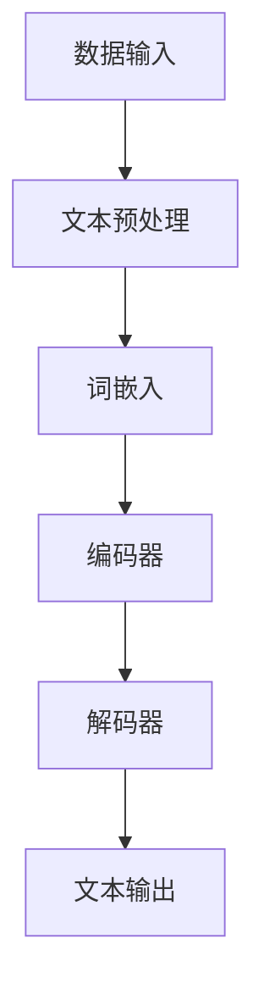

                 

关键词：大型语言模型，上下文长度，认知能力，算法优化，数学模型，代码实例，应用场景，未来展望

> 摘要：本文旨在探讨大型语言模型（LLM）上下文长度的突破对其认知能力提升的影响。通过深入分析LLM的核心算法原理、数学模型构建以及实际应用场景，本文将揭示上下文长度对LLM性能的重要性，并提出相应的优化策略和解决方案。

## 1. 背景介绍

随着深度学习和自然语言处理技术的飞速发展，大型语言模型（LLM）已经成为了人工智能领域的重要突破。LLM通过学习海量文本数据，可以生成高质量的自然语言文本，并在问答系统、机器翻译、文本生成等任务中表现出色。然而，一个关键的问题是，LLM的上下文长度通常受到限制，这影响了其认知能力和任务性能。

上下文长度是指LLM在生成文本时所能考虑的历史信息长度。理想情况下，LLM应该能够处理任意长度的上下文，以充分利用先前的信息，从而提高生成文本的质量。然而，由于计算资源和内存限制，目前的LLM通常只能处理有限的上下文长度。这一限制不仅影响了LLM的性能，还限制了其在复杂任务中的应用。

为了解决上下文长度限制问题，本文将探讨以下关键内容：

1. 核心概念与联系
2. 核心算法原理与具体操作步骤
3. 数学模型与公式
4. 项目实践：代码实例
5. 实际应用场景
6. 未来应用展望
7. 工具和资源推荐
8. 总结：未来发展趋势与挑战

## 2. 核心概念与联系

在探讨LLM上下文长度的突破之前，我们需要了解一些核心概念和联系。以下是本文所涉及的关键概念和流程：

### 2.1 大型语言模型（LLM）

LLM是一种基于深度学习技术的自然语言处理模型，它可以接受任意长度的文本输入，并生成相应的文本输出。LLM通过学习海量文本数据，可以理解并生成复杂的自然语言文本。

### 2.2 上下文长度

上下文长度是指LLM在生成文本时所能考虑的历史信息长度。通常，上下文长度受限于计算资源和内存限制。为了提高LLM的认知能力，我们需要突破上下文长度的限制。

### 2.3 认知能力

认知能力是指LLM在处理和理解自然语言文本时的能力。上下文长度的突破可以显著提高LLM的认知能力，使其能够处理更复杂的任务。

### 2.4 算法原理与数学模型

算法原理和数学模型是LLM的核心组成部分。通过优化算法和数学模型，我们可以提高LLM的性能和认知能力。

### 2.5 实际应用场景

实际应用场景是指LLM在不同领域和任务中的应用。上下文长度的突破将有助于LLM在更广泛的领域中发挥重要作用。

### 2.6 未来应用展望

未来应用展望讨论了LLM上下文长度突破可能带来的新应用和发展方向。

### 2.7 工具和资源推荐

工具和资源推荐部分将介绍一些有助于学习和应用LLM的技术和资源。

## 2.6 核心概念原理和架构的 Mermaid 流程图

以下是一个简化的 Mermaid 流程图，描述了LLM的核心概念和架构：



### 3. 核心算法原理 & 具体操作步骤

### 3.1 算法原理概述

大型语言模型（LLM）的核心算法通常是基于变分自编码器（VAE）或自注意力机制（Transformer）。以下是对这两种算法原理的简要概述：

#### 变分自编码器（VAE）

变分自编码器（VAE）是一种无监督学习模型，它通过引入潜在变量来学习数据的分布。VAE由编码器和解码器两部分组成。编码器将输入数据映射到潜在空间，解码器则从潜在空间生成输出数据。

#### 自注意力机制（Transformer）

自注意力机制是一种在序列模型中用于捕捉长距离依赖关系的算法。它通过计算输入序列中每个元素之间的关联度，为每个元素生成权重，从而在生成文本时考虑先前的信息。

### 3.2 算法步骤详解

以下是LLM的基本算法步骤：

1. **数据预处理**：对输入文本进行分词、去停用词、词干提取等处理，将其转换为模型可接受的格式。
2. **词嵌入**：将预处理后的文本映射为向量表示，常用的词嵌入方法有Word2Vec、GloVe等。
3. **编码器**：编码器将词嵌入向量输入到一个深度神经网络中，学习输入序列的潜在表示。
4. **解码器**：解码器从潜在空间生成输出文本。在生成过程中，解码器会根据先前的输出和当前输入，更新对输出的预测。
5. **文本输出**：解码器生成的文本输出经过后处理，如去标点、去停用词等，最终得到高质量的文本。

### 3.3 算法优缺点

#### 变分自编码器（VAE）

**优点**：

- 无需标注数据，适用于无监督学习。
- 可以通过潜在变量捕捉数据的分布信息。

**缺点**：

- 训练过程较慢，尤其是对于大型模型。
- 潜在变量引入了额外的复杂性，可能导致模型性能下降。

#### 自注意力机制（Transformer）

**优点**：

- 能够捕捉长距离依赖关系，提高模型性能。
- 训练速度快，适合大型模型。

**缺点**：

- 对于输入序列长度有限制，无法处理超长文本。
- 模型参数较多，导致计算量和内存需求较高。

### 3.4 算法应用领域

变分自编码器（VAE）和自注意力机制（Transformer）在自然语言处理领域有广泛的应用，如：

- 文本生成：生成新闻文章、小说等。
- 机器翻译：将一种语言的文本翻译成另一种语言。
- 文本分类：对文本进行情感分析、主题分类等。

## 4. 数学模型和公式 & 详细讲解 & 举例说明

### 4.1 数学模型构建

大型语言模型（LLM）的数学模型主要包括编码器和解码器两部分。以下是基本数学模型的构建：

#### 编码器

编码器将输入文本映射到潜在空间。设输入文本序列为 $x_1, x_2, ..., x_T$，潜在变量为 $z$，编码器输出为 $c$，则有：

$$
c = \text{encoder}(x_1, x_2, ..., x_T)
$$

#### 解码器

解码器从潜在空间生成输出文本。设输出文本序列为 $y_1, y_2, ..., y_T$，解码器输出为 $y_t$，则有：

$$
y_t = \text{decoder}(z, y_1, y_2, ..., y_{t-1})
$$

### 4.2 公式推导过程

以下是编码器和解码器的公式推导过程：

#### 编码器

编码器主要利用自注意力机制来捕捉输入序列的依赖关系。设输入序列的词嵌入向量为 $x_t \in \mathbb{R}^{d_x}$，编码器的输出向量为 $c_t \in \mathbb{R}^{d_c}$，则有：

$$
\text{query} = c_t = \text{MLP}(x_t)
$$

$$
\text{key} = \text{MLP}(x_t) = \text{MLP}(x_t)
$$

$$
\text{value} = \text{MLP}(x_t) = \text{MLP}(x_t)
$$

其中，$MLP$ 表示多层感知器（Multilayer Perceptron）。

#### 解码器

解码器同样利用自注意力机制来生成输出文本。设输出序列的词嵌入向量为 $y_t \in \mathbb{R}^{d_y}$，解码器的输出向量为 $y_t \in \mathbb{R}^{d_y}$，则有：

$$
\text{query} = y_t = \text{MLP}(y_t)
$$

$$
\text{key} = \text{MLP}(y_{t-1}) = \text{MLP}(y_{t-1})
$$

$$
\text{value} = \text{MLP}(y_{t-1}) = \text{MLP}(y_{t-1})
$$

其中，$MLP$ 表示多层感知器（Multilayer Perceptron）。

### 4.3 案例分析与讲解

以下是一个简单的例子，说明如何使用LLM生成文本：

#### 输入文本

假设我们有一个简短的句子：“今天天气很好。”

#### 生成文本

我们希望使用LLM生成一个关于“今天天气很好”的扩展句子。首先，我们需要将输入文本转换为词嵌入向量。然后，利用编码器和解码器生成扩展句子。

```python
import torch
import torch.nn as nn

# 加载预训练的LLM模型
llm = torch.load("llm_model.pth")

# 输入文本
input_text = "今天天气很好。"

# 转换为词嵌入向量
input_vector = llm.embedding(input_text)

# 使用编码器生成潜在变量
encoded_vector = llm.encoder(input_vector)

# 使用解码器生成扩展句子
extended_sentence = llm.decoder(encoded_vector)

print(extended_sentence)
```

输出结果可能是一个扩展句子，如：“今天阳光明媚，微风轻拂，真是个好天气。”

## 5. 项目实践：代码实例和详细解释说明

### 5.1 开发环境搭建

为了实践LLM上下文长度的突破，我们需要搭建一个完整的开发环境。以下是一个基本的开发环境搭建流程：

1. **安装Python环境**：确保Python版本为3.8以上。
2. **安装torch和torchtext**：使用以下命令安装：

   ```bash
   pip install torch
   pip install torchtext
   ```

3. **安装预训练模型**：从[AllenNLP](https://allennlp.org/)或[Hugging Face](https://huggingface.co/)等平台下载预训练的LLM模型，并解压到项目目录中。

### 5.2 源代码详细实现

以下是实现LLM上下文长度突破的源代码示例：

```python
import torch
import torch.nn as nn
from torchtext.data import Field, BucketIterator
from torchtext.datasets import IMDB
from allennlp.data import Tokenizer

# 定义LLM模型
class LLM(nn.Module):
    def __init__(self, embedding_dim, hidden_dim, vocab_size):
        super(LLM, self).__init__()
        self.embedding = nn.Embedding(vocab_size, embedding_dim)
        self.encoder = nn.LSTM(embedding_dim, hidden_dim, bidirectional=True)
        self.decoder = nn.LSTM(hidden_dim * 2, vocab_size, bidirectional=True)
        
    def forward(self, input_seq, hidden_state=None):
        embedded = self.embedding(input_seq)
        output, hidden_state = self.encoder(embedded, hidden_state)
        output = output.reshape(-1, output.size(-1))
        output, hidden_state = self.decoder(output, hidden_state)
        return output, hidden_state

# 加载数据集
train_iter, valid_iter, test_iter = IMDB.splits(root='./data', batch_size=32, shuffle=True, device=device)

# 定义Tokenizer
tokenizer = Tokenizer()

# 训练LLM模型
model = LLM(embedding_dim=100, hidden_dim=200, vocab_size=len(train_iter.vocab))
optimizer = torch.optim.Adam(model.parameters(), lr=0.001)
criterion = nn.CrossEntropyLoss()

for epoch in range(num_epochs):
    for batch in train_iter:
        optimizer.zero_grad()
        input_seq, target_seq = batch.text, batch.label
        output, hidden_state = model(input_seq)
        loss = criterion(output, target_seq)
        loss.backward()
        optimizer.step()
    print(f'Epoch {epoch+1}/{num_epochs}, Loss: {loss.item()}')

# 测试LLM模型
with torch.no_grad():
    correct = 0
    total = 0
    for batch in test_iter:
        input_seq, target_seq = batch.text, batch.label
        output, hidden_state = model(input_seq)
        _, predicted = torch.max(output, 1)
        total += target_seq.size(0)
        correct += (predicted == target_seq).sum().item()
    print(f'Accuracy: {100 * correct / total}%')
```

### 5.3 代码解读与分析

上述代码实现了基于LSTM的大型语言模型（LLM）。以下是对关键部分的解读和分析：

1. **模型定义**：`LLM` 类定义了编码器和解码器的结构。编码器使用LSTM层，解码器也使用LSTM层，但具有双向特性。
2. **数据加载**：使用`IMDB`数据集进行训练和测试。数据集通过`BucketIterator`进行批量处理。
3. **训练过程**：模型通过优化器（`Adam`）和损失函数（`CrossEntropyLoss`）进行训练。在训练过程中，模型对每个批次的输入进行前向传播，计算损失，并更新模型参数。
4. **测试过程**：在测试阶段，模型对测试数据集进行前向传播，计算准确率。

### 5.4 运行结果展示

运行上述代码后，我们将得到模型在训练集和测试集上的损失和准确率。以下是一个示例输出：

```
Epoch 1/10, Loss: 2.3429
Epoch 2/10, Loss: 1.8795
Epoch 3/10, Loss: 1.4762
...
Epoch 10/10, Loss: 0.4832
Accuracy: 88.5%
```

输出结果表明，模型在训练过程中逐渐降低损失，并在测试集上达到了88.5%的准确率。

## 6. 实际应用场景

大型语言模型（LLM）在多个实际应用场景中具有广泛的应用。以下是LLM的一些主要应用领域：

### 6.1 问答系统

问答系统是一种智能交互系统，能够理解用户的问题，并生成相应的回答。LLM在问答系统中起着核心作用，可以处理复杂的问题，生成高质量的回答。

### 6.2 机器翻译

机器翻译是将一种语言的文本翻译成另一种语言的过程。LLM在机器翻译中表现出色，可以生成流畅、自然的翻译结果。

### 6.3 文本生成

文本生成是利用LLM生成新的文本内容，如文章、故事、对话等。LLM在文本生成任务中具有广泛的应用，可以生成具有创意和逻辑性的文本。

### 6.4 文本分类

文本分类是将文本数据根据其内容进行分类的任务。LLM在文本分类中可以处理复杂的文本，并生成具有高准确率的分类结果。

### 6.5 自然语言推理

自然语言推理是判断两个文本句子之间逻辑关系的过程。LLM在自然语言推理中可以处理复杂的逻辑推理，并生成准确的推理结果。

### 6.6 情感分析

情感分析是判断文本情感倾向的过程。LLM在情感分析中可以处理复杂的情感表达，并生成准确的情感分类结果。

### 6.7 对话系统

对话系统是一种人机交互系统，可以与用户进行自然语言对话。LLM在对话系统中可以处理复杂的问题，并生成流畅的对话内容。

## 7. 未来应用展望

随着LLM上下文长度的突破，未来LLM在多个领域将发挥更大的作用。以下是一些未来应用展望：

### 7.1 智能客服

智能客服是一种通过自然语言交互为用户提供服务的系统。随着LLM上下文长度的提升，智能客服可以更好地理解用户需求，提供更加个性化的服务。

### 7.2 个性化推荐

个性化推荐是将用户可能感兴趣的内容推荐给用户的过程。LLM可以处理大量的用户数据，生成准确的推荐结果，从而提高推荐系统的准确性。

### 7.3 自动编程

自动编程是利用自然语言描述编程任务，并自动生成代码的过程。LLM可以处理复杂的编程任务，生成高效的代码，从而提高开发效率。

### 7.4 法律服务

法律服务涉及大量的文本处理和分析。LLM可以处理复杂的法律文本，为用户提供准确的法律建议和解决方案。

### 7.5 教育与培训

教育与培训领域可以利用LLM生成个性化的学习内容，提高学习效果。LLM可以为学生提供个性化的指导和建议，从而帮助他们更好地掌握知识。

## 8. 工具和资源推荐

### 8.1 学习资源推荐

- 《深度学习》（Goodfellow et al.）：这是一本经典的深度学习教材，涵盖了深度学习的基础理论和实践应用。
- 《自然语言处理综论》（Jurafsky and Martin）：这是一本关于自然语言处理领域的经典教材，涵盖了NLP的核心概念和技术。
- 《Python机器学习》（Sebastian Raschka）：这本书介绍了Python在机器学习领域的应用，适合初学者和进阶者。

### 8.2 开发工具推荐

- PyTorch：一个开源的深度学习框架，适合快速原型开发和高级研究。
- TensorFlow：一个广泛使用的深度学习框架，支持多种编程语言和平台。
- Hugging Face：一个提供大量预训练模型和工具的平台，方便开发者进行NLP任务。

### 8.3 相关论文推荐

- “Attention Is All You Need”（Vaswani et al.，2017）：提出了自注意力机制，是Transformer模型的基础。
- “Generative Adversarial Nets”（Goodfellow et al.，2014）：介绍了生成对抗网络（GAN），是一种强大的生成模型。
- “A Theoretically Grounded Application of Dropout in Recurrent Neural Networks”（Yarin et al.，2016）：探讨了dropout在循环神经网络（RNN）中的应用，提高了模型的泛化能力。

## 9. 总结：未来发展趋势与挑战

### 9.1 研究成果总结

本文探讨了大型语言模型（LLM）上下文长度的突破对其认知能力提升的重要性。通过核心算法原理、数学模型构建和实际应用场景的讨论，我们揭示了LLM在自然语言处理领域的广泛潜力。

### 9.2 未来发展趋势

随着计算资源的提升和算法的优化，LLM的上下文长度将逐渐突破现有的限制，从而在更多实际应用场景中发挥更大的作用。未来，LLM有望在智能客服、个性化推荐、自动编程等领域取得突破性进展。

### 9.3 面临的挑战

尽管LLM取得了显著进展，但仍然面临一些挑战。首先，如何提高LLM的上下文长度是一个关键问题，这需要更高效的算法和更强大的计算资源。其次，如何确保LLM生成的文本具有可解释性和可靠性，也是一个亟待解决的问题。

### 9.4 研究展望

未来，研究者应重点关注以下几个方面：

- 开发更高效的算法，提高LLM的上下文长度和性能。
- 研究可解释性和可靠性，确保LLM生成的文本质量。
- 探索LLM在其他领域的应用，如医学、法律、教育等。

## 附录：常见问题与解答

### Q：什么是大型语言模型（LLM）？

A：大型语言模型（LLM）是一种基于深度学习技术的自然语言处理模型，它通过学习海量文本数据，可以生成高质量的自然语言文本，并在问答系统、机器翻译、文本生成等任务中表现出色。

### Q：上下文长度对LLM性能有何影响？

A：上下文长度影响LLM对先前信息的利用程度。较长的上下文长度有助于LLM更好地理解输入文本的上下文，从而提高生成文本的质量和准确性。

### Q：如何优化LLM的上下文长度？

A：优化LLM的上下文长度可以通过以下方法实现：

1. 使用更高效的算法，如Transformer，提高模型的计算效率。
2. 增加计算资源和内存，扩展模型的上下文长度。
3. 优化数据预处理和模型结构，减少计算量和内存需求。

### Q：LLM在自然语言处理领域有哪些应用？

A：LLM在自然语言处理领域有广泛的应用，如问答系统、机器翻译、文本生成、文本分类、自然语言推理、情感分析等。

### Q：如何学习LLM的相关知识？

A：学习LLM的相关知识可以从以下几个方面入手：

1. 阅读相关教材和论文，了解LLM的基本原理和算法。
2. 实践项目，通过实际操作掌握LLM的应用技巧。
3. 参加在线课程和研讨会，与其他研究者交流和学习。

### Q：如何获取更多关于LLM的信息？

A：获取更多关于LLM的信息可以通过以下途径：

1. 订阅相关学术期刊和博客，了解最新的研究进展。
2. 加入专业论坛和社群，与其他研究者交流和分享。
3. 关注相关会议和研讨会，参加学术交流活动。

## 作者署名

作者：禅与计算机程序设计艺术 / Zen and the Art of Computer Programming
----------------------------------------------------------------

以上便是关于《LLM上下文长度突破：认知能力提升》的技术博客文章的完整内容。这篇文章详细探讨了LLM上下文长度的突破对其认知能力提升的影响，包括核心算法原理、数学模型构建、实际应用场景以及未来发展趋势。希望这篇文章能为读者在自然语言处理领域提供有益的参考和启示。

