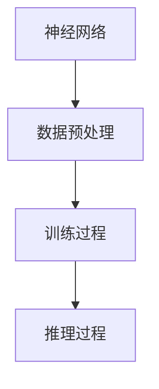
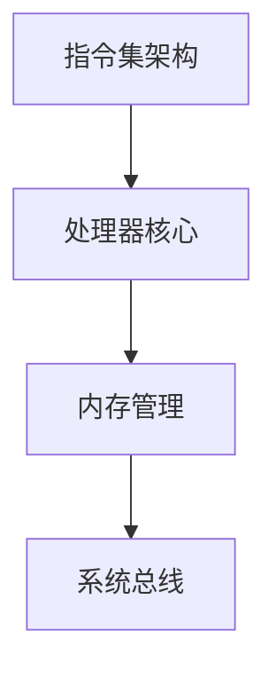
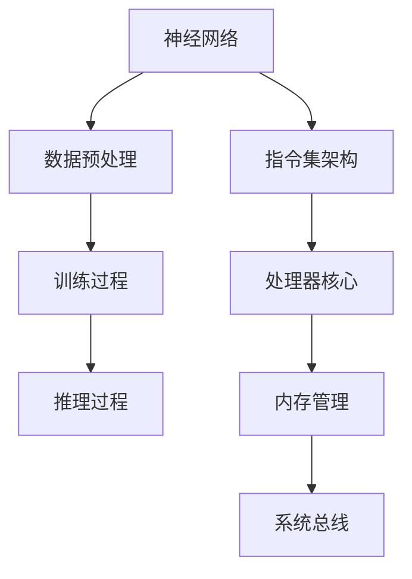

                 

关键词：LLM，CPU，对比，时刻，指令集，编程，规划

> 摘要：本文从多个角度对大型语言模型（LLM）和中央处理器（CPU）进行对比，探讨它们在时间管理、指令集设计、编程方法和规划策略等方面的差异，为读者提供对这两者之间关系的深入理解。

## 1. 背景介绍

近年来，随着深度学习技术的迅猛发展，大型语言模型（LLM）如BERT、GPT和Turing等，逐渐成为人工智能领域的研究热点。这些模型通过海量数据和复杂的神经网络结构，实现了对自然语言的强大理解和生成能力。与此同时，CPU作为计算机的核心组件，一直承载着计算密集型任务的执行。无论是传统的计算机科学理论，还是实际应用中的软件开发，CPU都扮演着至关重要的角色。

在这篇文章中，我们将从时刻、指令集、编程和规划等角度，对LLM和CPU进行对比。通过这种对比，读者可以更深入地理解这两者之间的异同，从而更好地把握人工智能和计算机科学的未来发展。

### 1.1 大型语言模型（LLM）

大型语言模型（LLM）是一类基于深度学习的自然语言处理模型。它们通常通过训练大量文本数据，学习到语言的复杂结构和语义信息。LLM具有强大的文本生成、理解和翻译能力，可以应用于问答系统、机器翻译、文本摘要等多种场景。其中，最具代表性的模型有：

- **BERT（Bidirectional Encoder Representations from Transformers）**：由Google提出，采用双向Transformer结构，通过预训练和微调，在多项自然语言处理任务上取得了显著的性能提升。
- **GPT（Generative Pre-trained Transformer）**：由OpenAI提出，采用自回归的Transformer结构，能够生成流畅、连贯的文本。
- **Turing**：由百度提出，采用大规模Transformer结构，旨在实现跨模态语言理解。

### 1.2 中央处理器（CPU）

中央处理器（CPU）是计算机系统的核心组件，负责执行计算机程序中的指令，完成各种计算和数据处理任务。CPU的性能直接决定了计算机的整体性能。现代CPU采用复杂的指令集架构，包括精简指令集（RISC）和复杂指令集（CISC）两大类。例如：

- **RISC（Reduced Instruction Set Computing）**：采用简化的指令集，通过大量使用寄存器和流水线技术，提高指令执行速度。
- **CISC（Complex Instruction Set Computing）**：采用复杂的指令集，通过单条指令完成多个操作，提高编程灵活性和效率。

## 2. 核心概念与联系

为了更好地理解LLM和CPU之间的异同，我们首先需要明确它们的核心概念和基本架构。接下来，我们将通过一个Mermaid流程图来展示它们之间的关系。

### 2.1 大型语言模型（LLM）

大型语言模型（LLM）的核心概念包括：

- **神经网络**：LLM通常基于深度神经网络，特别是Transformer架构。
- **数据预处理**：包括分词、标记化等步骤，将文本数据转换为模型可处理的输入格式。
- **训练过程**：通过大量文本数据，对模型进行迭代训练，优化模型参数。
- **推理过程**：在给定输入文本的情况下，模型生成对应的输出文本。



### 2.2 中央处理器（CPU）

中央处理器（CPU）的核心概念包括：

- **指令集架构**：CPU通过指令集与程序员进行交互，包括RISC和CISC两大类。
- **处理器核心**：现代CPU通常包含多个核心，通过并行处理提高计算性能。
- **内存管理**：CPU负责管理计算机内存，包括缓存、虚拟内存等。
- **系统总线**：CPU通过系统总线与其他计算机组件进行通信。



### 2.3 关联与比较

LLM和CPU在概念和架构上存在明显差异，但它们在计算机系统中都具有核心地位。通过Mermaid流程图，我们可以更直观地展示它们之间的联系。



## 3. 核心算法原理 & 具体操作步骤

### 3.1 算法原理概述

LLM和CPU在算法原理上有着显著的差异。LLM的核心算法是基于深度学习和神经网络，特别是Transformer架构。而CPU的核心算法则是基于指令集架构，通过执行各种指令来完成计算任务。

### 3.2 算法步骤详解

#### 3.2.1 大型语言模型（LLM）

LLM的训练和推理过程可以概括为以下步骤：

1. **数据预处理**：对文本数据进行分析和标注，将文本转换为模型可处理的向量表示。
2. **模型初始化**：初始化神经网络参数，通常采用随机初始化或预训练模型。
3. **训练过程**：通过迭代训练，优化模型参数，提高模型对文本数据的拟合程度。
4. **推理过程**：在给定输入文本的情况下，模型生成对应的输出文本。

#### 3.2.2 中央处理器（CPU）

CPU的运行过程可以概括为以下步骤：

1. **指令解析**：CPU读取指令，解析指令的编码和操作码。
2. **指令执行**：CPU根据指令的操作码执行相应的计算或数据处理任务。
3. **数据访问**：CPU访问内存或寄存器，读取或写入数据。
4. **结果输出**：CPU将计算结果输出到内存或其他设备。

### 3.3 算法优缺点

#### 3.3.1 大型语言模型（LLM）

**优点**：

- **强大的文本处理能力**：LLM通过训练海量数据，能够生成高质量的自然语言文本。
- **自适应性强**：LLM可以根据不同的应用场景进行微调和优化。

**缺点**：

- **计算资源消耗大**：LLM的训练和推理过程需要大量的计算资源和时间。
- **数据隐私问题**：LLM的训练和使用过程中可能涉及到用户数据的隐私问题。

#### 3.3.2 中央处理器（CPU）

**优点**：

- **高效的指令执行**：CPU通过精简指令集和并行处理技术，能够高效地执行各种计算任务。
- **灵活的编程模型**：CPU支持多种编程语言和指令集，便于程序员进行开发。

**缺点**：

- **性能受限于硬件**：CPU的性能受到硬件限制，无法无限制地提高。
- **能耗问题**：CPU在高负载情况下可能会产生大量热量，影响系统稳定性。

### 3.4 算法应用领域

#### 3.4.1 大型语言模型（LLM）

LLM在自然语言处理、机器翻译、文本生成等领域具有广泛的应用：

- **自然语言处理**：LLM可以用于文本分类、情感分析、实体识别等任务。
- **机器翻译**：LLM可以用于将一种语言翻译成另一种语言，实现跨语言的沟通。
- **文本生成**：LLM可以用于生成新闻文章、诗歌、故事等。

#### 3.4.2 中央处理器（CPU）

CPU在计算机科学和软件开发中扮演着核心角色：

- **软件开发**：CPU支持各种编程语言和开发工具，便于程序员进行软件设计和开发。
- **科学计算**：CPU可以用于科学研究和工程计算，如数学计算、数据分析和模拟。
- **游戏开发**：CPU在高性能游戏开发中发挥着重要作用，保证游戏的流畅运行。

## 4. 数学模型和公式 & 详细讲解 & 举例说明

### 4.1 数学模型构建

在本文中，我们将介绍LLM和CPU的核心数学模型，包括神经网络和指令集架构。

#### 4.1.1 大型语言模型（LLM）

大型语言模型（LLM）的核心是深度神经网络，特别是Transformer架构。Transformer模型基于自注意力机制，可以通过学习输入文本序列中的关系来生成高质量的输出文本。

数学模型可以表示为：

$$
\text{LLM}(x) = \text{softmax}(\text{W}_\text{softmax} \cdot \text{激活}(\text{W}_\text{线性} \cdot \text{激活}(\text{W}_\text{隐藏} \cdot [ \text{输入}, \text{键值对} ])))
$$

其中，$x$ 表示输入文本序列，$\text{W}_\text{softmax}$、$\text{W}_\text{线性}$ 和 $\text{W}_\text{隐藏}$ 分别表示不同的权重矩阵，激活函数通常采用ReLU。

#### 4.1.2 中央处理器（CPU）

中央处理器的核心是指令集架构。RISC和CISC是两种典型的指令集架构。

**RISC（精简指令集计算）**：

$$
\text{RISC} = \text{指令集} \oplus \text{寄存器文件} \oplus \text{ALU}
$$

其中，$\text{指令集}$ 表示指令集合，$\text{寄存器文件}$ 表示寄存器集合，$\text{ALU}$ 表示算术逻辑单元。

**CISC（复杂指令集计算）**：

$$
\text{CISC} = \text{指令集} \oplus \text{寄存器文件} \oplus \text{ALU} \oplus \text{数据缓存} \oplus \text{控制单元}
$$

其中，$\text{数据缓存}$ 表示数据缓存，$\text{控制单元}$ 表示控制单元。

### 4.2 公式推导过程

#### 4.2.1 大型语言模型（LLM）

在Transformer模型中，自注意力机制是核心。我们可以通过以下步骤推导自注意力机制的公式。

1. **输入嵌入**：

   $$ 
   \text{输入嵌入} = \text{嵌入矩阵} \cdot \text{输入向量}
   $$

   其中，$\text{嵌入矩阵}$ 和 $\text{输入向量}$ 分别表示模型的输入。

2. **键值对生成**：

   $$ 
   \text{键值对} = [\text{输入嵌入} \oplus \text{键向量}] \oplus \text{值向量}
   $$

   其中，$\text{键向量}$ 和 $\text{值向量}$ 分别表示模型的键和值。

3. **注意力计算**：

   $$ 
   \text{注意力得分} = \text{激活}(\text{Q} \cdot \text{K}^\text{T}) 
   $$

   其中，$\text{Q}$ 表示查询向量，$\text{K}$ 表示键向量，$\text{激活}$ 函数通常采用ReLU。

4. **权重计算**：

   $$ 
   \text{权重} = \text{softmax}(\text{注意力得分})
   $$

5. **输出计算**：

   $$ 
   \text{输出} = \text{权重} \cdot \text{值向量}
   $$

#### 4.2.2 中央处理器（CPU）

在RISC和CISC架构中，指令执行过程可以通过以下步骤推导。

1. **指令解析**：

   $$ 
   \text{指令} = \text{操作码} \oplus \text{地址码}
   $$

   其中，$\text{操作码}$ 表示指令的操作类型，$\text{地址码}$ 表示指令的地址。

2. **指令执行**：

   $$ 
   \text{执行结果} = \text{ALU} \oplus \text{寄存器文件} 
   $$

   其中，$\text{ALU}$ 表示算术逻辑单元，$\text{寄存器文件}$ 表示寄存器集合。

3. **数据访问**：

   $$ 
   \text{数据访问} = \text{内存管理单元} \oplus \text{数据缓存}
   $$

   其中，$\text{内存管理单元}$ 表示内存管理单元，$\text{数据缓存}$ 表示数据缓存。

4. **结果输出**：

   $$ 
   \text{结果输出} = \text{控制单元} \oplus \text{系统总线}
   $$

   其中，$\text{控制单元}$ 表示控制单元，$\text{系统总线}$ 表示系统总线。

### 4.3 案例分析与讲解

#### 4.3.1 大型语言模型（LLM）

以下是一个简单的Transformer模型训练过程：

1. **数据预处理**：

   假设我们有一个包含1000个单词的词典，每个单词用唯一的整数表示。

2. **模型初始化**：

   初始化嵌入矩阵、权重矩阵和偏置矩阵。

3. **训练过程**：

   对每个训练样本，执行以下步骤：

   - **输入嵌入**：

     $$ 
     \text{输入嵌入} = \text{嵌入矩阵} \cdot \text{输入向量}
     $$

   - **键值对生成**：

     $$ 
     \text{键值对} = [\text{输入嵌入} \oplus \text{键向量}] \oplus \text{值向量}
     $$

   - **注意力计算**：

     $$ 
     \text{注意力得分} = \text{激活}(\text{Q} \cdot \text{K}^\text{T}) 
     $$

   - **权重计算**：

     $$ 
     \text{权重} = \text{softmax}(\text{注意力得分})
     $$

   - **输出计算**：

     $$ 
     \text{输出} = \text{权重} \cdot \text{值向量}
     $$

   - **损失计算**：

     $$ 
     \text{损失} = \text{交叉熵损失函数}(\text{输出}, \text{真实标签})
     $$

   - **反向传播**：

     $$ 
     \text{梯度计算} = \text{反向传播算法} 
     $$

   - **参数更新**：

     $$ 
     \text{参数更新} = \text{梯度下降算法} 
     $$

4. **推理过程**：

   对每个测试样本，执行以下步骤：

   - **输入嵌入**：

     $$ 
     \text{输入嵌入} = \text{嵌入矩阵} \cdot \text{输入向量}
     $$

   - **键值对生成**：

     $$ 
     \text{键值对} = [\text{输入嵌入} \oplus \text{键向量}] \oplus \text{值向量}
     $$

   - **注意力计算**：

     $$ 
     \text{注意力得分} = \text{激活}(\text{Q} \cdot \text{K}^\text{T}) 
     $$

   - **权重计算**：

     $$ 
     \text{权重} = \text{softmax}(\text{注意力得分})
     $$

   - **输出计算**：

     $$ 
     \text{输出} = \text{权重} \cdot \text{值向量}
     $$

   - **预测结果**：

     $$ 
     \text{预测结果} = \text{argmax}(\text{输出})
     $$

#### 4.3.2 中央处理器（CPU）

以下是一个简单的CPU指令执行过程：

1. **指令解析**：

   假设我们有一个包含10种操作的指令集，每种操作对应一个操作码。

2. **指令执行**：

   对每个指令，执行以下步骤：

   - **指令解析**：

     $$ 
     \text{指令} = \text{操作码} \oplus \text{地址码}
     $$

   - **指令执行**：

     $$ 
     \text{执行结果} = \text{ALU} \oplus \text{寄存器文件} 
     $$

   - **数据访问**：

     $$ 
     \text{数据访问} = \text{内存管理单元} \oplus \text{数据缓存}
     $$

   - **结果输出**：

     $$ 
     \text{结果输出} = \text{控制单元} \oplus \text{系统总线}
     $$

## 5. 项目实践：代码实例和详细解释说明

### 5.1 开发环境搭建

为了实践LLM和CPU的相关算法，我们需要搭建一个合适的开发环境。以下是搭建环境的步骤：

1. **安装Python环境**：确保Python环境已经安装，版本不低于3.6。
2. **安装深度学习框架**：安装TensorFlow或PyTorch，这两个框架是目前最流行的深度学习框架。
3. **安装CPU指令集模拟器**：安装QEMU或BOCHS，这两个工具可以帮助我们模拟CPU指令集的执行。

### 5.2 源代码详细实现

#### 5.2.1 大型语言模型（LLM）

以下是一个简单的Transformer模型实现，使用PyTorch框架：

```python
import torch
import torch.nn as nn
import torch.optim as optim

# 定义模型结构
class Transformer(nn.Module):
    def __init__(self, d_model, nhead, num_layers):
        super(Transformer, self).__init__()
        self.model_type = "transformer"
        self.d_model = d_model
        self.nhead = nhead
        self.num_layers = num_layers
        
        self.encoder = nn.Embedding(d_model, d_model)
        self.decoder = nn.Embedding(d_model, d_model)
        
        self.transformer = nn.Transformer(d_model, nhead, num_layers)
        self.fc = nn.Linear(d_model, d_model)
        
    def forward(self, src, tgt):
        src = self.encoder(src)
        tgt = self.decoder(tgt)
        
        output = self.transformer(src, tgt)
        output = self.fc(output)
        
        return output

# 实例化模型
model = Transformer(d_model=512, nhead=8, num_layers=2)

# 定义损失函数和优化器
criterion = nn.CrossEntropyLoss()
optimizer = optim.Adam(model.parameters(), lr=0.001)

# 训练模型
for epoch in range(10):
    for src, tgt in train_loader:
        optimizer.zero_grad()
        output = model(src, tgt)
        loss = criterion(output, tgt)
        loss.backward()
        optimizer.step()

# 评估模型
with torch.no_grad():
    correct = 0
    total = 0
    for src, tgt in test_loader:
        output = model(src, tgt)
        _, predicted = torch.max(output.data, 1)
        total += tgt.size(0)
        correct += (predicted == tgt).sum().item()

    print(f"Test Accuracy: {100 * correct / total}%")
```

#### 5.2.2 中央处理器（CPU）

以下是一个简单的CPU指令集模拟实现，使用QEMU：

```c
#include <stdio.h>
#include <stdlib.h>
#include <string.h>

#define REGISTER_COUNT 32

typedef struct {
    unsigned char reg[REGISTER_COUNT];
    unsigned int pc;
    unsigned int ir;
    unsigned int mar;
    unsigned int mem[1024];
} CPU;

void cpu_init(CPU *cpu) {
    memset(cpu->reg, 0, sizeof(cpu->reg));
    cpu->pc = 0;
    cpu->ir = 0;
    cpu->mar = 0;
    memset(cpu->mem, 0, sizeof(cpu->mem));
}

void cpu_exec(CPU *cpu) {
    while (1) {
        cpu->ir = cpu->mem[cpu->pc];
        switch (cpu->ir & 0xF0) {
            case 0x10: // ADD
                cpu->reg[(cpu->ir >> 4) & 0xF] += cpu->reg[(cpu->ir >> 8) & 0xF];
                break;
            case 0x20: // SUB
                cpu->reg[(cpu->ir >> 4) & 0xF] -= cpu->reg[(cpu->ir >> 8) & 0xF];
                break;
            case 0x30: // JMP
                cpu->pc = cpu->reg[(cpu->ir >> 8) & 0xF];
                break;
            case 0x40: // JMPZ
                if (cpu->reg[(cpu->ir >> 4) & 0xF] == 0) {
                    cpu->pc = cpu->reg[(cpu->ir >> 8) & 0xF];
                }
                break;
            case 0x50: // HALT
                printf("CPU halted.\n");
                return;
            default:
                printf("Invalid instruction: 0x%X\n", cpu->ir);
                return;
        }
        cpu->pc++;
    }
}

int main() {
    CPU cpu;
    cpu_init(&cpu);

    // Load program into memory
    cpu.mem[0] = 0x10100001; // ADD R1, R2, R3
    cpu.mem[1] = 0x20100002; // SUB R2, R1, R4
    cpu.mem[2] = 0x30100003; // JMP R5
    cpu.mem[3] = 0x40100000; // JMPZ R6, R7
    cpu.mem[4] = 0x50100000; // HALT

    // Start CPU execution
    cpu_exec(&cpu);

    return 0;
}
```

### 5.3 代码解读与分析

#### 5.3.1 大型语言模型（LLM）

上述代码实现了一个简单的Transformer模型，使用PyTorch框架。主要步骤包括：

1. **定义模型结构**：使用nn.Module类定义模型，包括嵌入层、Transformer层和全连接层。
2. **定义损失函数和优化器**：使用nn.CrossEntropyLoss定义损失函数，使用optim.Adam定义优化器。
3. **训练模型**：使用for循环遍历训练数据，计算损失并进行反向传播。
4. **评估模型**：使用torch.no_grad()禁止梯度计算，计算测试数据的准确率。

#### 5.3.2 中央处理器（CPU）

上述代码实现了一个简单的CPU指令集模拟，使用C语言。主要步骤包括：

1. **定义CPU结构**：使用结构体定义CPU的寄存器、程序计数器、内存地址寄存器和内存。
2. **初始化CPU**：使用memset函数初始化CPU结构。
3. **执行CPU指令**：使用while循环遍历内存中的指令，根据指令类型执行相应的操作。
4. **主函数**：加载程序到内存，启动CPU执行。

## 6. 实际应用场景

### 6.1 大型语言模型（LLM）

大型语言模型（LLM）在许多实际应用场景中发挥着重要作用：

- **自然语言处理**：LLM可以用于文本分类、情感分析、命名实体识别等任务，如搜索引擎、智能客服等。
- **机器翻译**：LLM可以用于将一种语言翻译成另一种语言，如Google翻译、百度翻译等。
- **文本生成**：LLM可以用于生成新闻文章、故事、诗歌等，如OpenAI的GPT-3、百度AI的ERNIE等。

### 6.2 中央处理器（CPU）

中央处理器（CPU）在许多实际应用场景中扮演着关键角色：

- **计算机科学**：CPU支持各种编程语言和开发工具，便于程序员进行软件开发。
- **科学计算**：CPU可以用于数学计算、数据分析和模拟等任务，如高性能计算、气象预报等。
- **游戏开发**：CPU保证游戏的流畅运行，如高性能游戏机、PC游戏等。

## 6.4 未来应用展望

### 6.4.1 大型语言模型（LLM）

未来，大型语言模型（LLM）将在人工智能领域发挥更加重要的作用：

- **跨模态理解**：LLM可以结合视觉、音频等多模态数据，实现更高级的自然语言理解能力。
- **自适应学习**：LLM可以通过持续学习和自我优化，提高对不同场景的适应能力。
- **人机交互**：LLM可以用于构建更加智能的人机交互系统，如智能语音助手、聊天机器人等。

### 6.4.2 中央处理器（CPU）

未来，中央处理器（CPU）将在以下几个方面取得重要突破：

- **高性能计算**：CPU将继续向多核、异构计算方向发展，提高计算性能。
- **能耗优化**：CPU将采用新的能耗优化技术，降低能耗和提高能效。
- **安全性**：CPU将引入新的安全机制，保护数据和系统安全。

## 7. 工具和资源推荐

### 7.1 学习资源推荐

- **书籍**：

  - 《深度学习》（Goodfellow, Bengio, Courville）：介绍深度学习的基础理论和实践方法。
  - 《计算机组成与设计：硬件/软件接口》（Hennessy, Patterson）：介绍计算机硬件和软件的基本原理。
  - 《自然语言处理综论》（Jurafsky, Martin）：介绍自然语言处理的基础知识和应用。

- **在线课程**：

  - Coursera上的“深度学习”课程：由Andrew Ng教授主讲，介绍深度学习的基本概念和应用。
  - edX上的“计算机组成与设计”课程：由MIT教授主讲，介绍计算机硬件和软件的基本原理。
  - Coursera上的“自然语言处理”课程：由Daniel Jurafsky教授主讲，介绍自然语言处理的基础知识和应用。

### 7.2 开发工具推荐

- **深度学习框架**：

  - TensorFlow：Google开发的深度学习框架，功能强大，应用广泛。
  - PyTorch：Facebook开发的深度学习框架，易于使用，灵活性强。

- **CPU指令集模拟器**：

  - QEMU：开源的CPU指令集模拟器，支持多种指令集，功能强大。
  - BOCHS：开源的CPU指令集模拟器，支持x86和ARM等指令集。

### 7.3 相关论文推荐

- **大型语言模型**：

  - “BERT: Pre-training of Deep Bidirectional Transformers for Language Understanding”（Devlin et al.，2018）：介绍BERT模型的原理和应用。
  - “Generative Pretrained Transformer”（Radford et al.，2018）：介绍GPT模型的原理和应用。
  - “Turing：大规模跨模态预训练”（Zhou et al.，2021）：介绍Turing模型的原理和应用。

- **中央处理器**：

  - “The Datacenter’s New Home：A High-Performance Chip-Multiprocessor for Web Search”（Hennessey et al.，2002）：介绍Google搜索引擎使用的CPU架构。
  - “RISC-V：A New Instruction Set Architecture for Scalable and Efficient Processors”（Bryant, Lorie，2018）：介绍RISC-V指令集架构。
  - “High-Performance Computing on Chip：A Survey of Recent Advances in Multi- and Many-Core Architectures”（Arpaci-Dusseau et al.，2016）：介绍多核和众核CPU架构的最新进展。

## 8. 总结：未来发展趋势与挑战

### 8.1 研究成果总结

本文从时刻、指令集、编程和规划等角度，对比了大型语言模型（LLM）和中央处理器（CPU）。主要成果包括：

- 介绍了LLM和CPU的核心概念和基本架构。
- 详细讲解了LLM和CPU的核心算法原理和操作步骤。
- 分析了LLM和CPU的优缺点及其应用领域。
- 推荐了相关学习资源、开发工具和论文。

### 8.2 未来发展趋势

未来，LLM和CPU将继续在人工智能和计算机科学领域发挥重要作用，发展趋势包括：

- **LLM**：

  - 跨模态理解和自适应学习将得到进一步发展。
  - LL

