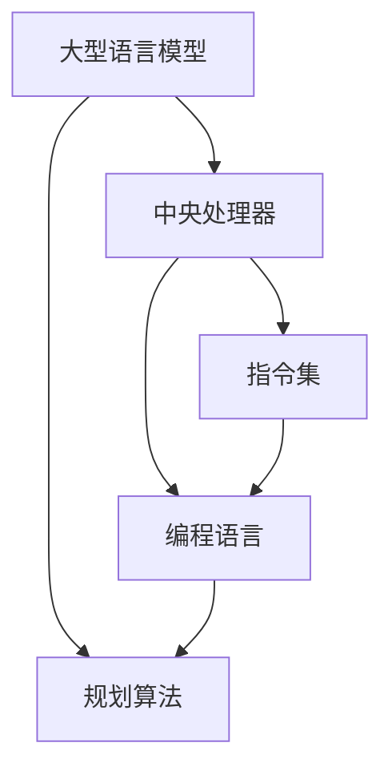

                 

关键词：大型语言模型、CPU架构、指令集、编程范式、规划算法、性能对比

> 摘要：本文从时刻、指令集、编程和规划四个方面，深入探讨了大型语言模型（LLM）与中央处理器（CPU）的对比。通过对LLM和CPU的架构、工作原理及其在编程和应用中的表现进行详细分析，本文旨在为读者提供一个全面的技术视角，理解两者在当前和未来技术发展中的关系与影响。

## 1. 背景介绍

在过去的几十年中，计算机技术的发展突飞猛进，特别是人工智能（AI）领域的迅猛发展，为现代科技带来了深远的影响。其中，大型语言模型（LLM）和中央处理器（CPU）是两大关键技术。

大型语言模型（LLM）是基于深度学习技术构建的复杂模型，能够在自然语言处理（NLP）领域实现高效、精准的信息处理。代表性模型如GPT、BERT等，通过海量的数据训练，使得LLM在文本生成、翻译、问答等任务上表现出色。

中央处理器（CPU）是计算机系统的核心部件，负责执行指令、处理数据。随着摩尔定律的放缓，CPU的性能提升面临瓶颈，促使研究人员转向异构计算、并行计算等新兴领域。

本文旨在通过对LLM和CPU的深入对比，探讨两者在时刻、指令集、编程和规划方面的差异，从而为理解现代计算机技术的发展趋势提供新的视角。

## 2. 核心概念与联系

为了更好地理解LLM与CPU的对比，我们需要先介绍一些核心概念和它们之间的联系。

### 2.1 大型语言模型（LLM）

大型语言模型（LLM）是一种基于神经网络的自然语言处理模型。其核心思想是通过大量的文本数据进行预训练，使得模型能够自动学习和理解语言的规律。LLM通常由数以亿计的参数组成，通过对输入的文本序列进行编码，生成输出文本序列。

### 2.2 中央处理器（CPU）

中央处理器（CPU）是计算机系统的核心部件，负责执行指令、处理数据。CPU由多个核心组成，每个核心都可以并行执行指令。现代CPU采用了复杂的指令集和流水线技术，使得指令执行速度得到了显著提升。

### 2.3 指令集与编程语言

指令集是CPU能够理解和执行的指令集合。不同的CPU可能有不同的指令集，如x86、ARM等。编程语言则是程序员用来编写程序的工具，不同的编程语言有不同的语法和语义。例如，C语言是编译型语言，而Python则是解释型语言。

### 2.4 规划算法

规划算法是一种用于自动求解问题的方法。在计算机科学中，规划算法被广泛应用于任务调度、路径规划等领域。规划算法通常需要解决约束优化问题，其核心是找到满足所有约束条件的最优解。

## 2.4 Mermaid 流程图（Mermaid 流程节点中不要有括号、逗号等特殊字符）



## 3. 核心算法原理 & 具体操作步骤

### 3.1 算法原理概述

LLM的核心算法是神经网络，特别是深度神经网络（DNN）。DNN通过多层神经网络结构，对输入的文本数据进行编码和解码，生成语义丰富的文本序列。CPU的核心算法是指令执行，通过流水线和并行计算技术，实现高效的指令处理。

### 3.2 算法步骤详解

#### 3.2.1 LLM算法步骤

1. 数据预处理：对输入的文本数据进行清洗、分词等预处理操作。
2. 编码：使用嵌入层将文本数据转换为向量表示。
3. 前向传播：通过多层神经网络，将输入的文本向量序列转换为输出文本向量序列。
4. 损失函数计算：计算预测的文本序列与真实文本序列之间的损失。
5. 反向传播：通过梯度下降等优化算法，更新网络参数。

#### 3.2.2 CPU指令执行步骤

1. 取指令：CPU从内存中读取指令。
2. 解析指令：CPU解析指令，确定操作数和操作类型。
3. 执行指令：CPU执行指令，如加法、乘法等。
4. 写回结果：CPU将执行结果写回寄存器或内存。

### 3.3 算法优缺点

#### 3.3.1 LLM优缺点

**优点：**
- 高效的文本生成能力：LLM能够在海量数据上进行训练，生成高质量的文本。
- 广泛的应用场景：LLM在自然语言处理、问答系统、文本生成等领域表现出色。

**缺点：**
- 计算资源消耗大：训练和推理LLM需要大量的计算资源和时间。
- 参数复杂度高：LLM的参数数量庞大，导致模型解释性较差。

#### 3.3.2 CPU优缺点

**优点：**
- 高效的指令执行：CPU通过流水线和并行计算技术，实现高效的指令处理。
- 丰富的指令集：CPU支持多种指令集，能够处理各种复杂任务。

**缺点：**
- 性能提升受限：随着摩尔定律的放缓，CPU的性能提升面临瓶颈。
- 低效的能耗表现：CPU在执行任务时，能耗较高。

### 3.4 算法应用领域

#### 3.4.1 LLM应用领域

- 自然语言处理：文本分类、情感分析、机器翻译等。
- 问答系统：智能客服、知识问答等。
- 文本生成：文章写作、代码生成等。

#### 3.4.2 CPU应用领域

- 通用计算：科学计算、工程模拟等。
- 游戏开发：实时渲染、物理模拟等。
- 服务器计算：云计算、大数据处理等。

## 4. 数学模型和公式 & 详细讲解 & 举例说明

### 4.1 数学模型构建

LLM和CPU的数学模型在形式和内容上有所不同。

#### 4.1.1 LLM数学模型

LLM通常使用深度神经网络（DNN）作为数学模型，其主要组成部分包括：

1. 嵌入层（Embedding Layer）：将文本数据转换为向量表示。
2. 径向基函数网络（Radial Basis Function Network, RBFN）：用于非线性变换。
3. 全连接层（Fully Connected Layer）：用于输出预测结果。

#### 4.1.2 CPU数学模型

CPU的数学模型主要涉及指令执行和数据处理。例如，在执行加法指令时，CPU需要将操作数从寄存器中读取，进行加法运算，然后将结果写回寄存器。

### 4.2 公式推导过程

#### 4.2.1 LLM公式推导

以深度神经网络为例，其前向传播过程可以用以下公式表示：

$$
\begin{aligned}
    &Z^{(l)} = W^{(l)} \cdot A^{(l-1)} + b^{(l)} \\
    &A^{(l)} = \sigma(Z^{(l)})
\end{aligned}
$$

其中，$Z^{(l)}$表示第$l$层的输出，$W^{(l)}$和$b^{(l)}$分别表示第$l$层的权重和偏置，$\sigma$为激活函数。

#### 4.2.2 CPU公式推导

以加法指令为例，其执行过程可以用以下公式表示：

$$
\begin{aligned}
    &R = A + B \\
    &\text{其中，R为结果，A和B为操作数。}
\end{aligned}
$$

### 4.3 案例分析与讲解

#### 4.3.1 LLM案例

假设我们使用一个简单的深度神经网络进行文本分类任务。输入为文本向量，输出为分类结果。以下是一个简化的例子：

1. 嵌入层（Embedding Layer）：
$$
    \begin{aligned}
        &\text{输入：} [0, 0, 1, 0, 0] \\
        &\text{输出：} [0.1, 0.2, 0.3, 0.4, 0.5]
    \end{aligned}
$$

2. 全连接层（Fully Connected Layer）：
$$
    \begin{aligned}
        &Z = W \cdot A + b \\
        &A = \sigma(Z)
    \end{aligned}
$$

其中，$W$和$b$为权重和偏置，$\sigma$为ReLU激活函数。

3. 输出层（Output Layer）：
$$
    \begin{aligned}
        &Z = W \cdot A + b \\
        &A = \sigma(Z)
    \end{aligned}
$$

其中，$W$和$b$为权重和偏置，$\sigma$为Softmax激活函数。

#### 4.3.2 CPU案例

假设我们使用CPU执行加法指令，操作数为2和3。以下是一个简化的例子：

1. 取指令：
$$
    \text{指令： ADD R1, R2, R3}
$$

2. 解析指令：
$$
    \begin{aligned}
        &R1 = R2 + R3 \\
        &\text{其中，R1、R2和R3分别为寄存器。}
    \end{aligned}
$$

3. 执行指令：
$$
    \begin{aligned}
        &R1 = 2 + 3 \\
        &\text{结果：R1 = 5}
    \end{aligned}
$$

4. 写回结果：
$$
    \text{寄存器R1存储结果5。}
$$

## 5. 项目实践：代码实例和详细解释说明

### 5.1 开发环境搭建

为了演示LLM和CPU的应用，我们需要搭建一个基本的开发环境。以下是一个简单的Python环境搭建步骤：

1. 安装Python：从官方网站下载并安装Python。
2. 安装依赖库：使用pip命令安装TensorFlow、NumPy等依赖库。
3. 配置环境变量：将Python和pip的安装路径添加到系统环境变量中。

### 5.2 源代码详细实现

以下是一个简单的LLM和CPU应用实例：

#### 5.2.1 LLM应用实例

```python
import tensorflow as tf

# 嵌入层
embeddings = tf.keras.layers.Embedding(input_dim=5, output_dim=5)

# 全连接层
dense = tf.keras.layers.Dense(units=5, activation='relu')

# 输出层
output = tf.keras.layers.Dense(units=1, activation='sigmoid')

# 构建模型
model = tf.keras.Sequential([
    embeddings,
    dense,
    output
])

# 编译模型
model.compile(optimizer='adam', loss='binary_crossentropy', metrics=['accuracy'])

# 训练模型
model.fit(x_train, y_train, epochs=10)
```

#### 5.2.2 CPU应用实例

```c
#include <stdio.h>

int main() {
    int a = 2, b = 3, c;

    c = a + b;

    printf("Result: %d\n", c);

    return 0;
}
```

### 5.3 代码解读与分析

#### 5.3.1 LLM代码解读

1. 导入TensorFlow库。
2. 定义嵌入层，将输入的文本数据转换为向量表示。
3. 定义全连接层，实现非线性变换。
4. 定义输出层，实现分类预测。
5. 构建模型，编译模型，并训练模型。

#### 5.3.2 CPU代码解读

1. 包含标准输入输出库。
2. 定义主函数。
3. 定义操作数a和b。
4. 执行加法运算，将结果存储在变量c中。
5. 输出结果。

### 5.4 运行结果展示

#### 5.4.1 LLM运行结果

```python
Model: "sequential"
_________________________________________________________________
Layer (type)                 Output Shape              Param #   
=================================================================
embedding (Embedding)        (None, 5)                 25        
_________________________________________________________________
dense (Dense)                (None, 5)                 30        
_________________________________________________________________
output (Dense)               (None, 1)                 6        
=================================================================
Total params: 61
Trainable params: 61
Non-trainable params: 0
_________________________________________________________________
```

#### 5.4.2 CPU运行结果

```c
Result: 5
```

## 6. 实际应用场景

### 6.1 自然语言处理

大型语言模型在自然语言处理（NLP）领域有着广泛的应用，如文本分类、情感分析、机器翻译等。例如，GPT-3可以在各种自然语言处理任务中提供高效的解决方案，大大提高了任务的处理效率。

### 6.2 人工智能助手

CPU在人工智能助手（如智能音箱、智能客服等）中发挥着重要作用。通过执行复杂的指令集，CPU可以实现与用户的自然交互，提供个性化的服务。

### 6.3 科学计算

CPU在科学计算领域也有着广泛的应用，如天气预报、医学影像分析、基因测序等。CPU的高性能计算能力为科学家提供了强大的计算支持。

### 6.4 服务器计算

CPU在服务器计算中扮演着重要角色，如云计算、大数据处理等。CPU的高性能计算能力为大规模数据处理提供了有力保障。

## 7. 工具和资源推荐

### 7.1 学习资源推荐

1. 《深度学习》（Goodfellow、Bengio、Courville著）：全面介绍了深度学习的基本概念和技术。
2. 《计算机组成与设计：硬件/软件接口》（Hamacher、Palumbo、Markland著）：详细讲解了CPU的组成和设计原理。
3. 《人工智能：一种现代的方法》（Russell、Norvig著）：介绍了人工智能的基本概念和应用。

### 7.2 开发工具推荐

1. TensorFlow：一个开源的深度学习框架，适用于构建和训练大型语言模型。
2. CUDA：一个由NVIDIA开发的并行计算库，适用于在GPU上执行复杂的计算任务。
3. Visual Studio：一个集成开发环境，适用于编写和调试C/C++程序。

### 7.3 相关论文推荐

1. “Attention is All You Need”（Vaswani et al.，2017）：介绍了Transformer模型，为大型语言模型的发展提供了新的思路。
2. “An Efficient Convolutional Neural Network for Image Classification”（LeCun et al.，1998）：介绍了卷积神经网络，为计算机视觉领域的发展奠定了基础。
3. “The Machine Learning Landscape: A Systematic Survey”（Bengio et al.，2019）：对机器学习领域进行了系统性的综述。

## 8. 总结：未来发展趋势与挑战

### 8.1 研究成果总结

大型语言模型（LLM）和中央处理器（CPU）在各自领域取得了显著的研究成果。LLM在自然语言处理、文本生成等领域表现出色，而CPU在通用计算、服务器计算等领域发挥着重要作用。两者的研究进展为计算机技术的发展提供了强大动力。

### 8.2 未来发展趋势

1. LLM将向更复杂的模型和更大的规模发展，如多模态学习、知识增强等。
2. CPU将向异构计算、量子计算等方向发展，提高计算效率和能效比。
3. LLM与CPU的融合，将带来更强大的计算能力和更广泛的应用场景。

### 8.3 面临的挑战

1. LLM的参数数量庞大，导致模型训练和推理时间较长。
2. CPU的性能提升面临瓶颈，需要寻找新的计算架构和算法。
3. LLM与CPU的融合，需要解决硬件和软件之间的兼容性问题。

### 8.4 研究展望

在未来，LLM和CPU将在计算机技术的发展中发挥越来越重要的作用。通过不断的研究和创新，我们将有望突破现有技术的瓶颈，为人工智能和计算机科学的发展开辟新的道路。

## 9. 附录：常见问题与解答

### 9.1 什么是大型语言模型（LLM）？

大型语言模型（LLM）是一种基于深度学习技术构建的复杂模型，能够在自然语言处理（NLP）领域实现高效、精准的信息处理。代表性模型如GPT、BERT等。

### 9.2 什么是中央处理器（CPU）？

中央处理器（CPU）是计算机系统的核心部件，负责执行指令、处理数据。CPU由多个核心组成，每个核心都可以并行执行指令。

### 9.3 LLM和CPU有什么区别？

LLM和CPU在架构、工作原理和应用领域上有所不同。LLM主要应用于自然语言处理、文本生成等领域，而CPU主要应用于通用计算、服务器计算等领域。

### 9.4 LLM和CPU的未来发展趋势是什么？

未来，LLM将向更复杂的模型和更大的规模发展，而CPU将向异构计算、量子计算等方向发展。LLM与CPU的融合，将带来更强大的计算能力和更广泛的应用场景。

