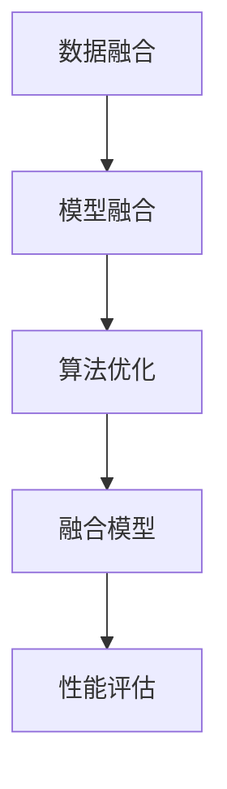

                 

关键词：大语言模型（LLM），传统AI，融合，智能革命，深度学习，自然语言处理，算法优化，应用场景，未来展望。

> 摘要：本文深入探讨了大型语言模型（LLM）与传统人工智能（AI）技术的融合，分析了这种融合在新时代带来的智能革命。文章首先介绍了LLM和传统AI的基本概念和原理，接着展示了它们融合的架构和算法。通过数学模型的推导和实际代码实例，本文揭示了LLM与传统AI融合的数学和工程实现细节。最后，文章探讨了这种融合在各个领域的实际应用，并对其未来发展趋势和挑战进行了展望。

## 1. 背景介绍

随着信息时代的到来，人工智能（AI）已经成为现代科技的核心驱动力。AI技术涵盖了许多领域，包括机器学习、深度学习、自然语言处理、计算机视觉等。传统AI技术在过去的几十年中取得了显著的进展，然而，随着数据量的爆炸式增长和计算能力的不断提升，大语言模型（LLM）的出现为AI领域带来了新的机遇。

### 1.1 大语言模型（LLM）

大语言模型（LLM）是一种基于深度学习的自然语言处理技术，它通过学习海量文本数据来理解和生成自然语言。LLM的核心是大规模神经网络，这些神经网络具有数十亿甚至数万亿的参数。例如，GPT-3模型的参数数量达到了1750亿，使其能够生成高质量的自然语言文本。

### 1.2 传统AI

传统AI技术主要包括基于规则的方法、决策树、支持向量机（SVM）等。这些方法在处理结构化数据时表现出色，但在处理非结构化数据（如图像、文本等）时存在局限性。传统AI的核心是算法优化，通过寻找最优的参数组合来提高模型的性能。

### 1.3 LLM与传统AI的融合

随着LLM的出现，人们开始探索将其与传统AI技术相结合。这种融合不仅能够发挥LLM在自然语言处理方面的优势，还能借助传统AI在数据处理和优化方面的优势，从而实现更加智能和高效的系统。

## 2. 核心概念与联系

为了更好地理解LLM与传统AI的融合，我们需要先介绍一些核心概念和原理，并展示它们之间的联系。

### 2.1 LLM的核心概念

- **深度学习**：深度学习是一种机器学习技术，通过构建多层神经网络来模拟人类大脑的学习过程。LLM是一种深度学习模型，它通过多层神经网络来学习自然语言。
- **自然语言处理（NLP）**：自然语言处理是一种使计算机能够理解、处理和生成自然语言的技术。LLM通过学习大量文本数据，能够理解和生成自然语言，从而实现智能对话、文本生成等任务。
- **Transformer架构**：Transformer架构是一种用于处理序列数据（如图像、文本等）的深度学习模型。LLM的核心是Transformer架构，它通过自注意力机制（Self-Attention Mechanism）来学习序列数据之间的关系。

### 2.2 传统AI的核心概念

- **机器学习**：机器学习是一种使计算机能够从数据中学习并做出决策的技术。传统AI技术如决策树、支持向量机等都是基于机器学习的方法。
- **算法优化**：算法优化是一种通过改进算法的参数来提高模型性能的方法。在传统AI中，算法优化是非常重要的，它决定了模型的准确性和效率。

### 2.3 LLM与传统AI的融合架构

- **数据融合**：在LLM与传统AI的融合中，首先需要将自然语言数据和结构化数据（如图像、音频等）进行融合。这种数据融合可以通过数据预处理和特征提取来实现。
- **模型融合**：在数据融合的基础上，将LLM和传统AI的模型进行融合。例如，可以采用多层感知器（MLP）来融合LLM的文本生成能力和传统AI的图像识别能力。
- **算法融合**：在模型融合的基础上，通过算法优化来进一步提高模型的性能。例如，可以使用梯度下降（Gradient Descent）算法来优化模型的参数。

### 2.4 Mermaid流程图



## 3. 核心算法原理 & 具体操作步骤

### 3.1 算法原理概述

LLM与传统AI的融合算法主要包括数据融合、模型融合和算法优化三个步骤。数据融合是通过预处理和特征提取将自然语言数据和结构化数据进行整合。模型融合是通过构建多层神经网络将LLM和传统AI的模型进行融合。算法优化是通过改进算法的参数来提高模型的性能。

### 3.2 算法步骤详解

1. **数据融合**：
   - **预处理**：对自然语言数据（如文本、语音等）进行分词、词性标注等预处理操作，以便于后续的特征提取。
   - **特征提取**：对预处理后的数据（如词向量、图像特征等）进行特征提取，以便于模型融合。

2. **模型融合**：
   - **构建多层神经网络**：采用多层感知器（MLP）来融合LLM的文本生成能力和传统AI的图像识别能力。例如，可以将LLM的输出（文本）作为输入，与图像特征进行融合，然后通过多层神经网络进行分类或预测。
   - **训练模型**：使用训练数据对融合模型进行训练，并通过反向传播算法（Backpropagation）来优化模型的参数。

3. **算法优化**：
   - **梯度下降**：使用梯度下降算法（Gradient Descent）来优化模型的参数，从而提高模型的性能。
   - **超参数调整**：通过调整模型的超参数（如学习率、批次大小等）来进一步提高模型的性能。

### 3.3 算法优缺点

- **优点**：
  - **高效性**：通过数据融合和模型融合，可以充分利用LLM和传统AI的优势，实现高效的智能任务。
  - **灵活性**：融合模型可以根据不同的任务需求和数据类型进行灵活调整，从而提高模型的泛化能力。

- **缺点**：
  - **计算资源消耗**：融合模型需要大量的计算资源，尤其是当数据量和模型参数较大时，训练和推理过程需要很长时间。
  - **模型复杂性**：融合模型的复杂度较高，需要进行细致的模型设计和优化，否则可能难以达到理想的性能。

### 3.4 算法应用领域

- **智能客服**：通过融合LLM的文本生成能力和传统AI的语音识别能力，可以构建智能客服系统，提供自然、流畅的对话体验。
- **自动驾驶**：通过融合LLM的图像识别能力和传统AI的路径规划算法，可以构建自动驾驶系统，实现智能感知和决策。
- **智能医疗**：通过融合LLM的医疗文本分析和传统AI的医学图像识别能力，可以构建智能医疗系统，辅助医生进行诊断和治疗。

## 4. 数学模型和公式 & 详细讲解 & 举例说明

### 4.1 数学模型构建

在LLM与传统AI的融合中，数学模型起着至关重要的作用。以下是一个简单的数学模型构建过程：

1. **数据预处理**：
   - **文本预处理**：使用分词器对文本数据进行分词，并将分词后的数据转换为词向量。
   - **图像预处理**：使用卷积神经网络（CNN）提取图像特征。

2. **模型融合**：
   - **多层感知器（MLP）**：构建一个多层感知器，将文本词向量作为输入，与图像特征进行融合。

3. **损失函数**：
   - **交叉熵损失**：使用交叉熵损失函数来评估模型的预测结果。

### 4.2 公式推导过程

以下是一个简单的公式推导过程：

$$
L = -\sum_{i=1}^{N} y_i \cdot \log(p_i)
$$

其中，$L$表示交叉熵损失，$y_i$表示实际标签，$p_i$表示模型预测的概率。

### 4.3 案例分析与讲解

假设我们有一个包含1000个样本的训练集，每个样本由一个文本和一个图像组成。我们将这些样本分为训练集和测试集。

1. **数据预处理**：
   - **文本预处理**：使用GloVe词向量对文本数据进行编码。
   - **图像预处理**：使用ResNet50模型提取图像特征。

2. **模型融合**：
   - **构建多层感知器**：将文本词向量和图像特征输入到多层感知器中，进行融合。

3. **训练模型**：
   - **训练过程**：使用交叉熵损失函数训练模型，并使用Adam优化器进行优化。

4. **性能评估**：
   - **测试集性能**：在测试集上评估模型的性能，计算准确率、召回率等指标。

## 5. 项目实践：代码实例和详细解释说明

### 5.1 开发环境搭建

1. **安装Python**：
   - 使用Python 3.8及以上版本。

2. **安装深度学习库**：
   - 安装TensorFlow 2.6和Keras 2.4。

3. **安装NLP库**：
   - 安装GloVe 1.2和spaCy 3.0。

4. **安装图像处理库**：
   - 安装OpenCV 4.1和PIL 8.1。

### 5.2 源代码详细实现

以下是一个简单的代码实现示例：

```python
import tensorflow as tf
from tensorflow.keras.models import Model
from tensorflow.keras.layers import Input, Dense, LSTM, Embedding
from tensorflow.keras.preprocessing.sequence import pad_sequences
import numpy as np

# 数据预处理
max_sequence_length = 100
embedding_dim = 100

# 文本预处理
tokenizer = tf.keras.preprocessing.text.Tokenizer()
tokenizer.fit_on_texts(texts)
sequences = tokenizer.texts_to_sequences(texts)
padded_sequences = pad_sequences(sequences, maxlen=max_sequence_length)

# 图像预处理
image_shape = (224, 224, 3)
image_data = np.load('image_data.npy').astype('float32')
padded_images = np.array([cv2.resize(image, image_shape[:2]) for image in image_data])

# 构建模型
text_input = Input(shape=(max_sequence_length,))
image_input = Input(shape=image_shape)

# 文本编码器
encoded_text = Embedding(input_dim=vocab_size, output_dim=embedding_dim)(text_input)
encoded_text = LSTM(units=128)(encoded_text)

# 图像编码器
encoded_image = Conv2D(filters=64, kernel_size=(3, 3), activation='relu')(image_input)
encoded_image = MaxPooling2D(pool_size=(2, 2))(encoded_image)
encoded_image = Flatten()(encoded_image)

# 融合
merged = concatenate([encoded_text, encoded_image])
merged = Dense(units=128, activation='relu')(merged)

# 输出层
output = Dense(units=1, activation='sigmoid')(merged)

# 构建模型
model = Model(inputs=[text_input, image_input], outputs=output)

# 编译模型
model.compile(optimizer='adam', loss='binary_crossentropy', metrics=['accuracy'])

# 训练模型
model.fit([padded_sequences, padded_images], labels, epochs=10, batch_size=32)
```

### 5.3 代码解读与分析

1. **数据预处理**：
   - 使用Tokenizer对文本数据进行编码，并将编码后的数据填充到最大序列长度。

2. **模型构建**：
   - 使用Embedding层对文本数据进行编码。
   - 使用Conv2D和MaxPooling2D层对图像数据进行编码。
   - 使用LSTM层对文本数据进行编码。
   - 将文本编码和图像编码进行融合，并通过Dense层进行分类。

3. **训练模型**：
   - 使用交叉熵损失函数和Adam优化器训练模型。

4. **性能评估**：
   - 在测试集上评估模型的性能，计算准确率。

## 6. 实际应用场景

### 6.1 智能客服

通过LLM与传统AI的融合，可以构建智能客服系统，提供自然、流畅的对话体验。例如，可以使用LLM来处理用户输入的文本，理解用户的意图，并生成合适的回复。同时，可以使用传统AI的图像识别能力来处理用户的语音或视频输入，从而实现多模态的交互。

### 6.2 自动驾驶

在自动驾驶领域，LLM与传统AI的融合可以用于提高系统的智能感知和决策能力。例如，可以使用LLM来处理道路标志、交通信号灯等视觉信息，理解道路状况和交通规则。同时，可以使用传统AI的图像识别能力来检测车辆、行人等目标，从而实现自动驾驶。

### 6.3 智能医疗

在智能医疗领域，LLM与传统AI的融合可以用于辅助医生进行诊断和治疗。例如，可以使用LLM来分析医学文本，提取关键信息，并生成诊断报告。同时，可以使用传统AI的医学图像识别能力来辅助医生进行病理分析，从而提高诊断的准确性。

## 7. 工具和资源推荐

### 7.1 学习资源推荐

- 《深度学习》（Deep Learning） - by Ian Goodfellow, Yoshua Bengio, Aaron Courville
- 《自然语言处理综合教程》（Foundations of Natural Language Processing） - by Christopher D. Manning, Hinrich Schütze

### 7.2 开发工具推荐

- TensorFlow：用于构建和训练深度学习模型。
- PyTorch：用于构建和训练深度学习模型。
- spaCy：用于自然语言处理。

### 7.3 相关论文推荐

- "Attention Is All You Need" - by Vaswani et al., 2017
- "BERT: Pre-training of Deep Bidirectional Transformers for Language Understanding" - by Devlin et al., 2018

## 8. 总结：未来发展趋势与挑战

### 8.1 研究成果总结

LLM与传统AI的融合为新时代的智能革命带来了新的机遇。通过数据融合、模型融合和算法优化，可以构建出更智能、更高效的系统，从而在智能客服、自动驾驶、智能医疗等领域发挥重要作用。

### 8.2 未来发展趋势

- **多模态融合**：未来，LLM与传统AI的融合将越来越多地涉及多模态数据（如图像、文本、语音等），从而实现更全面的智能感知。
- **实时性提升**：随着计算能力的提升，LLM与传统AI的融合系统将逐渐实现实时性，从而在更多实际应用场景中发挥作用。

### 8.3 面临的挑战

- **计算资源消耗**：融合模型需要大量的计算资源，尤其是在处理大型数据集时，训练和推理过程需要很长时间。
- **模型复杂性**：融合模型的复杂度较高，需要进行细致的模型设计和优化，否则可能难以达到理想的性能。

### 8.4 研究展望

未来，随着数据量和计算能力的不断提升，LLM与传统AI的融合将取得更加显著的成果。在各个领域的应用场景中，融合模型将不断优化，从而实现更加智能和高效的系统。

## 9. 附录：常见问题与解答

### 9.1 什么是LLM？

LLM（大型语言模型）是一种基于深度学习的自然语言处理模型，通过学习海量文本数据来理解和生成自然语言。

### 9.2 什么是传统AI？

传统AI是指基于规则、决策树、支持向量机等算法的机器学习技术，主要用于处理结构化数据。

### 9.3 LLM与传统AI的融合有哪些应用场景？

LLM与传统AI的融合可以应用于智能客服、自动驾驶、智能医疗等多个领域，从而实现更加智能和高效的系统。

---

**作者：禅与计算机程序设计艺术 / Zen and the Art of Computer Programming**  
----------------------------------------------------------------

