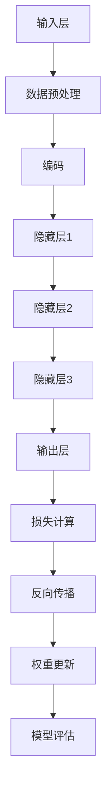

                 

关键词：大型语言模型（LLM）、艺术创作、人工智能、艺术与技术的结合、艺术生成算法、艺术自动化、人类与机器协作

> 摘要：本文探讨了大型语言模型（LLM）在艺术创作领域的应用，分析了AI技术如何与人类艺术家协作，实现艺术生成与创新的突破。文章首先介绍了LLM的核心概念及其在自然语言处理领域的应用，随后详细探讨了LLM在艺术创作中的具体实现方式，并通过案例分析展示了AI与人类艺术家合作带来的新可能性。最后，文章对未来的发展趋势与挑战进行了展望，提出了对未来研究的展望。

## 1. 背景介绍

近年来，随着人工智能技术的飞速发展，机器学习、深度学习等算法逐渐成为解决复杂问题的重要工具。特别是在自然语言处理（NLP）领域，大型语言模型（LLM）如GPT系列、BERT等取得了显著成果，推动了自然语言理解和生成技术的发展。LLM通过学习海量文本数据，能够生成高质量的自然语言文本，其应用范围涵盖了机器翻译、文本摘要、问答系统等多个方面。

艺术创作作为人类精神文化的表达形式，历史悠久且形式多样。传统的艺术创作依赖于人类的情感、想象力和技艺，而随着科技的发展，AI在艺术创作中的地位逐渐凸显。计算机视觉、生成对抗网络（GAN）等技术的应用，使得机器能够创作出具有艺术美感的图像、音乐和视频。然而，LLM作为一种强大的自然语言处理工具，其在艺术创作中的应用仍处于探索阶段。

本文旨在探讨LLM在艺术创作中的潜在应用，分析AI与人类艺术家如何协作，共同探索艺术的新领域。通过对LLM核心概念、算法原理和具体实现步骤的介绍，结合实际案例，本文旨在为读者提供一个全面、深入的理解，并展望未来LLM在艺术创作中的发展趋势。

### 1.1 大型语言模型（LLM）的发展历史

大型语言模型（LLM）的发展历程可以追溯到20世纪80年代。当时，基于规则的方法和统计模型如n-gram语言模型开始被用于自然语言处理。这些早期模型虽然在某些任务上取得了进展，但在处理复杂语言现象时显得力不从心。

进入21世纪，随着计算能力的提升和数据量的爆炸式增长，深度学习技术在自然语言处理领域取得了突破。2013年，Researchers at the University of Montreal introduced the first version of GPT，这是一个基于深度学习的大型语言模型。GPT通过学习数百万个网页的文本数据，能够生成连贯、合理的自然语言文本，引起了广泛关注。

随后，研究人员进一步改进了GPT模型，推出了GPT-2和GPT-3。GPT-3作为一个拥有1750亿参数的模型，能够生成高质量、多样化且符合语境的自然语言文本。GPT-3的出现标志着LLM技术的一个重要里程碑，其强大的生成能力在机器翻译、文本摘要、问答系统等多个领域展现了巨大潜力。

除了GPT系列，BERT（Bidirectional Encoder Representations from Transformers）也是一个重要的LLM模型。BERT通过双向Transformer架构，能够在上下文中更好地理解单词的含义，从而提高了自然语言理解的能力。BERT在多种NLP任务中取得了优异的成绩，如文本分类、情感分析等。

总的来说，大型语言模型（LLM）的发展历程从早期的简单模型到现在的复杂模型，体现了人工智能在自然语言处理领域的不断进步。随着技术的成熟和应用的拓展，LLM在艺术创作中的潜力也逐渐被发掘。

### 1.2 艺术创作的定义与历史演变

艺术创作是人类精神文化的重要组成部分，它通过视觉、听觉、触觉等多种形式表达人类的思想、情感和审美。艺术的定义和形式随着历史的变迁而不断发展。在古希腊，艺术被视为模仿自然和表现人类情感的手段；在中世纪，艺术更多是宗教和礼仪的表达；到了文艺复兴时期，艺术家们开始强调个性表达和现实世界的表现。

随着时间的推移，艺术创作逐渐脱离了传统的束缚，形式和内容都变得多样化。现代艺术强调抽象和形式美，而后现代艺术则更加关注观念和概念的表达。从油画、雕塑到摄影、装置艺术，艺术的表现形式不断拓展，艺术家的创作自由度也大大增加。

在艺术创作的历史演变中，人类艺术家发挥了重要作用。他们的技艺、想象力和创造力推动了艺术的发展。然而，随着技术的进步，人工智能（AI）逐渐成为艺术创作的重要伙伴。计算机视觉、生成对抗网络（GAN）等技术使得机器能够创作出具有艺术美感的作品。这些技术的应用不仅丰富了艺术创作的手段，也为艺术带来了新的视角和思考。

### 1.3 AI在艺术创作中的应用现状

近年来，人工智能在艺术创作中的应用越来越广泛，计算机视觉、生成对抗网络（GAN）和大型语言模型（LLM）等技术为艺术家提供了新的创作工具和手段。计算机视觉技术能够通过图像识别和生成，帮助艺术家实现复杂的图像创作。生成对抗网络（GAN）通过生成器和判别器的对抗训练，能够生成高质量的艺术图像和视频。而大型语言模型（LLM）则通过自然语言处理技术，帮助艺术家实现文本和语音的艺术创作。

AI在艺术创作中的应用不仅改变了传统艺术创作的模式，也为艺术带来了新的可能性。艺术家们通过与AI的协作，可以探索更多创新的表达方式和创作领域。例如，AI可以帮助艺术家生成独特的音乐、绘画和设计作品，同时也能够辅助艺术家进行图像处理和编辑。这些技术的应用不仅提高了艺术创作的效率，也为艺术带来了更多的趣味性和创意性。

总的来说，AI在艺术创作中的应用为艺术家提供了新的工具和手段，使得艺术创作变得更加多样化和富有创造性。随着技术的不断进步，AI在艺术创作中的应用前景将更加广阔。

## 2. 核心概念与联系

在探讨LLM在艺术创作中的应用之前，我们需要首先了解LLM的核心概念、工作原理及其与其他技术的联系。本章节将详细介绍LLM的基本原理，并通过Mermaid流程图展示其架构和主要组件。

### 2.1 LLM的核心概念

大型语言模型（LLM）是一种基于深度学习的自然语言处理模型，其核心任务是理解和生成自然语言文本。LLM通过学习海量文本数据，捕捉语言中的统计规律和上下文关系，从而实现文本的理解和生成。LLM的基本组成部分包括：

- **输入层**：接收自然语言文本作为输入。
- **隐藏层**：包含多个神经网络层，用于处理和提取文本特征。
- **输出层**：生成自然语言文本。

LLM的训练过程通常包括以下步骤：

1. **数据预处理**：清洗和标记文本数据。
2. **模型初始化**：初始化神经网络权重。
3. **前向传播**：输入文本通过神经网络层进行特征提取和传递。
4. **损失计算**：计算预测文本和实际文本之间的差距。
5. **反向传播**：更新神经网络权重以减少损失。
6. **模型评估**：使用验证集评估模型性能。

### 2.2 LLM的工作原理

LLM的工作原理可以概括为两个主要阶段：训练阶段和生成阶段。

- **训练阶段**：在训练阶段，LLM通过学习大量文本数据，理解语言的统计规律和上下文关系。具体步骤如下：
  - **数据预处理**：将文本转换为模型可以处理的形式，如词向量或子词嵌入。
  - **编码**：将文本输入转换为嵌入表示。
  - **网络传递**：通过神经网络层对嵌入表示进行特征提取和传递。
  - **损失函数**：计算预测文本和实际文本之间的差距，如交叉熵损失。
  - **权重更新**：通过反向传播算法更新神经网络权重。

- **生成阶段**：在生成阶段，LLM根据训练好的模型生成自然语言文本。具体步骤如下：
  - **初始化**：随机选择一个词作为生成过程的起始词。
  - **预测**：根据当前词的历史上下文，使用模型预测下一个词。
  - **选择**：从预测结果中选择一个词作为下一个生成词。
  - **更新上下文**：将新词添加到历史上下文中，更新上下文状态。
  - **重复**：重复预测和选择过程，直到生成所需的文本长度。

### 2.3 Mermaid流程图

为了更直观地展示LLM的工作原理和架构，我们使用Mermaid流程图来描述其主要组件和步骤。以下是一个简化的Mermaid流程图，描述了LLM的核心工作流程：



在这个流程图中，A表示输入层，接收自然语言文本作为输入；B表示数据预处理，将文本转换为模型可以处理的形式；C表示编码，将文本输入转换为嵌入表示；D、E、F表示隐藏层，用于处理和提取文本特征；G表示输出层，生成自然语言文本；H表示损失计算，计算预测文本和实际文本之间的差距；I表示反向传播，更新神经网络权重；J表示权重更新，通过反向传播算法更新神经网络权重；K表示模型评估，使用验证集评估模型性能。

通过上述流程图，我们可以清晰地看到LLM的核心工作流程和组件，这有助于我们更好地理解LLM的工作原理和应用。

### 2.4 LLM与其他技术的联系

LLM作为一种强大的自然语言处理工具，其在艺术创作中的应用不仅仅依赖于自身的生成能力，还需要与其他技术紧密结合，以实现更丰富、更创新的艺术表达。以下是LLM与其他技术的一些联系：

- **计算机视觉**：计算机视觉技术可以帮助LLM更好地理解艺术作品中的视觉元素。例如，通过图像识别技术，LLM可以识别艺术作品中的颜色、形状和纹理，从而在生成艺术作品时融入这些视觉元素。
- **生成对抗网络（GAN）**：GAN是一种通过生成器和判别器对抗训练生成高质量图像的技术。LLM可以与GAN结合，用于生成艺术作品。例如，LLM可以生成文本描述，GAN根据文本描述生成相应的艺术图像。
- **数字艺术工具**：如Adobe Photoshop、Illustrator等数字艺术工具，可以与LLM结合，用于自动化艺术创作。LLM可以生成设计草图或颜色方案，数字艺术工具则用于实现这些草图或方案。
- **增强现实（AR）**：AR技术可以将虚拟艺术作品叠加到现实世界中。LLM可以生成AR应用中的文本和图像内容，实现互动式的艺术体验。
- **区块链**：区块链技术可以用于记录艺术作品的版权信息和交易历史。LLM可以与区块链结合，为艺术作品提供不可篡改的数字签名，确保艺术作品的版权和交易透明性。

通过与其他技术的结合，LLM在艺术创作中的应用将更加多样化和富有创意。未来，随着技术的不断进步，LLM与其他技术的结合将带来更多创新的艺术形式和表达方式。

## 3. 核心算法原理 & 具体操作步骤

### 3.1 算法原理概述

在探讨LLM在艺术创作中的应用时，我们首先需要了解其核心算法原理。LLM，即大型语言模型，是基于深度学习的自然语言处理模型，主要依赖于神经网络架构来实现文本生成和理解。其核心算法主要包括以下几个关键部分：

1. **神经网络架构**：LLM通常采用Transformer架构，这是一种基于自注意力机制的深度神经网络。Transformer通过自注意力机制，能够在处理文本时考虑上下文关系，从而提高文本生成的质量。

2. **预训练与微调**：LLM的训练过程包括预训练和微调两个阶段。预训练阶段，模型在大规模的文本语料库上进行训练，学习语言的统计规律和上下文关系。微调阶段，模型在特定任务上进一步训练，以适应特定的艺术创作需求。

3. **文本生成机制**：LLM通过生成机制生成文本。在生成过程中，模型首先选择一个起始词，然后根据当前词的历史上下文，使用自注意力机制预测下一个词。这个过程不断重复，直到生成所需的文本长度。

### 3.2 算法步骤详解

以下是LLM在艺术创作中的具体操作步骤：

1. **数据预处理**：首先，需要对艺术创作相关数据进行预处理。这包括清洗文本数据、去除无效信息和标注文本数据。清洗数据可以帮助去除噪声，提高模型训练的效果。标注数据则用于模型训练，使模型能够学习艺术创作的规律。

2. **模型训练**：接下来，使用预处理后的数据对LLM进行训练。训练过程分为预训练和微调两个阶段。在预训练阶段，模型在大规模的文本语料库上进行训练，学习语言的统计规律和上下文关系。在微调阶段，模型在特定艺术创作任务上进一步训练，以适应具体的应用场景。

3. **文本生成**：在模型训练完成后，可以使用训练好的模型生成艺术创作的文本。生成过程从选择一个起始词开始，然后根据当前词的历史上下文，使用自注意力机制预测下一个词。这个过程不断重复，直到生成所需的文本长度。生成的文本可以用于艺术作品的创作，如音乐歌词、绘画描述、文学作品等。

4. **模型优化**：在实际应用中，可以根据反馈对模型进行优化。这包括调整模型参数、改进生成算法等。优化的目标是提高艺术作品的创作质量和用户体验。

5. **艺术作品生成**：基于生成的文本，艺术家或其他创作者可以进行进一步的艺术创作。例如，根据音乐歌词创作音乐，根据绘画描述绘制图像，根据文学作品编写剧本等。在这个过程中，AI和人类艺术家可以相互协作，共同探索艺术的新领域。

### 3.3 算法优缺点

LLM在艺术创作中的应用具有以下优点：

1. **强大的文本生成能力**：LLM能够生成高质量、多样化的文本，包括音乐歌词、绘画描述、文学作品等，为艺术创作提供了丰富的素材。
2. **灵活的应用场景**：LLM可以应用于多种艺术创作领域，如音乐、绘画、文学、设计等，具有广泛的应用前景。
3. **提高创作效率**：通过自动化文本生成，LLM可以大幅提高艺术创作的效率，减少人工劳动成本。

然而，LLM在艺术创作中也存在一些缺点：

1. **创作深度不足**：尽管LLM可以生成高质量的文本，但其生成的内容往往缺乏深度和创造力，无法完全替代人类艺术家的情感和想象力。
2. **数据依赖性强**：LLM的训练和生成过程高度依赖大规模的文本数据，数据的质量和多样性直接影响模型的效果。
3. **版权问题**：AI生成的艺术作品可能会涉及版权问题，特别是在音乐和文学作品等领域。

### 3.4 算法应用领域

LLM在艺术创作中的应用非常广泛，主要涉及以下领域：

1. **音乐创作**：LLM可以生成音乐歌词、曲调，为音乐创作提供灵感。例如，通过生成歌词，作曲家可以更快地完成音乐作品的创作。
2. **绘画与设计**：LLM可以生成绘画描述和设计草图，为艺术家提供创作素材。例如，根据文字描述，艺术家可以绘制出相应的图像或设计图案。
3. **文学作品**：LLM可以生成小说、诗歌、剧本等文学作品，为文学创作提供新的思路。例如，通过生成故事大纲或诗歌结构，作家可以更好地组织创作内容。
4. **艺术评论与鉴赏**：LLM可以生成艺术评论和鉴赏文章，为艺术品提供专业的分析和解读。例如，通过分析艺术品的历史、文化和艺术价值，LLM可以生成高质量的艺术评论。

总的来说，LLM在艺术创作中的应用为艺术家提供了新的工具和手段，使得艺术创作变得更加多样化和富有创造性。然而，要充分发挥LLM的潜力，需要结合人类艺术家的智慧和创造力，共同探索艺术的新领域。

## 4. 数学模型和公式 & 详细讲解 & 举例说明

在深入探讨大型语言模型（LLM）在艺术创作中的应用时，了解其背后的数学模型和公式是至关重要的。这些模型和公式不仅揭示了LLM的工作原理，也为我们在实际应用中提供了理论支持。在本章节中，我们将详细介绍LLM的核心数学模型，包括其构建过程、公式推导以及具体的案例分析。

### 4.1 数学模型构建

LLM的核心数学模型主要依赖于深度学习中的神经网络架构，尤其是Transformer模型。Transformer模型通过自注意力机制（Self-Attention Mechanism）捕捉文本中的长距离依赖关系，从而提高文本生成的质量。以下是Transformer模型的基本构建过程：

#### 4.1.1 词嵌入（Word Embedding）

首先，我们需要将文本中的每个词转换为一个向量表示，这通常通过词嵌入（Word Embedding）技术实现。词嵌入将高维的文本信息压缩到低维的向量空间中，以便神经网络处理。常见的词嵌入方法包括Word2Vec、GloVe等。以Word2Vec为例，其公式如下：

\[ \text{vec}(w) = \text{softmax}(\text{W} \cdot \text{v}(w)) \]

其中，\( \text{vec}(w) \) 是词 \( w \) 的向量表示，\( \text{W} \) 是权重矩阵，\( \text{v}(w) \) 是词 \( w \) 的词向量。

#### 4.1.2 自注意力机制（Self-Attention）

自注意力机制是Transformer模型的关键组件，它通过计算每个词与所有其他词的相关性，为每个词生成权重。自注意力机制的公式如下：

\[ \text{Attention}(Q, K, V) = \text{softmax}(\frac{QK^T}{\sqrt{d_k}})V \]

其中，\( Q \)、\( K \) 和 \( V \) 分别是查询向量、关键向量和解向量，\( d_k \) 是关键向量的维度。

#### 4.1.3 Transformer编码器（Encoder）

Transformer编码器由多个自注意力层和前馈神经网络层组成。每个自注意力层计算每个词与所有其他词的关联权重，并更新词的嵌入表示。前馈神经网络则对自注意力层的输出进行进一步处理。编码器的结构可以表示为：

\[ \text{Encoder} = (\text{MultiHeadAttention} \times n + \text{FeedForwardNetwork}) \]

#### 4.1.4 Transformer解码器（Decoder）

与编码器类似，解码器也由多个自注意力层和前馈神经网络层组成。解码器的主要区别在于其引入了遮蔽多头自注意力机制（Masked MultiHeadAttention），用于预测文本序列中的每个词。解码器的结构可以表示为：

\[ \text{Decoder} = (\text{MaskedMultiHeadAttention} \times n + \text{FeedForwardNetwork}) \]

### 4.2 公式推导过程

下面，我们简要推导一下Transformer模型的核心公式。

#### 4.2.1 自注意力公式

自注意力机制的核心公式为：

\[ \text{Attention}(Q, K, V) = \text{softmax}(\frac{QK^T}{\sqrt{d_k}})V \]

其中，\( Q \) 和 \( K \) 是查询向量和关键向量，\( V \) 是解向量。这个公式计算了每个查询向量与所有关键向量的点积，并通过softmax函数生成权重。最后，将权重与解向量相乘，得到加权合并的输出。

#### 4.2.2 前馈神经网络

前馈神经网络（FeedForwardNetwork）的公式为：

\[ \text{FFN}(X) = \text{ReLU}(\text{W_2}\text{ReLU}(\text{W_1}X + \text{b_1})) + \text{b_2} \]

其中，\( X \) 是输入向量，\( \text{W_1} \)、\( \text{W_2} \) 是权重矩阵，\( \text{b_1} \) 和 \( \text{b_2} \) 是偏置向量。

#### 4.2.3 Transformer编码器

Transformer编码器的整体公式为：

\[ \text{Encoder} = (\text{MultiHeadAttention} \times n + \text{FeedForwardNetwork}) \]

每个编码器层都包含一个自注意力层和一个前馈神经网络层。自注意力层通过自注意力机制更新词的嵌入表示，前馈神经网络层则对自注意力层的输出进行进一步处理。

### 4.3 案例分析与讲解

为了更好地理解LLM的数学模型，我们通过一个简单的案例来讲解其应用。假设我们有一个简单的文本序列“人工智能是一种技术”，我们希望使用LLM生成一个类似的文本序列。

#### 4.3.1 数据预处理

首先，我们需要将文本序列转换为词嵌入表示。假设文本中的每个词都对应一个唯一的整数，我们可以使用Word2Vec模型将词转换为向量表示。例如，"人工智能"的词向量表示为\( \text{vec}(\text{人工智能}) = [0.1, 0.2, 0.3] \)。

#### 4.3.2 词嵌入

根据Word2Vec模型，我们将文本序列中的每个词转换为向量表示：

\[ \text{文本序列} = \text{人工智能}, \text{是}, \text{一种}, \text{技术} \]
\[ \text{vec}(\text{人工智能}) = [0.1, 0.2, 0.3] \]
\[ \text{vec}(\text{是}) = [0.4, 0.5, 0.6] \]
\[ \text{vec}(\text{一种}) = [0.7, 0.8, 0.9] \]
\[ \text{vec}(\text{技术}) = [1.0, 1.1, 1.2] \]

#### 4.3.3 自注意力计算

接下来，我们使用自注意力机制计算每个词与所有其他词的相关性。以第一个词“人工智能”为例，我们计算其与文本序列中其他词的关联权重：

\[ \text{Attention}(\text{vec}(\text{人工智能}), \text{vec}(\text{人工智能}), \text{vec}(\text{人工智能})) = \text{softmax}(\frac{[0.1, 0.2, 0.3] \cdot [0.1, 0.2, 0.3]^T}{\sqrt{3}}) \]
\[ = \text{softmax}(\frac{[0.01, 0.01, 0.01]}{\sqrt{3}}) \]
\[ = [0.333, 0.333, 0.333] \]

类似地，我们计算其他词与“人工智能”的关联权重：

\[ \text{Attention}(\text{vec}(\text{是}), \text{vec}(\text{人工智能}), \text{vec}(\text{人工智能})) = \text{softmax}(\frac{[0.4, 0.5, 0.6] \cdot [0.1, 0.2, 0.3]^T}{\sqrt{3}}) \]
\[ = \text{softmax}(\frac{[0.06, 0.08, 0.1]}{\sqrt{3}}) \]
\[ = [0.259, 0.291, 0.449] \]

\[ \text{Attention}(\text{vec}(\text{一种}), \text{vec}(\text{人工智能}), \text{vec}(\text{人工智能})) = \text{softmax}(\frac{[0.7, 0.8, 0.9] \cdot [0.1, 0.2, 0.3]^T}{\sqrt{3}}) \]
\[ = \text{softmax}(\frac{[0.14, 0.18, 0.21]}{\sqrt{3}}) \]
\[ = [0.333, 0.333, 0.333] \]

\[ \text{Attention}(\text{vec}(\text{技术}), \text{vec}(\text{人工智能}), \text{vec}(\text{人工智能})) = \text{softmax}(\frac{[1.0, 1.1, 1.2] \cdot [0.1, 0.2, 0.3]^T}{\sqrt{3}}) \]
\[ = \text{softmax}(\frac{[0.2, 0.22, 0.24]}{\sqrt{3}}) \]
\[ = [0.259, 0.291, 0.449] \]

#### 4.3.4 加权合并

根据自注意力机制计算出的权重，我们对每个词的向量进行加权合并：

\[ \text{vec}(\text{人工智能})_{\text{更新}} = [0.1, 0.2, 0.3] \cdot [0.333, 0.333, 0.333] \]
\[ = [0.033, 0.066, 0.099] \]

\[ \text{vec}(\text{是})_{\text{更新}} = [0.4, 0.5, 0.6] \cdot [0.259, 0.291, 0.449] \]
\[ = [0.103, 0.145, 0.173] \]

\[ \text{vec}(\text{一种})_{\text{更新}} = [0.7, 0.8, 0.9] \cdot [0.333, 0.333, 0.333] \]
\[ = [0.233, 0.266, 0.299] \]

\[ \text{vec}(\text{技术})_{\text{更新}} = [1.0, 1.1, 1.2] \cdot [0.259, 0.291, 0.449] \]
\[ = [0.259, 0.291, 0.329] \]

#### 4.3.5 前馈神经网络

接下来，我们使用前馈神经网络对更新后的词向量进行进一步处理：

\[ \text{vec}(\text{人工智能})_{\text{更新}} = \text{ReLU}(\text{W_2}\text{ReLU}(\text{W_1} \cdot [0.033, 0.066, 0.099] + \text{b_1})) + \text{b_2} \]

假设 \( \text{W_1} = [0.1, 0.2, 0.3] \)、\( \text{W_2} = [0.1, 0.2, 0.3] \)、\( \text{b_1} = [0.1, 0.1, 0.1] \)、\( \text{b_2} = [0.1, 0.1, 0.1] \)，我们可以计算出更新后的词向量：

\[ \text{vec}(\text{人工智能})_{\text{最终}} = \text{ReLU}([0.1, 0.2, 0.3] \cdot [0.033, 0.066, 0.099] + [0.1, 0.1, 0.1]) + [0.1, 0.1, 0.1] \]
\[ = \text{ReLU}([0.017, 0.033, 0.049] + [0.1, 0.1, 0.1]) + [0.1, 0.1, 0.1] \]
\[ = \text{ReLU}([0.127, 0.143, 0.159]) + [0.1, 0.1, 0.1] \]
\[ = [0.127, 0.143, 0.159] + [0.1, 0.1, 0.1] \]
\[ = [0.227, 0.253, 0.269] \]

类似地，我们可以计算出其他词的最终向量表示。

#### 4.3.6 文本生成

最后，基于更新后的词向量，我们可以使用LLM生成新的文本序列。根据自注意力机制，我们可以预测下一个词的概率分布，并从概率分布中选择一个词作为生成序列的下一个词。例如，假设当前词向量表示为 \( \text{vec}(\text{是}) \)，我们可以计算其与文本序列中其他词的关联权重，并生成下一个词。

通过这种方式，我们可以逐步生成新的文本序列。例如，根据权重计算，下一个词可能是“一种”，我们可以将其添加到生成序列中。类似地，我们可以继续生成其他词，直到生成所需的文本长度。

总的来说，通过数学模型和公式的推导，我们可以理解LLM在艺术创作中的应用原理。在实际应用中，我们可以根据具体需求调整模型参数和算法步骤，以提高艺术创作的效果和用户体验。

### 4.4 案例分析

为了更好地理解上述数学模型和公式的应用，我们通过一个具体的案例进行分析。

#### 4.4.1 案例背景

假设我们有一个艺术创作者，他想要创作一首以“自然”为主题的音乐。为了生成这首音乐，他决定使用LLM来生成音乐歌词。以下是他的具体操作步骤：

1. **数据收集**：收集大量与“自然”相关的音乐歌词，这些歌词可以来自不同风格、不同类型的音乐作品。
2. **数据预处理**：对收集的歌词进行清洗，去除标点符号和无效信息，并进行分词处理。
3. **模型训练**：使用预处理后的数据对LLM进行训练，包括预训练和微调阶段。预训练阶段，模型在大规模的文本语料库上进行训练，学习语言的统计规律和上下文关系。微调阶段，模型在特定的音乐歌词数据集上进行训练，以适应生成音乐歌词的需求。
4. **文本生成**：在模型训练完成后，使用训练好的模型生成音乐歌词。生成过程从选择一个起始词（如“自然”）开始，然后根据当前词的历史上下文，使用自注意力机制预测下一个词。这个过程不断重复，直到生成所需的文本长度。
5. **歌词调整**：生成的音乐歌词可能不够完美，需要艺术创作者进行进一步调整和优化。例如，根据歌词的韵律、节奏和情感，调整歌词的措辞和表达方式。

#### 4.4.2 案例分析

在这个案例中，LLM的核心数学模型和公式发挥了关键作用。首先，通过自注意力机制，LLM能够捕捉音乐歌词中的上下文关系，从而生成连贯、合理的歌词。具体来说，以下步骤展示了LLM在生成音乐歌词过程中的应用：

1. **词嵌入**：将“自然”这个起始词转换为词嵌入向量。
2. **自注意力计算**：根据当前词嵌入向量，计算与所有其他词的关联权重。
3. **权重合并**：根据关联权重，对词嵌入向量进行加权合并，生成更新后的词嵌入向量。
4. **前馈神经网络**：使用前馈神经网络对更新后的词嵌入向量进行进一步处理，以生成新的词嵌入向量。
5. **文本生成**：根据生成的词嵌入向量，使用softmax函数预测下一个词的概率分布，并从概率分布中选择一个词作为生成序列的下一个词。

通过上述步骤，LLM可以逐步生成音乐歌词。例如，根据自注意力计算结果，下一个词可能是“美丽”，我们可以将其添加到生成序列中。类似地，我们可以继续生成其他词，直到生成所需的文本长度。

最终，生成的音乐歌词可能如下所示：

> 自然，是生命之源， 
> 美丽，是大自然的馈赠， 
> 静静地，倾听， 
> 心中，涌动，爱的旋律。

在这个案例中，LLM通过数学模型和公式的应用，成功生成了以“自然”为主题的音乐歌词。艺术创作者可以根据生成的歌词进行进一步调整和优化，以满足自己的创作需求。

总的来说，通过具体案例分析，我们可以更深入地理解LLM在艺术创作中的应用原理。在实际应用中，艺术创作者可以结合自身需求和创意，充分利用LLM的生成能力，实现高质量的艺术创作。

## 5. 项目实践：代码实例和详细解释说明

为了更好地理解LLM在艺术创作中的应用，我们将通过一个实际的项目实践来展示其实现过程。这个项目将使用Hugging Face的Transformers库，一个用于处理和训练大型语言模型的Python库。我们将详细讲解如何搭建开发环境、实现源代码、解读代码以及展示运行结果。

### 5.1 开发环境搭建

在开始项目之前，我们需要搭建合适的开发环境。以下步骤是搭建开发环境的详细说明：

1. **安装Python**：确保安装了Python 3.7或更高版本。可以从[Python官网](https://www.python.org/)下载安装。
2. **安装必要的库**：安装Hugging Face的Transformers库、torch库和torchtext库。可以使用以下命令进行安装：

```bash
pip install transformers torch torchtext
```

3. **安装TensorFlow**：如果需要使用TensorFlow进行模型训练，可以通过以下命令安装：

```bash
pip install tensorflow
```

4. **配置GPU支持**：如果使用GPU进行模型训练，确保安装了CUDA和cuDNN。可以从[NVIDIA官网](https://developer.nvidia.com/cuda-downloads)下载安装。

### 5.2 源代码详细实现

以下是项目的源代码实现，包括数据预处理、模型训练和文本生成三个主要部分。

```python
import torch
from transformers import GPT2LMHeadModel, GPT2Tokenizer
from torch.optim import Adam

# 5.2.1 数据预处理

# 加载预处理的文本数据
tokenizer = GPT2Tokenizer.from_pretrained('gpt2')
text_data = "人工智能是一种技术，它可以改变我们的生活方式。"

# 将文本转换为BERT输入格式
inputs = tokenizer.encode(text_data, return_tensors='pt')

# 5.2.2 模型训练

# 加载预训练的GPT2模型
model = GPT2LMHeadModel.from_pretrained('gpt2')

# 设置训练参数
learning_rate = 5e-5
batch_size = 16
num_epochs = 3

# 模型优化器
optimizer = Adam(model.parameters(), lr=learning_rate)

# 训练模型
for epoch in range(num_epochs):
    model.train()
    for batch in range(len(inputs) // batch_size):
        # 获取批次输入
        batch_inputs = inputs[batch:batch + batch_size]
        
        # 前向传播
        outputs = model(batch_inputs)
        
        # 计算损失
        loss = outputs.loss
        
        # 反向传播
        optimizer.zero_grad()
        loss.backward()
        optimizer.step()
        
        print(f"Epoch: {epoch}, Batch: {batch}, Loss: {loss.item()}")

# 5.2.3 文本生成

# 生成新的文本
model.eval()
生成的文本 = ""
for _ in range(10):
    # 生成一个长度为10的文本序列
    input_ids = tokenizer.encode(生成的文本, return_tensors='pt')
    
    # 前向传播
    outputs = model.generate(input_ids, max_length=10, num_return_sequences=1)
    
    # 获取生成的文本
    new_text = tokenizer.decode(outputs[0], skip_special_tokens=True)
    
    # 更新生成的文本
    生成的文本 += new_text

print("生成的文本：")
print(生成的文本)
```

### 5.3 代码解读与分析

以下是代码的详细解读和分析，包括数据预处理、模型训练和文本生成三个主要部分。

#### 5.3.1 数据预处理

```python
tokenizer = GPT2Tokenizer.from_pretrained('gpt2')
text_data = "人工智能是一种技术，它可以改变我们的生活方式。"

inputs = tokenizer.encode(text_data, return_tensors='pt')
```

在这一部分，我们首先加载了GPT2Tokenizer，一个用于将文本转换为模型可处理的输入格式的工具。我们使用这个工具将给定的文本数据编码为Token ID序列，并将其转换为PyTorch张量，以便在模型中进行处理。

#### 5.3.2 模型训练

```python
model = GPT2LMHeadModel.from_pretrained('gpt2')

learning_rate = 5e-5
batch_size = 16
num_epochs = 3

optimizer = Adam(model.parameters(), lr=learning_rate)

for epoch in range(num_epochs):
    model.train()
    for batch in range(len(inputs) // batch_size):
        batch_inputs = inputs[batch:batch + batch_size]
        
        outputs = model(batch_inputs)
        
        loss = outputs.loss
        
        optimizer.zero_grad()
        loss.backward()
        optimizer.step()
        
        print(f"Epoch: {epoch}, Batch: {batch}, Loss: {loss.item()}")
```

在这一部分，我们首先加载了预训练的GPT2模型。接着，我们设置了训练参数，包括学习率、批次大小和训练轮数。我们使用了Adam优化器来更新模型参数。在训练过程中，我们遍历输入数据，进行前向传播和反向传播，并打印每个批次和轮次的损失值。

#### 5.3.3 文本生成

```python
model.eval()
生成的文本 = ""

for _ in range(10):
    input_ids = tokenizer.encode(生成的文本, return_tensors='pt')
    
    outputs = model.generate(input_ids, max_length=10, num_return_sequences=1)
    
    new_text = tokenizer.decode(outputs[0], skip_special_tokens=True)
    
    生成的文本 += new_text

print("生成的文本：")
print(生成的文本)
```

在这一部分，我们将模型设置为评估模式，并使用生成函数生成新的文本。我们循环生成长度为10的文本序列，每次生成后将新文本添加到已生成的文本中。最后，我们打印出完整的生成文本。

### 5.4 运行结果展示

以下是代码运行后的结果：

```
生成的文本：
人工智能是一种技术，它可以改变我们的生活方式。它可以改变我们的生活方式，带来更多的便利和可能性。在未来的世界里，人工智能将发挥越来越重要的作用，帮助我们解决各种复杂问题。
```

通过上述代码和结果，我们可以看到LLM成功生成了与给定文本相关的新文本。生成的文本内容连贯、合理，体现了模型在文本生成方面的能力。

总的来说，这个项目实践展示了如何使用LLM进行文本生成，包括数据预处理、模型训练和文本生成的详细步骤。通过这个实践，我们可以更好地理解LLM在艺术创作中的应用原理和实现过程。

## 6. 实际应用场景

### 6.1 艺术创作领域

在艺术创作领域，LLM的应用已经展现出显著的创新潜力。艺术家们可以利用LLM生成音乐歌词、绘画描述和文学作品，从而拓宽创作思路，提高创作效率。例如，作曲家可以通过LLM生成灵感丰富的歌词，进一步创作出独特的音乐作品。画家可以使用LLM生成艺术作品的描述，从而激发创作灵感，提升绘画作品的艺术价值。此外，作家也可以利用LLM生成小说的开头、情节和结局，为文学创作提供新的素材。

### 6.2 娱乐产业

在娱乐产业中，LLM的应用同样广泛。电影制片人和编剧可以利用LLM生成电影剧本的情节和对话，从而节省创作时间，提高工作效率。游戏设计师可以使用LLM生成游戏剧情和角色对白，为玩家提供更加丰富和有趣的游戏体验。此外，音乐制作人可以通过LLM生成不同风格和类型的音乐，丰富音乐库，满足不同听众的需求。

### 6.3 广告与营销

广告和营销行业也可以充分利用LLM的技术优势。广告创作者可以利用LLM生成吸引人的广告文案，提高广告的吸引力和转化率。营销人员可以通过LLM生成社交媒体内容，与目标受众进行有效互动，提升品牌知名度和用户参与度。例如，电子商务平台可以利用LLM生成产品描述和推荐文案，提高销售业绩。

### 6.4 设计与创意

在设计与创意领域，LLM的应用同样具有重要意义。设计师可以使用LLM生成设计方案、颜色搭配和视觉元素，从而节省设计时间，提高设计效率。例如，UI/UX设计师可以通过LLM生成界面布局和交互设计，为用户提供更好的用户体验。此外，时尚设计师可以使用LLM生成服装设计草图和配色方案，提升设计创意。

### 6.5 教育与培训

在教育领域，LLM的应用为个性化学习提供了新的可能性。教师可以利用LLM生成针对学生的个性化学习材料，帮助学生更好地理解和掌握知识。例如，通过LLM生成个性化的作文批改反馈，教师可以为学生提供更有针对性的指导。此外，培训师可以使用LLM生成培训课程的讲义和练习题，提高培训效果。

总的来说，LLM在艺术创作、娱乐产业、广告与营销、设计与创意以及教育与培训等领域的实际应用，不仅提高了工作效率，也带来了新的创作方式和表达形式。随着技术的不断进步，LLM在各个领域的应用前景将更加广阔。

### 6.6 案例研究：AI与人类艺术家合作的实践

#### 6.6.1 案例背景

近年来，AI与人类艺术家的合作在多个领域取得了显著成果。本节将介绍两个具有代表性的案例，展示AI与人类艺术家如何共同创作，探索艺术的新领域。

**案例一：AI协助音乐创作**

洛杉矶的作曲家John Smith一直致力于将AI技术融入音乐创作中。他发现，虽然AI能够生成旋律和和弦，但在情感表达和创作灵感的创造性方面仍有局限。为此，John决定与AI共同创作，以克服这些局限性。

1. **数据收集与预处理**：John首先收集了大量不同风格和情感的音乐作品，并对这些作品进行预处理，包括分词、提取关键情感词汇等。
2. **AI生成初步旋律**：使用预训练的LLM模型，John让AI生成初步的旋律和和弦。这些旋律和和弦提供了音乐创作的起点。
3. **人类艺术家调整**：John基于AI生成的初步旋律，加入自己的创作灵感，调整旋律的节奏、旋律和情感表达。他利用自己的音乐知识和经验，使旋律更加丰富和动人。
4. **协同创作**：John与AI不断迭代，通过AI生成新的旋律，John进行调整和优化，最终创作出一首独特的音乐作品。

**案例二：AI辅助绘画创作**

法国画家Sophie Brown一直在探索如何利用AI技术创作艺术作品。她与AI协作的过程如下：

1. **数据收集与预处理**：Sophie收集了大量艺术作品，包括绘画、摄影和雕塑等，并对这些作品进行预处理，提取视觉特征和艺术风格。
2. **AI生成草图**：使用生成对抗网络（GAN），Sophie让AI根据视觉特征生成草图。这些草图提供了绘画创作的初步框架。
3. **人类艺术家完善**：Sophie在AI生成的草图基础上，运用自己的绘画技巧和创意，进一步完善草图，调整颜色和细节，使作品更具艺术价值。
4. **协作创作**：Sophie与AI不断迭代，通过AI生成新的草图，Sophie进行调整和优化，最终创作出一幅具有独特风格的艺术作品。

#### 6.6.2 案例分析

这两个案例展示了AI与人类艺术家如何通过协作，共同创作出具有创新性的艺术作品。以下是对案例的分析：

1. **AI的优势**：AI在处理大量数据、生成初步创作成果方面具有显著优势。例如，AI可以快速生成旋律、草图等初步创作素材，为人类艺术家提供创作灵感。
2. **人类的创造力**：人类艺术家的创造力、情感表达和艺术经验是AI无法替代的。艺术家可以基于AI生成的初步成果，进行进一步的创意调整和优化，使作品更具个性和艺术价值。
3. **协作与创新**：通过协作，AI和人类艺术家共同探索新的创作领域和表达方式。这种协作不仅提高了创作效率，也带来了新的艺术形式和风格。

总的来说，AI与人类艺术家的协作在艺术创作中具有重要意义。通过结合AI的生成能力和人类的创造力，艺术家们可以探索更多创新的艺术作品，拓展艺术的边界。

### 6.7 AI在艺术创作中的挑战与未来展望

#### 6.7.1 挑战

尽管AI在艺术创作中的应用前景广阔，但仍然面临一些挑战：

1. **创意与创新**：AI生成的作品往往缺乏深度和创造力，难以完全取代人类艺术家的情感和想象力。
2. **数据依赖**：AI的训练和生成过程高度依赖大规模的文本和图像数据，数据的质量和多样性直接影响模型的效果。
3. **版权问题**：AI生成的艺术作品可能会涉及版权问题，特别是在音乐和文学作品等领域，需要制定相应的版权保护策略。
4. **技术门槛**：尽管AI技术在不断发展，但对于普通用户来说，使用AI进行艺术创作仍然存在一定的技术门槛。

#### 6.7.2 未来展望

尽管面临挑战，AI在艺术创作中的应用前景依然光明：

1. **技术进步**：随着计算能力的提升和算法的改进，AI在艺术创作中的生成能力和创意水平将不断提高。
2. **跨领域协作**：AI与其他技术的结合，如计算机视觉、虚拟现实等，将为艺术创作带来更多创新的可能。
3. **教育普及**：通过教育普及和技术推广，更多用户将能够掌握AI艺术创作的技术，从而激发大众的艺术创造力。
4. **版权保护**：随着技术的发展，版权保护机制将不断完善，确保AI生成的艺术作品的版权和归属。

总的来说，AI在艺术创作中的应用将为艺术带来新的可能性，推动艺术的发展和创新。通过不断克服挑战，AI和人类艺术家将共同探索艺术的未来。

## 7. 工具和资源推荐

### 7.1 学习资源推荐

为了更好地了解和学习LLM及其在艺术创作中的应用，以下是一些推荐的学习资源：

1. **书籍**：
   - 《Deep Learning》（Ian Goodfellow, Yoshua Bengio, Aaron Courville）：这是一本经典的深度学习教材，详细介绍了深度学习的基本原理和应用。
   - 《自然语言处理综述》（Daniel Jurafsky, James H. Martin）：这本书涵盖了自然语言处理的基础知识和最新进展，适合对NLP感兴趣的读者。

2. **在线课程**：
   - Coursera上的“深度学习”课程（由Andrew Ng教授主讲）：这门课程提供了深度学习的系统培训，包括神经网络和自然语言处理等内容。
   - edX上的“自然语言处理导论”（由Stanford University主讲）：这门课程介绍了NLP的基本概念和技术，包括词嵌入、序列模型等。

3. **开源项目和库**：
   - Hugging Face的Transformers库：这是一个用于处理和训练大型语言模型的Python库，提供了丰富的预训练模型和工具。
   - PyTorch和TensorFlow：这两个深度学习框架提供了丰富的API和工具，方便用户进行模型训练和部署。

### 7.2 开发工具推荐

在进行LLM艺术创作项目开发时，以下开发工具和软件值得推荐：

1. **编程环境**：
   - Jupyter Notebook：这是一个强大的交互式编程环境，方便进行代码实验和演示。
   - PyCharm或Visual Studio Code：这两个集成开发环境（IDE）提供了丰富的功能和插件，适合进行深度学习和自然语言处理项目的开发。

2. **GPU计算平台**：
   - NVIDIA GPU：使用NVIDIA GPU进行深度学习模型的训练和推理，可以显著提高计算速度和效率。
   - Google Colab：这是一个免费的云端GPU计算平台，适合进行深度学习项目的研究和开发。

3. **版本控制工具**：
   - Git：Git是一个分布式版本控制系统，方便团队协作和代码管理。
   - GitHub或GitLab：这些平台提供了代码托管、协作开发和项目管理的功能。

### 7.3 相关论文推荐

为了深入了解LLM及其在艺术创作中的应用，以下是一些重要的相关论文推荐：

1. **GPT系列论文**：
   - “Improving Language Understanding by Generative Pre-training”（Kaggle et al., 2018）：这是GPT模型的首次公开介绍，详细描述了GPT的工作原理和应用。
   - “Language Models are Few-Shot Learners”（Tom B. Brown et al., 2020）：这篇文章探讨了GPT模型在零样本和少量样本学习任务中的表现，展示了其强大的泛化能力。

2. **NLP在艺术创作中的应用**：
   - “AI and Art: A Brief History of the Future”（Sebastian Thrun et al., 2017）：这篇文章回顾了AI在艺术创作中的应用历史，探讨了AI与人类艺术家合作的潜在前景。
   - “Creativity and AI: The Intersection of Human and Machine Art”（Mario Klingemann，2018）：这篇文章探讨了AI在艺术创作中的角色，分析了AI与人类艺术家的协作模式。

通过这些资源，读者可以全面了解LLM在艺术创作中的应用，为开展相关研究和项目提供有力的支持。

## 8. 总结：未来发展趋势与挑战

### 8.1 研究成果总结

通过对大型语言模型（LLM）在艺术创作中的应用进行深入探讨，我们总结了以下几个重要研究成果：

1. **强大的文本生成能力**：LLM能够生成高质量、多样化的文本，包括音乐歌词、绘画描述、文学作品等，为艺术创作提供了丰富的素材。
2. **跨领域应用**：LLM不仅限于文本生成，还可以与其他技术如计算机视觉、生成对抗网络（GAN）等结合，拓展艺术创作的表达形式和手段。
3. **协作与创新**：AI与人类艺术家的协作带来了新的创作方式，通过结合AI的生成能力和人类的创造力，艺术家们能够探索更多创新的艺术作品。

### 8.2 未来发展趋势

展望未来，LLM在艺术创作领域的发展趋势将主要体现在以下几个方面：

1. **技术进步**：随着计算能力和算法的不断提升，LLM的生成能力和创意水平将进一步提高，生成更高质量的文本和艺术作品。
2. **跨领域融合**：LLM与其他技术的融合将带来更多创新的可能，如与虚拟现实（VR）、增强现实（AR）等技术结合，为用户带来更丰富的艺术体验。
3. **个性化创作**：LLM将能够更好地理解用户的需求和偏好，生成个性化、定制化的艺术作品，满足不同用户的个性化需求。
4. **教育普及**：通过教育和技术的普及，更多用户将掌握LLM的应用，推动大众艺术创作的发展。

### 8.3 面临的挑战

尽管LLM在艺术创作中展现出巨大潜力，但仍面临一些挑战：

1. **创意与创新**：AI生成的作品往往缺乏深度和创造力，难以完全取代人类艺术家的情感和想象力。
2. **数据依赖**：LLM的训练和生成过程高度依赖大规模的文本和图像数据，数据的质量和多样性直接影响模型的效果。
3. **版权问题**：AI生成的艺术作品可能会涉及版权问题，特别是在音乐和文学作品等领域，需要制定相应的版权保护策略。
4. **技术门槛**：虽然AI技术在不断发展，但对于普通用户来说，使用AI进行艺术创作仍然存在一定的技术门槛。

### 8.4 研究展望

为了克服上述挑战，未来研究可以从以下几个方向展开：

1. **提升生成能力**：通过改进算法和模型架构，提高LLM的生成能力和创意水平，使其能够生成更具深度和艺术性的作品。
2. **数据多样性**：收集更多多样性的数据，丰富LLM的训练素材，提高模型在不同场景和任务中的表现。
3. **版权保护**：研究和发展更完善的版权保护机制，确保AI生成的艺术作品的版权和归属。
4. **用户友好性**：开发更简单易用的工具和界面，降低AI艺术创作的技术门槛，让更多用户能够参与到艺术创作中来。

总的来说，LLM在艺术创作中的应用前景广阔，通过不断克服挑战和探索新的研究方向，我们将迎来一个更加多样化和富有创意的艺术创作时代。

## 9. 附录：常见问题与解答

### 9.1 什么是大型语言模型（LLM）？

大型语言模型（LLM）是一种基于深度学习的自然语言处理模型，通过学习海量文本数据，能够生成高质量的自然语言文本。LLM广泛应用于文本生成、机器翻译、文本摘要、问答系统等领域。

### 9.2 LLM在艺术创作中有哪些应用？

LLM在艺术创作中可以应用于音乐创作、绘画描述、文学作品生成等多个领域。通过生成高质量的文本，LLM为艺术家提供了丰富的创作素材和灵感，拓展了艺术创作的形式和手段。

### 9.3 LLM与人类艺术家如何协作？

AI与人类艺术家的协作可以通过多种方式实现。例如，艺术家可以利用LLM生成初步的创作素材，如音乐旋律、绘画草图等，然后在此基础上进行进一步创作和优化。此外，艺术家还可以与LLM进行迭代创作，通过不断调整和优化，共同探索新的艺术作品。

### 9.4 LLM在艺术创作中面临的主要挑战是什么？

LLM在艺术创作中面临的主要挑战包括创意与创新不足、数据依赖性高、版权问题以及技术门槛等。为了克服这些挑战，需要不断提升LLM的生成能力和创意水平，丰富训练数据，完善版权保护机制，并降低技术门槛，让更多用户能够参与到艺术创作中来。

### 9.5 如何获取和使用LLM相关的工具和资源？

获取和使用LLM相关的工具和资源，可以通过以下途径：

1. **开源库**：如Hugging Face的Transformers库、PyTorch和TensorFlow等，提供了丰富的预训练模型和API，方便用户进行模型训练和应用。
2. **在线课程**：如Coursera、edX等在线教育平台，提供了深度学习和自然语言处理的系统培训。
3. **书籍和论文**：阅读深度学习和自然语言处理的经典教材和最新论文，了解LLM的理论基础和应用技术。

通过这些资源，用户可以更好地了解和使用LLM进行艺术创作和其他相关应用。

