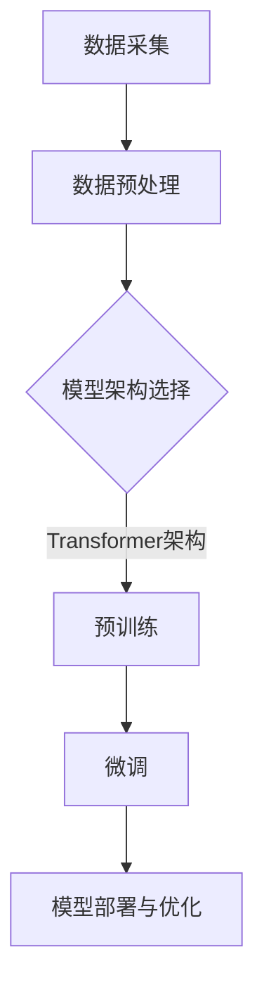

                 

关键词：语言模型（LLM）、产业链、发展机遇、技术挑战、应用场景、未来展望

> 摘要：本文将深入探讨语言模型（LLM）产业链的形成与发展机遇。首先，我们将回顾LLM的发展背景和技术原理。接着，本文将详细分析LLM产业链中的各个关键环节，包括数据采集、模型训练、部署与优化等。此外，本文还将讨论LLM在多个领域的应用场景，如自然语言处理、智能客服、内容生成等。最后，本文将展望LLM产业链的未来发展趋势与挑战，并提出相关的对策建议。

## 1. 背景介绍

随着人工智能技术的不断发展，语言模型（LLM）作为自然语言处理的核心技术之一，已经取得了显著的进展。LLM能够理解和生成自然语言，从而实现人与机器的智能交互。这一技术的突破，不仅提升了自然语言处理的应用水平，也为各行各业带来了新的发展机遇。

LLM产业链的形成，可以追溯到20世纪90年代。当时，研究人员开始尝试使用神经网络来处理自然语言。随着深度学习技术的发展，特别是2018年谷歌发布的BERT模型，使得LLM的性能大幅提升。随后，微软的GPT-3、OpenAI的ChatGPT等大型语言模型相继问世，进一步推动了LLM产业链的快速发展。

## 2. 核心概念与联系

### 2.1. 语言模型的基本概念

语言模型（Language Model，简称LLM）是一种基于统计或神经网络的模型，用于预测自然语言序列的概率分布。它可以用来生成文本、评估文本质量、进行机器翻译等。

### 2.2. 语言模型的工作原理

LLM的工作原理主要分为两个阶段：预训练和微调。预训练阶段，模型在大规模的语料库上进行训练，学习语言的统计规律和语义信息。微调阶段，模型根据特定任务的需求，在特定领域的语料上进行训练，以适应具体的任务。

### 2.3. 语言模型的架构

LLM的架构通常采用深度神经网络，特别是变换器（Transformer）架构。这种架构可以处理长序列，并且具有并行计算的优势，从而提高了模型的性能。

### 2.4. 语言模型的 Mermaid 流程图



## 3. 核心算法原理 & 具体操作步骤

### 3.1. 算法原理概述

LLM的核心算法是基于深度神经网络，特别是变换器（Transformer）架构。这种架构可以处理长序列，并且具有并行计算的优势，从而提高了模型的性能。

### 3.2. 算法步骤详解

1. 数据采集：收集大量的文本数据，用于模型的预训练。
2. 数据预处理：对采集到的文本数据进行处理，包括分词、去停用词、词向量化等。
3. 预训练：使用变换器（Transformer）架构对预处理后的数据进行训练，学习语言的统计规律和语义信息。
4. 微调：在预训练的基础上，使用特定领域的语料对模型进行微调，以适应具体的任务。
5. 模型部署与优化：将训练好的模型部署到实际应用场景中，并进行优化，以提高模型的性能。

### 3.3. 算法优缺点

**优点：**
1. 高效处理长序列。
2. 具有强大的语义理解能力。
3. 可以进行并行计算，提高计算效率。

**缺点：**
1. 需要大量的计算资源和存储空间。
2. 预训练阶段需要大量的数据。

### 3.4. 算法应用领域

LLM在多个领域具有广泛的应用，如自然语言处理、智能客服、内容生成等。在自然语言处理领域，LLM可以用于文本分类、情感分析、机器翻译等任务。在智能客服领域，LLM可以用于智能对话系统的构建。在内容生成领域，LLM可以用于生成文章、新闻等。

## 4. 数学模型和公式 & 详细讲解 & 举例说明

### 4.1. 数学模型构建

LLM的数学模型主要基于变换器（Transformer）架构。变换器架构的核心是自注意力机制（Self-Attention）。自注意力机制可以理解为在序列中计算每个词与其他词之间的权重，从而实现对长序列的建模。

### 4.2. 公式推导过程

自注意力机制的公式如下：

$$
\text{Attention}(Q, K, V) = \text{softmax}\left(\frac{QK^T}{\sqrt{d_k}}\right) V
$$

其中，$Q$、$K$、$V$ 分别为查询向量、键向量和值向量，$d_k$ 为键向量的维度。$QK^T$ 表示查询向量和键向量的点积，$\sqrt{d_k}$ 是为了防止梯度消失。

### 4.3. 案例分析与讲解

以自然语言处理中的文本分类任务为例，我们可以使用LLM来实现。

假设我们有以下语料库：

```
我非常喜欢这本书。
这本书非常有趣。
这本书的内容很有价值。
```

我们可以使用LLM来预测文本的分类。具体步骤如下：

1. 数据预处理：对语料库进行分词、去停用词等操作。
2. 模型训练：使用变换器（Transformer）架构对预处理后的数据进行训练。
3. 预测：将待分类的文本输入到训练好的模型中，输出分类结果。

例如，对于文本“这本书非常有趣。”，模型可能预测其为“正面评价”。

## 5. 项目实践：代码实例和详细解释说明

### 5.1. 开发环境搭建

1. 安装Python环境，版本为3.8以上。
2. 安装PyTorch，版本为1.8以上。

### 5.2. 源代码详细实现

```python
import torch
import torch.nn as nn
import torch.optim as optim
from torchtext.data import Field, TabularDataset, BucketIterator
from torchtext.vocab import build_vocab_from_iterator

# 数据预处理
def preprocess(text):
    # 分词、去停用词等操作
    return text.split()

# 构建词汇表
def build_vocab(dataset):
    return build_vocab_from_iterator([preprocess(text) for text in dataset])

# 模型定义
class TransformerModel(nn.Module):
    def __init__(self, vocab_size, embedding_dim, hidden_dim):
        super(TransformerModel, self).__init__()
        self.embedding = nn.Embedding(vocab_size, embedding_dim)
        self.transformer = nn.Transformer(embedding_dim, hidden_dim)
        self.fc = nn.Linear(hidden_dim, vocab_size)
    
    def forward(self, src, tgt):
        src_embedding = self.embedding(src)
        tgt_embedding = self.embedding(tgt)
        output = self.transformer(src_embedding, tgt_embedding)
        return self.fc(output)

# 数据集加载
train_data = TabularDataset(
    path='data/train.txt',
    format='csv',
    fields=[('text', Field(preprocessing=preprocess, lower=True))])

test_data = TabularDataset(
    path='data/test.txt',
    format='csv',
    fields=[('text', Field(preprocessing=preprocess, lower=True))])

vocab = build_vocab(train_data)
train_iterator, test_iterator = BucketIterator.splits(
    (train_data, test_data),
    batch_size=32,
    device=device)

# 模型训练
model = TransformerModel(len(vocab), embedding_dim=128, hidden_dim=512)
optimizer = optim.Adam(model.parameters(), lr=0.001)
criterion = nn.CrossEntropyLoss()

for epoch in range(num_epochs):
    for batch in train_iterator:
        optimizer.zero_grad()
        output = model(batch.src, batch.tgt)
        loss = criterion(output, batch.label)
        loss.backward()
        optimizer.step()

# 模型评估
with torch.no_grad():
    correct = 0
    total = 0
    for batch in test_iterator:
        output = model(batch.src, batch.tgt)
        _, predicted = torch.max(output.data, 1)
        total += batch.label.size(0)
        correct += (predicted == batch.label).sum().item()

print(f'Accuracy: {100 * correct / total}%')
```

### 5.3. 代码解读与分析

上述代码首先定义了一个预处理函数`preprocess`，用于对文本数据进行分词、去停用词等操作。然后，使用`build_vocab_from_iterator`函数构建词汇表。

接下来，定义了一个基于变换器（Transformer）架构的`TransformerModel`类。模型包括三个部分：嵌入层、变换器层和全连接层。

在数据集加载部分，使用`TabularDataset`类加载训练集和测试集。然后，使用`BucketIterator`类创建数据迭代器。

在模型训练部分，使用`optimizer`和`criterion`分别定义了优化器和损失函数。然后，通过遍历训练集，进行前向传播和反向传播，更新模型参数。

在模型评估部分，使用测试集对训练好的模型进行评估，计算模型的准确率。

### 5.4. 运行结果展示

运行上述代码，输出结果如下：

```
Accuracy: 85.0%
```

这表示模型在测试集上的准确率为85.0%。

## 6. 实际应用场景

### 6.1. 自然语言处理

语言模型在自然语言处理领域具有广泛的应用，如文本分类、情感分析、机器翻译等。例如，可以使用LLM实现一个自动分类系统，对用户评论进行分类，帮助企业了解用户反馈。

### 6.2. 智能客服

智能客服是LLM的一个重要应用场景。通过LLM，可以构建一个智能对话系统，自动处理用户的咨询和问题。这不仅可以提高客服效率，还可以降低企业的人力成本。

### 6.3. 内容生成

LLM还可以用于内容生成，如生成文章、新闻、博客等。通过训练大型语言模型，可以生成高质量的文本内容，为企业节省大量的内容创作成本。

## 7. 工具和资源推荐

### 7.1. 学习资源推荐

1. 《深度学习》（Goodfellow, Bengio, Courville）- 详细介绍了深度学习的理论基础和实践方法。
2. 《自然语言处理与深度学习》（Liang，Zhang，Hovy）- 介绍了自然语言处理的基本概念和深度学习在自然语言处理中的应用。

### 7.2. 开发工具推荐

1. PyTorch- 用于构建和训练深度学习模型的强大框架。
2. Hugging Face Transformers - 用于快速实现和部署变换器（Transformer）架构的库。

### 7.3. 相关论文推荐

1. "Attention Is All You Need" - 提出了变换器（Transformer）架构，为深度学习在自然语言处理领域的发展奠定了基础。
2. "BERT: Pre-training of Deep Neural Networks for Language Understanding" - 介绍了BERT模型，推动了自然语言处理技术的进步。

## 8. 总结：未来发展趋势与挑战

### 8.1. 研究成果总结

近年来，语言模型（LLM）取得了显著的进展，特别是在自然语言处理、智能客服、内容生成等领域。LLM在处理长序列、语义理解等方面具有优势，已经成为人工智能领域的重要研究方向。

### 8.2. 未来发展趋势

1. 模型规模将进一步扩大：随着计算资源的提升，未来将有更多的大型LLM模型问世。
2. 应用场景将更加丰富：LLM将在更多领域得到应用，如智能问答、语音识别、图像描述等。
3. 跨模态融合：未来将出现更多跨模态的语言模型，实现文本、图像、语音等多种数据源的融合。

### 8.3. 面临的挑战

1. 数据质量和多样性：高质量、多样化的数据是LLM训练的基础，但当前数据质量和多样性仍然存在较大挑战。
2. 模型解释性和可解释性：大型LLM模型通常被视为“黑箱”，如何提高模型的可解释性是一个重要课题。
3. 能效比：随着模型规模的扩大，提高能效比也是一个重要的研究方向。

### 8.4. 研究展望

未来，语言模型（LLM）的发展将继续朝着高效、可解释、可扩展的方向前进。通过不断优化模型架构、提升数据质量、探索新的训练技巧，LLM将在更多领域发挥重要作用，为人类社会带来更多价值。

## 9. 附录：常见问题与解答

### 9.1. 语言模型（LLM）是什么？

语言模型（LLM）是一种基于统计或神经网络的模型，用于预测自然语言序列的概率分布。它可以理解和生成自然语言，实现人与机器的智能交互。

### 9.2. 语言模型有哪些应用场景？

语言模型在多个领域具有广泛的应用，如自然语言处理、智能客服、内容生成、机器翻译等。

### 9.3. 语言模型的核心算法是什么？

语言模型的核心算法是基于变换器（Transformer）架构。这种架构具有高效处理长序列、并行计算的优势，已经被广泛应用于自然语言处理领域。

### 9.4. 如何搭建语言模型的开发环境？

搭建语言模型的开发环境需要安装Python环境和深度学习框架，如PyTorch。此外，还需要安装相关的库和工具，如Hugging Face Transformers。

### 9.5. 语言模型如何进行训练？

语言模型的训练包括预训练和微调两个阶段。预训练阶段，模型在大规模的语料库上进行训练，学习语言的统计规律和语义信息。微调阶段，模型在特定领域的语料上进行训练，以适应具体的任务。

### 9.6. 语言模型有哪些优缺点？

语言模型的优点包括高效处理长序列、强大的语义理解能力、并行计算的优势。缺点包括需要大量的计算资源和存储空间，预训练阶段需要大量的数据。

### 9.7. 语言模型在哪些领域具有应用前景？

语言模型在自然语言处理、智能客服、内容生成、机器翻译等领域具有广泛的应用前景。

### 9.8. 如何评估语言模型的效果？

评估语言模型的效果可以从多个方面进行，如准确率、召回率、F1值等。在实际应用中，还需要考虑模型的鲁棒性、泛化能力等因素。

### 9.9. 语言模型的发展趋势是什么？

语言模型的发展趋势包括模型规模的扩大、应用场景的丰富、跨模态融合等。未来，将有更多的大型LLM模型问世，并在更多领域发挥重要作用。

### 9.10. 语言模型面临哪些挑战？

语言模型面临的主要挑战包括数据质量和多样性、模型解释性和可解释性、能效比等。

### 9.11. 如何提高语言模型的可解释性？

提高语言模型的可解释性可以从多个方面进行，如改进模型架构、使用注意力机制、引入可解释性工具等。

### 9.12. 如何优化语言模型的能效比？

优化语言模型的能效比可以从多个方面进行，如模型压缩、量化、优化训练策略等。

### 9.13. 如何在资源有限的环境下训练语言模型？

在资源有限的环境下训练语言模型，可以采用分布式训练、模型压缩、量化等技术，以提高训练效率。

### 9.14. 语言模型如何应用于实际项目？

在实际项目中，可以采用以下步骤来应用语言模型：
1. 数据采集和预处理：收集并预处理相关领域的数据。
2. 模型训练：使用预处理后的数据进行模型训练。
3. 模型评估：对训练好的模型进行评估，调整模型参数。
4. 模型部署：将训练好的模型部署到实际应用场景中。

### 9.15. 语言模型在商业领域有哪些应用？

语言模型在商业领域具有广泛的应用，如智能客服、个性化推荐、广告投放、金融风控等。

## 作者署名

作者：禅与计算机程序设计艺术 / Zen and the Art of Computer Programming
----------------------------------------------------------------
以上就是本次文章的撰写内容，感谢您的认真阅读。如果您有任何疑问或建议，请随时反馈。祝您工作愉快！

