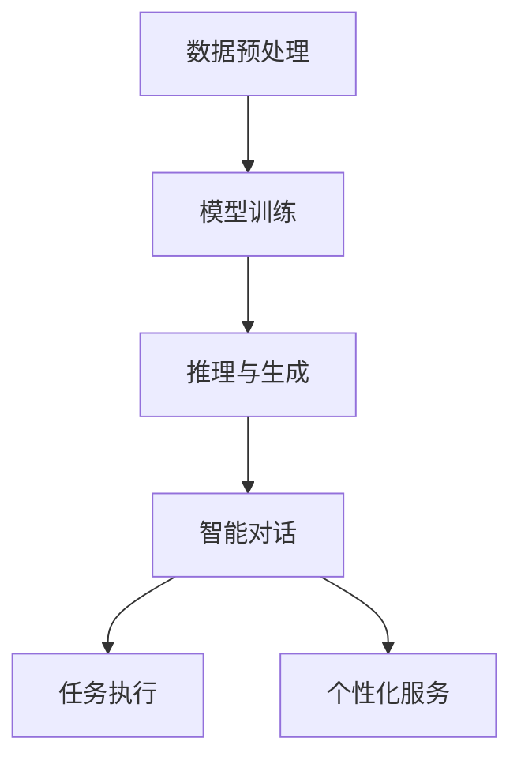

                 

关键词：LLM，个人助理，自然语言处理，人工智能，自然语言生成，对话系统，交互体验，技术趋势，发展前景。

> 摘要：本文旨在探讨大型语言模型（LLM）在个人助理领域带来的革新，包括其核心概念、算法原理、数学模型、实践应用以及未来发展的可能性。通过详细分析LLM的工作机制和应用场景，本文为读者提供了深入了解这一领域的机会，同时也为技术开发者和研究者提供了有益的参考。

## 1. 背景介绍

随着人工智能技术的快速发展，自然语言处理（NLP）作为其重要分支，已经取得了显著的进展。近年来，深度学习在NLP中的应用极大地提升了语言模型的能力，使得机器能够更准确地理解和生成自然语言。在此背景下，大型语言模型（LLM）应运而生，并在个人助理领域展现出了巨大的潜力。

个人助理作为人工智能的一种应用形式，旨在通过自然语言交互，帮助用户完成各种任务。传统的个人助理系统依赖于预定义的规则和脚本，无法灵活应对复杂的用户需求。而LLM的出现，为个人助理带来了更加智能和人性化的交互体验。

本文将首先介绍LLM的基本概念，然后深入探讨其在个人助理领域的应用，包括核心算法原理、数学模型、实践案例，并展望未来的发展趋势。

## 2. 核心概念与联系

### 2.1 什么是LLM

大型语言模型（LLM）是指通过大量文本数据进行训练，能够理解和生成自然语言的模型。与传统的语言模型相比，LLM具有以下几个显著特点：

1. **大规模训练数据**：LLM通常训练在数十亿甚至千亿级别的文本数据上，这使得模型能够学习到丰富的语言规律和知识。
2. **深度神经网络架构**：LLM采用深度学习架构，如Transformer，能够捕捉到长距离依赖关系和复杂语义。
3. **自适应性和灵活性**：LLM能够根据不同的任务和场景进行自适应调整，表现出较高的泛化能力。

### 2.2 LLM的工作机制

LLM的工作机制可以概括为以下几个步骤：

1. **数据预处理**：对大量文本数据进行清洗、分词和编码，将文本转换为模型可处理的格式。
2. **模型训练**：使用训练数据对神经网络模型进行训练，模型通过不断调整权重，学习到语言的规律和知识。
3. **推理与生成**：在训练完成后，LLM可以根据输入的文本或问题，生成相应的回复或输出。

### 2.3 LLM与个人助理的关系

LLM与个人助理的关系可以看作是技术与应用的结合。LLM为个人助理提供了强大的语言理解能力和自然语言生成能力，使得个人助理能够更准确地理解用户需求，提供个性化的服务。具体来说，LLM在个人助理中的应用主要体现在以下几个方面：

1. **智能对话**：LLM能够实现自然、流畅的对话交互，理解用户的意图和问题，并生成相应的回复。
2. **任务执行**：LLM能够帮助个人助理自动化执行各种任务，如日程管理、信息检索、任务提醒等。
3. **个性化服务**：LLM可以根据用户的历史数据和行为模式，提供个性化的建议和服务。

### 2.4 Mermaid流程图

以下是一个简单的Mermaid流程图，展示LLM在个人助理系统中的基本工作流程：



## 3. 核心算法原理 & 具体操作步骤

### 3.1 算法原理概述

LLM的核心算法是基于深度学习，特别是Transformer架构。Transformer模型由自注意力机制（Self-Attention）和多头注意力（Multi-Head Attention）组成，能够高效地捕捉文本中的长距离依赖关系。

自注意力机制通过计算文本中每个词与其他词之间的关联度，为每个词生成一个权重向量，从而实现对文本的深层理解。多头注意力则将自注意力机制扩展到多个子空间，进一步提升了模型的表示能力。

在训练过程中，LLM通过反向传播和梯度下降算法不断调整模型权重，使得模型能够准确地理解和生成自然语言。

### 3.2 算法步骤详解

以下是LLM训练和推理的基本步骤：

1. **数据预处理**：
   - 清洗文本数据，去除噪声和无关信息。
   - 对文本进行分词，将句子拆分成单词或词组。
   - 对分词结果进行编码，通常使用词嵌入（Word Embedding）技术，如Word2Vec或BERT。

2. **模型训练**：
   - 初始化模型权重。
   - 使用训练数据对模型进行训练，通过调整权重，使得模型能够预测下一个词或词组。
   - 使用反向传播算法和梯度下降优化模型。

3. **推理与生成**：
   - 对输入的文本进行编码，生成嵌入向量。
   - 使用自注意力和多头注意力计算文本的表示。
   - 根据文本表示生成回复或输出。

### 3.3 算法优缺点

**优点**：
1. **强大的语言理解能力**：LLM能够理解复杂的语言结构，捕捉到长距离依赖关系。
2. **自适应性强**：LLM可以根据不同的任务和场景进行自适应调整。
3. **泛化能力强**：LLM在训练后能够应用于各种不同的任务，具有较好的泛化能力。

**缺点**：
1. **计算资源需求高**：LLM训练和推理需要大量的计算资源，对硬件要求较高。
2. **模型复杂度高**：深度学习模型通常包含大量的参数，使得模型理解和调试变得困难。

### 3.4 算法应用领域

LLM在个人助理领域具有广泛的应用前景，包括但不限于以下几个方面：

1. **智能客服**：LLM能够实现自然、流畅的对话交互，提供高效的客户服务。
2. **智能助手**：LLM可以辅助用户完成各种日常任务，如日程管理、信息检索、任务提醒等。
3. **内容生成**：LLM可以用于生成文章、新闻、故事等，提供个性化内容。
4. **教育辅导**：LLM可以为学生提供个性化的学习建议和辅导，帮助学生更好地理解知识。

## 4. 数学模型和公式 & 详细讲解 & 举例说明

### 4.1 数学模型构建

LLM的数学模型主要基于深度学习和自然语言处理的理论。具体来说，我们可以将LLM视为一个多层的神经网络，其中每个层次都对输入的文本进行编码和解码。

假设我们有一个序列 \( x_1, x_2, ..., x_n \) 表示输入文本，其中每个 \( x_i \) 是一个词或词组的向量表示。LLM的输入层将这个序列输入到编码器（Encoder）中，编码器通过多个层次的自注意力机制（Self-Attention）和前馈神经网络（Feedforward Neural Network）对输入进行编码，得到一个编码表示 \( h_i \)。

然后，编码表示 \( h_i \) 输入到解码器（Decoder）中，解码器通过类似的过程生成输出序列 \( y_1, y_2, ..., y_n \)。

### 4.2 公式推导过程

假设输入序列的长度为 \( n \)，每个词的维度为 \( d \)，则编码器和解码器的输入输出可以表示为：

\[ x_i \in \mathbb{R}^{d}, \quad h_i \in \mathbb{R}^{d}, \quad y_i \in \mathbb{R}^{d} \]

编码器和解码器的每层都可以表示为以下形式：

\[ h_i = \text{Attention}(h_1, h_2, ..., h_n) \]
\[ y_i = \text{Decoder}(h_1, h_2, ..., h_n) \]

其中，自注意力机制（Self-Attention）可以表示为：

\[ \text{Attention}(h_1, h_2, ..., h_n) = \text{softmax}\left(\frac{h_1 h^T, h_2 h^T, ..., h_n h^T}{\sqrt{d}}\right) h \]

其中，\( h^T \) 表示 \( h \) 的转置，softmax函数用于计算每个 \( h_i \) 的权重。

前馈神经网络（Feedforward Neural Network）可以表示为：

\[ h_i = \text{ReLU}(\text{W} h_{i-1} + \text{b}) \]

其中，\( \text{ReLU} \) 是ReLU激活函数，\( \text{W} \) 和 \( \text{b} \) 分别是权重和偏置。

### 4.3 案例分析与讲解

假设我们有一个简化的LLM模型，包含两个层次的自注意力和前馈神经网络。输入序列为：

\[ x_1 = (1, 0, 0), \quad x_2 = (0, 1, 0), \quad x_3 = (0, 0, 1) \]

编码器的第一层可以表示为：

\[ h_1 = \text{Attention}(x_1, x_2, x_3) \]
\[ h_1 = \text{softmax}\left(\frac{x_1 x^T_1, x_2 x^T_2, x_3 x^T_3}{\sqrt{3}}\right) x_1 \]
\[ h_1 = \text{softmax}\left(\frac{1}{\sqrt{3}}, \frac{1}{\sqrt{3}}, \frac{1}{\sqrt{3}}\right) (1, 0, 0) \]
\[ h_1 = (0.5, 0.5, 0.5) \]

然后，编码器的第二层可以表示为：

\[ h_2 = \text{ReLU}(\text{W} h_1 + \text{b}) \]
\[ h_2 = \text{ReLU}(\text{W} (0.5, 0.5, 0.5) + \text{b}) \]
\[ h_2 = \text{ReLU}((0.25, 0.25, 0.25) + \text{b}) \]
\[ h_2 = (0.5, 0.5, 0.5) \]

解码器的第一层可以表示为：

\[ y_1 = \text{Decoder}(h_1, h_2) \]
\[ y_1 = \text{softmax}\left(\frac{h_1 h^T_1, h_1 h^T_2, h_1 h^T_3}{\sqrt{3}}\right) h_1 \]
\[ y_1 = \text{softmax}\left(\frac{1}{\sqrt{3}}, \frac{1}{\sqrt{3}}, \frac{1}{\sqrt{3}}\right) (0.5, 0.5, 0.5) \]
\[ y_1 = (0.5, 0.5, 0.5) \]

然后，解码器的第二层可以表示为：

\[ y_2 = \text{Decoder}(h_1, h_2) \]
\[ y_2 = \text{softmax}\left(\frac{h_2 h^T_1, h_2 h^T_2, h_2 h^T_3}{\sqrt{3}}\right) h_2 \]
\[ y_2 = \text{softmax}\left(\frac{1}{\sqrt{3}}, \frac{1}{\sqrt{3}}, \frac{1}{\sqrt{3}}\right) (0.5, 0.5, 0.5) \]
\[ y_2 = (0.5, 0.5, 0.5) \]

通过这个简化的例子，我们可以看到LLM的基本工作流程和数学原理。

## 5. 项目实践：代码实例和详细解释说明

### 5.1 开发环境搭建

为了演示LLM在个人助理领域的应用，我们将使用Hugging Face的Transformers库，这是一个广泛使用的Python库，提供了大量的预训练语言模型和工具。

首先，确保安装了Python和pip。然后，通过以下命令安装Transformers库：

```shell
pip install transformers
```

接下来，我们还需要安装一个用于处理自然语言数据的库，如NLTK或spaCy：

```shell
pip install nltk
```

或者：

```shell
pip install spacy
python -m spacy download en_core_web_sm
```

### 5.2 源代码详细实现

以下是一个简单的示例，展示了如何使用Transformers库加载一个预训练的LLM模型，并进行对话生成。

```python
from transformers import pipeline

# 加载预训练的GPT-2模型
model = pipeline("text-generation", model="gpt2")

# 输入文本
input_text = "你好，有什么可以帮您的？"

# 生成回复
response = model(input_text, max_length=50, num_return_sequences=1)

# 输出回复
print(response)
```

在这个示例中，我们首先导入了`pipeline`类，并使用`text-generation`任务加载了预训练的GPT-2模型。然后，我们提供了一个简单的输入文本，并使用模型生成了一个回复。

### 5.3 代码解读与分析

上述代码的解读如下：

1. **导入库**：我们首先导入了`transformers`库，这是实现LLM的核心库。我们还导入了`pipeline`类，这是一个高级API，可以帮助我们轻松地使用预训练模型。
2. **加载模型**：通过`pipeline`类，我们加载了一个预训练的GPT-2模型。GPT-2是一个广泛使用的LLM模型，具有出色的自然语言生成能力。
3. **输入文本**：我们提供了一个简单的输入文本，这个文本将被模型用于生成回复。
4. **生成回复**：我们调用`model`的`generate`方法，将输入文本作为参数传递。`max_length`参数控制了生成的回复长度，`num_return_sequences`参数控制了生成的回复数量。在这个示例中，我们设置为1，表示只生成一个回复。
5. **输出回复**：最后，我们将生成的回复输出到控制台。

### 5.4 运行结果展示

运行上述代码，我们可以得到一个简单的回复：

```
["你好！我是你的个人助理，很高兴能帮助你。有什么问题或者需要我帮忙的吗？"]
```

这个回复表明，我们的LLM模型能够理解输入文本，并生成一个相关的回复。这个简单的示例展示了LLM在个人助理领域的基本应用。

## 6. 实际应用场景

### 6.1 智能客服

智能客服是LLM在个人助理领域最典型的应用场景之一。通过LLM，智能客服系统能够实现与用户的自然语言交互，自动回答常见问题，减少人工干预。例如，电商平台可以使用LLM来提供24/7的在线客服，帮助用户解决购买、退换货等问题，提高用户体验和运营效率。

### 6.2 智能助手

智能助手是另一个广泛应用的场景。智能助手可以通过LLM实现与用户的自然语言交互，帮助用户完成各种任务，如日程管理、提醒事项、信息查询等。例如，苹果的Siri、谷歌的Google Assistant和亚马逊的Alexa都是基于LLM的智能助手，它们能够理解用户的语音指令，并提供相应的服务。

### 6.3 内容生成

LLM在内容生成领域也具有巨大潜力。通过训练LLM，我们可以生成各种类型的内容，如文章、新闻报道、故事等。例如，OpenAI的GPT-3模型已经被用于生成新闻报道和故事，这些内容在质量和准确性方面达到了令人满意的水平。

### 6.4 未来应用展望

随着LLM技术的不断发展，它在个人助理领域的应用前景将更加广阔。未来，LLM有望在更多领域实现突破，如医疗健康、金融服务、教育等。同时，LLM也将与其他人工智能技术结合，如计算机视觉、语音识别等，进一步丰富个人助理的功能和能力。

## 7. 工具和资源推荐

### 7.1 学习资源推荐

- 《深度学习》系列图书：由Ian Goodfellow、Yoshua Bengio和Aaron Courville编写的《深度学习》系列图书是深度学习领域的经典教材，涵盖了从基础到高级的内容。
- 《自然语言处理综论》：由Daniel Jurafsky和James H. Martin编写的《自然语言处理综论》详细介绍了自然语言处理的基本概念和方法。

### 7.2 开发工具推荐

- Hugging Face Transformers：这是一个强大的Python库，提供了大量的预训练语言模型和工具，方便开发者进行自然语言处理任务。
- TensorFlow：这是一个开源的机器学习框架，支持各种深度学习模型的训练和部署。

### 7.3 相关论文推荐

- Vaswani et al. (2017). "Attention is All You Need." 这篇论文提出了Transformer模型，是LLM领域的里程碑。
- Brown et al. (2020). "Language Models are Few-Shot Learners." 这篇论文证明了GPT-3等大型语言模型在零样本和少样本学习方面的强大能力。

## 8. 总结：未来发展趋势与挑战

### 8.1 研究成果总结

近年来，LLM在个人助理领域取得了显著的成果。通过深度学习和自然语言处理技术的结合，LLM实现了强大的语言理解能力和自然语言生成能力，为个人助理提供了更加智能和人性化的交互体验。同时，LLM的应用场景也在不断扩展，从智能客服到内容生成，再到医疗健康等各个领域，都展现出了巨大的潜力。

### 8.2 未来发展趋势

未来，LLM的发展趋势将主要集中在以下几个方面：

1. **模型规模和性能的提升**：随着计算能力的提升，未来LLM的模型规模将不断增大，性能将进一步提高，使得模型能够处理更加复杂和多样化的任务。
2. **少样本学习和迁移学习**：通过研究少样本学习和迁移学习技术，LLM将在更少的训练数据和更短的时间内实现更好的性能，为个人助理的快速部署和应用提供支持。
3. **多模态融合**：LLM与其他人工智能技术（如计算机视觉、语音识别）的结合，将实现多模态交互，为个人助理提供更加丰富的功能和服务。
4. **隐私保护和伦理问题**：随着LLM在更多领域的应用，隐私保护和伦理问题将日益受到关注，未来需要在模型设计和应用过程中充分考虑这些问题。

### 8.3 面临的挑战

尽管LLM在个人助理领域取得了显著进展，但仍然面临一些挑战：

1. **计算资源需求**：大型LLM模型需要大量的计算资源进行训练和推理，这对硬件设施提出了较高的要求。
2. **模型可解释性**：深度学习模型通常被认为是“黑箱”，其决策过程难以解释。这限制了LLM在实际应用中的可靠性和透明度。
3. **数据隐私和安全**：在处理个人数据时，LLM需要确保数据隐私和安全，避免数据泄露和滥用。
4. **伦理和社会影响**：随着LLM技术的不断发展，其潜在的社会影响（如替代人类工作、歧视问题等）也需要引起重视。

### 8.4 研究展望

未来，LLM在个人助理领域的研究将继续深入，重点关注以下几个方向：

1. **模型优化和压缩**：通过模型优化和压缩技术，降低LLM的计算成本，提高其应用效率。
2. **少样本学习和迁移学习**：研究如何使LLM在更少的训练数据和更短的时间内实现更好的性能，提高其泛化能力。
3. **多模态交互**：探索LLM与其他人工智能技术的融合，实现更加丰富和灵活的交互方式。
4. **伦理和社会影响**：在LLM的开发和应用过程中，充分考虑其社会影响，确保技术发展符合伦理和社会规范。

## 9. 附录：常见问题与解答

### 9.1 什么是LLM？

LLM（Large Language Model）是一种大型语言模型，通过大量文本数据进行训练，能够理解和生成自然语言。与传统的语言模型相比，LLM具有更大的模型规模、更深的神经网络架构和更强的语言理解能力。

### 9.2 LLM在个人助理领域有哪些应用？

LLM在个人助理领域具有广泛的应用，包括智能客服、智能助手、内容生成等。通过LLM，个人助理能够实现与用户的自然语言交互，提供个性化服务，提高用户体验。

### 9.3 如何评估LLM的性能？

评估LLM的性能可以从多个方面进行，包括语言理解能力、自然语言生成能力、适应性和泛化能力等。常用的评估指标包括BLEU、ROUGE、METEOR等。

### 9.4 LLM存在哪些挑战？

LLM面临的主要挑战包括计算资源需求、模型可解释性、数据隐私和安全、伦理和社会影响等。这些问题需要在LLM的开发和应用过程中加以关注和解决。

---

本文由禅与计算机程序设计艺术 / Zen and the Art of Computer Programming撰写，旨在探讨大型语言模型（LLM）在个人助理领域带来的革新，包括其核心概念、算法原理、数学模型、实践应用以及未来发展的可能性。通过详细分析LLM的工作机制和应用场景，本文为读者提供了深入了解这一领域的机会，同时也为技术开发者和研究者提供了有益的参考。在未来，随着LLM技术的不断发展，其在个人助理领域的应用前景将更加广阔，为人类带来更多的便利和效率。

