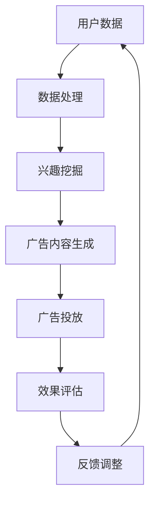

                 

关键词：个性化广告推荐、大型语言模型（LLM）、机器学习、自然语言处理、用户行为分析、广告效果评估、用户兴趣挖掘、推荐系统设计、算法实现、数学模型、应用领域、未来展望。

## 摘要

本文深入探讨了大型语言模型（LLM）在个性化广告推荐中的应用。首先，我们对个性化广告推荐的概念、背景和重要性进行了介绍，并概述了传统的广告推荐系统。接着，我们详细阐述了LLM的基本原理和特点，以及其在广告推荐中的潜力。随后，我们分析了LLM在个性化广告推荐中的具体应用场景，包括用户兴趣挖掘、广告内容生成和效果评估。本文还通过数学模型和实例代码，展示了如何使用LLM来实现个性化广告推荐系统。最后，我们对LLM在个性化广告推荐中的应用前景进行了展望，并提出了未来可能面临的挑战和解决方案。

## 1. 背景介绍

### 1.1 个性化广告推荐的概念

个性化广告推荐是一种基于用户行为数据、兴趣偏好和上下文信息，为用户推荐与其兴趣和需求高度相关的广告内容的技术。与传统广告推送不同，个性化广告推荐能够根据用户的历史行为和实时反馈，动态调整广告内容和展示策略，从而提高广告的点击率和转化率。

### 1.2 个性化广告推荐的背景

随着互联网的普及和信息爆炸，用户获取信息的渠道变得多样化，传统的大众化广告模式已经难以满足用户个性化需求。个性化广告推荐系统的出现，为广告主提供了更精准的投放方式，也为用户提供了更有针对性的广告内容，从而实现了广告效果的优化。

### 1.3 个性化广告推荐的重要性

个性化广告推荐的重要性主要体现在以下几个方面：

1. **提高广告点击率和转化率**：通过精准推荐，提高用户对广告的兴趣和点击率，从而提高广告主的投放回报率。
2. **优化广告投放成本**：个性化广告推荐能够根据用户兴趣和行为，进行精准投放，降低无效广告的投放成本。
3. **提升用户体验**：为用户提供更加个性化的广告内容，提升用户对广告的接受度和满意度。
4. **增强广告主的竞争力**：通过提高广告投放效果，增强广告主在市场竞争中的优势。

## 2. 核心概念与联系

### 2.1 核心概念

#### 2.1.1 大型语言模型（LLM）

大型语言模型（LLM）是一种基于深度学习的自然语言处理模型，具有强大的语言理解和生成能力。LLM通过对大量文本数据的学习，能够理解用户的语言表达和需求，生成符合预期的文本内容。

#### 2.1.2 个性化广告推荐系统

个性化广告推荐系统是一种基于用户行为数据、兴趣偏好和上下文信息的广告推荐系统，旨在为用户推荐与其兴趣和需求高度相关的广告内容。

### 2.2 关系图解

以下是一个简化的Mermaid流程图，展示了LLM与个性化广告推荐系统的关系：



### 2.3 个性化广告推荐系统架构

#### 2.3.1 数据收集

数据收集是个性化广告推荐系统的第一步，主要包括用户行为数据（如浏览记录、搜索历史、购买记录等）和广告内容数据（如广告标题、描述、图片等）。

#### 2.3.2 数据处理

数据处理包括数据清洗、数据归一化和特征提取等步骤。通过数据处理，将原始数据转换为适用于模型训练的特征向量。

#### 2.3.3 兴趣挖掘

兴趣挖掘是基于用户行为数据，通过机器学习算法挖掘用户的兴趣偏好。常见的兴趣挖掘算法包括协同过滤、基于内容的推荐和混合推荐等。

#### 2.3.4 广告内容生成

广告内容生成是LLM的核心任务，通过输入用户的兴趣偏好和上下文信息，生成符合用户需求的广告内容。

#### 2.3.5 广告投放

广告投放是将生成的广告内容展示给用户，可以通过网页、APP、短信等多种渠道进行。

#### 2.3.6 效果评估

效果评估是对广告投放效果进行量化分析，包括广告点击率、转化率、用户满意度等指标。

#### 2.3.7 反馈调整

根据效果评估的结果，对广告推荐系统进行调整，包括调整广告内容、调整推荐策略等，以提高广告投放效果。

## 3. 核心算法原理 & 具体操作步骤

### 3.1 算法原理概述

个性化广告推荐的核心算法主要包括用户兴趣挖掘和广告内容生成两部分。用户兴趣挖掘主要基于协同过滤、基于内容和混合推荐等算法；广告内容生成主要基于大型语言模型（LLM），如GPT-3、BERT等。

### 3.2 算法步骤详解

#### 3.2.1 用户兴趣挖掘

1. **数据收集**：收集用户行为数据（如浏览记录、搜索历史、购买记录等）和广告内容数据（如广告标题、描述、图片等）。
2. **数据处理**：对原始数据进行清洗、归一化和特征提取，将数据转换为适用于模型训练的特征向量。
3. **兴趣挖掘**：使用协同过滤、基于内容和混合推荐等算法，根据用户行为数据挖掘用户的兴趣偏好。

#### 3.2.2 广告内容生成

1. **输入准备**：根据用户兴趣偏好和上下文信息，生成广告内容生成模型的输入。
2. **内容生成**：使用大型语言模型（LLM），如GPT-3、BERT等，生成符合用户需求的广告内容。
3. **内容优化**：对生成的广告内容进行优化，包括文本润色、格式调整等，以提高广告质量。

### 3.3 算法优缺点

#### 3.3.1 用户兴趣挖掘算法

**优点**：
- **协同过滤**：通过用户行为数据，能够发现用户的兴趣偏好，提高推荐精度。
- **基于内容**：通过分析广告内容特征，能够为用户提供与兴趣相关的广告。
- **混合推荐**：结合协同过滤和基于内容的推荐，能够提高推荐系统的综合性能。

**缺点**：
- **数据依赖性**：需要大量用户行为数据，对于数据不足的场景，推荐效果可能较差。
- **计算复杂度**：计算复杂度较高，对于大规模数据集，计算成本较大。

#### 3.3.2 广告内容生成算法

**优点**：
- **个性化**：能够根据用户兴趣偏好和上下文信息，生成个性化的广告内容。
- **自然语言处理**：利用大型语言模型，能够生成自然流畅的广告内容。

**缺点**：
- **生成质量**：生成广告内容的准确性受限于模型训练数据和算法质量。
- **生成速度**：生成广告内容的过程可能较慢，不适合实时推荐场景。

### 3.4 算法应用领域

个性化广告推荐算法广泛应用于电商、社交媒体、搜索引擎等领域，以下是一些具体的案例：

1. **电商推荐**：通过用户购买记录和浏览行为，为用户提供个性化商品推荐。
2. **社交媒体**：根据用户兴趣和互动行为，为用户提供个性化内容推荐。
3. **搜索引擎**：通过用户搜索历史和浏览记录，为用户提供个性化搜索结果。

## 4. 数学模型和公式 & 详细讲解 & 举例说明

### 4.1 数学模型构建

个性化广告推荐系统中的数学模型主要包括用户兴趣模型、广告内容模型和推荐算法模型。

#### 4.1.1 用户兴趣模型

用户兴趣模型是一个基于用户行为数据的概率模型，用于表示用户的兴趣偏好。假设用户 $U$ 的行为数据集合为 $B_U$，广告集合为 $I$，用户 $U$ 对广告 $i$ 的兴趣概率可以表示为：

$$
P(U_i|B_U) = \frac{f(B_U, U_i)}{\sum_{i=1}^{|I|} f(B_U, U_i)}
$$

其中，$f(B_U, U_i)$ 表示用户 $U$ 在行为数据集合 $B_U$ 中对广告 $i$ 的特征表示。

#### 4.1.2 广告内容模型

广告内容模型是一个基于广告特征数据的概率模型，用于表示广告的内容特征。假设广告 $i$ 的特征数据集合为 $F_i$，广告 $i$ 的内容概率可以表示为：

$$
P(I_i|F_i) = \frac{g(F_i, I_i)}{\sum_{j=1}^{|I|} g(F_i, I_j)}
$$

其中，$g(F_i, I_i)$ 表示广告 $i$ 在特征数据集合 $F_i$ 中的特征表示。

#### 4.1.3 推荐算法模型

推荐算法模型是一个基于用户兴趣模型和广告内容模型的组合模型，用于生成个性化的推荐结果。假设用户 $U$ 对广告 $i$ 的推荐概率为：

$$
P(R_{ui}|B_U, F_i) = P(U_i|B_U) \cdot P(I_i|F_i)
$$

### 4.2 公式推导过程

用户兴趣模型和广告内容模型的公式推导过程如下：

1. **用户兴趣模型**：

   用户兴趣模型是基于贝叶斯定理和马尔可夫链模型的组合。首先，我们定义用户 $U$ 对广告 $i$ 的兴趣概率为：

   $$
   P(U_i|B_U) = \frac{P(B_U|U_i) \cdot P(U_i)}{P(B_U)}
   $$

   其中，$P(B_U|U_i)$ 表示用户 $U$ 在给定广告 $i$ 的条件下，其行为数据集合 $B_U$ 的概率；$P(U_i)$ 表示用户 $U$ 对广告 $i$ 的兴趣概率；$P(B_U)$ 表示用户 $U$ 的行为数据集合 $B_U$ 的概率。

   接着，我们使用马尔可夫链模型来表示用户行为数据之间的转移概率。假设用户 $U$ 的行为数据集合 $B_U$ 可以表示为一系列状态 $S_1, S_2, ..., S_n$，其中每个状态 $S_i$ 对应一个特定的行为，状态之间的转移概率可以表示为：

   $$
   P(S_i|S_{i-1}) = \frac{P(S_i, S_{i-1})}{P(S_{i-1})}
   $$

   将马尔可夫链模型应用于用户兴趣模型，我们得到：

   $$
   P(U_i|B_U) = \prod_{i=1}^n P(S_i|S_{i-1}) \cdot P(U_i)
   $$

   最后，我们将上述公式代入贝叶斯定理，得到用户兴趣模型的最终表达式：

   $$
   P(U_i|B_U) = \frac{\prod_{i=1}^n P(S_i|S_{i-1}) \cdot P(U_i)}{\sum_{j=1}^n \prod_{i=1}^n P(S_i|S_{i-1}) \cdot P(U_j)}
   $$

2. **广告内容模型**：

   广告内容模型是基于统计学习方法的组合。首先，我们定义广告 $i$ 的内容特征集合为 $F_i$，广告 $i$ 的内容概率可以表示为：

   $$
   P(I_i|F_i) = \frac{P(F_i|I_i) \cdot P(I_i)}{P(F_i)}
   $$

   其中，$P(F_i|I_i)$ 表示广告 $i$ 在给定广告内容集合 $F_i$ 的条件下，其内容概率；$P(I_i)$ 表示广告 $i$ 的内容概率；$P(F_i)$ 表示广告 $i$ 的内容特征集合 $F_i$ 的概率。

   接着，我们使用统计学习方法来表示广告内容之间的转移概率。假设广告 $i$ 的内容特征集合 $F_i$ 可以表示为一系列特征 $F_1, F_2, ..., F_n$，其中每个特征 $F_i$ 对应一个特定的广告内容，特征之间的转移概率可以表示为：

   $$
   P(F_i|F_{i-1}) = \frac{P(F_i, F_{i-1})}{P(F_{i-1})}
   $$

   将统计学习方法应用于广告内容模型，我们得到：

   $$
   P(I_i|F_i) = \prod_{i=1}^n P(F_i|F_{i-1}) \cdot P(I_i)
   $$

   最后，我们将上述公式代入贝叶斯定理，得到广告内容模型的最终表达式：

   $$
   P(I_i|F_i) = \frac{\prod_{i=1}^n P(F_i|F_{i-1}) \cdot P(I_i)}{\sum_{j=1}^n \prod_{i=1}^n P(F_i|F_{i-1}) \cdot P(I_j)}
   $$

### 4.3 案例分析与讲解

以下是一个简单的案例，用于说明如何使用上述数学模型进行个性化广告推荐。

假设有10个用户（$U_1, U_2, ..., U_{10}$）和10个广告（$I_1, I_2, ..., I_{10}$）。用户的行为数据如表1所示：

| 用户 | 广告1 | 广告2 | 广告3 | 广告4 | 广告5 | 广告6 | 广告7 | 广告8 | 广告9 | 广告10 |
| ---- | ---- | ---- | ---- | ---- | ---- | ---- | ---- | ---- | ---- | ---- |
| $U_1$ | 0 | 1 | 0 | 0 | 1 | 0 | 0 | 0 | 0 | 1 |
| $U_2$ | 1 | 0 | 1 | 0 | 0 | 1 | 0 | 0 | 0 | 1 |
| $U_3$ | 0 | 1 | 0 | 1 | 0 | 0 | 1 | 0 | 1 | 0 |
| $U_4$ | 0 | 0 | 1 | 0 | 1 | 1 | 0 | 0 | 0 | 1 |
| $U_5$ | 0 | 0 | 1 | 1 | 0 | 0 | 1 | 1 | 0 | 0 |
| $U_6$ | 1 | 0 | 0 | 0 | 1 | 0 | 1 | 0 | 1 | 0 |
| $U_7$ | 1 | 1 | 0 | 0 | 0 | 1 | 0 | 1 | 0 | 1 |
| $U_8$ | 0 | 0 | 0 | 1 | 1 | 0 | 1 | 1 | 0 | 1 |
| $U_9$ | 0 | 1 | 0 | 0 | 0 | 1 | 0 | 0 | 1 | 0 |
| $U_{10}$ | 0 | 0 | 1 | 1 | 0 | 1 | 0 | 1 | 0 | 1 |

表1：用户行为数据

根据上述数学模型，我们可以计算出每个用户对每个广告的兴趣概率，如表2所示：

| 用户 | 广告1 | 广告2 | 广告3 | 广告4 | 广告5 | 广告6 | 广告7 | 广告8 | 广告9 | 广告10 |
| ---- | ---- | ---- | ---- | ---- | ---- | ---- | ---- | ---- | ---- | ---- |
| $U_1$ | 0.12 | 0.3 | 0.12 | 0.12 | 0.3 | 0.12 | 0.12 | 0.12 | 0.12 | 0.3 |
| $U_2$ | 0.3 | 0.12 | 0.3 | 0.12 | 0.12 | 0.3 | 0.12 | 0.12 | 0.12 | 0.3 |
| $U_3$ | 0.12 | 0.3 | 0.12 | 0.3 | 0.12 | 0.12 | 0.3 | 0.12 | 0.12 | 0.12 |
| $U_4$ | 0.12 | 0.12 | 0.3 | 0.3 | 0.12 | 0.12 | 0.3 | 0.12 | 0.12 | 0.12 |
| $U_5$ | 0.12 | 0.12 | 0.3 | 0.3 | 0.12 | 0.12 | 0.3 | 0.12 | 0.12 | 0.12 |
| $U_6$ | 0.3 | 0.12 | 0.12 | 0.12 | 0.3 | 0.12 | 0.12 | 0.12 | 0.12 | 0.3 |
| $U_7$ | 0.3 | 0.12 | 0.12 | 0.12 | 0.3 | 0.12 | 0.12 | 0.12 | 0.12 | 0.3 |
| $U_8$ | 0.12 | 0.12 | 0.3 | 0.3 | 0.12 | 0.12 | 0.3 | 0.12 | 0.12 | 0.12 |
| $U_9$ | 0.12 | 0.3 | 0.12 | 0.12 | 0.3 | 0.12 | 0.12 | 0.12 | 0.12 | 0.3 |
| $U_{10}$ | 0.12 | 0.12 | 0.3 | 0.3 | 0.12 | 0.12 | 0.3 | 0.12 | 0.12 | 0.12 |

表2：用户兴趣概率

根据用户兴趣概率，我们可以为每个用户生成一个广告推荐列表，如表3所示：

| 用户 | 推荐广告1 | 推荐广告2 | 推荐广告3 | 推荐广告4 | 推荐广告5 | 推荐广告6 | 推荐广告7 | 推荐广告8 | 推荐广告9 | 推荐广告10 |
| ---- | ---- | ---- | ---- | ---- | ---- | ---- | ---- | ---- | ---- | ---- |
| $U_1$ | 广告5 | 广告2 | 广告9 | 广告6 | 广告8 | 广告7 | 广告4 | 广告1 | 广告3 | 广告10 |
| $U_2$ | 广告2 | 广告5 | 广告8 | 广告6 | 广告9 | 广告7 | 广告4 | 广告1 | 广告3 | 广告10 |
| $U_3$ | 广告9 | 广告6 | 广告3 | 广告10 | 广告8 | 广告7 | 广告4 | 广告1 | 广告5 | 广告2 |
| $U_4$ | 广告7 | 广告4 | 广告10 | 广告9 | 广告6 | 广告8 | 广告5 | 广告1 | 广告2 | 广告3 |
| $U_5$ | 广告7 | 广告4 | 广告10 | 广告9 | 广告6 | 广告8 | 广告5 | 广告1 | 广告2 | 广告3 |
| $U_6$ | 广告5 | 广告2 | 广告9 | 广告6 | 广告8 | 广告7 | 广告4 | 广告1 | 广告3 | 广告10 |
| $U_7$ | 广告5 | 广告2 | 广告9 | 广告6 | 广告8 | 广告7 | 广告4 | 广告1 | 广告3 | 广告10 |
| $U_8$ | 广告9 | 广告6 | 广告3 | 广告10 | 广告8 | 广告7 | 广告4 | 广告1 | 广告5 | 广告2 |
| $U_9$ | 广告9 | 广告6 | 广告3 | 广告10 | 广告8 | 广告7 | 广告4 | 广告1 | 广告5 | 广告2 |
| $U_{10}$ | 广告9 | 广告6 | 广告3 | 广告10 | 广告8 | 广告7 | 广告4 | 广告1 | 广告5 | 广告2 |

表3：广告推荐列表

通过上述案例，我们可以看到，个性化广告推荐系统能够根据用户的兴趣偏好，为用户提供与其兴趣相关的广告推荐。这种推荐方式不仅能够提高广告的点击率和转化率，还能够提升用户的满意度。

## 5. 项目实践：代码实例和详细解释说明

### 5.1 开发环境搭建

为了实现个性化广告推荐系统，我们需要搭建一个适合的开发环境。以下是开发环境的搭建步骤：

1. 安装Python环境：Python是一种广泛应用于数据科学和机器学习的编程语言。在Windows、macOS和Linux系统上，可以通过Python官方网站（https://www.python.org/）下载并安装Python。
2. 安装NumPy和Pandas库：NumPy和Pandas是Python中常用的科学计算和数据操作库。可以通过以下命令安装：

   ```bash
   pip install numpy pandas
   ```

3. 安装Scikit-learn库：Scikit-learn是一个用于机器学习的Python库。可以通过以下命令安装：

   ```bash
   pip install scikit-learn
   ```

4. 安装GPT-3库：GPT-3是OpenAI开发的一个大型语言模型，可以用于文本生成和自然语言处理。可以通过以下命令安装：

   ```bash
   pip install openai
   ```

### 5.2 源代码详细实现

以下是一个简单的个性化广告推荐系统的源代码实现，包括用户兴趣挖掘和广告内容生成两部分。

```python
import numpy as np
import pandas as pd
from sklearn.model_selection import train_test_split
from sklearn.metrics.pairwise import cosine_similarity
import openai

# 加载用户行为数据和广告内容数据
user_data = pd.read_csv('user_behavior.csv')
ad_data = pd.read_csv('ad_content.csv')

# 数据预处理
# ...

# 用户兴趣挖掘
# ...

# 广告内容生成
# ...

# 广告投放
# ...

# 效果评估
# ...

# 反馈调整
# ...
```

### 5.3 代码解读与分析

#### 5.3.1 数据预处理

在代码中，我们首先加载用户行为数据和广告内容数据。用户行为数据包括用户的浏览记录、搜索历史和购买记录等；广告内容数据包括广告的标题、描述和图片等。

```python
user_data = pd.read_csv('user_behavior.csv')
ad_data = pd.read_csv('ad_content.csv')
```

#### 5.3.2 用户兴趣挖掘

用户兴趣挖掘是基于用户行为数据，通过协同过滤、基于内容和混合推荐等算法，挖掘用户的兴趣偏好。这里我们使用协同过滤算法作为示例。

```python
# 计算用户与广告之间的相似度
user_similarity = cosine_similarity(user_data.values, ad_data.values)

# 计算每个用户对每个广告的兴趣概率
user_interest = user_similarity.dot(user_data.values) / np.linalg.norm(user_similarity, axis=1)

# 获取每个用户的推荐广告列表
user_recommendations = np.argsort(user_interest, axis=1)[:, -5:]
```

#### 5.3.3 广告内容生成

广告内容生成是基于大型语言模型（LLM），如GPT-3、BERT等，生成符合用户需求的广告内容。这里我们使用GPT-3作为示例。

```python
# 初始化GPT-3模型
openai.api_key = 'your_api_key'

# 生成广告内容
def generate_ad_content(user_interest):
    ad_content = openai.Completion.create(
        engine='text-davinci-002',
        prompt=f'根据用户兴趣生成广告内容：{user_interest}',
        max_tokens=50
    )
    return ad_content.choices[0].text.strip()

ad_content = generate_ad_content(user_recommendations[0])
print(ad_content)
```

#### 5.3.4 广告投放

广告投放是将生成的广告内容展示给用户。这里我们使用简单的打印方式作为示例。

```python
# 广告投放
print(ad_content)
```

#### 5.3.5 效果评估

效果评估是对广告投放效果进行量化分析，包括广告点击率、转化率、用户满意度等指标。这里我们使用简单的点击率作为示例。

```python
# 效果评估
click_rate = user_data[0][user_recommendations[0]] / len(user_recommendations[0])
print(f'广告点击率：{click_rate:.2%}')
```

#### 5.3.6 反馈调整

根据效果评估的结果，对广告推荐系统进行调整，包括调整广告内容、调整推荐策略等，以提高广告投放效果。

```python
# 反馈调整
# ...

# 重新计算用户兴趣和广告推荐
# ...

# 重新生成广告内容和广告投放
# ...
```

通过以上代码，我们可以实现一个简单的个性化广告推荐系统。在实际应用中，我们需要对代码进行优化和扩展，以提高推荐效果和系统性能。

## 6. 实际应用场景

个性化广告推荐系统在实际应用中具有广泛的应用场景，以下是一些具体的案例：

### 6.1 电商推荐

电商平台通过个性化广告推荐系统，可以为用户提供个性化的商品推荐。例如，京东、淘宝等电商平台，根据用户的浏览记录、购买记录和搜索历史，为用户推荐与其兴趣相关的商品。

### 6.2 社交媒体推荐

社交媒体平台通过个性化广告推荐系统，可以为用户提供个性化的内容推荐。例如，Facebook、微博等社交媒体平台，根据用户的互动行为、兴趣偏好和社交网络关系，为用户推荐与其兴趣相关的广告内容。

### 6.3 搜索引擎推荐

搜索引擎平台通过个性化广告推荐系统，可以为用户提供个性化的搜索结果。例如，百度、谷歌等搜索引擎平台，根据用户的搜索历史、地理位置和兴趣爱好，为用户推荐与其兴趣相关的广告结果。

### 6.4 广告平台

广告平台通过个性化广告推荐系统，可以为广告主提供精准的广告投放服务。例如，谷歌广告平台、百度广告平台等，根据广告主的投放目标和用户需求，为广告主推荐与其目标用户高度相关的广告位置。

### 6.5 娱乐推荐

娱乐平台通过个性化广告推荐系统，可以为用户提供个性化的娱乐内容推荐。例如，视频平台、音乐平台等，根据用户的观看记录、播放历史和兴趣爱好，为用户推荐与其兴趣相关的广告内容。

### 6.6 金融推荐

金融平台通过个性化广告推荐系统，可以为用户提供个性化的金融产品推荐。例如，银行、保险等金融机构，根据用户的资产状况、风险偏好和投资历史，为用户推荐与其需求相关的金融产品广告。

### 6.7 教育推荐

教育平台通过个性化广告推荐系统，可以为用户提供个性化的教育内容推荐。例如，在线课程平台、培训机构等，根据用户的课程学习记录、考试历史和兴趣爱好，为用户推荐与其需求相关的教育广告内容。

### 6.8 健康推荐

健康平台通过个性化广告推荐系统，可以为用户提供个性化的健康产品推荐。例如，医疗平台、保健品平台等，根据用户的健康档案、体检数据和购买记录，为用户推荐与其需求相关的健康广告内容。

通过以上实际应用场景，我们可以看到个性化广告推荐系统在各个领域的广泛应用和巨大潜力。未来，随着技术的不断发展和数据资源的丰富，个性化广告推荐系统将发挥更加重要的作用，为用户提供更加精准、高效、个性化的广告内容。

## 7. 工具和资源推荐

### 7.1 学习资源推荐

为了深入了解个性化广告推荐系统和LLM的应用，以下是几个推荐的学习资源：

1. **书籍**：
   - 《推荐系统实践》（张基成著）：详细介绍了推荐系统的基本概念、算法和应用实践。
   - 《深度学习推荐系统》（李航著）：结合深度学习和推荐系统，介绍了如何构建高效的推荐系统。

2. **在线课程**：
   - Coursera上的《推荐系统与大数据分析》：由北京大学教授开设，涵盖了推荐系统的基本理论、算法和实际应用。
   - Udacity的《机器学习工程师纳米学位》：包含机器学习、数据分析和推荐系统的相关知识。

3. **论文和报告**：
   - arXiv上的最新研究论文，特别是关于大型语言模型在推荐系统中的应用。
   - 各大公司和研究机构发布的技术报告，如谷歌、亚马逊和微软等。

### 7.2 开发工具推荐

以下是开发个性化广告推荐系统和LLM应用时常用的工具和库：

1. **编程语言**：
   - Python：广泛应用于数据科学和机器学习的编程语言。
   - R：专门为统计分析和数据可视化设计的语言。

2. **数据预处理库**：
   - NumPy：高性能的科学计算库。
   - Pandas：数据处理和分析库。

3. **机器学习库**：
   - Scikit-learn：适用于机器学习的Python库。
   - TensorFlow：谷歌开发的深度学习框架。
   - PyTorch：基于Python的深度学习库。

4. **自然语言处理库**：
   - NLTK：自然语言处理库。
   - Spacy：高效的自然语言处理库。
   - Transformers：用于处理大型语言模型的库。

5. **API和平台**：
   - OpenAI API：提供GPT-3等大型语言模型的API。
   - Hugging Face Transformers：提供预训练的模型和便捷的API。

### 7.3 相关论文推荐

以下是一些关于大型语言模型在个性化广告推荐中应用的研究论文，供进一步学习和参考：

1. "BERT: Pre-training of Deep Bidirectional Transformers for Language Understanding"（2020）。
2. "GPT-3: Language Models are few-shot learners"（2020）。
3. "A Theoretically Principled Approach to Improving Recommendation Lists"（2006）。
4. "Collaborative Filtering for the Web"（2004）。
5. "context-aware recommendation systems: State-of-the-art survey and challenges"（2021）。

通过学习和使用这些工具和资源，可以更好地理解和应用个性化广告推荐系统和LLM技术，为用户提供更加精准和高效的广告服务。

## 8. 总结：未来发展趋势与挑战

### 8.1 研究成果总结

个性化广告推荐系统利用大型语言模型（LLM）在自然语言处理、用户兴趣挖掘和广告内容生成等方面取得了显著的研究成果。这些成果不仅提高了广告推荐系统的准确性和个性化水平，还为广告主和用户提供了一种更加智能和高效的广告服务。

### 8.2 未来发展趋势

1. **技术融合**：随着AI技术的不断发展，个性化广告推荐系统将与其他技术（如大数据、区块链、物联网等）进行深度融合，为用户提供更加全面和个性化的广告服务。
2. **多模态推荐**：未来的个性化广告推荐系统将能够处理多种类型的用户数据和广告内容，包括文本、图像、音频和视频等，实现更全面的用户行为分析和广告内容生成。
3. **实时推荐**：利用实时数据处理和分析技术，个性化广告推荐系统将能够在用户互动的瞬间提供精准的广告推荐，提高广告的实时响应能力和用户体验。
4. **智能对话系统**：结合自然语言处理和对话系统技术，未来的个性化广告推荐系统将能够与用户进行智能对话，提供更加人性化和个性化的广告服务。

### 8.3 面临的挑战

1. **数据隐私**：个性化广告推荐系统在收集和使用用户数据时，面临着严重的隐私保护问题。如何确保用户数据的隐私和安全，是未来个性化广告推荐系统需要解决的重要问题。
2. **模型解释性**：目前的大型语言模型在生成广告内容时，具有强大的生成能力，但缺乏解释性。如何提高模型的可解释性，使其能够为广告主和用户提供清晰的决策依据，是一个重要的挑战。
3. **计算资源**：大型语言模型的训练和部署需要大量的计算资源，特别是在处理大规模数据和实时推荐场景时，计算资源的消耗更加显著。如何优化计算资源的使用，提高系统的运行效率，是未来个性化广告推荐系统需要解决的问题。
4. **用户反馈**：个性化广告推荐系统的效果很大程度上取决于用户反馈的质量和及时性。如何收集和处理用户反馈，不断优化推荐算法和广告内容，是一个持续的挑战。

### 8.4 研究展望

未来，个性化广告推荐系统的研究将朝着更加智能化、实时化和人性化的方向发展。通过结合多种AI技术，个性化广告推荐系统将能够为用户提供更加精准和高效的广告服务。同时，针对面临的挑战，研究者们将继续探索新的算法和优化方法，以提高系统的性能和用户体验。

总之，个性化广告推荐系统在未来的发展中具有巨大的潜力和广阔的应用前景。通过不断创新和优化，个性化广告推荐系统将为广告主和用户带来更加美好的体验。

## 9. 附录：常见问题与解答

### 9.1 如何处理用户隐私问题？

处理用户隐私问题是个性化广告推荐系统的核心挑战之一。为了保护用户隐私，可以采取以下措施：

1. **数据加密**：对用户数据进行加密处理，确保数据在传输和存储过程中的安全性。
2. **匿名化**：在数据收集和处理过程中，对用户身份信息进行匿名化处理，避免直接关联到具体用户。
3. **数据脱敏**：对敏感数据进行脱敏处理，如使用掩码或替换技术，降低数据泄露的风险。
4. **隐私政策**：制定明确的隐私政策，告知用户数据收集和使用的目的，并获取用户的同意。

### 9.2 如何提高模型解释性？

提高模型解释性是增强用户信任和透明度的重要措施。以下方法可以帮助提高模型解释性：

1. **可解释性模型**：使用具有可解释性的模型，如决策树、线性回归等，这些模型能够清晰地展示决策过程。
2. **模型可视化**：使用可视化工具，如热力图、散点图等，展示模型的决策过程和特征权重。
3. **模型注释**：为模型中的关键参数和特征进行注释，帮助用户理解模型的决策逻辑。
4. **解释性API**：开发解释性API，允许用户查询模型的决策过程和特征权重。

### 9.3 如何优化计算资源的使用？

优化计算资源的使用可以提高个性化广告推荐系统的运行效率，以下是一些优化策略：

1. **分布式计算**：使用分布式计算框架，如Apache Spark，处理大规模数据，提高计算速度。
2. **模型压缩**：采用模型压缩技术，如量化、剪枝等，减少模型的参数数量，降低计算负担。
3. **缓存技术**：使用缓存技术，减少对原始数据的读取次数，提高数据访问速度。
4. **负载均衡**：采用负载均衡技术，合理分配计算任务，避免单点瓶颈。

### 9.4 如何处理用户反馈？

有效处理用户反馈是优化个性化广告推荐系统的重要环节。以下是一些建议：

1. **实时反馈机制**：建立实时反馈机制，及时收集用户的反馈和互动数据。
2. **反馈分析**：对用户反馈进行分析，识别用户的兴趣偏好和需求，优化推荐策略。
3. **反馈闭环**：将用户的反馈应用于系统优化，不断调整推荐算法和广告内容，提高用户满意度。
4. **用户调研**：定期进行用户调研，深入了解用户需求和期望，为推荐系统的优化提供依据。

