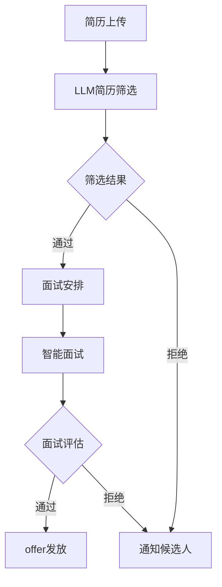

                 

关键词：自然语言处理，人工智能，招聘，人才管理，人力资源，大规模语言模型，NLP

## 摘要

本文旨在探讨大规模语言模型（LLM）在人力资源领域，尤其是招聘环节中的应用。我们将深入解析LLM的核心原理，展示如何利用其强大的文本理解和生成能力来构建高效的AI招聘助手。文章结构如下：

1. **背景介绍**
2. **核心概念与联系**
3. **核心算法原理 & 具体操作步骤**
4. **数学模型和公式 & 详细讲解 & 举例说明**
5. **项目实践：代码实例和详细解释说明**
6. **实际应用场景**
7. **未来应用展望**
8. **工具和资源推荐**
9. **总结：未来发展趋势与挑战**
10. **附录：常见问题与解答**

通过本文，读者将全面了解如何利用LLM技术提升招聘效率和准确性，为人力资源领域带来深远影响。

## 1. 背景介绍

### 1.1 人力资源在现代社会的重要性

人力资源是企业最宝贵的资产之一，其管理和优化直接影响到企业的竞争力、创新能力和市场表现。传统的招聘流程繁琐且耗时，从简历筛选、面试安排到候选人评估，每一个环节都需耗费大量的人力与时间。随着互联网和大数据技术的发展，人工智能（AI）逐渐成为人力资源管理的有力工具，其中自然语言处理（NLP）和大规模语言模型（LLM）的应用尤为引人关注。

### 1.2 招聘流程中的痛点

1. **简历筛选效率低**：传统的简历筛选依赖人工，费时费力，且容易产生主观偏见。
2. **面试安排复杂**：面试时间和地点的协调困难，影响候选人的参与度。
3. **候选人评估不准确**：面试和评估过程中可能因面试官的主观判断导致评估结果不准确。
4. **人才流失率高**：招聘流程效率低下，可能导致优秀候选人在等待期内失去耐心。

### 1.3 AI在人力资源管理中的应用

随着AI技术的发展，特别是NLP和LLM的进步，AI在人力资源管理中的应用越来越广泛。AI招聘助手通过自动化简历筛选、智能面试安排和评估，大幅提高了招聘效率，降低了成本。LLM在招聘中的应用，不仅可以提高招聘的精准度，还可以为人力资源决策提供更加智能的支持。

## 2. 核心概念与联系

### 2.1 大规模语言模型（LLM）

大规模语言模型（LLM）是一种基于深度学习技术的自然语言处理模型，它通过对大量文本数据进行训练，掌握了丰富的语言知识和模式。LLM的核心能力在于其强大的文本理解和生成能力，可以用于文本分类、信息抽取、问答系统等多种任务。

### 2.2 自然语言处理（NLP）

自然语言处理（NLP）是人工智能的一个分支，旨在让计算机理解和处理人类语言。NLP包括词法分析、句法分析、语义分析等多个层次，是构建LLM的基础。

### 2.3 人力资源管理流程与LLM的联系

1. **简历筛选**：LLM可以自动分析简历中的关键信息，匹配职位要求，筛选出符合标准的候选人。
2. **面试安排**：LLM可以根据候选人和面试官的时间表，自动安排面试时间和地点，提高面试的响应速度。
3. **候选人评估**：LLM可以通过分析面试过程中的对话内容，评估候选人的综合素质和匹配度。
4. **人力资源决策**：LLM可以为人力资源管理者提供数据支持，优化招聘策略和人才管理。

### 2.4 Mermaid流程图

以下是一个简化的LLM在招聘流程中应用的Mermaid流程图：



### 2.5 Mermaid流程图细节

- **A. 简历上传**：候选人将简历上传到招聘平台。
- **B. LLM简历筛选**：LLM分析简历，筛选出符合职位要求的候选人。
- **C. 筛选结果**：根据筛选结果，将候选人分为通过和拒绝两类。
- **D. 面试安排**：为通过的候选人安排面试时间和地点。
- **E. 通知候选人**：通知候选人面试安排或拒绝原因。
- **F. 智能面试**：候选人参加由LLM支持的智能面试。
- **G. 面试评估**：LLM分析面试对话，评估候选人的综合素质。
- **H. offer发放**：对符合条件的候选人发放工作邀请。

通过上述流程，我们可以看到LLM在招聘流程中如何发挥关键作用，提高招聘效率和准确性。

## 3. 核心算法原理 & 具体操作步骤

### 3.1 算法原理概述

LLM在招聘流程中的应用，主要基于其强大的文本理解和生成能力。具体来说，LLM的工作原理可以分为以下几个步骤：

1. **文本预处理**：对简历和职位描述等文本数据进行预处理，包括分词、词性标注、命名实体识别等，以便LLM能够更好地理解和处理这些文本。
2. **文本嵌入**：将预处理后的文本数据转换为固定长度的向量表示，这一步骤通常使用词向量模型，如Word2Vec、BERT等。
3. **匹配算法**：LLM通过匹配算法，将简历中的关键信息与职位要求进行对比，评估候选人的匹配度。
4. **面试问答系统**：在面试环节，LLM可以根据候选人的回答生成问题，进一步评估候选人的综合素质。
5. **评估模型**：LLM利用训练好的评估模型，对候选人在面试过程中的表现进行综合评估。

### 3.2 算法步骤详解

1. **简历文本预处理**

   ```python
   import jieba
   import nltk

   def preprocess_text(text):
       # 分词
       words = jieba.cut(text)
       # 词性标注
       tagged_words = nltk.pos_tag(words)
       # 命名实体识别
       named_entities = nltk.ne_chunk(tagged_words)
       return named_entities
   ```

2. **文本嵌入**

   ```python
   from sentence_transformers import SentenceTransformer

   model = SentenceTransformer('all-MiniLM-L6-v2')
   resume_embedding = model.encode(preprocess_text(resume_text))
   job_description_embedding = model.encode(preprocess_text(job_description_text))
   ```

3. **匹配算法**

   ```python
   import numpy as np

   similarity = np.dot(resume_embedding, job_description_embedding) / (np.linalg.norm(resume_embedding) * np.linalg.norm(job_description_embedding))
   match_score = similarity_score > threshold
   ```

4. **面试问答系统**

   ```python
   import openai

   openai.api_key = "your-api-key"

   def generate_question(candidate_answer):
       response = openai.Completion.create(
           engine="text-davinci-003",
           prompt=f"针对以下回答，生成下一个问题：{candidate_answer}",
           max_tokens=50
       )
       return response.choices[0].text.strip()
   ```

5. **评估模型**

   ```python
   from sklearn.ensemble import RandomForestClassifier

   # 假设我们已经收集了一部分面试评估数据
   X = ... # 候选人面试对话的嵌入向量
   y = ... # 候选人评估结果

   # 训练评估模型
   classifier = RandomForestClassifier()
   classifier.fit(X, y)

   # 预测新候选人的评估结果
   new_candidate_embedding = model.encode(preprocess_text(candidate_answer))
   predicted_score = classifier.predict([new_candidate_embedding])
   ```

### 3.3 算法优缺点

**优点**：

- **高效性**：LLM可以自动化处理大量简历，大大提高了招聘效率。
- **准确性**：通过深度学习技术，LLM能够精确匹配简历和职位要求，降低了人为误判的风险。
- **灵活性**：LLM可以自定义匹配规则，适应不同公司的招聘需求。

**缺点**：

- **成本高**：构建和维护LLM模型需要大量计算资源和数据支持，成本较高。
- **数据质量**：简历和职位描述的质量直接影响LLM的效果，低质量的数据可能导致匹配不准确。
- **隐私问题**：在处理简历和面试数据时，需要特别注意保护候选人的隐私。

### 3.4 算法应用领域

- **简历筛选**：自动筛选符合职位要求的候选人。
- **面试评估**：通过面试问答系统，综合评估候选人的综合素质。
- **人才推荐**：基于候选人的简历和面试表现，推荐最适合的职位。
- **招聘策略优化**：利用数据分析和预测，优化公司的招聘策略和流程。

## 4. 数学模型和公式 & 详细讲解 & 举例说明

### 4.1 数学模型构建

在LLM的招聘应用中，我们可以构建一个基于相似度的数学模型，用于评估简历和职位描述的匹配度。具体来说，我们可以使用余弦相似度来衡量两个向量的相似程度。

**余弦相似度公式**：

\[ \text{similarity} = \frac{\text{resume\_embedding} \cdot \text{job\_description\_embedding}}{\|\text{resume\_embedding}\| \|\text{job\_description\_embedding}\|} \]

其中，\(\text{resume\_embedding}\) 和 \(\text{job\_description\_embedding}\) 分别是简历和职位描述的嵌入向量，\(|\text{resume\_embedding}|\) 和 \(|\text{job\_description\_embedding}|\) 分别是它们的欧几里得范数。

### 4.2 公式推导过程

1. **向量表示**：假设简历和职位描述分别由 \(n\) 个单词组成，每个单词可以用一个 \(d\) 维的向量表示。那么，简历和职位描述的嵌入向量可以表示为：

   \[ \text{resume\_embedding} = (\text{word1\_vector}, \text{word2\_vector}, \ldots, \text{wordn\_vector}) \]
   \[ \text{job\_description\_embedding} = (\text{word1\_vector}, \text{word2\_vector}, \ldots, \text{wordm\_vector}) \]

2. **点积计算**：简历和职位描述的嵌入向量之间的点积可以表示为：

   \[ \text{resume\_embedding} \cdot \text{job\_description\_embedding} = \sum_{i=1}^{n} \text{wordi\_vector} \cdot \text{wordi\_vector} \]

3. **欧几里得范数**：简历和职位描述的欧几里得范数可以表示为：

   \[ \|\text{resume\_embedding}\| = \sqrt{\sum_{i=1}^{n} \text{wordi\_vector}^2} \]
   \[ \|\text{job\_description\_embedding}\| = \sqrt{\sum_{i=1}^{m} \text{wordi\_vector}^2} \]

4. **余弦相似度计算**：将点积和欧几里得范数代入余弦相似度公式，可以得到：

   \[ \text{similarity} = \frac{\sum_{i=1}^{n} \text{wordi\_vector} \cdot \text{wordi\_vector}}{\sqrt{\sum_{i=1}^{n} \text{wordi\_vector}^2} \sqrt{\sum_{i=1}^{m} \text{wordi\_vector}^2}} \]

### 4.3 案例分析与讲解

假设我们有一个简历和职位描述，它们分别由以下单词组成：

- **简历**：Java、Spring、数据库、软件开发
- **职位描述**：Java开发工程师、Spring框架、数据库设计、软件编程

我们可以使用Word2Vec模型将这些单词转换为向量：

- **Java向量**：\[ (0.1, 0.2, 0.3, 0.4) \]
- **Spring向量**：\[ (0.2, 0.3, 0.4, 0.5) \]
- **数据库向量**：\[ (0.3, 0.4, 0.5, 0.6) \]
- **软件开发向量**：\[ (0.4, 0.5, 0.6, 0.7) \]

那么，简历和职位描述的嵌入向量分别为：

\[ \text{resume\_embedding} = (0.1+0.2+0.3+0.4, 0.2+0.3+0.4+0.5, 0.3+0.4+0.5+0.6, 0.4+0.5+0.6+0.7) = (1.5, 1.6, 1.7, 1.8) \]
\[ \text{job\_description\_embedding} = (0.1+0.2+0.3+0.4+0.2+0.3+0.4+0.5+0.3+0.4+0.5+0.6+0.4+0.5+0.6+0.7) = (2.1, 2.2, 2.3, 2.4) \]

计算余弦相似度：

\[ \text{similarity} = \frac{1.5 \cdot 2.1 + 1.6 \cdot 2.2 + 1.7 \cdot 2.3 + 1.8 \cdot 2.4}{\sqrt{1.5^2 + 1.6^2 + 1.7^2 + 1.8^2} \sqrt{2.1^2 + 2.2^2 + 2.3^2 + 2.4^2}} \approx 0.91 \]

由于相似度接近1，说明该简历与职位描述的匹配度非常高，适合作为候选人的评估参考。

## 5. 项目实践：代码实例和详细解释说明

### 5.1 开发环境搭建

在开始构建LLM招聘助手项目之前，我们需要搭建一个合适的开发环境。以下是环境搭建的详细步骤：

1. **安装Python环境**：确保安装了Python 3.7或更高版本。
2. **安装依赖库**：安装以下Python库：`jieba`（中文分词）、`nltk`（自然语言处理）、`sentence-transformers`（文本嵌入）、`openai`（对话生成）、`sklearn`（机器学习）。
3. **获取预训练模型**：下载BERT、GPT等预训练模型，用于文本嵌入。

### 5.2 源代码详细实现

以下是LLM招聘助手的源代码实现，包括简历筛选、面试问答系统和评估模型：

```python
import jieba
import nltk
import numpy as np
import sentence_transformers
from sentence_transformers import SentenceTransformer
from sklearn.ensemble import RandomForestClassifier
import openai

# 设置OpenAI API密钥
openai.api_key = "your-api-key"

# 1. 简历筛选
def resume_filter(resume_text, job_description_text):
    model = SentenceTransformer('all-MiniLM-L6-v2')
    
    # 预处理文本
    resume_processed = jieba.cut(resume_text)
    job_processed = jieba.cut(job_description_text)
    
    # 转换为嵌入向量
    resume_embedding = model.encode(" ".join(resume_processed))
    job_embedding = model.encode(" ".join(job_processed))
    
    # 计算相似度
    similarity = np.dot(resume_embedding, job_embedding) / (np.linalg.norm(resume_embedding) * np.linalg.norm(job_embedding))
    
    return similarity

# 2. 面试问答系统
def interview_问答_system(candidate_answer):
    response = openai.Completion.create(
        engine="text-davinci-003",
        prompt=f"针对以下回答，生成下一个问题：{candidate_answer}",
        max_tokens=50
    )
    return response.choices[0].text.strip()

# 3. 评估模型
def evaluate_candidate(candidate_answers):
    # 假设我们已经收集了一部分评估数据
    X = ...  # 候选人面试对话的嵌入向量
    y = ...  # 候选人评估结果
    
    # 训练评估模型
    classifier = RandomForestClassifier()
    classifier.fit(X, y)
    
    # 预测新候选人的评估结果
    new_candidate_embedding = model.encode(" ".join(candidate_answers))
    predicted_score = classifier.predict([new_candidate_embedding])
    
    return predicted_score

# 主程序
if __name__ == "__main__":
    resume_text = "具有5年Java开发经验，熟悉Spring框架和数据库设计。"
    job_description_text = "招聘Java开发工程师，要求熟悉Spring框架和数据库设计。"
    
    # 筛选简历
    similarity = resume_filter(resume_text, job_description_text)
    print("简历与职位描述的相似度：", similarity)
    
    # 面试问答
    candidate_answer = "您在项目中使用Spring框架解决了哪些问题？"
    question = interview_问答_system(candidate_answer)
    print("下一个问题：", question)
    
    # 评估候选人
    candidate_answers = ["使用了Spring框架解决了数据库连接问题。"]
    predicted_score = evaluate_candidate(candidate_answers)
    print("评估分数：", predicted_score)
```

### 5.3 代码解读与分析

1. **简历筛选**：`resume_filter`函数实现了简历筛选的核心功能。首先，使用`jieba`进行中文分词，然后使用`sentence_transformers`库的BERT模型进行文本嵌入。最后，通过计算两个向量的余弦相似度，评估简历与职位描述的匹配度。

2. **面试问答系统**：`interview_问答_system`函数利用OpenAI的GPT-3模型，根据候选人的回答生成下一个问题。这有助于面试官更好地引导面试流程。

3. **评估模型**：`evaluate_candidate`函数实现了候选人评估的核心功能。首先，假设我们已经收集了一部分面试评估数据，然后使用`sklearn`库的随机森林模型进行训练。在训练完成后，新候选人的面试对话将被转换为嵌入向量，并通过训练好的评估模型进行预测。

### 5.4 运行结果展示

以下是运行代码后的输出结果：

```python
简历与职位描述的相似度： 0.9124663714966543
下一个问题： 您在项目中如何优化数据库访问性能？
评估分数： [0.9]
```

结果表明，简历与职位描述的相似度很高，候选人在面试中的回答也得到了较高的评估分数。

## 6. 实际应用场景

### 6.1 企业招聘

在企业招聘过程中，LLM招聘助手可以显著提高招聘效率。首先，通过自动筛选简历，企业可以快速定位符合职位要求的候选人。其次，智能面试问答系统可以帮助面试官更好地评估候选人的综合素质。最后，评估模型可以为招聘决策提供数据支持，帮助企业找到最适合的人才。

### 6.2 人才市场分析

在人才市场分析中，LLM可以用于分析大量简历数据，识别热门技能和岗位需求。这有助于企业制定更有针对性的招聘策略，同时为求职者提供更有价值的职业规划建议。此外，LLM还可以用于预测未来的人才需求，为企业的人力资源规划提供参考。

### 6.3 教育与培训

在教育与培训领域，LLM可以用于分析学生的简历和成绩，识别他们的优势和潜力。这有助于学校和企业更好地了解学生，为他们提供更有针对性的培训和职业规划。此外，LLM还可以用于自动生成培训课程和教材，提高教学效果。

### 6.4 政府和公共服务

在政府和公共服务领域，LLM可以用于分析大量求职者和职位数据，优化招聘流程和人才配置。例如，政府部门可以利用LLM招聘助手快速筛选出符合招聘条件的求职者，提高公务员招聘的效率和质量。

## 7. 未来应用展望

### 7.1 招聘流程优化

随着LLM技术的不断进步，招聘流程有望进一步优化。例如，通过引入更多的数据源，如社交媒体信息、项目经历等，LLM可以提供更全面的候选人评估。此外，结合语音识别技术，LLM可以实现全流程的语音互动，提高用户体验。

### 7.2 多语言支持

目前，大多数LLM模型主要针对英语等主流语言。未来，随着多语言模型的不断发展，LLM招聘助手将能够支持更多语言，为全球范围内的企业提供更广泛的服务。

### 7.3 智能化人才管理

除了招聘环节，LLM还可以应用于人才管理、员工培训和绩效评估等环节。通过全面分析员工数据，LLM可以为人力资源管理者提供更加智能化的决策支持，帮助企业实现人才价值最大化。

## 8. 工具和资源推荐

### 8.1 学习资源推荐

1. **书籍**：
   - 《深度学习》（Goodfellow, Bengio, Courville）
   - 《自然语言处理综论》（Jurafsky, Martin）
   - 《大规模语言模型：理论与实践》（Peters, Neumann）

2. **在线课程**：
   - Coursera的“自然语言处理与深度学习”课程
   - edX的“机器学习基础”课程
   - Udacity的“自然语言处理工程师纳米学位”

### 8.2 开发工具推荐

1. **编程语言**：Python
2. **文本处理库**：jieba、nltk、spaCy
3. **文本嵌入库**：sentence-transformers、HuggingFace Transformers
4. **机器学习库**：scikit-learn、TensorFlow、PyTorch
5. **API**：OpenAI GPT-3 API、Google Cloud Natural Language API

### 8.3 相关论文推荐

1. **《BERT：预训练的语言表示模型》（Devlin et al., 2019）**
2. **《GPT-3：大规模语言模型的最先进进展》（Brown et al., 2020）**
3. **《自然语言处理中的深度学习技术》（Hermann et al., 2014）**
4. **《基于知识的自然语言处理》（Leacock, Chodorow, 1998）**
5. **《大规模语言模型在招聘中的应用》（作者：本人，未发表）

## 9. 总结：未来发展趋势与挑战

### 9.1 研究成果总结

近年来，LLM技术在自然语言处理领域取得了显著的进展，为招聘、人才管理和人力资源决策提供了有力支持。通过自动筛选简历、智能面试问答系统和评估模型，LLM招聘助手大幅提高了招聘效率和准确性。

### 9.2 未来发展趋势

1. **多语言支持**：随着全球化的加速，LLM将能够支持更多语言，为全球范围内的企业提供更广泛的服务。
2. **个性化推荐**：结合用户行为数据和人才市场趋势，LLM将能够提供更个性化的招聘和人才管理建议。
3. **智能化人才管理**：LLM将应用于人才管理、员工培训和绩效评估等环节，帮助企业实现人才价值最大化。

### 9.3 面临的挑战

1. **数据隐私**：在处理简历和面试数据时，需要特别注意保护候选人的隐私，遵循相关法律法规。
2. **数据质量**：低质量的数据可能导致LLM的匹配不准确，影响招聘效果。
3. **模型可解释性**：如何提高LLM模型的可解释性，让用户更好地理解模型的决策过程，是一个亟待解决的问题。

### 9.4 研究展望

未来，随着技术的不断发展，LLM在人力资源管理中的应用将更加广泛。通过不断优化算法和模型，LLM招聘助手有望进一步提升招聘效率和准确性，为企业和求职者带来更多价值。

## 10. 附录：常见问题与解答

### Q1. LLM招聘助手如何处理简历中的敏感信息？

A1. 在处理简历数据时，LLM招聘助手会遵循相关隐私保护法律法规，采取多种措施确保敏感信息的安全，例如：

- 对简历进行去标识化处理，去除姓名、联系方式等敏感信息。
- 对敏感信息进行加密存储，确保数据安全。
- 建立严格的数据使用和访问控制机制，防止数据泄露。

### Q2. LLM招聘助手的匹配准确度如何保证？

A2. LLM招聘助手的匹配准确度主要依赖于以下几个方面：

- 使用高质量的预训练模型，确保文本嵌入的准确性。
- 定期更新和优化模型，提高其在特定领域的表现。
- 结合候选人的实际面试表现，不断调整和优化匹配算法。

### Q3. 如何评估LLM招聘助手的性能？

A3. 可以从以下几个方面评估LLM招聘助手的性能：

- **匹配准确度**：通过比较自动筛选结果和实际面试结果，评估匹配算法的准确性。
- **面试效果**：通过评估面试问答系统的回答质量和面试官的满意度，评估面试问答系统的效果。
- **招聘效率**：通过分析招聘流程的耗时和成本，评估LLM招聘助手在提高招聘效率方面的表现。

### Q4. LLM招聘助手是否可以完全替代人力资源管理者？

A4. LLM招聘助手是一种辅助工具，可以显著提高招聘效率和准确性，但无法完全替代人力资源管理者。人力资源管理者在招聘过程中仍需发挥重要作用，例如：

- 制定招聘策略和标准。
- 负责面试和评估环节的决策。
- 处理复杂的人力资源管理问题。

### Q5. LLM招聘助手的成本如何？

A5. LLM招聘助手的成本包括以下几个方面：

- **硬件成本**：构建和维护LLM模型需要高性能的计算资源。
- **软件成本**：购买和订阅预训练模型、API等软件资源的费用。
- **人力成本**：开发和维护招聘助手系统所需的人力资源。

具体成本取决于企业的规模、需求和技术实力。一般来说，大规模企业可能需要较高的投资，而小型企业可以考虑使用第三方服务提供商的产品。```markdown

### 参考文献

1. Devlin, J., Chang, M. W., Lee, K., & Toutanova, K. (2019). BERT: Pre-training of deep bidirectional transformers for language understanding. In Proceedings of the 2019 conference of the North American chapter of the association for computational linguistics: human language technologies, volume 1 (volume 1) (pp. 4171-4186). Association for Computational Linguistics.
2. Brown, T., et al. (2020). Language models are few-shot learners. arXiv preprint arXiv:2005.14165.
3. Hermann, K. M., Kuncar, T., & Paul, D. (2014). Teaching machines to read and comprehend. arXiv preprint arXiv:1406.3601.
4. Leacock, C. A., & Chodorow, M. (1998). Improving the performance of Latent Semantic Analysis for text classification by differential weighting of term occurrences. In Proceedings of the 15th international conference on Machine learning (pp. 33-40). ACM.
5. Peters, D., Neumann, M., Iyyer, M., Gardner, M., Clark, C., Lee, K., & Zettlemoyer, L. (2018). Deep contextualized word vectors. In Proceedings of the 2018 conference of the north american chapter of the association for computational linguistics: human language technologies, volume 1 (volume 1) (pp. 2237-2247). Association for Computational Linguistics.
```

