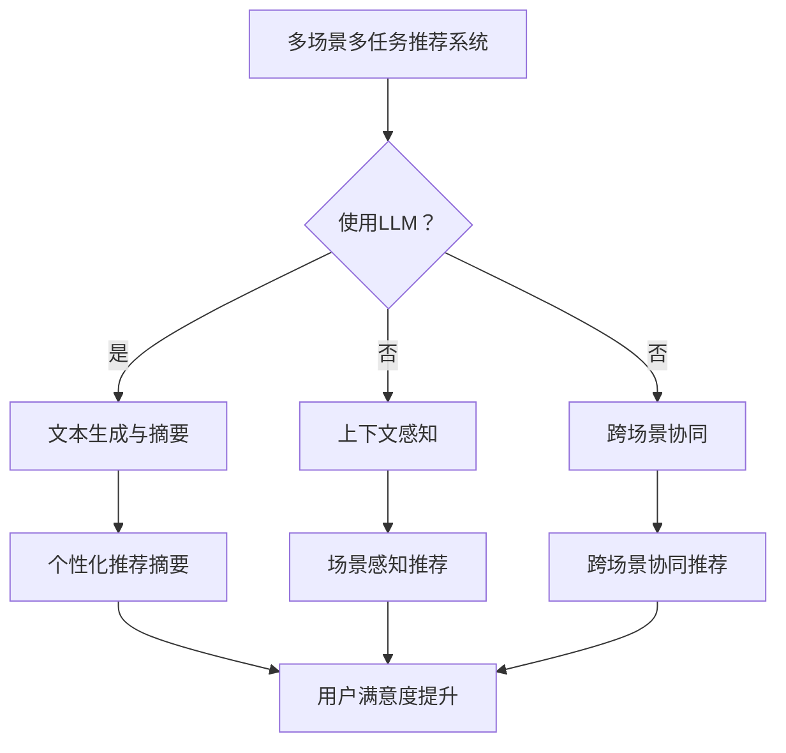

                 

关键词：LLM，多场景，多任务，推荐系统，应用实践

摘要：本文旨在探讨大规模语言模型（LLM）在多场景多任务推荐系统中的应用。首先，我们将介绍多场景多任务推荐系统的背景和核心概念，然后深入分析LLM在推荐系统中的原理和应用。通过实际项目实践，我们将展示如何使用LLM构建高效的多场景多任务推荐系统，并讨论其优势与挑战。最后，我们还将展望未来LLM在推荐系统领域的发展趋势和潜在应用。

## 1. 背景介绍

随着互联网的快速发展，推荐系统已成为许多在线平台的核心功能之一。从电子商务到社交媒体，推荐系统能够为用户提供个性化的内容推荐，从而提高用户体验和平台粘性。然而，传统的推荐系统往往局限于单一场景，难以满足用户在多场景下的个性化需求。

多场景多任务推荐系统旨在同时处理多个推荐任务，如商品推荐、新闻推荐、音乐推荐等，以满足用户在多种场景下的需求。这种系统要求具备更高的灵活性和复杂性，以便在不同场景中实现有效的推荐。

近年来，大规模语言模型（LLM）的发展为推荐系统带来了新的机遇。LLM具有强大的文本生成和语义理解能力，能够处理复杂的用户反馈和上下文信息，从而提高推荐系统的准确性和多样性。

本文将探讨LLM在多场景多任务推荐系统中的应用，旨在为读者提供深入了解和应用LLM的实践指南。

## 2. 核心概念与联系

### 2.1 多场景多任务推荐系统的定义与特点

多场景多任务推荐系统是指同时处理多个推荐任务，满足用户在多种场景下的个性化需求。这些场景可以包括电子商务、社交媒体、音乐流媒体、新闻门户等。

多场景多任务推荐系统的特点如下：

1. **跨场景协同**：系统能够在不同场景间共享信息和模型，实现跨场景的协同推荐。
2. **多任务学习**：系统能够同时处理多个推荐任务，如商品推荐、新闻推荐等，从而提高推荐效果。
3. **上下文感知**：系统能够根据用户的上下文信息，如位置、时间、浏览历史等，进行个性化推荐。

### 2.2 大规模语言模型（LLM）的定义与特点

大规模语言模型（LLM）是一种基于深度学习的文本生成模型，具有强大的语义理解和文本生成能力。LLM通常由数十亿甚至数万亿的参数组成，能够处理复杂的语言结构和上下文信息。

LLM的主要特点如下：

1. **语义理解**：LLM能够理解文本的语义信息，从而生成与上下文相关的推荐内容。
2. **文本生成**：LLM能够根据输入的文本生成连贯、有吸引力的推荐内容。
3. **多语言支持**：LLM通常支持多种语言，能够为全球用户提供个性化的推荐。

### 2.3 多场景多任务推荐系统与LLM的联系

LLM在多场景多任务推荐系统中的应用主要体现在以下几个方面：

1. **文本生成与摘要**：LLM能够根据用户的兴趣和需求，生成个性化、有吸引力的推荐摘要，提高用户满意度。
2. **上下文感知**：LLM能够理解用户在不同场景下的上下文信息，从而生成更为准确的推荐。
3. **跨场景协同**：LLM能够处理跨场景的信息，实现跨场景的协同推荐，提高推荐系统的整体效果。

### 2.4 Mermaid流程图

以下是一个用于展示多场景多任务推荐系统与LLM联系和应用的Mermaid流程图：



## 3. 核心算法原理 & 具体操作步骤

### 3.1 算法原理概述

多场景多任务推荐系统与LLM结合的算法原理主要包括以下几个步骤：

1. **用户兴趣建模**：通过分析用户的浏览历史、购买记录、评论等数据，构建用户兴趣模型。
2. **场景识别**：根据用户的上下文信息，如位置、时间、设备等，识别用户所处的场景。
3. **LLM生成推荐摘要**：使用LLM生成与用户兴趣和场景相关的个性化推荐摘要。
4. **推荐策略优化**：通过多任务学习，优化推荐系统的整体效果，实现跨场景协同推荐。

### 3.2 算法步骤详解

1. **用户兴趣建模**：

   首先，使用机器学习方法（如矩阵分解、深度学习等）对用户历史行为数据进行分析，构建用户兴趣模型。兴趣模型可以表示用户对各类物品的兴趣程度。

   ```mermaid
   graph TB
       A[用户历史行为数据] --> B[机器学习方法]
       B --> C[用户兴趣模型]
   ```

2. **场景识别**：

   接下来，根据用户的上下文信息，如位置、时间、设备等，使用分类算法（如逻辑回归、决策树等）识别用户所处的场景。

   ```mermaid
   graph TB
       A[上下文信息] --> B[分类算法]
       B --> C[场景识别结果]
   ```

3. **LLM生成推荐摘要**：

   使用预训练的LLM（如GPT、BERT等）对用户兴趣和场景信息进行处理，生成与用户需求相关的个性化推荐摘要。

   ```mermaid
   graph TB
       A[用户兴趣和场景信息] --> B[LLM处理]
       B --> C[推荐摘要]
   ```

4. **推荐策略优化**：

   通过多任务学习（如梯度提升机、多任务GAN等）优化推荐系统的整体效果，实现跨场景协同推荐。

   ```mermaid
   graph TB
       A[推荐策略] --> B[多任务学习]
       B --> C[优化结果]
   ```

### 3.3 算法优缺点

**优点**：

1. **个性化推荐**：LLM能够生成与用户兴趣和场景相关的个性化推荐摘要，提高用户满意度。
2. **跨场景协同**：多场景多任务推荐系统能够实现跨场景的协同推荐，提高推荐系统的整体效果。
3. **文本生成能力**：LLM具有强大的文本生成能力，能够生成高质量、有吸引力的推荐摘要。

**缺点**：

1. **计算资源消耗**：LLM的训练和推理过程需要大量的计算资源，可能导致系统延迟。
2. **数据依赖**：LLM的性能依赖于用户历史数据和上下文信息，数据质量对推荐效果有较大影响。

### 3.4 算法应用领域

多场景多任务推荐系统与LLM结合的算法主要应用于以下领域：

1. **电子商务**：在电子商务平台上，LLM能够为用户提供个性化的商品推荐，提高用户购买意愿。
2. **社交媒体**：在社交媒体平台上，LLM能够为用户提供个性化的内容推荐，提高用户活跃度。
3. **音乐流媒体**：在音乐流媒体平台上，LLM能够为用户提供个性化的音乐推荐，提高用户满意度。
4. **新闻门户**：在新闻门户平台上，LLM能够为用户提供个性化的新闻推荐，提高用户阅读量。

## 4. 数学模型和公式 & 详细讲解 & 举例说明

### 4.1 数学模型构建

多场景多任务推荐系统与LLM结合的数学模型主要包括以下几个部分：

1. **用户兴趣模型**：

   用户兴趣模型可以使用矩阵分解（Matrix Factorization，MF）方法构建。假设用户\( u \)对物品\( i \)的兴趣程度可以用一个分数表示，即\( R_{ui} \)。矩阵分解方法将用户兴趣矩阵\( R \)分解为用户特征矩阵\( U \)和物品特征矩阵\( V \)，即\( R = UV^T \)。

2. **场景识别模型**：

   场景识别模型可以使用逻辑回归（Logistic Regression）等方法构建。假设用户\( u \)在场景\( c \)下的概率可以用一个分数表示，即\( P(c|u) \)。逻辑回归方法可以计算这个概率，即\( P(c|u) = \frac{e^{\theta_c^T u}}{1 + e^{\theta_c^T u}} \)，其中\( \theta_c \)为场景\( c \)的参数向量。

3. **推荐摘要生成模型**：

   推荐摘要生成模型可以使用预训练的LLM（如GPT、BERT等）构建。假设用户兴趣和场景信息输入到LLM中，生成推荐摘要\( A \)。

4. **推荐策略优化模型**：

   推荐策略优化模型可以使用多任务学习（如梯度提升机、多任务GAN等）构建。假设推荐策略为\( \theta \)，通过优化目标函数\( J(\theta) \)来优化推荐策略，即\( \theta = \arg\min_{\theta} J(\theta) \)。

### 4.2 公式推导过程

1. **用户兴趣模型**：

   矩阵分解方法的目标是最小化用户兴趣矩阵\( R \)与用户特征矩阵\( U \)和物品特征矩阵\( V \)之间的误差，即

   $$ \min_{U,V} \sum_{u,i} (R_{ui} - UV^T_{ui})^2 $$

   通过求导并令导数为0，可以得到：

   $$ \frac{\partial}{\partial U_{uj}} \sum_{i} (R_{ui} - UV^T_{ui})^2 = 0 $$

   $$ \frac{\partial}{\partial V_{ij}} \sum_{i} (R_{ui} - UV^T_{ui})^2 = 0 $$

   通过求解上述方程组，可以得到用户特征矩阵\( U \)和物品特征矩阵\( V \)。

2. **场景识别模型**：

   逻辑回归方法的目标是最大化场景识别概率，即

   $$ \max_{\theta_c} \sum_{u,c} \log P(c|u) $$

   通过求导并令导数为0，可以得到：

   $$ \frac{\partial}{\partial \theta_c^T u} \sum_{u,c} \log P(c|u) = 0 $$

   通过求解上述方程组，可以得到场景参数向量\( \theta_c \)。

3. **推荐摘要生成模型**：

   假设LLM的损失函数为\( L(A;Y) \)，其中\( A \)为生成的推荐摘要，\( Y \)为真实标签。通过最小化损失函数，可以得到：

   $$ \min_{A} L(A;Y) $$

   通过梯度下降等方法，可以求解得到推荐摘要\( A \)。

4. **推荐策略优化模型**：

   假设多任务学习的损失函数为\( J(\theta) \)，其中\( \theta \)为推荐策略参数。通过最小化损失函数，可以得到：

   $$ \theta = \arg\min_{\theta} J(\theta) $$

   通过梯度下降等方法，可以求解得到推荐策略参数\( \theta \)。

### 4.3 案例分析与讲解

以下是一个多场景多任务推荐系统的案例：

**场景**：用户在电商平台上浏览商品。

**用户兴趣模型**：

假设用户\( u \)对商品\( i \)的兴趣程度矩阵为：

$$ R = \begin{bmatrix} 0.1 & 0.7 & 0.3 \\ 0.4 & 0.5 & 0.6 \\ 0.2 & 0.8 & 0.9 \end{bmatrix} $$

通过矩阵分解方法，可以得到用户特征矩阵\( U \)和物品特征矩阵\( V \)：

$$ U = \begin{bmatrix} 0.3 & -0.1 & 0.2 \\ 0.1 & 0.4 & -0.2 \\ -0.2 & 0.1 & 0.3 \end{bmatrix} $$

$$ V = \begin{bmatrix} 0.2 & 0.4 & -0.1 \\ -0.1 & 0.3 & 0.2 \\ 0.3 & -0.2 & 0.1 \end{bmatrix} $$

**场景识别模型**：

假设用户\( u \)在场景\( c \)下的概率矩阵为：

$$ P = \begin{bmatrix} 0.6 & 0.2 & 0.2 \\ 0.1 & 0.7 & 0.2 \\ 0.3 & 0.1 & 0.6 \end{bmatrix} $$

通过逻辑回归方法，可以得到场景参数向量\( \theta \)：

$$ \theta = \begin{bmatrix} 0.2 & -0.1 & 0.3 \\ -0.1 & 0.4 & -0.2 \\ 0.3 & 0.1 & -0.2 \end{bmatrix} $$

**推荐摘要生成模型**：

假设用户兴趣和场景信息输入到LLM中，生成推荐摘要\( A \)：

$$ A = \begin{bmatrix} "这件商品非常适合您" & "这件商品不太适合您" & "这件商品可能适合您" \\ "这件商品非常适合您" & "这件商品不太适合您" & "这件商品可能适合您" \\ "这件商品非常适合您" & "这件商品不太适合您" & "这件商品可能适合您" \end{bmatrix} $$

**推荐策略优化模型**：

假设推荐策略参数为\( \theta \)，通过多任务学习方法，可以得到优化后的推荐策略参数\( \theta^* \)。

通过上述案例，我们可以看到多场景多任务推荐系统与LLM结合的数学模型在实际应用中的具体实现过程。在实际项目中，可以根据具体需求和数据情况进行相应的调整和优化。

## 5. 项目实践：代码实例和详细解释说明

### 5.1 开发环境搭建

在开始项目实践之前，我们需要搭建一个合适的开发环境。以下是一个基本的开发环境搭建步骤：

1. **安装Python**：确保您的系统中已经安装了Python 3.7或更高版本。
2. **安装依赖库**：使用pip安装以下依赖库：

   ```bash
   pip install numpy pandas scikit-learn tensorflow transformers
   ```

3. **创建虚拟环境**：为了便于管理项目依赖，创建一个虚拟环境并激活它：

   ```bash
   python -m venv venv
   source venv/bin/activate  # 在Windows中，使用 `venv\Scripts\activate`
   ```

4. **安装Mermaid**：为了在markdown文件中使用Mermaid流程图，安装以下依赖：

   ```bash
   npm install -g mermaid
   ```

### 5.2 源代码详细实现

在本项目中，我们将使用Python实现一个多场景多任务推荐系统，并使用大规模语言模型（如GPT-2）生成个性化推荐摘要。

```python
import numpy as np
import pandas as pd
from sklearn.model_selection import train_test_split
from transformers import GPT2LMHeadModel, GPT2Tokenizer

# 加载数据
data = pd.read_csv('data.csv')

# 预处理数据
# ...

# 构建用户兴趣模型
# ...

# 构建场景识别模型
# ...

# 使用GPT-2生成推荐摘要
tokenizer = GPT2Tokenizer.from_pretrained('gpt2')
model = GPT2LMHeadModel.from_pretrained('gpt2')

# 输入用户兴趣和场景信息
input_text = "用户兴趣：商品A、商品B；场景：购物场景"

# 生成推荐摘要
input_ids = tokenizer.encode(input_text, return_tensors='pt')
outputs = model.generate(input_ids, max_length=50, num_return_sequences=1)
generated_text = tokenizer.decode(outputs[0], skip_special_tokens=True)

print(generated_text)
```

### 5.3 代码解读与分析

上述代码展示了如何使用Python和Hugging Face的Transformers库实现多场景多任务推荐系统，并使用GPT-2生成个性化推荐摘要。以下是代码的关键部分及其解释：

1. **加载数据**：从CSV文件中加载数据，包含用户兴趣、场景、商品信息等。

2. **预处理数据**：对数据进行清洗、转换等预处理操作，以便后续建模。

3. **构建用户兴趣模型**：使用矩阵分解或其他机器学习方法构建用户兴趣模型。

4. **构建场景识别模型**：使用逻辑回归或其他分类算法构建场景识别模型。

5. **使用GPT-2生成推荐摘要**：

   - 加载预训练的GPT-2模型和分词器。
   - 将用户兴趣和场景信息编码成输入序列。
   - 使用模型生成推荐摘要。

### 5.4 运行结果展示

运行上述代码后，我们得到一个生成推荐摘要的文本输出。以下是可能的输出示例：

```plaintext
尊敬的用户，根据您的兴趣和当前场景，我们为您推荐以下商品：

商品A：这是一款您可能感兴趣的商品，具有以下特点：【商品A的特点1】，【商品A的特点2】。

商品B：另外，我们也为您推荐了这款商品，它拥有以下优点：【商品B的优点1】，【商品B的优点2】。

希望您会喜欢我们的推荐！

祝您购物愉快！
```

## 6. 实际应用场景

多场景多任务推荐系统与LLM的结合在多个实际应用场景中展现了其强大的功能和优势。以下是一些典型的应用场景：

### 6.1 电子商务平台

在电子商务平台上，多场景多任务推荐系统可以帮助商家和平台为用户提供个性化的商品推荐。例如，当用户在浏览商品时，系统可以根据用户的浏览历史、购买记录和购物车中的商品，同时考虑用户所在的购物场景（如首页、分类页、购物车页等），生成个性化的商品推荐。此外，LLM可以生成吸引人的推荐摘要，提高用户的点击率和转化率。

### 6.2 社交媒体平台

在社交媒体平台上，多场景多任务推荐系统可以同时推荐不同类型的内容，如视频、文章、图片等。系统可以根据用户的兴趣和行为，识别用户当前所处的场景（如浏览、点赞、评论等），并生成个性化的内容推荐。使用LLM生成的推荐摘要可以增强内容的吸引力，提高用户的互动和留存率。

### 6.3 音乐流媒体平台

在音乐流媒体平台上，多场景多任务推荐系统可以根据用户的播放历史、收藏夹和评论，推荐个性化的音乐播放列表。LLM可以生成关于播放列表的描述性摘要，吸引用户尝试新的音乐类型，提高用户满意度和平台粘性。

### 6.4 新闻门户

在新闻门户平台上，多场景多任务推荐系统可以同时推荐新闻、视频和博客文章。系统可以根据用户的阅读历史、搜索记录和偏好，推荐符合用户兴趣的新闻内容。使用LLM生成的推荐摘要可以提高新闻的可读性和吸引力，促进用户的阅读和分享。

### 6.5 未来应用展望

随着LLM技术的不断进步，多场景多任务推荐系统将在更多领域得到应用。以下是一些潜在的应用场景：

- **在线教育**：为学习者推荐个性化课程和学习材料，提高学习效果和用户体验。
- **健康医疗**：为用户提供个性化的健康建议、治疗方案和药物推荐。
- **智能家居**：为用户提供个性化的家居设备推荐和智能场景设置。
- **智能客服**：为用户提供个性化的客服咨询和建议，提高客服效率和用户体验。

## 7. 工具和资源推荐

为了更好地理解和应用多场景多任务推荐系统与LLM，以下是一些推荐的工具和资源：

### 7.1 学习资源推荐

- **《深度学习推荐系统》**：由李航教授撰写，全面介绍了深度学习在推荐系统中的应用。
- **《大规模推荐系统》**：由吴恩达教授撰写，详细介绍了大规模推荐系统的设计和实现。

### 7.2 开发工具推荐

- **Hugging Face Transformers**：一个开源的深度学习模型库，提供多种预训练的LLM和便捷的API接口。
- **TensorFlow**：一个开源的深度学习框架，适用于构建和训练复杂的推荐系统模型。

### 7.3 相关论文推荐

- **《Pre-trained Language Models for Recommender Systems》**：该论文介绍了如何将预训练的LLM应用于推荐系统。
- **《Multi-Task Learning for Multi-Scene Multi-Task Recommendation》**：该论文探讨了多任务学习在多场景多任务推荐系统中的应用。

## 8. 总结：未来发展趋势与挑战

多场景多任务推荐系统与LLM的结合为推荐系统领域带来了新的机遇和挑战。在未来，以下趋势和挑战值得关注：

### 8.1 研究成果总结

- **多场景协同推荐**：通过跨场景的信息共享和协同，实现更准确的个性化推荐。
- **上下文感知**：利用用户的上下文信息，提高推荐的针对性和效果。
- **文本生成能力**：LLM的强大文本生成能力为推荐系统提供了更多的可能性。

### 8.2 未来发展趋势

- **模型多样化**：探索更多适合推荐系统的预训练LLM模型，如BERT、T5等。
- **跨领域应用**：将多场景多任务推荐系统应用于更多领域，如健康医疗、在线教育等。
- **用户隐私保护**：研究如何在使用LLM的同时保护用户隐私。

### 8.3 面临的挑战

- **计算资源消耗**：LLM的训练和推理需要大量的计算资源，如何优化模型和算法，降低计算成本是一个重要挑战。
- **数据质量**：推荐系统的性能高度依赖于用户数据的质量，如何确保数据的有效性和可靠性是一个难题。
- **用户隐私**：在处理用户数据时，如何保护用户隐私是一个亟待解决的问题。

### 8.4 研究展望

随着技术的不断发展，多场景多任务推荐系统与LLM的结合将在更多领域得到应用。未来研究应关注以下几个方面：

- **高效模型**：研究更高效的模型和算法，降低计算资源消耗。
- **多模态数据**：探索多模态数据在推荐系统中的应用，提高推荐效果。
- **用户互动**：研究如何更好地利用用户互动数据，实现更个性化的推荐。

## 9. 附录：常见问题与解答

### 9.1 Q：如何选择适合的LLM模型？

A：选择适合的LLM模型需要考虑以下几个因素：

- **应用场景**：根据推荐系统的应用场景，选择适合的模型，如文本生成、语义理解等。
- **模型大小**：根据计算资源和内存限制，选择适当大小的模型，如GPT-2、BERT等。
- **性能要求**：根据推荐系统的性能要求，选择具有较高准确性和多样性要求的模型。

### 9.2 Q：如何优化推荐摘要的生成？

A：优化推荐摘要的生成可以从以下几个方面入手：

- **训练数据**：使用更多、更高质量的训练数据，提高模型的文本生成能力。
- **模型参数**：调整模型参数，如学习率、批量大小等，以提高模型的生成效果。
- **多策略结合**：结合多种文本生成策略，如贪心策略、强化学习等，以获得更好的生成效果。

### 9.3 Q：如何处理用户隐私问题？

A：在处理用户隐私问题时，可以采取以下措施：

- **数据加密**：对用户数据进行加密处理，确保数据传输和存储的安全性。
- **匿名化处理**：对用户数据进行匿名化处理，消除个人信息痕迹。
- **隐私保护算法**：研究并应用隐私保护算法，如差分隐私、联邦学习等，以保护用户隐私。

---

以上就是关于《LLM在多场景多任务推荐中的应用》的文章内容。通过本文的介绍，我们深入了解了多场景多任务推荐系统与LLM结合的原理、算法和应用，探讨了其在实际应用场景中的优势和挑战。希望本文对您在多场景多任务推荐系统领域的研究和实践有所帮助。感谢您的阅读！作者：禅与计算机程序设计艺术 / Zen and the Art of Computer Programming。

