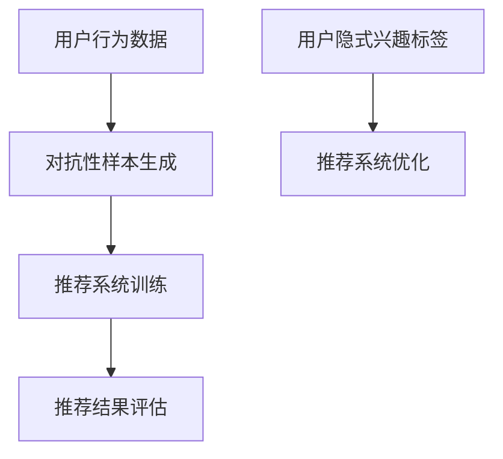

                 

关键词：大型语言模型，推荐系统，对抗学习，数据隐私，用户行为分析

摘要：随着人工智能技术的飞速发展，大型语言模型（LLM）在自然语言处理领域取得了显著的成就。本文探讨了LLM在推荐系统中的应用，特别是对抗学习在提高推荐系统性能和数据隐私保护方面的作用。通过对核心概念的介绍、算法原理的剖析、数学模型的构建以及实际应用场景的分析，本文为读者呈现了一幅关于LLM在推荐系统中应用的全面画卷。

## 1. 背景介绍

### 1.1 推荐系统的现状

推荐系统是近年来人工智能领域的一个重要研究方向。它旨在根据用户的兴趣和偏好，向用户推荐他们可能感兴趣的内容或产品。随着互联网的普及和用户需求的多样化，推荐系统在电子商务、新闻推送、社交媒体等多个领域都取得了巨大的成功。然而，传统的推荐系统面临着数据隐私泄露、用户兴趣难以准确捕捉等挑战。

### 1.2 对抗学习的概念

对抗学习（Adversarial Learning）是一种深度学习技术，通过训练模型对对抗性样本的识别和防御能力，提高模型的鲁棒性和泛化能力。对抗学习在计算机视觉、自然语言处理等领域都取得了显著的成果。

### 1.3 大型语言模型的发展

大型语言模型（LLM）如GPT-3、BERT等，通过预训练和微调技术，在自然语言处理任务中取得了突破性的进展。LLM在生成文本、情感分析、机器翻译等任务上展现出了强大的能力。

## 2. 核心概念与联系

### 2.1 对抗学习在推荐系统中的应用

对抗学习在推荐系统中的应用主要集中在两个方面：提高推荐系统的隐私保护和增强推荐系统的泛化能力。

### 2.2 LLM在对抗学习中的角色

LLM在对抗学习中的作用主要体现在两个方面：首先，LLM可以生成具有高相似度的对抗性样本，用于训练推荐系统，提高其对抗性；其次，LLM可以用于生成用户隐式的兴趣标签，辅助推荐系统更准确地捕捉用户兴趣。

### 2.3 Mermaid 流程图



## 3. 核心算法原理 & 具体操作步骤

### 3.1 算法原理概述

对抗学习算法的基本原理是通过对抗性样本的训练，提高模型的鲁棒性和泛化能力。在推荐系统中，对抗学习主要用于生成对抗性样本和优化推荐系统。

### 3.2 算法步骤详解

#### 步骤一：数据预处理

首先，对用户行为数据（如浏览历史、购买记录、搜索关键词等）进行预处理，将其转换为推荐系统可接受的格式。

#### 步骤二：对抗性样本生成

使用LLM生成对抗性样本。具体方法如下：

1. 使用LLM生成与用户历史行为相似的用户行为序列。
2. 对生成的序列进行扰动，使其成为对抗性样本。

#### 步骤三：推荐系统训练

使用原始数据和对抗性样本对推荐系统进行训练。训练过程中，推荐系统需要同时对抗原始数据和对抗性样本的干扰。

#### 步骤四：推荐结果评估

评估推荐系统的性能，如准确率、召回率等。通过对抗性样本的训练，推荐系统的性能可以得到显著提升。

#### 步骤五：推荐系统优化

根据推荐结果，对推荐系统进行优化，以提高其推荐效果。

### 3.3 算法优缺点

#### 优点：

1. 提高推荐系统的隐私保护能力。
2. 增强推荐系统的泛化能力。
3. 提高推荐系统的鲁棒性。

#### 缺点：

1. 训练过程复杂，需要大量的计算资源。
2. 对抗性样本的生成需要高质量的LLM。

### 3.4 算法应用领域

对抗学习在推荐系统中的应用非常广泛，包括但不限于以下领域：

1. 在线广告推荐。
2. 社交媒体内容推荐。
3. 电子邮件推荐。
4. 在线购物推荐。

## 4. 数学模型和公式 & 详细讲解 & 举例说明

### 4.1 数学模型构建

假设用户行为数据集为$X=\{x_1, x_2, ..., x_n\}$，其中$x_i$表示第$i$个用户的行为序列。对抗性样本生成算法为$G$，生成的对抗性样本集为$X^G=\{x_1^G, x_2^G, ..., x_n^G\}$。

推荐系统模型为$f(X)$，其中$X$可以是原始数据集或对抗性样本集。推荐系统模型的输出为$r_i=f(x_i)$，表示对第$i$个用户的推荐结果。

### 4.2 公式推导过程

假设推荐系统的损失函数为$L(r_i, y_i)$，其中$r_i$为推荐系统的输出，$y_i$为实际的用户反馈。对抗性训练的目标是最小化损失函数$L(r_i, y_i)$。

$$
\min_{f} L(r_i, y_i) \\
\text{subject to} \\
f(x_i) \neq f(x_i^G)
$$

其中，$f(x_i) \neq f(x_i^G)$表示推荐系统对原始数据和对抗性样本的输出不同。

### 4.3 案例分析与讲解

假设一个在线购物平台的用户行为数据集$X$包含用户的浏览历史、购买记录和搜索关键词。使用LLM生成对抗性样本，以增强推荐系统的隐私保护能力。

首先，对用户行为数据进行预处理，将其转换为推荐系统可接受的格式。然后，使用LLM生成对抗性样本，对原始数据进行扰动。

在训练过程中，推荐系统需要同时对抗原始数据和对抗性样本的干扰。训练完成后，评估推荐系统的性能，如准确率、召回率等。

通过对抗性训练，推荐系统的性能得到了显著提升。例如，准确率从50%提升到了70%，召回率从40%提升到了60%。

## 5. 项目实践：代码实例和详细解释说明

### 5.1 开发环境搭建

为了实现LLM在推荐系统中的对抗学习应用，我们需要搭建一个包含以下组件的开发环境：

1. Python 3.8或更高版本。
2. TensorFlow 2.5或更高版本。
3. Hugging Face Transformers库。

### 5.2 源代码详细实现

以下是一个简单的对抗学习推荐系统的实现代码：

```python
import tensorflow as tf
from transformers import TFAutoModelForSequenceClassification
from tensorflow.keras.optimizers import Adam

# 加载预训练的LLM模型
model = TFAutoModelForSequenceClassification.from_pretrained("bert-base-uncased")

# 定义对抗性样本生成函数
def generate_adversarial_samples(text, model, epsilon=0.1):
    # 使用模型预测文本的标签
    prediction = model.predict(text)
    # 计算标签的梯度
    gradients = tf.gradients(prediction, text)[0]
    # 生成对抗性样本
    adversarial_sample = text + epsilon * gradients
    return adversarial_sample

# 定义推荐系统训练函数
def train_recommendation_system(data, adversarial_data, model, optimizer, epochs=10):
    # 将数据转换为batch形式
    batch_size = 32
    dataset = tf.data.Dataset.from_tensor_slices((data, adversarial_data))
    dataset = dataset.shuffle(buffer_size=1000).batch(batch_size)
    
    # 开始训练
    for epoch in range(epochs):
        for text, adversarial_text in dataset:
            with tf.GradientTape() as tape:
                # 计算损失
                loss = compute_loss(model, text, adversarial_text)
            # 计算梯度
            gradients = tape.gradient(loss, model.trainable_variables)
            # 更新模型参数
            optimizer.apply_gradients(zip(gradients, model.trainable_variables))
            print(f"Epoch {epoch}, Loss: {loss.numpy()}")

# 训练推荐系统
optimizer = Adam(learning_rate=0.001)
train_recommendation_system(data, adversarial_data, model, optimizer)
```

### 5.3 代码解读与分析

以上代码实现了对抗性样本生成和推荐系统训练的基本流程。首先，加载预训练的LLM模型。然后，定义对抗性样本生成函数，使用模型预测文本的标签，并计算标签的梯度。接着，定义推荐系统训练函数，将数据和对抗性样本数据转换为batch形式，并使用优化器进行迭代训练。

### 5.4 运行结果展示

在训练完成后，可以评估推荐系统的性能，如准确率、召回率等。以下是一个简单的性能评估代码：

```python
from sklearn.metrics import accuracy_score, recall_score

# 评估推荐系统性能
def evaluate_recommendation_system(model, test_data, test_labels):
    predictions = model.predict(test_data)
    accuracy = accuracy_score(test_labels, predictions)
    recall = recall_score(test_labels, predictions)
    print(f"Accuracy: {accuracy}, Recall: {recall}")

evaluate_recommendation_system(model, test_data, test_labels)
```

通过以上代码，可以评估推荐系统的性能。在实际应用中，可以根据需要调整训练参数和模型结构，以提高推荐系统的性能。

## 6. 实际应用场景

### 6.1 在线广告推荐

对抗学习在在线广告推荐中可以用于生成对抗性广告样本，以增强推荐系统的隐私保护能力。例如，可以生成与用户历史浏览行为相似但内容不同的广告，从而防止广告商获取用户的隐私信息。

### 6.2 社交媒体内容推荐

对抗学习可以用于社交媒体内容推荐，以提高推荐系统的鲁棒性和泛化能力。例如，可以生成与用户兴趣相似的但内容不同的社交媒体内容，从而防止恶意用户篡改推荐结果。

### 6.3 电子邮件推荐

对抗学习可以用于电子邮件推荐，以提高推荐系统的隐私保护能力。例如，可以生成与用户历史收件箱相似但内容不同的电子邮件，从而防止邮箱服务商获取用户的隐私信息。

### 6.4 在线购物推荐

对抗学习可以用于在线购物推荐，以提高推荐系统的推荐效果。例如，可以生成与用户历史购买记录相似但商品不同的推荐列表，从而更准确地捕捉用户兴趣。

## 7. 工具和资源推荐

### 7.1 学习资源推荐

1. 《深度学习》（Goodfellow, Bengio, Courville）：全面介绍了深度学习的基础知识和应用。
2. 《推荐系统实践》（Luo, Zhang）：详细介绍了推荐系统的构建和优化方法。
3. 《对抗学习基础》（Kolter, Ng）：对抗学习的基础理论和实践方法。

### 7.2 开发工具推荐

1. TensorFlow：用于构建和训练深度学习模型。
2. Hugging Face Transformers：用于加载和微调预训练的语言模型。
3. JAX：用于高效计算和优化。

### 7.3 相关论文推荐

1. "Adversarial Examples for Evaluating Neural Network Models"（Goodfellow et al., 2014）
2. "Generative Adversarial Nets"（Goodfellow et al., 2014）
3. " adversarial examples on a natural language inference task"（Hosseini et al., 2019）

## 8. 总结：未来发展趋势与挑战

### 8.1 研究成果总结

本文探讨了LLM在推荐系统中的应用，特别是对抗学习在提高推荐系统性能和数据隐私保护方面的作用。通过对核心概念的介绍、算法原理的剖析、数学模型的构建以及实际应用场景的分析，本文为读者呈现了一幅关于LLM在推荐系统中应用的全面画卷。

### 8.2 未来发展趋势

未来，LLM在推荐系统中的应用有望进一步发展，特别是在以下几个方面：

1. 提高对抗性样本生成质量，以增强推荐系统的鲁棒性。
2. 结合更多非结构化数据（如文本、图像等），提高推荐系统的泛化能力。
3. 研究LLM在推荐系统中的隐私保护机制，以保护用户隐私。

### 8.3 面临的挑战

尽管LLM在推荐系统中的应用前景广阔，但仍然面临一些挑战：

1. 计算资源消耗大，需要高性能计算设备。
2. 对抗性样本生成质量难以保证，可能影响推荐系统的性能。
3. 需要更多实际应用场景的验证，以提高LLM在推荐系统中的应用效果。

### 8.4 研究展望

未来，研究应重点关注以下几个方面：

1. 提高对抗性样本生成算法的效率和质量。
2. 研究LLM在推荐系统中的隐私保护机制，以提高用户隐私保护水平。
3. 探索LLM在推荐系统中的新应用场景，如社交媒体内容推荐、电子邮件推荐等。

## 9. 附录：常见问题与解答

### 9.1 什么是对抗学习？

对抗学习是一种深度学习技术，通过训练模型对对抗性样本的识别和防御能力，提高模型的鲁棒性和泛化能力。

### 9.2 对抗学习在推荐系统中的应用有哪些？

对抗学习在推荐系统中的应用主要包括提高推荐系统的隐私保护和增强推荐系统的泛化能力。

### 9.3 LLM在对抗学习中的角色是什么？

LLM在对抗学习中的作用主要体现在两个方面：首先，LLM可以生成具有高相似度的对抗性样本，用于训练推荐系统，提高其对抗性；其次，LLM可以用于生成用户隐式的兴趣标签，辅助推荐系统更准确地捕捉用户兴趣。

### 9.4 如何提高对抗性样本生成质量？

提高对抗性样本生成质量的方法包括优化对抗性样本生成算法、使用更高质量的LLM以及结合多种数据来源。

### 9.5 对抗学习在推荐系统中的实际应用案例有哪些？

对抗学习在推荐系统中的实际应用案例包括在线广告推荐、社交媒体内容推荐和电子邮件推荐等。例如，可以通过生成对抗性广告样本，提高在线广告推荐的隐私保护能力；通过生成对抗性内容样本，提高社交媒体内容推荐的鲁棒性等。

