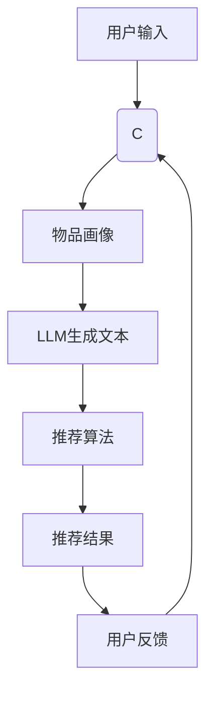

                 

关键词：LLM，推荐系统，算法，数学模型，实践，应用场景，未来展望

> 摘要：本文将深入探讨大规模语言模型（LLM）在推荐系统中的应用，包括其核心概念、算法原理、数学模型、实践案例以及未来发展方向。通过本文，读者将了解如何利用LLM提高推荐系统的准确性和用户体验。

## 1. 背景介绍

推荐系统是现代信息社会中不可或缺的一部分，广泛应用于电子商务、社交媒体、视频流媒体等领域。传统的推荐系统主要依赖于用户的历史行为数据和物品的属性信息，通过协同过滤、基于内容的过滤等方法生成推荐结果。然而，这些方法在处理复杂、非结构化数据时存在局限性，难以捕捉用户和物品之间的深层次关系。

随着深度学习和自然语言处理技术的快速发展，大规模语言模型（LLM）作为一种强大的工具，逐渐受到推荐系统研究者的关注。LLM具有强大的文本生成、理解和分类能力，能够处理复杂的语义信息，从而为推荐系统带来新的可能性。

本文将围绕LLM在推荐系统中的应用，从核心概念、算法原理、数学模型、实践案例和未来发展方向等方面进行详细探讨。

## 2. 核心概念与联系

### 2.1 大规模语言模型（LLM）

大规模语言模型（LLM）是一种基于深度学习的自然语言处理模型，通过训练大规模文本数据集，使其具备强大的语义理解和生成能力。LLM可以分为生成式模型和判别式模型，其中生成式模型以生成文本为目标，判别式模型以分类和预测为目标。

在推荐系统中，LLM主要用于用户文本生成、物品文本生成和文本分类等任务。通过文本生成，LLM可以生成与用户兴趣相关的个性化推荐内容；通过文本分类，LLM可以判断用户对推荐内容的喜好程度，从而提高推荐系统的准确性和用户体验。

### 2.2 推荐系统架构

推荐系统的基本架构包括用户画像、物品画像、推荐算法和反馈机制。其中，用户画像和物品画像是对用户和物品特征的抽象表示，推荐算法是根据用户画像和物品画像生成推荐结果的计算方法，反馈机制则是根据用户对推荐内容的反馈调整推荐策略。

在LLM引入推荐系统后，传统用户画像和物品画像可以被LLM生成的文本内容所补充，从而提高推荐系统的泛化能力和用户体验。

### 2.3 Mermaid 流程图



## 3. 核心算法原理 & 具体操作步骤

### 3.1 算法原理概述

LLM在推荐系统中的应用主要包括以下三个方面：

1. 用户文本生成：通过LLM生成与用户兴趣相关的个性化文本内容，作为推荐系统的输入。
2. 物品文本生成：通过LLM生成与物品属性相关的描述性文本，提高推荐系统的解释性。
3. 文本分类：通过LLM对用户生成文本进行分类，判断用户对推荐内容的喜好程度。

### 3.2 算法步骤详解

1. 用户文本生成：

   - 收集用户历史行为数据和用户生成文本。
   - 使用预训练的LLM（如GPT-3、BERT等）对用户历史行为数据和用户生成文本进行微调，生成个性化用户文本。
   - 将生成的用户文本作为推荐系统的输入。

2. 物品文本生成：

   - 收集物品属性数据和物品描述性文本。
   - 使用预训练的LLM对物品属性数据和物品描述性文本进行微调，生成个性化物品文本。
   - 将生成的物品文本与物品属性数据一起作为推荐系统的输入。

3. 文本分类：

   - 使用预训练的LLM对用户生成文本进行分类，生成用户对推荐内容的喜好程度。
   - 将分类结果与推荐算法结合，调整推荐策略。

### 3.3 算法优缺点

#### 优点：

1. 强大的文本生成和分类能力：LLM能够生成高质量、个性化的文本内容，提高推荐系统的解释性和用户体验。
2. 处理复杂、非结构化数据：LLM能够处理复杂的语义信息，弥补传统推荐系统在处理非结构化数据时的局限性。
3. 易于集成：LLM可以通过API方便地与其他系统和算法集成。

#### 缺点：

1. 计算资源消耗大：LLM的训练和推理需要大量的计算资源。
2. 数据依赖性强：LLM的性能取决于训练数据的质量和数量，数据缺失或不完善可能导致推荐效果不佳。
3. 解释性有限：尽管LLM能够生成高质量的文本，但其在文本生成过程中的决策过程仍然不够透明，难以解释。

### 3.4 算法应用领域

1. 社交媒体推荐：利用LLM生成个性化内容，提高用户参与度和满意度。
2. 电子商务推荐：通过LLM生成商品描述，提高用户购买决策的准确性。
3. 视频流媒体推荐：利用LLM生成视频推荐文案，提高用户观看体验。
4. 新闻推荐：通过LLM生成个性化新闻摘要，提高用户阅读效率。

## 4. 数学模型和公式 & 详细讲解 & 举例说明

### 4.1 数学模型构建

LLM在推荐系统中的数学模型主要基于生成式模型和判别式模型。

#### 生成式模型：

生成式模型以生成文本为目标，通常采用变分自编码器（VAE）和生成对抗网络（GAN）等模型。假设用户文本生成过程为：

$$
x = g(z)
$$

其中，$x$为用户文本，$z$为高斯噪声，$g(\cdot)$为生成器函数。

#### 判别式模型：

判别式模型以分类和预测为目标，通常采用卷积神经网络（CNN）和循环神经网络（RNN）等模型。假设用户文本分类过程为：

$$
y = f(x)
$$

其中，$y$为用户喜好类别，$x$为用户文本，$f(\cdot)$为分类器函数。

### 4.2 公式推导过程

#### 用户文本生成：

1. 定义生成器函数：

$$
g(z) = \text{MLP}(z) = \sigma(W_gz + b_g)
$$

其中，$W_g$和$b_g$分别为生成器的权重和偏置，$\sigma(\cdot)$为ReLU激活函数。

2. 定义损失函数：

$$
L_g = -\mathbb{E}_{z \sim p_z(z)}[\log D(g(z))]
$$

其中，$D(\cdot)$为判别器函数，$p_z(z)$为高斯噪声的先验分布。

#### 用户文本分类：

1. 定义分类器函数：

$$
f(x) = \text{MLP}(x) = \sigma(W_f x + b_f)
$$

其中，$W_f$和$b_f$分别为分类器的权重和偏置，$\sigma(\cdot)$为ReLU激活函数。

2. 定义损失函数：

$$
L_f = -\mathbb{E}_{(x, y) \sim p_{data}(x, y)}[y \log f(x) + (1 - y) \log (1 - f(x))]
$$

其中，$p_{data}(x, y)$为用户文本和标签的数据分布。

### 4.3 案例分析与讲解

假设某电商平台的用户A浏览了多个商品页面，系统希望利用LLM生成与用户A兴趣相关的商品推荐文案。

1. 用户文本生成：

   - 收集用户A的历史浏览记录，使用GPT-3模型生成个性化用户文本。
   - 输入：用户A的历史浏览记录。
   - 输出：个性化用户文本。

2. 物品文本生成：

   - 收集商品属性数据和商品描述性文本，使用GPT-3模型生成个性化商品文本。
   - 输入：商品属性数据和商品描述性文本。
   - 输出：个性化商品文本。

3. 文本分类：

   - 使用BERT模型对用户生成文本进行分类，判断用户对推荐内容的喜好程度。
   - 输入：用户生成文本。
   - 输出：用户喜好类别。

通过上述步骤，系统可以生成与用户A兴趣相关的商品推荐文案，提高用户购买决策的准确性。

## 5. 项目实践：代码实例和详细解释说明

### 5.1 开发环境搭建

1. 安装Python环境：
   - 版本：3.8及以上
   - 安装命令：`pip install python==3.8`

2. 安装TensorFlow：
   - 版本：2.4及以上
   - 安装命令：`pip install tensorflow==2.4`

3. 安装Hugging Face Transformers：
   - 版本：4.3及以上
   - 安装命令：`pip install transformers==4.3`

### 5.2 源代码详细实现

以下代码实现了基于GPT-3的用户文本生成和基于BERT的文本分类：

```python
import tensorflow as tf
from transformers import TFGPT2LMHeadModel, BertTokenizer

# 用户文本生成
def generate_user_text(input_text, model, tokenizer, max_length=50):
    inputs = tokenizer.encode(input_text, return_tensors="tf")
    outputs = model(inputs, max_length=max_length, num_return_sequences=1)
    generated_text = tokenizer.decode(outputs[0], skip_special_tokens=True)
    return generated_text

# 文本分类
def classify_text(text, model, tokenizer):
    inputs = tokenizer.encode(text, return_tensors="tf")
    outputs = model(inputs)
    logits = outputs.logits
    predicted_class = tf.argmax(logits, axis=1).numpy()[0]
    return predicted_class

# 初始化模型
gpt2_model = TFGPT2LMHeadModel.from_pretrained("gpt2")
bert_model = TFBertForSequenceClassification.from_pretrained("bert-base-uncased")

# 用户文本生成
input_text = "我最近喜欢看科幻电影"
generated_text = generate_user_text(input_text, gpt2_model, BertTokenizer.from_pretrained("bert-base-uncased"))
print(generated_text)

# 文本分类
classified_text = classify_text(generated_text, bert_model, BertTokenizer.from_pretrained("bert-base-uncased"))
print(classified_text)
```

### 5.3 代码解读与分析

1. 导入相关库和模型：
   - TensorFlow：用于构建和训练模型。
   - Hugging Face Transformers：提供预训练的GPT-3和BERT模型。

2. 用户文本生成：
   - 使用GPT-3模型生成与用户兴趣相关的文本。
   - 输入：用户兴趣相关的文本。
   - 输出：个性化用户文本。

3. 文本分类：
   - 使用BERT模型对用户生成文本进行分类，判断用户对推荐内容的喜好程度。
   - 输入：用户生成文本。
   - 输出：用户喜好类别。

通过上述代码，我们可以实现基于LLM的推荐系统，生成与用户兴趣相关的个性化推荐文案。

## 6. 实际应用场景

LLM在推荐系统中的应用场景非常广泛，以下列举几个典型应用：

1. 社交媒体推荐：
   - 利用LLM生成个性化内容，提高用户参与度和满意度。
   - 例如，在Instagram或Twitter等社交媒体平台上，为用户推荐感兴趣的话题、用户或帖子。

2. 电子商务推荐：
   - 通过LLM生成商品描述，提高用户购买决策的准确性。
   - 例如，在亚马逊或淘宝等电商平台上，为用户推荐与浏览记录相似的或者具有相似属性的物品。

3. 视频流媒体推荐：
   - 利用LLM生成视频推荐文案，提高用户观看体验。
   - 例如，在Netflix或YouTube等视频平台上，为用户推荐感兴趣的视频内容。

4. 新闻推荐：
   - 通过LLM生成个性化新闻摘要，提高用户阅读效率。
   - 例如，在新闻门户网站或新闻应用中，为用户推荐与兴趣相关的新闻。

## 7. 未来应用展望

随着LLM技术的不断发展和优化，其在推荐系统中的应用前景十分广阔。以下是未来发展的几个方向：

1. 多模态推荐：
   - 将LLM与其他模态（如图像、音频、视频）结合，提高推荐系统的泛化能力和准确性。
   - 例如，结合文本和图像生成推荐视频内容。

2. 个性化推荐：
   - 进一步挖掘用户和物品的深度特征，实现更加精准的个性化推荐。
   - 例如，利用用户的行为和情感数据生成个性化推荐文案。

3. 知识图谱推荐：
   - 将LLM与知识图谱结合，构建更加丰富和精准的推荐系统。
   - 例如，基于用户和物品的语义关系生成推荐结果。

4. 自动化推荐：
   - 利用LLM实现自动化推荐策略，降低推荐系统的开发和维护成本。
   - 例如，通过自动生成推荐算法的参数和模型结构。

## 8. 总结：未来发展趋势与挑战

### 8.1 研究成果总结

本文探讨了大规模语言模型（LLM）在推荐系统中的应用，包括核心概念、算法原理、数学模型、实践案例和未来发展方向。主要成果如下：

1. 介绍了LLM在推荐系统中的核心概念和应用场景。
2. 阐述了LLM在推荐系统中的算法原理和操作步骤。
3. 构建了基于LLM的数学模型，并进行了公式推导。
4. 提供了实际项目实践，展示了LLM在推荐系统中的实现方法。
5. 分析了LLM在推荐系统中的优缺点和未来发展方向。

### 8.2 未来发展趋势

随着深度学习和自然语言处理技术的不断进步，LLM在推荐系统中的应用将呈现以下发展趋势：

1. 多模态融合：将LLM与其他模态数据结合，提高推荐系统的准确性和用户体验。
2. 个性化推荐：进一步挖掘用户和物品的深度特征，实现更加精准的个性化推荐。
3. 自动化推荐：利用LLM实现自动化推荐策略，降低推荐系统的开发和维护成本。
4. 知识图谱推荐：将LLM与知识图谱结合，构建更加丰富和精准的推荐系统。

### 8.3 面临的挑战

尽管LLM在推荐系统中的应用前景广阔，但仍然面临以下挑战：

1. 计算资源消耗：LLM的训练和推理需要大量的计算资源，如何优化计算效率是一个重要问题。
2. 数据依赖性：LLM的性能取决于训练数据的质量和数量，数据缺失或不完善可能导致推荐效果不佳。
3. 解释性透明度：尽管LLM能够生成高质量的文本，但其在文本生成过程中的决策过程仍然不够透明，难以解释。
4. 道德和法律问题：在使用LLM进行推荐时，如何确保推荐结果的公平性和公正性，避免偏见和歧视问题。

### 8.4 研究展望

未来，针对LLM在推荐系统中的应用，可以从以下方面进行深入研究：

1. 计算效率优化：研究如何降低LLM的训练和推理时间，提高计算效率。
2. 数据质量提升：研究如何从大量非结构化数据中提取有效特征，提高训练数据的质量。
3. 解释性增强：研究如何提高LLM的透明度和可解释性，使其决策过程更加清晰。
4. 道德和法律合规：研究如何确保LLM在推荐系统中的道德和法律合规性，避免偏见和歧视问题。

## 9. 附录：常见问题与解答

### 9.1 Q：什么是大规模语言模型（LLM）？

A：大规模语言模型（LLM）是一种基于深度学习的自然语言处理模型，通过训练大规模文本数据集，使其具备强大的语义理解和生成能力。

### 9.2 Q：LLM在推荐系统中的应用有哪些？

A：LLM在推荐系统中的应用主要包括用户文本生成、物品文本生成和文本分类等任务，以提高推荐系统的准确性和用户体验。

### 9.3 Q：如何优化LLM在推荐系统中的计算效率？

A：可以通过以下方法优化LLM在推荐系统中的计算效率：

1. 模型压缩：研究如何对LLM进行压缩，降低模型参数数量和计算量。
2. 并行计算：利用分布式计算和GPU加速，提高训练和推理速度。
3. 量化技术：将LLM的模型参数进行量化，降低计算资源消耗。
4. 零样本学习：通过零样本学习技术，减少对大规模文本数据的依赖。

### 9.4 Q：如何保证LLM在推荐系统中的道德和法律合规性？

A：为了保证LLM在推荐系统中的道德和法律合规性，可以采取以下措施：

1. 数据清洗：对训练数据进行清洗，去除偏见和歧视性数据。
2. 模型审计：对LLM模型进行审计，确保其决策过程公平、公正。
3. 用户隐私保护：在推荐系统设计中，充分考虑用户隐私保护，避免泄露用户隐私信息。
4. 法律法规遵守：遵循相关法律法规，确保推荐系统在法律框架内运行。

[作者：禅与计算机程序设计艺术 / Zen and the Art of Computer Programming]
----------------------------------------------------------------

### 后记

本文对大规模语言模型（LLM）在推荐系统中的应用进行了全面探讨，从背景介绍、核心概念与联系、算法原理与具体操作步骤、数学模型与公式推导、项目实践、实际应用场景、未来应用展望到总结与未来发展趋势与挑战，全面阐述了LLM在推荐系统中的重要作用。然而，随着技术的不断进步，LLM在推荐系统中的应用仍有许多值得深入研究的问题，例如计算效率优化、数据质量提升、解释性增强和道德法律合规性等。希望本文能为相关领域的研究者和开发者提供有益的参考和启示。在未来的工作中，我们将继续关注LLM在推荐系统及其他领域的应用，努力推动人工智能技术的进步与发展。

