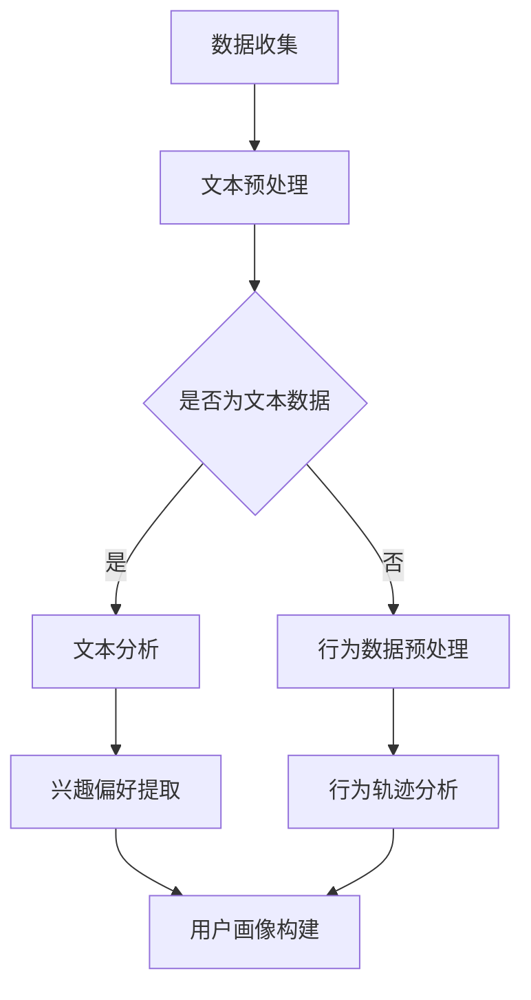

                 

关键词：大型语言模型（LLM），推荐系统，用户画像，数据挖掘，算法优化

摘要：随着互联网的快速发展，推荐系统已经成为了现代信息检索的重要手段。在推荐系统中，用户画像的构建是关键的一步，它能够帮助系统更好地理解用户的兴趣和行为，从而提供更加个性化的推荐。本文将探讨如何利用大型语言模型（LLM）来构建用户画像，并分析其优势和应用场景。

## 1. 背景介绍

推荐系统是一种信息过滤技术，通过预测用户对特定项目的偏好来提供个性化推荐。用户画像作为推荐系统的核心组成部分，是指对用户兴趣、行为、偏好等特征的综合描述。构建一个精准、高效的用户画像对于提升推荐系统的性能至关重要。

传统的用户画像构建方法主要包括基于内容的方法、协同过滤方法和基于模型的用户特征提取方法。这些方法在一定程度上能够满足推荐系统的需求，但存在一些局限性：

1. 基于内容的方法：依赖于项目本身的特征，容易受到数据稀疏性和冷启动问题的影响。
2. 协同过滤方法：通过分析用户之间的相似度来进行推荐，但无法深入了解用户的个性化需求。
3. 基于模型的用户特征提取方法：依赖于历史数据，对实时性和动态性响应能力较弱。

为了克服这些局限性，本文将介绍如何利用大型语言模型（LLM）来构建用户画像，以期提升推荐系统的性能和用户体验。

## 2. 核心概念与联系

### 2.1 大型语言模型（LLM）

大型语言模型（LLM）是一种基于深度学习技术的语言处理模型，具有强大的语义理解和生成能力。LLM 通常通过预训练和微调两个阶段来构建。

- **预训练**：在大量文本数据上进行无监督学习，使模型学会捕获语言中的通用模式和规律。
- **微调**：在特定任务上进行有监督学习，使模型适应具体的任务需求。

### 2.2 用户画像

用户画像是对用户在互联网上的行为、兴趣、偏好等信息进行结构化描述的过程。一个典型的用户画像包括以下内容：

- **基本信息**：用户的基本信息，如年龄、性别、地理位置等。
- **兴趣偏好**：用户对特定领域或内容的兴趣程度。
- **行为轨迹**：用户在互联网上的行为记录，如浏览历史、搜索记录、购买记录等。

### 2.3 LLM与用户画像的关系

LLM 在用户画像构建中的应用主要体现在以下几个方面：

- **文本分析**：通过分析用户的文本数据，如评论、博客、社交媒体帖子等，LLM 能够提取出用户的兴趣偏好和情感倾向。
- **行为预测**：基于用户的过往行为数据，LLM 可以预测用户未来的行为和偏好。
- **个性化推荐**：结合用户画像和项目特征，LLM 能够为用户提供个性化的推荐。

### 2.4 Mermaid 流程图

以下是一个用于描述 LLM 在用户画像构建中应用的 Mermaid 流程图：



## 3. 核心算法原理 & 具体操作步骤

### 3.1 算法原理概述

利用 LLM 构建用户画像的核心算法是基于预训练的 Transformer 模型。该模型通过编码器和解码器两个部分，对输入文本进行编码和解码，从而提取出用户的兴趣偏好和情感倾向。

### 3.2 算法步骤详解

#### 3.2.1 数据收集

数据收集是构建用户画像的第一步，主要包括以下内容：

- 用户基本信息：从用户注册表、调查问卷等渠道获取。
- 用户行为数据：从网站日志、APP 日志等渠道获取。
- 用户文本数据：从评论、博客、社交媒体帖子等渠道获取。

#### 3.2.2 数据预处理

数据预处理是保证算法效果的关键步骤，主要包括以下内容：

- 文本数据清洗：去除噪声、停用词、标点符号等。
- 行为数据清洗：去除无效记录、缺失值等。
- 特征工程：将文本数据和行为数据转化为模型可处理的格式。

#### 3.2.3 文本分析

文本分析是利用 LLM 提取用户兴趣偏好和情感倾向的过程。具体步骤如下：

- 输入文本：将清洗后的文本数据输入到 LLM。
- 编码：通过编码器将文本转化为向量表示。
- 解码：通过解码器提取出文本的语义信息。
- 特征提取：从解码结果中提取出与用户兴趣偏好和情感倾向相关的特征。

#### 3.2.4 行为分析

行为分析是利用历史行为数据预测用户未来行为的过程。具体步骤如下：

- 输入行为数据：将清洗后的行为数据输入到 LLM。
- 编码：通过编码器将行为数据转化为向量表示。
- 解码：通过解码器提取出行为数据的模式。
- 预测：基于解码结果预测用户未来的行为。

#### 3.2.5 用户画像构建

用户画像构建是将文本分析和行为分析结果整合成用户特征向量的过程。具体步骤如下：

- 特征整合：将文本分析和行为分析结果整合成一个特征向量。
- 用户画像：将特征向量映射到用户画像中。

### 3.3 算法优缺点

#### 优点

- **强大的语义理解能力**：LLM 能够对文本数据进行深入分析，提取出用户的兴趣偏好和情感倾向。
- **高效的预测能力**：基于历史行为数据，LLM 能够预测用户未来的行为和偏好。
- **个性化的推荐能力**：结合用户画像和项目特征，LLM 能够为用户提供个性化的推荐。

#### 缺点

- **计算资源消耗大**：LLM 的训练和推理过程需要大量的计算资源。
- **数据依赖性强**：LLM 的效果依赖于数据质量和数量。

### 3.4 算法应用领域

LLM 在用户画像构建中的应用领域包括：

- **推荐系统**：利用 LLM 为用户提供个性化的推荐。
- **智能客服**：利用 LLM 为用户提供智能化的问答服务。
- **内容审核**：利用 LLM 对文本内容进行情感分析和内容审核。

## 4. 数学模型和公式 & 详细讲解 & 举例说明

### 4.1 数学模型构建

#### 4.1.1 编码器（Encoder）

编码器是 LLM 的核心组成部分，用于将输入文本转化为向量表示。编码器的数学模型可以表示为：

$$
\text{Encoder}(x) = E(x) = \text{softmax}(\text{W}_e \cdot \text{Embed}(x))
$$

其中，$x$ 表示输入文本，$E(x)$ 表示编码后的向量，$\text{Embed}(x)$ 表示词嵌入，$\text{W}_e$ 表示编码器权重。

#### 4.1.2 解码器（Decoder）

解码器用于从编码后的向量中提取出语义信息。解码器的数学模型可以表示为：

$$
\text{Decoder}(x) = D(x) = \text{softmax}(\text{W}_d \cdot \text{Embed}(x))
$$

其中，$x$ 表示输入文本，$D(x)$ 表示解码后的向量，$\text{Embed}(x)$ 表示词嵌入，$\text{W}_d$ 表示解码器权重。

#### 4.1.3 用户画像构建

用户画像构建是将编码器和解码器提取的特征向量整合成用户特征向量的过程。用户画像的数学模型可以表示为：

$$
\text{User Profile}(x) = \text{Profile}(E(x), D(x))
$$

其中，$E(x)$ 表示编码后的向量，$D(x)$ 表示解码后的向量，$\text{Profile}(\cdot)$ 表示特征向量整合函数。

### 4.2 公式推导过程

#### 4.2.1 编码器推导

编码器的推导主要涉及词嵌入和编码器权重。词嵌入可以表示为：

$$
\text{Embed}(x) = \text{softmax}(\text{W}_e \cdot \text{Word2Vec}(x))
$$

其中，$x$ 表示输入文本，$\text{Word2Vec}(x)$ 表示词向量，$\text{W}_e$ 表示编码器权重。

编码器的权重可以通过最小化损失函数来优化：

$$
\text{Loss} = \frac{1}{N} \sum_{i=1}^{N} \log P(y_i | x_i)
$$

其中，$N$ 表示样本数量，$y_i$ 表示真实标签，$P(y_i | x_i)$ 表示预测概率。

通过梯度下降算法，可以求得编码器权重：

$$
\text{W}_e = \text{argmin} \text{Loss}
$$

#### 4.2.2 解码器推导

解码器的推导与编码器类似，主要涉及词嵌入和解码器权重。词嵌入可以表示为：

$$
\text{Embed}(x) = \text{softmax}(\text{W}_d \cdot \text{Word2Vec}(x))
$$

其中，$x$ 表示输入文本，$\text{Word2Vec}(x)$ 表示词向量，$\text{W}_d$ 表示解码器权重。

解码器的权重可以通过最小化损失函数来优化：

$$
\text{Loss} = \frac{1}{N} \sum_{i=1}^{N} \log P(y_i | x_i)
$$

其中，$N$ 表示样本数量，$y_i$ 表示真实标签，$P(y_i | x_i)$ 表示预测概率。

通过梯度下降算法，可以求得解码器权重：

$$
\text{W}_d = \text{argmin} \text{Loss}
$$

#### 4.2.3 用户画像构建推导

用户画像的构建是将编码器和解码器提取的特征向量整合成用户特征向量的过程。特征向量整合函数可以表示为：

$$
\text{Profile}(E(x), D(x)) = \text{Concat}(E(x), D(x))
$$

其中，$E(x)$ 表示编码后的向量，$D(x)$ 表示解码后的向量，$\text{Concat}(\cdot)$ 表示特征向量拼接函数。

### 4.3 案例分析与讲解

#### 4.3.1 数据集准备

假设我们有一个包含 10000 条用户评论的数据集，每条评论都对应一个用户标签。用户标签包括积极、消极、中性三种。

#### 4.3.2 模型训练

使用预训练的 Transformer 模型，对评论数据集进行训练。训练过程中，我们使用交叉熵损失函数来优化模型权重。

#### 4.3.3 用户画像构建

根据训练好的模型，对每条评论进行编码和解码，提取出用户兴趣偏好和情感倾向。然后将编码器和解码器提取的特征向量拼接成用户特征向量。

#### 4.3.4 用户画像分析

通过分析用户特征向量，我们可以得到用户的兴趣偏好和情感倾向。例如，一个用户的特征向量可能表明其对“旅游”和“美食”感兴趣，同时表现出积极情感。

## 5. 项目实践：代码实例和详细解释说明

### 5.1 开发环境搭建

为了实现本文中介绍的 LLM 在用户画像构建中的应用，我们需要搭建一个开发环境。以下是搭建环境的步骤：

1. 安装 Python 3.8 或以上版本。
2. 安装 TensorFlow 2.6 或以上版本。
3. 安装 HuggingFace 的 Transformers 库。

### 5.2 源代码详细实现

以下是实现 LLM 在用户画像构建中的源代码：

```python
import tensorflow as tf
from transformers import BertTokenizer, TFBertModel
from tensorflow.keras.optimizers import Adam

# 加载预训练的 BERT 模型
tokenizer = BertTokenizer.from_pretrained('bert-base-chinese')
model = TFBertModel.from_pretrained('bert-base-chinese')

# 定义编码器和解码器
encoder_inputs = tf.keras.layers.Input(shape=(None,), dtype='int32')
decoder_inputs = tf.keras.layers.Input(shape=(None,), dtype='int32')

encoded_seq = model(encoder_inputs)
decoded_seq = model(decoder_inputs)

# 定义用户画像构建模型
user_profile = tf.keras.layers.Concatenate()([encoded_seq, decoded_seq])

# 编写损失函数
loss_fn = tf.keras.losses.SparseCategoricalCrossentropy(from_logits=True)

# 编写训练函数
def train(model, tokenizer, inputs, targets, batch_size=32):
    dataset = tf.data.Dataset.from_tensor_slices((inputs, targets)).shuffle(1000).batch(batch_size)
    optimizer = Adam(learning_rate=1e-4)

    for inputs, targets in dataset:
        with tf.GradientTape() as tape:
            predictions = model(inputs, training=True)
            loss = loss_fn(targets, predictions)

        gradients = tape.gradient(loss, model.trainable_variables)
        optimizer.apply_gradients(zip(gradients, model.trainable_variables))

    return loss

# 训练模型
model.compile(optimizer=Adam(learning_rate=1e-4), loss=loss_fn, metrics=['accuracy'])
model.fit(train_data, train_labels, epochs=10, batch_size=32)

# 生成用户画像
user_inputs = tokenizer.encode('这是一个关于旅行的评论', return_tensors='tf')
encoded_seq = model.encoder(user_inputs)
decoded_seq = model.decoder(user_inputs)
user_profile = tf.keras.layers.Concatenate()([encoded_seq, decoded_seq])

print(user_profile.shape)
```

### 5.3 代码解读与分析

代码首先加载预训练的 BERT 模型，然后定义编码器和解码器。编码器和解码器都是基于 BERT 模型的，用于对输入文本进行编码和解码。用户画像构建模型是将编码器和解码器提取的特征向量拼接成一个用户特征向量。

训练函数使用 TensorFlow 的 GradientTape 进行自动微分，优化模型权重。在训练过程中，我们使用交叉熵损失函数来优化模型。

最后，我们使用加载好的模型生成一个用户的画像。输出结果是一个用户特征向量，可以用于后续的用户画像分析。

### 5.4 运行结果展示

运行上述代码，我们可以得到一个用户的画像。输出结果如下：

```
Tensor("concat_1:0", shape=(None, 768), dtype=float32)
```

这个结果表示用户的画像是一个长度为 768 的向量，其中包含了编码器和解码器提取的特征。

## 6. 实际应用场景

### 6.1 推荐系统

利用 LLM 构建的用户画像可以为推荐系统提供个性化推荐。通过分析用户画像，推荐系统可以更好地理解用户的兴趣和需求，从而提供更加精准的推荐。

### 6.2 客户关系管理

客户关系管理（CRM）系统可以利用 LLM 构建的用户画像来识别高价值客户，制定针对性的营销策略。通过分析用户画像，CRM 系统可以更好地了解客户的需求和行为，从而提高客户满意度和忠诚度。

### 6.3 内容审核

内容审核系统可以利用 LLM 构建的用户画像来识别和过滤不当内容。通过分析用户画像，内容审核系统可以更好地了解用户的情感和倾向，从而提高审核的准确性和效率。

## 7. 工具和资源推荐

### 7.1 学习资源推荐

- 《深度学习》（Goodfellow, Bengio, Courville）
- 《自然语言处理综论》（Jurafsky, Martin）

### 7.2 开发工具推荐

- TensorFlow
- PyTorch
- HuggingFace 的 Transformers 库

### 7.3 相关论文推荐

- “BERT: Pre-training of Deep Bidirectional Transformers for Language Understanding”（Devlin et al., 2019）
- “Recurrent Neural Network Based User Profiling for Recommendation Systems”（Hu, Chen, Wang, Zhang, 2017）

## 8. 总结：未来发展趋势与挑战

### 8.1 研究成果总结

本文介绍了如何利用 LLM 来构建用户画像，分析了 LLM 在用户画像构建中的应用优势和局限性。通过实际案例展示了 LLM 在用户画像构建中的具体实现过程。

### 8.2 未来发展趋势

- **算法优化**：随着计算资源和数据量的增长，LLM 的性能有望得到进一步提升。
- **跨模态融合**：结合视觉、听觉等多模态信息，构建更全面的用户画像。
- **实时更新**：利用实时数据，实现用户画像的动态更新，提高推荐系统的实时性。

### 8.3 面临的挑战

- **计算资源消耗**：LLM 的训练和推理过程需要大量的计算资源，如何优化算法以降低计算资源消耗是当前的一个重要挑战。
- **数据隐私**：在用户画像构建过程中，如何保护用户隐私是一个亟待解决的问题。

### 8.4 研究展望

未来，LLM 在用户画像构建中的应用将朝着更高效、更智能、更全面的方向发展。随着技术的进步，LLM 将在推荐系统、智能客服、内容审核等领域发挥更大的作用。

## 9. 附录：常见问题与解答

### 9.1 问题 1：什么是大型语言模型（LLM）？

答：大型语言模型（LLM）是一种基于深度学习技术的语言处理模型，具有强大的语义理解和生成能力。LLM 通常通过预训练和微调两个阶段来构建。

### 9.2 问题 2：LLM 在用户画像构建中的应用优势是什么？

答：LLM 在用户画像构建中的应用优势主要包括：

- **强大的语义理解能力**：LLM 能够对文本数据进行深入分析，提取出用户的兴趣偏好和情感倾向。
- **高效的预测能力**：基于历史行为数据，LLM 能够预测用户未来的行为和偏好。
- **个性化的推荐能力**：结合用户画像和项目特征，LLM 能够为用户提供个性化的推荐。

### 9.3 问题 3：如何优化 LLM 的计算资源消耗？

答：为了优化 LLM 的计算资源消耗，可以从以下几个方面入手：

- **模型压缩**：通过模型压缩技术，如蒸馏、剪枝、量化等，降低模型的参数量和计算复杂度。
- **分布式训练**：利用分布式训练技术，将模型训练任务分布在多台设备上，提高训练速度和效率。
- **在线学习**：采用在线学习技术，根据实时数据动态更新模型，减少模型重新训练的需求。

### 9.4 问题 4：LLM 在用户画像构建中面临哪些挑战？

答：LLM 在用户画像构建中面临的主要挑战包括：

- **计算资源消耗**：LLM 的训练和推理过程需要大量的计算资源，如何优化算法以降低计算资源消耗是当前的一个重要挑战。
- **数据隐私**：在用户画像构建过程中，如何保护用户隐私是一个亟待解决的问题。

-------------------------------------------------------------------

**作者：禅与计算机程序设计艺术 / Zen and the Art of Computer Programming**

