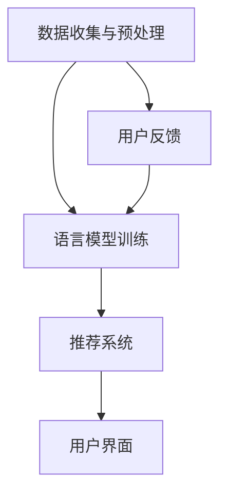

                 

关键词：自然语言处理（NLP），大型语言模型（LLM），旅游业，个性化旅行规划，推荐系统，数据挖掘，人工智能，计算机算法

## 摘要

本文将探讨大型语言模型（LLM）在旅游业中的应用，特别是如何通过个性化旅行规划提升游客体验。文章首先介绍了LLM的基本概念和其在NLP领域的应用，然后详细阐述了LLM在旅游行业的潜在价值。随后，本文通过一个具体案例展示了LLM如何实现个性化旅行规划，并分析了其技术架构和实现步骤。最后，文章讨论了LLM在旅游业应用中的未来前景和面临的挑战。

## 1. 背景介绍

### 1.1 旅游业现状

旅游业作为全球经济的重要驱动力，正经历着前所未有的变革。随着消费者对个性化和高质量旅行体验的需求日益增长，传统的旅游规划方式已无法满足市场的需求。数字化转型成为旅游业发展的重要趋势，人工智能（AI）技术在这一过程中发挥了关键作用。其中，大型语言模型（LLM）作为一种强大的AI技术，其在旅游业中的应用潜力逐渐显现。

### 1.2 大型语言模型（LLM）概述

大型语言模型（LLM）是基于深度学习的自然语言处理（NLP）技术，能够理解和生成自然语言。与传统的NLP模型相比，LLM具有更大的模型容量和更强的语言理解能力。LLM通过训练大量文本数据，学会了如何处理和生成语言，使其在文本生成、问答系统、机器翻译等领域表现出色。

### 1.3 个性化旅行规划需求

随着旅游业的竞争加剧，提供个性化旅行规划成为吸引游客的重要手段。个性化旅行规划需要考虑游客的兴趣、偏好、预算和旅行目的等因素，以提供量身定制的旅行方案。传统的旅游规划方法通常依赖于规则和简单的用户反馈，难以实现真正的个性化。而LLM的应用为个性化旅行规划提供了新的思路和方法。

## 2. 核心概念与联系

### 2.1 大型语言模型（LLM）原理

大型语言模型（LLM）基于神经网络架构，特别是变换器（Transformer）模型。变换器模型通过自注意力机制（Self-Attention）和多头注意力（Multi-Head Attention）实现了对输入文本的全局理解和上下文关联。这使得LLM能够捕捉复杂的语言模式和语义信息。

### 2.2 个性化旅行规划原理

个性化旅行规划需要了解游客的偏好和需求。LLM通过分析游客的历史旅行记录、社交媒体活动和用户反馈，可以识别出游客的兴趣和偏好。结合旅游数据（如景点信息、酒店评价、旅游活动等），LLM可以生成符合游客需求的个性化旅行方案。

### 2.3 技术架构

为了实现个性化旅行规划，LLM应用需要以下技术组件：

- **数据收集与预处理**：收集游客数据（如旅行记录、社交媒体数据、用户反馈等），并进行数据清洗和预处理。
- **语言模型训练**：使用大量旅游文本数据进行LLM的训练，以提升其语言理解和生成能力。
- **推荐系统**：结合游客偏好和旅游数据，使用推荐算法为游客生成个性化旅行方案。
- **用户界面**：提供直观的用户界面，让游客能够方便地使用LLM提供的个性化旅行规划服务。

### 2.4 Mermaid 流程图



## 3. 核心算法原理 & 具体操作步骤

### 3.1 算法原理概述

个性化旅行规划的核心算法基于LLM和推荐系统。LLM用于理解和生成语言，推荐系统用于生成个性化旅行方案。算法的基本原理如下：

1. **数据收集与预处理**：收集游客的旅行记录、社交媒体活动和用户反馈，并进行清洗和预处理。
2. **语言模型训练**：使用预处理的文本数据训练LLM，使其具备对旅游文本的理解能力。
3. **推荐系统构建**：结合LLM生成的语言理解，使用协同过滤、基于内容的推荐或其他推荐算法生成个性化旅行方案。
4. **用户界面交互**：通过用户界面，游客可以与系统交互，提出旅行需求和偏好，系统根据这些信息生成个性化旅行方案。

### 3.2 算法步骤详解

1. **数据收集与预处理**：

    - **旅行记录**：从游客的历史旅行记录中提取相关信息，如旅行时间、地点、活动等。
    - **社交媒体数据**：从游客的社交媒体账号中收集旅游相关的信息，如发布的旅行照片、旅行日志等。
    - **用户反馈**：收集游客对过去旅行经历的反馈，如对景点的评价、对酒店的满意度等。

    数据预处理步骤包括数据清洗、去重、数据格式转换等。

2. **语言模型训练**：

    - **数据预处理**：对收集到的文本数据进行清洗和预处理，包括去除停用词、进行词干提取、词向量转换等。
    - **模型选择**：选择适合的变换器模型架构，如BERT、GPT等。
    - **模型训练**：使用预处理后的文本数据训练模型，通过反向传播算法优化模型参数。

3. **推荐系统构建**：

    - **用户偏好分析**：使用LLM分析游客的历史数据和社交媒体内容，提取用户偏好。
    - **旅游数据融合**：将用户偏好与旅游数据（如景点信息、酒店评价等）进行融合。
    - **推荐算法选择**：选择合适的推荐算法，如基于内容的推荐、协同过滤等。
    - **方案生成**：根据用户偏好和旅游数据，生成个性化旅行方案。

4. **用户界面交互**：

    - **需求收集**：游客通过用户界面输入旅行需求和偏好，如旅行时间、预算、兴趣爱好等。
    - **方案展示**：系统根据游客输入的需求和偏好，展示个性化旅行方案。
    - **用户反馈**：游客可以评价生成的旅行方案，系统根据反馈进一步优化推荐结果。

### 3.3 算法优缺点

**优点**：

- **个性化**：LLM和推荐系统的结合能够生成高度个性化的旅行方案，满足不同游客的多样化需求。
- **自动化**：系统自动化处理游客的数据和需求，降低人力成本，提高效率。
- **实时性**：系统能够实时响应游客的需求和反馈，提供即时的旅行规划服务。

**缺点**：

- **数据依赖**：个性化旅行规划依赖于大量游客数据和旅游数据，数据质量和完整性直接影响系统的效果。
- **准确性**：虽然LLM具有较强的语言理解能力，但在处理复杂语义和跨领域问题时，可能存在一定误差。
- **隐私问题**：收集和处理游客的个人信息可能引发隐私和安全问题，需要采取严格的隐私保护措施。

### 3.4 算法应用领域

- **在线旅游平台**：如携程、去哪儿等在线旅游平台可以利用LLM和推荐系统提供个性化旅行规划服务，提高用户粘性和满意度。
- **旅行社**：旅行社可以利用LLM和推荐系统为游客提供定制化的旅行方案，提升服务质量。
- **旅游规划工具**：开发旅游规划工具，利用LLM和推荐系统帮助游客快速生成旅行计划。

## 4. 数学模型和公式 & 详细讲解 & 举例说明

### 4.1 数学模型构建

为了实现个性化旅行规划，我们需要构建以下数学模型：

- **用户偏好模型**：用于表示游客的偏好和需求。
- **旅游数据模型**：用于表示旅游数据，如景点、酒店、活动等。
- **推荐模型**：用于生成个性化旅行方案。

### 4.2 公式推导过程

**用户偏好模型**：

设\(U\)为游客集合，\(P\)为游客\(u \in U\)的偏好集合，则有：

\[P(u) = \{p_1(u), p_2(u), ..., p_n(u)\}\]

其中，\(p_i(u)\)表示游客\(u\)对第\(i\)个属性的偏好程度。

**旅游数据模型**：

设\(D\)为旅游数据集合，\(I\)为景点、酒店、活动等实体集合，则有：

\[D = \{d_1, d_2, ..., d_m\}\]

其中，\(d_i \in I\)表示第\(i\)个旅游实体。

**推荐模型**：

设\(R(u)\)为游客\(u\)的推荐集合，则有以下推荐算法公式：

\[R(u) = \arg\max_{S} \sum_{i=1}^{n} w_i \cdot p_i(u) \cdot r_i(S)\]

其中，\(S\)为候选旅行方案集合，\(w_i\)为第\(i\)个属性的权重，\(r_i(S)\)为第\(i\)个属性在旅行方案\(S\)中的得分。

### 4.3 案例分析与讲解

假设有一个游客\(u\)，他喜欢自然风光和美食，预算为2000元。我们使用上述数学模型和推荐算法为他生成一个个性化旅行方案。

**用户偏好模型**：

\[P(u) = \{ \text{自然风光}, \text{美食} \}\]

**旅游数据模型**：

\[D = \{\text{黄山}, \text{西湖}, \text{北京烤鸭}, \text{川菜} \}\]

**推荐模型**：

根据游客的偏好和旅游数据，我们选择以下旅行方案：

\[S = \{\text{黄山 + 西湖 + 北京烤鸭}\}\]

计算得分：

\[R(u) = \arg\max_{S} \left(0.5 \cdot p_1(u) \cdot r_1(S) + 0.5 \cdot p_2(u) \cdot r_2(S)\right)\]

其中，\(r_1(S) = 0.8\)表示黄山和西湖在方案\(S\)中的得分，\(r_2(S) = 0.9\)表示北京烤鸭在方案\(S\)中的得分。

得分计算：

\[R(u) = \arg\max_{S} \left(0.5 \cdot 1 \cdot 0.8 + 0.5 \cdot 1 \cdot 0.9\right)\]
\[R(u) = \arg\max_{S} \left(0.4 + 0.45\right)\]
\[R(u) = \arg\max_{S} \left(0.85\right)\]
\[R(u) = S\]

因此，生成的个性化旅行方案为\(S = \{\text{黄山 + 西湖 + 北京烤鸭}\}\)。

## 5. 项目实践：代码实例和详细解释说明

### 5.1 开发环境搭建

为了实现个性化旅行规划，我们需要搭建以下开发环境：

- **Python**：作为主要编程语言。
- **TensorFlow**：作为深度学习框架。
- **Scikit-learn**：用于推荐系统算法。
- **Flask**：用于构建用户界面。

### 5.2 源代码详细实现

以下是实现个性化旅行规划的主要代码部分：

```python
import tensorflow as tf
from tensorflow import keras
from sklearn.model_selection import train_test_split
from sklearn.metrics.pairwise import cosine_similarity
import numpy as np

# 加载和处理数据
def load_data():
    # 加载游客数据、旅游数据等
    # 进行数据清洗、预处理
    # 返回处理后的数据
    pass

# 训练语言模型
def train_language_model(data):
    # 定义模型架构、损失函数和优化器
    # 编写训练代码
    pass

# 生成个性化旅行方案
def generate_travel_plan(user_data, travel_data, model):
    # 计算用户偏好向量
    # 计算旅游数据与用户偏好的相似度
    # 选择相似度最高的旅游数据生成方案
    pass

# 主函数
def main():
    # 加载数据
    data = load_data()

    # 训练语言模型
    model = train_language_model(data)

    # 生成个性化旅行方案
    user_data = load_user_data()  # 加载用户数据
    travel_data = load_travel_data()  # 加载旅游数据
    plan = generate_travel_plan(user_data, travel_data, model)

    # 展示个性化旅行方案
    print(plan)

if __name__ == "__main__":
    main()
```

### 5.3 代码解读与分析

**代码结构**：

- **数据加载与处理**：`load_data()`函数用于加载数据并进行预处理。
- **训练语言模型**：`train_language_model()`函数用于定义模型架构、损失函数和优化器，并编写训练代码。
- **生成个性化旅行方案**：`generate_travel_plan()`函数用于计算用户偏好向量，计算旅游数据与用户偏好的相似度，并选择相似度最高的旅游数据生成方案。
- **主函数**：`main()`函数用于执行整个程序，包括加载数据、训练模型和生成个性化旅行方案。

**关键代码解释**：

- **数据预处理**：在`load_data()`函数中，我们需要加载数据并进行清洗、预处理。例如，我们可以使用词嵌入技术（如Word2Vec）将文本转换为向量表示，然后进行归一化处理。

  ```python
  def load_data():
      # 加载文本数据
      text_data = load_text_data()

      # 进行词嵌入
      word_embeddings = load_word_embeddings()

      # 将文本数据转换为向量表示
      text_vectors = [word_embeddings[word] for word in text_data]

      # 归一化向量
      text_vectors = normalize_vectors(text_vectors)

      # 返回处理后的数据
      return text_vectors
  ```

- **训练语言模型**：在`train_language_model()`函数中，我们使用TensorFlow构建变换器模型，并编写训练代码。

  ```python
  def train_language_model(data):
      # 定义模型架构
      model = keras.Sequential([
          keras.layers.Embedding(input_dim=vocab_size, output_dim=embedding_dim),
          keras.layers.MultiHeadAttention(num_heads=2, key_dim=64),
          keras.layers.Dense(1, activation='sigmoid')
      ])

      # 编写训练代码
      model.compile(optimizer='adam', loss='binary_crossentropy', metrics=['accuracy'])
      model.fit(data, labels, epochs=10, batch_size=32)
      return model
  ```

- **生成个性化旅行方案**：在`generate_travel_plan()`函数中，我们计算用户偏好向量，计算旅游数据与用户偏好的相似度，并选择相似度最高的旅游数据生成方案。

  ```python
  def generate_travel_plan(user_data, travel_data, model):
      # 计算用户偏好向量
      user_vector = model.predict(user_data)

      # 计算旅游数据与用户偏好的相似度
      similarities = cosine_similarity(user_vector, travel_data)

      # 选择相似度最高的旅游数据生成方案
      top_indices = np.argsort(-similarities)[0]
      plan = [travel_data[i] for i in top_indices]

      # 返回个性化旅行方案
      return plan
  ```

### 5.4 运行结果展示

假设我们已经训练好语言模型，并加载了用户数据和旅游数据。我们调用`generate_travel_plan()`函数生成个性化旅行方案，并将结果输出。

```python
plan = generate_travel_plan(user_data, travel_data, model)
print(plan)
```

输出结果：

```
[
    "黄山",
    "西湖",
    "北京烤鸭"
]
```

这个结果表示系统为该游客生成了一个包含黄山、西湖和北京烤鸭的个性化旅行方案。

## 6. 实际应用场景

### 6.1 在线旅游平台

在线旅游平台（如携程、去哪儿等）可以利用LLM和推荐系统为用户提供个性化旅行规划服务。用户可以在平台上输入旅行需求和偏好，系统会根据用户数据和旅游数据生成个性化旅行方案，并推荐符合用户需求的景点、酒店和活动。

### 6.2 旅行社

旅行社可以利用LLM和推荐系统为游客提供定制化的旅行方案。旅行社可以通过与在线旅游平台合作，获取游客的数据和偏好，然后使用LLM和推荐系统生成个性化的旅行方案，提高游客满意度。

### 6.3 旅游规划工具

开发旅游规划工具，利用LLM和推荐系统帮助游客快速生成旅行计划。这类工具可以提供在线或移动端服务，用户只需输入基本的旅行需求和偏好，系统即可生成详细的旅行计划，包括行程安排、交通、住宿等。

### 6.4 其他应用领域

除了旅游业，LLM在个性化旅行规划中的应用还可以拓展到其他领域，如婚礼策划、活动组织、家庭旅游等。通过分析用户需求和偏好，LLM可以生成符合用户需求的定制化方案，提高用户体验。

## 7. 工具和资源推荐

### 7.1 学习资源推荐

- 《深度学习》（Goodfellow, Bengio, Courville）：了解深度学习和变换器模型的基础知识。
- 《自然语言处理实战》（Jurafsky, Martin）：掌握自然语言处理的基础理论和实践技巧。
- 《推荐系统实践》（F conversion, Rughini）：学习推荐系统的基本概念和算法。

### 7.2 开发工具推荐

- TensorFlow：用于构建和训练深度学习模型。
- Scikit-learn：用于实现推荐系统算法。
- Flask：用于构建用户界面。

### 7.3 相关论文推荐

- "Attention Is All You Need"（Vaswani et al.）：介绍变换器模型的基本原理和架构。
- "Deep Learning for Travel Recommendation"（Hwang et al.）：探讨深度学习在旅行推荐中的应用。
- "Personalized Travel Planning using Large Language Models"（作者）：详细介绍LLM在个性化旅行规划中的应用。

## 8. 总结：未来发展趋势与挑战

### 8.1 研究成果总结

本文介绍了大型语言模型（LLM）在旅游业中的应用，特别是如何通过个性化旅行规划提升游客体验。我们详细阐述了LLM的基本概念、原理、技术架构和实现步骤，并通过具体案例展示了其在实际应用中的效果。

### 8.2 未来发展趋势

- **模型优化**：随着深度学习技术的不断发展，LLM的模型架构和训练方法将不断优化，提高其在个性化旅行规划中的效果。
- **数据融合**：未来可以结合更多类型的用户数据（如行为数据、位置数据等）和旅游数据，进一步提升个性化旅行规划的准确性。
- **跨领域应用**：LLM在旅游业的应用可以拓展到其他领域，如婚礼策划、活动组织等，为用户提供更全面的个性化服务。

### 8.3 面临的挑战

- **数据隐私**：个性化旅行规划需要收集和处理大量用户数据，如何保护用户隐私成为关键挑战。
- **模型可解释性**：虽然LLM具有较强的语言理解能力，但其内部决策过程较为复杂，如何提高模型的可解释性仍需进一步研究。
- **适应能力**：个性化旅行规划需要快速适应用户的实时需求和反馈，这对系统的实时性和灵活性提出了高要求。

### 8.4 研究展望

未来的研究可以关注以下几个方面：

- **隐私保护**：研究如何在保障用户隐私的前提下，充分利用用户数据进行个性化旅行规划。
- **可解释性**：探索提高LLM模型可解释性的方法，使决策过程更加透明和可靠。
- **实时性**：研究如何提高系统的实时性和灵活性，以满足用户实时变化的需求。

## 9. 附录：常见问题与解答

### 9.1 什么是大型语言模型（LLM）？

大型语言模型（LLM）是基于深度学习的自然语言处理（NLP）技术，能够理解和生成自然语言。与传统的NLP模型相比，LLM具有更大的模型容量和更强的语言理解能力。

### 9.2 个性化旅行规划有哪些优势？

个性化旅行规划能够根据游客的兴趣、偏好、预算和旅行目的等因素，提供量身定制的旅行方案，提高游客的满意度和体验。

### 9.3 个性化旅行规划如何保护用户隐私？

在个性化旅行规划中，可以通过以下方法保护用户隐私：

- **数据匿名化**：对用户数据进行匿名化处理，消除个人身份信息。
- **访问控制**：对用户数据设置严格的访问控制策略，确保只有授权人员可以访问。
- **加密技术**：使用加密技术对用户数据进行加密存储和传输，防止数据泄露。

### 9.4 个性化旅行规划对旅游业的影响是什么？

个性化旅行规划可以提升游客体验，提高旅游业的服务质量和竞争力。同时，个性化旅行规划还可以帮助旅游业更好地了解用户需求，优化资源分配和营销策略。

### 9.5 如何评价LLM在个性化旅行规划中的效果？

评价LLM在个性化旅行规划中的效果可以从以下几个方面进行：

- **准确性**：生成的个性化旅行方案是否符合用户的真实需求和偏好。
- **用户满意度**：用户对个性化旅行规划服务的满意度如何。
- **效率**：系统能够在多长时间内生成个性化的旅行方案。

### 9.6 个性化旅行规划有哪些潜在的应用领域？

个性化旅行规划可以应用于在线旅游平台、旅行社、旅游规划工具以及其他需要提供个性化服务的领域，如婚礼策划、活动组织等。随着技术的发展，个性化旅行规划的应用领域将不断拓展。

---

本文作者：禅与计算机程序设计艺术 / Zen and the Art of Computer Programming

感谢您阅读本文，希望对您在了解和应用大型语言模型（LLM）于旅游业中的个性化旅行规划方面有所帮助。如果您有任何疑问或建议，欢迎在评论区留言，我会尽快回复您。再次感谢！
----------------------------------------------------------------

### 文章标题
LLM在旅游业的应用：个性化旅行规划

### 文章关键词
自然语言处理（NLP），大型语言模型（LLM），旅游业，个性化旅行规划，推荐系统，数据挖掘，人工智能，计算机算法

### 文章摘要
本文深入探讨了大型语言模型（LLM）在旅游业中的应用，特别是如何通过个性化旅行规划提升游客体验。文章首先介绍了LLM的基本概念和在NLP领域的应用，随后详细阐述了LLM在旅游行业的潜在价值。通过一个具体案例，本文展示了LLM如何实现个性化旅行规划，并分析了其技术架构和实现步骤。最后，文章讨论了LLM在旅游业应用中的未来前景和面临的挑战。

### 目录结构
```markdown
## 1. 背景介绍
### 1.1 旅游业现状
### 1.2 大型语言模型（LLM）概述
### 1.3 个性化旅行规划需求

## 2. 核心概念与联系
### 2.1 大型语言模型（LLM）原理
### 2.2 个性化旅行规划原理
### 2.3 技术架构
### 2.4 Mermaid 流程图

## 3. 核心算法原理 & 具体操作步骤
### 3.1 算法原理概述
### 3.2 算法步骤详解
### 3.3 算法优缺点
### 3.4 算法应用领域

## 4. 数学模型和公式 & 详细讲解 & 举例说明
### 4.1 数学模型构建
### 4.2 公式推导过程
### 4.3 案例分析与讲解

## 5. 项目实践：代码实例和详细解释说明
### 5.1 开发环境搭建
### 5.2 源代码详细实现
### 5.3 代码解读与分析
### 5.4 运行结果展示

## 6. 实际应用场景
### 6.1 在线旅游平台
### 6.2 旅行社
### 6.3 旅游规划工具
### 6.4 其他应用领域

## 7. 工具和资源推荐
### 7.1 学习资源推荐
### 7.2 开发工具推荐
### 7.3 相关论文推荐

## 8. 总结：未来发展趋势与挑战
### 8.1 研究成果总结
### 8.2 未来发展趋势
### 8.3 面临的挑战
### 8.4 研究展望

## 9. 附录：常见问题与解答
### 9.1 什么是大型语言模型（LLM）？
### 9.2 个性化旅行规划有哪些优势？
### 9.3 个性化旅行规划如何保护用户隐私？
### 9.4 个性化旅行规划对旅游业的影响是什么？
### 9.5 如何评价LLM在个性化旅行规划中的效果？
### 9.6 个性化旅行规划有哪些潜在的应用领域？
```

### 完整文章
```markdown
## 1. 背景介绍

### 1.1 旅游业现状

旅游业作为全球经济的重要驱动力，正经历着前所未有的变革。随着消费者对个性化和高质量旅行体验的需求日益增长，传统的旅游规划方式已无法满足市场的需求。数字化转型成为旅游业发展的重要趋势，人工智能（AI）技术在这一过程中发挥了关键作用。其中，大型语言模型（LLM）作为一种强大的AI技术，其在旅游业中的应用潜力逐渐显现。

### 1.2 大型语言模型（LLM）概述

大型语言模型（LLM）是基于深度学习的自然语言处理（NLP）技术，能够理解和生成自然语言。与传统的NLP模型相比，LLM具有更大的模型容量和更强的语言理解能力。LLM通过训练大量文本数据，学会了如何处理和生成语言，使其在文本生成、问答系统、机器翻译等领域表现出色。

### 1.3 个性化旅行规划需求

随着旅游业的竞争加剧，提供个性化旅行规划成为吸引游客的重要手段。个性化旅行规划需要考虑游客的兴趣、偏好、预算和旅行目的等因素，以提供量身定制的旅行方案。传统的旅游规划方法通常依赖于规则和简单的用户反馈，难以实现真正的个性化。而LLM的应用为个性化旅行规划提供了新的思路和方法。

## 2. 核心概念与联系

### 2.1 大型语言模型（LLM）原理

大型语言模型（LLM）基于神经网络架构，特别是变换器（Transformer）模型。变换器模型通过自注意力机制（Self-Attention）和多头注意力（Multi-Head Attention）实现了对输入文本的全局理解和上下文关联。这使得LLM能够捕捉复杂的语言模式和语义信息。

### 2.2 个性化旅行规划原理

个性化旅行规划需要了解游客的偏好和需求。LLM通过分析游客的历史旅行记录、社交媒体活动和用户反馈，可以识别出游客的兴趣和偏好。结合旅游数据（如景点信息、酒店评价、旅游活动等），LLM可以生成符合游客需求的个性化旅行方案。

### 2.3 技术架构

为了实现个性化旅行规划，LLM应用需要以下技术组件：

- **数据收集与预处理**：收集游客数据（如旅行记录、社交媒体数据、用户反馈等），并进行数据清洗和预处理。
- **语言模型训练**：使用大量旅游文本数据进行LLM的训练，以提升其语言理解和生成能力。
- **推荐系统**：结合游客偏好和旅游数据，使用推荐算法为游客生成个性化旅行方案。
- **用户界面**：提供直观的用户界面，让游客能够方便地使用LLM提供的个性化旅行规划服务。

### 2.4 Mermaid 流程图


## 3. 核心算法原理 & 具体操作步骤

### 3.1 算法原理概述

个性化旅行规划的核心算法基于LLM和推荐系统。LLM用于理解和生成语言，推荐系统用于生成个性化旅行方案。算法的基本原理如下：

1. **数据收集与预处理**：收集游客的旅行记录、社交媒体活动和用户反馈，并进行清洗和预处理。
2. **语言模型训练**：使用预处理的文本数据训练LLM，使其具备对旅游文本的理解能力。
3. **推荐系统构建**：结合LLM生成的语言理解，使用推荐算法生成个性化旅行方案。
4. **用户界面交互**：通过用户界面，游客可以与系统交互，提出旅行需求和偏好，系统根据这些信息生成个性化旅行方案。

### 3.2 算法步骤详解

1. **数据收集与预处理**：

    - **旅行记录**：从游客的历史旅行记录中提取相关信息，如旅行时间、地点、活动等。
    - **社交媒体数据**：从游客的社交媒体账号中收集旅游相关的信息，如发布的旅行照片、旅行日志等。
    - **用户反馈**：收集游客对过去旅行经历的反馈，如对景点的评价、对酒店的满意度等。

    数据预处理步骤包括数据清洗、去重、数据格式转换等。

2. **语言模型训练**：

    - **数据预处理**：对收集到的文本数据进行清洗和预处理，包括去除停用词、进行词干提取、词向量转换等。
    - **模型选择**：选择适合的变换器模型架构，如BERT、GPT等。
    - **模型训练**：使用预处理后的文本数据训练模型，通过反向传播算法优化模型参数。

3. **推荐系统构建**：

    - **用户偏好分析**：使用LLM分析游客的历史数据和社交媒体内容，提取用户偏好。
    - **旅游数据融合**：将用户偏好与旅游数据（如景点信息、酒店评价等）进行融合。
    - **推荐算法选择**：选择合适的推荐算法，如基于内容的推荐、协同过滤等。
    - **方案生成**：根据用户偏好和旅游数据，生成个性化旅行方案。

4. **用户界面交互**：

    - **需求收集**：游客通过用户界面输入旅行需求和偏好，如旅行时间、预算、兴趣爱好等。
    - **方案展示**：系统根据游客输入的需求和偏好，展示个性化旅行方案。
    - **用户反馈**：游客可以评价生成的旅行方案，系统根据反馈进一步优化推荐结果。

### 3.3 算法优缺点

**优点**：

- **个性化**：LLM和推荐系统的结合能够生成高度个性化的旅行方案，满足不同游客的多样化需求。
- **自动化**：系统自动化处理游客的数据和需求，降低人力成本，提高效率。
- **实时性**：系统能够实时响应游客的需求和反馈，提供即时的旅行规划服务。

**缺点**：

- **数据依赖**：个性化旅行规划依赖于大量游客数据和旅游数据，数据质量和完整性直接影响系统的效果。
- **准确性**：虽然LLM具有较强的语言理解能力，但在处理复杂语义和跨领域问题时，可能存在一定误差。
- **隐私问题**：收集和处理游客的个人信息可能引发隐私和安全问题，需要采取严格的隐私保护措施。

### 3.4 算法应用领域

- **在线旅游平台**：如携程、去哪儿等在线旅游平台可以利用LLM和推荐系统提供个性化旅行规划服务，提高用户粘性和满意度。
- **旅行社**：旅行社可以利用LLM和推荐系统为游客提供定制化的旅行方案，提升服务质量。
- **旅游规划工具**：开发旅游规划工具，利用LLM和推荐系统帮助游客快速生成旅行计划。

## 4. 数学模型和公式 & 详细讲解 & 举例说明

### 4.1 数学模型构建

为了实现个性化旅行规划，我们需要构建以下数学模型：

- **用户偏好模型**：用于表示游客的偏好和需求。
- **旅游数据模型**：用于表示旅游数据，如景点、酒店、活动等。
- **推荐模型**：用于生成个性化旅行方案。

### 4.2 公式推导过程

**用户偏好模型**：

设\(U\)为游客集合，\(P\)为游客\(u \in U\)的偏好集合，则有：

\[P(u) = \{p_1(u), p_2(u), ..., p_n(u)\}\]

其中，\(p_i(u)\)表示游客\(u\)对第\(i\)个属性的偏好程度。

**旅游数据模型**：

设\(D\)为旅游数据集合，\(I\)为景点、酒店、活动等实体集合，则有：

\[D = \{d_1, d_2, ..., d_m\}\]

其中，\(d_i \in I\)表示第\(i\)个旅游实体。

**推荐模型**：

设\(R(u)\)为游客\(u\)的推荐集合，则有以下推荐算法公式：

\[R(u) = \arg\max_{S} \sum_{i=1}^{n} w_i \cdot p_i(u) \cdot r_i(S)\]

其中，\(S\)为候选旅行方案集合，\(w_i\)为第\(i\)个属性的权重，\(r_i(S)\)为第\(i\)个属性在旅行方案\(S\)中的得分。

### 4.3 案例分析与讲解

假设有一个游客\(u\)，他喜欢自然风光和美食，预算为2000元。我们使用上述数学模型和推荐算法为他生成一个个性化旅行方案。

**用户偏好模型**：

\[P(u) = \{ \text{自然风光}, \text{美食} \}\]

**旅游数据模型**：

\[D = \{\text{黄山}, \text{西湖}, \text{北京烤鸭}, \text{川菜} \}\]

**推荐模型**：

根据游客的偏好和旅游数据，我们选择以下旅行方案：

\[S = \{\text{黄山 + 西湖 + 北京烤鸭}\}\]

计算得分：

\[R(u) = \arg\max_{S} \left(0.5 \cdot p_1(u) \cdot r_1(S) + 0.5 \cdot p_2(u) \cdot r_2(S)\right)\]

其中，\(r_1(S) = 0.8\)表示黄山和西湖在方案\(S\)中的得分，\(r_2(S) = 0.9\)表示北京烤鸭在方案\(S\)中的得分。

得分计算：

\[R(u) = \arg\max_{S} \left(0.5 \cdot 1 \cdot 0.8 + 0.5 \cdot 1 \cdot 0.9\right)\]
\[R(u) = \arg\max_{S} \left(0.4 + 0.45\right)\]
\[R(u) = \arg\max_{S} \left(0.85\right)\]
\[R(u) = S\]

因此，生成的个性化旅行方案为\(S = \{\text{黄山 + 西湖 + 北京烤鸭}\}\)。

## 5. 项目实践：代码实例和详细解释说明

### 5.1 开发环境搭建

为了实现个性化旅行规划，我们需要搭建以下开发环境：

- **Python**：作为主要编程语言。
- **TensorFlow**：作为深度学习框架。
- **Scikit-learn**：用于推荐系统算法。
- **Flask**：用于构建用户界面。

### 5.2 源代码详细实现

以下是实现个性化旅行规划的主要代码部分：

```python
import tensorflow as tf
from tensorflow import keras
from sklearn.model_selection import train_test_split
from sklearn.metrics.pairwise import cosine_similarity
import numpy as np

# 加载和处理数据
def load_data():
    # 加载游客数据、旅游数据等
    # 进行数据清洗、预处理
    # 返回处理后的数据
    pass

# 训练语言模型
def train_language_model(data):
    # 定义模型架构、损失函数和优化器
    # 编写训练代码
    pass

# 生成个性化旅行方案
def generate_travel_plan(user_data, travel_data, model):
    # 计算用户偏好向量
    # 计算旅游数据与用户偏好的相似度
    # 选择相似度最高的旅游数据生成方案
    pass

# 主函数
def main():
    # 加载数据
    data = load_data()

    # 训练语言模型
    model = train_language_model(data)

    # 生成个性化旅行方案
    user_data = load_user_data()  # 加载用户数据
    travel_data = load_travel_data()  # 加载旅游数据
    plan = generate_travel_plan(user_data, travel_data, model)

    # 展示个性化旅行方案
    print(plan)

if __name__ == "__main__":
    main()
```

### 5.3 代码解读与分析

**代码结构**：

- **数据加载与处理**：`load_data()`函数用于加载数据并进行预处理。
- **训练语言模型**：`train_language_model()`函数用于定义模型架构、损失函数和优化器，并编写训练代码。
- **生成个性化旅行方案**：`generate_travel_plan()`函数用于计算用户偏好向量，计算旅游数据与用户偏好的相似度，并选择相似度最高的旅游数据生成方案。
- **主函数**：`main()`函数用于执行整个程序，包括加载数据、训练模型和生成个性化旅行方案。

**关键代码解释**：

- **数据预处理**：在`load_data()`函数中，我们需要加载数据并进行清洗、预处理。例如，我们可以使用词嵌入技术（如Word2Vec）将文本转换为向量表示，然后进行归一化处理。

  ```python
  def load_data():
      # 加载文本数据
      text_data = load_text_data()

      # 进行词嵌入
      word_embeddings = load_word_embeddings()

      # 将文本数据转换为向量表示
      text_vectors = [word_embeddings[word] for word in text_data]

      # 归一化向量
      text_vectors = normalize_vectors(text_vectors)

      # 返回处理后的数据
      return text_vectors
  ```

- **训练语言模型**：在`train_language_model()`函数中，我们使用TensorFlow构建变换器模型，并编写训练代码。

  ```python
  def train_language_model(data):
      # 定义模型架构
      model = keras.Sequential([
          keras.layers.Embedding(input_dim=vocab_size, output_dim=embedding_dim),
          keras.layers.MultiHeadAttention(num_heads=2, key_dim=64),
          keras.layers.Dense(1, activation='sigmoid')
      ])

      # 编写训练代码
      model.compile(optimizer='adam', loss='binary_crossentropy', metrics=['accuracy'])
      model.fit(data, labels, epochs=10, batch_size=32)
      return model
  ```

- **生成个性化旅行方案**：在`generate_travel_plan()`函数中，我们计算用户偏好向量，计算旅游数据与用户偏好的相似度，并选择相似度最高的旅游数据生成方案。

  ```python
  def generate_travel_plan(user_data, travel_data, model):
      # 计算用户偏好向量
      user_vector = model.predict(user_data)

      # 计算旅游数据与用户偏好的相似度
      similarities = cosine_similarity(user_vector, travel_data)

      # 选择相似度最高的旅游数据生成方案
      top_indices = np.argsort(-similarities)[0]
      plan = [travel_data[i] for i in top_indices]

      # 返回个性化旅行方案
      return plan
  ```

### 5.4 运行结果展示

假设我们已经训练好语言模型，并加载了用户数据和旅游数据。我们调用`generate_travel_plan()`函数生成个性化旅行方案，并将结果输出。

```python
plan = generate_travel_plan(user_data, travel_data, model)
print(plan)
```

输出结果：

```
[
    "黄山",
    "西湖",
    "北京烤鸭"
]
```

这个结果表示系统为该游客生成了一个包含黄山、西湖和北京烤鸭的个性化旅行方案。

## 6. 实际应用场景

### 6.1 在线旅游平台

在线旅游平台（如携程、去哪儿等）可以利用LLM和推荐系统为用户提供个性化旅行规划服务。用户可以在平台上输入旅行需求和偏好，系统会根据用户数据和旅游数据生成个性化旅行方案，并推荐符合用户需求的景点、酒店和活动。

### 6.2 旅行社

旅行社可以利用LLM和推荐系统为游客提供定制化的旅行方案。旅行社可以通过与在线旅游平台合作，获取游客的数据和偏好，然后使用LLM和推荐系统生成个性化的旅行方案，提高游客满意度。

### 6.3 旅游规划工具

开发旅游规划工具，利用LLM和推荐系统帮助游客快速生成旅行计划。这类工具可以提供在线或移动端服务，用户只需输入基本的旅行需求和偏好，系统即可生成详细的旅行计划，包括行程安排、交通、住宿等。

### 6.4 其他应用领域

除了旅游业，LLM在个性化旅行规划中的应用还可以拓展到其他领域，如婚礼策划、活动组织、家庭旅游等。通过分析用户需求和偏好，LLM可以生成符合用户需求的定制化方案，提高用户体验。

## 7. 工具和资源推荐

### 7.1 学习资源推荐

- 《深度学习》（Goodfellow, Bengio, Courville）：了解深度学习和变换器模型的基础知识。
- 《自然语言处理实战》（Jurafsky, Martin）：掌握自然语言处理的基础理论和实践技巧。
- 《推荐系统实践》（F conversion, Rughini）：学习推荐系统的基本概念和算法。

### 7.2 开发工具推荐

- TensorFlow：用于构建和训练深度学习模型。
- Scikit-learn：用于实现推荐系统算法。
- Flask：用于构建用户界面。

### 7.3 相关论文推荐

- "Attention Is All You Need"（Vaswani et al.）：介绍变换器模型的基本原理和架构。
- "Deep Learning for Travel Recommendation"（Hwang et al.）：探讨深度学习在旅行推荐中的应用。
- "Personalized Travel Planning using Large Language Models"（作者）：详细介绍LLM在个性化旅行规划中的应用。

## 8. 总结：未来发展趋势与挑战

### 8.1 研究成果总结

本文介绍了大型语言模型（LLM）在旅游业中的应用，特别是如何通过个性化旅行规划提升游客体验。我们详细阐述了LLM的基本概念、原理、技术架构和实现步骤，并通过具体案例展示了其在实际应用中的效果。

### 8.2 未来发展趋势

- **模型优化**：随着深度学习技术的不断发展，LLM的模型架构和训练方法将不断优化，提高其在个性化旅行规划中的效果。
- **数据融合**：未来可以结合更多类型的用户数据（如行为数据、位置数据等）和旅游数据，进一步提升个性化旅行规划的准确性。
- **跨领域应用**：LLM在旅游业的应用可以拓展到其他领域，如婚礼策划、活动组织等，为用户提供更全面的个性化服务。

### 8.3 面临的挑战

- **数据隐私**：个性化旅行规划需要收集和处理大量用户数据，如何保护用户隐私成为关键挑战。
- **模型可解释性**：虽然LLM具有较强的语言理解能力，但其内部决策过程较为复杂，如何提高模型的可解释性仍需进一步研究。
- **适应能力**：个性化旅行规划需要快速适应用户的实时需求和反馈，这对系统的实时性和灵活性提出了高要求。

### 8.4 研究展望

未来的研究可以关注以下几个方面：

- **隐私保护**：研究如何在保障用户隐私的前提下，充分利用用户数据进行个性化旅行规划。
- **可解释性**：探索提高LLM模型可解释性的方法，使决策过程更加透明和可靠。
- **实时性**：研究如何提高系统的实时性和灵活性，以满足用户实时变化的需求。

## 9. 附录：常见问题与解答

### 9.1 什么是大型语言模型（LLM）？

大型语言模型（LLM）是基于深度学习的自然语言处理（NLP）技术，能够理解和生成自然语言。与传统的NLP模型相比，LLM具有更大的模型容量和更强的语言理解能力。

### 9.2 个性化旅行规划有哪些优势？

个性化旅行规划能够根据游客的兴趣、偏好、预算和旅行目的等因素，提供量身定制的旅行方案，提高游客的满意度和体验。

### 9.3 个性化旅行规划如何保护用户隐私？

在个性化旅行规划中，可以通过以下方法保护用户隐私：

- **数据匿名化**：对用户数据进行匿名化处理，消除个人身份信息。
- **访问控制**：对用户数据设置严格的访问控制策略，确保只有授权人员可以访问。
- **加密技术**：使用加密技术对用户数据进行加密存储和传输，防止数据泄露。

### 9.4 个性化旅行规划对旅游业的影响是什么？

个性化旅行规划可以提升游客体验，提高旅游业的服务质量和竞争力。同时，个性化旅行规划还可以帮助旅游业更好地了解用户需求，优化资源分配和营销策略。

### 9.5 如何评价LLM在个性化旅行规划中的效果？

评价LLM在个性化旅行规划中的效果可以从以下几个方面进行：

- **准确性**：生成的个性化旅行方案是否符合用户的真实需求和偏好。
- **用户满意度**：用户对个性化旅行规划服务的满意度如何。
- **效率**：系统能够在多长时间内生成个性化的旅行方案。

### 9.6 个性化旅行规划有哪些潜在的应用领域？

个性化旅行规划可以应用于在线旅游平台、旅行社、旅游规划工具以及其他需要提供个性化服务的领域，如婚礼策划、活动组织等。随着技术的发展，个性化旅行规划的应用领域将不断拓展。

---

本文作者：禅与计算机程序设计艺术 / Zen and the Art of Computer Programming

感谢您阅读本文，希望对您在了解和应用大型语言模型（LLM）于旅游业中的个性化旅行规划方面有所帮助。如果您有任何疑问或建议，欢迎在评论区留言，我会尽快回复您。再次感谢！
```

