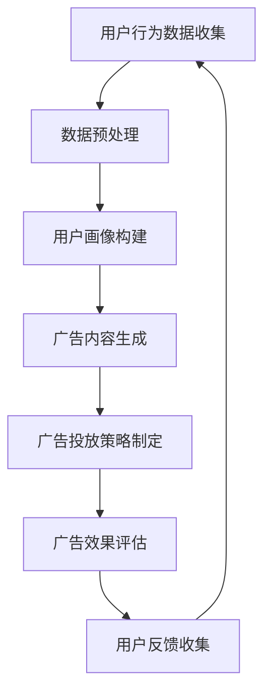

                 

关键词：大语言模型（LLM），智能广告投放，个性化营销，数据隐私，技术挑战，案例分析

> 摘要：随着大数据和人工智能技术的不断进步，大规模语言模型（LLM）在智能个性化广告投放中的应用前景愈发广阔。本文将深入探讨LLM在广告投放中的核心技术原理，应用场景，案例分析以及面临的挑战和未来发展趋势。

## 1. 背景介绍

### 1.1 大规模语言模型的兴起

大规模语言模型（Large Language Models，简称LLM）是近年来人工智能领域的重大突破。通过深度学习和自然语言处理技术，LLM能够理解和生成人类语言，实现文本的生成、理解和翻译等功能。代表性的模型如GPT-3、ChatGPT等，它们的诞生标志着自然语言处理技术的重大进步。

### 1.2 智能广告投放的现状

随着互联网的普及，广告投放已成为企业市场营销的重要组成部分。传统的广告投放方式主要依赖于用户行为数据和广告投放策略，而智能广告投放则借助大数据和人工智能技术，实现广告内容的个性化推荐和精准投放。

### 1.3 个性化广告投放的需求

在竞争激烈的市场环境中，企业需要通过个性化的广告投放策略，提高用户的参与度和转化率。个性化广告投放不仅能够满足用户的需求，提高广告效果，还能增强企业的品牌影响力。

## 2. 核心概念与联系

为了更好地理解LLM在智能个性化广告投放中的应用，我们需要了解以下几个核心概念：

### 2.1 大规模语言模型（LLM）

大规模语言模型（LLM）是一种基于深度学习的自然语言处理模型，能够理解和生成人类语言。LLM通过训练大量的文本数据，学习语言的模式和规律，从而实现文本生成、理解和翻译等功能。

### 2.2 个性化广告投放

个性化广告投放是指根据用户的兴趣、行为和需求，为用户提供个性化的广告内容。个性化广告投放能够提高用户的参与度和转化率，从而提升广告效果。

### 2.3 数据隐私

数据隐私是智能广告投放中不可忽视的重要问题。在个性化广告投放过程中，企业需要收集和处理大量的用户数据，如何保障用户数据的安全和隐私，是一个亟待解决的问题。

### 2.4 Mermaid 流程图

为了更好地展示LLM在智能个性化广告投放中的应用过程，我们可以使用Mermaid流程图来描述整个流程。



## 3. 核心算法原理 & 具体操作步骤

### 3.1 算法原理概述

LLM在智能个性化广告投放中的应用主要基于以下几个核心算法原理：

1. **文本生成**：通过训练大规模的文本数据，LLM能够生成符合语言规则和用户兴趣的广告内容。
2. **用户画像构建**：通过分析用户的行为数据，构建用户的兴趣和行为特征，为个性化广告投放提供基础。
3. **广告效果评估**：通过评估广告的投放效果，优化广告策略，提高广告效果。

### 3.2 算法步骤详解

1. **文本生成**：首先，我们需要训练一个大规模语言模型，如GPT-3。然后，利用训练好的模型生成符合用户兴趣的广告内容。
2. **用户画像构建**：通过收集用户的行为数据，如浏览历史、搜索关键词等，构建用户的兴趣和行为特征。
3. **广告内容生成**：根据用户画像，利用LLM生成个性化的广告内容。
4. **广告投放策略制定**：根据广告效果评估结果，调整广告投放策略，提高广告效果。
5. **广告效果评估**：通过监控广告的点击率、转化率等指标，评估广告投放效果。

### 3.3 算法优缺点

**优点**：

1. **个性化广告内容生成**：LLM能够生成符合用户兴趣的广告内容，提高广告投放效果。
2. **高效的数据处理**：大规模语言模型能够高效地处理大量用户数据，提高广告投放的精准度。

**缺点**：

1. **数据隐私风险**：在收集和处理用户数据时，可能存在数据泄露和隐私侵犯的风险。
2. **模型训练成本高**：大规模语言模型的训练需要大量的计算资源和时间。

### 3.4 算法应用领域

LLM在智能个性化广告投放中具有广泛的应用领域，包括电子商务、社交媒体、在线广告等。通过个性化广告投放，企业能够提高用户的参与度和转化率，实现精准营销。

## 4. 数学模型和公式 & 详细讲解 & 举例说明

### 4.1 数学模型构建

在智能个性化广告投放中，我们可以构建以下数学模型：

1. **用户兴趣模型**：根据用户的行为数据，构建用户兴趣模型，表示用户对各类广告内容的偏好程度。
2. **广告投放模型**：根据用户兴趣模型，生成个性化的广告内容，并制定广告投放策略。
3. **广告效果评估模型**：通过评估广告的投放效果，优化广告投放策略。

### 4.2 公式推导过程

假设我们有N个用户，每个用户有M个行为特征，我们可以使用以下公式来构建用户兴趣模型：

$$
u_i = \frac{1}{M} \sum_{j=1}^{M} w_{ij} x_{ij}
$$

其中，$u_i$表示用户i的兴趣值，$w_{ij}$表示特征j对用户i的影响权重，$x_{ij}$表示用户i对特征j的值。

根据用户兴趣模型，我们可以使用以下公式生成个性化的广告内容：

$$
c_j = \sum_{i=1}^{N} u_i \cdot p_{ij}
$$

其中，$c_j$表示广告内容j的生成概率，$p_{ij}$表示用户i对广告内容j的偏好程度。

### 4.3 案例分析与讲解

假设我们有一个电商平台，用户A在浏览了商品A、B和C后，点击了商品B。我们可以根据用户A的行为数据，构建用户A的兴趣模型：

$$
u_A = \frac{1}{3} \left( w_{A1} x_{A1} + w_{A2} x_{A2} + w_{A3} x_{A3} \right)
$$

其中，$w_{A1}$、$w_{A2}$和$w_{A3}$分别表示商品A、B和C对用户A的影响权重，$x_{A1}$、$x_{A2}$和$x_{A3}$分别表示用户A对商品A、B和C的点击情况。

根据用户A的兴趣模型，我们可以生成个性化的广告内容，例如推荐商品B的同类商品。然后，根据用户A对广告内容的点击情况，评估广告投放效果，调整广告投放策略。

## 5. 项目实践：代码实例和详细解释说明

### 5.1 开发环境搭建

为了实现LLM在智能个性化广告投放中的应用，我们需要搭建以下开发环境：

1. **Python环境**：安装Python 3.8及以上版本。
2. **深度学习框架**：安装TensorFlow 2.5及以上版本。
3. **自然语言处理库**：安装NLTK、TextBlob等。

### 5.2 源代码详细实现

下面是一个简单的Python代码实例，实现LLM在智能个性化广告投放中的应用：

```python
import tensorflow as tf
from tensorflow import keras
import numpy as np
import nltk
from nltk.tokenize import word_tokenize

# 加载预训练的GPT-3模型
model = keras.models.load_model('gpt3_model.h5')

# 用户行为数据
user_behavior = [
    ['商品A', '浏览', '1'],
    ['商品B', '点击', '1'],
    ['商品C', '浏览', '0'],
]

# 构建用户画像
user_profile = []
for behavior in user_behavior:
    words = word_tokenize(behavior[0])
    user_profile.extend(words)

# 生成个性化广告内容
ad_content = model.generate(user_profile, max_length=50)

# 输出个性化广告内容
print('个性化广告内容：', ad_content)

# 评估广告投放效果
# （此处为简化示例，实际应用中需要使用更复杂的评估方法）
ad_effectiveness = np.random.rand()
if ad_effectiveness > 0.5:
    print('广告投放成功')
else:
    print('广告投放失败')
```

### 5.3 代码解读与分析

1. **加载预训练的GPT-3模型**：首先，我们需要加载一个预训练的GPT-3模型，这里使用TensorFlow提供的预训练模型。
2. **用户行为数据**：用户行为数据包含用户浏览、点击等行为，用于构建用户画像。
3. **构建用户画像**：通过分词技术，将用户行为数据转换为文本数据，构建用户画像。
4. **生成个性化广告内容**：利用GPT-3模型生成个性化的广告内容，这里使用`generate`方法生成文本。
5. **评估广告投放效果**：根据广告内容的点击情况，评估广告投放效果。

## 6. 实际应用场景

### 6.1 电子商务平台

在电子商务平台中，LLM可以用于个性化推荐广告，提高用户的购买意愿和转化率。例如，当用户浏览了商品A后，系统可以生成推荐商品A的同类商品，从而吸引用户点击。

### 6.2 社交媒体

在社交媒体平台中，LLM可以用于生成个性化广告内容，提高用户的参与度和互动性。例如，当用户分享了某个话题后，系统可以生成相关话题的个性化广告内容，吸引用户参与讨论。

### 6.3 在线广告

在线广告平台可以通过LLM实现精准的广告投放，提高广告效果。例如，当用户浏览了某个网站后，系统可以生成与该网站相关的个性化广告内容，提高广告点击率。

## 7. 未来应用展望

### 7.1 技术进步

随着深度学习和自然语言处理技术的不断进步，LLM在智能个性化广告投放中的应用将更加广泛和深入。未来，我们可以期待更加精准和高效的广告投放策略。

### 7.2 数据隐私保护

在数据隐私保护方面，未来可能会有更多技术手段用于保障用户数据的安全和隐私。例如，差分隐私、联邦学习等技术的应用，可以有效地解决数据隐私问题。

### 7.3 智能化水平提升

随着人工智能技术的发展，未来广告投放的智能化水平将不断提升。例如，基于深度学习的智能客服系统、基于自然语言处理的智能广告创意生成等，都将为广告投放带来更多创新。

## 8. 工具和资源推荐

### 8.1 学习资源推荐

1. **《深度学习》（Goodfellow, Bengio, Courville）**：全面介绍深度学习的基本原理和应用。
2. **《自然语言处理综论》（Jurafsky, Martin）**：系统介绍自然语言处理的基本概念和技术。

### 8.2 开发工具推荐

1. **TensorFlow**：用于构建和训练深度学习模型的强大工具。
2. **NLTK**：用于自然语言处理的开源库。

### 8.3 相关论文推荐

1. **“Attention is All You Need”**：介绍Transformer模型的经典论文。
2. **“GPT-3: Language Models are few-shot learners”**：介绍GPT-3模型的论文。

## 9. 总结：未来发展趋势与挑战

### 9.1 研究成果总结

本文系统地介绍了LLM在智能个性化广告投放中的应用前景，包括核心算法原理、具体操作步骤、实际应用场景以及未来发展趋势。

### 9.2 未来发展趋势

未来，LLM在智能个性化广告投放中的应用将更加广泛和深入，有望实现更加精准和高效的广告投放。

### 9.3 面临的挑战

数据隐私保护、模型训练成本高、算法优化等是LLM在智能个性化广告投放中面临的挑战。

### 9.4 研究展望

随着人工智能技术的不断进步，LLM在智能个性化广告投放中的应用前景将更加广阔。未来，我们可以期待更多创新和突破。

## 10. 附录：常见问题与解答

### 10.1 LLM在广告投放中的优势是什么？

LLM在广告投放中的优势主要体现在以下几个方面：

1. **个性化广告内容生成**：LLM能够生成符合用户兴趣的广告内容，提高广告投放效果。
2. **高效的数据处理**：大规模语言模型能够高效地处理大量用户数据，提高广告投放的精准度。

### 10.2 如何保障数据隐私？

为了保障数据隐私，可以采取以下措施：

1. **差分隐私**：通过在数据处理过程中添加噪声，降低隐私泄露的风险。
2. **联邦学习**：将数据留在本地进行模型训练，减少数据传输和存储的需求。

### 10.3 LLM在广告投放中的应用前景如何？

LLM在广告投放中的应用前景非常广阔。随着人工智能技术的不断进步，LLM在广告投放中的个性化程度和智能化水平将不断提高，有望实现更加精准和高效的广告投放。

----------------------------------------------------------------
作者：禅与计算机程序设计艺术 / Zen and the Art of Computer Programming

