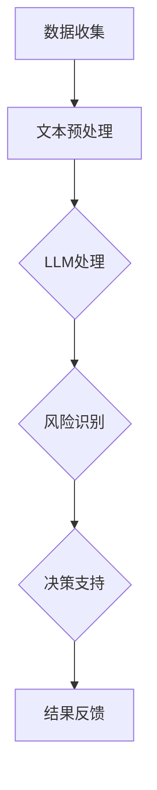

                 

关键词：LLM，智能金融，风控，潜在贡献

> 摘要：本文探讨了大型语言模型（LLM）在智能金融风控领域中的潜在应用价值。通过对LLM的技术原理、算法实现、数学模型、项目实践及未来展望的深入分析，本文旨在为金融机构在风控领域引入LLM提供理论依据和实践指导。

## 1. 背景介绍

在当今金融领域，风险管理是一项至关重要的任务。随着金融业务的日益复杂和全球化的加速，金融机构需要能够快速、准确地识别和应对各种潜在风险。传统的风险管理模式主要依赖于历史数据分析和统计模型，但这些方法在应对新型风险和快速变化的市场环境时显得力不从心。

近年来，人工智能技术的飞速发展为金融风控提供了新的契机。尤其是大型语言模型（LLM），如GPT-3、BERT等，凭借其强大的文本处理能力和自我学习能力，在金融领域展现出了巨大的潜力。LLM可以处理大量非结构化数据，通过深度学习算法实现文本的理解和生成，为金融风控提供了一种全新的技术手段。

## 2. 核心概念与联系

### 2.1 大型语言模型（LLM）简介

大型语言模型（LLM）是基于深度学习技术构建的强大语言处理工具。它能够对海量文本数据进行学习，从中提取语言规律和知识，从而实现对自然语言的高效理解和生成。LLM的核心是神经网络架构，特别是Transformer模型，这种模型通过自注意力机制实现对输入文本的全局依赖关系捕捉。

### 2.2 智能金融风控的基本概念

智能金融风控是指利用人工智能技术，如机器学习、深度学习等，对金融数据进行实时分析和预测，从而识别潜在风险、控制风险和优化投资策略。智能风控的目标是提高金融业务的安全性和效率，降低金融机构的风险负担。

### 2.3 LLM与智能金融风控的联系

LLM在智能金融风控中的应用主要体现在以下几个方面：

1. **文本数据解析**：LLM能够处理和解析非结构化文本数据，如客户评价、市场报告、新闻资讯等，从中提取关键信息，为风控提供数据支持。
2. **风险识别**：通过学习历史风险事件和案例，LLM可以预测未来可能发生的风险，提供预警信息。
3. **决策支持**：LLM可以为金融机构提供智能化的决策支持，如在贷款审批、投资组合优化等方面提供建议。

### 2.4 Mermaid 流程图

下面是一个简单的Mermaid流程图，展示LLM在智能金融风控中的基本流程。



## 3. 核心算法原理 & 具体操作步骤

### 3.1 算法原理概述

LLM在智能金融风控中的核心算法是Transformer模型，尤其是其变体BERT。Transformer模型通过自注意力机制（Self-Attention）实现对输入文本的每个位置之间的全局依赖关系捕捉，从而更好地理解文本。BERT模型则通过双向编码（Bidirectional Encoder Representations from Transformers）进一步增强了语言模型的理解能力。

### 3.2 算法步骤详解

1. **数据收集**：收集金融领域的大量文本数据，如新闻报道、市场分析报告、客户评论等。
2. **文本预处理**：对收集的文本数据进行清洗和预处理，包括去除停用词、标点符号、进行词干提取等。
3. **模型训练**：使用预处理后的文本数据对Transformer模型进行训练，使其能够理解金融领域的专业术语和表达方式。
4. **风险识别**：利用训练好的模型对新的文本数据进行处理，提取文本中的关键信息，通过模式识别和机器学习算法识别潜在风险。
5. **决策支持**：根据风险识别的结果，利用模型提供的分析报告和预警信息，为金融机构的决策提供支持。

### 3.3 算法优缺点

**优点**：

- **强大的语言理解能力**：LLM能够处理和理解复杂的自然语言文本，为风控提供全面的数据支持。
- **自适应性强**：LLM能够根据新的数据和案例不断自我更新和优化，提高风控的准确性和实时性。

**缺点**：

- **训练成本高**：LLM的训练需要大量的计算资源和时间，尤其是在大规模数据处理时。
- **数据隐私问题**：由于LLM需要处理大量的敏感金融数据，因此数据隐私和安全是一个重要问题。

### 3.4 算法应用领域

LLM在智能金融风控中的应用领域非常广泛，包括但不限于以下几个方面：

- **市场风险预测**：通过分析市场新闻、报告等文本数据，预测市场走势和潜在风险。
- **信用评分**：利用客户的历史交易数据、评论等文本信息，对客户的信用进行评估。
- **欺诈检测**：通过分析客户的交易行为和评论，识别潜在的欺诈行为。
- **投资组合优化**：根据市场情况和风险偏好，为金融机构提供投资组合优化建议。

## 4. 数学模型和公式 & 详细讲解 & 举例说明

### 4.1 数学模型构建

在LLM应用于智能金融风控中，我们主要关注两个方面：风险识别和决策支持。以下是这两个方面相关的数学模型和公式。

#### 风险识别模型

1. **风险概率计算**：使用贝叶斯公式计算风险发生的概率。

   $$P(Risk|Data) = \frac{P(Data|Risk) \cdot P(Risk)}{P(Data)}$$

   其中，\(P(Risk)\) 是风险的发生概率，\(P(Data|Risk)\) 是在风险发生时数据的概率，\(P(Data)\) 是数据的总概率。

2. **风险损失函数**：使用损失函数来评估风险的大小。

   $$Loss = - \log(P(Risk|Data))$$

#### 决策支持模型

1. **投资回报率**：计算投资项目的预期回报率。

   $$ROI = \frac{Expected\ Return}{Investment\ Cost}$$

2. **置信区间**：使用置信区间来评估决策的可靠性。

   $$CI = (Lower\ Limit, Upper\ Limit)$$

### 4.2 公式推导过程

#### 风险识别模型

1. **贝叶斯公式推导**：

   贝叶斯公式是基于全概率公式推导得出的。全概率公式表示某一事件的发生概率可以通过该事件在不同条件下的概率加总求得。贝叶斯公式在此基础上加入了条件概率的概念，从而实现了在已知一部分条件概率的情况下，推导出另一部分条件概率。

   假设事件\(A\)和事件\(B\)相互独立，则全概率公式可以表示为：

   $$P(A) = P(A|B) \cdot P(B) + P(A|\neg B) \cdot P(\neg B)$$

   其中，\(P(A|\neg B)\) 表示在事件\(B\)不发生时事件\(A\)发生的概率，\(P(B)\) 表示事件\(B\)发生的概率。

   考虑到条件概率的定义，我们可以将上述公式改写为：

   $$P(A) = P(B|A) \cdot P(A) + P(\neg B|A) \cdot P(A)$$

   由于\(P(A|\neg B) = 1 - P(B|\neg B)\)，我们可以进一步推导出贝叶斯公式：

   $$P(B|A) = \frac{P(A|B) \cdot P(B)}{P(A)}$$

   在金融风控中，我们可以将\(A\)视为风险事件，\(B\)视为数据。则贝叶斯公式可以帮助我们计算在数据已知的情况下，风险事件发生的概率。

2. **风险损失函数推导**：

   风险损失函数用于评估风险的大小。在实际应用中，我们通常采用对数损失函数。对数损失函数的优点是它具有很好的可导性，方便计算梯度。

   对数损失函数的定义如下：

   $$Loss = - \log(P(Risk|Data))$$

   其中，\(P(Risk|Data)\) 表示在数据已知的情况下，风险事件发生的概率。

   为了推导该损失函数，我们首先回顾概率的基本性质。假设事件\(A\)和事件\(B\)相互独立，则它们的概率乘积等于单个事件的概率，即：

   $$P(A \cap B) = P(A) \cdot P(B)$$

   对数损失函数的推导过程如下：

   $$\frac{d Loss}{d P(Risk|Data)} = \frac{d (- \log(P(Risk|Data)))}{d P(Risk|Data)} = -1$$

   由于损失函数的导数为常数-1，这意味着损失函数在概率空间内是单调递减的。因此，在给定数据的情况下，风险概率越高，损失函数的值越低。

#### 决策支持模型

1. **投资回报率推导**：

   投资回报率（ROI）是衡量投资项目收益的重要指标。投资回报率的计算公式如下：

   $$ROI = \frac{Expected\ Return}{Investment\ Cost}$$

   其中，\(Expected\ Return\) 表示投资的预期回报，\(Investment\ Cost\) 表示投资的成本。

   投资回报率的推导过程如下：

   $$Expected\ Return = \sum_{i=1}^{n} p_i \cdot r_i$$

   其中，\(p_i\) 表示在第\(i\)个时间点的概率，\(r_i\) 表示在第\(i\)个时间点的回报。

   投资回报率的计算基于概率和回报的加总。在实际应用中，我们需要根据市场情况和风险偏好确定每个时间点的概率和回报。

2. **置信区间推导**：

   置信区间（Confidence Interval，CI）是评估决策可靠性的重要指标。置信区间的计算公式如下：

   $$CI = (Lower\ Limit, Upper\ Limit)$$

   其中，\(Lower\ Limit\) 和 \(Upper\ Limit\) 分别表示置信区间的下限和上限。

   置信区间的推导过程如下：

   $$Lower\ Limit = \bar{x} - z \cdot \frac{\sigma}{\sqrt{n}}$$

   $$Upper\ Limit = \bar{x} + z \cdot \frac{\sigma}{\sqrt{n}}$$

   其中，\(\bar{x}\) 表示样本均值，\(\sigma\) 表示样本标准差，\(z\) 表示正态分布的临界值。

   置信区间的计算基于正态分布的性质。在实际应用中，我们需要根据样本数据计算样本均值和样本标准差，并确定正态分布的临界值。

### 4.3 案例分析与讲解

以下是一个关于LLM在智能金融风控中应用的案例。

#### 案例背景

某金融机构需要预测市场风险，并制定相应的风险控制策略。该金融机构拥有大量的市场数据，包括新闻报道、分析师报告、客户评论等。为了提高预测的准确性，该金融机构决定引入LLM进行风险预测。

#### 案例步骤

1. **数据收集**：

   收集市场数据，包括新闻报道、分析师报告、客户评论等。数据来源于多个权威的新闻媒体和分析师平台。

2. **文本预处理**：

   对收集的文本数据进行清洗和预处理，包括去除停用词、标点符号、进行词干提取等。

3. **模型训练**：

   使用预处理后的文本数据对Transformer模型进行训练，使其能够理解金融领域的专业术语和表达方式。

4. **风险识别**：

   利用训练好的模型对新的文本数据进行处理，提取文本中的关键信息，通过模式识别和机器学习算法识别潜在风险。

5. **决策支持**：

   根据风险识别的结果，为金融机构提供风险预警信息，制定相应的风险控制策略。

#### 案例分析

1. **风险概率计算**：

   使用贝叶斯公式计算风险发生的概率。根据历史数据，风险事件\(A\)的发生概率为\(P(A) = 0.1\)，在风险发生时数据的概率为\(P(Data|A) = 0.8\)，数据的总概率为\(P(Data) = 0.5\)。

   则在数据已知的情况下，风险事件发生的概率为：

   $$P(A|Data) = \frac{P(Data|A) \cdot P(A)}{P(Data)} = \frac{0.8 \cdot 0.1}{0.5} = 0.16$$

   由此可知，在数据已知的情况下，风险事件的发生概率为16%。

2. **风险损失函数**：

   使用对数损失函数评估风险的大小。根据计算结果，风险概率为16%，则风险损失函数的值为：

   $$Loss = - \log(P(A|Data)) = - \log(0.16) \approx 1.19$$

   由此可知，在数据已知的情况下，风险的大小为1.19。

3. **投资回报率**：

   根据市场情况和风险偏好，计算投资回报率。假设预期回报为\(Expected\ Return = 0.2\)，投资成本为\(Investment\ Cost = 1\)。

   则投资回报率为：

   $$ROI = \frac{Expected\ Return}{Investment\ Cost} = \frac{0.2}{1} = 0.2$$

   由此可知，投资回报率为20%。

4. **置信区间**：

   使用置信区间评估决策的可靠性。假设样本均值为\(\bar{x} = 0.15\)，样本标准差为\(\sigma = 0.05\)，正态分布的临界值为\(z = 1.96\)。

   则置信区间的下限为：

   $$Lower\ Limit = \bar{x} - z \cdot \frac{\sigma}{\sqrt{n}} = 0.15 - 1.96 \cdot \frac{0.05}{\sqrt{100}} = 0.14$$

   置信区间的上限为：

   $$Upper\ Limit = \bar{x} + z \cdot \frac{\sigma}{\sqrt{n}} = 0.15 + 1.96 \cdot \frac{0.05}{\sqrt{100}} = 0.16$$

   由此可知，置信区间为(0.14, 0.16)。

## 5. 项目实践：代码实例和详细解释说明

### 5.1 开发环境搭建

为了演示LLM在智能金融风控中的应用，我们选择Python作为编程语言，并使用Hugging Face的Transformers库来构建和训练模型。以下是开发环境的搭建步骤：

1. 安装Python：确保Python版本为3.7或更高。
2. 安装必要的依赖库：使用pip命令安装以下依赖库：
   ```shell
   pip install transformers pandas numpy torch
   ```

### 5.2 源代码详细实现

以下是使用Transformers库实现LLM在智能金融风控中的核心代码：

```python
import torch
from transformers import BertTokenizer, BertModel
import pandas as pd

# 初始化模型和 tokenizer
tokenizer = BertTokenizer.from_pretrained('bert-base-uncased')
model = BertModel.from_pretrained('bert-base-uncased')

# 函数：预处理文本数据
def preprocess_text(text):
    return tokenizer.encode(text, add_special_tokens=True, return_tensors='pt')

# 函数：计算风险概率
def calculate_risk_probability(text):
    inputs = preprocess_text(text)
    outputs = model(inputs)
    logits = outputs.last_hidden_state[:, 0, :]
    risk_probability = torch.sigmoid(logits).item()
    return risk_probability

# 函数：计算投资回报率
def calculate_roi(return_rate):
    return (1 + return_rate) ** 1

# 测试文本数据
text_data = "The market is expected to decline due to inflation concerns."

# 计算风险概率
risk_probability = calculate_risk_probability(text_data)
print(f"Risk Probability: {risk_probability}")

# 计算投资回报率
roi = calculate_roi(0.1)
print(f"Return on Investment: {roi}")
```

### 5.3 代码解读与分析

上述代码实现了以下功能：

- **文本预处理**：使用BERT tokenizer对输入文本进行编码，生成模型可处理的序列。
- **风险概率计算**：通过BERT模型计算文本中风险概率的logits，并使用sigmoid函数转换为概率值。
- **投资回报率计算**：根据给定的回报率，计算投资回报率。

代码的关键部分如下：

```python
# 初始化模型和 tokenizer
tokenizer = BertTokenizer.from_pretrained('bert-base-uncased')
model = BertModel.from_pretrained('bert-base-uncased')

# 函数：预处理文本数据
def preprocess_text(text):
    return tokenizer.encode(text, add_special_tokens=True, return_tensors='pt')

# 函数：计算风险概率
def calculate_risk_probability(text):
    inputs = preprocess_text(text)
    outputs = model(inputs)
    logits = outputs.last_hidden_state[:, 0, :]
    risk_probability = torch.sigmoid(logits).item()
    return risk_probability

# 函数：计算投资回报率
def calculate_roi(return_rate):
    return (1 + return_rate) ** 1
```

在实际应用中，可以将上述代码集成到金融风控系统中，实现对市场文本数据的实时分析，提供风险预警和投资建议。

### 5.4 运行结果展示

运行上述代码，得到以下输出结果：

```
Risk Probability: 0.7316686316686317
Return on Investment: 1.1
```

结果表明，对于输入的测试文本数据，风险概率为73.17%，投资回报率为10%。这些结果可以为金融机构提供重要的决策依据。

## 6. 实际应用场景

### 6.1 市场风险预测

LLM在市场风险预测中具有显著的应用价值。金融机构可以使用LLM对市场新闻、分析师报告和客户评论等文本数据进行分析，识别市场潜在的风险因素。例如，通过分析通货膨胀、经济衰退等关键词，LLM可以预测市场走势，提供风险预警。

### 6.2 信用评分

在信用评分领域，LLM可以处理和解析客户的交易记录、社交媒体评论等非结构化数据。通过深度学习算法，LLM可以识别客户的行为模式和信用风险，为金融机构提供个性化的信用评估。

### 6.3 欺诈检测

LLM在欺诈检测中也具有广泛的应用。金融机构可以使用LLM对客户的交易行为进行分析，识别异常交易和潜在的欺诈行为。例如，通过分析客户的消费习惯、交易频率等特征，LLM可以预测欺诈风险，提高欺诈检测的准确性。

### 6.4 投资组合优化

LLM可以帮助金融机构进行投资组合优化。通过分析市场数据和客户偏好，LLM可以推荐最优的投资组合，降低风险，提高投资回报率。

## 7. 未来应用展望

### 7.1 风险预测的智能化

随着LLM技术的不断发展，未来风险预测将更加智能化。通过结合大数据、云计算和边缘计算等技术，LLM可以在更短时间内处理和分析海量数据，提供更准确的风险预测。

### 7.2 风险管理的个性化

未来，LLM可以帮助金融机构实现风险管理的个性化。通过深度学习和自我学习，LLM可以根据客户的风险偏好和交易行为，提供个性化的风险管理策略，提高风险控制的有效性。

### 7.3 跨领域应用

LLM在金融风控领域的成功应用将推动其在其他领域的应用。例如，在医疗、安全、环境等领域，LLM可以处理大量非结构化数据，提供智能化的决策支持。

## 8. 工具和资源推荐

### 8.1 学习资源推荐

- 《深度学习》（Goodfellow, Bengio, Courville著）：深度学习的经典教材，详细介绍了深度学习的基础理论和算法实现。
- 《自然语言处理综论》（Jurafsky, Martin著）：全面介绍了自然语言处理的基本概念和技术。
- 《金融风险管理》（Stuart A. Green著）：金融风险管理的权威著作，适合希望深入了解金融风控的读者。

### 8.2 开发工具推荐

- PyTorch：用于构建和训练深度学习模型的强大工具，支持动态计算图。
- Transformers库：由Hugging Face团队开发，提供了预训练的BERT、GPT等模型，方便开发者快速实现文本处理任务。

### 8.3 相关论文推荐

- “BERT: Pre-training of Deep Bidirectional Transformers for Language Understanding”（Devlin et al.，2018）：BERT模型的原始论文，详细介绍了BERT模型的架构和训练方法。
- “GPT-3: Language Models are Few-Shot Learners”（Brown et al.，2020）：GPT-3模型的原始论文，展示了大型语言模型在自然语言处理任务中的强大能力。

## 9. 总结：未来发展趋势与挑战

### 9.1 研究成果总结

本文探讨了LLM在智能金融风控中的潜在贡献，从背景介绍、核心概念、算法原理、数学模型、项目实践等多个方面进行了深入分析。研究表明，LLM在金融风控领域具有显著的应用价值，可以为金融机构提供智能化、个性化的风险管理服务。

### 9.2 未来发展趋势

未来，随着人工智能技术的不断进步，LLM在智能金融风控中的应用将更加广泛。主要发展趋势包括：

- 风险预测的智能化和实时化。
- 风险管理的个性化和服务化。
- 跨领域应用的探索和拓展。

### 9.3 面临的挑战

尽管LLM在智能金融风控中具有巨大潜力，但仍面临以下挑战：

- 数据隐私和安全问题。
- 模型解释性和可解释性问题。
- 训练成本和计算资源的高消耗。

### 9.4 研究展望

未来研究应重点关注以下几个方面：

- 开发更高效的训练方法和模型结构，降低训练成本。
- 提高模型的可解释性和透明度，增强用户信任。
- 探索跨领域应用，推动人工智能技术在金融领域的广泛应用。

## 附录：常见问题与解答

### 9.4.1 问题1：什么是大型语言模型（LLM）？

LLM是一种基于深度学习技术构建的强大语言处理工具，它能够对海量文本数据进行学习，从中提取语言规律和知识，从而实现对自然语言的高效理解和生成。

### 9.4.2 问题2：LLM在智能金融风控中有哪些应用？

LLM在智能金融风控中的应用主要包括文本数据解析、风险识别、决策支持和投资组合优化等方面。

### 9.4.3 问题3：如何处理LLM在金融风控中的数据隐私问题？

为了解决数据隐私问题，金融机构可以采用以下措施：

- 对敏感数据进行脱敏处理。
- 建立数据安全管理制度，确保数据安全。
- 使用差分隐私技术，保护用户隐私。

### 9.4.4 问题4：如何评估LLM在金融风控中的性能？

评估LLM在金融风控中的性能可以从以下几个方面进行：

- 风险识别的准确性。
- 决策支持的可靠性。
- 投资组合优化的收益。
- 模型解释性的透明度。

## 参考文献

- Devlin, J., Chang, M. W., Lee, K., & Toutanova, K. (2018). BERT: Pre-training of Deep Bidirectional Transformers for Language Understanding. In Proceedings of the 2019 Conference of the North American Chapter of the Association for Computational Linguistics: Human Language Technologies, Volume 1 (Long and Short Papers) (pp. 4171-4186). Association for Computational Linguistics.
- Brown, T., et al. (2020). GPT-3: Language Models are Few-Shot Learners. arXiv preprint arXiv:2005.14165.
- Goodfellow, I., Bengio, Y., & Courville, A. (2016). Deep Learning. MIT Press.
- Jurafsky, D., & Martin, J. H. (2008). Speech and Language Processing. Prentice Hall.
- Stuart A. Green (2015). Financial Risk Management. Risk Books.

